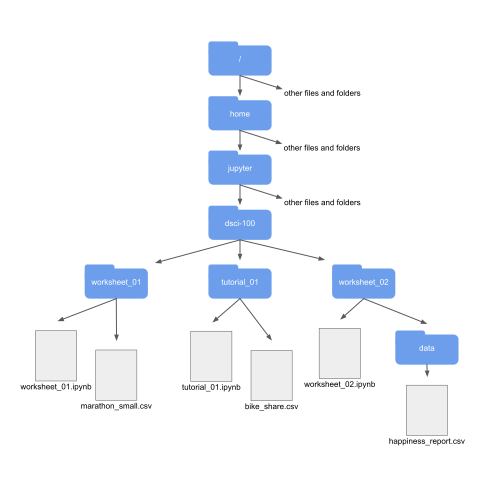
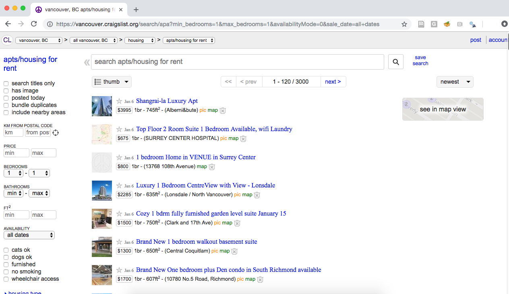

# Reading in data locally and from the web {#reading}

## Overview 

In this chapter, you’ll learn to read spreadsheet-like data of various formats into R from your local device and the web. “Reading” (or “loading”) is the process of converting data (stored as plain text, a database, HTML, etc.) into an object (e.g., a data frame) that R can easily access and manipulate. Thus reading data is the gateway to any data analysis; you won’t be able to analyze data unless you’ve loaded it first. And because there are many ways to store data, there are similarly many ways to read data into R. The more time you spend upfront matching the data reading method to the type of data you have, the less time you will have to devote to re-formatting, cleaning and wrangling your data (the second step to all data analyses). It’s like making sure your shoelaces are tied well before going for a run so that you don’t trip later on!

## Chapter learning objectives
By the end of the chapter, students will be able to:

- define the following:
    - absolute file path
    - relative file path
    - url
- read data into R using a relative path and a url
- compare and contrast the following functions:
    - `read_csv` 
    - `read_tsv`
    - `read_csv2`
    - `read_delim`
    - `read_excel`
- match the following `tidyverse` `read_*` function arguments to their descriptions:
    - `file` 
    - `delim`
    - `col_names`
    - `skip`
- choose the appropriate `tidyverse` `read_*` function and function arguments to load a given plain text tabular data set into R
- use `readxl` library's `read_excel` function and arguments to load a sheet from an excel file into R
- connect to a database using the `DBI` library's `dbConnect` function
- list the tables in a database using the `DBI` library's `dbListTables` function
- create a reference to a database table that is queriable using the `tbl` from the `dbplyr` library
- retrieve data from a database query and bring it into R using the `collect` function from the `dbplyr` library
- use `write_csv` to save a data frame to a `.csv` file

- (*optional*) scrape data from the web
    - read/scrape data from an internet URL using the rvest `html_nodes` and `html_text` functions
    - compare downloading tabular data from a plain text file (e.g. `.csv`) from the web versus scraping data from a `.html` file

## Absolute and relative file paths

When you load a data set into R, you first need to tell R where those files live. The file could live on your 
computer (*local*) or somewhere on the internet (*remote*). In this section, we will discuss the case where the file lives on your computer.

The place where the file lives on your computer is called the "path". You can think of the path as directions to the file. There are two kinds of 
paths: relative paths and absolute paths. A relative path is where the file is with respect to where you currently are on the computer (e.g., where the 
Jupyter notebook file that you're working in is). On the other hand, an absolute path is where the file is in respect to the base (or root) folder of 
the computer's filesystem.

Suppose our computer's filesystem looks like the picture below, and we are working in the Jupyter notebook titled `worksheetk_02.ipynb`. If we want to 
read in the `.csv` file named `happiness_report.csv` into our Jupyter notebook using R, we could do this using either a relative or an absolute path. 
We show both choices below.

```{r 11-population-vs-sample, echo = FALSE, message = FALSE, warning = FALSE, fig.cap = "Example file system", fig.retina = 2, out.width="840"}

```

**Reading `happiness_report.csv` using a relative path:**

```
happiness_data <- read_csv("data/happiness_report.csv")
```

**Reading `happiness_report.csv` using an absolute path:**

```
happiness_data <- read_csv("/home/jupyter/dsci-100/worksheet_02/data/happiness_report.csv")
```

So which one should you use? Generally speaking, to ensure your code can be run on a different computer, you should use relative paths (and it's also less typing!). 
This is because the absolute path of a file (the names of folders between the computer's root `/` and the file) isn't usually the same across multiple computers. 
For example, suppose Alice and Bob are working on a project together
on the `happiness_report.csv` data. Alice's file is stored at 

`/home/alice/project/data/happiness_report.csv`, 

while Bob's is stored at 

`/home/bob/project/data/happiness_report.csv`.
 
Even though Alice and Bob stored their files in the same place on their computers (in their home folders), the absolute paths are different due to their different usernames.
If Bob has code that loads the `happiness_report.csv` data using an absolute path, the code won't work on Alice's computer.
But the relative path from inside the `project` folder (`data/happiness_report.csv`) is the same on both computers; any code that uses relative paths will work on both!

<!--Why would the absolute path not work on a different computer? The reason for this is that the names and the folder structure of the path between a computer's root 
folder (named `/`) and any files and folders you are usually working with will be different depending on who owns the computer (usually there is a different user name 
on each computer) and where the files and folders happen to be located on that particular computer. -->

See this video for another explanation: 

<iframe width="840" height="473" src="https://www.youtube.com/embed/ephId3mYu9o" frameborder="0" allow="accelerometer; autoplay; encrypted-media; gyroscope; picture-in-picture" allowfullscreen></iframe>

*Source: [Udacity course "Linux Command Line Basics"](https://www.udacity.com/course/linux-command-line-basics--ud595)*

## Reading tabular data from a plain text file into R

Now we will learn more about reading tabular data from a plain text file into R, as well as how to write tabular data to a file. 
Last chapter, we learned about using the `tidyverse` `read_csv` function when reading files that match that function's expected defaults 
(column names are present, and commas are used as the delimiter/separator between columns). In this section, we will learn how to read 
files do not satisfy the default expectations of `read_csv`. 

Before we jump into the cases where the data aren't in the expected default format for `tidyverse` and `read_csv`, let's revisit the more straightforward
case where the defaults hold, and the only argument we need to give to the function is the path to the file, `data/can_lang.csv`. The `can_lang` data set contains data from the 2016 Canadian census on counts of Canadian languages. We put `data/` before the file's name when we are loading the data set because this data set is located in a sub-folder, named `data`, relative to where we are running our R code.

Here is what the file would look like in a plain text editor:

```{bash, echo=FALSE, comment=NA}
head -n 10 data/can_lang.csv
```

And here is a review of how we can use `read_csv` to load it into R:

```{r load data, warning=FALSE, message=FALSE}
library(tidyverse)
canlang_data <- read_csv("data/can_lang.csv")
canlang_data
```

### Skipping rows when reading in data

Often times information about how data was collected, or other relevant information, is included at the top of the data file. This information is usually written in sentence and paragraph form, with no delimiter because it is not organized into columns. An example of this is shown below:

```{bash, echo=FALSE, comment=NA}
head -n 13 data/can_lang_meta-data.csv
```

Using `read_csv` as we did previously does not allow us to correctly load the data into R. In the case of this file we end up only reading in one column of the data set:

```{r}
canlang_data <- read_csv("data/can_lang_meta-data.csv")
canlang_data
```

To successfully read data like this into R, the `skip` argument can be useful to tell R how many lines to skip before it should start reading in the data. In the example above, we would set this value to 3:

```{r}
canlang_data <- read_csv("data/can_lang_meta-data.csv", skip = 3)
canlang_data
```

### `read_delim` as a more flexible method to get tabular data into R

When our tabular data comes in a different format, we can use the `read_delim` function instead. For example, a different version of this same data set has no column names and uses tabs as the delimiter instead of commas. 

Here is how the file would look in a plain text editor:

```{bash, echo=FALSE, comment=NA}
head -n 10 data/can_lang.tsv
```

To get this into R using the `read_delim()` function, we specify the first argument as the path to the file (as done with `read_csv`), and then provide values to the `delim` argument (here a tab, which we represent by `"\t"`) and the `col_names` argument (here we specify that there are no column names be assigning it the value of `FALSE`). Both `read_csv()` and `read_delim()` have a `col_names` argument and the default is `TRUE`. 


```{r}
canlang_data <- read_delim("data/can_lang.tsv", delim = "\t", col_names = FALSE)
canlang_data
```

Data frames in R need to have column names, thus if you read data into R as a data frame without column names then R assigns column names for them. If you used the `read_*` functions to read the data into R, then R gives each column a name of X1, X2, ..., XN, where N is the number of columns in the data set.

### Reading tabular data directly from a URL
We can also use `read_csv()` or `read_delim()` (and related functions) to read in tabular data directly from a url that contains tabular data. In this case, we provide the url to `read_csv()` as the path to the file instead of a path to a local file on our computer. Similar to when we specify a path on our local computer, here we need to surround the url by quotes. All other arguments that we use are the same as when using these functions with a local file on our computer.

```{r}
canlang_data <- read_csv("https://raw.githubusercontent.com/UBC-DSCI/introduction-to-datascience/master/data/can_lang.csv")
canlang_data
```

### Previewing a data file before reading it into R

In all the examples above, we gave you previews of the data file before we read it into R. This is essential so that you can see whether or not there are column names, what the 
delimiters are, and if there are lines you need to skip. You should do this yourself when trying to read in data files. In Jupyter, you preview data as a plain text file by clicking
on the file's name in the Jupyter home menu. We demonstrate this in the video below:

<iframe width="840" height="473" src="https://www.youtube.com/embed/6orO4YMAyeQ" frameborder="0" allow="accelerometer; autoplay; encrypted-media; gyroscope; picture-in-picture" allowfullscreen></iframe>


## Reading data from an Microsoft Excel file

There are many other ways to store tabular data sets beyond plain text files, and similarly, many ways to load those data sets into R. For example, it is very common to encounter,
and need to load into R, data stored as a Microsoft Excel spreadsheet (with the filename extension `.xlsx`). 
To be able to do this, a key thing to know is that even though `.csv` and `.xlsx` files look almost 
identical when loaded into Excel, the data themselves are stored completely differently.
While `.csv` files are plain text files, where the characters you see when you open the file in a text editor are exactly the data they represent,
this is not the case for `.xlsx` files. Take a look at what a `.xlsx` file would look like in a text editor: 


```
,?'O
    _rels/.rels???J1??>E?{7?
<?V????w8?'J???'QrJ???Tf?d??d?o?wZ'???@>?4'?|??hlIo??F
t                                                       8f??3wn
????t??u"/
          %~Ed2??<?w??
                       ?Pd(??J-?E???7?'t(?-GZ?????y???c~N?g[^_r?4
                                                                  yG?O
                                                                      ?K??G?RPX?<??,?'O[Content_Types].xml???n?0E%?J
                                                                                                                    ]TUEe??O??c[???????6q??s??d?m???\???H?^????3} ?rZY? ?:L60?^?????XTP+?|?3???"~?3T1W3???,?#p?R?!??w(??R???[S?D?kP?P!XS(?i?t?$?ei
X?a??4VT?,D?Jq
                D
                 ?????u?]??;??L?.8AhfNv}?hHF*??Jr?Q?%?g?U??CtX"8x>?.|????5j?/$???JE?c??~??4iw?????E;?+?S??w?cV+?:???2l???=?2nel???;|?V??????c'?????9?P&Bcj,?'OdocProps/app.xml??1
                                                     ?0???k????A?u?U?]??{#?:;/<?g?Cd????M+?=???Z?O??R+??u?P?X KV@??M$??a???d?_???4??5v?R????9D????t??Fk?Ú'P?=?,?'OdocProps/core.xml??MO?0
                                                             ??J?{???3j?h'??(q??U4J
                                                                                   ??=i?I'?b??[v?!??{gk?
                                                                                                         F2????v5yj??"J???,?d???J???C??l??4?-?`$?4t?K?.;?%c?J??G<?H????
                                                  X????z???6?????~q??X??????q^>??tH???*?D???M?g
??D?????????d?:g).?3.??j?P?F?'Oxl/_rels/workbook.xml.rels??Ak1??J?{7???R?^J?kk@Hf7??I?L???E]A?Þ?{a??`f?????b?6xUQ?@o?m}??o????X{???Q?????;?y?\?
                        O
?YY??4?L??S??k?252j??
??V ?C?g?C]???????
?
???E??TENyf6%
             ?Y????|??:%???}^ N?Q?N'????)??F?\??P?G??,?'O'xl/printerSettings/printerSettings1.bin?Wmn? 
                                                                                                        ??Sp>?G???q?#
                                                                                                                     ?I??5R'???q????(?L
??m??8F?5<  L`??`?A??2{dp??9R#?>7??Xu???/?X??HI?|?
                                                          ??r)???\?VA8?2dFfq???I]]o
5`????6A ?
```

This type of file representation allows Excel files to store additional things that you cannot store in a `.csv` file, such as fonts, text formatting, graphics, multiple sheets 
and more. And despite looking odd in a plain text editor, we can read Excel spreadsheets into R using the `readxl` package developed 
specifically for this purpose.

```{r}
library(readxl)
canlang_data <- read_excel("data/can_lang.xlsx")
canlang_data
```

If the `.xlsx` file has multiple sheets, you have to use the `sheet` argument to specify the sheet number or name. You can also specify cell ranges using the `range` argument. This functionality is useful when a single sheet contains multiple tables (a sad thing that happens to many Excel spreadsheets).

As with plain text files, you should always explore the data file before importing it into R. Exploring the data beforehand helps you decide which arguments you need to to load the data into R successfully. If you do not have the Excel program on your computer, you can use other free programs to preview the file. Examples include Google Sheets and Libre Office. 

## Reading data from a database

Another very common form of data storage to be read into R for data analysis is the relational database. There are many relational database management systems, such as
[SQLite](https://www.sqlite.org/index.html), [MySQL](https://www.mysql.com/), [PostgreSQL](https://www.postgresql.org/), [Oracle](https://www.oracle.com/ca-en/index.html), and many more. These different relational database management systems each have their own advantages and limitations. Almost all employ SQL (*structured query language*) to pull data from the database. Thankfully, you don't need to know SQL
to analyze data from a database; 
several packages have been written 
that allows R to connect to relational databases and use the R programming language as the front end (what the user types in) to pull data from them. These different relational database management systems have their own advantages, limitations, and excels in particular scenarios. In this book, we will 
give examples of how to do this using R with SQLite and PostgreSQL databases.

### Connecting to a database

#### Reading data from a SQLite database

SQLite is probably the simplest relational database that one can use in combination with R. SQLite databases are self-contained and usually stored and accessed locally on one computer. Data is usually stored in a file with a `.db` extension. Similar to Excel files, these are not plain text files and cannot be read in a plain text editor. 

The first thing you need to do to read data into R from a database is to connect to the database. We do that using the `dbConnect` function from the `DBI` (database interface) package. This does not read in the data, but simply tells R where the database is and opens up a communication channel.

```{r}
library(DBI)
con_lang_data <- dbConnect(RSQLite::SQLite(), "data/can_lang.db")
```

Often relational databases have many tables, and their power comes from the useful ways they can be joined. Thus anytime you want to access data from a relational database, you need to know the table names. You can get the names of all the tables in the database using the `dbListTables` function:

```{r}
tables <- dbListTables(con_lang_data)
tables
```

We only get one table name returned from calling `dbListTables`, which tells us that there is only one table in this database. To reference a table in the database to do things like select columns and filter rows, we use the `tbl` function from the `dbplyr` package. The package `dbplyr` allows us to work with data stored in databases as if they were local data frames, which is useful because we can do a lot with big datasets without actually having to bring these vast amounts of data into your computer! 

```{r}
library(dbplyr)
lang_db <- tbl(con_lang_data, "lang")
lang_db
```

Although it looks like we just got a data frame from the database, we didn't! It's a *reference*, showing us data that is still in the SQLite database (note the first two lines of the output). 
It does this because databases are often more efficient at selecting, filtering and joining large data sets than R. And typically, the database will not even be 
stored on your computer, but rather a more powerful machine somewhere on the web. So R is lazy and waits to bring this data into memory until you explicitly tell 
it to do so using the `collect` function from the `dbplyr` library. 

Here we will filter for only rows in the Aboriginal languages category according to the 2016 Canada Census, and then use `collect` to finally bring this data into R as a data frame. 

```{r}
aboriginal_lang_db <- filter(lang_db, category == "Aboriginal languages")
aboriginal_lang_db
```

```{r}
aboriginal_lang_data <- collect(aboriginal_lang_db)
aboriginal_lang_data
```

Why bother to use the `collect` function? The data looks pretty similar in both outputs shown above. And `dbplyr` provides lots of functions similar to `filter` that 
you can use to directly feed the database reference (what `tbl` gives you) into downstream analysis functions (e.g., `ggplot2` for data visualization and `lm` for 
linear regression modeling). However, this does not 
work in *every* case; look what happens when we try to use `nrow` to count rows in a data frame:

```{r}
nrow(aboriginal_lang_db)
```
 
or `tail` to preview the last 6 rows of a data frame:

```
tail(aboriginal_lang_db)
```
```
## Error: tail() is not supported by sql sources
```
Additionally, some operations will not work to extract columns or single values from the reference given by the `tbl` function. Thus, once you have finished your data wrangling of the `tbl` database reference object, it is advisable to bring it into your local machine's memory using `collect` as a data frame. Warning: Usually, databases are very big! Reading the object into your local machine may give an error or take a lot of time to run so be careful if you plan to do this! 
 
#### Reading data from a PostgreSQL database 

PostgreSQL (also called Postgres) is a very popular free and open-source option for relational database software. Unlike SQLite, PostgreSQL uses 
a client–server database engine, as it was designed to be used and accessed on a network. This means that you have to provide more 
information to R when connecting to Postgres databases. The additional information that you need to include when you call the `dbConnect` 
function is listed below:

- `dbname` - the name of the database (a single PostgreSQL instance can host more than one database)
- `host` - the URL pointing to where the database is located
- `port` - the communication endpoint between R and the PostgreSQL database (this is typically 5432 for PostgreSQL)
- `user` - the username for accessing the database
- `password` - the password for accessing the database


Additionally, we must use the `RPostgres` library instead of `RSQLite` in the `dbConnect` function call.
Below we demonstrate how to connect to a version of the `can_mov_db` database, which contains information about Canadian movies (*note - this is a synthetic, or artificial, database*).

```
library(RPostgres)
can_mov_db_con <- dbConnect(RPostgres::Postgres(), dbname = "can_mov_db",
                        host = "r7k3-mds1.stat.ubc.ca", port = 5432,
                        user = "user0001", password = '################')
```

### Interacting with a database

After opening the connection, everything looks and behaves almost identically to when we were using an SQLite database in R. For example, we can again 
use `dbListTables` to find out what tables are in the `can_mov_db` database:

```
dbListTables(can_mov_db_con)
```

```
 [1] "themes"            "medium"           "titles"     "title_aliases"       "forms"            
 [6] "episodes"          "names"      "names_occupations" "occupation"       "ratings" 
```

We see that there are 10 tables in this database. Let's first look at the `"ratings"` table to find the lowest rating that exists in the `can_mov_db` database:

```
ratings_db <- tbl(can_mov_db_con, "ratings")
ratings_db
```

```
# Source:   table<ratings> [?? x 3]
# Database: postgres [user0001@r7k3-mds1.stat.ubc.ca:5432/can_mov_db]
   title              average_rating num_votes
   <chr>                    <dbl>     <int>
 1 The Grand Seduction       6.6       150
 2 Rhymes for Young Ghouls   6.3      1685
 3 Mommy                     7.5      1060
 4 Incendies                 6.1      1101
 5 Bon Cop, Bad Cop          7.0       894
 6 Goon                      5.5      1111
 7 Monsieur Lazhar           5.6       610
 8 What if                   5.3      1401
 9 The Barbarian Invations   5.8        99
10 Away from Her             6.9      2311
# … with more rows
```

To find the lowest rating that exists in the data base, we first need to extract the `average_rating` column using `select`:

```
avg_rating_db <- select(ratings_db, average_rating)
avg_rating_db
```

```
# Source:   lazy query [?? x 1]
# Database: postgres [user0001@r7k3-mds1.stat.ubc.ca:5432/can_mov_db]
   average_rating
            <dbl>
 1            6.6
 2            6.3
 3            7.5
 4            6.1
 5            7.0
 6            5.5
 7            5.6
 8            5.3
 9            5.8
10            6.9
# … with more rows
```

Next we use `min` to find the minimum rating in that column:

```
min(avg_rating_db)
```

```
Error in min(avg_rating_db) : invalid 'type' (list) of argument
```

Instead of the minimum, we get an error! This is another example of when we need to use the `collect` function to bring the data into R for further computation:

```
avg_rating_data <- collect(avg_rating_db)
min(avg_rating_data)
```

```
[1] 1
```

We see the lowest rating given to a movie is 1, indicating that it must have been a really bad movie...


**Why should we bother with databases at all?**

Opening a database stored in a .db file involved a lot more effort than just opening a .csv, .tsv, or any of the other plaintext or Excel formats. It was a bit of a pain to use a database in that setting since we had to use `dbplyr` to translate `tidyverse`-like commands (`filter`, `select`, `head`, etc.) into SQL commands that the database understands. Not all `tidyverse` commands can currently be translated with SQLite databases. For example, we can compute a mean with an SQLite database but can't easily compute a median. So you might be wondering why should we use databases at all? 

Databases are beneficial in a large-scale setting:

- they enable storing large data sets across multiple computers with automatic redundancy and backups
- they allow multiple users to access them simultaneously and remotely without conflicts and errors
- they provide mechanisms for ensuring data integrity and validating input
- they provide security to keep data safe
For example, [there are billions of Google searches conducted daily](https://www.internetlivestats.com/google-search-statistics/). Can you imagine if Google stored all of the data from those queries in a single .csv file!? Chaos would ensue! 


## Writing data from R to a `.csv` file

At the middle and end of a data analysis, we often want to write a data frame that has changed (either through filtering, selecting, mutating or summarizing) to a file 
to share it with others or use it for another step in the analysis. The most straightforward way to do this is to use the `write_csv` function from the `tidyverse` library. 
The default arguments for this file are to use a comma (`,`) as the delimiter and include column names. Below we demonstrate creating a new version of the Canadian languages data set without the official languages category according to the Canadian 2016 Census, and then writing this to a `.csv` file:

```
no_official_lang_data <- filter(can_lang, category != "Official languages")
write_csv(no_official_lang_data, "data/no_official_languages.csv")
```

## Scraping data off the web using R

In the first part of this chapter, we learned how to read in data from plain text files that are usually "rectangular" in shape using the `tidyverse` `read_*` functions. Sadly, not all data comes in this simple format, but we can happily use many other tools to read in more messy/wild data formats. One common place people often want/need to read in data from is websites. Such data exists in a non-rectangular format. One quick and easy solution to get this data is to copy and paste it. However, this becomes painstakingly long and boring when there is a lot of data that needs gathering. And any time you start doing a lot of copying and pasting, you will likely introduce errors. 

The formal name for gathering non-rectangular data from the web and transforming it into a more useful format for data analysis is **web scraping**. There are two different ways to do web scraping: 1) screen scraping (similar to copying and pasting from a website, but done in a programmatic way to minimize errors and maximize efficiency) and 2) web APIs (**a**pplication **p**rogramming **i**nterface) (a website that provides a programatic way of returning the data as JSON or XML files via http requests). In this course, we will explore the first method, screen scraping using R's [`rvest` package](https://github.com/hadley/rvest).

### HTML and CSS selectors

Before we jump into scraping, let's set up some motivation and learn a little bit about what the "source code" of a website looks like. Say we are interested in knowing the average rental price (per square footage) of the most recently available one-bedroom apartments in Vancouver from https://vancouver.craigslist.org. When we visit the Vancouver Craigslist website and search for one-bedroom apartments, this is what we are shown:



From that page, it's pretty easy for our human eyes to find the apartment price and square footage. But how can we do this programmatically, so we don't have to copy and paste all these numbers? Well, we have to deal with the webpage source code, which we show a snippet of below (and link to the [entire source code here](img/website_source.txt)):

```
        <span class="result-meta">
                <span class="result-price">$800</span>

                <span class="housing">
                    1br -
                </span>

                <span class="result-hood"> (13768 108th Avenue)</span>

                <span class="result-tags">
                    <span class="maptag" data-pid="6786042973">map</span>
                </span>

                <span class="banish icon icon-trash" role="button">
                    <span class="screen-reader-text">hide this posting</span>
                </span>

            <span class="unbanish icon icon-trash red" role="button" aria-hidden="true"></span>
            <a href="#" class="restore-link">
                <span class="restore-narrow-text">restore</span>
                <span class="restore-wide-text">restore this posting</span>
            </a>

        </span>
    </p>
</li>
         <li class="result-row" data-pid="6788463837">

        <a href="https://vancouver.craigslist.org/nvn/apa/d/north-vancouver-luxury-1-bedroom/6788463837.html" class="result-image gallery" data-ids="1:00U0U_lLWbuS4jBYN,1:00T0T_9JYt6togdOB,1:00r0r_hlMkwxKqoeq,1:00n0n_2U8StpqVRYX,1:00M0M_e93iEG4BRAu,1:00a0a_PaOxz3JIfI,1:00o0o_4VznEcB0NC5,1:00V0V_1xyllKkwa9A,1:00G0G_lufKMygCGj6,1:00202_lutoxKbVTcP,1:00R0R_cQFYHDzGrOK,1:00000_hTXSBn1SrQN,1:00r0r_2toXdps0bT1,1:01616_dbAnv07FaE7,1:00g0g_1yOIckt0O1h,1:00m0m_a9fAvCYmO9L,1:00C0C_8EO8Yl1ELUi,1:00I0I_iL6IqV8n5MB,1:00b0b_c5e1FbpbWUZ,1:01717_6lFcmuJ2glV">
                <span class="result-price">$2285</span>
        </a>

    <p class="result-info">
        <span class="icon icon-star" role="button">
            <span class="screen-reader-text">favorite this post</span>
        </span>

            <time class="result-date" datetime="2019-01-06 12:06" title="Sun 06 Jan 12:06:01 PM">Jan  6</time>


        <a href="https://vancouver.craigslist.org/nvn/apa/d/north-vancouver-luxury-1-bedroom/6788463837.html" data-id="6788463837" class="result-title hdrlnk">Luxury 1 Bedroom CentreView with View - Lonsdale</a>


```

This is not easy for our human eyeballs to read! However, it is easy for us to use programmatic tools to extract the data we need by specifying which HTML tags (things inside `<` and `>` in the code above). For example, if we look in the code above and search for lines with a price, we can also look at the tags that are near that price and see if there's a common "word" we can use that is near the price but doesn't exist on other lines that have the information we are not interested in:

```
<span class="result-price">$800</span>
```

and 

```
<span class="result-price">$2285</span>
```

What we can see is there is a special "word" here, "result-price", which appears only on the lines with prices and not on the other lines (that have information we are not interested in). This special word and the context in which is is used (learned from the other words inside the HTML tag) can be combined to create something called a CSS selector. The CSS selector can then be used by R's `rvest` package to select the information we want (here price) from the website source code.

Now, many websites are quite large and complex, and so then is their website source code. And as you saw above, it is not easy to read and pick out the special words we want with our human eyeballs. So to make this easier, we will use the SelectorGadget tool. It is an open source tool that simplifies generating and finding CSS selectors. We recommend you use the Chrome web browser to use this tool, and install the [selector gadget tool from the Chrome Web Store](https://chrome.google.com/webstore/detail/selectorgadget/mhjhnkcfbdhnjickkkdbjoemdmbfginb). Here is a short video on how to install and use the SelectorGadget tool to get a CSS selector for use in web scraping:

<iframe width="840" height="473" src="https://www.youtube.com/embed/YdIWI6K64zo" frameborder="0" allow="accelerometer; autoplay; encrypted-media; gyroscope; picture-in-picture" allowfullscreen></iframe>

From installing and using the selectorgadget as shown in the video above, we get the two CSS selectors `.housing` and `.result-price` that we can use to scrape information about the square footage and the rental price, respectively. The selector gadget returns them to us as a comma separated list (here `.housing , .result-price`), which is exactly the format we need to provide to R if we are using more than one CSS selector.

### Are you allowed to scrape that website?

**BEFORE** scraping data from the web, you should always check whether or not you are **ALLOWED** to scrape it! There are two documents that are important for this: the robots.txt file and reading the website's Terms of Service document. The website's Terms of Service document is probably the more important of the two, and so you should look there first. What happens when we look at Craigslist's Terms of Service document? Well we read this:

*"You agree not to copy/collect CL content via robots, spiders, scripts, scrapers, crawlers, or any automated or manual equivalent (e.g., by hand)."*

source: https://www.craigslist.org/about/terms.of.use


> Want to learn more about the legalities of web scraping and crawling? Read this interesting blog post titled ["Web Scraping and Crawling Are Perfectly Legal, Right?" by Benoit Bernard](https://benbernardblog.com/web-scraping-and-crawling-are-perfectly-legal-right/) (this is optional, not required reading).

So what to do now? Well, we shouldn't scrape Craigslist! Let's instead scrape some data on the population of Canadian cities from Wikipedia (who's [Terms of Service document](https://foundation.wikimedia.org/wiki/Terms_of_Use/en) does not explicilty say do not scrape). In this video below we demonstrate using the selectorgadget tool to get CSS Selectors from [Wikipedia's Canada](https://en.wikipedia.org/wiki/Canada) page to scrape a table that contains city names and their populations from the 2016 Canadian Census: 

<iframe width="840" height="473" src="https://www.youtube.com/embed/O9HKbdhqYzk" frameborder="0" allow="accelerometer; autoplay; encrypted-media; gyroscope; picture-in-picture" allowfullscreen></iframe>


### Using `rvest`

Now that we have our CSS selectors we can use `rvest` R package to scrape our desired data from the website. First we start by loading the `rvest` package:

```{r 01-load-rvest}
library(rvest)
```

> **`library(rvest)` gives error...**
>
> If you get an error about R not being able to find the package (e.g., `Error in library(rvest) : there is no package called ‘rvest’`) this is likely because it was not installed. To install the `rvest` package, run the following command once inside R (and then delete that line of code): `install.packages("rvest")`.

Next, we tell R what page we want to scrape by providing the webpage's URL in quotations to the function `read_html`:

```{r 01-specify-page}
page <- read_html("https://en.wikipedia.org/wiki/Canada")
```


Then we send the page object to the `html_nodes` function. We also provide that function with the CSS selectors we obtained from the selectorgadget tool. These should be surrounded by quotations. The `html_nodes` function select nodes from the HTML document using CSS selectors. nodes are the HTML tag pairs as well as the content between the tags. For our CSS selector `td:nth-child(5)` and example node that would be selected would be: `<td style="text-align:left;background:#f0f0f0;"><a href="/wiki/London,_Ontario" title="London, Ontario">London</a></td>`

```{r 01-select-nodes}
population_nodes <- html_nodes(page, "td:nth-child(5) , td:nth-child(7) , .infobox:nth-child(122) td:nth-child(1) , .infobox td:nth-child(3)")
head(population_nodes)
```

Next we extract the meaningful data from the HTML nodes using the `html_text` function. For our example, this functions only required argument is the an html_nodes object, which we named `rent_nodes`. In the case of this example node: `<td style="text-align:left;background:#f0f0f0;"><a href="/wiki/London,_Ontario" title="London, Ontario">London</a></td>`, the `html_text` function would return `London`.

```{r 01-get-text}
population_text <- html_text(population_nodes)
head(population_text)
```

Are we done? Not quite... If you look at the data closely you see that the data is not in an optimal format for data analysis. Both the city names and population are encoded as characters in a single vector instead of being in a data frame with one character column for city and one numeric column for population (think of how you would organize the data in a spreadsheet). Additionally, the populations contain commas (not useful for programmatically dealing with numbers), and some even contain a line break character at the end (`\n`). Next chapter we will learn more about data wrangling using R so that we can easily clean up this data with a few lines of code.

## Additional readings/resources
- [Data import chapter](https://r4ds.had.co.nz/data-import.html) from [R for Data Science](https://r4ds.had.co.nz/) by Garrett Grolemund & Hadley Wickham
