# Cleaning and wrangling data {#wrangling}

## Overview

This chapter is centred around defining tidy data, a data format that is
suitable for analysis, and the tools needed to transform raw data into this
format. This will be presented in the context of a real-world data science
application, providing more practice working through a whole case study.

## Chapter learning objectives

By the end of the chapter, readers will be able to:

  - define the term "tidy data"
  - discuss the advantages and disadvantages of storing data in a tidy data
    format
  - define what vector and data frames are in R, and describe how they relate to
    each other
  - describe the types of data that can be stored in integer, double, character,
    logical, and factor vectors in R
  - recall and use the following tidyverse functions and operators for their
    intended data wrangling tasks:
      - `select`
      - `filter`
      - `mutate`
      - `|>`
      - `c()`
      - `%in%`
      - `pivot_longer`
      - `pivot_wider`
      - `separate`
      - `summarize`
      - `group_by`
      - `map`

## Data frames and Vectors

We now know how to load data into R from various file formats. Given that most
of the tools we have used to do this represent the data as a data frame in R, we
will spend some time learning more about data frames to deepen our understanding
of them. This will be useful prerequisite knowledge to use and manipulate these
objects in our data analysis.

### What is a data frame?

To define a **data frame**, first, let's introduce a few commonly used terms in
statistics:

  - **observation** - all of the quantities or a qualities we collect from a
    given entity/object (*e.g.,* adult)
  - **variable** - any characteristic, number, or quantity that can be measured
    or collected (*e.g.,* adult height)
  - **value** - a single collected quantity or a quality from a given
    entity/object (*e.g.,* the adult height of a particular person)

From a data perspective, a data frame is a rectangle where the rows are the
observations:

``` {r 02-setup, include=FALSE}
library(tidyverse)
library(canlang)
```

``` {r 02-obs, echo = FALSE, message = FALSE, warning = FALSE, fig.cap = "Rows are observations in a data frame", fig.retina = 2, out.width = "650"}
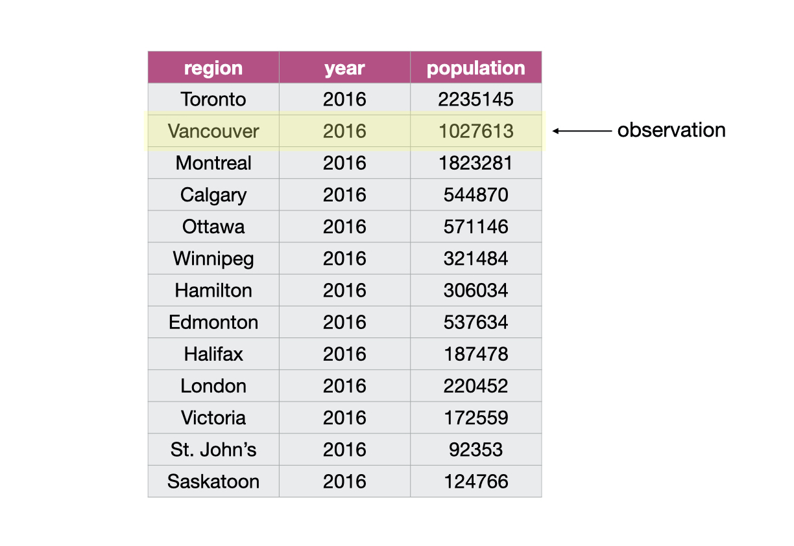
```

and the columns are the variables:


``` {r 02-vars, echo = FALSE, message = FALSE, warning = FALSE, fig.cap = "Columns are variables in a data frame", fig.retina = 2, out.width = "700"}
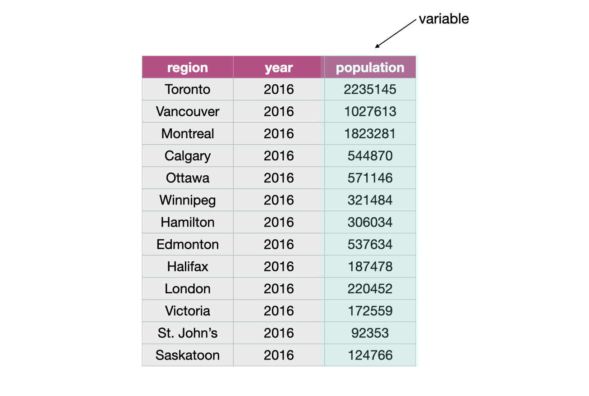
```

From a computer programming perspective, in R, a data frame is a special subtype
of a list object whose elements (columns) are *vectors*. For example, the data
frame in Figure \@ref(fig:02-vectors) has three vectors whose names are `region`,
`year` and `population`.

``` {r 02-vectors, echo = FALSE, message = FALSE, warning = FALSE, fig.cap = "Data frame with 3 vectors", fig.retina = 2, out.width = "700"}
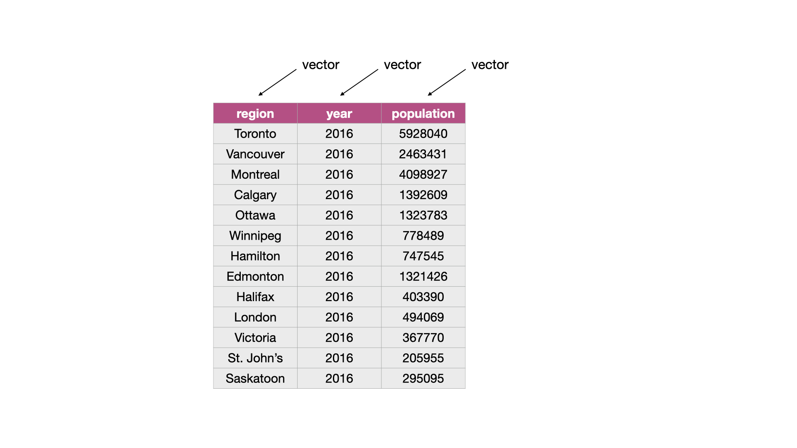
```

### What is a vector?

In R, **vectors** are objects that can contain one or more elements. The vector
elements are ordered, and they must all be of the same *data type*. R has
several different basic data types, as shown in table \@ref(tab:datatype-table).

Lists, which are sometimes called recursive vectors because lists can contain
other lists. In the vector shown in Figure \@ref(fig:02-vector), the elements are
of integer type:

``` {r 02-vector, echo = FALSE, message = FALSE, warning = FALSE, fig.cap = "Example of a numeric type vector", fig.retina = 2, out.width = "700"}
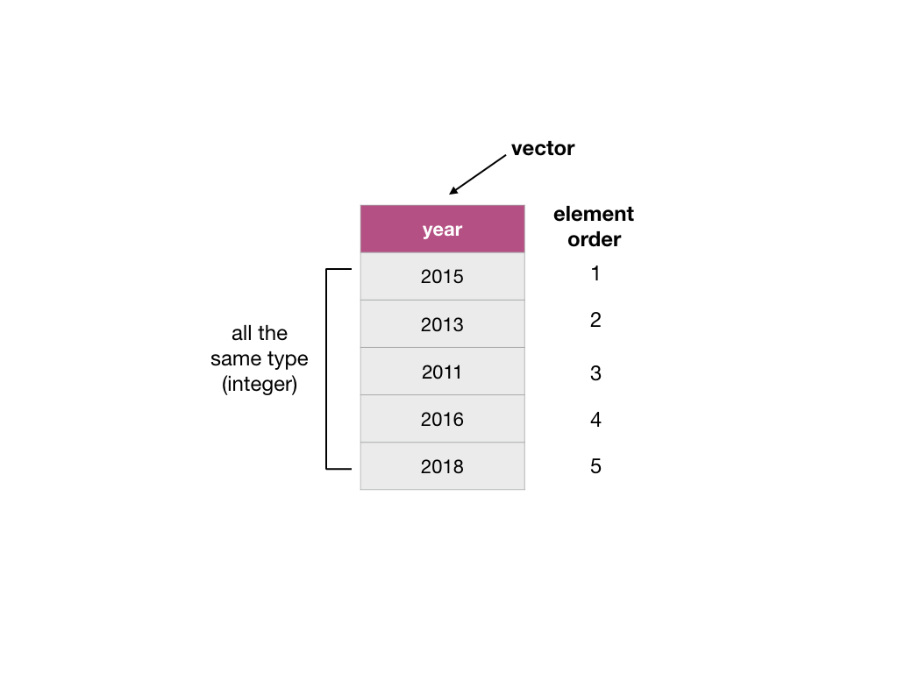
```

You can create vectors in R using the concatenate `c()` function. To create the
vector `year` as shown in Figure \@ref(fig:02-vector) we write:

``` {r}
year <- c(2015, 2013, 2011, 2016, 2018)
year
```

Table: (#tab:datatype-table) Basic data types in R

| Data type | Description | Example |
| --- | --- | --- |
| character | Letters or numbers surrounded by quotes | "1" , "Hello world!" |
| double | Numbers with decimals values | 1.2333 |
| integer | Numbers that do not contain decimals | 1L, 20L (where "L" tells R to store as an integer) |
| logical | A value of true and false | `TRUE`, `FALSE` |
| factor | Used to represent data with a limited number of values | a `size` variable with levels "large", "medium" and "small" |

> "Numeric" is an umbrella term that includes integer and double data types.
> Most of the time when working with numbers in R they will be double types. For
> instance, a double data type is the default when you create a vector of
> numbers using `c()`, and when you read in whole numbers via `read_csv`. There
> are other basic data types in R, such as *raw* and *complex*, which we won't
> cover in this textbook. We will go into more details about factors in chapter
> \@ref(viz).

### How are vectors different from a list?

Lists are also objects in R that have multiple elements, you can think of them
as super-vectors. Vectors and lists differ by the requirement of element type
consistency. All elements within a single vector must be of the same type (e.g.,
all elements are numbers), whereas elements within a single list can be of
different types (e.g., characters, numbers, logicals and even other lists can be
elements in the same list).

``` {r 02-vec-vs-list, echo = FALSE, message = FALSE, warning = FALSE, fig.cap = "A vector versus a list", fig.retina = 2, out.width = "650"}
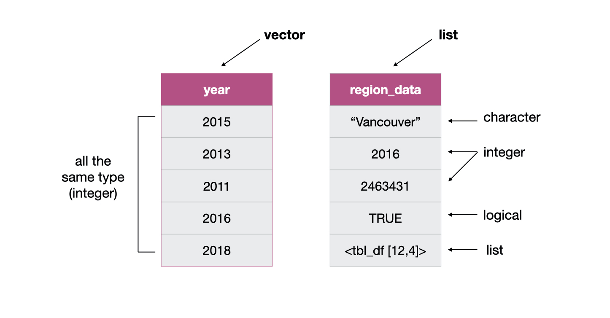
```

> Note that there are actually two types of vectors in R: *atomic vectors* and
> *lists*. Though when people say “vector”, they are *usually* referring to
> atomic vectors. Confusing, we know! You can think of **atom**ic vectors as
> the “atoms” of R since they are built from R’s most fundamental data types.


### What does this have to do with data frames?

As mentioned earlier, a data frame is really a special type of list where the
elements can only be vectors. Representing data with such an object enables us
to easily work with our data in a tabular manner. It also allows us to have
columns, containing qualities or values, for different statistical variables
linked in a row for one observation - these columns cannot be independently
sorted. This is similar to a table in a database.

``` {r 02-dataframe, echo = FALSE, message = FALSE, warning = FALSE, fig.cap = "Data frame and vector types", fig.retina = 2, out.width = "650"}
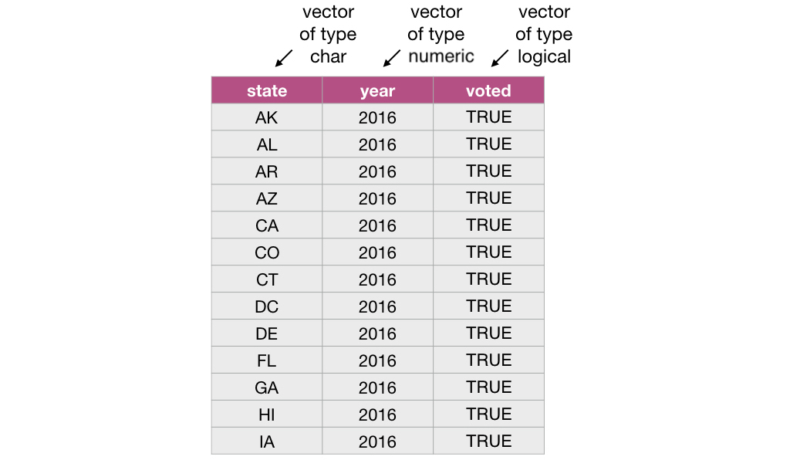
```

The functions from the `tidyverse` package that we are using often give us a
special class of data frame called a *tibble*. Tibbles have some additional
features and benefits over the built-in data frame object. These include the
ability to add grouping (and other useful) attributes and more predictable type
preservation when subsetting. Because a tibble is just a data frame with some
added features, we will collectively refer to both built-in R data frames and
tibbles as data frames in this book.

> You can use the function `class` on a data object to assess whether a data
> frame is a built-in R data frame or a tibble. If the data object is a data
> frame `class` will return `"data.frame"`, whereas if the data object is a
> tibble it will return `"tbl_df" "tbl" "data.frame"`. You can easily convert
> built-in R data frames to tibbles using the `tidyverse` `as_tibble` function.
> For example we can check the class of the Canadian languages data set,
> `can_lang`, we worked with in the previous chapters and we see it is a tibble.

``` {r 02-load-can-land, warning=F, message=F}
class(can_lang)
```


Vectors, data frames and lists are basic types of *data structures* in R which
are core to most data analyses. We summarize them in table
\@ref(tab:datastructure-table).

Table: (#tab:datastructure-table) Basic data structures in R

| Data Structure | Description |
| --- | --- |
| vector | An ordered collection of one, or more, values of the *same data type* (e.g. all values are numeric). *Note: in R, a vector of length one is used to represent a single value.* |
| data frame | A list of *vectors* of the *same length*, which has column and row names. We typically use a data frame to represent a data set. | 
| list | An ordered collection of one, or more, values. The elements in the list can be of different data types. |

> There are several other data structures in the R programming language (*e.g.,*
> matrices), however, they are beyond the scope of this book.

## Tidy Data

There are many ways a tabular data set can be organized. This chapter will focus
on introducing the *tidy data* format of organization and how to make your raw
(and likely messy) data tidy.


### What is tidy data?

Tidy data satisfy the following three criteria [@wickham2014tidy]:

  - each row is a single observation,
  - each column is a single variable, and
  - each value is a single cell (i.e., its row and column position in the data
    frame is not shared with another value)

``` {r 02-tidy-image, echo = FALSE, message = FALSE, warning = FALSE, fig.cap = "Tidy data", fig.retina = 2, out.width = "1150"}
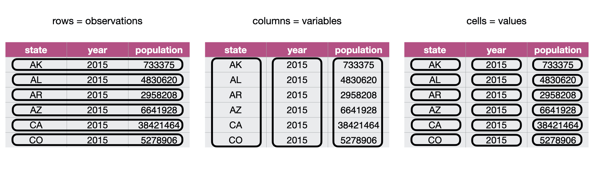
```

### Why is tidy data important in R?

First, tidy data is a straightforward way to work with data and thus, one of R's
most popular plotting toolsets, the `ggplot2` package (which is one of the
packages that the `tidyverse` package loads), expects the data to be in a tidy
format. Second, most statistical analysis functions also expect data in a tidy
format. Given that both of these tasks are central in almost all data analysis
projects, it is well worth spending the time to get your data into a tidy format
upfront. Luckily there are many well-designed `tidyverse` data
cleaning/wrangling tools to help you easily tidy your data. Let's explore them
below!

### Going from wide to long (or tidy!) using `pivot_longer`

One common step to get data into a tidy format is to combine columns stored in
separate columns but are really part of the same variable. Data is often stored
in a wider, not tidy, format because this format is usually more intuitive for
human readability and understanding, and humans create data sets.

For example, in Figure \@ref(fig:02-wide-to-long), the table on the left is in an
untidy, "wide" format because the year values (2006, 2011, 2016) are listed as
the column headers. For humans, this table is easy to read thus you will often
find data stored in this wide format. However, for R, to do any visualization or
analysis this format is difficult to work with. For example, if we wanted to
find the maximum year it's hard to do when the year values are not in their own
column. Another problem with data in this format is that we don't know what the
numbers under each year actually represent. Do those numbers represent
population size? Land area? It's not clear. We can reshape this data set to a
"long" format by creating a column called "year" and a column called
"population," which is the table on the right.

``` {r 02-wide-to-long, echo = FALSE, message = FALSE, warning = FALSE, fig.cap = "Going from wide to long data", fig.retina = 2, out.width = "1150"}
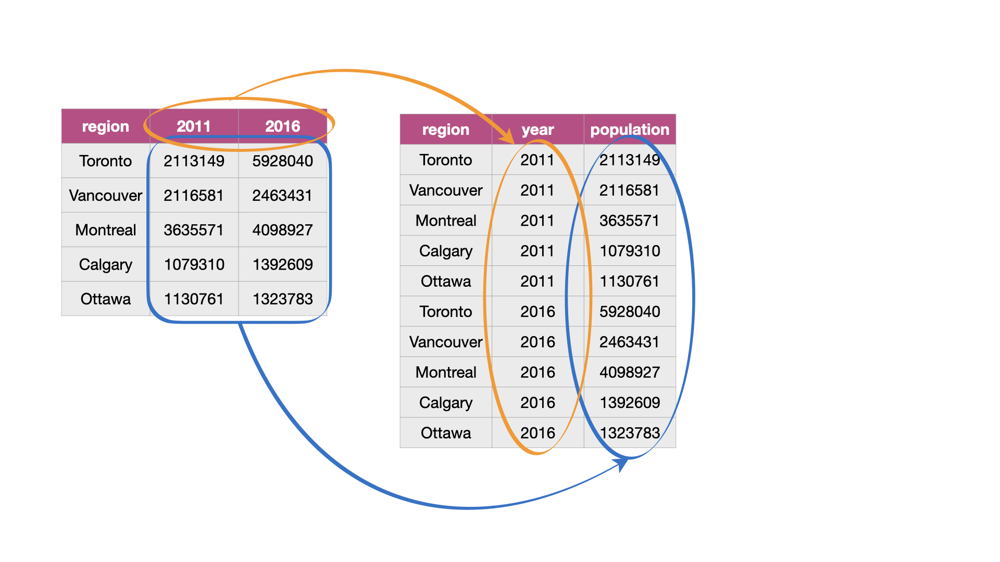
```

The function `pivot_longer`, which combines columns, makes the data frame longer
and narrower. To learn how to use `pivot_longer`, we will work with the
`region_lang_top5_cities_wide.csv` data set. This data set contains contains the
counts of how many Canadians cited each language as their mother tongue for five
major Canadian cities (Toronto, Montréal, Vancouver, Calgary and Edmonton) from
the 2016 Canadian census. We will load the `tidyverse` package so we can use our
wrangling functions and the `canlang` package since it contains the
`region_lang` and `region_data` data sets that we will use later in the chapter.

Our data set is stored in an untidy format, as shown below:

``` {r 02-tidyverse, warning=FALSE, message=FALSE}
library(tidyverse)
library(canlang)
lang_wide <- read_csv("data/region_lang_top5_cities_wide.csv")
lang_wide
```


What is wrong with our untidy format above? From a data analysis perspective,
this format is not ideal because the values of the variable *region* (Toronto,
Montréal, Vancouver, Calgary and Edmonton) are stored as column names. Thus they
are not easily accessible to the data analysis functions we will want to apply
to our data set. Additionally, the values of the *mother tongue* variable are
spread across multiple columns, which will prevent us from doing any desired
visualization or statistical tasks until we combine them into one column. For
instance, suppose we want to know the languages with the highest number of
Canadians reporting it as their mother tongue among all five regions. This
question would be tough to answer with the data in its current format. It would
be much easier to answer if we tidy our data first.

To accomplish this data transformation, we will use the `tidyverse` function
`pivot_longer`. The table on the left in Figure
\@ref(fig:img-pivot-longer-with-table) represents the data in the "wide" format
and the table on the right represents how we want the data to look after we've
applied the `pivot_longer` function.

``` {r img-pivot-longer-with-table, echo = FALSE, message = FALSE, warning = FALSE, fig.cap = "Going from wide to long with the pivot_longer function", out.width="1100", fig.retina = 2}
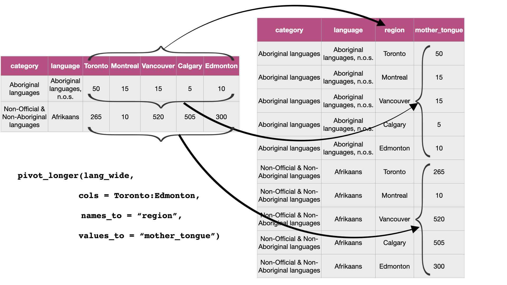
```

Figure \@ref(fig:img-pivot-longer) details what arguments we need to specify to
use `pivot_longer`.

``` {r img-pivot-longer, echo = FALSE, message = FALSE, warning = FALSE, fig.cap = "Syntax for the pivot_longer function", out.width="1100", fig.retina = 2}
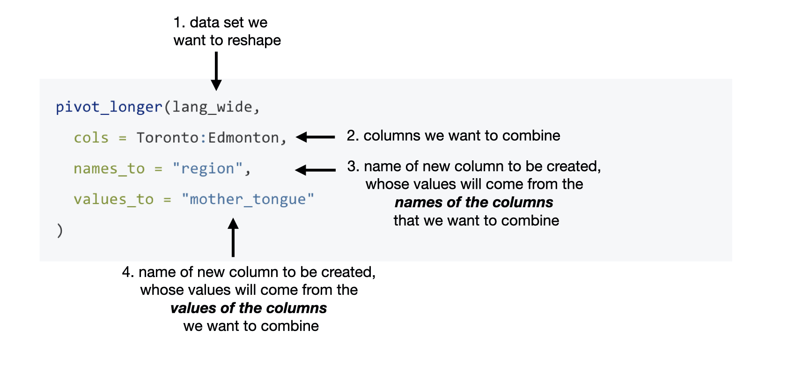
```

For the above example, we use `pivot_longer` to combine the Toronto, Montréal,
Vancouver, Calgary and Edmonton columns into a single column called `region`,
and create a column called `mother_tongue` that contains the count of how many
Canadians report each language as their mother tongue for each metropolitan
area. We use a colon `:` between Toronto, and Edmonton to tell R to select all
the columns in between Toronto and Edmonton:

``` {r}
lang_mother_tidy <- pivot_longer(lang_wide,
  cols = Toronto:Edmonton,
  names_to = "region",
  values_to = "mother_tongue"
)
lang_mother_tidy
```


> **Splitting code across lines**: *In the code above, the call to the
> `pivot_longer` function is split across several lines.* *This is allowed and
> encouraged when programming in R when your code line gets too long* *to read
> clearly. About 80 characters per line is recommended and when doing this, it
> is important to end the line with a comma `,` so that R* *knows the function
> should continue to the next line.*

The data above is now tidy because all three criteria for tidy data have now
been met:

1.  All the variables (`category`, `language`, `region` and `mother_tongue`) are
    now their own columns in the data frame.
2.  Each observation, i.e., each `category`, `language`, `region`, and count of
    Canadians where that language is the mother tongue, are in a single row.
3.  Each value is a single cell, i.e., its row, column position in the data
    frame is not shared with another value.

### Going from long to wide using `pivot_wider` {#pivot-wider}

Suppose we have observations spread across multiple rows rather than in a single
row. For example, in Figure \@ref(fig:long-to-wide), the table on the left is an
untidy, long format because the `count` column contains two variables
(population and commuter count) and each observation is split across two rows.
Using data in this format means it's harder to apply functions when the values
are not in their own column. For example, finding the maximum number of
commuters is possible to do with the untidy table but requires a few more steps
and is cumbersome. We can reshape this data set to a wider format by creating a
column called "population" and a column called "commuters", which is the table
on the right.

``` {r long-to-wide, echo = FALSE, message = FALSE, warning = FALSE, fig.cap = "Going from long to wide data", fig.retina = 2, out.width = "1150"}
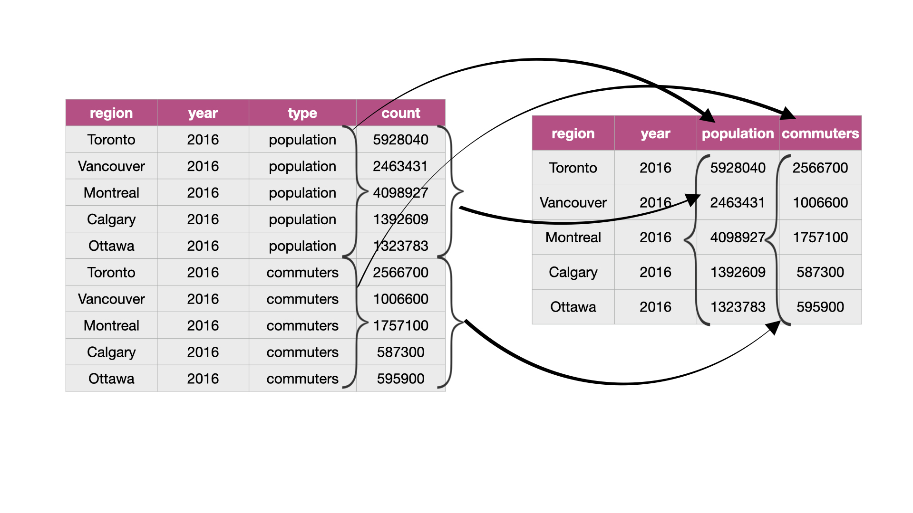
```

To tidy this type of data in R, we can use the function `pivot_wider`, which
generally increases the number of columns (widens) and decreases the number of
rows in a data set. The data set `region_lang_top5_cities_long.csv` contains the
number of Canadians reporting the primary language at home and work for five
major cities (Toronto, Montréal, Vancouver, Calgary and Edmonton).


``` {r 02-reading-long, warning=FALSE, message=FALSE, R.options = list(width = 90)}
lang_long <- read_csv("data/region_lang_top5_cities_long.csv")
lang_long
```

What is wrong with this format above? In this example, each observation should
be a language in a region. However, in the messy data set above, each
observation is split across multiple rows. One where the count for
`most_at_home` is recorded and the other where the count for `most_at_work` is
recorded. Suppose we wanted to visualize the relationship between the number of
Canadians reporting their primary language at home and work. It would be
difficult to do that with the data in its current format since these two
variables are stored in the same column.

We can see how we would like to transform the data from long to wide with
`pivot_wider` in Figure
\@ref(fig:img-pivot-wider-table).

``` {r img-pivot-wider-table, echo = FALSE, message = FALSE, warning = FALSE, fig.cap = "Going from long to wide with pivot_wider", out.width="1100", fig.retina = 2}
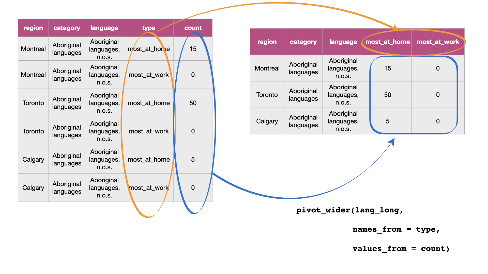
```

To tidy this data, we will use `pivot_wider`, and Figure
\@ref(fig:img-pivot-wider) details what we need to specify to use this function.

``` {r img-pivot-wider, echo = FALSE, message = FALSE, warning = FALSE, fig.cap = "Syntax for the pivot_wider function", out.width="1100", fig.retina = 2}

```

We will apply the function as detailed in Figure \@ref(fig:img-pivot-wider).

``` {r , warning=FALSE, message=FALSE}
lang_home_tidy <- pivot_wider(lang_long,
  names_from = type,
  values_from = count
)
lang_home_tidy
```


The data above is now tidy! We can go through the three criteria again to check
that this data is a tidy data set.

1.  All the variables are their own columns in the data frame, i.e.,
    `most_at_home`, and `most_at_work` have been separated into their own
    columns in the data frame.
2.  Each observation, i.e., each language in a region is in a single row.
3.  Each value is a single cell, i.e., its row, column position in the data
    frame is not shared with another value.

You might notice that we have the same number of columns in our tidy data set as
we did in our messy one. Therefore `pivot_wider` didn't really "widen" our data
as the name suggests. However, if we had more than two categories in the
original `type` column, then we would see the data set "widen."

### Using `separate` to deal with multiple delimiters  {#separate}

Data are also not considered tidy when multiple values are stored in the same
cell. The data set we show below is even messier than the ones we dealt with
above: the `Toronto`, `Montréal`, `Vancouver`, `Calgary` and `Edmonton` columns
contain the number of Canadians reporting their primary language at home and
work in one column separated by the delimiter "/". The column names are the
values of a variable, AND each value does not have its own cell! To turn this
messy data into tidy data, we'll have to fix these issues.

``` {r, warning=FALSE, message=FALSE}
lang_messy <- read_csv("data/region_lang_top5_cities_messy.csv")
lang_messy
```

First we’ll use `pivot_longer` to create two columns, `region` and `value`,
similar to what we did previously:

``` {r}
lang_messy_longer <- pivot_longer(lang_messy,
  cols = Toronto:Edmonton,
  names_to = "region",
  values_to = "value"
)
lang_messy_longer
```

Then we'll use `separate` to split the `value` column into two columns, one that
contains only the counts of Canadians that speak each language most at home, and
one that contains the counts for most at work for each region. Figure
\@ref(fig:img-separate) outlines what we need to specify to use `separate`.

``` {r img-separate, echo = FALSE, message = FALSE, warning = FALSE, fig.cap = "Syntax for the separate function", out.width="1100", fig.retina = 2}
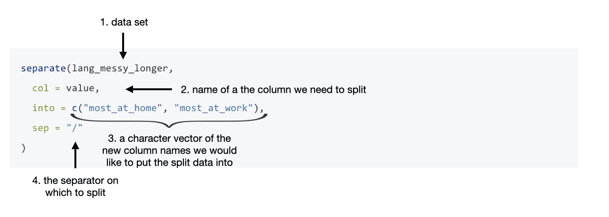
```

``` {r}
lang_no_delimiter <- separate(lang_messy_longer,
  col = value,
  into = c("most_at_home", "most_at_work"),
  sep = "/"
)
lang_no_delimiter
```


Is this data set now tidy? If we recall the three criteria for tidy data:

  - each row is a single observation,
  - each column is a single variable, and
  - each value is a single cell.

We can see that this data now satisfies all three criteria, making it easier to
analyze. However, we aren't done yet! Notice in the table above the word
`<chr>` appears beneath each of the column names. The word under the column name
indicates the data type of each column. Here all of our variables are
"character" data types. Recall, character data types are letter(s) or digits(s)
surrounded by quotes. In the previous example in section \@ref(pivot-wider), the
`most_at_home` and `most_at_work` variables were `<dbl>` (double) (you can
verify this by looking at the tables in the previous sections), which is a type
of numeric data. This change is due to the delimiter "/" when we read in this
messy data set. R read the columns in as character types, and by default,
`separate` will return columns as character data types.

It makes sense for `region`, `category`, and `language` to be stored as a
character type. However, if we want to apply any functions that treat the
`most_at_home` and `most_at_work` columns as a number (e.g. finding rows that
are above numeric threshold of a column), it won't be possible to do if the
variable is stored as a `character`. We can set `convert = TRUE` to convert the
`most_at_home` and `most_at_work` columns to the correct data type.


``` {r}
lang_no_delimiter <- separate(lang_messy_longer,
  col = value,
  into = c("most_at_home", "most_at_work"),
  sep = "/", 
  convert = TRUE
)
lang_no_delimiter
```

Now we see `<int>` appears under our columns, `most_at_home` and `most_at_work`,
indicating they are integer data types (which is one of the sub-types of
numeric)!


### Notes on defining tidy data

Is there only one shape for tidy data for a given data set? Not necessarily! It
depends on the statistical question you are asking and what the variables are
for that question. For tidy data, each variable should be its own column. So,
just as it's essential to match your statistical question with the appropriate
data analysis tool (classification, clustering, hypothesis testing, etc.) it's
important to match your statistical question with the appropriate variables and
ensure they are represented as individual columns to make the data tidy.

## Using `select` to extract a range of columns

Chapter 1 discussed two `tidyverse` functions: `select` and `filter` to select
columns and filter rows from a data frame. We will now learn more ways we can
use these functions. Recall, the `select` function creates a subset of the
*columns* of a data frame, while the `filter` subsets *rows* with specific
values.

### Using `select` helpers to extract columns

Suppose we wanted to select only the columns `language`, `region`,
`most_at_home` and `most_at_work` from the `lang_no_delimiter` data set. We can
use the `select` function to choose the columns that we want and assign it to a
data frame:

``` {r}
selected_columns <- select(lang_no_delimiter, language, region, most_at_home, most_at_work)
selected_columns
```

Here we wrote out the names of each of the columns. However, this method is
time-consuming, especially if you have a lot of columns! Another approach is to
use a "`select` helper". `select` helpers are operators that make it easier for
us to select columns. For instance, we can use a `select` helper to choose a
range of columns rather than typing each column name out. To do this, we use the
colon (`:`) operator to denote the range. For example, to get all the columns in
the `lang_no_delimiter` data frame from `language` to `most_at_work` we pass
`language:most_at_work` as the second argument to the `select` function.

``` {r}
column_range <- select(lang_no_delimiter, language:most_at_work)
column_range
```

Notice that we get the same output as we did above, but with less typing and
thus less error prone! This type of operator is handy, especially for large
data sets

Suppose instead we wanted to extract columns that followed a particular pattern
rather than just selecting a range. Let's say we wanted only to select the
columns `most_at_home` and `most_at_work`. There are some helpers, which allow
us to select variables based on their names. Here we can use the `select` helper
`starts_with` to choose only the columns that start with the word "most":

``` {r 02-select-helpers}
select(lang_no_delimiter, starts_with("most"))
```

We could also have chosen the columns containing an underscore `_` by adding
`contains("_")` as the second argument in the `select` function since we notice
the columns we want contain underscores and the others don't.

``` {r 02-select-helper-contains}
select(lang_no_delimiter, contains("_"))
```

There are many different `select` helpers, which are very handy for selecting
variables based on certain criteria. Check out the resource in the additional
resources section for a complete list of `select` helpers.

## Using `filter` to extract rows

### Using `filter` to extract rows with `==`

Recall we can use the `filter` function to obtain the subset of rows with
desired values from a data frame. Again, our first argument is the name of the
data frame object, `lang_no_delimiter`. The second argument is a logical
statement to use when filtering the rows. Here, for example, we'll say that we
are interested in rows where the category is "Official languages". We use the
*equivalency operator* (`==`) to compare the values of the `category` column
with the value `"Official languages"`. With these arguments, `filter` returns a
data frame with all the columns of the input data frame but only the rows we
asked for in our logical filter statement.

``` {r}
official_langs <- filter(lang_no_delimiter, category == "Official languages")
official_langs
```

### Using `filter` to extract rows with `!=`

What if we want all the other language categories in the data set *except* for
those in the "Official languages" category? We can accomplish this with the `!=`
logical operator, which means "NOT EQUAL TO". So if we want to find all the rows
where the `category` does NOT equal "Official languages" we write the code
below.

``` {r}
filter(lang_no_delimiter, category != "Official languages")
```

### Using `filter` to extract rows with `&` or `,`

Let's suppose we want to look at only the rows for English in Vancouver. Here we
want to filter the data set to find rows that satisfy multiple conditions
simultaneously. We can do this with `&`, which is a logical operator meaning
"AND". We are filtering the `official_langs` data frame where the `region ==
"Vancouver"` AND the `language == "English"`.

``` {r}
filter(official_langs, region == "Vancouver" & language == "English")
```

Notice that we can accomplish the same thing using a comma `,` instead of the
ampersand sign `&`. The function treats the comma `,` between the logical
statements as an "AND".

``` {r}
filter(official_langs, region == "Vancouver" , language == "English")
```

### Using `filter` to extract rows with `|`

Suppose we were interested in the rows for only the Albertan cities in our data
set (Edmonton and Calgary). We can't use `&` as we did above because `region`
cannot be both Edmonton and Calgary simultaneously. Instead, we can use the `|`
logical operator, which gives us the cases where one condition OR another
condition OR both are satisfied. In the code below, we ask R to return the rows
where the `region` columns are equal to "Calgary" OR "Edmonton".

``` {r}
filter(official_langs, region == "Calgary" | region == "Edmonton")
```

### Using `filter` to extract rows with `%in%`

Suppose we want to see the populations of our five cities. The `region_data`
data set from the `canlang` package contains statistics for number of
households, land area, population and number of dwellings for different regions
according to the 2016 Canadian census.

``` {r}
region_data
```

To get the population of our five cities we can filter the data set using the
`%in%` operator. The `%in%` operator is used to see if an element belongs to a
vector. Here we are filtering if any of the five cities ("Toronto", "Montréal",
"Vancouver", "Calgary", "Edmonton") match the rows in the `region`
column.

``` {r}
filter(region_data, region %in% c("Toronto", "Montréal", "Vancouver", "Calgary", "Edmonton"))
```

> **What's the difference between `==` and `%in%`?** Let's suppose we have two
> vectors, `vectorA` and `vectorB`. If you type `vectorA == vectorB` into R it
> will compare the vectors element by element. R checks if the first element of
> `vectorA` equals the first element of `vectorB`, the second element of
> `vectorA` equals the second element of `vectorB` etc. On the other hand,
> `vectorA %in% vectorB` compares the first element of `vectorA` to all the
> elements in `vectorB`. Then the second element of `vectorA` is then compared
> to all the elements in `vectorB` etc. Notice the difference between `==` and
> `%in%` in the example below.
 
``` {r}
c("Vancouver", "Toronto") == c("Toronto", "Vancouver")
c("Vancouver", "Toronto") %in% c("Toronto", "Vancouver")
```


### Using `filter` to extract rows with values above or below a threshold

``` {r changing_the_units, include = FALSE}
census_popn <- 35151728
most_french <- 2669195
```

We see that `r format(most_french, scientific = FALSE, big.mark = ",")` people
reported speaking French in Montréal as their primary language at home. If we
are interested in finding the languages in regions with higher numbers of people
who speak it as their primary language at home than French in Montréal then we
can create a filter to obtain rows where the value of `most_at_home` is greater
than `r format(most_french, scientific = FALSE, big.mark = ",")`.

``` {r}
filter(official_langs, most_at_home > 2669195)
```

`filter` returns a data frame with only one row indicating that only English in
Toronto is reported by more people as their primary language at home than French
in Montréal according to the 2016 Canadian census.

> `==`, `!=`, `&`, `|` and `>` are examples of logical operators. These
> operators don't only have be used with the `filter` function. For example, you
> can type `1 > 2` or `"Vancouver" == "Calgary"` into R and it will give you a
> response (`FALSE` in both cases).

## Using `mutate` to modify or add columns

``` {r 02-character-official-langs, echo = FALSE}
official_langs <- mutate(official_langs,
  most_at_home = as.character(most_at_home),
  most_at_work = as.character(most_at_work)
)
```

In section \@ref(separate), when we first read in our data and separated our
columns the variables were "character" data types. We used the `convert`
argument to convert our columns to the desired data types. However, suppose we
read a data set into R and wanted to convert the data types, but didn't need to
separate it first. For example, suppose the `most_at_home` and `most_at_work`
columns in our `official_langs` data frame were character data types.


``` {r}
official_langs 
```

If we want to apply any functions that treat the `most_at_home` and
`most_at_work` columns as a number (e.g. finding rows that are above a numeric
threshold of a column), it won't be possible to do if the variable is stored as
a `character`.

``` {r}
filter(official_langs, most_at_home > 2669195)
```


When we look at the table we got from `filter` above, it isn't quite doing what
we'd expect. We see numbers in the table in the `most_at_home` column that are
less than `r format(most_french, scientific = FALSE, big.mark = ",")`. Therefore
we will use the function `mutate` to convert these two columns to a "numeric"
data type. `mutate` is a function that will allow us to create a new variable or
transform existing ones in our data set. We specify the data set in the first
argument, and in the proceeding arguments, we specify the function we want to
apply (`as.numeric`) to which columns (`most_at_home`, `most_at_work`). Then we
give the mutated variable a new name. Here we are naming the columns the same
names ("most\_at\_home", "most\_at\_work"), but you can call these mutated
variables anything you'd like.

`mutate`'s general syntax is detailed in Figure \@ref(fig:img-mutate).

``` {r img-mutate, echo = FALSE, message = FALSE, warning = FALSE, fig.cap = "Syntax for the mutate function", out.width="1100", fig.retina = 2}
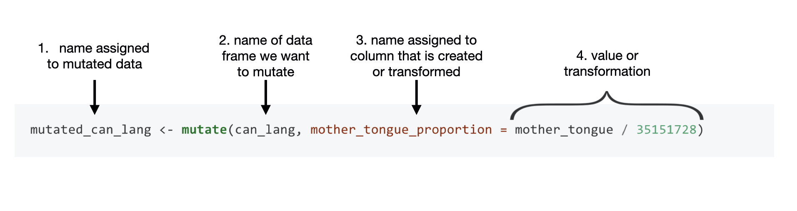
```

Below we use `mutate` to convert the columns `most_at_home` and `most_at_home`
to numeric data types in the `official_langs` data set as described in figure
\@ref(fig:img-mutate):

``` {r}
official_langs <- mutate(official_langs,
  most_at_home = as.numeric(most_at_home),
  most_at_work = as.numeric(most_at_work)
)
official_langs
```

Now we see `<dbl>` appears under our columns, `most_at_home` and `most_at_work`,
indicating they are double data types (which is a type of numeric data type)!

Now when we filter we get what we expect:

``` {r}
filter(official_langs, most_at_home > 2669195)
```


### Using `mutate` to create new columns

``` {r , include = FALSE}
census_popn <- 35151728
number_most_home <- filter(official_langs, language == "English" & region == "Toronto") |>
pull(most_at_home)

toronto_popn <- region_data |> filter(region == "Toronto") |>
pull(population)
```


We can see in the table that
`r format(number_most_home, scientific = FALSE, big.mark = ",")` people reported
speaking English in Toronto as their primary language at home according to
the 2016 Canadian census. What does this number mean to us? To understand this
number, we need context. In particular, how many people were in Toronto when
this data was collected? From the 2016 Canadian census profile, the population
of Toronto was reported to be
`r format(toronto_popn, scientific = FALSE, big.mark = ",")` people. The number
of people who report that English as their primary language at home is much more
meaningful when we report it in this context. We can even go a step further and
transform this count to a relative frequency or proportion. We can do this by
dividing the number of people reporting a given language as their primary
language at home by the number of people who live in Toronto. For example, the
proportion of people who reported that their primary language at home was
English in the 2016 Canadian census was
`r format(round(number_most_home/toronto_popn, 2), scientific = FALSE, big.mark = ",")`
in Toronto.

``` {r, include = FALSE}
city_popn <- region_data |> filter(region %in% c("Toronto", "Montréal", "Vancouver", "Calgary", "Edmonton")) |> arrange(desc(population)) |> pull(population)
rep_popn <- rep(city_popn, 2)
```

We can create a vector of the city populations. Then we use `mutate` to
calculate the proportion of people reporting a given language as their primary
language at home for all the languages in the `official_langs` data set by
dividing the column by our vector of city populations. We give the mutated
column a new name `most_at_home_proportion`, which will create a new column in
our data set.

``` {r}
city_populations <- c(5928040, 4098927, 2463431, 1392609, 1321426)
```

```{r, include = FALSE}
official_langs <- mutate(official_langs, most_at_home_proportion =
most_at_home / city_populations )

official_langs
```

Notice that we divided a vector with 10 elements (`most_at_home`) by a vector
with only 5 elements (`city_populations`). What gives? Arithmetic operations of
vectors are performed *memberwise* meaning the first element of `most_at_home`
will be divided by the first element of `city_populations`, the second element
of `most_at_home` will be divided by the second element of `city_populations`
and so on. When two vectors have different lengths, the shorter one will be
recycled to match the longer one. Here the elements of `city_populations` will
be repeated once to match the length of `most_at_home`.

You *can* do this in R, however we can very easily introduce errors using this
method without realizing. For example, suppose we only listed four city
populations, but still had ten elements of five cities in the `most_at_home
column`. Then the first two city populations listed in the `city_populations`
vector (Toronto and Montréal) would be repeated at the end and our calculated
proportions would be wrong in our final data table.

``` {r include = F}
toronto_eng <- filter(official_langs, region == "Toronto" & language == "English") %>% pull(most_at_home)
toronto_fr <- filter(official_langs, region == "Toronto" & language == "French") %>% pull(most_at_home)
```

Instead, let's use the `case_when` function. When used inside the `mutate`
function, `case_when` will allow us to mutate a variable *when* a particular
condition is met. We write the condition on the left side of the tilde (`~`)
symbol and the mutation on the right side. Let's consider just Toronto to start.
We want to take the `most_at_home` value for English in Toronto
(`r format(toronto_eng, scientific = FALSE, big.mark = ",")`) and divide it by
Toronto's population
(`r format(toronto_popn, scientific = FALSE, big.mark = ",")`). We also want to
divide the `most_at_home` value for French in Toronto
(`r format(toronto_fr, scientific = FALSE, big.mark = ",")`) and divide it by
Toronto's population. So when `region == Toronto` (the *condition*), we want to
apply `most_at_home/5928040` (the *mutation*). We do the same for the other
cities, which is what you see in the code below.

``` {r 02-case-when}
mutate(official_langs,
  most_at_home_proportion = case_when(
    region == "Toronto" ~ most_at_home / 5928040,
    region == "Montréal" ~ most_at_home / 4098927,
    region == "Vancouver" ~ most_at_home / 2463431,
    region == "Calgary" ~ most_at_home / 1392609,
    region == "Edmonton" ~ most_at_home / 1321426
  )
)
```

If you compare the proportions in these two tables, we get the same values with
both methods. That is the beauty of R -- there are usually multiple ways to
accomplish the same thing!

## Creating a visualization with tidy data

Now that we have cleaned and wrangled our data, we can visualize how many people
speak each of Canada's two official languages (English and French) as their
primary language at home in these 5 regions. We can use `ggplot` to create our
data visualization. Here we create a bar chart to represent the proportions for
each region, and colour the proportions by language.

``` {r 02-plot}
ggplot(
  official_langs,
  aes(
    x = most_at_home_proportion,
    y = region,
    fill = language
  )
) +
  geom_bar(stat = "identity") +
  xlab("Proportion of residents reporting their primary language at home") +
  ylab("Region")
```

> Don't worry too much about the code to make this plot, we will talk more in
> detail about visualizations in chapter \@ref(viz).

From this visualization, we can see that in Calgary, Edmonton, Toronto and
Vancouver, English was reported as the most common primary language used at home
compared to French. However, in Montréal, French was reported as the most common
primary language used at home over English.


## Combining functions using the pipe operator, `|>`

In R, we often have to call multiple functions in a sequence to process a data
frame. The basic ways of doing this can become quickly unreadable if there are
many steps. For example, suppose we need to perform three operations on a data
frame `data`:

1)  add a new column `new_col` that is double another `old_col`
2)  filter for rows where another column, `other_col`, is more than 5, and
3)  select only the new column `new_col` for those rows.

One way of doing is to just write multiple lines of code, storing temporary
objects as you go:

``` {r eval = FALSE}
output_1 <- mutate(data, new_col = old_col * 2)
output_2 <- filter(output_1, other_col > 5)
output <- select(output_2, new_col)
```

This is difficult to understand for multiple reasons. The reader may be tricked
into thinking the named `output_1` and `output_2` objects are important for some
reason, while they are just temporary intermediate computations. Further, the
reader has to look through and find where `output_1` and `output_2` are used in
each subsequent line.

Another option for doing this would be to *compose* the functions:

``` {r eval = F}
output <- select(filter(mutate(data, new_col = old_col * 2), other_col > 5), new_col)
```

Code like this can also be difficult to understand. Functions compose (reading
from left to right) in the *opposite order* in which they are computed by R
(above, `mutate` happens first, then `filter`, then `select`). It is also just a
really long line of code to read in one go.

The *pipe operator* `|>` solves this problem, resulting in cleaner and
easier-to-follow code. `|>` in built into R so you don't need to load any
packages to use it. The code below accomplishes the same thing as the previous
two code blocks:

``` {r eval = F}
output <- data |>
mutate(new_col = old_col * 2) |>
filter(other_col > 5) |>
select(new_col)
```

> Note: The `|>` pipe operator was inspired by a previous version of the pipe
> operator, `%>%`. The `%>%` pipe operator is not built into R and needs to be
> loaded via an external R package. There are some other drawbacks to using
> `%>%`, which are beyond the scope of this textbook. Be aware that `%>%` exists
> since you may see it used in some books or other sources. However, in this
> textbook, we will be using the base R pipe operator syntax, `|>`.

You can think of the pipe as a physical pipe. It takes the output from the
function on the left-hand side of the pipe, and passes it as the first argument
to the function on the right-hand side of the pipe. Note here that we have again
split the code across multiple lines for readability; R is fine with this, since
it knows that a line ending in a pipe `|>` is continued on the next line.
Similarly, you see that after the first pipe, the remaining lines are indented
until the end of the pipeline. This is not required for the R code to work, but
again is used to aid in improving code readability.

Next, let's learn about the details of using the pipe, and look at some examples
of how to use it in data analysis.

### Using `|>` to combine `filter` and `select`

Let's work with our tidy `lang_home_tidy` data set from above, which contains
the number of Canadians reporting their primary language at home and work for
five major cities (Toronto, Montréal, Vancouver, Calgary and Edmonton):

``` {r, warning=FALSE, message=FALSE}
lang_home_tidy
```

Suppose we want to create a subset of the data with only the languages and
counts of each language spoken most at home for the city of Vancouver. To do
this, we can use the functions `filter` and `select`. First, we use `filter` to
create a data frame called `van_data` that contains only values for Vancouver.
We then use `select` on this data frame to keep only the variables we want:

``` {r}
van_data <- filter(lang_home_tidy, region == "Vancouver")
van_data
van_data_selected <- select(van_data, language, most_at_home)
van_data_selected
```

Although this is valid code, there is a more readable approach we could take by
using the pipe, `|>`. With the pipe, we do not need to create an intermediate
object to store the output from `filter`. Instead we can directly send the
output of `filter` to the input of `select`:

``` {r}
van_data_selected <- filter(lang_home_tidy, region == "Vancouver") |>
select(language, most_at_home)
van_data_selected
```

But wait - why does our `select` function call look different in these two
examples? When you use the pipe, the output of the function on the left is
automatically provided as the first argument for the function on the right, and
thus you do not specify that argument in that function call. In the code above,
the first argument of `select` is the data frame we are `select`-ing from, which
is provided by the output of `filter`.

As you can see, both of these approaches give us the same output, but the second
approach is more clear and readable.

### Using `|>` with more than two functions

The `|>` can be used with any function in R. Additionally, we can pipe together
more than two functions. For example, we can pipe together three functions to
order the rows by counts of the language most spoken at home for only the counts
that are more than 10,000 and only include the region, language and count of
Canadians reporting their primary language at home in our table.

To order by counts of the language most spoken at home we will use the
`tidyverse` function, `arrange`. Recall this function takes column names as
input and orders the rows in the data frame in ascending order based on the
values in the columns. Here we use only one column for sorting (`most_at_home`),
but more than one can also be used. To do this, list additional columns
separated by commas. The order they are listed in indicates the order in which
they will be used for sorting. This is much like how an English dictionary sorts
words: first by the first letter, then by the second letter, and so on.

``` {r}
large_region_lang <- filter(lang_home_tidy, most_at_home > 10000) |>
  select(region, language, most_at_home) |>
  arrange(most_at_home)
large_region_lang
```

> **Note:** You might also have noticed that we split the function calls across
> lines after the pipe, similar as to when we did this earlier in the chapter
> for long function calls. Again this is allowed and recommeded, especially when
> the piped function calls would create a long line of code. Doing this makes
> your code more readable. When you do this it is important to end each line
> with the pipe operator `|>` to tell R that your code is continuing onto the
> next line.

We can also pipe the data frame into the same sequence of functions rather than
using it as the first argument of the first function and we get the same result:

``` {r}
large_region_lang <- lang_home_tidy |> 
  filter(most_at_home > 10000) |>
  select(region, language, most_at_home) |>
  arrange(most_at_home)
large_region_lang
```

Now that we've shown you the pipe operator as an alternative to storing
temporary objects, does this mean you should *never* store temporary objects?
Not necessarily! There are times when you will still want to store intermediate
objects. For example, you might want to save your prepared data before feeding
it into a plot function so you can iteratively change the plot without having to
redo all of your data transformations each time you create a new plot.
Additionally, piping many functions can be overwhelming, so you may also want to
store a temporary object midway through and pipe that into more functions after
that.

## Aggregating data with `group_by` + `summarize`

### Calculating summary statistics:

As a part of many data analyses, we need to calculate a summary value for the
data (a *summary statistic*). A useful `dplyr` function for doing this is
`summarize`. Examples of summary statistics we might want to calculate are the
number of observations, the average/mean value for a column, the minimum value
for a column, etc. Below we show how to use the `summarize` function to
calculate the minimum and maximum number of Canadians reporting a particular
language as their primary language at home:

``` {r}
lang_summary <- summarize(lang_home_tidy,
  min_most_at_home = min(most_at_home),
  most_most_at_home = max(most_at_home)
)
lang_summary
```

From this we see that there are some languages in the data set the no one speaks
as their primary language at home, as well as that the most commonly spoken
primary language at home is spoken by
`r format(lang_summary$most_most_at_home[1], scientific = FALSE, big.mark = ",")`
people.

<!-- Suppose we wanted to find the maximum value for all the numeric columns in the `lang_home_tidy` data set.  -->

<!-- We could apply `summarize` in the same way that we did above to find the maximum values:  -->

<!-- ```{r} -->

<!-- lang_summary_max <- summarize(lang_home_tidy,  -->

<!--              most_most_at_home = max(most_at_home),  -->

<!--              most_most_at_work = max(most_at_work)) -->

<!-- lang_summary_max -->

<!-- ``` -->

<!-- The approach above is a valid way to do this, but if we had many numeric columns in our data set then this method would take a lot of time since we would have to explicitly write out the name of each column! A faster and less error-prone way to apply function(s) to columns that satisfy a certain condition is to use the `summarize_if` function. The first argument is the data set we want to summarize (`lang_home_tidy`). The second argument is the required condition, here if a particular column is numeric then the function will be applied. The third argument is the function we want to summarize with, here `max`. Therefore we write: -->

<!-- ```{r 02-summarize-if} -->

<!-- summarize_if(lang_home_tidy,  -->

<!--              is.numeric,  -->

<!--              max) -->

<!-- ``` -->

<!-- Notice that we get the same output as we did above! From the table, we see that the most commonly spoken  -->

<!-- primary language at home is spoken by X people and the most commonly spoken language at work is spoken by X people.  -->

### Calculating group summary statistics:

A common pairing with `summarize` is `group_by`. Pairing these functions
together can let you summarize values for subgroups within a data set. For
example, here, we can use `group_by` to group the regions and then calculate the
minimum and maximum number of Canadians reporting the language as the primary
language at home for each of the groups.

The `group_by` function takes at least two arguments. The first is the data
frame that will be grouped, and the second and onwards are columns to use in the
grouping. Here we use only one column for grouping (`region`), but more than one
can also be used. To do this, list additional columns separated by commas.

``` {r}
lang_summary_by_region <- group_by(lang_home_tidy, region) |>
summarize(
  min_most_at_home = min(most_at_home),
  max_most_at_home = max(most_at_home)
)
lang_summary_by_region
```

## Using `summarize` and `across` to iterate

Where should you turn when you discover the next step in your data
wrangling/cleaning process requires you to apply a function to each column in a
data frame? The process of repeating a function on different columns or
different data sets is called **iteration**. For example, suppose you wanted to
know the maximum value of each column in a data frame. You could use `summarize`
as discussed above. However, this becomes inconvenient when you have many
columns, as `summarize` requires you to type out a column name and a data
transformation for each summary statistic you want to calculate.

In cases like this, where you want to apply the same data transformation to all
columns, it is more efficient to use `dplyr`'s `across` function to apply a
transformation to each column. For example, let's find the maximum value of each
column of the `region_lang`. First, let’s peek at the data to familiarize
ourselves with it:

``` {r 02-preview-region-data}
region_lang <- read_csv("data/region_lang.csv")
region_lang
```

We could apply `summarize` in the same way that we did above to find the maximum
values:

``` {r}
lang_summary_max <- summarize(region_lang,  
                              mother_tongue = max(mother_tongue), 
                              most_at_home = max(most_at_home),
                              most_at_work = max(most_at_work), 
                              lang_known = max(lang_known)) 
lang_summary_max 
```

The approach above is a valid way to do this, but if we had many columns in our
data set then this method would take a lot of time since we would have to
explicitly write out the name of each column! A faster and less error-prone way
to apply function(s) to many columns is to use `summarize` and `across`. In the
first argument of `across` we specify the columns we want to summarize and in
the second argument we indicate the function we want to apply.

``` {r 02-across-data}
max_of_columns <- region_lang |>
  summarize(across(mother_tongue:lang_known, max))

max_of_columns
``` 

We get the same output as we did above and we didn't have to write out each and every column name! 
What if you need to add other arguments to the functions you want to use? For
example, what if there were NA values in our columns that we wanted to know the
maximum of?

``` {r 02-making-NAs-data, include = F}
region_with_nas <- region_lang |> 
  select_if(is.numeric) |>
add_row(mother_tongue = 5, most_at_home = 5, most_at_work = NA, lang_known = NA) |>
arrange(!is.na(lang_known), lang_known) |>
write_csv("data/region_lang_with_nas.csv")
```

``` {r 02-read-in-nas}
region_with_nas <- read_csv("data/region_lang_with_nas.csv")
region_with_nas
```

Notice `summarize` returns `NA` for the `most_at_work` and `lang_known`
variables since those columns contained NAs in the data frame. This is what
happens with many of the built-in R statistical functions when NA's are present
(it is not solely a problem with `summarize` and `across`).

``` {r 02-nas-region}
region_with_nas |>
  summarize(across(mother_tongue:lang_known, max))
```

Thus, we also need to add the argument `na.rm = TRUE` (`na.rm` means "NA
remove") to the `across` function so that we get a more useful value than `NA`
returned. An example of this is shown below:

``` {r 02-across-data-nas}
max_of_columns <- region_with_nas |>
  summarize(across(mother_tongue:lang_known, max, na.rm = TRUE))
max_of_columns

``` 

Now we get the maximum count for each column ignoring the NAs in the data set!


## Using `purrr`'s `map*` functions to iterate

Where should you turn when you discover the next step in your data
wrangling/cleaning process requires you to apply a function to each column in a
data frame? The process of repeating a function on different columns or
different data sets is called **iteration**. For example, suppose you wanted to
know the maximum value of each column in a data frame. You could use `summarize`
as discussed above. However, this becomes inconvenient when you have many
columns, as `summarize` requires you to type out a column name and a data
transformation for each summary statistic you want to calculate.

In cases like this, where you want to apply the same data transformation to all
columns, it is more efficient to use `purrr`'s `map` function to apply it to
each column. For example, let's find the maximum value of each column of the
`region_lang` data frame by using `map` with the `max` function. First, let’s
peak at the data to familiarize ourselves with it:

``` {r 02-preview-data}
region_lang <- read_csv("data/region_lang.csv")
region_lang
```

Next, we will select only the numeric columns of the data frame:

``` {r 02-numeric-data}
region_lang_numeric <- region_lang |>
select(mother_tongue:lang_known)
region_lang_numeric
```

Next, we use `map` to apply the `max` function to each column. `map` takes two
arguments, an object (a vector, data frame or list) that you want to apply the
function to, and the function that you would like to apply. Here our arguments
will be `region_lang_numeric` and `max`:

``` {r 02-map}
max_of_columns <- map(region_lang_numeric, max)
max_of_columns
```

> **Note:** `purrr` is part of the tidyverse, and so like the `dplyr` and
> `ggplot` functions, once we call `library(tidyverse)` we do not need to load
> the `purrr` package separately.

Our output looks a bit weird... we passed in a data frame, but our output
doesn't look like a data frame. As it so happens, it is *not* a data frame, but
rather a plain list:

``` {r 02-type-out-of-map}
typeof(max_of_columns)
```

So what do we do? Should we convert this to a data frame? We could, but a
simpler alternative is to just use a different `map_*` function from the `purrr`
package. There are quite a few to choose from, they all work similarly, and
their name reflects the type of output you want from the mapping operation:

| `map` function | Output |
| --- | --- |
| `map()` | list |
| `map_lgl()` | logical vector |
| `map_int()` | integer vector |
| `map_dbl()` | double vector |
| `map_chr()` | character vector |
| `map_df()` | data frame |

Let's get the columns' maximums again, but this time use the `map_df` function
to return the output as a data frame:

``` {r 02-map-df-example}
max_of_columns <- map_df(region_lang_numeric, max)
max_of_columns
```

Which `map_*` function you choose depends on what you want to do with the
output; you don't always have to pick `map_df`!

What if you need to add other arguments to the functions you want to map? For
example, what if there were NA values in our columns that we wanted to know the
maximum of?


``` {r 02-map-na}
map_df(region_with_nas, max)
```

Notice `map_df()` returns `NA` for the `most_at_work` and `lang_known` variables
since those columns contained NAs in the data frame. Thus, we also need to add
the argument `na.rm = TRUE` to the `max` function so that we get a more useful
value than `NA` returned (remember that is what happens with many of the
built-in R statistical functions when NA's are present...). What we need to do
in that case is add these additional arguments to the end of our call to to
`map` and they will be passed to the function that we are mapping. An example of
this is shown below:

``` {r}
map_df(region_with_nas, max, na.rm = TRUE)
```

Now `map_df()` returns the maximum count for each column ignoring the NAs in the
data set!

The `map_*` functions are generally quite useful for solving problems involving
iteration. Additionally, their use is not limited to columns of a data frame;
`map_*` functions can be used to apply functions to elements of a vector or
list, and even to lists of data frames, or nested data frames.

## Additional resources

  - As we briefly mentioned earlier in a note, the `tidyverse` is actually a *R
    meta package*: it installs and loads a collection of R packages that all
    follow the tidy data philosophy we discussed above. One of the `tidyverse`
    packages is `dplyr` - a data wrangling workhorse. You have already met six
    of the dplyr function (`select`, `filter`, `mutate`, `arrange`, `summarize`,
    and `group_by`). To learn more about those six and meet a few more useful
    functions, we recommend you checkout [this
    chapter](http://stat545.com/block010_dplyr-end-single-table.html#where-were-we)
    of the Data wrangling, exploration, and analysis with R book.
  - The [`dplyr` page on the tidyverse website](https://dplyr.tidyverse.org/) is
    where you should look if you want to learn more about the functions in this
    chapter, the full set of arguments you can use, and other related functions.
    The site also provides a very nice cheat sheet that summarizes many of the
    data wrangling functions from this chapter.
  - Check out the [tidyselect
    page](https://tidyselect.r-lib.org/reference/select_helpers.html) for a
    comprehensive list of `select` helpers.
  - [R for Data Science](https://r4ds.had.co.nz/) has a few chapters related to
    data wrangling that go into more depth than this book. For example, the
    [tidy data](https://r4ds.had.co.nz/tidy-data.html) chapter covers tidy data,
    `pivot_longer`/`pivot_wider` and `separate`, but also covers missing values
    and additional wrangling functions (like `unite`). The [data
    transformation](https://r4ds.had.co.nz/transform.html) chapter covers
    `select`, `filter`, `arrange`, `mutate`, and `summarize`. And the [`map_*`
    functions](https://r4ds.had.co.nz/iteration.html#the-map-functions) chapter
    provides more about the `map_*` functions.
  - You will occasionally encounter a case where you need to iterate over items
    in a data frame, but none of the above functions are flexible enough to do
    what you want. In that case, you may consider using [a for
    loop](https://r4ds.had.co.nz/iteration.html#iteration).
