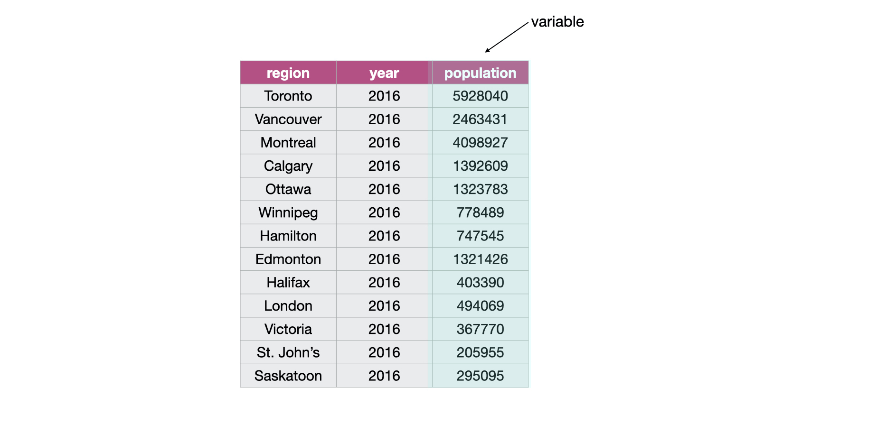

# Cleaning and wrangling data {#wrangling}

## Overview 

This chapter will be centered around tools for cleaning and wrangling data that move data from its raw format into a format that is suitable for data analysis. They 
will be presented in the context of a real world data science application, providing more practice working through a whole case study.

## Chapter learning objectives
By the end of the chapter, students will be able to:

* define the term "tidy data"
* discuss the advantages and disadvantages from storing data in a tidy data format
* recall and use the following tidyverse functions and operators for their intended data wrangling tasks:
    - `select`
    - `filter`
    - `%>%`
    - `map`
    - `mutate`
    - `summarize`
    - `group_by`
    - `pivot_longer`
    - `pivot_wider`
    - `separate`
    - `%in%`

## Vectors and Data frames

At this point, we know how to load data into R from various file formats. Once loaded into R, all the tools we have learned about for reading data into R represent 
the data as a data frame. So now we will spend some time learning more about data frames in R, such that we have a better understanding 
of how we can use and manipulate these objects.

### What is a data frame?

Let's first start by defining exactly what a data frame is. From a data perspective, it is a rectangle where the rows are the observations:

```{r 02-obs, echo = FALSE, message = FALSE, warning = FALSE, fig.cap = "Rows are the observations in a tidy data frame", fig.retina = 2, out.width = "650"}
knitr::include_graphics("img/obs.jpeg")
```

and the columns are the variables:


```{r 02-vars, echo = FALSE, message = FALSE, warning = FALSE, fig.cap = "Columns are the variables in a tidy data frame", fig.retina = 2, out.width = "650"}

```

From a computer programming perspective, in R, a data frame is a special subtype of a list object whose elements (columns) are *vectors*. 
For example, the data frame below has 3 elements that are vectors whose names are `state`, `year` and `population`.

```{r 02-vectors, echo = FALSE, message = FALSE, warning = FALSE, fig.cap = "Vectors in a tidy data frame", fig.retina = 2, out.width = "650"}
knitr::include_graphics("img/vectors.jpeg")
```

### What is a vector?

In R, vectors are objects that can contain 1 or more elements. The vector elements are ordered, and they must all be of the same type. Common 
example types of vectors are character (e.g., letter or words), numeric (whole numbers and fractions) and logical (e.g., `TRUE` or `FALSE`). In 
the vector shown below, the elements are of numeric type:

```{r 02-vector, echo = FALSE, message = FALSE, warning = FALSE, fig.cap = "Example of a vector in a tidy data frame", fig.retina = 2, out.width = "600"}
knitr::include_graphics("img/vector.jpeg")
```

### How are vectors different from a list?

Lists are also objects in R that have multiple elements. Vectors and lists differ by the requirement of element type consistency. All elements 
within a single vector must be of the same type (e.g., all elements are numbers), whereas elements within a single list can be of different 
types (e.g., characters, numbers, logicals and even other lists can be elements in the same list).

```{r 02-vec-vs-list, echo = FALSE, message = FALSE, warning = FALSE, fig.cap = "A vector versus a list", fig.retina = 2, out.width = "600"}
knitr::include_graphics("img/vec_vs_list.jpeg")
```


### What does this have to do with data frames?

As mentioned earlier, a data frame is really a special type of list where the elements can only be vectors. Representing data with such an 
object enables us to easily work with our data in a rectangular/spreadsheet like manner, and to have columns/vectors of 
different characteristics associated/linked in one object. This is similar to a table in a spreadsheet or a database.

```{r 02-dataframe, echo = FALSE, message = FALSE, warning = FALSE, fig.cap = "Data frame and vector types", fig.retina = 2, out.width = "650"}
knitr::include_graphics("img/dataframe.jpeg")
```

## Tidy Data

There are many ways spreadsheet-like dataset can be organized. In this chapter we are going to focus on the *tidy data* 
format of organization, and how to make your raw (and likely messy) data tidy. This is because a variety of tools we would like to 
be able to use in R are designed to work most effectively (and efficiently) with tidy data. 

### What is tidy data?

Tidy data satisfy the following three criteria:

- each row is a single observation,
- each column is a single variable, and
- each value is a single cell (i.e., its row and column position in the data frame is not shared with another value)


```{r 02-tidy-image, echo = FALSE, message = FALSE, warning = FALSE, fig.cap = "Image source: [R for Data Science](https://r4ds.had.co.nz/) by Garrett Grolemund & Hadley Wickham", fig.retina = 2, out.width = "650"}
knitr::include_graphics("img/tidy.png")
```


> **Definitions to know:**
>
> observation -  all of the quantities or a qualities we collect from a given entity/object 
>
> variable - any characteristic, number, or quantity that can be measured or collected 
>
> value - a single collected quantity or a quality from a given entity/object

### Why is tidy data important in R?

First, one of the most popular plotting toolsets in R, the `ggplot2` library, expects the data to be in a tidy format. Second, most statistical analysis functions expect data in tidy format. Given that both of these tasks are central in virtually any data analysis 
project, it is well worth spending the time to get your data into a tidy format up front. Luckily there are many well designed `tidyverse` data cleaning/wrangling tools to help you easily tidy your data. Let's explore them now!

### Going from wide to long (or tidy!) using `pivot_longer`

One common thing that often has to be done to get data into a tidy format is to combine columns that are really part the same variable but currently stored in separate columns. To do this we can use the function `pivot_longer`. `pivot_longer` acts to combine columns, and thus makes the data frame narrower.

Data is often stored in a wider, not tidy, format because this format is often more intuitive for human readability and understanding, and humans create data sets. 

We will work with a data set called [region_lang](https://ttimbers.github.io/canlang/), which contains data retrieved from the 2016 Canadian census. This data set contains counts, for each census metropolitan area, of how many Canadians cited each language as their mother tongue, the language spoken most often at home, and work and which language they have knowledge for. 

We will work with a subset of the `region_lang` data called `region_lang_top5_cities_wide.csv`, which contains the counts of only the mother tongue languages for five major Canadian cities (Toronto, Montreal, Vancouver, Calgary and Edmonton). Our data set is stored in an untidy format as shown below:

```{r 02-tidyverse, warning=FALSE, message=FALSE}
library(tidyverse)
lang_wide <- read_csv("data/region_lang_top5_cities_wide.csv") 
lang_wide
```

What is wrong with our untidy format above? From a data analysis perspective, this format is not ideal because in this format the outcome of the variable "region" (Toronto, Montreal, Vancouver, Calgary and Edmonton) is stored as column names and not easily accessible for the data analysis functions we will want to apply to our data set. Additionally, the values of the "mother_tongue" variable are spread across multiple columns and will require some sort of binding or joining to get them into one single column to allow us to do our desired visualization and statistical tasks later on.

To accomplish this data transformation we will use the `tidyverse` function `pivot_longer`. To use `pivot_longer` we need to specify the:

1. `data`: the data set

2. `cols` : the names of the columns that we want to combine

3. `names_to`: the name of a new column that will be created, whose values will come from the *names of the columns* that we want to combine 

4. `values_to`: the name of a new column that will be created, whose values will come from the *values of the columns* we want to combine 

For the above example, we use `pivot_longer` to combine the Toronto, Montreal, Vancouver, Calgary and Edmonton columns into a single column called `region`, and create a column called `mother_tongue` that contains the count of how many Canadians report each language as their mother tongue for each metropolitan area:

```{r}
lang_mother_tidy <- pivot_longer(lang_wide, 
                         cols = Toronto:Edmonton,
                         names_to = "region", 
                         values_to = "mother_tongue")
lang_mother_tidy
```

> **Splitting code across lines**: In the code above, the call to the `pivot_longer` function is split across several lines.*
> *This is allowed and encouraged when programming in R when your code line gets too long*
> *to read clearly. When doing this, it is important to end the line with a comma `,` so that R*
> *knows the function should continue to the next line.*

The data above is now tidy because all 3 criteria for tidy data have now been met:

1. All the variables (`region` and `mother_tongue`) are now their own columns in the data frame. 
2. Each observation, i.e., each category, language, region, and count of Canadians where that language is the mother tongue, are in a single row.
3. Each value is a single cell, i.e., its row, column position in the data frame is not shared with another value.

### Going from long to wide using `pivot_wider`

Suppose we have observations scattered across multiple rows rather than in a single row. To tidy this data we can use the function `pivot_wider`, which generally increases the number of columns (widens) and decreases the number of rows in our data set.

We will now work with another data set, `region_lang_top5_cities_long.csv`, which contains contains the number of Canadians reporting their primary language at home and at work for five major cities (Toronto, Montreal, Vancouver, Calgary and Edmonton). 
```{r 02-reading-long, warning=FALSE, message=FALSE}
lang_long <- read_csv("data/region_lang_top5_cities_long.csv") 
lang_long
```
What is wrong with the untidy format above? In this example each observation is a region for a particular language, however, in the data set each observation is split across multiple rows. To fix this we will use `pivot_wider`, and we need to specify the:

1. `data`: the dataset

2. `names_from`: the name of a the column from which to take the variable names

3. `values_from`: the name of the column from which to take the values

```{r , warning=FALSE, message=FALSE}
lang_home_tidy <- pivot_wider(lang_long, 
                                names_from = type, 
                                values_from = count)
lang_home_tidy
```

The data above is now tidy! We  an go through the 3 criteria again to check that this data is a tidy data set. 

1. All the variables are their own columns in the data frame, `most_at_home`, and `most_at_work` have been separated into their own columns in the data frame. 
2. Each observation, i.e., each `category`, `language`, `region`, `most_at_home` and `most_at_work`, are in a single row.
3. Each value is a single cell, i.e., its row, column position in the data frame is not shared with another value.

You might notice that we have the same number of columns in our data set as we did above. Therefore `pivot_wider` didn't really "widen" our data set as the name suggests. However, if we had more than two categories in the original `type` column then we would see the data set "widen".  

### Using `separate` to deal with multiple delimiters

As discussed above, data are also not considered tidy when multiple values are stored in the same cell. In addition to the 
previous untidiness we addressed in the earlier version of this data set, the one we show below is even messier: 
the Toronto, Montreal, Vancouver, Calgary and Edmonton columns contain both the number of Canadians reporting their primary language at home and at work separated by the delimiter "/". The column names are the values of a variable and the each value does not have it's own cell. To make this messy data tidy we'll have to fix both of these issues.

```{r, warning=FALSE, message=FALSE}
lang_messy <- read_csv("data/region_lang_top5_cities_messy.csv")
lang_messy 
```

First we’ll use `pivot_longer` to create two columns, `region` and `value`, similar to what we did previously:

```{r}
lang_messy_longer <- pivot_longer(lang_messy, 
                         cols = Toronto:Edmonton,
                         names_to = "region", 
                         values_to = "value")
lang_messy_longer
```

Then we'll use `separate` to split the `value` column into two columns, one that contains only the counts of Canadians that speak each language most at home, and one that contains the counts for most at work for each region:

```{r}
lang_no_delimiter <- separate(lang_messy_longer,
                                 col = value, 
                                 into = c("most_at_home", "most_at_work"),
                                 sep = "/") 
lang_no_delimiter
```
You might notice in the table the word `<chr>` is beneath each of the column names. The word under the column name indicates the data type of each column. Here all of our variables are "character" data types. A character data type can be a letter or a number. It makes sense for region, category and language to be stored as a character type. However, if we want to apply any functions that treat the `most_at_home` and `most_at_work` columns as a number (e.g. finding the maximum of the column) it won't be possible to do if the variable is stored as a `character`. R has a variety of data types, but here we will use `mutate()` to convert these two columns to an "integer" data type, which are numbers that do not have any decimals. 
```{r}
lang_no_delimiter <- mutate(lang_no_delimiter,  
                               most_at_home = as.integer(most_at_home), 
                               most_at_work = as.integer(most_at_work))
```
Is this data now tidy? Well, if we recall the 3 criteria for tidy data:

- each row is a single observation,
- each column is a single variable, and
- each value is a single cell.

We can see that this data now satisfies all 3 criteria, making it easier to analyze.
For example, we could visualize for each of these five major Canadian cities what the two most common languages reported by Canadians as their primary language at home are:

```{r 02-plot}
top2 <- lang_no_delimiter %>% 
  arrange(desc(most_at_home)) %>% 
  group_by(region) %>% 
  slice(1:2)

ggplot(top2, aes(x = region, y = most_at_home, fill = language)) + 
  geom_bar(stat = "identity")+ 
  scale_fill_brewer(palette="Set1") +
  theme(axis.text.x = element_text(angle = 90)) +
  scale_y_continuous(name = "Number of Canadians reporting \n their primary language at home", 
                     labels = scales::comma) +
  xlab("Region") +
  ggtitle("Top two languages reported by Canadians \n as their primary language at home \n for five major Canadian cities") 

```

From this visualization, we can see that in Calgary, Edmonton, Toronto and Vancouver, English was cited as the most common primary language used at home. However, in Montreal French was the most common language used at home and English was second. Punjabi, Tagalog, Cantonese and Mandarin were the second most common languages in Calgary, Edmonton, Toronto and Vancouver respectively. 

### Notes on defining tidy data

Is there only one shape for tidy data for a given data set? Not necessarily! It depends on the statistical question you are asking and what the variables are for that question. For tidy data, each variable should be its own column. So just as its important to match your statistical question with the appropriate data analysis tool (classification, clustering, hypothesis testing, etc). It's important to match your statistical question with the appropriate variables and ensure they are each represented as individual columns to make the data tidy.

## Combining functions using the pipe operator, `%>%`:

In R, we often have to call multiple functions in a sequence to process a data frame. The basic ways of doing this
can become quickly unreadable if there are many steps. For example, suppose we need to perform three operations on
a data frame `data`:

1) add a new column `new_col` that is double another `old_col`
2) filter for rows where another column, `other_col`, is more than 5, and
3) select only the new column `new_col` for those rows.


One way of doing is to just write multiple lines of code, storing temporary objects as you go:

```
output_1 <- mutate(data, new_col = old_col*2)
output_2 <- filter(output_1, other_col > 5)
output <- select(output_2, new_col)
```

This is difficult to understand for multiple reasons. The reader may be tricked into thinking the named `output_1` and `output_2`
objects are important for some reason, while they are just temporary intermediate computations. Further, the reader has to look
through and find where `output_1` and `output_2` are used in each subsequent line.

Another option for doing this would be to *compose* the functions:

```
output <- select(filter(mutate(data, new_col = old_col*2), other_col > 5), new_col)
```

Code like this can also be difficult to understand. Functions compose (reading from left to right) in the *opposite order* in which
they are computed by R (above, `mutate` happens first, then `filter`, then `select`). It is also just a really long line of code
to read in one go. 

The *pipe operator* `%>%` solves this problem, resulting in cleaner and easier-to-follow code. The below accomplishes the same thing as the previous two code blocks:

```
output <- data %>% 
            mutate(new_col = old_col*2) %>%
            filter(other_col > 5) %>%
            select(new_col)
```

You can think of the pipe as a physical pipe. It takes the output from the function on the left-hand side of the pipe, and
passes it as the first argument to the function on the right-hand side of the pipe. Note here that we have again split the 
code across multiple lines for readability; R is fine with this, since it knows that a line ending in a pipe `%>%` is continued
on the next line.

Next, let's learn about the details of using the pipe, and look at some examples of how to use it in data analysis.

### Using `%>%` to combine `filter` and `select`

Let's work with our tidy `lang_home_tidy` data set from above, which contains the number of Canadians reporting their primary language at home and at work for five major cities (Toronto, Montreal, Vancouver, Calgary and Edmonton):
```{r, warning=FALSE, message=FALSE}
lang_home_tidy
```

Suppose we want to create a subset of the data with only the columns for the language and counts for each language spoken most at home for the city of Vancouver. To do this, we can use the functions `filter` and `select`. First we use `filter` to create a data frame called `van_data` that contains only values for the city of Vancouver. We then use `select` on this data frame to keep only the variables we want:

```{r}
van_data <- filter(lang_home_tidy, region == "Vancouver")
van_data
van_data_selected <- select(van_data, language, most_at_home)
van_data_selected
```

Although this is valid code, there is a more readable approach we could take by using the pipe, `%>%`. With the pipe, 
we do not need to create an intermediate object to store the output from `filter`. Instead we can directly send the 
output of `filter` to the input of `select`:

```{r}
van_data_selected <- filter(lang_home_tidy, region == "Vancouver") %>% 
                    select(language, most_at_home)
van_data_selected
```

But wait - why does our `select` function call look different in these two examples? When you use the pipe, 
the output of the function on the left is automatically provided as the first argument for the function 
on the right, and thus you do not specify that argument in that function call. In the code above, the first
argument of `select` is the data frame we are `select`-ing from, which is provided by the output of `filter`. 

As you can see, both of these approaches give us the same output but the second approach is more clear and readable.

### Using `%>%` with more than two functions

The `%>%` can be used with any function in R. Additionally, we can pipe together more than two functions. For
example, we can pipe together three functions to order the rows by counts of the language most spoken at home for row where the counts are more than 10000 people:

```{r}
large_region_lang <- filter(lang_home_tidy, most_at_home > 10000) %>% 
  select(region, language, most_at_home) %>% 
  arrange(most_at_home)
large_region_lang
```

> **Note:**: `arrange` is a function that takes the name of a data frame and one or more column(s), and returns a 
> data frame where the rows are ordered by those columns in ascending order. Here we used only one column for sorting 
> (`most_at_home`), but more than one can also be used. To do this, list additional columns separated by commas. 
> The order they are listed in indicates the order in which they will be used for sorting. This is much like how an English
> dictionary sorts words: first by the first letter, then by the second letter, and so on.
>
> **Another Note:** You might also have noticed that we split the function calls across lines after the pipe, similar as to 
> when we did this earlier in the chapter for long function calls. Again this is allowed and recommeded, especially when the 
> piped function calls would create a long line of code. Doing this makes your code more readable. When you do this it is important 
> to end each line with the pipe operator `%>%` to tell R that your code is continuing onto the next line. 

## Iterating over data with `group_by` + `summarize`

### Calculating summary statistics:

As a part of many data analyses, we need to calculate a summary value for the data (a summary statistic). A useful `dplyr` function for doing this is 
`summarize`. Examples of summary statistics we might want to calculate are the number of observations, the average/mean value 
for a column, the minimum value for a column, etc. Below we show how to use the summarize function to calculate the minimum and maximum 
number of Canadians reporting a particular language as their primary language at home:

```{r}
lang_summary <- summarize(lang_home_tidy, 
                          min_most_at_home = min(most_at_home),
                          most_most_at_home = max(most_at_home))
lang_summary
```

### Calculating group summary statistics:

A common pairing with `summarize` is `group_by`. Pairing these functions together can let you summarize values for subgroups within a data set. For 
example, here we can use `group_by` to group the states based on which party they voted for in the US election, and then calculate 
the minimum, maximum and mean commute time for each of the groups.

The `group_by` function takes at least two arguments. The first is the data frame that will be grouped, and the second and onwards are columns 
to use in the grouping. Here we use only one column for grouping (`party`), but more than one can also be used. To do this, list additional columns separated by commas. 

```{r}
lang_summary_by_region <- group_by(lang_home_tidy, region) %>% 
  summarize(min_most_at_home = min(most_at_home),
            max_most_at_home = max(most_at_home))
lang_summary_by_region
```

## Additional reading on the `dplyr` functions

We haven't explicitly said this yet, but the `tidyverse` is actually a *meta R package*: it installs a collection of R packages that all follow 
the tidy data philosophy we discussed above. One of the tidyverse packages is `dplyr` - a data wrangling workhorse. You have already met 6 of 
the dplyr function (`select`, `filter`, `mutate`, `arrange`, `summarize`, and `group_by`). To learn more about those six and meet a few more 
useful functions, read the post [at this link](http://stat545.com/block010_dplyr-end-single-table.html#where-were-we).


## Using `purrr`'s `map*` functions to iterate

Where should you turn when you discover the next step in your data wrangling/cleaning process requires you to apply a function to 
each column in a data frame? For example, if you wanted to know the maximum value of each column in a data frame? Well you could use `summarize` 
as discussed above, but this becomes inconvenient when you have many columns, as `summarize` requires you to type out a column name and a data 
tranformation for each summary statistic that you want to calculate.

In cases like this, where you want to apply the same data transformation to all columns, it is more efficient to use `purrr`'s `map` function to 
apply it to each column. For example, let's find the maximum value of each column of the `mtcars` data frame (a built-in 
data set that comes with R) by using `map` with the `max` function. First, let's peak at the data to familiarize ourselves with it:

```{r 02-preview-data}
head(mtcars)
```

Next, we use `map` to apply the `max` function to each column. `map` takes two arguments, an object (a vector, data frame or list) that you want 
to apply the function to, and the function that you would like to apply. Here our arguments will be `mtcars` and `max`:

```{r 02-map}
max_of_columns <- map(mtcars, max)
max_of_columns
```

> **Note:** `purrr` is part of the tidyverse, and so like the `dplyr` and `ggplot` functions, once we call `library(tidyverse)` we 
> do not need to separately load the `purrr` package.

Our output looks a bit weird...we passed in a data frame, but our output doesn't look like a data frame. As it so happens, it is *not* a 
data frame, but rather a plain vanilla list:

```{r 02-type-out-of-map}
typeof(max_of_columns)
```

So what do we do? Should we convert this to a data frame? We could, but a simpler alternative is to just use a different `map_*` function from 
the `purrr` package. There are quite a few to choose from, they all work similarly and their name refects the type of output you want from 
the mapping operation:

| `map` function | Output |
|----------|--------|
| `map()` | list |
| `map_lgl()` | logical vector |
| `map_int()` | integer vector |
| `map_dbl()` | double vector |
| `map_chr()` | character vector |
| `map_df()` | data frame |

Let's get the column maximum's again, but this time use the `map_df` function to return the output as a data frame:

```{r 02-map-df-example}
max_of_columns <- map_df(mtcars, max)
max_of_columns
```

Which `map_*` function you choose depends on what you want to do with the output; you don't always have to pick `map_df`!

What if you need to add other arguments to the functions you want to map? For example, what if there were NA values in our columns that we wanted to know the maximum of? Well then we also need to add the argument `na.rm  = TRUE` to the `max` function so that we get a more useful value than NA returned (remember that is what happens with many of the built-in R statistical functions when NA's are present...). What we need to do in that case is do what is called "creating an anonymous function" within the `map_df` function. We do that in the place where we previously specified our max function. Here we will put the two calls to `map_df` right after each other so you can see the difference:

```
# no additional arguments to the max function 
map_df(mtcars, max)
```
versus
```
# adding the na.rm  = TRUE argument to the max function
map_df(mtcars, function(df) max(df, na.rm  = TRUE))
```

You can see that's quite a bit of extra typing... So the creators of `purrr` have made a shortcut for this because it is so commonly done. In the shortcut we replace `function(VARIABLE)` with a `~` and replace the `VARIABLE` in the function call with a `.`, see the example below:

```
# adding the na.rm  = TRUE argument to the max function using the shortcut 
map_df(mtcars, ~ max(., na.rm  = TRUE))
```

### A bit more about the `map_*` functions

The `map_*` functions are generally quite useful for solving problems involving iteration/repetition. Additionally, their use is not limited to columns 
of a data frame; `map_*` functions can be used to apply functions to elements of a vector or list, and even to lists of data frames, or nested data frames.

## Additional readings/resources
Grolemund & Wickham's [R for Data Science](https://r4ds.had.co.nz/) has a number of useful sections that provide additional information:

- [Data transformation](https://r4ds.had.co.nz/transform.html)
- [Tidy data](https://r4ds.had.co.nz/tidy-data.html)
- [The `map_*` functions](https://r4ds.had.co.nz/iteration.html#the-map-functions)
