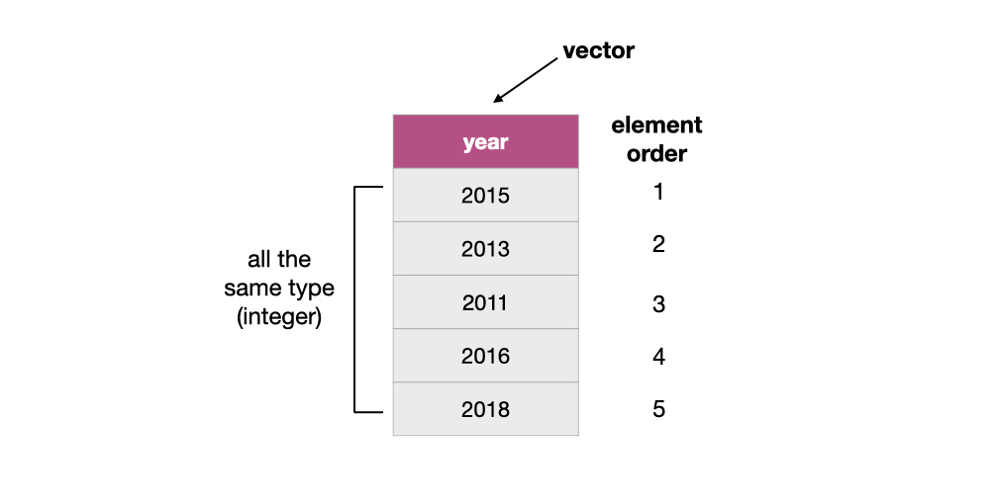

# Cleaning and wrangling data {#wrangling}

## Overview 

This chapter will be centred around tools for cleaning and wrangling data that move data from its raw format into a suitable format for data analysis. They will be presented in the context of a real-world data science application, providing more practice working through a whole case study.

## Chapter learning objectives
By the end of the chapter, students will be able to:

* define the term "tidy data"
* discuss the advantages and disadvantages of storing data in a tidy data format
* contrast the basic data types and structures in R
* recall and use the following tidyverse functions and operators for their intended data wrangling tasks:
    - `select`
    - `filter`
    - `mutate`
    - `%>%`
    - `%in%`
    - `pivot_longer`
    - `pivot_wider`
    - `separate`
    - `summarize`
    - `group_by`
    - `map`

## Data frames and Vectors

At this point, we know how to load data into R from various file formats. Once loaded into R, most of the tools we have learned about for reading data into R represent the data as a data frame. So now we will spend some time learning more about data frames in R so that we have a better understanding of how we can use and manipulate these objects.

### What is a data frame?

Let's first start by defining what a **data frame** is exactly. From a data perspective, it is a rectangle where the rows are the observations:

```{r 02-setup, include=FALSE}
devtools::install_github("ttimbers/canlang")
library(tidyverse)
library(canlang)
write_csv(region_lang, "data/region_lang.csv")
```

```{r 02-obs, echo = FALSE, message = FALSE, warning = FALSE, fig.cap = "Rows are observations in a data frame", fig.retina = 2, out.width = "650"}
knitr::include_graphics("img/obs.jpeg")
```

and the columns are the variables:


```{r 02-vars, echo = FALSE, message = FALSE, warning = FALSE, fig.cap = "Columns are variables in a data frame", fig.retina = 2, out.width = "650"}
knitr::include_graphics("img/vars.jpeg")
```

From a computer programming perspective, in R, a data frame is a special subtype of a list object whose elements (columns) are *vectors*. For example, the data frame below has three vectors whose names are `state`, `year` and `population`.

```{r 02-vectors, echo = FALSE, message = FALSE, warning = FALSE, fig.cap = "Data frame with 3 vectors", fig.retina = 2, out.width = "650"}
knitr::include_graphics("img/vectors.jpeg")
```

### What is a vector?

In R, **vectors** are objects that can contain one or more elements. The vector elements are ordered, and they must all be of the same *data type*. R has several different basic data types, as shown in table \@ref(tab:datatype-table).

In the vector shown below, the elements are of numeric type:

```{r 02-vector, echo = FALSE, message = FALSE, warning = FALSE, fig.cap = "Example of a numeric type vector", fig.retina = 2, out.width = "600"}

```


Table: (\#tab:datatype-table) Basic data types in R

| Data type | Description | Example |
|-------|------------------|-----------|
| character | Letters or numbers surrounded by quotes |  "1", "Hello world!" |
| numeric | Whole numbers and numbers with decimal values |   1.23, 20 |  
| integer | Numbers that do not contain decimals | 1L, 20L (where "L" tells R to store as an integer) | 
| logical |  A value of true and false | `TRUE`, `FALSE` | 

> There are other basic data types in R, such as *raw* and *complex*, which we won't cover in this textbook. 

### How are vectors different from a list?

Lists are also objects in R that have multiple elements. Vectors and lists differ by the requirement of element type consistency. All elements 
within a single vector must be of the same type (e.g., all elements are numbers), whereas elements within a single list can be of different 
types (e.g., characters, numbers, logicals and even other lists can be elements in the same list). 

```{r 02-vec-vs-list, echo = FALSE, message = FALSE, warning = FALSE, fig.cap = "A vector versus a list", fig.retina = 2, out.width = "600"}
knitr::include_graphics("img/vec_vs_list.jpeg")
```


### What does this have to do with data frames?

As mentioned earlier, a data frame is really a special type of list where the elements can only be vectors. Representing data with such an 
object enables us to easily work with our data in a rectangular/spreadsheet-like manner, and to have columns/vectors of 
different characteristics associated/linked in one object. This is similar to a table in a spreadsheet or a database.

```{r 02-dataframe, echo = FALSE, message = FALSE, warning = FALSE, fig.cap = "Data frame and vector types", fig.retina = 2, out.width = "650"}
knitr::include_graphics("img/dataframe.jpeg")
```

The functions from the `tidyverse` package that we are using often give us a special class of data frame called a tibble. Tibbles have some additional features and benefits over the built-in data frame object. These include the ability to add grouping (and other useful) attributes and more predictable type preservation when subsetting. Because a tibble is just a data frame with some added features, we will collectively refer to both built-in R data frames and tibbles as data frames in this book.

> You can use the function `class` on a data object to assess whether a data frame is a built-in R data frame or a tibble. If the data object is a data frame `class` will return `"data.frame"`, whereas if the data object is a tibble it  will return `"tbl_df" "tbl" "data.frame"`. You can easily convert built-in R  data frames to tibbles using the `tidyverse` `as_tibble` function.

Vectors, data frames and lists are basic types of *data structures* in R, which we summarize in table \@ref(tab:datastructure-table).

Table: (\#tab:datastructure-table) Basic data structures in R

| Data Structure | Description |
|------|------------------|
| vector | A set of values of the *same data type* (e.g. all values are numeric). A vector can be used to represent a single variable  | 
| data frame | A set of *vectors* of the *same length*. A data frame can be used to represent a data set. | 
| list | An ordered collection of one, or more, values. The elements in the list can be of different data types. | 

> There are other data structures, such as *matrices*, which will not be covered in this book. 

## Tidy Data

There are many ways a spreadsheet-like data set can be organized. This chapter will focus on the *tidy data* format of organization and how to make your raw (and likely messy) data tidy. We want to tidy our data because various tools we would like to use in R are designed to work most effectively (and efficiently) with tidy data. 


### What is tidy data?

Tidy data satisfy the following three criteria [@wickham2014tidy]:

- each row is a single observation,
- each column is a single variable, and
- each value is a single cell (i.e., its row and column position in the data frame is not shared with another value)

```{r 02-tidy-image, echo = FALSE, message = FALSE, warning = FALSE, fig.cap = "Tidy data", fig.retina = 2, out.width = "1150"}
knitr::include_graphics("img/tidy_data.jpeg")
```


> **Definitions to know:**
>
> observation -  all of the quantities or a qualities we collect from a given entity/object 
>
> variable - any characteristic, number, or quantity that can be measured or collected 
>
> value - a single collected quantity or a quality from a given entity/object

### Why is tidy data important in R?

First, one of R's most popular plotting toolsets, the `ggplot2` package (which is one of the packages that the `tidyverse` package loads), expects the data to be in a tidy format. Second, most statistical analysis functions also expect data in a tidy format. Given that both of these tasks are central in almost all data analysis projects, it is well worth spending the time to get your data into a tidy format upfront. Luckily there are many well-designed `tidyverse` data cleaning/wrangling tools to help you easily tidy your data. Let's explore them now!

### Going from wide to long (or tidy!) using `pivot_longer`

One common thing that often has to be done to get data into a tidy format is to combine columns that are really part of the same variable but currently stored in separate columns. Data is often stored in a wider, not tidy, format because this format is usually more intuitive for human readability and understanding, and humans create data sets. We can use the function `pivot_longer`, which combines columns, making the data frame longer and narrower. 

To learn how to use `pivot_longer`, we will work with a data set called [`region_lang`](https://ttimbers.github.io/canlang/), containing data retrieved from the 2016 Canadian census. For each census metropolitan area, this data set includes counts of how many Canadians cited each language as their mother tongue, the language spoken most often at home/work and which language they know. 

We will use `read_csv` to import a subset of the `region_lang` data called `region_lang_top5_cities_wide.csv`, which contains only the counts of how many Canadians cited each language as their mother tongue for five major Canadian cities (Toronto, Montreal, Vancouver, Calgary and Edmonton). Our data set is stored in an untidy format, as shown below:

```{r 02-tidyverse, warning=FALSE, message=FALSE}
library(tidyverse)
lang_wide <- read_csv("data/region_lang_top5_cities_wide.csv")
lang_wide
```


What is wrong with our untidy format above? From a data analysis perspective, this format is not ideal because, in this format, the outcome of the variable *region* (Toronto, Montreal, Vancouver, Calgary and Edmonton) is stored as column names. Thus it is not easily accessible for the data analysis functions we will want to apply to our data set. Additionally, the values of the *mother tongue* variable are spread across multiple columns, which will prevent us from doing any desired visualization or statistical tasks until we combine them into one column. For instance, suppose we want to know which languages had the highest number of Canadians reporting it as their mother tongue among all five regions? This question would be tough to answer with the data in its current format. It would be much easier to answer if we tidy our data first. 

To accomplish this data transformation, we will use the `tidyverse` function `pivot_longer`. To use `pivot_longer` we need to specify the:

1. `data`: the data set

2. `cols` : the names of the columns that we want to combine

3. `names_to`: the name of a new column that will be created, whose values will come from the *names of the columns* that we want to combine 

4. `values_to`: the name of a new column that will be created, whose values will come from the *values of the columns* we want to combine 

For the above example, we use `pivot_longer` to combine the Toronto, Montreal, Vancouver, Calgary and Edmonton columns into a single column called `region`, and create a column called `mother_tongue` that contains the count of how many Canadians report each language as their mother tongue for each metropolitan area. We use a colon `:` between Toronto, and Edmonton tells R to select all the columns in between Toronto and Edmonton: 
```{r}
lang_mother_tidy <- pivot_longer(lang_wide,
  cols = Toronto:Edmonton,
  names_to = "region",
  values_to = "mother_tongue"
)
lang_mother_tidy
```


> **Splitting code across lines**: In the code above, the call to the `pivot_longer` function is split across several lines.*
> *This is allowed and encouraged when programming in R when your code line gets too long*
> *to read clearly. When doing this, it is important to end the line with a comma `,` so that R*
> *knows the function should continue to the next line.*

The data above is now tidy because all three criteria for tidy data have now been met:

1. All the variables (`category`, `language`, `region` and ``mother_tongue``) are now their own columns in the data frame. 
2. Each observation, i.e., each `category`, `language`, `region`, and count of Canadians where that language is the mother tongue, are in a single row.
3. Each value is a single cell, i.e., its row, column position in the data frame is not shared with another value.

### Going from long to wide using `pivot_wider`

Suppose we have observations spread across multiple rows rather than in a single row. To tidy this data, we can use the function `pivot_wider`, which generally increases the number of columns (widens) and decreases the number of rows in a data set.

The data set `region_lang_top5_cities_long.csv` contains the number of Canadians reporting the primary language at home and work for five major cities (Toronto, Montreal, Vancouver, Calgary and Edmonton). 
```{r 02-reading-long, warning=FALSE, message=FALSE}
lang_long <- read_csv("data/region_lang_top5_cities_long.csv")
lang_long
```

What is wrong with this format above? In this example, each observation should be a language in a region. However, in the messy data set above, each observation is split across multiple two rows. One where the count for `most_at_home` is recorded and the other where the count for `most_at_work` is recorded. Suppose we wanted to visualize the relationship between the number of Canadians reporting their primary language at home and work. It would be difficult to do that with the data in its current format. To fix this, we will use `pivot_wider`, and we need to specify the:

1. `data`: the data set

2. `names_from`: the name of the column from which to take the variable names

3. `values_from`: the name of the column from which to take the values

```{r , warning=FALSE, message=FALSE}
lang_home_tidy <- pivot_wider(lang_long,
  names_from = type,
  values_from = count
)
lang_home_tidy
```

The data above is now tidy! We can go through the three criteria again to check that this data is a tidy data set. 

1. All the variables are their own columns in the data frame, i.e., `most_at_home`, and `most_at_work` have been separated into their own columns in the data frame. 
2. Each observation, i.e., each `category`, `language`, `region`, `most_at_home` and `most_at_work`, are in a single row.
3. Each value is a single cell, i.e., its row, column position in the data frame is not shared with another value.

You might notice that we have the same number of columns in our tidy data set as we did in our messy one. Therefore `pivot_wider` didn't really "widen" our data as the name suggests. However, if we had more than two categories in the original `type` column, then we would see the data set "widen."  

### Using `separate` to deal with multiple delimiters

Data are also not considered tidy when multiple values are stored in the same cell, as discussed above. In addition to the previous untidiness, we addressed in the earlier versions of this data set, the one we show below is even messier: 

the `Toronto`, `Montreal`, `Vancouver`, `Calgary` and `Edmonton` columns contain the number of Canadians reporting their primary language at home and work in one column separated by the delimiter "/". The column names are the values of a variable, AND each value does not have its own cell! To make this messy data tidy, we'll have to fix both of these issues.

```{r, warning=FALSE, message=FALSE}
lang_messy <- read_csv("data/region_lang_top5_cities_messy.csv")
lang_messy
```

First we’ll use `pivot_longer` to create two columns, `region` and `value`, similar to what we did previously:

```{r}
lang_messy_longer <- pivot_longer(lang_messy,
  cols = Toronto:Edmonton,
  names_to = "region",
  values_to = "value"
)
lang_messy_longer
```

Then we'll use `separate` to split the `value` column into two columns, one that contains only the counts of Canadians that speak each language most at home, and one that contains the counts for most at work for each region. To use `separate` we need to specify the:

1. `data`: the data set

2. `col`: the name of a the column we need to split

3. `into`: a character vector of the new column names we would like to put the split data into

4. `sep`: the separator on which to split

```{r}
lang_no_delimiter <- separate(lang_messy_longer,
  col = value,
  into = c("most_at_home", "most_at_work"),
  sep = "/"
)
lang_no_delimiter
```

You might notice in the table above the word `<chr>` appears beneath each of the column names. The word under the column name indicates the data type of each column. Here all of our variables are "character" data types. Recall, a character data type is a letter or a number surrounded by quotes. In the previous example, `most_at_home` and `most_at_work`  were `<dbl>` (double) (you can verify this by looking at the tables in the previous sections), which is a numeric data type. This change is due to the delimiter "/" when we read in this messy data set. R read the columns in as character types, and it stayed that way after we separated the columns. 

Here it makes sense for `region`, `category`, and `language` to be stored as a character type. However, if we want to apply any functions that treat the `most_at_home` and `most_at_work` columns as a number (e.g. finding the maximum of the column), it won't be possible to do if the variable is stored as a `character`. R has a variety of data types, but here we will use the function `mutate` to convert these two columns to a "numeric" data type. `mutate` is a function that will allow us to create a new variable in our data set. We specify the data set in the first argument, and in the proceeding arguments, we specify the function we want to apply (`as.numeric`) to which columns (`most_at_home`, `most_at_work`). Then we give the mutated variable a new name. Here we are naming the columns the same names ("most_at_home", "most_at_work"), but you can call these mutated variables anything you'd like. 

```{r}
lang_no_delimiter <- mutate(lang_no_delimiter,
  most_at_home = as.numeric(most_at_home),
  most_at_work = as.numeric(most_at_work)
)
lang_no_delimiter
```
Now we see `<dbl>` appears under our columns, `most_at_home` and `most_at_work`, indicating they are double data types (which is one of the sub-types of numeric)!

Is this data now tidy? Well, if we recall the three criteria for tidy data:

- each row is a single observation,
- each column is a single variable, and
- each value is a single cell.

We can see that this data now satisfies all three criteria, making it easier to analyze.
For example, we could visualize how many people speak each of Canada's two 
official languages (English and French) as their primary language at home in 
these 5 regions. To do this, we first need to filter the data set for the 
rows that list the category as "Official languages", and then we can again use
`ggplot` to create our data visualization. Here we create a bar chart to 
represent the counts for each region, and colour the counts by language. 

```{r 02-plot}
official_langs <- filter(lang_no_delimiter, category == "Official languages")

ggplot(official_langs, aes(x = region, y = most_at_work, fill = language)) +
  geom_bar(stat = "identity") +
  scale_color_manual(values = c("deepskyblue2", "firebrick1")) +
  xlab("Region") +
  scale_y_continuous(
    name = "Number of Canadians reporting their primary language at home",
    labels = scales::comma
  ) +
  coord_flip() + # making bars horizontal
  theme_bw()
```

From this visualization, we can see that in Calgary, Edmonton, Toronto and Vancouver, English was reported as the most common primary language used at home compared to French. However, in Montreal, French was reported as the most common primary language used at home over English. 

### Notes on defining tidy data

Is there only one shape for tidy data for a given data set? Not necessarily! It depends on the statistical question you are asking and what the variables are for that question. For tidy data, each variable should be its own column. So, just as it's essential to match your statistical question with the appropriate data analysis tool (classification, clustering, hypothesis testing, etc.). It's important to match your statistical question with the appropriate variables and ensure they are represented as individual columns to make the data tidy.


## More ways to create subsets of data frames with `select` & `filter`

Chapter 1 discussed two `tidyverse` functions: `select` and `filter` to select a single column and filter rows from a data frame. We will now learn more ways we can use these functions. Recall, the `select` function creates a subset of the *columns* of a data frame, while the `filter` subsets *rows* with specific values.

### Using `select` to extract multiple columns

We can use `select` to obtain a subset of the data frame with multiple columns. The first argument is the name of the data frame. Then we list all the columns we want as arguments separated by commas. Here we create a subset of three columns: language, mother tongue, and language spoken most often at home.

```{r}
three_columns <- select(can_lang, language, mother_tongue, most_at_home)
three_columns
```


### Using `select` to extract a range of columns

We can also use `select` to obtain a subset of the data frame constructed from a range of columns. To do this, we use the colon (`:`) operator to denote the range. For example, to get all the columns in the `can_lang` data frame from `language` to `most_at_home` we pass `language:most_at_home` as the second argument to the `select` function.

```{r}
column_range <- select(can_lang, language:most_at_home)
column_range
```

### Using `filter` to extract a single row

Recall we can use the `filter` function to obtain the subset of rows with desired values from a data frame. Again, our first argument is the name of the data frame object, `can_lang`. The second argument is a logical statement to use when filtering the rows. Here, for example, we'll say that we are interested in rows where the language is Mandarin. We use the *equivalency operator* (`==`) to compare the values of the `language` column with the value `"Mandarin"`. With these arguments, `filter` returns a data frame with all the columns of the input data frame but only the rows we asked for in our logical filter statement. 

```{r}
mandarin <- filter(can_lang, language == "Mandarin")
mandarin
```


```{r changing_the_units, include = FALSE}
mandarin_mother_tongue <- mandarin %>%
  pull(mother_tongue)
census_popn <- 35151728
```
### Using `filter` to extract rows with values above or below a threshold

If we are interested in finding the languages with higher numbers of people who speak it as their mother tongue than Mandarin---which is  `r format(mandarin_mother_tongue, scientific = FALSE, big.mark = ",")` people ---then we can create a filter to obtain rows where the value of `mother_tongue` is greater than `r format(mandarin_mother_tongue, scientific = FALSE, big.mark = ",")`. In this case, we see that `filter` returns a data frame with two rows; this indicates that two languages are spoken more often as their mother tongue compared to Mandarin.

```{r}
spoke_often_at_home <- filter(can_lang, mother_tongue > 592040)
spoke_often_at_home
```


### Using `mutate` to add columns or overwrite existing columns

We found that `r format(mandarin_mother_tongue, scientific = FALSE, big.mark = ",")` 
people reported that their mother tongue was Mandarin in the 2016 Canadian census. What does this number mean to us? To understand this number, we need context. In particular, how many people were in Canada when this data was collected? From the 2016 Canadian census profile, the population was reported to be `r format(census_popn, scientific = FALSE, big.mark = ",")` people. The number of people who report that Mandarin is their mother tongue is much more meaningful when we report it in this context. We can even go a step further and transform this count to a relative frequency or proportion. We can do this by dividing the number of people reporting a given language as their mother tongue by the number of people who live in Canada. For example, the proportion of people who reported that their mother tongue was Mandarin in the 2016 Canadian census was `r format(round(mandarin_mother_tongue/census_popn, 2), scientific = FALSE, big.mark = ",")`.


We can use the `mutate` function in R to calculate the proportion for all of the languages in the 2016 Canadian census data set. `mutate` is useful for creating new columns in a data frame or transforming existing columns. Its general syntax is: 

```{r img-mutate, echo = FALSE, message = FALSE, warning = FALSE, fig.cap = "Syntax for the mutate function", out.width="1100", fig.retina = 2}
knitr::include_graphics("img/mutate_function.jpeg")
```

Below we use `mutate` to calculate the proportion of people reporting a given language as their mother tongue for all the languages in the `can_lang` data set as shown in figure \@ref(fig:img-mutate):
```{r}
mutated_can_lang <- mutate(can_lang, mother_tongue_proportion = mother_tongue / 35151728)
```

Here we used a new data frame name (`mutated_can_lang`) and column name (`mother_tongue_proportion`) to create a new data frame and a new column. But we could have used the existing data frame name (`can_lang`) and column name (`mother_tongue`), which would have written over our original data frame and column.


## Combining functions using the pipe operator, `%>%`:

In R, we often have to call multiple functions in a sequence to process a data frame. The basic ways of doing this can become quickly unreadable if there are many steps. For example, suppose we need to perform three operations on
a data frame `data`:

1) add a new column `new_col` that is double another `old_col`
2) filter for rows where another column, `other_col`, is more than 5, and
3) select only the new column `new_col` for those rows.


One way of doing is to just write multiple lines of code, storing temporary objects as you go:

```
output_1 <- mutate(data, new_col = old_col * 2)
output_2 <- filter(output_1, other_col > 5)
output <- select(output_2, new_col)
```

This is difficult to understand for multiple reasons. The reader may be tricked into thinking the named `output_1` and `output_2`
objects are important for some reason, while they are just temporary intermediate computations. Further, the reader has to look
through and find where `output_1` and `output_2` are used in each subsequent line.

Another option for doing this would be to *compose* the functions:

```
output <- select(filter(mutate(data, new_col = old_col * 2), other_col > 5), new_col)
```

Code like this can also be difficult to understand. Functions compose (reading from left to right) in the *opposite order* in which
they are computed by R (above, `mutate` happens first, then `filter`, then `select`). It is also just a really long line of code
to read in one go. 

The *pipe operator* `%>%` solves this problem, resulting in cleaner and easier-to-follow code. The below accomplishes the same thing as the previous two code blocks:

```
output <- data %>% 
            mutate(new_col = old_col * 2) %>%
            filter(other_col > 5) %>%
            select(new_col)
```

You can think of the pipe as a physical pipe. It takes the output from the function on the left-hand side of the pipe, and
passes it as the first argument to the function on the right-hand side of the pipe. Note here that we have again split the 
code across multiple lines for readability; R is fine with this, since it knows that a line ending in a pipe `%>%` is continued
on the next line. Similarly, you see that after the first pipe, the remaining 
lines are indented until the end of the pipeline. This is not required for the 
R code to work, but again is used to aid in improving code readability.

Next, let's learn about the details of using the pipe, and look at some examples of how to use it in data analysis.

### Using `%>%` to combine `filter` and `select`

Let's work with our tidy `lang_home_tidy` data set from above, which contains the number of Canadians reporting their primary language at home and work for five major cities (Toronto, Montreal, Vancouver, Calgary and Edmonton):
```{r, warning=FALSE, message=FALSE}
lang_home_tidy
```

Suppose we want to create a subset of the data with only the languages and counts of each language spoken most at home for the city of Vancouver. To do this, we can use the functions `filter` and `select`. First, we use `filter` to create a data frame called `van_data` that contains only values for Vancouver. We then use `select` on this data frame to keep only the variables we want:

```{r}
van_data <- filter(lang_home_tidy, region == "Vancouver")
van_data
van_data_selected <- select(van_data, language, most_at_home)
van_data_selected
```

Although this is valid code, there is a more readable approach we could take by using the pipe, `%>%`. With the pipe, we do not need to create an intermediate object to store the output from `filter`. Instead we can directly send the 
output of `filter` to the input of `select`:

```{r}
van_data_selected <- filter(lang_home_tidy, region == "Vancouver") %>%
  select(language, most_at_home)
van_data_selected
```

But wait - why does our `select` function call look different in these two examples? When you use the pipe, 
the output of the function on the left is automatically provided as the first argument for the function on the right, and thus you do not specify that argument in that function call. In the code above, the first
argument of `select` is the data frame we are `select`-ing from, which is provided by the output of `filter`. 

As you can see, both of these approaches give us the same output, but the second approach is more clear and readable.

### Using `%>%` with more than two functions

The `%>%` can be used with any function in R. Additionally, we can pipe together more than two functions. For example, we can pipe together three functions to order the rows by counts of the language most spoken at home for only the counts that are more than 10,000 and only include the region, language and count of Canadians reporting their primary language at home in our table. 

To order the  by counts of the language most spoken at home we will use another 
`tidyverse` function, `arrange`. This function takes column names as input and 
orders the rows in the data frame in ascending order based on the values in the 
columns. Here we use only one column for sorting (`most_at_home`), but more than 
one can also be used. To do this, list additional columns separated by commas. 
The order they are listed in indicates the order in which they will be used for 
sorting. This is much like how an English dictionary sorts words: first by the 
first letter, then by the second letter, and so on. *Note: If you want to sort 
in reverse order, you can pair a function called `desc` with `arrange` (e.g., 
`arrange(desc(column_name))`).*


```{r}
large_region_lang <- filter(lang_home_tidy, most_at_home > 10000) %>%
  select(region, language, most_at_home) %>%
  arrange(most_at_home)
large_region_lang
```

> **Note:** You might also have noticed that we split the function calls across lines after the pipe, similar as to 
> when we did this earlier in the chapter for long function calls. Again this is allowed and recommeded, especially when the 
> piped function calls would create a long line of code. Doing this makes your code more readable. When you do this it is important 
> to end each line with the pipe operator `%>%` to tell R that your code is continuing onto the next line. 

## Iterating over data with `group_by` + `summarize`

### Calculating summary statistics:

As a part of many data analyses, we need to calculate a summary value for the data (a summary statistic). A useful `dplyr` function for doing this is 
`summarize`. Examples of summary statistics we might want to calculate are the number of observations, the average/mean value 
for a column, the minimum value for a column, etc. Below we show how to use the `summarize` function to calculate the minimum and maximum 
number of Canadians reporting a particular language as their primary language at home:

```{r}
lang_summary <- summarize(lang_home_tidy,
  min_most_at_home = min(most_at_home),
  most_most_at_home = max(most_at_home)
)
lang_summary
```

From this we see that there are some languages in the data set the no one speaks
as their primary language at home, as well as that the most commonly spoken 
primary language at home is spoken by  `r format(lang_summary$most_most_at_home[1], scientific = FALSE, big.mark = ",")` 
people.

### Calculating group summary statistics:

A common pairing with `summarize` is `group_by`. Pairing these functions together can let you summarize values for subgroups within a data set. For example, here, we can use `group_by` to group the regions and then calculate the minimum and maximum number of Canadians reporting the language as the primary language at home for each of the groups.

The `group_by` function takes at least two arguments. The first is the data frame that will be grouped, and the second and onwards are columns to use in the grouping. Here we use only one column for grouping (`region`), but more than one can also be used. To do this, list additional columns separated by commas. 

```{r}
lang_summary_by_region <- group_by(lang_home_tidy, region) %>%
  summarize(
    min_most_at_home = min(most_at_home),
    max_most_at_home = max(most_at_home)
  )
lang_summary_by_region
```

### Additional reading on the `dplyr` functions

As we breifly mentioned earlier in a note, the `tidyverse` is actually a *meta R package*: it installs and loads a collection of R packages that all follow 
the tidy data philosophy we discussed above. One of the `tidyverse` packages is `dplyr` - a data wrangling workhorse. You have already met six of 
the dplyr function (`select`, `filter`, `mutate`, `arrange`, `summarize`, and `group_by`). To learn more about those six and meet a few more 
useful functions, we recommend you checkout [this chapter](http://stat545.com/block010_dplyr-end-single-table.html#where-were-we) of the Stat 545 book.


## Using `purrr`'s `map*` functions to iterate

Where should you turn when you discover the next step in your data wrangling/cleaning process requires you to apply a function to 
each column in a data frame? For example, if you wanted to know the maximum value of each column in a data frame? Well, you could use `summarize` 
as discussed above. However, this becomes inconvenient when you have many columns, as `summarize` requires you to type out a column name and a data 
transformation for each summary statistic you want to calculate.

In cases like this, where you want to apply the same data transformation to all columns, it is more efficient to use `purrr`'s `map` function to 
apply it to each column. For example, let's find the maximum value of each column of the complete `region_lang` data frame by using `map` with the `max` function. First, let’s peak at the data to familiarize ourselves with it:
```{r 02-preview-data}
region_lang <- read_csv("data/region_lang.csv")
region_lang
```
Next, we will select only the numeric columns of the data frame:

```{r 02-numeric-data}
region_lang_numeric <- region_lang %>%
  select(mother_tongue:lang_known)
region_lang_numeric
```
Next, we use `map` to apply the `max` function to each column. `map` takes two arguments, an object (a vector, data frame or list) that you want 
to apply the function to, and the function that you would like to apply. Here our arguments will be `region_lang_numeric` and `max`:

```{r 02-map}
max_of_columns <- map(region_lang_numeric, max)
max_of_columns
```

> **Note:** `purrr` is part of the tidyverse, and so like the `dplyr` and `ggplot` functions, once we call `library(tidyverse)` we 
> do not need to load the `purrr` package separately.

Our output looks a bit weird... we passed in a data frame, but our output doesn't look like a data frame. As it so happens, it is *not* a 
data frame, but rather a plain vanilla list:

```{r 02-type-out-of-map}
typeof(max_of_columns)
```

So what do we do? Should we convert this to a data frame? We could, but a simpler alternative is to just use a different `map_*` function from 
the `purrr` package. There are quite a few to choose from, they all work similarly, and their name reflects the type of output you want from 
the mapping operation:

| `map` function | Output |
|----------|--------|
| `map()` | list |
| `map_lgl()` | logical vector |
| `map_int()` | integer vector |
| `map_dbl()` | double vector |
| `map_chr()` | character vector |
| `map_df()` | data frame |

Let's get the columns' maximums again, but this time use the `map_df` function to return the output as a data frame:

```{r 02-map-df-example}
max_of_columns <- map_df(region_lang_numeric, max)
max_of_columns
```

Which `map_*` function you choose depends on what you want to do with the output; you don't always have to pick `map_df`!

What if you need to add other arguments to the functions you want to map? For example, what if there were NA values in our columns that we wanted to know the maximum of? 

```{r 02-making-NAs, include = F}
region_with_nas <- region_lang_numeric %>%
  add_row(mother_tongue = 5, most_at_home = 5, most_at_work = NA, lang_known = NA) %>%
  arrange(!is.na(lang_known), lang_known) %>%
  write_csv("data/region_lang_with_nas.csv")
```

```{r 02-read-in-na}
region_with_nas <- read_csv("data/region_lang_with_nas.csv")
region_with_nas
map_df(region_with_nas, max)
```
Notice `map_df()` returns `NA` for the `most_at_work` and `lang_known` variables since those columns contained NAs in the data frame. Thus, we also need to add the argument `na.rm  = TRUE` to the `max` function so that we get a more useful value than `NA` returned (remember that is what happens with many of the built-in R statistical functions when NA's are present...). What we need to do in that case is add these additional arguments to the end of our call to to `map` and they will be passed to the function that we are mapping. An example of this is shown below:

```{r}
map_df(region_with_nas, max, na.rm = TRUE)
```
Now `map_df()` returns the maximum count for each column ignoring the NAs in the data set! 

The `map_*` functions are generally quite useful for solving problems involving iteration/repetition. Additionally, their use is not limited to columns 
of a data frame; `map_*` functions can be used to apply functions to elements of a vector or list, and even to lists of data frames, or nested data frames.

## Additional resources
Grolemund & Wickham's [R for Data Science](https://r4ds.had.co.nz/) has a number of useful sections that provide additional information:

- [Data transformation](https://r4ds.had.co.nz/transform.html)
- [Tidy data](https://r4ds.had.co.nz/tidy-data.html)
- [The `map_*` functions](https://r4ds.had.co.nz/iteration.html#the-map-functions)
