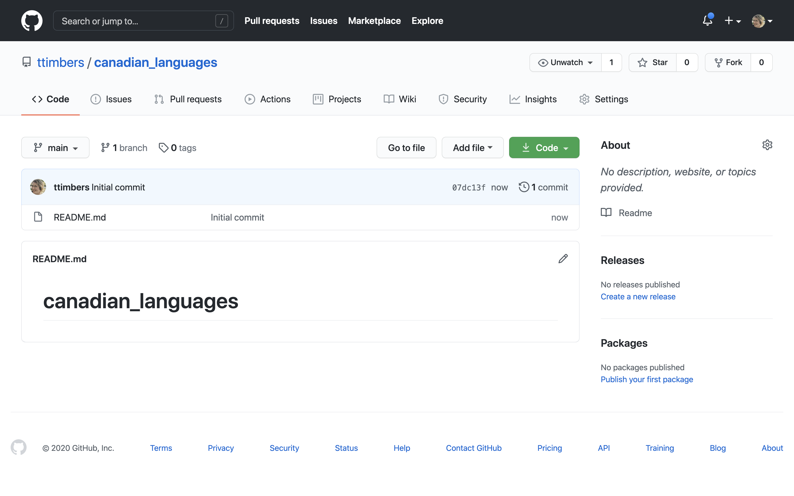
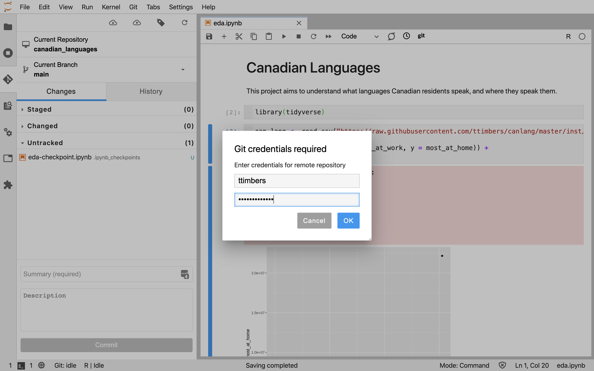
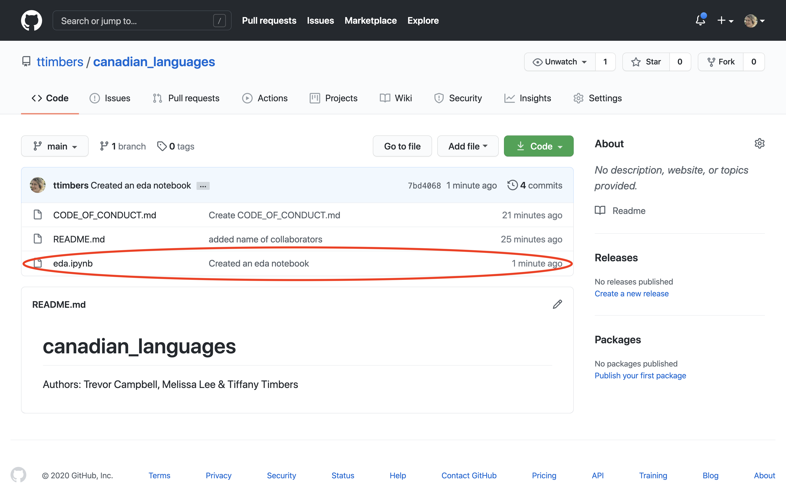

# Using Version control for collaboration {#version_control}

```{r setup_version_control, echo = FALSE}
library(knitr)
knitr::opts_chunk$set(echo = FALSE)
```

## Overview
TBD

## Chapter learning objectives
By the end of the chapter, students will be able to:

- Describe what version control is and why data analysis projects can benefit 
from using it
- Create a remote version control repository on GitHub.com
- Move changes to files from GitHub to JupyterHub, and from JupyterHub to GitHub
- Use best practices for collaboration when using version control to collaborate 
on a project with others

## What is version control and why should I use it?

Good data analysis projects require iteration and revision to move from project
ideation, through proof-of-concept to a finished product that is ready to be 
communicated to the intended audience. Without deliberate and 
conscious effort towards tracking which version of the analysis code led to 
which version of the results, data analysis projects can quickly and easily 
become messy, and the results irreproducible. Additionally,
the iterative nature of data analysis projects means that there are usually 
several times in a project where one would like to go back to an earlier version
of a code file, or back in time to an earlier state of the project to experiment 
or test things. Finally,
data analysis projects are rarely completed by a single person alone, and 
instead teams of people typically collaborate. This means that files need to be 
shared across multiple computers, and multiple people usually end up editing a
single file. In such a situation, determining which version of that file is 
the latest and most up to date can be a challenge - especially when two people 
are working on the same file at once!

Version control helps solve these challenges in analysis projects, particularly 
those that involve code, by tracking changes to code and data over 
the lifespan of a project (including when the changes were made and who made 
them). Version control also provides means to retreive earlier versions of a 
file (or files), or even go back in time to earlier states of the 
project. Finally, it also facilitates the merging changes from different
collaborators working on the project - even when they are working on the same 
file [@wilson2014best]!

You might find yourself saying, but I am not collaborating, so I don't need to 
use or learn version control. However, as this popular data science quote 
aptly points out, future you often has to collaborate with past you.

*You mostly collaborate with yourself, and me-from-two-months-ago never responds to email*

-- Mark T. Holder

## Creating a space to share your code online

A repository on [GitHub.com](https://github.com/) can used to host and share 
your analysis code and reports with your collaborators, as well as your 
project's intended audience.

Before you can create repositories, you will need a 
[GitHub.com](https://github.com/) account. You can sign up for a free account 
here: [https://github.com/](https://github.com/)

To create new repository to host your project, Login to 
[GitHub.com](https://github.com/) and click on the "+" icon in the upper right 
hand corner, and then click on "New Repository" as shown below:

```{r new_repository_01}
include_graphics("img/version_control/new_repository_01.png")
```

On the next page, do the following: 

- [ ] enter the name for the repository (here we put `dsci-101`) 
- [ ] Select "Public"
- [ ] Select "Initialize this repository with a README"
- [ ] click on the green "Create Repository" button

```{r new_repository_02}

```

Now you should have a repository that looks something like this:

```{r new_repository_03}

```

## Moving changes from GitHub to JupyterHub

Although there are several ways to create and edit files on 
[GitHub.com](https://github.com/) they are not quite powerful enough for 
efficiently creating and editing complex files, or files that need to be 
executed to assess whether they work (e.g., files containing code). Thus, it is 
useful to be able to connect the course repository that was created on 
[GitHub.com](https://github.com/) to a coding environment. This can be done on 
your local computer, or using a JupyterHub. Given that we use a JupyterHub with 
this course, we will here show how to do this using a JupyterHub.

We will be using a Jupyter lab git extension tool to clone our 
[GitHub.com](https://github.com/) course repository to the UBC JupyterHub. 
There are other ways to do this (e.g., use the Git command line tools in the 
terminal on JupyterHub), however we think this is the most user friendly way to 
introduce this. 

On the file browser tab, click the Git+ icon:

```{r clone_01}
include_graphics("img/version_control/clone_01.png")
```

Paste the url of the [GitHub.com](https://github.com/) course repository you 
created and click the blue "CLONE" button:

```{r clone_02}
include_graphics("img/version_control/clone_02.png")
```

On the file browser tab, you will now see a folder for your course repository 
(and inside it will be all the files that existed on 
[GitHub.com](https://github.com/)):

```{r clone_03}
include_graphics("img/version_control/clone_03.png")
```

## Sending changes you make on JupyterHub back to GitHub

Once you make changes (e.g., create or edit files) in your course repository on 
JupyterHub, you will need to send them back to the course repository on 
[GitHub.com](https://github.com/) to be able to share these with your students. 
We can use the Jupyter lab git extension tool to do this. It is a three stage 
process which includes: 

1. a `git add` command to flag which modified files you want to send back to the course repository on [GitHub.com](https://github.com/)
2. a `git commit` command that logs the changes and an associated (useful) message about what was changed
3. a `git push` command that sends the added and committed changes to the course repository on [GitHub.com](https://github.com/)

Below we walkthrough how you can use the Jupyter lab git extension tool to do 
each of the steps outlined above.

### `git add` the modified files

Below we created and saved a new file (named `demo-code.ipynb`) that we would 
like to send back to the course repository on [GitHub.com](https://github.com/). 
To `git add` this modified file, we click the Jupyter lab git extension icon on 
the far left-hand side of Jupyter lab:

```{r git_add_01}
include_graphics("img/version_control/git_add_01.png")
```

This opens the Git graphical user interface (GUI) pane, and then we click the 
plus sign beside the file that we want to `git add`. Note, because this is the 
first change for this file that we want to add, it lives under the "Untracked" 
heading. However, next time we edit this file and want to add the changes we 
made, we will find it under the "Changed" heading.

> Note: we can ignore the `demo-code-checkpoint.ipynb` file (sometimes called `.ipynb_checkpoints`), as it can be thought of as another type of "back-up" of our Jupyter notebook file we created, and we only need to send the file we directly created and edited to [GitHub.com](https://github.com/).

```{r git_add_02}
include_graphics("img/version_control/git_add_02.png")
```

This moves the file from the "Untracked" heading to the "Staged" heading and we 
are ready to now `git commit` the changes to log them and associate a (useful) 
message about what was changed.

```{r git_add_03}

```

###`git commit` the changes and an associated (useful) message about what was changed

To `git commit` the changes and an associated (useful) message about what was 
changed, we put our message in the text box at the bottom of the Git GUI pane 
and click on the blue "Commit" button. Note: It is highly recommended to make 
this message useful and relevant to the changes that were made, as this can 
later be used to peruse the file history and understand how the file evolved.

```{r git_commit_01}
include_graphics("img/version_control/git_commit_01.png")
```

After commiting the file, you will see there there are 0 "Staged" files and we 
are now ready to push our changes (and the attached commit message) to our 
course repository on [GitHub.com](https://github.com/):

```{r git_commit_02}
include_graphics("img/version_control/git_commit_02.png")
```

#### 3. `git push` the changes to the course repository on [GitHub.com](https://github.com/)

To send our added and committed the changes to the course repository on 
[GitHub.com](https://github.com/), we need to `git push`. To do this we click on 
the cloud icon with the up arrow on the Git GUI pane:

```{r git_push_01}
include_graphics("img/version_control/git_push_01.png")
```

We will then be prompted to enter our [GitHub.com](https://github.com/) username 
and password, and click the blue "OK" button:

```{r git_push_02}

```

If the files were successfully pushed to our course repository on 
[GitHub.com](https://github.com/) we will be given the success message shown 
below. Note: click "Dismiss" to continue working in Jupyter.

```{r git_push_03}
include_graphics("img/version_control/git_push_03.png")
```

If you now go to the course repository on [GitHub.com](https://github.com/) you 
will see the changes now exist there!

```{r git_push_04}

```

## Strategies for collaboration when using version control

### Pulling changes made in our course repository on [GitHub.com](https://github.com/) to JupyterHub

If you make changes in your course repository on 
[GitHub.com](https://github.com/) using one of the tools described earlier in 
this session (e.g., the pen tool, or file create/upload menus) then you will 
need to `git pull` those changes to the copy of the course repository on 
JupyterHub to get things in sync. You can do this using the Git GUI pane by 
clicking on the cloud icon with the down arrow:

```{r git_pull_01}

```

### Handling merge conflicts

TBD