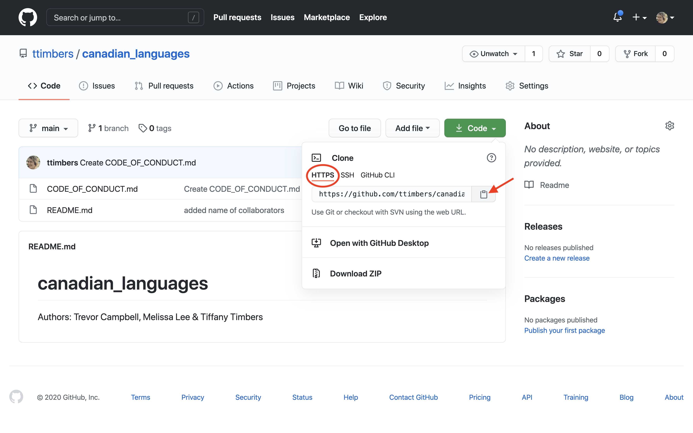
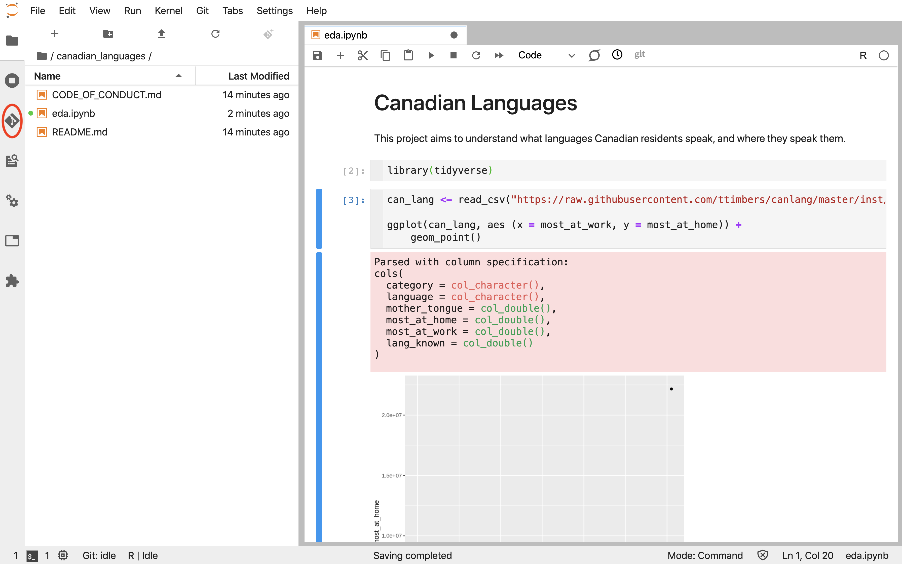
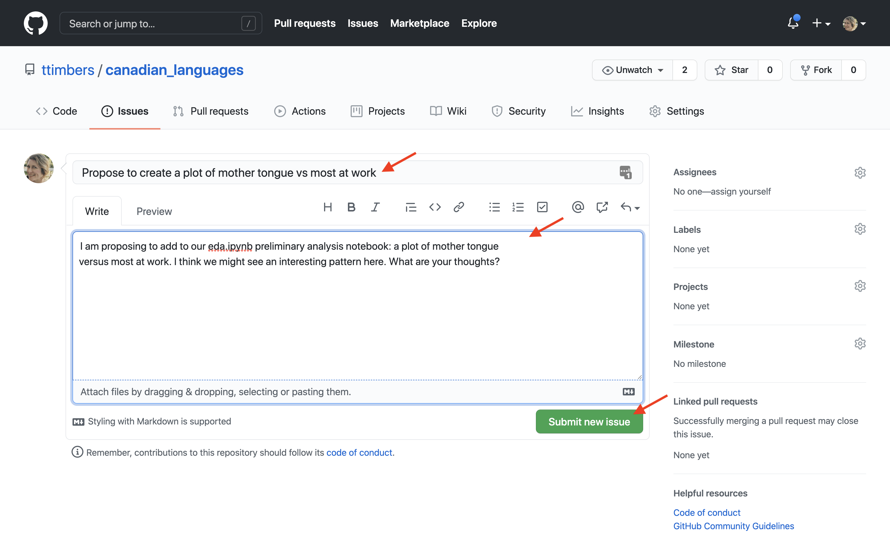
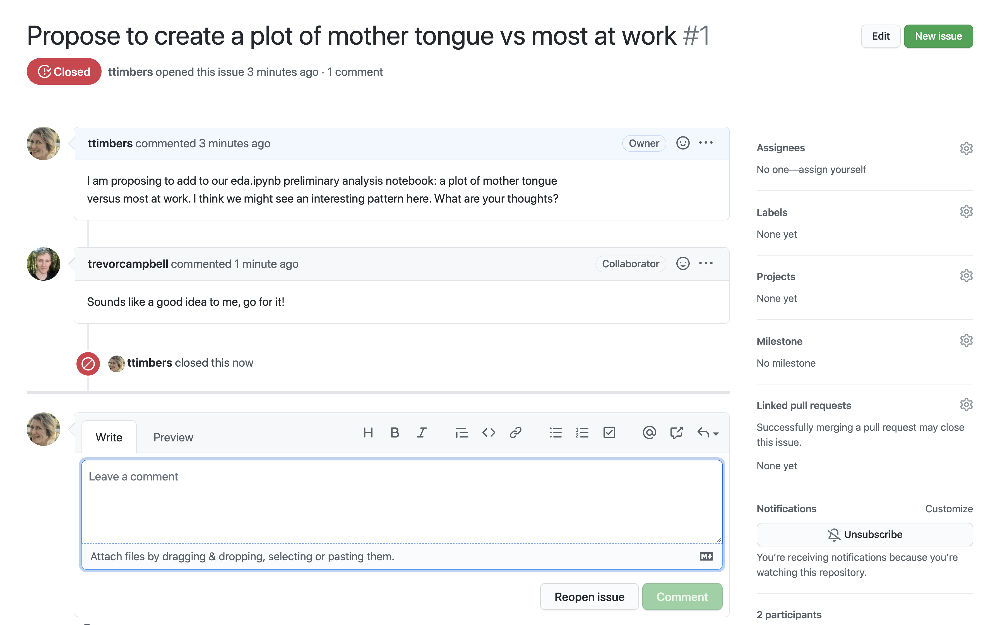

# Using Version control for collaboration {#version_control}

```{r setup_version_control, echo = FALSE}
library(knitr)
knitr::opts_chunk$set(echo = FALSE)
```

## Overview
This chapter will introduce the concept of tracking changes to a project over
the project's lifespan using version control, as well as strategies for 
effectively collaborating with others. This chapter also demonstrates how to use
version control tool (Git and GitHub) with JupyterHub to track changes to a 
data science project over time, as well as share code with collaborators and the
project's intended audience.

## Chapter learning objectives
By the end of the chapter, students will be able to:

- Describe what version control is and why data analysis projects can benefit 
from using it
- Create a remote version control repository on GitHub.com
- Move changes to files from GitHub to JupyterHub, and from JupyterHub to GitHub
- Use best practices for collaboration when using version control to collaborate 
on a project with others

## What is version control and why should I use it?

Good data analysis projects require iteration and revision to move from project
ideation, through proof-of-concept to a finished product that is ready to be 
communicated to the intended audience. Without deliberate and 
conscious effort towards tracking which version of the analysis code led to 
which version of the results, data analysis projects can quickly and easily 
become messy, and the results irreproducible. Additionally,
the iterative nature of data analysis projects means that there are usually 
several times in a project where one would like to go back to an earlier version
of a code file, or back in time to an earlier state of the project to experiment 
or test things. Finally,
data analysis projects are rarely completed by a single person alone, and 
instead teams of people typically collaborate. This means that files need to be 
shared across multiple computers, and multiple people usually end up editing a
single file. In such a situation, determining which version of that file is 
the latest and most up to date can be a challenge - especially when two people 
are working on the same file at once!

Version control helps solve these challenges in analysis projects, particularly 
those that involve code, by tracking changes to code and data over 
the lifespan of a project (including when the changes were made and who made 
them). Version control also provides means to retreive earlier versions of a 
file (or files), or even go back in time to earlier states of the 
project. Finally, it also facilitates the merging changes from different
collaborators working on the project - even when they are working on the same 
file [@wilson2014best]!

You might find yourself saying, but I am not collaborating, so I don't need to 
use or learn version control. However, as this popular data science quote 
aptly points out, future you often has to collaborate with past you.

*You mostly collaborate with yourself, and me-from-two-months-ago never responds to email*

-- Mark T. Holder

## Creating a space to share your code online

[GitHub](https://github.com/) is an example of a remote version control 
repository and Internet hosting service that software developers, and data 
scientists use to archive and share their projects. It has controls that allow
users to selectively share their work at various levels of permissions with 
collaborators as well as your project's intended audience. It interfaces with 
local version control systems on a laptop or JupyterHub server, so that files 
(including ones that contain code!) can be easily transferred and shared. 
Projects live in GitHub in a space called a repository. We will demonstrate now 
how to create such a space on for your data analysis project.

> Other examples of remote version control repository and Internet hosting 
> services include [GitLab](https://gitlab.com/) and 
> [Bitbucket](https://bitbucket.org/). Here we will focus on GitHub because it is 
> currently the most widely-used platform.

Before you can create repositories, you will need a 
[GitHub](https://github.com/) account. You can sign up for a free account 
here: [https://github.com/](https://github.com/)

To create new repository to host your project, Login to 
[https://github.com/](https://github.com/) and click on the "+" icon in the upper right 
hand corner, and then click on "New Repository" as shown below:

```{r new_repository_01}
include_graphics("img/version_control/new_repository_01.png")
```

On the next page, do the following: 

- [ ] enter the name for the repository (here we put `languages_in_canada`) 
- [ ] Select "Public"
- [ ] Select "Initialize this repository with a README"
- [ ] click on the green "Create Repository" button

> By clicking "Public" your repository is viewable by anyone, however, only you 
and any collaborators you specify have permission to create or edit files. If 
you have a project that needs to be kept private, you can instead select 
"Private" when creating a repository.

```{r new_repository_02}
include_graphics("img/version_control/new_repository_02.png")
```

Now you should have a repository that looks something like this:

```{r new_repository_03}
include_graphics("img/version_control/new_repository_03.png")
```

## Moving changes from GitHub to JupyterHub

Although there are several ways to create and edit files on 
[GitHub](https://github.com/) they are not quite powerful enough for 
efficiently creating and editing complex files, or files that need to be 
executed to assess whether they work (e.g., files containing code). Thus, it is 
useful to be able to connect the project repository that was created on 
[GitHub](https://github.com/) to a coding environment. This can be done on 
your local computer, or using a JupyterHub. Given that we use a JupyterHub with 
this course, we will here show how to do this using a JupyterHub.

Git is the software the does the job of tracking changes to a project, as well 
as the moving of a project (and it's history) across different machines. Like 
many other kinds of software, we as the users have to tell Git how and when to 
do this. Git commands can be directly entered into a terminal/command line, 
however there are many Git clients that make this process more user friendly. 
For this book, we will use the Jupyter Git extension tool as our Git client.

To bring a copy of our [GitHub](https://github.com/) project repository to 
a JupyterHub, from the JupyterHub click the Git+ icon on the file browser tab:

```{r clone_01}

```

Copy the url from the HTTPS tab of the Code drop down menu on [GitHub](https://github.com/):

```{r clone_02}

```

Paste the url of the [GitHub](https://github.com/) project repository you 
created and click the blue "CLONE" button:

```{r clone_03}

```

On the file browser tab, you will now see a folder for your project's repository 
(and inside it will be all the files that existed on 
[GitHub](https://github.com/)):

```{r clone_04}
include_graphics("img/version_control/clone_03.png")
```

## Sending changes you make on JupyterHub back to GitHub

Once you make changes, by creating or editing files, in your project repository 
on JupyterHub, you will need to send them back to the project repository on 
[GitHub](https://github.com/) to be able to share these with your 
collaborators and audience. Again, we can use the Jupyter lab Git extension tool 
to do this. It is a three stage process which includes: 

1. Specifying which files to "add" to the staging area. You can think of this as
a command which flags which modified files you want to send back to the project 
repository on [GitHub](https://github.com/).
2. Logging the changes to the flagged files on the local machine (which for us 
is a JupyterHub). This step requires specifying an associated (useful) message 
about what was changed. This step is called a "commit".
3. Push the added and committed changes that currently exist locally (i.e., on 
JupyterHub) to the project repository on [GitHub](https://github.com/)

Below we walk-through how you can use the Jupyter lab git extension tool to do 
each of the steps outlined above.

### Specifying which files whose changes you want to commit

Below we created and saved a new file (named `eda.ipynb`) that we would 
like to send back to the project repository on [GitHub](https://github.com/). 
To "add" this modified file to the staging area (*i.e.*, flagging that this is a
file whose changes we would like to log), we click the Jupyter lab git extension 
icon on the far left-hand side of Jupyter lab:

```{r git_add_01}

```

This opens the Jupyter lab Git graphical user interface (GUI) pane, and then we
click the plus sign beside the file that we want to "add". Note, because this is 
the first change for this file that we want to add, it lives under the 
"Untracked" heading. However, next time we edit this file and want to add the 
changes we made, we will find it under the "Changed" heading.

> Note: we can ignore the `eda-checkpoint.ipynb` file (sometimes called `.ipynb_checkpoints`), as it can be thought of as another type of "back-up" of 
our Jupyter notebook file we created, and we only need to send the file we 
directly created and edited to [GitHub](https://github.com/).

```{r git_add_02}

```

This moves the file from the "Untracked" heading to the "Staged" heading, 
essentially flagging this file, so that Git knows this is a change we'd like to 
log and share with others. Now we are ready to now "commit" the changes to log 
them and associate a (useful) message about what was changed.

```{r git_add_03}
include_graphics("img/version_control/git_add_03.png")
```

### Log the changes and an associated (useful) message about what was changed

To log the changes and an associated (useful) message about what was 
changed, we put our message in the text box at the bottom of the Git GUI pane 
and click on the blue "Commit" button. 

> It is highly recommended to write useful and meaningful messages about what 
was changed, as these commit messages, and the time date stamp for a given 
commit, are the primary means to navigate through our projects histry in the 
situation where we'd like to view or retrieve a past version of a file, or 
revert our project to an earlier state.

```{r git_commit_01}

```

After "commiting" the file(s), you will see there there are 0 "Staged" files and we 
are now ready to push our changes (and the attached commit message) to our 
project repository on [GitHub](https://github.com/):

```{r git_commit_02}

```

#### 3. Pushing the changes to [GitHub.com](https://github.com/)

To send our added and committed the changes to the project repository on 
[GitHub](https://github.com/), we need to "Push" them. To do this we click on 
the cloud icon with the up arrow on the Jupyter Git tab:

```{r git_push_01}

```

We will then be prompted to enter our [GitHub](https://github.com/) username 
and password, and click the blue "OK" button:

```{r git_push_02}
include_graphics("img/version_control/git_push_02.png")
```

If the files were successfully pushed to our project repository on 
[GitHub](https://github.com/) we will be given the success message shown 
below. Click "Dismiss" to continue working in Jupyter.

```{r git_push_03}
include_graphics("img/version_control/git_push_03.png")
```

If you now go to the project repository on [GitHub](https://github.com/) you 
will see the changes now exist there!

```{r git_push_04}
include_graphics("img/version_control/git_push_04.png")
```

## Strategies for collaboration when using version control

### Pulling changes from [GitHub](https://github.com/)

If your collaborators send changes to your project and you want to see and work
with them locally (i.e., on JupyterHub) then you need to "pull" those changes to 
the copy of the project repository on JupyterHub to get things in sync. You can 
do this using the Git tab by clicking on the cloud icon with the down arrow:

```{r git_pull_01}
include_graphics("img/version_control/git_pull_01.png")
```

It is good practice when collaborating with others, that you pull any changes 
your collaborators might have pushed to GitHub at the start of every work 
session. If you do not do this, and your collaborators have pushed some changes
to the project to GitHub, then you will be unable to push your changes to GitHub
without first pulling and merging their changes with yours. Usually, getting out 
of this situation is not too troublesome, and in most cases Git can 
automatically merge the changes for you, even if you and your collaborators were
working on different parts of the same file!

If however, you and your collaborators made changes to the same line of the same
file, Git will not be able to automatically merge the changes, as it will not
know whether to keep your version of the line, your collaborators version of the 
line, or some blend of the two. When this happens, Git will tell you that you 
have a merge conflict and that it needs human intervention (you!) to tell Git 
which version of the line(s) where the merge conflict occurred to keep.

### Handling merge conflicts

To handle the merge conflict, we need to open the file that had the merge 
conflict in a plain text editor and look for special marks that Git puts in the
file to tell you where the merge conflict occurred. The beginning of the merge
conflict is preceded by `<<<<<<< HEAD` and the end of the merge conflict is 
marked by `>>>>>>>`. Between these markings, Git also inserts a separator 
(`=======`). The version of the change before the separator is your change, and 
the version that follows the separator was the change that existed on GitHub.

Once you have decided which version of the change to keep, you need to use the 
plain text editor to remove the special marks that Git added to tell you where 
the merge conflict was, as well as edit the changes so that only a single 
version of the change is left in the file (either your version, your 
collaborator's version, or some blend of the two). The file must be saved, and 
then added and committed before you will be able to push the changes to GitHub.

### Communicating using GitHub issues

When communicating with collaborators regarding ideas, feedback, decisions and 
other such things about the project, what communication platform should be used
for written communication? At first glance, email and messaging apps appear to 
be reasonable choices, but both have flaws that can lead to loss of information
and non-inclusive team dynamics. 

Email has become a standard written communication platform which is ubiquitously
used, however, in many cases, much human intervention is required to keep emails
correctly filed and archived so that it is easy to go back and review all past 
written communications related to a particular project. Additionally, when 
working in a team on a project, it is easy to unintentionally leave someone off
of a team email, and as a consequence some team members can miss out on 
important information and decision-making opportunities for the project. 

Many messaging apps, allow for channels, where all team members are invited, and thus
leaving someone out of a conversation is less likely, however, organizing 
conversations into topics within a project channel, as well as searching for 
past conversations is usually quite challenging in these apps, as they were not 
designed for these purposes.

GitHub issues are an alternative written communication medium to email and 
messaging apps, and were designed specifically to facilitate project-level 
communication. GitHub issues are created from the issues tab in the project's
GitHub repository, and they persist there even after the issue is closed (in 
contrast to email, issues are not deleted). One issue thread is usually created
per topic, and they are easily searchable using GitHub's search tools. All 
issues are accessible to all project collaborators, so no one is left out of 
the conversation. Finally, issues can be setup so that team members get email 
notifications when a new issue is created, or a new post is made in an issue 
thread - so adding another notification system is not needed. Replying to issues 
from email is also possible. Thus, due to all of these advantages for 
project-level communication, we highly recommend their use for all written
project-related communications with collaborators.

To open a GitHub issue, first click on the GitHub issues tab:

```{r issue_01}
#
```

Next click new issue:

```{r issue_02}
#include_graphics("img/version_control/issue_02.png")
```

Add an issue title (which acts like an email subject line), and then put the 
written communication in the larger text box. Finally click "Submit new issue"
to post the issue to share with others:

```{r issue_03}
#
```

You can reply to an issue that someone opened by adding your written response to
the large text box and clicking comment:

```{r issue_04}
#include_graphics("img/version_control/issue_04.png")
```

When a conversation is resolved, you can click "Close issue", and closed issue 
can be later viewed be clicking "Closed" header link in the issue tab:

```{r issue_05}
#
```