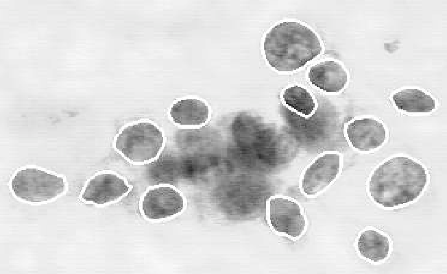

# Classification I: training & predicting {#classification}

```{r 05-setup, include=FALSE}
knitr::opts_chunk$set(message = FALSE, warning = FALSE, echo = TRUE)
```

## Overview 
Up until this point, we have focused solely on descriptive and exploratory
questions about data. This chapter and the next together serve as our first
foray into answering *predictive* questions about data. In particular, we will
focus on the problem of *classification*, i.e., using one or more quantitative
variables to predict the value of a third, categorical variable. This chapter
will cover the basics of classification, how to preprocess data to make it
suitable for use in a classifier, and how to use our observed data to make
predictions. The next will focus on how to evaluate how accurate the
predictions from our classifier are, as well as how to improve our classifier
(where possible) to maximize its accuracy.

## Chapter learning objectives 

By the end of the chapter, readers will be able to:

- Recognize situations where a classifier would be appropriate for making predictions
- Describe what a training data set is and how it is used in classification
- Interpret the output of a classifier
- Compute, by hand, the straight-line (Euclidean) distance between points on a graph when there are two explanatory variables/predictors
- Explain the K-nearest neighbour classification algorithm
- Perform K-nearest neighbour classification in R using `tidymodels`  
- Explain why one should center, scale, and balance data in predictive modelling
- Preprocess data to center, scale, and balance a dataset using a `recipe` 
- Combine preprocessing and model training using a Tidymodels `workflow`


## The classification problem
In many situations, we want to make predictions based on the current situation
as well as past experiences. For instance, a doctor may want to diagnose a
patient as either diseased or healthy based on their symptoms and the doctor's
past experience with patients; an email provider might want to tag a given
email as "spam" or "not spam" depending on past email text data; or an online
store may want to predict whether an order is fraudulent or not. 

These tasks are all examples of **classification**, i.e., predicting a
categorical class (sometimes called a *label*) for an observation given its
other quantitative variables (sometimes called *features*). Generally, a
classifier assigns an observation (e.g. a new patient) to a class (e.g.
diseased or healthy) on the basis of how similar it is to other observations
for which we know the class (e.g. previous patients with known diseases and
symptoms). These observations with known classes that we use as a basis for
prediction are called a **training set**. We call them a "training set" because
we use these observations to train, or teach, our classifier so that we can use
it to make predictions on new data that we have not seen previously.

There are many possible classification algorithms that we could use to predict
a categorical class/label for an observation. In addition, there are many
variations on the basic classification problem, e.g.,  binary classification
where only two classes are involved (e.g. disease or healthy patient), or
multiclass classification, which involves assigning an object to one of several
classes (e.g., private, public, or not for-profit organization). Here we will
focus on the simple, widely used **K-nearest neighbours** algorithm for the
binary classification problem. Other examples you may encounter in the future include decision trees, support vector machines (SVMs), logistic
regression, and neural networks.

## Exploring a labelled data set

In this chapter and the next, we will study a data set of 
[digitized breast cancer image features](http://archive.ics.uci.edu/ml/datasets/Breast+Cancer+Wisconsin+%28Diagnostic%29),
created by Dr. William H. Wolberg, W. Nick Street, and Olvi L. Mangasarian at
the University of Wisconsin, Madison. Each row in the data set represents an
image of a tumour sample, including the diagnosis (benign or malignant) and
several other measurements (e.g., nucleus texture, perimeter, area, etc.).
Diagnosis for each image was conducted by physicians. 

As with all data analyses, we first need to formulate a precise question that
we want to answer. Here, the question is *predictive*: can we use the tumour
image measurements available to us to predict whether a future tumour image
(with unknown diagnosis) shows a benign or malignant tumour? Answering this
question is important because traditional, non-data-driven methods for tumour
diagnosis are quite subjective and dependent upon how skilled and experienced
the diagnosing physician is. Furthermore, benign tumours are not normally
dangerous; the cells stay in the same place and the tumour stops growing before
it gets very large. By contrast, in malignant tumours, the cells invade the
surrounding tissue and spread into nearby organs where they can cause serious
damage ([learn more about cancer here](https://www.worldwidecancerresearch.org/who-we-are/cancer-basics/)).
Thus, it is important to quickly and accurately diagnose the tumour type to
guide patient treatment.

**Loading the data**

Our first step is to load, wrangle, and explore the data using visualizations
in order to better understand the data we are working with.  We start by
loading the necessary packages for our analysis. Below you'll see (in addition
to the usual `tidyverse`) a new package: `forcats`. 
The `forcats` package enables us to easily
manipulate factors in R; factors are a special categorical type of variable in
R that are often used for class label data. 


```{r 05-load-libraries}
library(tidyverse)
library(forcats)
```

In this case, the file containing the breast cancer data set is a simple `.csv`
file with headers. We'll use the `read_csv` function with no additional
arguments, and then inspect its contents:

```{r 05-read-data}
cancer <- read_csv("data/wdbc.csv")
cancer
```

**Variable descriptions**

Breast tumours can be diagnosed by performing a *biopsy*, a process where
tissue is removed from the body and examined for the presence of disease.
Traditionally these procedures were quite invasive; modern methods such as fine
needle asipiration, used to collect the present data set, extract only a small
amount of tissue and are less invasive. Based on a digital image of each breast
tissue sample collected for this data set, 10 different variables were measured
for each cell nucleus in the image (3-12 below), and then the mean 
 for each variable across the nuclei was recorded. As part of the
data preparation, these values have been *scaled*; we will discuss what this
means and why we do it later in this chapter. Each image additionally was given
a unique ID and a diagnosis for malignance by a physician.  Therefore, the
total set of variables per image in this data set are:


1. ID number 
2. Class: the diagnosis of **M**alignant or **B**enign
3. Radius: the mean of distances from center to points on the perimeter
4. Texture: the standard deviation of gray-scale values
5. Perimeter: the length of the surrounding contour 
6. Area: the area inside the contour
7. Smoothness: the local variation in radius lengths
8. Compactness: the ratio of squared perimeter and area
9. Concavity: severity of concave portions of the contour 
10. Concave Points: the number of concave portions of the contour
11. Symmetry 
12. Fractal Dimension 

```{r 05-bc-cells, echo = FALSE, message = FALSE, warning = FALSE, fig.cap = "A malignant breast fine needle aspiration image. [Source](https://pubsonline.informs.org/doi/abs/10.1287/opre.43.4.570)", fig.retina = 2, out.width="400"}

```

Below we use `glimpse` to preview the data frame. This function can make it easier to inspect the data when we have a lot of columns:

```{r 05-glimpse}
glimpse(cancer)
```

We can see from the summary of the data above that `Class` is of type character
(denoted by `<chr>`). Since we are going to be working with `Class` as a
categorical statistical variable, we will convert it to factor using the
function `as_factor`.

```{r 05-class}
cancer <- cancer |>
  mutate(Class = as_factor(Class))
glimpse(cancer)
```

Factors have what are called "levels", which you can think of as categories. We
can ask for the levels from the `Class` column by using the `levels` function.
This function should return the name of each category in that column. Given
that we only have 2 different values in our `Class` column (B and M), we
only expect to get two names back.  Note that the `levels` function requires
a *vector* argument, while the `select` function outputs a *data frame*; 
so we use the `pull` function, which converts a single
column of a data frame into a vector.

```{r 05-levels}
cancer |>
  select(Class) |>
  pull() |> # turns a data frame into a vector
  levels()
```

**Exploring the data**

Before we start doing any modelling, let's explore our data set. Below we use
the `group_by` + `summarize` code pattern we used before to see that we have
357 (63\%) benign and 212 (37\%) malignant tumour observations.

```{r 05-tally}
num_obs <- nrow(cancer)
cancer |>
  group_by(Class) |>
  summarize(
    n = n(),
    percentage = n() / num_obs * 100
  )
```

Next, let's draw a scatter plot to visualize the relationship between the
perimeter and concavity variables. Rather than use `ggplot's` default palette,
we define our own here (`cbPalette`) and pass it as the `values` argument to
the `scale_color_manual` function. We also make the category labels ("B" and
"M") more readable by changing them to "Benign" and "Malignant" using the
`labels` argument.

```{r 05-scatter, fig.height = 4, fig.width = 5, fig.cap= "Scatterplot of concavity versus perimeter coloured by diagnosis label"}
# colour palette
cbPalette <- c("#E69F00", "#56B4E9", "#009E73", "#F0E442", "#0072B2", "#D55E00", "#CC79A7", "#999999")

perim_concav <- cancer |>
  ggplot(aes(x = Perimeter, y = Concavity, color = Class)) +
  geom_point(alpha = 0.5) +
  labs(color = "Diagnosis") +
  scale_color_manual(labels = c("Malignant", "Benign"), values = cbPalette)
perim_concav
```

In this visualization, we can see that malignant observations typically fall in
the the upper right-hand corner of the plot area. By contrast, benign
observations typically fall in lower left-hand corner of the plot. Suppose we
obtain a new observation not in the current data set that has all the variables
measured *except* the label (i.e., an image without the physician's diagnosis
for the tumour class). We could compute the perimeter and concavity values,
resulting in values of, say, 1 and 1. Could we use this information to classify
that observation as benign or malignant? What about a new observation with
perimeter value of -1 and concavity value of -0.5? What about 0 and 1? It seems
like the *prediction of an unobserved label* might be possible, based on our
visualization.  In order to actually do this computationally in practice, we
will need a classification algorithm; here we will use the K-nearest neighbour
classification algorithm.

## Classification with K-nearest neighbours

```{r 05-knn-0, echo = FALSE}
## Find the distance between new point and all others in data set
euclidDist <- function(point1, point2) {
  # Returns the Euclidean distance between point1 and point2.
  # Each argument is an array containing the coordinates of a point."""
  (sqrt(sum((point1 - point2)^2)))
}
distance_from_point <- function(row) {
  euclidDist(new_point, row)
}
all_distances <- function(training, new_point) {
  # Returns an array of distances
  # between each point in the training set
  # and the new point (which is a row of attributes)
  distance_from_point <- function(row) {
    euclidDist(new_point, row)
  }
  apply(training, MARGIN = 1, distance_from_point)
}
table_with_distances <- function(training, new_point) {
  # Augments the training table
  # with a column of distances from new_point
  data.frame(training, Distance = all_distances(training, new_point))
}
new_point <- c(2, 4)
attrs <- c("Perimeter", "Concavity")
my_distances <- table_with_distances(cancer[, attrs], new_point)
neighbours <- cancer[order(my_distances$Distance), ]
```
To predict the label of a new observation, i.e., classify it as either benign
or malignant, the K-nearest neighbour classifier generally finds the $K$
"nearest" or "most similar" observations in our training set, and then uses
their diagnoses to make a prediction for the new observation's diagnosis. To
illustrate this concept, we will walk through an example.  Suppose we have a
new observation, with perimeter of `r new_point[1]` and concavity of `r new_point[2]` 
(labelled in red on the scatterplot), whose diagnosis "Class" is
unknown.


```{r 05-knn-1, echo = FALSE, fig.height = 4, fig.width = 5, fig.cap="Scatterplot of concavity versus perimeter with new observation labelled in red"}
perim_concav +
  geom_point(aes(x = new_point[1], y = new_point[2]), color = cbPalette[6], size = 2.5)
```
</center>

We see that the nearest point to this new observation is **malignant** and
located at the coordinates (`r round(neighbours[1, c(attrs[1], attrs[2])],
1)`). The idea here is that if a point is close to another in the scatterplot,
then the perimeter and concavity values are similar, and so we may expect that
they would have the same diagnosis. 


```{r 05-knn-2, echo = FALSE, fig.height = 4, fig.width = 5, fig.cap="Scatterplot of concavity versus perimeter where the nearest neighbour to the new observation is malignant"}
perim_concav + geom_point(aes(x = new_point[1], y = new_point[2]),
  color = cbPalette[6],
  size = 2.5
) +
  geom_segment(aes(
    x = new_point[1],
    y = new_point[2],
    xend = pull(neighbours[1, attrs[1]]),
    yend = pull(neighbours[1, attrs[2]])
  ), color = "black")
```
</center>

```{r 05-knn-3, echo = FALSE}
new_point <- c(0.2, 3.3)
attrs <- c("Perimeter", "Concavity")
my_distances <- table_with_distances(cancer[, attrs], new_point)
neighbours <- cancer[order(my_distances$Distance), ]
```

Suppose we have another new observation with perimeter `r new_point[1]` and
concavity of `r new_point[2]`. Looking at the scatterplot below, how would you
classify this red observation? The nearest neighbour to this new point is a
**benign** observation at (`r round(neighbours[1, c(attrs[1], attrs[2])], 1)`).
Does this seem like the right prediction to make? Probably not, if you consider
the other nearby points...


```{r 05-knn-4, echo = FALSE, fig.height = 4, fig.width = 5, fig.cap="Scatterplot of concavity versus perimeter where the nearest neighbour to this new observation is benign"}
perim_concav + geom_point(aes(x = new_point[1], y = new_point[2]),
  color = cbPalette[6],
  size = 2.5
) +
  geom_segment(aes(
    x = new_point[1],
    y = new_point[2],
    xend = pull(neighbours[1, attrs[1]]),
    yend = pull(neighbours[1, attrs[2]])
  ), color = "black")
```
</center>

So instead of just using the one nearest neighbour, we can consider several
neighbouring points, say $K = 3$, that are closest to the new red observation
to predict its diagnosis class. Among those 3 closest points, we use the
*majority class* as our prediction for the new observation. In this case, we
see that the diagnoses of 2 of the 3 nearest neighbours to our new observation
are malignant. Therefore we take majority vote and classify our new red
observation as malignant. 
<!-- For our red observation at (`r new_point`), the nearest points are: (`r round(neighbours[1, c(attrs[1], attrs[2])], 1)`), (`r round(neighbours[2,  c(attrs[1], attrs[2])],1)`), and (`r round(neighbours[3, c(attrs[1], attrs[2])],1)`). -->


```{r 05-knn-5, echo =  FALSE, fig.height = 4, fig.width = 5, fig.cap="Scatterplot of concavity versus perimeter with three nearest neighbours"}
perim_concav + geom_point(aes(x = new_point[1], y = new_point[2]),
  color = cbPalette[6],
  size = 2.5
) +
  geom_segment(aes(
    x = new_point[1], y = new_point[2],
    xend = pull(neighbours[1, attrs[1]]),
    yend = pull(neighbours[1, attrs[2]])
  ), color = "black") +
  geom_segment(aes(
    x = new_point[1], y = new_point[2],
    xend = pull(neighbours[2, attrs[1]]),
    yend = pull(neighbours[2, attrs[2]])
  ), color = "black") +
  geom_segment(aes(
    x = new_point[1], y = new_point[2],
    xend = pull(neighbours[3, attrs[1]]),
    yend = pull(neighbours[3, attrs[2]])
  ), color = "black")
```
</center>

Here we chose the $K=3$ nearest observations, but there is nothing special
about $K=3$. We could have used $K=4, 5$ or more (though we may want to choose
an odd number to avoid ties). We will discuss more about choosing $K$ in the
next chapter. 

**Distance between points** 

How do we decide which points are the $K$ "nearest" to our new observation? We
can compute the distance between any pair of points using the following
formula: 

$$\mathrm{Distance} = \sqrt{(x_a -x_b)^2 + (y_a - y_b)^2}$$
```{r 05-multiknn-0, echo = FALSE}
new_point <- c(0, 3.5)
```

> This formula -- sometimes called the *Euclidean distance* -- is simply the straight line distance between two points on the x-y plane with coordinates $(x_a, y_a)$ and $(x_b, y_b)$.

Suppose we want to classify a new observation with perimeter of `r new_point[1]` and 
concavity of `r new_point[2]`. Let's calculate the distances
between our new point and each of the observations in the training set to find
the $K=5$ observations in the training data that are nearest to our new point. 


```{r 05-multiknn-1, echo = FALSE, fig.height = 4, fig.width = 5, fig.cap="Scatterplot of concavity versus perimeter with new observation labelled in red"}
perim_concav <- cancer |>
  ggplot(aes(x = Perimeter, y = Concavity, color = Class)) +
  geom_point(alpha = 0.5) +
  scale_x_continuous(name = "Perimeter", breaks = seq(-2, 4, 1)) +
  scale_y_continuous(name = "Concavity", breaks = seq(-2, 4, 1)) +
  labs(color = "Diagnosis") +
  scale_color_manual(labels = c("Malignant", "Benign"), values = cbPalette) +
  geom_point(aes(x = new_point[1], y = new_point[2]), color = cbPalette[6], size = 2.5)
perim_concav
```
</center>


```{r 05-multiknn-2}
new_obs_Perimeter <- 0
new_obs_Concavity <- 3.5
cancer |>
  select(ID, Perimeter, Concavity, Class) |>
  mutate(dist_from_new = sqrt((Perimeter - new_obs_Perimeter)^2 + (Concavity - new_obs_Concavity)^2)) |>
  arrange(dist_from_new) |>
  slice(1:5) # subset the first 5 rows
```

From this, we see that 3 of the 5 nearest neighbours to our new observation are
malignant so classify our new observation as malignant. We circle those 5 in
the plot below:


```{r 05-multiknn-3, echo = FALSE, fig.cap="Scatterplot of concavity versus perimeter with 5 nearest neighbours circled"}
perim_concav + annotate("path",
  x = new_point[1] + 1.4 * cos(seq(0, 2 * pi,
    length.out = 100
  )),
  y = new_point[2] + 1.4 * sin(seq(0, 2 * pi,
    length.out = 100
  ))
)
```
</center>

```{r 05-multiknn-4, echo = FALSE}
my_distances <- table_with_distances(cancer[, attrs], new_point)
neighbours <- my_distances[order(my_distances$Distance), ]
k <- 5
tab <- data.frame(neighbours[1:k, ], cancer[order(my_distances$Distance), ][1:k, c("ID", "Class")])
```

It can be difficult sometimes to read code as math, so here we mathematically
show the calculation of distance for each of the 5 closest points.

|Perimeter | Concavity | Distance          | Class          |
 |----------------- | -----------------    | ---------------| ----------------- |
| `r round(tab[1,1],2) `              	| `r round(tab[1,2],2) `             |$\sqrt{0  - 0.241)^2 + (3.5 - 2.65)^2}=$ `r round(neighbours[1, "Distance"],2)` |	`r tab[1, "Class"]`  | 
|`r round(tab[2,1],2) `              |`r round(tab[2,2],2) `               |$\sqrt{(0 - 0.750)^2 + (3.5 - 2.87)^2} =$ `r round(neighbours[2, "Distance"],2)`	|`r tab[2, "Class"]`  |
|`r round(tab[3,1],2) `              |`r round(tab[3,2],2) `        | $\sqrt{(0 - 0.623)^2 + (3.5 - 2.54)^2} =$ `r round(neighbours[3, "Distance"],2)` | `r tab[3, "Class"]`|
|`r round(tab[4,1],2) `              |`r round(tab[4,2],2) `        | $\sqrt{(0 - 0.417)^2 + (3.5 - 2.31)^2} =$ `r round(neighbours[4, "Distance"],2)` | `r tab[4, "Class"]`|
|`r round(tab[5,1],2) `              |`r round(tab[5,2],2) `        | $\sqrt{(0 - (-1.16))^2 + (3.5 - 4.04)^2} =$ `r round(neighbours[5, "Distance"],2)` | `r tab[5, "Class"]`|
-----------------     ----------------- ----------------- 


**More than two explanatory variables**

Although the above description is directed toward two explanatory variables /
predictors, exactly the same K-nearest neighbour algorithm applies when you
have a higher number of explanatory variables (i.e., a higher-dimensional
predictor space).  Each explanatory variable/predictor can give us new
information to help create our classifier.  The only difference is the formula
for the distance between points. In particular, let's say we have $m$ predictor
variables for two observations $u$ and $v$, i.e., 
$u = (u_{1}, u_{2}, \dots, u_{m})$ and
$v = (v_{1}, v_{2}, \dots, v_{m})$.
Before, we added up the squared difference between each of our (two) variables,
and then took the square root; now we will do the same, except for *all* of our
$m$ variables.  In other words, the distance formula becomes

$$Distance = \sqrt{(u_{1} -v_{1})^2 + (u_{2} - v_{2})^2 + \dots + (u_{m} - v_{m})^2}$$


```{r 05-more, echo = FALSE, fig.cap = "3D scatterplot of symmetry, concavity and perimeter"}
library(plotly)
cancer |>
  plot_ly(
    x = ~Perimeter,
    y = ~Concavity,
    z = ~Symmetry,
    color = ~Class,
    opacity = 0.4,
    size = 150,
    colors = c(cbPalette[1], cbPalette[2])
  ) |>
  add_markers() |>
  layout(scene = list(
    xaxis = list(title = "Perimeter"),
    yaxis = list(title = "Concavity"),
    zaxis = list(title = "Symmetry")
  ))
```

*Click and drag the plot above to rotate it, and scroll to zoom. Note that in
general we recommend against using 3D visualizations; here we show the data in
3D only to illustrate what "higher dimensions" look like for learning
purposes.*

**Summary**

In order to classify a new observation using a K-nearest neighbour classifier, we have to:

1. Compute the distance between the new observation and each observation in the training set
2. Sort the data table in ascending order according to the distances
3. Choose the top $K$ rows of the sorted table
4. Classify the new observation based on a majority vote of the neighbour classes


## K-nearest neighbours with `tidymodels`

Coding the K-nearest neighbour algorithm in R ourselves would get complicated
if we might have to predict the label/class for multiple new observations, or
when there are multiple classes and more than two variables. Thankfully, in R,
the K-nearest neighbour algorithm is implemented in the `parsnip` package 
included in the 
[`tidymodels` package collection](https://www.tidymodels.org/), along with 
many [other models](https://www.tidymodels.org/find/parsnip/)
 that you will encounter in this and future classes. The `tidymodels` collection
provides tools to help make and use models, such as classifiers.  Using the packages
in this collection will help keep our code simple, readable and accurate; the 
less we have to code ourselves, the fewer mistakes we are likely to make. We 
start off by loading `tidymodels`:

```{r 05-tidymodels}
library(tidymodels)
```

Let's again suppose we have a new observation with perimeter 0 and concavity
3.5, but its diagnosis is unknown (as in our example above). Suppose we 
want to use the perimeter and concavity explanatory variables/predictors to
predict the diagnosis class of this observation. Let's pick out our 2 desired
predictor variables and class label and store it as a new dataset named `cancer_train`:

```{r 05-tidymodels-2}
cancer_train <- cancer |>
  select(Class, Perimeter, Concavity)
cancer_train
```

Next, we create a *model specification* for K-nearest neighbours classification
by calling the `nearest_neighbor` function, specifying that we want to use $K = 5$ neighbours
(we will discuss how to choose $K$ in the next chapter) and the straight-line 
distance (`weight_func = "rectangular"`). The `weight_func` argument controls
how neighbours vote when classifying a new observation; by setting it to `"rectangular"`,
each of the $K$ nearest neighbours gets exactly 1 vote as described above. Other choices, 
which weight each neighbour's  vote differently,  can be found on 
[the tidymodels website](https://parsnip.tidymodels.org/reference/nearest_neighbor.html).
We specify the particular computational
engine (in this case, the `kknn` engine) for training the model with the `set_engine` function.
Finally we specify that this is a classification problem with the `set_mode` function.

```{r 05-tidymodels-3}
knn_spec <- nearest_neighbor(weight_func = "rectangular", neighbors = 5) |>
  set_engine("kknn") |>
  set_mode("classification")
knn_spec
```

In order to fit the model on the breast cancer data, we need to pass the model specification
and the dataset to the `fit` function. We also need to specify what variables to use as predictors
and what variable to use as the target. Below, the `Class ~ .` argument specifies 
that `Class` is the target variable (the one we want to predict),
and `.` (everything *except* `Class`) is to be used as the predictor.

```{r 05-tidymodels-4}
knn_fit <- knn_spec |>
  fit(Class ~ ., data = cancer_train)
knn_fit
```
Here you can see the final trained model summary. It confirms that the computational engine used
to train the model  was `kknn::train.kknn`. It also shows the fraction of errors made by
the nearest neighbour model, but we will ignore this for now and discuss it in more detail
in the next chapter.
Finally it shows (somewhat confusingly) that the "best" weight function 
was "rectangular" and "best" setting of $K$ was 5; but since we specified these earlier,
R is just repeating those settings to us here. In the next chapter, we will actually
let R tune the model for us. 

Finally, we make the prediction on the new observation by calling the `predict` function,
passing the fit object we just created. As above when we ran the K-nearest neighbours
classification algorithm manually, the `knn_fit` object classifies the new observation as 
malignant ("M"). Note that the `predict` function outputs a data frame with a single 
variable named `.pred_class`.

```{r 05-predict}
new_obs <- tibble(Perimeter = 0, Concavity = 3.5)
predict(knn_fit, new_obs)
```

## Data preprocessing with `tidymodels`

### Centering and scaling

When using K-nearest neighbour classification, the *scale* of each variable
(i.e., its size and range of values) matters. Since the classifier predicts
classes by identifying observations that are nearest to it, any variables that
have a large scale will have a much larger effect than variables with a small
scale. But just because a variable has a large scale *doesn't mean* that it is
more important for making accurate predictions. For example, suppose you have a
data set with two attributes, salary (in dollars) and years of education, and
you want to predict the corresponding type of job. When we compute the
neighbour distances, a difference of \$1000 is huge compared to a difference of
10 years of education. But for our conceptual understanding and answering of
the problem, it's the opposite; 10 years of education is huge compared to a
difference of \$1000 in yearly salary!

In many other predictive models, the *center* of each variable (e.g., its mean)
matters as well. For example, if we had a data set with a temperature variable
measured in degrees Kelvin, and the same data set with temperature measured in
degrees Celcius, the two variables would differ by a constant shift of 273
(even though they contain exactly the same information). Likewise in our
hypothetical job classification example, we would likely see that the center of
the salary variable is in the tens of thousands, while the center of the years
of education variable is in the single digits. Although this doesn't affect the
K-nearest neighbour classification algorithm, this large shift can change the
outcome of using many other predictive models. 

**Standardization:** when all variables in a data set have a mean (center) of 0
and a standard deviation (scale) of 1, we say that the data have been
*standardized*.

To illustrate the effect that standardization can have on the K-nearest
neighbour algorithm, we will read in the original, unscaled Wisconsin breast
cancer data set; we have been using a standardized version of the data set up
until now. To keep things simple, we will just use the `Area`, `Smoothness`, and `Class`
variables:

```{r 05-scaling-1, message = FALSE}
unscaled_cancer <- read_csv("data/unscaled_wdbc.csv") |>
  mutate(Class = as_factor(Class)) |>
  select(Class, Area, Smoothness)
unscaled_cancer
```

Looking at the unscaled / uncentered data above, you can see that the difference
between the values for area measurements are much larger than those for
smoothness, and the mean appears to be much larger too. Will this affect
predictions? In order to find out, we will create a scatter plot of these two
predictors (coloured by diagnosis) for both the unstandardized data we just
loaded, and the standardized version of that same data. 

In the `tidymodels` framework, all data preprocessing happens using a [`recipe`](https://tidymodels.github.io/recipes/reference/index.html).
Here we will initialize a recipe for the `unscaled_cancer` data above, specifying
that the `Class` variable is the target, and all other variables are predictors:
```{r 05-scaling-2}
uc_recipe <- recipe(Class ~ ., data = unscaled_cancer)
print(uc_recipe)
```
So far, there is not much in the recipe; just a statement about the number of targets
and predictors. Let's add scaling (`step_scale`) and centering (`step_center`) steps for 
all of the predictors so that they each have a mean of 0 and standard deviation of 1.
The `prep` function finalizes the recipe by using the data (here, `unscaled_cancer`) 
to compute anything necessary to run the recipe (in this case, the column means and standard
deviations):
```{r 05-scaling-3}
uc_recipe <- uc_recipe |>
  step_scale(all_predictors()) |>
  step_center(all_predictors()) |>
  prep()
uc_recipe
```
You can now see that the recipe includes a scaling and centering step for all predictor variables.
Note that when you add a step to a recipe, you must specify what columns to apply the step to.
Here we used the `all_predictors()` function to specify that each step should be applied to 
all predictor variables. However, there are a number of different arguments one could use here,
as well as naming particular columns with the same syntax as the `select` function. 
For example:

- `all_nominal()` and `all_numeric()`: specify all categorical or all numeric variables
- `all_predictors()` and `all_outcomes()`: specify all predictor or all target variables
- `Area, Smoothness`: specify both the `Area` and `Smoothness` variable
- `-Class`: specify everything except the `Class` variable

You can find [a full set of all the steps and variable selection functions](https://tidymodels.github.io/recipes/reference/index.html)
on the recipes home page.
We finally use the `bake` function to apply the recipe.
```{r 05-scaling-4}
scaled_cancer <- bake(uc_recipe, unscaled_cancer)
scaled_cancer
```

Now let's generate the two scatter plots, one for `unscaled_cancer` and one for
`scaled_cancer`, and show them side-by-side. Each has the same new observation
annotated with its $K=3$ nearest neighbours:


```{r 05-scaling-plt, echo = FALSE, fig.height = 4, fig.width = 10, fig.cap = "Comparison of K = 3 nearest neighbours with standardized and unstandardized data"}

attrs <- c("Area", "Smoothness")

# create a new obs and get its NNs
new_obs <- tibble(Area = 400, Smoothness = 0.135, Class = "unknown")
my_distances <- table_with_distances(unscaled_cancer[, attrs], new_obs[, attrs])
neighbours <- unscaled_cancer[order(my_distances$Distance), ]

# add the new obs to the df
unscaled_cancer <- bind_rows(unscaled_cancer, new_obs)

# plot the scatter
unscaled <- ggplot(unscaled_cancer, aes(x = Area, y = Smoothness, color = Class)) +
  geom_point(alpha = 0.6) +
  labs(color = "Diagnosis") +
  scale_color_manual(labels = c("Benign", "Malignant"), values = c("#56B4E9", "#E69F00", "red")) +
  labs(color = "Diagnosis") +
  ggtitle("Nonstandardized Data") +
  geom_segment(aes(
    x = unlist(new_obs[1]), y = unlist(new_obs[2]),
    xend = unlist(neighbours[1, attrs[1]]),
    yend = unlist(neighbours[1, attrs[2]])
  ), color = "black") +
  geom_segment(aes(
    x = unlist(new_obs[1]), y = unlist(new_obs[2]),
    xend = unlist(neighbours[2, attrs[1]]),
    yend = unlist(neighbours[2, attrs[2]])
  ), color = "black") +
  geom_segment(aes(
    x = unlist(new_obs[1]), y = unlist(new_obs[2]),
    xend = unlist(neighbours[3, attrs[1]]),
    yend = unlist(neighbours[3, attrs[2]])
  ), color = "black")

# create new scaled obs and get NNs
new_obs_scaled <- tibble(Area = -0.72, Smoothness = 2.8, Class = "unknown")
my_distances_scaled <- table_with_distances(scaled_cancer[, attrs], new_obs_scaled[, attrs])
neighbours_scaled <- scaled_cancer[order(my_distances_scaled$Distance), ]

# add to the df
scaled_cancer <- bind_rows(scaled_cancer, new_obs_scaled)

# plot the scatter
scaled <- ggplot(scaled_cancer, aes(x = Area, y = Smoothness, color = Class)) +
  geom_point(alpha = 0.6) +
  labs(color = "Diagnosis") +
  scale_color_manual(labels = c("Benign", "Malignant"), values = c("#56B4E9", "#E69F00", "red")) +
  labs(color = "Diagnosis") +
  ggtitle("Standardized Data") +
  # coord_equal(ratio = 1) +
  geom_segment(aes(
    x = unlist(new_obs_scaled[1]), y = unlist(new_obs_scaled[2]),
    xend = unlist(neighbours_scaled[1, attrs[1]]),
    yend = unlist(neighbours_scaled[1, attrs[2]])
  ), color = "black") +
  geom_segment(aes(
    x = unlist(new_obs_scaled[1]), y = unlist(new_obs_scaled[2]),
    xend = unlist(neighbours_scaled[2, attrs[1]]),
    yend = unlist(neighbours_scaled[2, attrs[2]])
  ), color = "black") +
  geom_segment(aes(
    x = unlist(new_obs_scaled[1]), y = unlist(new_obs_scaled[2]),
    xend = unlist(neighbours_scaled[3, attrs[1]]),
    yend = unlist(neighbours_scaled[3, attrs[2]])
  ), color = "black")

gridExtra::grid.arrange(unscaled, scaled, ncol = 2)
```
</center>

In the plot for the nonstandardized original data, you can see some odd choices
for the three nearest neighbours. In particular, the "neighbours" are visually
well within the cloud of benign observations, and the neighbours are all nearly
vertically aligned with the new observation (which is why it looks like there
is only one black line on this plot).  Here the computation of nearest
neighbours is dominated by the much larger-scale area variable. On the right,
the plot for standardized data shows a much more intuitively reasonable
selection of nearest neighbours. Thus, standardizing the data can change things
in an important way when we are using predictive algorithms.  As a rule of
thumb, standardizing your data should be a part of the preprocessing you do
before any predictive modelling / analysis.


### Balancing

Another potential issue in a data set for a classifier is *class imbalance*,
i.e., when one label is much more common than another. Since classifiers like
the K-nearest neighbour algorithm use the labels of nearby points to predict
the label of a new point, if there are many more data points with one label
overall, the algorithm is more likely to pick that label in general (even if
the "pattern" of data suggests otherwise). Class imbalance is actually quite a
common and important problem: from rare disease diagnosis to malicious email
detection, there are many cases in which the "important" class to identify
(presence of disease, malicious email) is much rarer than the "unimportant"
class (no disease, normal email).

To better illustrate the problem, let's revisit the breast cancer data; except
now we will remove many of the observations of malignant tumours, simulating
what the data would look like if the cancer was rare. We will do this by
picking only 3 observations randomly from the malignant group, and keeping all
of the benign observations.

```{r 05-unbalanced, fig.height = 4, fig.width = 5, fig.cap = "Imbalanced data"}
set.seed(3)
rare_cancer <- bind_rows(
  filter(cancer, Class == "B"),
  cancer |> filter(Class == "M") |> slice_sample(n = 3)
) |>
  select(Class, Perimeter, Concavity)

rare_plot <- rare_cancer |>
  ggplot(aes(x = Perimeter, y = Concavity, color = Class)) +
  geom_point(alpha = 0.5) +
  labs(color = "Diagnosis") +
  scale_color_manual(labels = c("Malignant", "Benign"), values = cbPalette)
rare_plot
```
> The `slice_sample` function takes two arguments: a data frame-like object to sample from and the number of rows to be randomly selected (`n`).

> Note: You will see in the code above that we use the `set.seed` function. This is because we are using `slice_sample` to artificially pick
> only 3 of the malignant tumour observations, which uses random sampling to choose which rows will be in the training set. In order to
> make the code reproducible, we use `set.seed` to specify where the random number generator starts for this 
> process, which then guarantees the same result, i.e., the same choice of 3 observations, each time the code is run. In general, when your
> code involves random numbers, if you want *the same result* each time, you should use `set.seed`; if you want a *different result* each time,
> you should not.

Suppose we now decided to use $K = 7$ in K-nearest neighbour classification.
With only 3 observations of malignant tumours, the classifier 
will *always predict that the tumour is benign, no matter what its concavity and perimeter
are!* This is because in a majority vote of 7 observations, at most 3 will be
malignant (we only have 3 total malignant observations), so at least 4 must be
benign, and the benign vote will always win. For example, look what happens for
a new tumour observation that is quite close to two that were tagged as
malignant:


```{r 05-upsample, echo=FALSE, fig.height = 4, fig.width = 5, fig.cap = "Imbalanced data with K = 7"}
new_point <- c(3, 2)
attrs <- c("Perimeter", "Concavity")
my_distances <- table_with_distances(rare_cancer[, attrs], new_point)
my_distances <- bind_cols(my_distances, select(rare_cancer, Class))
neighbours <- rare_cancer[order(my_distances$Distance), ]

for (i in 1:7) {
  clr <- cbPalette[2]
  if (neighbours$Class[i] == "M") {
    clr <- cbPalette[1]
  }
  rare_plot <- rare_plot +
    geom_segment(
      x = new_point[1],
      y = new_point[2],
      xend = pull(neighbours[i, attrs[1]]),
      yend = pull(neighbours[i, attrs[2]]), color = clr
    )
}
rare_plot + geom_point(aes(x = new_point[1], y = new_point[2]),
  color = cbPalette[6],
  size = 2.5
)
```
</center>

And if we set the background colour of each area of the plot to the decision the K-nearest neighbour 
classifier would make, we can see that the decision is always "benign," corresponding to the blue colour:


```{r 05-upsample-2, echo = FALSE, fig.height = 4, fig.width = 5, fig.cap = "Imbalanced data with background colour indicating the decision of the K-nn classifier"}

knn_spec <- nearest_neighbor(weight_func = "rectangular", neighbors = 7) |>
  set_engine("kknn") |>
  set_mode("classification")

knn_fit <- knn_spec |>
  fit(Class ~ ., data = rare_cancer)

# create a prediction pt grid
per_grid <- seq(min(rare_cancer$Perimeter), max(rare_cancer$Perimeter), length.out = 100)
con_grid <- seq(min(rare_cancer$Concavity), max(rare_cancer$Concavity), length.out = 100)
pcgrid <- as_tibble(expand.grid(Perimeter = per_grid, Concavity = con_grid))
knnPredGrid <- predict(knn_fit, pcgrid)
prediction_table <- bind_cols(knnPredGrid, pcgrid) |> rename(Class = .pred_class)

# create the basic plt
rare_plot <-
  ggplot() +
  geom_point(data = rare_cancer, mapping = aes(x = Perimeter, y = Concavity, color = Class), alpha = 0.75) +
  geom_point(data = prediction_table, mapping = aes(x = Perimeter, y = Concavity, color = Class), alpha = 0.02, size = 5.) +
  labs(color = "Diagnosis") +
  scale_color_manual(labels = c("Malignant", "Benign"), values = cbPalette)

rare_plot
```
</center>

Despite the simplicity of the problem, solving it in a statistically sound manner is actually
fairly nuanced, and a careful treatment would require a lot more detail and mathematics than we will cover in this textbook.
For the present purposes, it will suffice to rebalance the data by *oversampling* the rare class.
In other words, we will replicate rare observations multiple times in our data set to give them more
voting power in the K-nearest neighbour algorithm. In order to do this, we will add an oversampling
step to the earlier `uc_recipe` recipe with the `step_upsample` function.
We show below how to do this, and also
use the `group_by + summarize` pattern we've seen before to see that our classes are now balanced:

```{r 05-upsample-cancer}
ups_recipe <- recipe(Class ~ ., data = rare_cancer) |>
  step_upsample(Class, over_ratio = 1, skip = FALSE) |>
  prep()
ups_recipe
```

```{r 05-upsample-cancer-2}
upsampled_cancer <- bake(ups_recipe, rare_cancer)

upsampled_cancer |>
  group_by(Class) |>
  summarize(n = n())
```
Now suppose we train our K-nearest neighbour classifier with $K=7$ on this *balanced* data. Setting the background colour 
of each area of our scatter plot to the decision the K-nearest neighbour 
classifier would make, we can see that the decision is more reasonable; when the points are close
to those labelled malignant, the classifier predicts a malignant tumour, and vice versa when they are closer to the benign tumour observations:

```{r 05-upsample-plot, echo = FALSE, fig.height = 4, fig.width = 5, fig.cap = "K-nn after upsampling"}

knn_spec <- nearest_neighbor(weight_func = "rectangular", neighbors = 7) |>
  set_engine("kknn") |>
  set_mode("classification")

knn_fit <- knn_spec |>
  fit(Class ~ ., data = upsampled_cancer)

# create a prediction pt grid
knnPredGrid <- predict(knn_fit, pcgrid)
prediction_table <- bind_cols(knnPredGrid, pcgrid) |> rename(Class = .pred_class)

# create the basic plt
upsampled_plot <-
  ggplot() +
  geom_point(data = prediction_table, mapping = aes(x = Perimeter, y = Concavity, color = Class), alpha = 0.02, size = 5.) +
  geom_point(data = rare_cancer, mapping = aes(x = Perimeter, y = Concavity, color = Class), alpha = 0.75) +
  labs(color = "Diagnosis") +
  scale_color_manual(labels = c("Malignant", "Benign"), values = cbPalette)

upsampled_plot
```
</center>


## Putting it together in a `workflow`

The `tidymodels` package collection also provides the `workflow`, a simple way to chain
together multiple data analysis steps without a lot of otherwise necessary code for intermediate steps.
To illustrate the whole pipeline, let's start from scratch with the `unscaled_wdbc.csv` data.
First we will load the data, create a model, and specify a recipe for how the data should be preprocessed:
```{r 05-workflow}

# load the unscaled cancer data and make sure the target Class variable is a factor
unscaled_cancer <- read_csv("data/unscaled_wdbc.csv") |>
  mutate(Class = as_factor(Class))

# create the KNN model
knn_spec <- nearest_neighbor(weight_func = "rectangular", neighbors = 7) |>
  set_engine("kknn") |>
  set_mode("classification")

# create the centering / scaling recipe
uc_recipe <- recipe(Class ~ Area + Smoothness, data = unscaled_cancer) |>
  step_scale(all_predictors()) |>
  step_center(all_predictors())
```
Note that each of these steps is exactly the same as earlier, except for one major difference:
we did not use the `select` function to extract the relevant variables from the data frame,
and instead simply specified the relevant variables to use via the 
formula `Class ~ Area + Smoothness` (instead of `Class ~ .`) in the recipe.
You will also notice that we did not call `prep()` on the recipe; this is unnecssary when it is
placed in a workflow.

We will now place these steps in a `workflow` using the `add_recipe` and `add_model` functions,
and finally we will use the `fit` function to run the whole workflow on the `unscaled_cancer` data.
Note another difference from earlier here: we do not include a formula in the `fit` function. This
is again because we included the formula in the recipe, so there is no need to respecify it:

```{r 05-workflow-add}
knn_fit <- workflow() |>
  add_recipe(uc_recipe) |>
  add_model(knn_spec) |>
  fit(data = unscaled_cancer)
knn_fit
```
As before, the fit object lists the function that trains the model as well as the "best" settings
for the number of neighbours and weight function (for now, these are just the values we chose
 manually when we created `knn_spec` above). But now the fit object also includes information about
the overall workflow, including the centering and scaling preprocessing steps.

Let's visualize the predictions that this trained K-nearest neighbour model will make on new observations.
Below you will see how to make the coloured prediction map plots from earlier in this chapter.
The basic idea is to create a grid of synthetic new observations using the `expand.grid` function, 
predict the label of each, and visualize the predictions with a coloured scatter having a very high transparency 
(low `alpha` value) and large point radius. We include the code here as a learning challenge; see
if you can figure out what each line is doing!

```{r 05-workflow-fit-plot} 
# create the grid of area/smoothness vals, and arrange in a data frame
are_grid <- seq(min(unscaled_cancer$Area), max(unscaled_cancer$Area), length.out = 100)
smo_grid <- seq(min(unscaled_cancer$Smoothness), max(unscaled_cancer$Smoothness), length.out = 100)
asgrid <- as_tibble(expand.grid(Area = are_grid, Smoothness = smo_grid))

# use the fit workflow to make predictions at the grid points
knnPredGrid <- predict(knn_fit, asgrid)

# bind the predictions as a new column with the grid points
prediction_table <- bind_cols(knnPredGrid, asgrid) |> rename(Class = .pred_class)

# plot:
# 1. the coloured scatter of the original data
# 2. the faded coloured scatter for the grid points
wkflw_plot <-
  ggplot() +
  geom_point(data = unscaled_cancer, mapping = aes(x = Area, y = Smoothness, color = Class), alpha = 0.75) +
  geom_point(data = prediction_table, mapping = aes(x = Area, y = Smoothness, color = Class), alpha = 0.02, size = 5.) +
  labs(color = "Diagnosis") +
  scale_color_manual(labels = c("Malignant", "Benign"), values = cbPalette)
```

```{r 05-workflow-plot-show, echo = FALSE, fig.height = 4, fig.width = 5, fig.cap = "Scatterplot of smoothness versus area where background colour indicates the decision of the classifier"}
wkflw_plot
```
