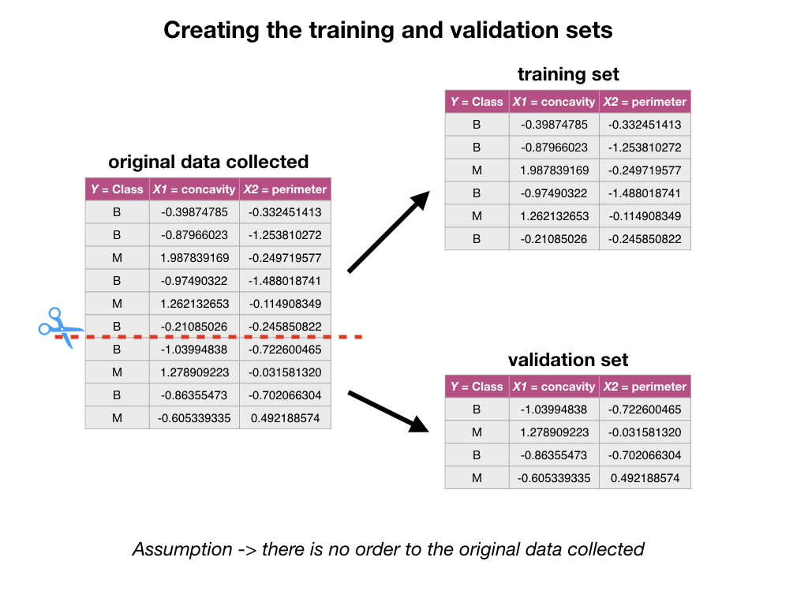
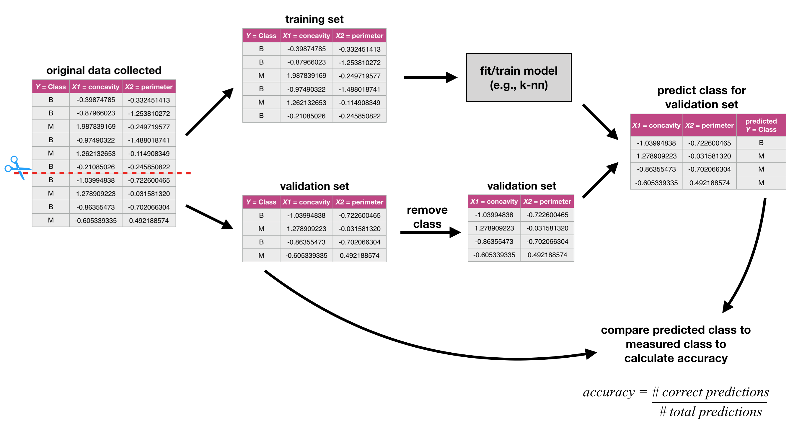

# Classification continued {#classification_continued}

## Overview 
Metrics for classification accuracy; cross-validation to choose the number of neighbours; scaling of variables and other practical considerations.

## Learning objectives 
By the end of the chapter, students will be able to:

* Describe what a validation data set is and how it is used in classification.
* Using R, evaluate classification accuracy using a validation data set and appropriate metrics.
* Using R, execute cross-validation in R to choose the number of neighbours.
* Identify when it is necessary to scale variables before classification and do this using R
* In a dataset with > 2 attributes, perform k-nearest neighbour classification in R using `caret::train(method = "knn", ...)` to predict the class of a test dataset.
* Describe advantages and disadvantages of the k-nearest neighbour classification algorithm.


## Assessing how good your classifier is
Sometimes our classifier might make the wrong prediction. A classifier does not need to be right 100\% of the time to be useful, though we don't want the classifier to make too many wrong predictions. How do we measure how "good" our classifier is? 

One way to assess our classifier's performance can be done by splitting our data into a **training** set and a **validation** set. When we split the data, we make the assumption that there is no order to our originally collected data set. However, if we think that there might be some order to the original data set, then we can randomly shuffle the data before splitting it into a training and validation set.  



The **training set** is used to build the classifer. Then we can give the observations from the **validation set** (without the labels/classes) to our classifier and predict the labels/classes as if these were new observations that we didn't have the labels/classes for. Then we can see how well our predictions match the true labels/classes for the observations in the **validation set**. If our predictions match the true labels/classes for the observations in the **validation set** very well then we have some confidence that our classifier might also do a good job of predicting the class labels for new observations that we do not have the class labels for.

How exactly can we assess how well our predictions match the true labels/classes for the observations in the **validation set**? One way we can do this is to calculate the prediction **accuracy**. This is essentially the proportion of time the classifier was correct. To calculate this we divide the number of correct predictions by the number of predictions made. Other measures for how well our classifier did include precision and recall (which will not be discussed here, but are discussed in other more advanced courses on this topic).

We try to illustrate this below:



### Assessing your classifier in R

We can use the `caret` package in R to not only perform k-nn classification, but also to assess how well our classification worked. Let's start by loading the necessary libraries, data (we'll continue exploring the breast cancer data set from last chapter) and making a quick scatter plot of tumour cell concavity versus smoothness, labelling the points be diagnosis class.

```{r precode, message = FALSE, fig.height = 4, fig.width = 5}
# load libraries
library(tidyverse)
library(caret)

#load data
cancer <- read_csv("data/clean-wdbc.data.csv") %>% 
  mutate(Class = as.factor(Class)) # because we will be doing statistical analysis on a categorical variable

# colour palette
cbPalette <- c("#56B4E9", "#E69F00","#009E73", "#F0E442", "#0072B2", "#D55E00", "#CC79A7", "#999999") 

# create scatter plot of tumour cell concavity versus smoothness, 
# labelling the points be diagnosis class
perim_concav <- cancer %>%  
  ggplot(aes(x = Smoothness, y = Concavity, color = Class)) + 
    geom_point(alpha = 0.5) +
    labs(color = "Diagnosis") + 
    scale_color_manual(labels = c("Benign", "Malignant"), values = cbPalette)
perim_concav
```

#### Splitting into training and validation sets

Next, lets split our data into a training and a validation set using `caret`'s `createDataPartition` function. When using this function to split a data set into a training and validation set it takes 3 arguments:

1. `y` (the class labels, must be a vector), 
2. `p` (the proportion of the data you would like in the training data set), and 
3. `list = FALSE` (says we want the data back as a matrix instead of a list).

The `createDataPartition` function returns the row numbers for the training set. 

```{r get indices for training set}
set.seed(1234) # makes the random selection of rows reproducible
set_rows <- cancer %>% 
  select(Class) %>% 
  unlist() %>% # converts Class from a tibble to a vector
  createDataPartition(p = 0.75, list = FALSE)
head(set_rows)
```

*You will also see in the code above that we use the `set.seed` function. This is because `createDataPartition` uses random sampling to choose which rows will be in the training set, and if we use `set.seed` to specify where the random number generator starts for this process then we can make our analysis reproducible (always get the same random set of observations in the training set). We should always set a seed before any function that uses a random process. We'll point out where as we work through this code.*

Now that we have the row numbers for the training set, we can use the `slice` function to get the rows from the original data set (here `cancer`) to create the training set and the validation sets.

```{r create training and validation sets}
training_set <- cancer %>% slice(set_rows)
validation_set <- cancer %>% slice(-set_rows)
glimpse(training_set)
```

```{r}
glimpse(validation_set)
```

We can see from `glimpse` in the code above that the training set contains 427 observations, while the validation set contains 142 observations. This corresponds to the training set having 75% of the observations from the original data set and the validation set having the other 25% of the observations. We specified this when we  provided the argument `p = 0.75` to `createDataPartition`. 

#### Creating the k-nn classifier

Now that we have split our original data set into a training and validation set, we can create our k-nn classifier using the training set. We explained how to do this last chapter, so here we just do it! For the time being we will just choose a single $k$ of 3, and use the predictors concavity and smoothness.

```{r create k-nn classifier}
X_train <- training_set %>% 
  select(Concavity, Smoothness) %>% 
  data.frame()
Y_train <- training_set %>% 
  select(Class) %>% 
  unlist()
k = data.frame(k = 3)

set.seed(1234)
model_knn <- train(x = X_train, y = Y_train, method = "knn", tuneGrid = k)
model_knn
```

*We set the seed above calling the train function because if there were a tie, the winning class is randomly chosen. In k-nn classification where $k$ = 3 and there are only 2 classes this will never happen, however, if our $k$ was divisible by 2, or if we had more than two possible class labels we could find ourselves in a situtation where we do have a tie.*

#### Predict class labels for the validation set

Now that we have a k-nn classifier object, we can use it to predict the class labels for our validation set:

```{r predict validation}
X_validation <- validation_set %>% 
  select(Concavity, Smoothness) %>% 
  data.frame()
Y_validation_predicted <- predict(object = model_knn, X_validation)
head(Y_validation_predicted)
```


#### Assessing our classifier's accuracy

Finally we can assess our classifier's accuracy. To do this we need to create a vector containing the class labels for the validation set. Next we use the function `confusionMatrix` to get the statistics about the quality of our model, this includes the statistic we are interested: accuracy.  `confusionMatrix` takes two arguments:

1. `data` (the predicted class labels for the validation set), and 
2. `reference` (the original/measured class labels for the validation set).

```{r accuracy}
Y_validation <- validation_set %>% 
  select(Class) %>% 
  unlist()

model_quality <- confusionMatrix(data = Y_validation_predicted, reference = Y_validation)
model_quality
```

A lot of information is output from `confusionMatrix`, but what we are interested in at this point is accuracy (found on the 6th line of printed output). That single value can be obtained from the `confusionMatrix` object using base/built-in R subsetting:

```{r}
model_quality$overall[1]
```

From a value of accuracy of 0.7957746, we can say that our k-nn classifier predicted the correct class label ~ 80% of the time. 

## Cross-validation for assessing classifier quality

Is that the best estimate of accuracy that we can get? What would happen if we again shuffled the observations in our training and validation sets, would we get the same accuracy? Let's do and experiment and see. By changing the `set.seed` value, we can get a different shuffle of the data when we create our training and validation data sets. 

Using `set.seed(4321)`

```{r set seed 4321}
set.seed(4321) # makes the random selection of rows reproducible
set_rows <- cancer %>% 
  select(Class) %>% 
  unlist() %>% # converts Class from a tibble to a vector
  createDataPartition(p = 0.75, list = FALSE)
training_set <- cancer %>% slice(set_rows)
validation_set <- cancer %>% slice(-set_rows)
X_train <- training_set %>% 
  select(Concavity, Smoothness) %>% 
  data.frame()
Y_train <- training_set %>% 
  select(Class) %>% 
  unlist()
k = data.frame(k = 3)
model_knn <- train(x = X_train, y = Y_train, method = "knn", tuneGrid = k)
X_validation <- validation_set %>% 
  select(Concavity, Smoothness) %>% 
  data.frame()
Y_validation_predicted <- predict(object = model_knn, X_validation)
Y_validation <- validation_set %>% 
  select(Class) %>% 
  unlist()
model_quality <- confusionMatrix(data = Y_validation_predicted, reference = Y_validation)
model_quality$overall[1]
```

Using `set.seed(8765)`
```{r set seed 5678}
set.seed(8765) # makes the random selection of rows reproducible
set_rows <- cancer %>% 
  select(Class) %>% 
  unlist() %>% # converts Class from a tibble to a vector
  createDataPartition(p = 0.75, list = FALSE)
training_set <- cancer %>% slice(set_rows)
validation_set <- cancer %>% slice(-set_rows)
X_train <- training_set %>% 
  select(Concavity, Smoothness) %>% 
  data.frame()
Y_train <- training_set %>% 
  select(Class) %>% 
  unlist()
k = data.frame(k = 3)
model_knn <- train(x = X_train, y = Y_train, method = "knn", tuneGrid = k)
X_validation <- validation_set %>% 
  select(Concavity, Smoothness) %>% 
  data.frame()
Y_validation_predicted <- predict(object = model_knn, X_validation)
Y_validation <- validation_set %>% 
  select(Class) %>% 
  unlist()
model_quality <- confusionMatrix(data = Y_validation_predicted, reference = Y_validation)
model_quality$overall[1]
```

When we have 3 different shuffles of the data, we get 3 different values for accuracy! 0.7957746, 0.8661972 and 0.7676056! Which one is correct? Sadly, there is no easy answer to that question. The best we can do is to do this many times and take the average of the accuracies. Typically this is done is a more structured way so that each observation in the data set is used in a validation set only a single time. The name for this strategy is called cross-validation and we illustrate it below:


In the picture above, 5 different folds/partitions of the data set are shown, and consequently we call this 5-fold cross-validation. To do 5-fold cross-validation in R with `caret`, we use another function called `trainControl`. This function passes additional information to the `train` function we use to create our classifier. The arguments we pass `trainControl` are:

1. `method` (method used for assessing classifier quality, here we specify `"cv"` for cross-validation)
2. `number` (how many folds/partitions of the data set we want to use for cross validation)

```{r}
train_control <- trainControl(method="cv", number = 5)
```

Then when we create our classifier we add an additional argument to `train`, called `trControl` where we give it the name of the object we created with the `trainControl` function. Additionally, we do not need to specify a training and a validation set because we are telling `train` that we are doing cross validation (it will take care creating the folds, calculating the accuracy for each fold and averaging the accuracies for us).

```{r }
X_cancer <- cancer %>% 
  select(Concavity, Smoothness) %>% 
  data.frame()
Y_cancer <- cancer %>% 
  select(Class) %>% 
  unlist()
k = data.frame(k = 3)

set.seed(1234)
knn_model_cv_5fold <- train(x = X_cancer, y = Y_cancer, method = "knn", tuneGrid = k, trControl = train_control)
knn_model_cv_5fold
```

*This time we set the seed when we call `train` not only because of the potential for ties, but also because we are doing cross-validation. Cross-validation uses a random process to select which observations are included in which folds.*

We can choose any number of folds, typically the more the better. However we are limited by computational power. The more folds we choose, the more computation it takes, and hence the more time it takes to run the analysis. So for each time you do cross-validation you need to consider the size of the data, and the speed of the algorithm (here k-nn) and the speed of your computer. In practice this is a trial and error process. Here we show what happens when we do 10 folds:

```{r}
train_control <- trainControl(method="cv", number = 10)

set.seed(1234)
knn_model_cv_10fold <- train(x = X_cancer, y = Y_cancer, method = "knn", tuneGrid = k, trControl = train_control)
knn_model_cv_10fold
```

## Choosing the number of neighbours for k-nn classification

From 5- and 10-fold cross-validate we estimate that the prediction accuracy of our classifier to be ~ 83%. This could be not too bad of an accuracy, however what accuracy you aim for always depends on the downstream application of your analysis. Here, we are trying to predict a very important outcome, tumour cell diagnosis class. And the class label we assign to a real patient may have life or death consequences. Hence, we'd like to do better for this application than 83%. To do this we can use cross-validation in an even bigger way, we can choose a range of possible $k$'s and perform cross-validation to calculate the accuracy for each $k$, and then choose the smallest $k$ which gives us the best cross-validation accuracy. To do this, we will create a vector of values for $k$ instead of providing just 1.

```{r}
train_control <- trainControl(method="cv", number = 10)
k = data.frame(k = c(1, 3, 5, 7, 9, 11, 13, 15, 17))

set.seed(1234)
knn_model_cv_10fold <- train(x = X_cancer, y = Y_cancer, method = "knn", tuneGrid = k, trControl = train_control)
knn_model_cv_10fold
```

Then to help us choose $k$ it is very useful to visualize the accuracies as we increase $k$. This will help us choose the smallest $k$ with the biggest accuracy. We can access the results from the cross-validation by accessing the`results` attribute of the `train` object (our classifier).

```{r}
accuracies <- knn_model_cv_10fold$results
accuracies 
```

Now we can plot accuracy versus k:

```{r find_k, fig.height = 4, fig.width = 5}
accuracy_vs_k <- ggplot(accuracies, aes(x = k, y = Accuracy)) +
  geom_point() +
  geom_line()
accuracy_vs_k
```


Based off of the visualization above we typically would choose $k$ to be ~ 11, given that at this value of $k$ our accuracy is a high as it can be with much larger values of $k$. As you can see there is no exact or perfect answer here, what we are looking for is a value for $k$ where we get a roughly optimal increase of accuracy but at the same time we want to keep $k$ small.

Why do we want to keep $k$ small? Well this is because if we keep increasing $k$ our accuracy actually starts to decrease! Take a look as the plot below as we vary $k$ from 1 to almost the number of observations in the data set:

```{r lots_of_ks, fig.height = 4, fig.width = 5}
train_control <- trainControl(method="cv", number = 10)
k_lots = data.frame(k = seq(from = 1, to = 499, by = 10))
set.seed(1234)
knn_model_cv_10fold_lots <- train(x = X_cancer, y = Y_cancer, method = "knn", tuneGrid = k_lots, trControl = train_control)
accuracies_lots <- knn_model_cv_10fold_lots$results
accuracy_vs_k_lots <- ggplot(accuracies_lots, aes(x = k, y = Accuracy)) +
  geom_point() +
  geom_line()
accuracy_vs_k_lots
```


## Other ways to increase accuracy

By using cross-validation to choose $k$ we were able to slightly increase our accuracy, but can we still do better? Perhaps. We can start to explore this by taking a look at what is called the training accuracy. Training accuracy is our accuracy if we asked our classifier to make predictions on the training data and then we assessed how well the predictions matched up to the true labels we have for our training data. If they don't match up really well (training accuracy is low), our classification model might be too simple and adding more information (e.g., additional predictors/explanatory variables) could potentially help. The situation where the training accuracy is low is often called underfitting, or high bias.

The training error can be obtained from using the classifier object returned from `train` (when you don't perform cross-validation) to predict on the training data. Then passing the predictions on the training data and the true observed labels into `confusionMatrix`.

```{r}
k = data.frame(k = 11)
set.seed(1234)
knn_model <- train(x = X_cancer, y = Y_cancer, method = "knn", tuneGrid = k)
training_pred <- predict(knn_model, X_cancer)
results <- confusionMatrix(training_pred, Y_cancer)
results
```

From the complex output, we can see the training accuracy, here 0.8752. Again we can use base/built-in subsetting syntax to directly get the value:

```{r}
results$overall[1]
```

Here we see that our training accuracy is high, 0.8752197, but there is still room for improvement! (If it were 1.0 there wouldn't be and we would have a different problem). So let's see if adding additional information (predictors/explanatory variables) might help our model training and consequently (and more importantly) validation accuracy.

*Note - when adding more information to the model, $k$ = 11 may no longer be the "best" $k$. So we will want to also choose $k$ again.*

```{r}
# set-up training data
X_cancer_all <- cancer %>% 
  select(-Class, -ID) %>% 
  data.frame()
Y_cancer_all <- cancer %>% 
  select(Class) %>% 
  unlist()

# set-up classifier specifications
train_control <- trainControl(method="cv", number = 10)
k = data.frame(k = seq(from = 1, to = 29, by = 2))

# create classifier
set.seed(1234)
knn_model_all <- train(x = X_cancer_all, y = Y_cancer_all, method = "knn", tuneGrid = k, trControl = train_control)

# assess training accuracy
training_pred_all <- predict(knn_model_all, X_cancer_all)
results_all <- confusionMatrix(training_pred_all, Y_cancer_all)
results_all$overall[1]
```

We can see that by including more information (making our classifier more complex by adding additional predictors/explanatory variables) we increased the training accuracy. What about the cross-validation accuracy? And what $k$ should we choose?

```{r more_info, fig.height = 4, fig.width = 5}
accuracies_all <- knn_model_all
accuracy_vs_k_all <- ggplot(accuracies_all, aes(x = k, y = Accuracy)) +
  geom_point() +
  geom_line()
accuracy_vs_k_all
```

From the plot above, it seems as though now with more information in our model, we should choose a $k$ of 7. Additionally, with this extra information our validation accuracy has also increased with $k = 7$.

## Test data set

In addition to a training and validation sets, in practice we really split our data set into 3 different sets:

1. training 
2. validation
3. testing

What is the testing set and what purpose does this third set serve? Typically create the testing set at the very beginning of our analysis, leave it a the locked box so that it plays no role while we a fiddling with things (usually through cross validation) like choosing $k$, or the number of predictors/explanatory variables to put in the classifier. After we have settled on all the settings (e.g., $k$ and number of predictors) for our classifier and we have no plans to EVER change them again we re-train the classifier on the entire training set (i.e., don't do cross validation) with those settings and then predict on testing set observations. We then take those predictions and compare them to the true labels of the test set and come up with a test accuracy measure. This typically looks something like this:


source: https://towardsdatascience.com/train-test-split-and-cross-validation-in-python-80b61beca4b6

Why do we have this super special test set? This is so we do not violate the golden rule of statistical/machine learning: YOU CANNOT USE THE TEST DATA TO BUILD THE MODEL!!! If you do, this is analagous to a student cheating on a midterm.

## Scaling your data

For a knn classifier, the scale of the variables matter. Since the knn classifier predicts classes by identifying observations that are nearest to it, any variables that are on a large scale will have a much larger effect than variables on a small scale. (Even though they might not actually be more important!) For example, suppose your dataset has two attributes: salary (in dollars) and years of education. For the knn classifier, a difference of \$1000 is huge compared to a difference of 10 years of education. For our conceptual understanding and answering of the problem, its the opposite! 10 years of education is huge compared to a difference of \$1000 in yearly salary!

So to prevent an overpowering influence of salary on the distance function we need to standardize our predictors/explanatory variables so that our variables will be on a comparable scale. We can do this with the `scale()` function in R. 

To illustrate the difference between scaled and non-scaled data, and the effect it can have on k-nn, we will read in the original, un-scaled Wisconsin breast cancer data set (we have been using a scaled version of the data set in the textbook and worksheets up until now).

Here we get the data from the UCI Machine learning repository, and then get the equivalent columns that we have been working with in the scaled version of the data set ("worst" measures). We also give the data column names (the data set comes with none).

```{r}
unscaled_cancer <- read_csv("https://archive.ics.uci.edu/ml/machine-learning-databases/breast-cancer-wisconsin/wdbc.data", 
                            col_names = FALSE) %>% 
  select(X1, X2, X11:X20)
colnames(unscaled_cancer) <- colnames(cancer)
head(unscaled_cancer)
```

Looking at the unscaled data above, you can see that the difference between the values for smoothness measurements are much larger than those for area. Let's make a scatter plot for these two predictors below (colouring by diagnosis) and then overlay that with a new observation we would like to classify as either benign or malignant with a red dot. We'll do this for the unscaled and scaled data sets, and put them side-by-side:

```{r warning = FALSE, echo =  FALSE,  fig.height = 4, fig.width = 10}
unscaled_cancer <- unscaled_cancer %>% 
  select(ID, Class, Area, Smoothness)
new_obs <- tibble(ID = 99999, Class = "unknown", Area = 3.7, Smoothness = 5.3)
unscaled_cancer <- bind_rows(unscaled_cancer, new_obs)

unscaled <- ggplot(unscaled_cancer, aes(x = Area, y = Smoothness, color = Class)) +
    geom_point(alpha = 0.6) +
    labs(color = "Diagnosis") + 
    scale_color_manual(labels = c("Benign", "Malignant"), values = c("#56B4E9", "#E69F00", "red")) +
    labs(color = "Diagnosis") + 
    ggtitle("unscaled data") +
    #geom_point(aes(x = 40.73, y = 0.1506), color = cbPalette[6], size = 2.5) + 
    coord_equal(ratio = 1) +
    xlim(c(0, 6)) + # zooming into only data that falls between 0 and 86 on the x-axis
    ylim(c(0, 6))

scaled_cancer <- unscaled_cancer %>% 
  select(-c(ID,Class)) %>% 
  scale(center = FALSE) 
scaled_cancer <- data.frame(ID = unscaled_cancer$ID, Class = unscaled_cancer$Class, scaled_cancer)

scaled <- ggplot(scaled_cancer, aes(x = Area, y = Smoothness, color = Class)) +
    geom_point(alpha = 0.6) +
    labs(color = "Diagnosis") + 
    scale_color_manual(labels = c("Benign", "Malignant"), values = c("#56B4E9", "#E69F00", "red")) +
    labs(color = "Diagnosis") + 
    ggtitle("scaled data") +
    coord_equal(ratio = 1) +
    #geom_point(aes(x = 0.008637332, y = -1.114815397), color = cbPalette[6], size = 2.5) #+
    #xlim(c(-2, 3.9)) # zooming into only data that falls between 0 and ~ 3.9 on the x-axis
    xlim(c(0, 6)) + # zooming into only data that falls between 0 and 86 on the x-axis
    ylim(c(0, 6))
    
gridExtra::grid.arrange(unscaled, scaled, ncol = 2)
```

In the plot with the unscaled data above, its very clear that k-nn would classify the red dot (new observation) as malignant. However, once we scale the data, the diagnosis class labelling becomes less clear and appears it would depend upon the choice of $k$. Hopefully this graphic drives home the message that scaling the data changes things in an important way when we are using algorithms like k-nn that use distance between points as a part of their decision making process.

How do we scale data in R? The code below demonstrates how we can use the scale function in R to take the `unscaled_cancer` data and scale it:

```{r}
scaled_cancer <- unscaled_cancer %>% 
  select(-c(ID,Class)) %>% 
  scale(center = FALSE) 
scaled_cancer <- data.frame(ID = unscaled_cancer$ID, Class = unscaled_cancer$Class, scaled_cancer)
head(scaled_cancer)
```

Scaling your data should be a part of the pre-processing you do before you start doing an analysis where distance between points plays a role. And as we learned in the last two chapters, k-nn classification is one of these.

> What about centering the data? I've heard that is also a data pre-processing step? Yes, it can be helpful but it depends on the algorithm. For k-nn classification centering doesn't help, nor does it hurt. So you can do it if you would like but you do not have to.

## Strengths and limitations of k-nn classification

### Strengths of k-nn classification

1. Simple and easy to understand
2. No assumptions about what the data must look like 
3. Works easily for binary (two-class) and multi-class (> 2 classes) classification problems

### Limitations of k-nn classification

1. As data gets bigger and bigger, k-nn gets slower and slower, quite quickly
2. Does not perform well with a large number of predictors
3. Does not perform well when classes are imbalanced (when many more observations are in one of the classes compared to the others)

## Additional readings/resources
- [The `caret` Package](https://topepo.github.io/caret/index.html)
