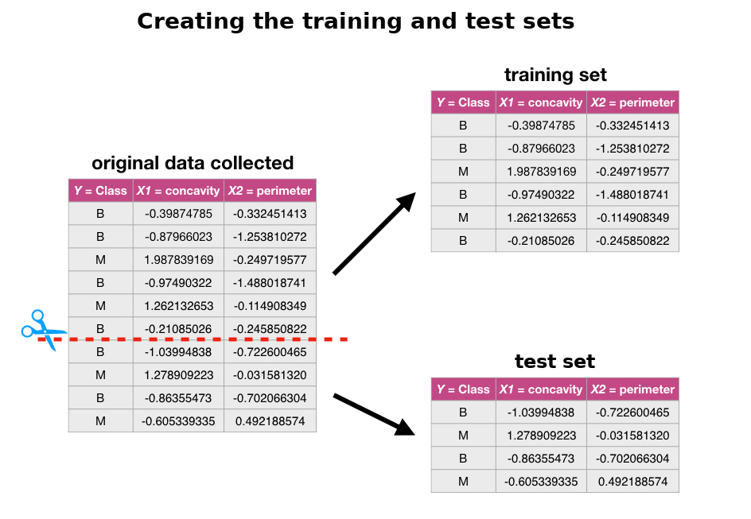

# Classification II: evaluation & tuning {#classification_continued}

## Overview 
This chapter continues the introduction to predictive modelling through
classification. While the previous chapter covered training and data
preprocessing, this chapter focuses on how to split data, how to evaluate
prediction accuracy, and how to choose model parameters to maximize
performance.

## Chapter learning objectives 
By the end of the chapter, students will be able to:

- Describe what training, validation, and test data sets are and how they are used in classification
- Split data into training, validation, and test data sets
- Evaluate classification accuracy in R using a validation data set and appropriate metrics
- Execute cross-validation in R to choose the number of neighbours in a K-nearest neighbour classifier
- Describe advantages and disadvantages of the K-nearest neighbour classification algorithm

## Evaluating accuracy

Sometimes our classifier might make the wrong prediction. A classifier does not
need to be right 100\% of the time to be useful, though we don't want the
classifier to make too many wrong predictions. How do we measure how "good" our
classifier is? Let's revisit the 
[breast cancer images example](http://archive.ics.uci.edu/ml/datasets/Breast+Cancer+Wisconsin+%28Diagnostic%29)
and think about how our classifier will be used in practice. A biopsy will be
performed on a *new* patient's tumour, the resulting image will be analyzed,
and the classifier will be asked to decide whether the tumour is benign or
malignant. The key word here is *new*: our classifier is "good" if it provides
accurate predictions on data *not seen during training*. But then how can we
evaluate our classifier without having to visit the hospital to collect more
tumour images? 

The trick is to split up the data set into a **training set** and **test set**&mdash;as
shown in Figure \@ref(fig:06-training-test)&mdash;and 
only show the classifier the **training set** when building the classifier.
Then to evaluate the accuracy of the classifier, we can use it to predict the
labels (which we know) in the **test set**. If our predictions match the true
labels for the observations in the **test set** very well, then we have some
confidence that our classifier might also do a good job of predicting the class
labels for new observations that we do not have the class labels for.

> Note: if there were a golden rule of machine learning, it might be this: *you cannot use the test data to build the model!* 
> If you do, the model gets to "see" the test data in advance, making it look more accurate than it really is. Imagine
> how bad it would be to overestimate your classifier's accuracy when predicting whether a patient's tumour is malignant or benign!

```{r 06-training-test, echo = FALSE, warning = FALSE, fig.cap = "Splitting the data into training and testing sets", fig.retina = 2, out.width = "600"}

```

How exactly can we assess how well our predictions match the true labels for
the observations in the test set? One way we can do this is to calculate the
**prediction accuracy**. This is the fraction of examples for which the
classifier made the correct prediction. To calculate this we divide the number
of correct predictions by the number of predictions made. 
This process is illustrated in Figure \@ref(fig:06-ML-paradigm-test).
Note that there are other measures for how well classifiers perform, such as *precision* and *recall*; 
these will not be discussed here, but you will likely encounter them in other more advanced
courses on this topic. 

```{r 06-ML-paradigm-test, echo = FALSE, message = FALSE, warning = FALSE, fig.cap = "Process for splitting the data and finding the prediction accuracy", fig.retina = 2, out.width = "800"}
knitr::include_graphics("img/ML-paradigm-test.png")
```

In R, we can use the `tidymodels` library collection not only to perform K-nearest neighbour
classification, but also to assess how well our classification worked. Let's
work through an example of this process using the breast cancer dataset.
We start by loading the necessary libraries, reading in the breast cancer data
from the previous chapter, and making a quick scatter plot visualization of
tumour cell concavity versus smoothness coloured by diagnosis in Figure \@ref(fig:06-precode).

```{r 06-precode, fig.height = 4, fig.width = 5, fig.cap="Scatterplot of tumour cell concavity versus smoothness coloured by diagnosis label"}
# load packages
library(tidyverse)
library(tidymodels)

# load data
cancer <- read_csv("data/unscaled_wdbc.csv") %>%
  mutate(Class = as_factor(Class)) # convert the character Class variable to the factor datatype

# colour palette
cbPalette <- c("#E69F00", "#56B4E9", "#009E73", "#F0E442", "#0072B2", "#D55E00", "#CC79A7", "#999999")

# create scatter plot of tumour cell concavity versus smoothness,
# labelling the points be diagnosis class
perim_concav <- cancer %>%
  ggplot(aes(x = Smoothness, y = Concavity, color = Class)) +
  geom_point(alpha = 0.5) +
  labs(color = "Diagnosis") +
  scale_color_manual(labels = c("Malignant", "Benign"), values = cbPalette)

perim_concav
```

**1. Create the train / test split**

Once we have decided on a predictive question to answer and done some
preliminary exploration, the very next thing to do is to split the data into
the training and test sets. Typically, the training set is between 50 - 100% of
the data, while the test set is the remaining 0 - 50%; the intuition is that
you want to trade off between training an accurate model (by using a larger
training data set) and getting an accurate evaluation of its performance (by
using a larger test data set).  Here, we will use 75% of the data for training,
and 25% for testing.  To do this we will use the `initial_split` function, 
specifying that `prop = 0.75` and the response variable is `Class`:
```{r 06-initial-split}
set.seed(1)
cancer_split <- initial_split(cancer, prop = 0.75, strata = Class)
cancer_train <- training(cancer_split)
cancer_test <- testing(cancer_split)
```

> Note: You will see in the code above that we use the `set.seed` function again, as discussed in the previous chapter. In this case it is because
> `initial_split` uses random sampling to choose which rows will be in the training set. Since we want our code to be reproducible
> and generate the same train/test split each time it is run, we use `set.seed`. 

```{r 06-glimpse-training-and-test-sets}
glimpse(cancer_train)
glimpse(cancer_test)
```

We can see from `glimpse` in the code above that the training set contains 427
observations, while the test set contains 142 observations. This corresponds to
a train / test split of 75% / 25%, as desired.

**2. Pre-process the data**

As we mentioned last chapter, K-NN is sensitive to the scale of the predictors,
and so we should perform some preprocessing to standardize them. An
additional consideration we need to take when doing this is that we should
create the standardization preprocessor using **only the training data**. This ensures that
our test data does not influence any aspect of our model training. Once we have
created the standardization preprocessor, we can then apply it separately to both the
training and test data sets.

Fortunately, the `recipe` framework from `tidymodels` makes it simple to handle
this properly. Below we construct and prepare the recipe using only the training
data (due to `data = cancer_train` in the first line).

```{r 06-pre-process}
cancer_recipe <- recipe(Class ~ Smoothness + Concavity, data = cancer_train) %>%
  step_scale(all_predictors()) %>%
  step_center(all_predictors())
```

**3. Train the classifier**

Now that we have split our original data set into training and test sets, we
can create our K-nearest neighbour classifier with only the training set using
the technique we learned in the previous chapter. For now, we will just choose
the number $K$ of neighbours to be 3, and use concavity and smoothness as the
predictors.

```{r 06-create-K-nearest neighbour-classifier}
set.seed(1)
knn_spec <- nearest_neighbor(weight_func = "rectangular", neighbors = 3) %>%
  set_engine("kknn") %>%
  set_mode("classification")

knn_fit <- workflow() %>%
  add_recipe(cancer_recipe) %>%
  add_model(knn_spec) %>%
  fit(data = cancer_train)

knn_fit
```

> Note: Here again you see the `set.seed` function. In the K-nearest neighbour algorithm, 
> there is a tie for the majority neighbour class, the winner is randomly selected. Although there is no chance
> of a tie when $K$ is odd (here $K=3$), it is possible that the code may be changed in the future to have an even value of $K$. 
> Thus, to prevent potential issues with reproducibility, we have set the seed. Note that in your own code,
> you only have to set the seed once at the beginning of your analysis. 

**4. Predict the labels in the test set**

Now that we have a K-nearest neighbour classifier object, we can use it to
predict the class labels for our test set.  We use the `bind_cols` to add the
column of predictions to the original test data, creating the
`cancer_test_predictions` data frame.  The `Class` variable contains the true
diagnoses, while the `.pred_class` contains the predicted diagnoses from the
model.

```{r 06-predict-test}
cancer_test_predictions <- predict(knn_fit, cancer_test) %>%
  bind_cols(cancer_test)
cancer_test_predictions
```

**5. Compute the accuracy**

Finally we can assess our classifier's accuracy. To do this we use the `metrics` function
from `tidymodels` to get the statistics about the quality of our model, specifying
the `truth` and `estimate` arguments:

```{r 06-accuracy}
cancer_test_predictions %>%
  metrics(truth = Class, estimate = .pred_class)
```

```{r 06-accuracy-2, echo = FALSE, warning = FALSE}
cancer_acc_1 <- cancer_test_predictions %>% 
                metrics(truth = Class, estimate = .pred_class) %>% 
                filter(.metric == 'accuracy')
```

This shows that the accuracy of the classifier on the test data 
was `r round(100*cancer_acc_1$.estimate, 0)`%.
We can also look at the *confusion matrix* for the classifier, which shows
the table of predicted labels and correct labels, using the `conf_mat` function:

```{r 06-confusionmat}
confusion <- cancer_test_predictions %>%
             conf_mat(truth = Class, estimate = .pred_class)
confusion
```

```{r 06-confusionmat-2, echo = FALSE}
confusionmt <- confusion %>% tidy()
confu11 <- (confusionmt %>% filter(name == "cell_1_1"))$value
confu12 <- (confusionmt %>% filter(name == "cell_1_2"))$value
confu21 <- (confusionmt %>% filter(name == "cell_2_1"))$value
confu22 <- (confusionmt %>% filter(name == "cell_2_2"))$value
```

This table shows that the classifier labelled 
`r confu11`+`r confu22` = `r confu11+confu22` observations 
correctly, `r confu21` observations as benign when they were truly malignant,
and `r confu12` observations as malignant when they were truly benign. 

**6. Critically analyze performance**

We now know that the classifier was `r round(100*cancer_acc_1$.estimate,0)`% accurate
on the test dataset. That sounds pretty good!...Wait, *is* it good? 
Or do we need something higher?

In general, what a *good* value for accuracy is depends on the application.
On a task of predicting whether a tumour is benign or malignant
for a type of tumour that is benign 99% of the time, it is very easy to
obtain a 99% accuracy just by guessing benign for every observation. In this
case, 99% accuracy is probably not good enough. And beyond just accuracy,
sometimes the *kind* of mistake the classifier makes is important as well. In
the previous example, it might be very bad for the classifier to predict
"benign" when the true class is "malignant", as this might result in a patient
not receiving appropriate medical attention. On the other hand, it might be
less bad for the classifier to guess "malignant" when the true class is
"benign", as the patient will then likely see a doctor who can provide an
expert diagnosis. This is why it is important not only to look at accuracy, but
also the confusion matrix.

However, there is always an easy baseline that you can compare to for any
classification problem: the *majority classifier*. The majority classifier
*always* guesses the majority class label from the training data, regardless of
what values the predictor variables take.  It helps to give you a sense for
scale when considering accuracies. If the majority classifier obtains a 90%
accuracy on a problem, then you might hope for your K-nearest neighbours
classifier to do better than that. If your classifier provides a significant
improvement upon the majority classifier, this means that at least your method
is extracting some useful information from your predictor variables.  Be
careful though: improving on the majority classifier does not *necessarily*
mean the classifier is working well enough for your application. 

As an example, in the breast cancer data, the proportions of benign and malignant
observations in the training data are as follows:
```{r 06-proportions}
cancer_proportions <- cancer_train %>%
                      group_by(Class) %>%
                      summarize(n = n()) %>%
                      mutate(percent = 100*n/nrow(cancer_train))
cancer_proportions
```
```{r 06-proportions-2, echo = FALSE, warning = FALSE}
cancer_propn_1 <- cancer_proportions %>%
                filter(Class == 'B') %>%
                select(percent)
```

Since the benign class represents the majority of the training data,
the majority classifier would *always* predict that a new observation
is benign. The estimated accuracy of the majority classifier is usually
fairly close to the majority class proportion in the training data.
In this case, we would suspect that the majority classifier will have 
an accuracy of around `r round(cancer_propn_1[1,1], 0)`%.
The K-nearest neighbours classifier we built does quite a bit better than this, 
with an accuracy of `r round(100*cancer_acc_1$.estimate, 0)`%. 
This means that from the perspective of accuracy,
the K-nearest neighbours classifier improved quite a bit on the basic
majority classifier. Hooray! But we still need to be cautious; in 
this application, it is likely very important not to miss-diagnose any malignant tumours to avoid missing
patients who actually need medical care. The confusion matrix above shows
that the classifier does indeed miss-diagnose a non-negligible number malignant tumours as benign.
Therefore, even though the accuracy improved upon the majority classifier,
our critical analysis suggests that this classifier may not have appropriate performance
for the application.

## Tuning the classifier

The vast majority of predictive models in statistics and machine learning have
*parameters* that you have to pick. For example, in the K-nearest neighbour
classification algorithm we have been using in the past two chapters, we have
had to pick the number of neighbours $K$ for the class vote. Is it possible to
make this selection, i.e., *tune* the model, in a principled way?  Ideally what
we want is to somehow maximize the performance of our classifier on data *it
hasn't seen yet*. So we will play the same trick we did before when evaluating
our classifier: we'll split our **overall training data set** further into two
subsets, called the **training set** and **validation set**. We will use the
newly-named **training set** for building the classifier, and the **validation
set** for evaluating it! Then we will try different values of the parameter $K$
and pick the one that yields the highest accuracy.

> **Remember:** *don't touch the test set during the tuning process. Tuning is a part of model training!*

### Cross-validation

There is an important detail to mention about the process of tuning: we can, if
we want to, split our overall training data up in multiple different ways,
train and evaluate a classifier for each split, and then choose the parameter
based on __*all*__ of the different results. If we just split our overall training
data *once*, our best parameter choice will depend strongly on whatever data
was lucky enough to end up in the validation set. Perhaps using multiple
different train / validation splits, we'll get a better estimate of accuracy,
which will lead to a better choice of the number of neighbours $K$ for the
overall set of training data. 

> **Note:** you might be wondering why we can't we use the multiple splits to
> test our final classifier after tuning is done. This is simply because at the
> end of the day, we will produce a single classifier using our overall
> training data. If we do multiple train / test splits, we will end up with
> multiple classifiers, each with their own accuracy evaluated on different
> test data.

Let's investigate this idea in R! In particular, we will use different seed
values in the `set.seed` function to generate five different train / validation
splits of our overall training data, train five different K-nearest neighbour
models, and evaluate their accuracy. 

```{r 06-five-splits}
accuracies <- c()
for (i in 1:5) {
  set.seed(i) # makes the random selection of rows reproducible

  # create the 25/75 split of the training data into training and validation
  cancer_split <- initial_split(cancer_train, prop = 0.75, strata = Class)
  cancer_subtrain <- training(cancer_split)
  cancer_validation <- testing(cancer_split)

  # recreate the standardization recipe from before (since it must be based on the training data)
  cancer_recipe <- recipe(Class ~ Smoothness + Concavity, data = cancer_subtrain) %>%
    step_scale(all_predictors()) %>%
    step_center(all_predictors())

  # fit the knn model (we can reuse the old knn_spec model from before)
  knn_fit <- workflow() %>%
    add_recipe(cancer_recipe) %>%
    add_model(knn_spec) %>%
    fit(data = cancer_subtrain)

  # get predictions on the validation data
  validation_predicted <- predict(knn_fit, cancer_validation) %>%
    bind_cols(cancer_validation)

  # compute the accuracy
  acc <- validation_predicted %>%
    metrics(truth = Class, estimate = .pred_class) %>%
    filter(.metric == "accuracy") %>%
    select(.estimate) %>%
    pull()
  accuracies <- append(accuracies, acc)
}
accuracies
```

With five different shuffles of the data, we get five different values for
accuracy. None of these is necessarily "more correct" than any other; they're
just five estimates of the true, underlying accuracy of our classifier built
using our overall training data. We can combine the estimates by taking their
average (here `r round(100*mean(accuracies),0)`%) to try to get a single assessment of our
classifier's accuracy; this has the effect of reducing the influence of any one
(un)lucky validation set on the estimate.

In practice, we don't use random splits, but rather use a more structured
splitting procedure so that each observation in the data set is used in a
validation set only a single time. The name for this strategy is called
**cross-validation**.  In **cross-validation**, we split our **overall training
data** into $C$ evenly-sized chunks, and then iteratively use $1$ chunk as the
**validation set** and combine the remaining $C-1$ chunks 
as the **training set**. 


```{r 06-cv-image, echo = FALSE, message = FALSE, warning = FALSE, fig.cap = "5-fold cross validation", fig.retina = 2, out.width = "800"}
knitr::include_graphics("img/cv.png")
```

This procedure is shown in Figure \@ref(fig:06-cv-image).
Here, $C=5$ different chunks of the data set are used,
resulting in 5 different choices for the **validation set**; we call this
*5-fold* cross-validation. To do 5-fold cross-validation in R with `tidymodels`, we
use another function: `vfold_cv`. This function splits our training data into
`v` folds automatically:
```{r 06-vfold}
cancer_vfold <- vfold_cv(cancer_train, v = 5, strata = Class)
cancer_vfold
```
Then, when we create our data analysis workflow, we use the `fit_resamples` function
instead of the `fit` function for training. This runs cross-validation on each
train/validation split. 

> **Note:** we set the seed when we call `train` not only because of the potential for ties, but also because we are doing 
> cross-validation. Cross-validation uses a random process to select how to partition the training data.

```{r 06-vfold-workflow}
set.seed(1)

# recreate the standardization recipe from before (since it must be based on the training data)
cancer_recipe <- recipe(Class ~ Smoothness + Concavity, data = cancer_train) %>%
  step_scale(all_predictors()) %>%
  step_center(all_predictors())

# fit the knn model (we can reuse the old knn_spec model from before)
knn_fit <- workflow() %>%
  add_recipe(cancer_recipe) %>%
  add_model(knn_spec) %>%
  fit_resamples(resamples = cancer_vfold)

knn_fit
```

The `collect_metrics` function is used to aggregate the mean and *standard error*
of the classifier's validation accuracy across the folds. The standard error is 
a measure of how uncertain we are in the mean value. A detailed treatment of this
is beyond the scope of this chapter; but roughly, if your estimated mean (that
the `collect_metrics` function gives you) is 0.88 and standard
error is 0.02, you can expect the *true* average accuracy of the 
classifier to be somewhere roughly between 86% and 90% (although it may
fall outside this range).

```{r 06-vfold-metrics}
knn_fit %>% collect_metrics()
```

We can choose any number of folds, and typically the more we use the better our
accuracy estimate will be (lower standard error). However, we are limited 
by computational power: the
more folds we choose, the  more computation it takes, and hence the more time
it takes to run the analysis. So when you do cross-validation, you need to
consider the size of the data, and the speed of the algorithm (e.g., K-nearest
neighbour) and the speed of your computer. In practice, this is a trial and
error process, but typically $C$ is chosen to be either 5 or 10. Here we show
how the standard error decreases when we use 10-fold cross validation rather
than 5-fold:

```{r 06-10-fold}
cancer_vfold <- vfold_cv(cancer_train, v = 10, strata = Class)

vfold_metrics <- workflow() %>%
                  add_recipe(cancer_recipe) %>%
                  add_model(knn_spec) %>%
                  fit_resamples(resamples = cancer_vfold) %>%
                  collect_metrics()
vfold_metrics
```

### Parameter value selection

Using 5- and 10-fold cross-validation, we have estimated that the prediction
accuracy of our classifier is somewhere around `r round(100*(vfold_metrics %>% filter(.metric == "accuracy"))$mean,0)`%. 
Whether that is good or not
depends entirely on the downstream application of the data analysis. In the
present situation, we are trying to predict a tumour diagnosis, with expensive,
damaging chemo/radiation therapy or patient death as potential consequences of
misprediction. Hence, we might like to 
do better than `r round(100*(vfold_metrics %>% filter(.metric == "accuracy"))$mean,0)`% for this application.  

In order to improve our classifier, we have one choice of parameter: the number of
neighbours, $K$. Since cross-validation helps us evaluate the accuracy of our
classifier, we can use cross-validation to calculate an accuracy for each value
of $K$ in a reasonable range, and then pick the value of $K$ that gives us the
best accuracy. The `tidymodels` package collection provides a very simple
syntax for tuning models: each parameter in the model to be tuned should be specified
as `tune()` in the model specification rather than given a particular value.
```{r 06-range-cross-val}
knn_spec <- nearest_neighbor(weight_func = "rectangular", neighbors = tune()) %>%
  set_engine("kknn") %>%
  set_mode("classification")
```
Then instead of using `fit` or `fit_resamples`, we will use the `tune_grid` function
to fit the model for each value in a range of parameter values. Here the `grid = 10`
argument specifies that the tuning should try 10 values of the number of neighbours
$K$ when tuning. We set the seed prior to tuning to ensure results are reproducible:
```{r 06-range-cross-val-2}
set.seed(1)
knn_results <- workflow() %>%
  add_recipe(cancer_recipe) %>%
  add_model(knn_spec) %>%
  tune_grid(resamples = cancer_vfold, grid = 10) %>%
  collect_metrics()
knn_results
```
We can select the best value of the number of neighbours (i.e., the one that results
in the highest classifier accuracy estimate) by plotting the accuracy versus $K$.
```{r 06-find-k, fig.height = 4, fig.width = 5, fig.cap= "Plot of estimated accuracy versus the number of neighbours"}
accuracies <- knn_results %>%
  filter(.metric == "accuracy")

accuracy_vs_k <- ggplot(accuracies, aes(x = neighbors, y = mean)) +
  geom_point() +
  geom_line() +
  labs(x = "Neighbors", y = "Accuracy Estimate")
accuracy_vs_k
```
Figure \@ref(fig:06-find-k) suggests that setting the number of 
neighbours to $K =$ `r (accuracies %>% arrange(desc(mean)) %>% head(1))$neighbors`
provides the highest accuracy.
But as you can see, there is no exact or perfect answer here; 
 any selection from $K = 2$ and $15$ would be reasonably justified, as all
of these differ in classifier accuracy by a small amount. Remember: the
values you see on this plot are *estimates* of the true accuracy of our
classifier. Although the 
$K =$ `r (accuracies %>% arrange(desc(mean)) %>% head(1))$neighbors` value is 
higher than the others on this plot,
that doesn't mean the classifier is actually more accurate with this parameter
value! Generally, when selecting $K$ (and other parameters for other predictive
models), we are looking for a value where:

- we get roughly optimal accuracy, so that our model will likely be accurate
- changing the value to a nearby one (e.g. adding or subtracting 1) doesn't decrease accuracy too much, so that our choice is reliable in the presence of uncertainty
- the cost of training the model is not prohibitive (e.g., in our situation, if $K$ is too large, predicting becomes expensive!)

### Under/Overfitting

To build a bit more intuition, what happens if we keep increasing the number of
neighbours $K$? In fact, the accuracy actually starts to decrease! Rather than
setting `grid = 10` and letting `tidymodels` decide what values of $K$ to try,
let's specify the values explicitly by creating a data frame with a `neighbors`
variable. Figure \@ref(fig:06-lots-of-ks) shows a plot of estimated accuracy as 
we vary $K$ from 1 to almost the number of observations in the data set.

```{r 06-lots-of-ks, fig.height = 4, fig.width = 5, fig.cap="Plot of accuracy estimate versus number of neighbours for many K values"}
set.seed(1)
k_lots <- tibble(neighbors = seq(from = 1, to = 385, by = 10))
knn_results <- workflow() %>%
  add_recipe(cancer_recipe) %>%
  add_model(knn_spec) %>%
  tune_grid(resamples = cancer_vfold, grid = k_lots) %>%
  collect_metrics()

accuracies <- knn_results %>%
  filter(.metric == "accuracy")

accuracy_vs_k_lots <- ggplot(accuracies, aes(x = neighbors, y = mean)) +
  geom_point() +
  geom_line() +
  labs(x = "Neighbors", y = "Accuracy Estimate")
accuracy_vs_k_lots
```

**Underfitting:** What is actually happening to our classifier that causes
this? As we increase the number of neighbours, more and more of the training
observations (and those that are farther and farther away from the point) get a
"say" in what the class of a new observation is. This causes a sort of
"averaging effect" to take place, making the boundary between where our
classifier would predict a tumour to be malignant versus benign to smooth out
and become *simpler.* If you take this to the extreme, setting $K$ to the total
training data set size, then the classifier will always predict the same label
regardless of what the new observation looks like. In general, if the model
*isn't influenced enough* by the training data, it is said to **underfit** the
data.

**Overfitting:** In contrast, when we decrease the number of neighbours, each
individual data point has a stronger and stronger vote regarding nearby points.
Since the data themselves are noisy, this causes a more "jagged" boundary
corresponding to a *less simple* model.  If you take this case to the extreme,
setting $K = 1$, then the classifier is essentially just matching each new
observation to its closest neighbour in the training data set. This is just as
problematic as the large $K$ case, because the classifier becomes unreliable on
new data: if we had a different training set, the predictions would be
completely different.  In general, if the model *is influenced too much* by the
training data, it is said to **overfit** the data.

You can see these two effects in Figure \@ref(fig:06-decision-grid-K),
which shows how the classifier changes as we set the number of neighbours $K$ to 1, 7, 20, and 200.

<center>
```{r 06-decision-grid-K, echo = FALSE, fig.height = 7, fig.width = 10, fig.cap = "Effect of K in overfitting and underfitting"}
library(gridExtra)
ks <- c(1, 7, 20, 200)
plots <- list()

for (i in 1:length(ks)) {
  knn_spec <- nearest_neighbor(weight_func = "rectangular", neighbors = ks[[i]]) %>%
    set_engine("kknn") %>%
    set_mode("classification")

  knn_fit <- workflow() %>%
    add_recipe(cancer_recipe) %>%
    add_model(knn_spec) %>%
    fit(data = cancer_train)

  # create a prediction pt grid
  smo_grid <- seq(min(cancer_train$Smoothness), max(cancer_train$Smoothness), length.out = 100)
  con_grid <- seq(min(cancer_train$Concavity), max(cancer_train$Concavity), length.out = 100)
  scgrid <- as_tibble(expand.grid(Smoothness = smo_grid, Concavity = con_grid))
  knnPredGrid <- predict(knn_fit, scgrid)
  prediction_table <- bind_cols(knnPredGrid, scgrid) %>% rename(Class = .pred_class)

  # plot
  plots[[i]] <-
    ggplot() +
    geom_point(data = cancer_train, mapping = aes(x = Smoothness, y = Concavity, color = Class), alpha = 0.75) +
    geom_point(data = prediction_table, mapping = aes(x = Smoothness, y = Concavity, color = Class), alpha = 0.02, size = 5.) +
    labs(color = "Diagnosis") +
    ggtitle(paste("K = ", ks[[i]])) +
    scale_color_manual(labels = c("Malignant", "Benign"), values = cbPalette)
}
grid.arrange(grobs = plots)
```
</center>

## Splitting data

**Shuffling:** When we split the data into train, test, and validation sets, we
make the assumption that there is no order to our originally collected data
set. However, if we think that there might be some order to the original data
set, then we can randomly shuffle the data before splitting it. The `tidymodels`
function `initial_split` and `vfold_cv` functions do this for us. 

**Stratification:** If the data are imbalanced, we also need to be extra
careful about splitting the data to ensure that enough of each class ends up in
each of the train, validation, and test partitions. The `strata` argument
in the `initial_split` and `vfold_cv` functions handles this for us too. 

## Summary

Classification algorithms use one or more quantitative variables to predict the
value of a third, categorical variable. The K-nearest neighbour algorithm in
particular does this by first finding the K points in the training data nearest
to the new observation, and then returning the majority class vote from those
training observations. We can evaluate a classifier by splitting the data
randomly into a training and test data set, using the training set to build the
classifier, and using the test set to estimate its accuracy. To tune the
classifier (e.g., select the K in K-nearest neighbours), we maximize accuracy
estimates from cross-validation. This process is summarized in Figure \@ref(fig:06-overview).

```{r 06-overview, echo = FALSE, message = FALSE, warning = FALSE, fig.cap = "Overview of K-nn classification", fig.retina = 2, out.width = "660"}
knitr::include_graphics("img/train-test-overview.jpeg")
```

The overall workflow for performing K-nearest neighbour classification using `tidymodels` is as follows:

1. Use the `initial_split` function to split the data into a training and test set. Set the `strata` argument to the response variable. Put the test set aside for now.
2. Use the `vfold_cv` function to split up the training data for cross validation.
3. Create a `recipe` that specifies the response and predictor variables, as well as preprocessing steps for all variables. Pass the training data as the `data` argument of the recipe.
4. Create a `nearest_neighbors` model specification, with `neighbors = tune()`.
5. Add the recipe and model specification to a `workflow()`, and use the `tune_grid` function on the train/validation splits to estimate the classifier accuracy for a range of $K$ values.
6. Pick a value of $K$ that yields a high accuracy estimate that doesn't change much if you change $K$ to a nearby value.
7. Make a new model specification for the best parameter value, and retrain the classifier using the `fit` function.
8. Evaluate the estimated accuracy of the classifier on the test set using the `predict` function.

**Strengths:**

The K-nearest neighbours classifier:

1. is a simple, intuitive algorithm
2. requires few assumptions about what the data must look like 
3. works for binary (two-class) and multi-class (more than 2 classes) classification problems

**Weaknesses:**

The K-nearest neighbours classifier:

1. becomes very slow as the training data gets larger
2. may not perform well with a large number of predictors
3. may not perform well when classes are imbalanced 

## Predictor variable selection

> *This section is not required reading for the remainder of the textbook. It is included for those readers 
interested in learning how irrelevant variables can influence the performance of a classifier, and how to
pick a subset of useful variables to include as predictors.*

Another potentially important part of tuning your classifier is to choose which
variables from your data will be treated as predictor variables. Technically, you can choose
anything from using a single predictor variable to using every variable in your
data; the K-nearest neighbours algorithm accepts any number of
predictors. However, it is **not** the case that using more predictors always
yields better predictions! In fact, including irrelevant predictors can
actually negatively affect classifier performance.

**The effect of irrelevant predictors**

Let's take a look at an example where K-nearest neighbours performs
worse when given more predictors to work with. Here we have modified
the breast cancer data to have only the `Smoothness`, `Concavity`, and `Perimeter` variables from the original data,
and then added irrelevant variables that we created ourselves using a random number generator.
The irrelevant variables each take a value of 0 or 1 with equal probability for each observation, regardless
of what the value `Class` variable takes. In other words, the irrelevant variables have 
no meaningful relationship with the `Class` variable.

```{r 06-irrelevant-gendata, echo = FALSE, warning = FALSE}
set.seed(4)
cancer_irrelevant <- cancer %>% select(Class, Smoothness, Concavity, Perimeter)


for (i in 1:500) {
    # create column
    col = (sample(2, size=nrow(cancer_irrelevant), replace=TRUE)-1)
    cancer_irrelevant <- cancer_irrelevant %>% 
	add_column( !!paste("Irrelevant", i, sep="") := col)
}
```
```{r 06-irrelevant-printdata, warning = FALSE}
cancer_irrelevant %>% 
      select(Class, Smoothness, Concavity, Perimeter, Irrelevant1, Irrelevant2)
```

Next, we build a sequence of K-NN classifiers that include both `Smoothness`
and `Concavity` as predictor variables, but also increasingly many irrelevant
variables (from 0 to 40 of them). Each model is tuned via 5-fold
cross-validation. Figure \@ref(fig:06-performance-irrelevant-features) shows
the estimated cross-validation accuracy versus the number of irrelevant predictors.  As
we add more irrelevant predictor variables, the estimated accuracy of our
classifier decreases. This is because the irrelevant variables add a random
amount to the distance between each pair of observations; the more irrelevant
variables there are, the more (random) influence they have, and the more they
corrupt the set of nearest neighbours that vote on the class of the new
observation to predict.  

<center>
```{r 06-performance-irrelevant-features, echo = FALSE, warning = FALSE, fig.retina = 2, out.width = "600", fig.cap = "Effect of inclusion of irrelevant predictors"}
# get accuracies after including k irrelevant features
ks <- c(0, 5, 10, 15, 20, 40)
fixedaccs <- list()
accs <- list()
nghbrs <- list()
for (i in 1:length(ks)) {
  knn_spec <- nearest_neighbor(weight_func = "rectangular", neighbors = tune()) %>%
     set_engine("kknn") %>%
     set_mode("classification")

  cancer_irrelevant_subset <- cancer_irrelevant %>% select(1:(3+ks[[i]]))

  cancer_vfold <- vfold_cv(cancer_irrelevant_subset, v = 5, strata = Class)

  cancer_recipe <- recipe(Class ~ ., data = cancer_irrelevant_subset) %>%
      step_scale(all_predictors()) %>%
      step_center(all_predictors())
  
  res <- workflow() %>%
    add_recipe(cancer_recipe) %>%
    add_model(knn_spec) %>%
    tune_grid(resamples = cancer_vfold, grid = 20) %>%
    collect_metrics() %>%
    filter(.metric == "accuracy") %>%
    arrange(desc(mean)) %>%
    head(1)
  accs[[i]] <- res$mean
  nghbrs[[i]] <- res$neighbors

  knn_spec_fixed <- nearest_neighbor(weight_func = "rectangular", neighbors = 3) %>%
     set_engine("kknn") %>%
     set_mode("classification")

  res <- workflow() %>%
    add_recipe(cancer_recipe) %>%
    add_model(knn_spec_fixed) %>%
    tune_grid(resamples = cancer_vfold, grid = 1) %>%
    collect_metrics() %>%
    filter(.metric == "accuracy") %>%
    arrange(desc(mean)) %>%
    head(1)
  fixedaccs[[i]] <- res$mean
}
accs <- accs %>% unlist()
nghbrs <- nghbrs %>% unlist()
fixedaccs <- fixedaccs %>% unlist()

## get accuracy if we always just guess the most frequent label
#base_acc <- cancer_irrelevant %>%
#                group_by(Class) %>%
#                summarize(n = n()) %>%
#                mutate(frac = n/sum(n)) %>%
#                summarize(mx = max(frac)) %>%
#                select(mx)
#base_acc <- base_acc$mx %>% unlist()

# plot
res <- tibble(ks = ks, accs = accs, fixedaccs = fixedaccs, nghbrs = nghbrs)
#res <- res %>% mutate(base_acc = base_acc)
#plt_irrelevant_accuracies <- res %>%
#  ggplot() +
#  geom_line(mapping = aes(x=ks, y=accs, linetype="Tuned K-NN")) +
#  geom_hline(data=res, mapping=aes(yintercept=base_acc, linetype="Always Predict Benign")) +
#  labs(x = "Number of Irrelevant Predictors", y = "Model Accuracy Estimate") + 
#  scale_linetype_manual(name="Method", values = c("dashed", "solid"))

plt_irrelevant_accuracies <- ggplot(res) +
              geom_line(mapping = aes(x=ks, y=accs)) +
              labs(x = "Number of Irrelevant Predictors", y = "Model Accuracy Estimate") 

plt_irrelevant_accuracies
```
</center>

Although the accuracy decreases as expected, one surprising thing about 
Figure \@ref(fig:06-performance-irrelevant-features) is that it shows that the method
still outperforms the baseline majority classifier (with about `r round(cancer_propn_1[1,1], 0)`% accuracy) 
even with 20 irrelevant variables.
How could that be? Figure \@ref(fig:06-neighbours-irrelevant-features) provides the answer:
the tuning procedure for the K-nearest neighbours classifier combats the extra randomness from the irrelevant variables 
by increasing the number of neighbours. Of course, because of all the extra noise in the data from the irrelevant
variables, the number of neighbours does not increase smoothly; but the general trend is increasing.
Figure \@ref(fig:06-fixed-irrelevant-features) corroborates
this evidence; if we fix the number of neighbours to $K=3$, the accuracy falls off more quickly.

```{r 06-neighbours-irrelevant-features, echo = FALSE, warning = FALSE, fig.retina = 2, out.width = "600", fig.cap = "Tuned number of neighbours for varying number of irrelevant predictors"}
plt_irrelevant_nghbrs <- ggplot(res) +
              geom_line(mapping = aes(x=ks, y=nghbrs)) +
              labs(x = "Number of Irrelevant Predictors", y = "Number of neighbours")
plt_irrelevant_nghbrs
```

```{r 06-fixed-irrelevant-features, echo = FALSE, warning = FALSE, fig.retina = 2, out.width = "600", fig.cap = "Accuracy versus number of irrelevant predictors for tuned and untuned number of neighbours"}
res_tmp <- res %>% pivot_longer(cols=c("accs", "fixedaccs"), names_to="Type", values_to="accuracy")
plt_irrelevant_nghbrs <- ggplot(res_tmp) +
              geom_line(mapping = aes(x=ks, y=accuracy, color=Type)) +
              labs(x = "Number of Irrelevant Predictors", y = "Accuracy") + 
              scale_color_discrete(labels= c("Tuned K", "K = 3"))
plt_irrelevant_nghbrs
```

**Finding a good subset of predictors**

So then if we can't just use all of our variables as predictors without consideration, how 
do we choose which variables we *should* use?  A simple method is to rely on your scientific understanding
of the data to tell you which variables are not likely to be useful predictors. For example, in the cancer
data that we have been studying, the `ID` variable is just a unique identifier for the observation.
As it is not related to any measured property of the cells, the `ID` variable should therefore not be used
as a predictor. That is, of course, a very clear-cut case. But the decision for the remaining variables 
is less obvious, as all seem like reasonable candidates. It 
is not clear which subset of them will create the best classifier. One could use visualizations and
other exploratory analyses to try to help understand which variables are potentially relevant, but
this process is both time-consuming and error-prone when there are many variables to consider.
We therefore need a more systematic and programmatic way of choosing variables. 
This is a very difficult problem to solve in
general, and there are a number of methods that have been developed that apply
in particular cases of interest; see the additional resources at the end of
this chapter to find out where you can learn more about variable selection.

The first idea you might think of for a systematic way to select predictors
is *best subset selection*. Best subset selection essentially involves trying
all possible subsets of variables and picking the "best" one. In particular, you

1. create a separate model for every possible subset of predictors
2. tune each one using cross validation
3. pick the subset of predictors that gives you the highest estimated prediction accuracy  

Best subset selection is applicable to any  classification method (K-NN or otherwise).
However, it becomes very slow when you have even a moderate
number of predictors to choose from (say, around 10). This is because the number of possible predictor subsets
grows very quickly with the number of predictors, and you have to train the model (itself
a slow process!) for each one. For example, if we have $m=2$ predictors---let's call
them A and B---then we have 3 variable sets to try: A alone, B alone, and finally A
and B together. If we have $m=3$ predictors---A, B, and C---then we have 7
to try: A, B, C, AB, BC, AC, and ABC. In general, the number of models
we have to train for $m$ predictors is $2^m-1$; in other words, when we 
get to $m=10$ predictors we have over *one thousand* models to train, and 
at $m=20$ predictors we have over *one million* models to train! 
So although it is a simple method, best subset selection is usually too computationally 
expensive to use in practice.

Another idea is to iteratively build up a model by adding one predictor variable 
at a time. This method&mdash;known as *forward selection*&mdash;is also widely
applicable and fairly straightforward. It involves the following steps:

1. start with no predictors
2. run the following 4 steps until you run out of predictors:
    1. for each predictor you have not chosen yet, try adding it to the set of predictors to make a candidate model
    2. tune each candidate model
    3. pick the model with the highest estimated accuracy
    4. add the new predictor for that model to your set
3. pick the set of predictors with a good trade-off between accuracy and model simplicity

Say you have $m$ total predictors to work with. In the first iteration, you have to make
$m$ candidate models, each with 1 predictor. Then in the second iteration, you have
to make $m-1$ candidate models, each with 2 predictors (the one you chose before and a new one).
This pattern continues for as many iterations as you want. If you run the method
all the way until you run out of predictors to choose, you will end up training
approximately $m^2$ separate models. This is a *big* improvement from the $2^m-1$
models that best subset selection requires you to train! Therefore we will
continue the rest of this section using forward selection.

> One word of caution before we move on. Every additional model that you train 
> increases the likelihood that you will get unlucky and stumble 
> on a model that has a high cross-validation accuracy estimate, but a low true
> accuracy on the test data and other future observations.
> Since forward selection involves training a lot of models, you run a fairly
> high risk of this happening. To keep this risk low, only use forward selection
> when you have a large amount of data and a relatively small total number of 
> predictors. More advanced methods do not suffer from this
> problem as much; see the additional resources at the end of this chapter for
> where to learn more about advanced predictor selection methods. 
 
We now turn to implementing forward selection in R.
Unfortunately there is no built-in way to do this using the `tidymodels` framework,
so we will have to code it ourselves. First we will use the `select` function
to extract the "total" set of predictors that we are willing to work with. 
Here we will load the modified version of the cancer data with irrelevant 
predictors, and select `Smoothness`, `Concavity`, `Perimeter`, `Irrelevant1`, `Irrelevant2`, and `Irrelevant3`
as potential predictors, and the `Class` variable as the response.
We will also extract the column names for the full set of predictor variables.
```{r 06-fwdsel, warning = FALSE}
set.seed(1)
cancer_subset <- cancer_irrelevant %>% select(Class, Smoothness, Concavity, Perimeter, Irrelevant1, Irrelevant2, Irrelevant3)
names <- colnames(cancer_subset %>% select(-Class))

cancer_subset
```
The key idea of the forward selection code is to use the `paste` function (which concatenates strings
separated by spaces) to create a model formula for each subset of predictors for which we want to build a model.
The `collapse` argument tells `paste` what to put between the items in the list;
to make a formula, we need to put a `+` symbol between each variable.
As an example, let's make a model formula for all the predictors,
which should output something like
`Class ~ Smoothness + Concavity + Perimeter + Irrelevant1 + Irrelevant2 + Irrelevant3`:
```{r}
example_formula <- paste("Class", "~", paste(names, collapse="+"))
example_formula
```

Finally, we need to write some code that performs the task of sequentially
finding the best predictor to add to the model.
If you recall the end of the wrangling chapter, we mentioned
that sometimes one needs more flexible forms of iteration than what 
we have used earlier, and in these cases one typically resorts to
[a for loop](https://r4ds.had.co.nz/iteration.html#iteration).
This is one of those cases! Here we will use two for loops:
one over increasing predictor set sizes 
(where you see `for (i in 1:length(names))` below),
and another to check which predictor to add in each round (where you see `for (j in 1:length(names))` below).
For each set of predictors to try, we construct a model formula,
pass it into a `recipe`, build a `workflow` that tunes
a K-NN classifier using 5-fold cross-validation, 
and finally records the estimated accuracy.

```{r 06-fwdsel-2, warning = FALSE}
set.seed(1)

# create an empty tibble to store the results
accuracies <- tibble(size = integer(), model_string = character(), accuracy = numeric())

# create a model specification
knn_spec <- nearest_neighbor(weight_func = "rectangular", neighbors = tune()) %>%
     set_engine("kknn") %>%
     set_mode("classification")

# create a 5-fold cross-validation object
cancer_vfold <- vfold_cv(cancer_subset, v = 5, strata = Class)

# store the total number of predictors
n_total <- length(names)

# stores selected predictors
selected <- c()

# for every size from 1 to the total number of predictors
for (i in 1:n_total) {
    # for every predictor still not added yet
    accs <- list()
    models <- list()
    for (j in 1:length(names)) {
        # create a model string for this combination of predictors
        preds_new <- c(selected, names[[j]])
        model_string <- paste("Class", "~", paste(preds_new, collapse="+"))

        # create a recipe from the model string
        cancer_recipe <- recipe(as.formula(model_string), data = cancer_subset) %>%
                          step_scale(all_predictors()) %>%
                          step_center(all_predictors())

        # tune the K-NN classifier with these predictors, and collect the accuracy for the best K
        acc <- workflow() %>%
          add_recipe(cancer_recipe) %>%
          add_model(knn_spec) %>%
          tune_grid(resamples = cancer_vfold, grid = 10) %>%
          collect_metrics() %>%
          filter(.metric == "accuracy") %>%
          summarize(mx = max(mean))
        acc <- acc$mx %>% unlist()

        # add this result to the dataframe
        accs[[j]] <- acc
        models[[j]] <- model_string
    }
    jstar <- which.max(unlist(accs))
    accuracies <- accuracies %>% add_row(size = i, model_string = models[[jstar]], accuracy = accs[[jstar]])
    selected <- c(selected, names[[jstar]])
    names <- names[-jstar]
}
accuracies
```

Interesting! The forward selection procedure first added the three meaningful variables `Perimeter`,
`Concavity`, and `Smoothness`, followed by the irrelevant variables. Figure \@ref(fig:06-fwdsel-3)
visualizes the accuracy as a function of the number of predictors in the model. You can see that
as meaningful predictors are added, the estimated accuracy increases substantially; and as you add irrelevant
variables, the accuracy either exhibits small fluctuations or decreases as the model attempts to tune the number
of neighbours to account for the extra noise. In order to pick the right model from the sequence, you have 
to trade off the desiderata to have a high accuracy, but also a simple model with few predictors (which has a 
lower variance and less chance of overfitting). The way to perform that trade-off is to look for the *elbow*
in Figure \@ref(fig:06-fwdsel-3), i.e., the place on the plot where the accuracy stops increasing dramatically and
levels off or begins to decrease. The elbow in Figure \@ref(fig:06-fwdsel-3) appears to occur at the model with 
3 predictors; after that point the accuracy levels off. So here the right trade-off of accuracy and number of predictors
occurs with 3 variables: `Class ~ Perimeter + Concavity + Smoothness`. In other words, we have successfully removed irrelevant
predictors from the model! It is always worth remembering, however, that what cross validation gives you 
is an *estimate* of the true accuracy; you have to use your judgement when looking at this plot to decide
where the elbow occurs, and whether adding a variable provides a meaningful increase in accuracy.

```{r 06-fwdsel-3, warning = FALSE, fig.retina = 2, out.width = "600", fig.cap = "Estimated accuracy versus the number of predictors for the sequence of models built using forward selection"}
fwd_sel_accuracies_plot <- accuracies %>%
  ggplot(aes(x = size, y = accuracy)) +
  geom_line() +
  labs(x = "Number of Predictors", y = "Estimated Accuracy")

fwd_sel_accuracies_plot
```

> Remember: since the choice of which variables to include as predictors is
> part of tuning your classifier, you *cannot use your test data* for this
> process! You should instead use cross-validation to decide which combination
> of predictor variables is likely to result in the highest classification
> accuracy on unseen test data.


## Additional resources
- The [`tidymodels` website](https://tidymodels.org/packages) is an excellent reference for more details on, and advanced usage of, the functions and packages in the past two chapters. Aside from that, it also has a [nice beginner's tutorial](https://www.tidymodels.org/start/) and [an extensive list of more advanced examples](https://www.tidymodels.org/learn/) that you can use to continue learning beyond the scope of this book. It's worth noting that the `tidymodels` package does a lot more than just classification, and so the examples on the website similarly go beyond classification as well. In the next two chapters, you'll learn about another kind of predictive modelling setting, so it might be worth visiting the website only after reading through those chapters.
- [An Introduction to Statistical Learning](https://www.statlearning.com/) [-@james2013introduction] provides a great next stop in the process of learning about classification. Chapter 4 discusses additional basic techniques for classification that we do not cover, such as logistic regression, linear discriminant analysis, and naive Bayes. Chapter 5 goes into much more detail about cross-validation. Chapters 8 and 9 cover decision trees and support vector machines, two very popular but more advanced classification methods. Finally, Chapter 6 covers a number of methods for selecting predictor variables. Note that while this book is still a very accessible introductory text, it requires a bit more mathematical background than we require.
