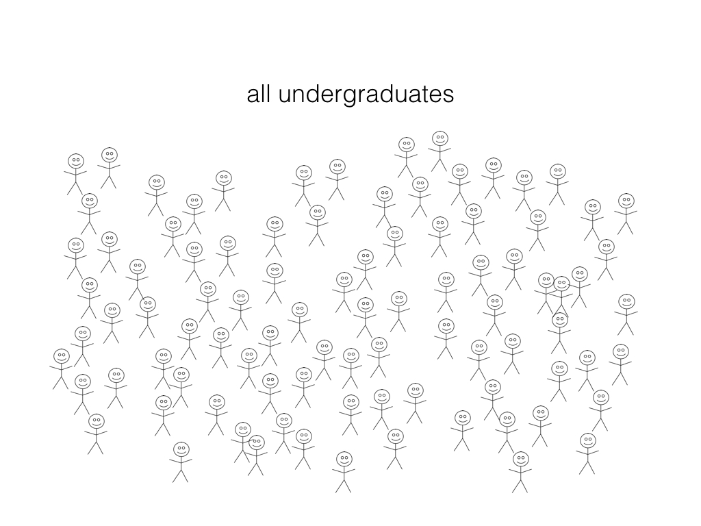
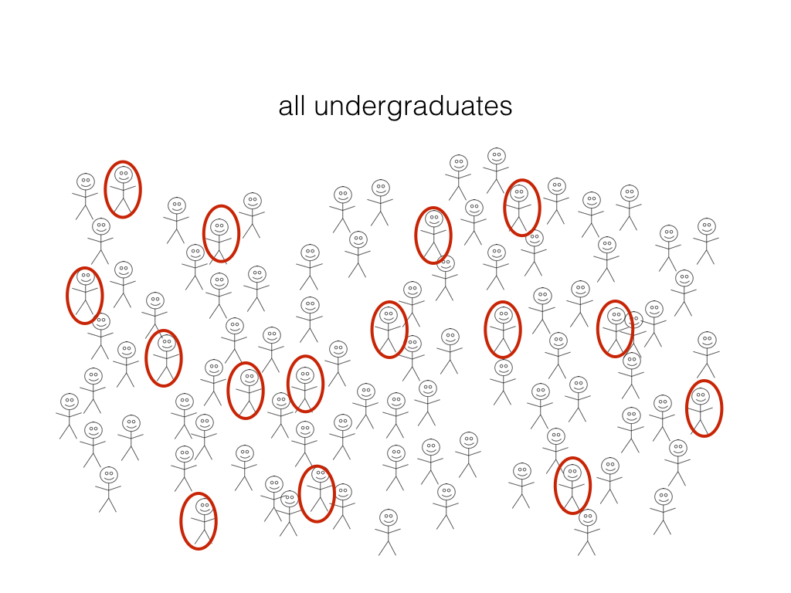

# Regression II: Linear regression {#regression2}

## Overview 
Introduction to linear regression models. We will also begin to compare k-nn to linear models in the context of regression.

## Chapter learning objectives 
By the end of the chapter, students will be able to:

* In a dataset with 2 variables, perform simple ordinary least squares regression in R using `caret`'s `train` with `method = "lm"` to predict the values for a test dataset.
* Compare and contrast predictions obtained from k-nearest neighbour regression to those obtained using simple ordinary least squares regression from the same dataset.
* In R, overlay the ordinary least squares regression lines from `geom_smooth` on a single plot. 

## Linear regression
k-nn is not the only type of regression, there are many, and one common and quite useful type of regression is called linear regression. Linear regression is similar to k-nn regression in that the target/response variable is expected to be quantitative, however, one way it varies quite differently is how the training data is used to predict a value for a new observation. Instead of looking at the $k$-nearest neighbours and averaging over their values for a prediction, in linear regression all the training data points are used to create a straight line of "best fit", and then the line is used to "look-up" the predicted value.

For example, let's revisit the smaller version of the Sacramento housing data set and the prediction case where we come across a new house we are interested in purchasing, and it is 2000 square feet! Its advertised list price is $350,000 should we give them what they are asking? Or is that overpriced and we should offer less? 

To answer this question using linear regression, we use the data we have to draw the straight line of "best fit" through our existing data points:

```{r 08-lin-reg1, message = FALSE, warning = FALSE, echo = FALSE, fig.height = 4, fig.width = 5}
library(tidyverse)
library(scales)
library(caret)
library(gridExtra)

data(Sacramento)
set.seed(2019)
small_sacramento <- sample_n(Sacramento, size = 30)

small_plot <- ggplot(small_sacramento, aes(x = sqft, y = price)) +
  geom_point() +
  xlab("House size (square footage)") +
  ylab("Price (USD)") +
  scale_y_continuous(labels=dollar_format()) +
  geom_smooth(method = "lm", se = FALSE) 
small_plot
```

Then we can use this line to "look up" the predicted price given the value we have for the predictor/explanatory variable (here 2000 square feet). 

```{r 08-lin-reg2, message = FALSE, warning = FALSE, echo = FALSE, fig.height = 4, fig.width = 5}
small_model <- lm(price ~ sqft, data = small_sacramento)
prediction <- predict(small_model, data.frame(sqft = 2000))

small_plot + 
  geom_vline(xintercept = 2000, linetype = "dotted") +
  geom_point(aes(x = 2000, y = prediction[[1]], color = "red", size = 2.5)) +
  theme(legend.position="none")

print(prediction[[1]])
```

Using linear regression on this small data set to predict the sale price for a 2000 square foot house we get a predicted value of \$287178.80 USD. But wait a minute... How exactly does linear regression choose the line of "best fit"? Many different lines could be drawn through the data points, we show some examples below:

```{r 08-several-lines, echo = FALSE, fig.height = 4, fig.width = 5}

small_plot + 
  geom_abline(intercept = -64542.23, slope = 190, color = "green") +
  geom_abline(intercept = -6900, slope = 175, color = "purple") +
  geom_abline(intercept = -64542.23, slope = 160, color = "red") 
```

Linear regression chooses the straight line of "best fit" by choosing the line that minimzes the **average** vertical distance between itself and each of the observed data points. From the lines shown above, that is the blue line. What exactly do we mean by the vertical distance between the predicted values (which fall along the line of "best fit") and the observed data points? We illustrate these distances in the plot below with a red line:

```{r 08-verticalDistToMin,  echo = FALSE, fig.height = 4, fig.width = 5}
small_sacramento <- small_sacramento %>% 
  mutate(predicted = predict(small_model))
small_plot +
  geom_segment(data = small_sacramento, aes(xend = sqft, yend = predicted), colour = "red") 


```

How do we assess the predictive accuracy of a linear regression model? We use the same measure of predictive performance we used with k-nn regression, $RMPSE$ (note the use of $RMPSE$ versus $RMSE$ here as discussed in the first section of this chapter).

## Linear regression in R using `caret`

We can perform linear regression in R using the `caret` package in a very similar manner to how we performed k-nn regression, using the `train` function. To do this, instead of setting `method = "knn"` we instead set `method = "lm"`. Another difference is that we do not need to choose $k$ in the context of linear regression and so we do not need to perform cross validation. Below we illustrate how we can use the `caret` package to predict house sale price given house size using a linear regression approach using the full Sacramento real estate data set:

As usual, we should start by putting some test data away in a lock box that we can come back to after we choose our final model, so let's take care of that business now. 

```{r 08-test-train-split-again}
set.seed(2019) # makes the random selection of rows reproducible
training_rows <- Sacramento %>% 
  select(price) %>% 
  unlist() %>% # converts Class from a tibble to a vector
  createDataPartition(p = 0.6, list = FALSE)

X_train <- Sacramento %>% 
  select(sqft) %>% 
  slice(training_rows) %>% 
  data.frame()

Y_train <- Sacramento %>% 
  select(price) %>% 
  slice(training_rows) %>% 
  unlist()

X_test <- Sacramento %>% 
  select(sqft) %>% 
  slice(-training_rows) %>% 
  data.frame()

Y_test <- Sacramento %>% 
  select(price) %>% 
  slice(-training_rows) %>% 
  unlist()
```


Now that we have our training data, we fit our linear regression model:

```{r 08-fitLM, fig.height = 4, fig.width = 5}
lm_model <- train(x = X_train, 
                      y = Y_train, 
                      method = "lm") 
```

And finally, we predict on the test data set to assess how well our model does:

```{r 08-assessFinal}
test_pred <- predict(lm_model, X_test)
lm_modelvalues <- data.frame(obs = Y_test, pred = test_pred)
lm_test_results <- defaultSummary(lm_modelvalues)
lm_test_results
```

Our final model's test error as assessed by $RMSPE$ is 86688.47. Remember that this is in units of the target/response variable, and here that is US Dollars (USD). Does this mean our model is "good" at predicting house sale price based off of the predictor of home size? Again answering this is tricky to answer and requires to use domain knowledge and think about the application you are using the prediction for. 

And what does our final linear regression model look like when we predict across all possible house sizes we might encounter in the Sacremento area? There is a plotting function in the `tidyverse`, `geom_smooth`, that allows us to do this easily by adding a layer on our plot with the linear regression predicted line of "best fit". The default for this adds a plausible range to this line that we are not interested in at this point, so to avoid plotting it, we provide the argument `se = FALSE` in our call to `geom_smooth`.

```{r 08-lm-predict-all, fig.height = 4, fig.width = 5}

train_data <- bind_cols(X_train, data.frame(price = Y_train))

lm_plot_final <- ggplot(train_data, aes(x = sqft, y = price)) +
    geom_point(alpha = 0.4) +
    xlab("House size (square footage)") +
    ylab("Price (USD)") +
    scale_y_continuous(labels = dollar_format())  +
    geom_smooth(method = "lm", se = FALSE) 
lm_plot_final
```

## Comparing linear and k-nn regression

Now that we have a general understanding of both linear and k-nn regression, we can start to compare and contrast these methods as well as the predictions made by them. To start, let's look at the visualization of the linear regression model predictions for the Sacramento real estate data (predicting price from house size) and the "best" k-nn regression model obtained from the same problem:

```{r 08-compareRegression, echo = FALSE, fig.height = 4, fig.width = 10}
k = data.frame(k = 51)
set.seed(1234)
knn_reg_final <- train(x = X_train, y = Y_train, method = "knn", tuneGrid = k)
set.seed(1234)
predictions_all <- data.frame(sqft = seq(from = 500, to = 4250, by = 1))
predictions_all$price <- predict(knn_reg_final, 
                                 data.frame(sqft = seq(from = 500, to = 4250, by = 1)))

plot_final <- ggplot(train_data, aes(x = sqft, y = price)) +
    geom_point(alpha = 0.4) +
    xlab("House size (square footage)") +
    ylab("Price (USD)") +
    scale_y_continuous(labels = dollar_format())  +
    geom_line(data = predictions_all, aes(x = sqft, y = price), color = "blue") +
    ggtitle("k-nn regression") +
    annotate("text", x = 3500, y = 100000, label = paste("RMSPE =", "91620.40"))

lm_plot_final <- lm_plot_final +
  annotate("text", x = 3500, y = 100000, label = paste("RMSPE =", round(lm_test_results[[1]], 2))) +
  ggtitle("linear regression")

grid.arrange(lm_plot_final, plot_final, ncol = 2)
```

What differences do we observe from the visualization above? One obvious difference is the shape of the blue lines. In linear regression we are restricted to a straight line, whereas in k-nn regression our line is much more flexible and can be quite wiggly. There can be an advantage to limiting the model to a straight line, as linear regression does, in that a straight line model is quite interpretable and can be defined by two numbers, the y-intercept and the slope. The slope is particularly meaningful for interpretation, as it tells us what unit increase in the target/response variable we predict given a unit increase in the predictor/explanatory variable. Additionally, because our model is restricted to a straight line, we can even use the mathematical equation for a straight line as a basis to write a mathematical expression of our model. 

Remembering that the equation for a straight line is: 

$$Y = \beta_0 + \beta_1X$$
Where:

- $\beta_0$ is the y-intercept of the line (the value where the line cuts the y-axis)
- $\beta_1$ is the slope of the line

We can then write:

$$house\: price = \beta_0 + \beta_1house\: size$$

And finally, fill in the values for $\beta_0$ and $\beta_1$ from the straight line (we will show you how to get these from R next week) to get:

$$house\: price = -64542.2 + 175.9*house\: size$$

k-nn regression, as simple as it is to implement and understand, has no such interpretability from it's wiggly line.

There can however also be a disadvantage to using a linear regression model in some cases, particularly when the relationship between the target and the predictor is not linear, but instead some other shape, such as curved or circular. In these cases the prediction model from a linear regression will have high bias, meaning that model/predicted values does not match the actual observed values very well. Such a model would probably have a quite high $RMSE$ when assessing model goodness of fit on the training data and a quite high $RMPSE$ when assessing model prediction quality on a test data set. On such a data set, k-nn regression may fare better. Additionally, there are other types of regression you can learn about in future courses that may do even better at predicting with such data.

How do these two models compare on this data set? On the visualizations above we also printed the $RMPSE$ as calculated from predicting on the test data set that was not used to train/fit the models. The $RMPSE$ for the linear regression model is less than the $RMPSE$ for the k-nn regression model, and thus if were were comparing these in practice we would choose to use the linear regression model to make our predictions because of this (in addition to the fact the the linear regression model is more interpretable). 


## Multivariate linear regression

As in k-nn classification and k-nn regression, in linear regression we can have multiple predictors. To do this, we follow a very similar approach to what we did using `caret` for k-nn regression, however, we do not need to use cross-validation to choose $k$. We also do not need to scale the data for linear regression as it does not use a distance between points calculation in its algorithm. We demonstrate how to do this below using the Sacramento real estate data with both house size (measured in square feet) as well as number of bathrooms as our predictors, and continue to use house sale price as our outcome/target variable that we are trying to predict.

We will start by splitting our data into a trained and test set as we did before:

```{r 09-lm-mult-test-train-split}
set.seed(2019) # makes the random selection of rows reproducible
training_rows <- Sacramento %>% 
  select(price) %>% 
  unlist() %>% # converts Class from a tibble to a vector
  createDataPartition(p = 0.6, list = FALSE)

lm_X_train <- Sacramento %>% 
  select(sqft, baths) %>% 
  slice(training_rows) %>% 
  data.frame()

lm_Y_train <- Sacramento %>% 
  select(price) %>% 
  slice(training_rows) %>% 
  unlist()

lm_X_test <- Sacramento %>% 
  select(sqft, baths) %>% 
  slice(-training_rows) %>% 
  data.frame()

lm_Y_test <- Sacramento %>% 
  select(price) %>% 
  slice(-training_rows) %>% 
  unlist()
```

Now we can fit the model on the training set using the `method = "lm"` argument in the train function:
```{r 09-fitlm}
lm_mult_reg_final <- train(x = lm_X_train, y = lm_Y_train, method = "lm")
```

What does our model predictions look like in the case of linear regression when we have two predictors? We illustrate this below:

```{r 09-3DlinReg, echo = FALSE, message = FALSE, warning = FALSE}
library(plotly)
lm_train_data <- bind_cols(lm_X_train, tibble(price = lm_Y_train))

# Define 3D scatterplot points --------------------------------------------
# Get coordinates of points for 3D scatterplot
lm_x_values <- lm_train_data$sqft %>% 
  round(3)
lm_y_values <- lm_train_data$baths %>% 
  round(3)
lm_z_values <- lm_train_data$price %>% 
  round(3)

# Define regression plane -------------------------------------------------
# Construct x and y grid elements
sqft <- seq(from = min(lm_x_values), to = max(lm_x_values), length = 50)
baths <- seq(from = min(lm_y_values), to = max(lm_y_values), length = 50)

# Construct z grid by computing
# 1) fitted beta coefficients
# 2) fitted values of outer product of x_grid and y_grid
# 3) extracting z_grid (matrix needs to be of specific dimensions)
# beta_hat <- house_prices %>% 
#   lm(log10_price ~ log10_size + yr_built, data = .) %>% 
#   coef()
lm_fitted_values <- crossing(sqft, baths) %>% 
  mutate(price = predict(lm_mult_reg_final, .))

lm_z_grid <- lm_fitted_values %>% 
   pull(price) %>%
   matrix(nrow = length(sqft))

lm_x_grid <- sqft
lm_y_grid <- baths

lm_train_data %>% 
plot_ly() %>% 
  add_markers(x = ~ as.numeric(sqft), 
        z = ~ as.integer(price), 
        y = ~ as.numeric(baths),
        marker = list(size = 5, opacity = 0.4, color = "red")) %>% 
  layout(scene = list(xaxis = list(title = 'House size (square feet)'), 
                     zaxis = list(title = 'Price (USD)'),
                     yaxis = list(title = 'Number of bathrooms'))) %>% 
  add_surface(x = ~ lm_x_grid, 
              y = ~ lm_y_grid, 
              z = ~ lm_z_grid,
              colorbar=list(title='Price (USD)'))
```
We see that the predictions from linear regression with two predictors form a plane as well, but this plane differs from the one we get from k-nn regression in its flexibility. The plane from k-nn regression above was more flexible and more closely followed the shape of the training data. The plane from linear regression however is constrained to being linear (i.e., a flat plane). As discussed this can be advantageous in one aspect, which is that for each predictor, we can get a slope from linear regression, and thus describe the plane mathematically. We can extract those slope values from our model object as shown below:

```{r 09-get-slopes}
lm_mult_reg_final$finalModel$coefficients
```
And then use those slopes, to write a mathematical equation to describe the prediction plane:

Remembering that the equation for a plane is: 

$$Y = \beta_0 + \beta_1X_1 + \beta_2X_2$$
Where:

- $\beta_0$ is the y-intercept of the line (the value where the line cuts the y-axis)
- $\beta_1$ is the slope for the first predictor
- $X_1$ is the first predictor
- $\beta_2$ is the slope for the second predictor
- $X_2$ is the second predictor

We can then write:

$$house\: price = \beta_0 + \beta_1  \:house\: size + \beta_2  \:number\: of \: bathrooms$$

And finally, fill in the values for $\beta_0$, $\beta_1$ and $\beta_2$ from the model output above:

$$house\: price = 25284.3344 + 140.2523*house\: size -7115.9565 *  \:number\: of \: bathrooms$$

OK great, so this model is more interpretable than the multivariate k-nn regression model (i.e., we can write a mathematical equation that explains how each predictor is affecting the predictions), but as always, we should look at the test error and ask whether linear regression is doing a better job of predicting compared to k-nn regression in this multivariate regression case? To do that we can use this linear regression model to predict on the test data to get our test error.

```{r 09-get-RMSPE}
test_pred_lm <- predict(lm_mult_reg_final, lm_X_test)
lm_modelvalues <- data.frame(obs = lm_Y_test, pred = test_pred_lm)
lm_mult_test_results <- defaultSummary(lm_modelvalues)
lm_mult_test_results[[1]]
```

We get that the $RMSPE$ for the multivariate linear regression model of 86778.87. This prediction error is less than the prediction error for the multivariate k-nn regression model, indicating that we should likely choose linear regression for predictions of house price on this data set. But wait, we should also ask if this more complex model is doing a better job of predicting compared to our simple linear regression model with only a single predictor (house size). Revisiting last chapter, we see that our $RMSPE$ for our simple linear regression model with only a single predictor was 86688.47 which is less than that for our more complex model. Thus, again for interpretability sake as well as performance, we should in the end choose the simple linear regression model for this data set. 

Should we always end up choosing a simple linear regression as our model? No! And you never know what model will be the best until you go through this process. Exploratory data analysis can give you some hints, but until you look at the test error to compare the models you don't really know.

## The other side of regression

So far in this textbook we have used regression only in the context of prediction, however, regression is also a powerful method to understand and/or describe the relationship between a quantitative outcome/response variable and one or more explanatory variables. Extending the case we have been working with in this chapter (where we are interested in house price as the outcome/response variable), we could also, or instead, be interested in describing the individual effects of house size and the number of bathrooms on house price, quantifying how big each of these effects are, and assessing how accurately we can estimate each of these effects.

Using linear regression to answer such questions sits under the umbrella of statistical inference. Here we will only introduce this topic at a very high-level, but it is an important field that is widely used in Statistics and Data Science and is taught in many Statistical courses. 

In statistical inference we acknowledge that we can only measure some of all the possible observations that exist in the world for the thing we are interested in quantifying. And so what we do, is use the measurements that we do have to infer/make a guess about what the true quantity would be if we could measure every possible thing. One example of statistical inference would be to try to estimate/come up with a best guess to the proportion of undergraduates who have an iphone. 



We cannot possibly ask all existing undergraduates if they have an iphone, so what can we do? Well, what statistical inference suggests that instead of asking all undergraduates (which we cannot do), we instead ask a random (and representative) sample of undergraduates if they have an iphone. 



From this sample of data we calculate the proportion of undergraduates that have an iphone. We can then use this proportion as an estimate/best guess of the proportion of all undergradautes that have an iphone. We know the proportion we calculated is not exactly right, but we think it should be close and it's the best we can do (since we cannot possibly ask all undergraduates and get the exact truth). Since we know that it's not exaclty right, we also try to use the data we have collected to come up with a plausible range where we think the true proportion of all undergradautes that have an iphone lies. 

Now here in this chapter in the context of linear regression, we are not talking about estimating a proportion, instead we are instead usually interested in estimating the slope/coefficient of the relationship between the outcome/response variable and one or more predictor variables. Again, in this case, whatever we are measuring is usually just a sample of all the things we could measure. Here in this chapter it is a sample of observations measuring the sale and house characteristics of 932 (out of > 180,000) homes in Sacramento. Fitting our linear model, we did come up with an estimate for the slope for the relationship between house sale price and home size as 175.9. We know this number is not the true slope for the relationship between these two variables, however this is the best guess/estimate we can come up with given the data that we have. The next step of regression in this statistical inference perspective would be to use the data we have come up with a plausible range for where we think the value for the true slope would lie. We will not go into the details of how to do this in this course, but this will be covered in following Statistics courses. However, if you are very interested we will say that boostrapping to generate confidence intervals would be one approach that would let you do this and we point you to the additional readings for this chapter to learn more if you are interested. 

## Additional readings/resources
- Pages 59-71 of [Introduction to Statistical Learning](http://www-bcf.usc.edu/~gareth/ISL/ISLR%20Seventh%20Printing.pdf) with Applications in R by Gareth James, Daniela Witten, Trevor Hastie and Robert Tibshirani
- Pages 104 - 109 of [An Introduction to Statistical Learning with Applications in R](https://www-bcf.usc.edu/~gareth/ISL/ISLR%20Seventh%20Printing.pdf) by Gareth James, Daniela Witten, Trevor Hastie and Robert Tibshirani
- [The `caret` Package](https://topepo.github.io/caret/index.html)
- Chapters 6 - 11 of [Modern Dive](https://moderndive.com/) Statistical Inference via Data Science by Chester Ismay and Albert Y. Kim
