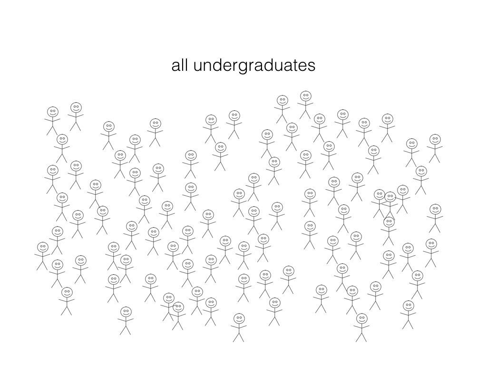
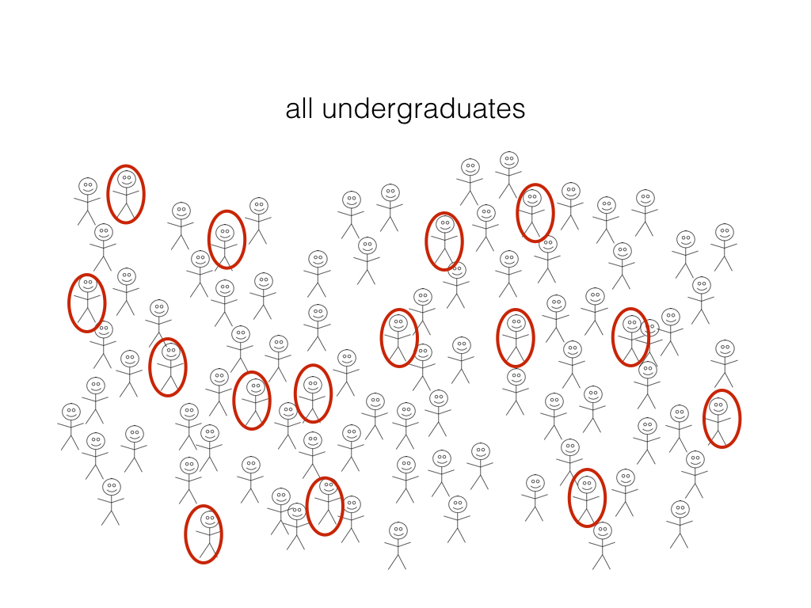

# Regression, continued some more... {#regression3}

## Overview 
This week we will work through some examples of multiple regression in the prediction context. We will emphasize the interpretation and relevance of the mix of negative/positive slopes in this context. We will then discuss another application of regression; modelling the relationship between two or more variables so that we can better understand or describe it. We will emphasize that this is a jumping off point for the study of statistical inference.

## Learning objectives 
By the end of the chapter, students will be able to:

* In a dataset with > 2 variables, perform k-nn regression in R using `caret`'s `train` with `method = "k-nn"` to predict the values for a test dataset.
* In a dataset with > 2 variables, perform simple ordinary least squares regression in R using `caret`'s `train` with `method = "lm"` to predict the values for a test dataset.


## Multivariate k-nn regression

As in k-nn classification, in k-nn regression we can have multiple predictors. When we have multiple predictors in k-nn regression, we have the same concern regarding the scale of the predictors. This is because as in k-nn classification, in k-nn regression predictions are made by identifying the $k$ observations that are nearest to the new point we want to predict, and any variables that are on a large scale will have a much larger effect than variables on a small scale. Thus, once we start performing multivariate k-nn regression we need to use the `scale` function in R on our predictors to ensure this doesn't happen.

We will now demonstrate a multi-variate k-nn regression analysis usin the `caret` package on the Sacramento real estate data (also used in the the last two chapters in this book). This time we will use house size (measured in square feet) as well as number of bathrooms as our predictors, and continue to use house sale price as our outcome/target variable that we are trying to predict.

Let's first load the libraries and the data:
```{r load stuff, warning = FALSE, message = FALSE}
library(tidyverse)
library(caret)
library(GGally)
data("Sacramento")
head(Sacramento)
```

It is always a good practice to do exploratory data analysis, such as visualizing the data, before we start modeling the data. Thus the first thing we will do is use ggpairs (from the `GGally` package) to plot all the variables we are interested in using in our analyses:

```{r ggpairs, fig.height = 4, fig.width = 5}
plot_pairs <- Sacramento %>% 
  select(price, sqft, baths) %>% 
  ggpairs()
plot_pairs
```

From this we can see that generally, as both house size and number of bathrooms increase, so does price. Does adding the number of baths to our model improve our ability to predict house price? To answer that question, we will have to come up with the test error for a k-nn regression model using house size and number of baths, and then we can compare it to the test error for the model we previously came up with that only used house size to see if it is smaller (decreased test error indicates increased prediction quality). Let's do that now!

Looking at the data above, we can see that `sqft` and `beds` (number of bedrooms) are on vastly different scales. Thus we need to apply the `scale` function to these columns before we start our analysis:

```{r scaling}
scaled_Sacramento <- Sacramento %>% 
  select(price, sqft, baths) %>% 
  mutate(sqft = scale(sqft, center = FALSE),
         baths = scale(baths, center = FALSE))
head(scaled_Sacramento)
```

Now we can split our data into a trained and test set as we did before:

```{r mult_test_train_split}
set.seed(2019) # makes the random selection of rows reproducible
training_rows <- scaled_Sacramento %>% 
  select(price) %>% 
  unlist() %>% # converts Class from a tibble to a vector
  createDataPartition(p = 0.6, list = FALSE)

X_train <- scaled_Sacramento %>% 
  select(sqft, baths) %>% 
  slice(training_rows) %>% 
  data.frame()

Y_train <- scaled_Sacramento %>% 
  select(price) %>% 
  slice(training_rows) %>% 
  unlist()

X_test <- scaled_Sacramento %>% 
  select(sqft, baths) %>% 
  slice(-training_rows) %>% 
  data.frame()

Y_test <- scaled_Sacramento %>% 
  select(price) %>% 
  slice(-training_rows) %>% 
  unlist()
```

Next, we'll use 10-fold cross-validation to choose $k$:
```{r mult_choose_k, fig.height = 4, fig.width = 5}
train_control <- trainControl(method = "cv", number = 10)
# makes a column of k's, from 1 to 100 in increments of 10
k_lots = data.frame(k = seq(from = 1, to = 500, by = 5)) 

set.seed(1234)
knn_reg_cv_10 <- train(x = X_train, 
                       y = Y_train, 
                       method = "knn", 
                       tuneGrid = k_lots, 
                       trControl = train_control) 

ggplot(knn_reg_cv_10$results, aes(x = k, y = RMSE)) +
  geom_point() +
  geom_line()
knn_reg_cv_10$method
```
Here we see that the smallest $RMSE$ is from the model where $k$ = 31. Thus the best $k$ for this model, with two predictors, is 31. 

Now that we have chosen $k$, we need to re-train the model on the entire training data set with $k$ = 31, and after that we can use that model to predict on the test data to get our test error. At that point we will also visualize the model predictions overlaid on top of the data. This time the predictions will be a plane in 3-D space, instead of a line in 2-D space, as we have 2 predictors instead of 3. 

```{r re-train}
k = data.frame(k = 31)

set.seed(1234)
knn_mult_reg_final <- train(x = X_train, y = Y_train, method = "knn", tuneGrid = k)

test_pred <- predict(knn_mult_reg_final, X_test)
modelvalues <- data.frame(obs = Y_test, pred = test_pred)
knn_mult_test_results <- defaultSummary(modelvalues)
knn_mult_test_results[[1]]
```

This time when we performed k-nn regression on the same data set, but also included number of bathrooms as a predictor we obtained a RMSPE test error of 90108.49. This compares to a RMSPE test error of 91620.40 when we used only house size as the single predictor. What do the predictions from this model look like overlaid on the data?

```{r knnMultViz, echo = FALSE, message = FALSE, warning = FALSE}
library(plotly)

train_data <- bind_cols(X_train, tibble(price = Y_train))

# Define 3D scatterplot points --------------------------------------------
# Get coordinates of points for 3D scatterplot
x_values <- train_data$sqft %>% 
  round(3)
y_values <- train_data$baths %>% 
  round(3)
z_values <- train_data$price %>% 
  round(3)

# Define regression plane -------------------------------------------------
# Construct x and y grid elements
sqft <- seq(from = min(x_values), to = max(x_values), length = 50)
baths <- seq(from = min(y_values), to = max(y_values), length = 50)

# Construct z grid by computing
# 1) fitted beta coefficients
# 2) fitted values of outer product of x_grid and y_grid
# 3) extracting z_grid (matrix needs to be of specific dimensions)
# beta_hat <- house_prices %>% 
#   lm(log10_price ~ log10_size + yr_built, data = .) %>% 
#   coef()
fitted_values <- crossing(sqft, baths) %>% 
  mutate(price = predict(knn_mult_reg_final, .))

z_grid <- fitted_values %>% 
   pull(price) %>%
   matrix(nrow = length(sqft))

x_grid <- sqft
y_grid <- baths

train_data %>% 
plot_ly() %>% 
  add_markers(x = ~ as.numeric(sqft), 
        z = ~ as.integer(price), 
        y = ~ as.numeric(baths),
        marker = list(size = 5, opacity = 0.4, color = "red")) %>% 
  layout(scene = list(xaxis = list(title = 'Scaled house size (square feet)'), 
                     zaxis = list(title = 'Price (USD)'),
                     yaxis = list(title = 'Scaled number of bathrooms'))) %>% 
  add_surface(x = ~ x_grid, 
              y = ~ y_grid, 
              z = ~ z_grid,
              colorbar=list(title='Price (USD)'))
```

We can see that the predictions in this case, where we have 2 predictors, form a plane instead of a line. Because the newly added predictor, number of bathrooms, is correlated with price (USD) (meaning as price changes, so does number of bathrooms) we get additional and useful information for making our predictions. For example, in this model we would predict that the cost of a house with a scaled house size of ~ 0.52 a scaled number bathrooms of ~ 1.13 would cost less than the same sized house with a higher scaled number bathrooms (e.g., ~ 2.11). Without having the additional predictor of number of bathrooms, we would predict the same price for these two houses. 

## Multivariate linear regression

We could also try to create a prediction model for the data above using linear regression instead of k-nn regression. To do this, we follow a very similar approach to what we did using `caret` for k-nn regression, however, we do not need to use cross-validation to choose $k$. We also do not need to scale the data for linear regression as it does not use a distance between points calculation in its algorithm. We demonstrate how to do this below:

Now we can split our data into a trained and test set as we did before:

```{r lm_mult_test_train_split}
set.seed(2019) # makes the random selection of rows reproducible
training_rows <- Sacramento %>% 
  select(price) %>% 
  unlist() %>% # converts Class from a tibble to a vector
  createDataPartition(p = 0.6, list = FALSE)

lm_X_train <- Sacramento %>% 
  select(sqft, baths) %>% 
  slice(training_rows) %>% 
  data.frame()

lm_Y_train <- Sacramento %>% 
  select(price) %>% 
  slice(training_rows) %>% 
  unlist()

lm_X_test <- Sacramento %>% 
  select(sqft, baths) %>% 
  slice(-training_rows) %>% 
  data.frame()

lm_Y_test <- Sacramento %>% 
  select(price) %>% 
  slice(-training_rows) %>% 
  unlist()
```

Now we can fit the model on the training set using the `method = "lm"` argument in the train function:
```{r fitlm}
lm_mult_reg_final <- train(x = lm_X_train, y = lm_Y_train, method = "lm")
```

What does our model predictions look like in the case of linear regression when we have two predictors? We illustrate this below:

```{r 3DlinReg, echo = FALSE, message = FALSE, warning = FALSE}
lm_train_data <- bind_cols(lm_X_train, tibble(price = lm_Y_train))

# Define 3D scatterplot points --------------------------------------------
# Get coordinates of points for 3D scatterplot
lm_x_values <- lm_train_data$sqft %>% 
  round(3)
lm_y_values <- lm_train_data$baths %>% 
  round(3)
lm_z_values <- lm_train_data$price %>% 
  round(3)

# Define regression plane -------------------------------------------------
# Construct x and y grid elements
sqft <- seq(from = min(lm_x_values), to = max(lm_x_values), length = 50)
baths <- seq(from = min(lm_y_values), to = max(lm_y_values), length = 50)

# Construct z grid by computing
# 1) fitted beta coefficients
# 2) fitted values of outer product of x_grid and y_grid
# 3) extracting z_grid (matrix needs to be of specific dimensions)
# beta_hat <- house_prices %>% 
#   lm(log10_price ~ log10_size + yr_built, data = .) %>% 
#   coef()
lm_fitted_values <- crossing(sqft, baths) %>% 
  mutate(price = predict(lm_mult_reg_final, .))

lm_z_grid <- lm_fitted_values %>% 
   pull(price) %>%
   matrix(nrow = length(sqft))

lm_x_grid <- sqft
lm_y_grid <- baths

lm_train_data %>% 
plot_ly() %>% 
  add_markers(x = ~ as.numeric(sqft), 
        z = ~ as.integer(price), 
        y = ~ as.numeric(baths),
        marker = list(size = 5, opacity = 0.4, color = "red")) %>% 
  layout(scene = list(xaxis = list(title = 'House size (square feet)'), 
                     zaxis = list(title = 'Price (USD)'),
                     yaxis = list(title = 'Number of bathrooms'))) %>% 
  add_surface(x = ~ lm_x_grid, 
              y = ~ lm_y_grid, 
              z = ~ lm_z_grid,
              colorbar=list(title='Price (USD)'))
```
We see that the predictions from linear regression with two predictors form a plane as well, but this plane differs from the one we get from k-nn regression in its flexibility. The plane from k-nn regression above was more flexible and more closely followed the shape of the training data. The plane from linear regression however is constrained to being linear (i.e., a flat plane). As discussed this can be advantageous in one aspect, which is that for each predictor, we can get a slope from linear regression, and thus describe the plane mathematically. We can extract those slope values from our model object as shown below:

```{r getslopes}
lm_mult_reg_final$finalModel$coefficients
```
And then use those slopes, to write a mathematical equation to describe the prediction plane:

Remembering that the equation for a plane is: 

$$Y = \beta_0 + \beta_1X_1 + \beta_2X_2$$
Where:

- $\beta_0$ is the y-intercept of the line (the value where the line cuts the y-axis)
- $\beta_1$ is the slope for the first predictor
- $X_1$ is the first predictor
- $\beta_2$ is the slope for the second predictor
- $X_2$ is the second predictor

We can then write:

$$house\: price = \beta_0 + \beta_1  \:house\: size + \beta_2  \:number\: of \: bathrooms$$

And finally, fill in the values for $\beta_0$, $\beta_1$ and $\beta_2$ from the model output above:

$$house\: price = 25284.3344 + 140.2523*house\: size -7115.9565 *  \:number\: of \: bathrooms$$

OK great, so this model is more interpretable than the multivariate k-nn regression model (i.e., we can write a mathematical equation that explains how each predictor is affecting the predictions), but as always, we should look at the test error and ask whether linear regression is doing a better job of predicting compared to k-nn regression in this multivariate regression case? To do that we can use this linear regression model to predict on the test data to get our test error.

```{r getRMSPE}
test_pred_lm <- predict(lm_mult_reg_final, lm_X_test)
lm_modelvalues <- data.frame(obs = lm_Y_test, pred = test_pred_lm)
lm_mult_test_results <- defaultSummary(lm_modelvalues)
lm_mult_test_results[[1]]
```

We get that the $RMSPE$ for the multivariate linear regression model of 86778.87. This prediction error is less than the prediction error for the multivariate k-nn regression model, indicating that we should likely choose linear regression for predictions of house price on this data set. But wait, we should also ask if this more complex model is doing a better job of predicting compared to our simple linear regression model with only a single predictor (house size). Revisiting last chapter, we see that our $RMSPE$ for our simple linear regression model with only a single predictor was 86688.47 which is less than that for our more complex model. Thus, again for interpretability sake as well as performance, we should in the end choose the simple linear regression model for this data set. 

Should we always end up choosing a simple linear regression as our model? No! And you never know what model will be the best until you go through this process. Exploratory data analysis can give you some hints, but until you look at the test error to compare the models you don't really know.

## The other side of regression

So far in this textbook we have used regression only in the context of prediction, however, regression is also a powerful method to understand and/or describe the relationship between a quantitative outcome/response variable and one or more explanatory variables. Extending the case we have been working with in this chapter (where we are interested in house price as the outcome/response variable), we could also, or instead, be interested in describing the individual effects of house size and the number of bathrooms on house price, quantifying how big each of these effects are, and assessing how accurately we can estimate each of these effects.

Using linear regression to answer such questions sits under the umbrella of statistical inference. Here we will only introduce this topic at a very high-level, but it is an important field that is widely used in Statistics and Data Science and is taught in many Statistical courses. 

In statistical inference we acknowledge that we can only measure some of all the possible observations that exist in the world for the thing we are interested in quantifying. And so what we do, is use the measurements that we do have to infer/make a guess about what the true quantity would be if we could measure every possible thing. One example of statistical inference would be to try to estimate/come up with a best guess to the proportion of undergraduates who have an iphone. 



We cannot possibly ask all existing undergraduates if they have an iphone, so what can we do? Well, what statistical inference suggests that instead of asking all undergraduates (which we cannot do), we instead ask a random (and representative) sample of undergraduates if they have an iphone. 



From this sample of data we calculate the proportion of undergraduates that have an iphone. We can then use this proportion as an estimate/best guess of the proportion of all undergradautes that have an iphone. We know the proportion we calculated is not exactly right, but we think it should be close and it's the best we can do (since we cannot possibly ask all undergraduates and get the exact truth). Since we know that it's not exaclty right, we also try to use the data we have collected to come up with a plausible range where we think the true proportion of all undergradautes that have an iphone lies. 

Now here in this chapter in the context of linear regression, we are not talking about estimating a proportion, instead we are instead usually interested in estimating the slope/coefficient of the relationship between the outcome/response variable and one or more predictor variables. Again, in this case, whatever we are measuring is usually just a sample of all the things we could measure. Here in this chapter it is a sample of observations measuring the sale and house characteristics of 932 (out of > 180,000) homes in Sacramento. Fitting our linear model, we did come up with an estimate for the slope for the relationship between house sale price and home size as 175.9. We know this number is not the true slope for the relationship between these two variables, however this is the best guess/estimate we can come up with given the data that we have. The next step of regression in this statistical inference perspective would be to use the data we have come up with a plausible range for where we think the value for the true slope would lie. We will not go into the details of how to do this in this course, but this will be covered in following Statistics courses. However, if you are very interested we will say that boostrapping to generate confidence intervals would be one approach that would let you do this and we point you to the additional readings for this chapter to learn more if you are interested. 

## Additional readings/resources
- Chapters 6 - 11 of [Modern Dive](https://moderndive.com/) Statistical Inference via Data Science by Chester Ismay and Albert Y. Kim


