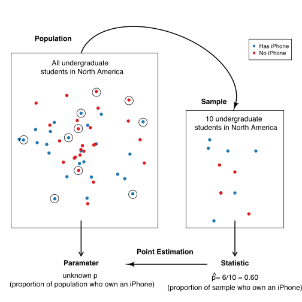

# Introduction to Statistical Inference {#inference}

```{r 11-setup, include= F}
library(tidyverse) 
require(grid) #  grid.bezier()

max_count <- function(dist) {
  max(ggplot_build(dist)$data[[1]]$count)
}

max_x <- function(dist){ 
  max(ggplot_build(dist)$data[[1]]$xmax)
}

min_x <- function(dist) {
  ggp_data <- ggplot_build(dist)
  min(ggp_data$data[[1]]$xmin)
}
```


## Overview
Another common data analysis task in practice is to draw conclusions about some unknown
aspect of a population of interest based on observed data sampled from that
population; we typically do not get data on the *entire* population.
Data analysis questions regarding how summaries, 
patterns, trends, or relationships in a dataset 
extend to the wider population are called *inferential questions*. This chapter will start
with the fundamental ideas of sampling from populations, and then will work towards
introducing two common techniques in statistical inference: *point estimation* and
*interval estimation*. 

## Chapter learning objectives 
By the end of the chapter, students will be able to:

* Describe real-world examples of questions that can be answered with the statistical inference.
* Define common population parameters (e.g. mean, proportion, standard deviation) that are often estimated using sampled data, and estimate these from a sample.
* Define the following statistical sampling terms (population, sample, population parameter, point estimate, sampling distribution).
* Explain the difference between a population parameter and sample point estimate.
* Use R to draw random samples from a finite population.
* Use R to create a sampling distribution from a finite population.
* Describe how sample size influences the sampling distribution.
* Define bootstrapping.
* Use R to create a bootstrap distribution to approximate a sampling distribution.
* Contrast the bootstrap and sampling distributions.

## Why do we need sampling? 
Statistical inference can help us decide how quantities we observe in
a subset of data relate to the same quantities in the broader
population. Suppose a retailer is considering selling iPhone accessories, and they want to estimate how big the market might be. Additionally, they are strategizing how they might market their products on North American college and university campuses. This retailer might use statistical inference to answer the question: 

*What proportion of all undergraduate students in North America own an iPhone?*

In the above question, we are interested in making a conclusion about *all*
undergraduate students in North America; this is our **population**.
In general, the population is the complete collection of individuals or cases we are interested in studying. 
Further, in the above question, we are interested in computing a quantity&mdash;the proportion
of iPhone owners&mdash;based on the entire population. This is our **population parameter**.
In general, a population parameter is a numerical characteristic
of the entire population. In order to compute this number in the example above, we would need to ask 
every single undergraduate in North America whether or not they own an iPhone. In practice,
directly computing population parameters is often time-consuming and costly, and sometimes impossible. 

A more practical approach would be to collect measurements for a **sample**: a subset of
individuals collected from the population. We can then compute a **sample statistic**&mdash;a numerical
characteristic of the sample&mdash;that estimates the population parameter. For example, if we 
randomly selected 100 undergraduate students across North America (the sample) and computed the proportion of those
students who own an iPhone (the sample statistic), we might suspect that that proportion is a reasonable
estimate of the proportion of students who own an iPhone in the entire population. 

<center>
{}
</center>

Note that proportions are not the *only* kind of population parameter we might be interested in. Suppose an undergraduate student studying at the University of British Columbia in Vancouver, BC is looking for an apartment to rent. They need to create a budget, so they want to know something about studio apartment rental prices in Vancouver, BC. This student might use statistical inference to tackle the question:

*What is the average price-per-month of studio apartment rentals in Vancouver, Canada?*

The population consists of all studio apartment rentals in Vancouver, and the population parameter is the *average price-per-month*. Here we used the average as a measure of center to describe the "typical value" of studio apartment rental prices. But even within this one example, we could also be interested in many other population parameters. For instance, we know that not every studio apartment rental in Vancouver will have the same price-per-month. So we might be interested in how much monthly prices vary. We'd then want to find a measure of the spread (or variability) of the rentals, such as the standard deviation. We might be interested in the fraction of studio apartment rentals that cost more than \$1000 per month, and the list goes on. The question we want to answer will help us determine the parameter we want to estimate. If we were somehow able to observe the whole population of studio apartment rental offerings in Vancouver, we could compute each of these numbers exactly; therefore, these are all population parameters. There are many kinds of observations and population parameters that you will run into in practice, but in this chapter, we will focus on two settings:

1. Using categorical observations to estimate the proportion of each category
2. Using quantitative observations to estimate the average (or mean)

## Sampling distributions

### Sampling distributions for proportions

Let's start with an illustrative (and tasty!) example. Timbits are 
bite-sized doughnuts sold at Tim Hortons, a popular Canadian-based fast-food restaurant
chain founded in Hamilton, Ontario, Canada. 

{width=50%} 


Suppose we wanted to estimate the true proportion of chocolate doughnuts at Tim
Hortons restaurants. Now, of course, we (the authors!) do not have access to the true population.
So for this chapter, we created a fictitious box of 10,000 Timbits with two flavours&mdash;old-fashioned 
and chocolate&mdash;as our population, and use this to illustrate
inferential concepts. Below we have a `tibble()` called `virtual_box` with a Timbit ID and flavour as our columns. We have also loaded our necessary packages: `tidyverse` and the `infer` package, which we will need to perform sampling later in the chapter.  

```{r 11-example-proportions, echo = FALSE, message = FALSE, warning = FALSE}
library(gridExtra)
set.seed(1234)
virtual_box <- tibble(timbit_id = seq(1, 10000, by = 1),
                     flavour = factor(rbinom(10000, 1, 0.63),
                     labels = c("old fashioned", "chocolate")))

```

```{r 11-example-proportions1}
library(tidyverse) 
library(infer)
head(virtual_box)
```

From our simulated box, we can see that the proportion of chocolate Timbits is
0.63. This value, 0.63, is the *population parameter*. Note that this parameter value is usually unknown in real data analysis problems.

```{r 11-example-proportions2, echo = TRUE, message = FALSE, warning = FALSE}
virtual_box %>% 
    group_by(flavour) %>% 
    summarize(n = n(),
             proportion = n() / 10000)
```

What would happen if we were to buy a box of 40 randomly-selected Timbits and count the number of chocolate Timbits (*i.e.,* take a random sample of size 40 from our Timbits population)? Let's use R to simulate this using our `virtual_box` population. We can do this using the `rep_sample_n` function from the `infer` package. The arguments
of `rep_sample_n` are (1) the data frame (or tibble) to sample from, and (2) the size of the sample to take.

```{r 11-example-proportions3, echo = TRUE, message = FALSE, warning = FALSE}
set.seed(1)
samples_1 <- rep_sample_n(tbl = virtual_box, size = 40)
choc_sample_1 <- summarize(samples_1, 
                           n = sum(flavour == "chocolate"),
                           prop = sum(flavour == "chocolate") / 40)
choc_sample_1
```
Here we see that the proportion of chocolate Timbits in this random sample is
`r round(choc_sample_1$prop,2)`. This value is our estimate - our best guess of our population parameter using this sample. Given that it is a single
value that we are estimating, we often refer to it as a **point estimate**.

Now imagine we took another random sample of 40 Timbits from the population. Do you
think we would get the same proportion? Let's try sampling from the population
again and see what happens. 

```{r 11-example-proportions4, echo = TRUE, message = FALSE, warning = FALSE}
set.seed(2)
samples_2 <- rep_sample_n(virtual_box, size = 40)
choc_sample_2 <- summarize(samples_2, n = sum(flavour == "chocolate"),
                                        prop = sum(flavour == "chocolate") / 40)
choc_sample_2
```

Notice that we get a different value for our statistic this time. The
proportion of chocolate Timbits in this sample is `r round(choc_sample_2$prop, 2)`. 
If we were to do this again, another random sample could also give a
different result. Statistics vary from sample to sample 
due to **sampling variability**. 

But just how much should we expect the statistics of our random
samples to vary? In order to understand this, we will simulate taking more samples
of size 40 from our population of Timbits, and calculate the 
proportion of chocolate Timbits in each sample. We can then
visualize the distribution of sample proportions we calculate. The distribution
of the estimate for all possible samples of a given size (which we commonly refer to as $n$) from a population is
called a **sampling distribution**. The sampling distribution will help us see
how much we would expect our sample proportions from this population to vary
for samples of size 40. Below we again use the `rep_sample_n` to take samples
of size 40 from our population of Timbits, but we set the `reps` argument
to specify the number of samples to take, here 1000.

```{r 11-example-proportions5, echo = TRUE, message = FALSE, warning = FALSE}
samples <- rep_sample_n(virtual_box, size = 40, reps = 1000)
head(samples)
tail(samples)
```

Notice the column `replicate` is indicating the replicate, or sample, with which each
Timbit belongs. Since we took 1000 samples of size 40, there are 1000 replicates.
Now that we have taken 1000 samples, to create a sampling distribution of sample proportions for samples of size 40, we need to calculate the proportion of chocolate Timbits for each sample, $\hat{p}_\text{chocolate}$:
```{r 11-example-proportions6, echo = TRUE, message = FALSE, warning = FALSE}
sample_estimates <- samples %>% 
    group_by(replicate) %>% 
    summarise(sample_proportion = sum(flavour == "chocolate") / 40)
head(sample_estimates)
tail(sample_estimates)
```
Now that we have calculated the proportion of chocolate Timbits for each sample, $\hat{p}_\text{chocolate}$, we can visualize the sampling distribution of sample proportions for samples of size 40:
```{r 11-example-proportions7, echo = TRUE, message = FALSE, warning = FALSE,fig.cap = "Sampling distribution of the sample proportion for sample size 40"}
sampling_distribution <-  ggplot(sample_estimates, aes(x = sample_proportion)) +
    geom_histogram(fill="dodgerblue3", color="white", bins = 12) +
    xlab("Sample proportions") 
sampling_distribution
```

The sampling distribution appears to be bell-shaped with one peak. It is
centered around `r round(mean(sample_estimates$sample_proportion),1)` and the
sample proportions range from about `r round(min(sample_estimates$sample_proportion), 1)` to 
about `r round(max(sample_estimates$sample_proportion), 1)`. In fact, we can calculate
the mean and standard deviation of the sample proportions. 

```{r 11-example-proportions8, echo = TRUE, message = FALSE, warning = FALSE}
sample_estimates %>% 
  summarise(mean = mean(sample_proportion), sd = sd(sample_proportion))
```

We notice that the sample proportions are centred around the population
proportion value. The standard deviation of the sample proportions 
is `r round(sd(sample_estimates$sample_proportion), 3)`.

<!--- > **Note:** If random samples of size $n$ are taken from a population, $\hat{p}$ will be approximately Normal with mean $p$ and standard deviation $\sqrt{\frac{p(1-p)}{n}}$ as long as the sample size $n$ is large enough such that $np$ and $n(1 - p)$ are at least 10, where $p$ is the population proportion, $\hat{p}$ is the sample proportion and $n$ is the sample size. 
--->

### Sampling distributions for means 

In the previous section, our variable of interest&mdash;Timbit flavour&mdash;was
*categorical*, and the population parameter of interest was the proportion of chocolate
Timbits. What if we wanted to infer something about a population of *quantitative* variables instead?
As mentioned in the introduction to this chapter, there are many choices of population parameter
for each type of observed variable. In this section, we will study the case where we are interested
in the population mean of a quantitative variable.

In particular, we will look at an example using data from Airbnb, an online
marketplace for arranging or offering places to stay. The dataset contains
Airbnb listings for Vancouver, Canada, in September 2020 
from [Inside Airbnb](http://insideairbnb.com/). 
Let's imagine (for learning purposes) that our dataset represents the population of all Airbnb rental listings in Vancouver,
and we are interested in the population mean price per night.
Our data contains an ID number, neighbourhood,
type of room, the number of people that the rental accommodates, number of
bathrooms, bedrooms, beds, and the price per night.

```{r 11-example-means1, echo = FALSE, message = FALSE, warning = FALSE}
airbnb <- read_csv("data/listings.csv") %>% 
  select(id, neighbourhood = neighbourhood_cleansed, room_type, accommodates, bathrooms = bathrooms_text, bedrooms, beds,  price) %>% 
  mutate(price = as.numeric(str_remove(price, "[$]"))) %>% 
  na.omit()
airbnb <- airbnb %>% 
  mutate(id = 1:nrow(airbnb))
head(airbnb)
```

We can visualize the population distribution of the price per night with a histogram. 
```{r 11-example-means2, echo = TRUE, message = FALSE, warning = FALSE, fig.cap = "Population distribution of price per night ($) for all Airbnb listings in Vancouver, Canada"}
population_distribution <-  ggplot(airbnb, aes(x = price)) +
    geom_histogram(fill="dodgerblue3", color="white") +
    xlab("Price per night ($)") 
population_distribution
population_parameters <- airbnb %>% 
    summarize(pop_mean = mean(price))
population_parameters
```

We see that the distribution has one peak and is skewed&mdash;most of the listings
are less than \$250 per night, but a small proportion of listings cost more
than that, creating a long tail on the histogram's right side. 
The population mean is \$`r round(population_parameters$pop_mean,2)`.

Suppose that we did not have access to the population data, yet we still wanted to estimate the mean price per night? We could answer this question by taking a random sample of as many AirBnB listings as we had time to, let's say we could do this for 40 listings. What would such a sample look like?

Let's take advantage of the fact that we do have access to the population data and simulate taking one random sample of 40 listings in R, again using `rep_sample_n`. After doing this we
create a histogram to visualize the
distribution of observations in the sample,
and calculate the mean of our sample. This number is a **point estimate** for the mean of the full population.

```{r 11-example-means3, echo = TRUE, message = FALSE, warning = FALSE, fig.cap = "Distribution of price per night ($) for sample of 20 Airbnb listings"}
sample_1 <- airbnb %>% 
    rep_sample_n(20)
head(sample_1)
sample_distribution <- ggplot(sample_1, aes(price)) + 
    geom_histogram(fill="dodgerblue3", color="white") +
    xlab("Price per night ($)") 
sample_distribution
estimates <- sample_1 %>% 
    summarize(sample_mean = mean(price))
estimates
```
Recall that the population mean 
was \$`r round(population_parameters$pop_mean,2)`. We see that our point
estimate for the mean is \$`r round(estimates$sample_mean, 2)`. So our estimate was actually quite close to the population parameter: the mean was 
about `r round(100*abs(estimates$sample_mean - population_parameters$pop_mean)/population_parameters$pop_mean, 1)`% off.
Note that in practice, we usually cannot compute the accuracy of the estimate, since we do not have access to the population
parameter; if we did, we wouldn't need to estimate it!

Also recall from the previous section that the point estimate can vary; if 
we took another random sample from the population, then the value of our statistic may change.
So then did we just get lucky with our point estimate above?
How much does our estimate vary across different samples of size 20 in this example? Again, since we have access to the population,
we can take many samples and plot the **sampling distribution** of sample means for samples of size 20 to get a sense
for this variation. In this case, we'll use 1500 samples of size 20.

```{r 11-example-means4, echo = TRUE, message = FALSE, warning = FALSE, fig.cap= "Sampling distribution of the sample means for sample size of 20"}
samples <- rep_sample_n(airbnb, size = 20, reps = 1500)
head(samples)

sample_estimates <- samples %>% 
    group_by(replicate) %>% 
    summarise(sample_mean = mean(price))
head(sample_estimates)

sampling_distribution_20 <-  ggplot(sample_estimates, aes(x = sample_mean)) +
    geom_histogram(fill="dodgerblue3", color="white") + 
    xlab("Sample mean price per night ($)") 
sampling_distribution_20
```

Here we see that the sampling distribution of the mean has one peak and is
bell-shaped. Most of the estimates are between 
about  \$`r round(quantile(sample_estimates$sample_mean)[2], -1)` and 
\$`r round(quantile(sample_estimates$sample_mean)[4], -1)`; but there are
a good fraction of cases outside this range (i.e., where the point estimate
was not close to the population parameter). So it does indeed look like we were quite lucky
when we estimated the population mean 
with only `r round(100*abs(estimates$sample_mean - population_parameters$pop_mean)/population_parameters$pop_mean, 1)`% error.
Let's visualize the population
distribution, distribution of the sample, and the sampling distribution on one 
plot to compare them.
<!---
```{r 11-example-means4.5}
sample_estimates %>% 
  summarise(mean_of_sample_means = mean(sample_mean))
```
Notice that the mean of the sample means is \$`r round(mean(sample_estimates$sample_mean),2)`. Recall that the population mean
was \$`r round(mean(airbnb$price),2)`. 
-->

```{r 11-example-means5, echo = FALSE, message = FALSE, warning = FALSE, fig.cap = "Comparision of population distribution, sample distribution and sampling distribution"}
grid.arrange(population_distribution + ggtitle("Population distribution"), 
             sample_distribution + ggtitle("Sample"), 
             sampling_distribution_20 + ggtitle("Sampling distribution of the sample mean"), nrow = 3)
```

Given that there is quite a bit of variation in the sampling distribution of the sample mean&mdash;i.e., 
the point estimate that we obtain is not very reliable&mdash;is there any way to improve the estimate?
One way to improve a point estimate is to take a *larger* sample. To illustrate what effect this has,
we will take 1500 samples of size 20, 50, 100, and 500, and plot the sampling distribution of the sample mean
below. 

```{r 11-example-means6, echo = FALSE, message = FALSE, warning = FALSE}
## Sampling n = 50, 100, 500 
sample_estimates_50 <- rep_sample_n(airbnb, size = 50, reps = 1500) %>% 
    group_by(replicate) %>% 
    summarise(sample_mean = mean(price))

sample_estimates_100 <- rep_sample_n(airbnb, size = 100, reps = 1500) %>% 
    group_by(replicate) %>% 
    summarise(sample_mean = mean(price))

sample_estimates_500 <- rep_sample_n(airbnb, size = 500, reps = 10000) %>% 
    group_by(replicate) %>% 
    summarise(sample_mean = mean(price))

## Sampling distribution n = 50 
sampling_distribution_50 <-  ggplot(sample_estimates_50, aes(x = sample_mean)) +
    geom_histogram(fill="dodgerblue3", color="white") +
    xlab("Sample mean price per night($)") +
    ggtitle("n = 50") + xlim(min_x(sampling_distribution_20), max_x(sampling_distribution_20))

## Sampling distribution n = 100 
sampling_distribution_100 <-  ggplot(sample_estimates_100, aes(x = sample_mean)) +
    geom_histogram(fill="dodgerblue3", color="white") +
    xlab("Sample mean price per night ($)") +
    ggtitle("n = 100") + xlim(min_x(sampling_distribution_20), max_x(sampling_distribution_20))

## Sampling distribution n = 500 
sampling_distribution_500 <-  ggplot(sample_estimates_500, aes(x = sample_mean)) +
    geom_histogram(fill="dodgerblue3", color="white") +
    xlab("Sample mean price per night ($)") +
    ggtitle("n = 500") + xlim(min_x(sampling_distribution_20), max_x(sampling_distribution_20))

```

```{r 11-example-means7,  echo = FALSE, message = FALSE, warning = FALSE, fig.cap = "Comparision of sampling distributions"}
annotated_sampling_dist_20 <- sampling_distribution_20 + 
    geom_vline(xintercept = mean(sample_estimates$sample_mean), col = "red") +
    xlim(min_x(sampling_distribution_20), max_x(sampling_distribution_20)) + 
    ggtitle("n = 20") + 
    annotate("text", x = max_x(sampling_distribution_20), y= max_count(sampling_distribution_20), hjust = 1, vjust = 1,
             label = paste("mean = ", round(mean(sample_estimates$sample_mean), 1)))+
    annotate("text", x =  max_x(sampling_distribution_20), y = max_count(sampling_distribution_20), hjust = 1, vjust = 3,
               label = paste("sd = ", round(sd(sample_estimates$sample_mean), 1)))

annotated_sampling_dist_50 <- sampling_distribution_50 + 
    geom_vline(xintercept = mean(sample_estimates_50$sample_mean), col = "red") +
    ## x limits set the same as n = 20 graph, y is this graph 
    annotate("text", x = max_x(sampling_distribution_20), y= max_count(sampling_distribution_50), hjust = 1, vjust = 1,
             label = paste("mean = ", round(mean(sample_estimates_50$sample_mean), 1))) +
    annotate("text", x =  max_x(sampling_distribution_20), y = max_count(sampling_distribution_50), hjust = 1, vjust = 3,
                 label = paste("sd = ", round(sd(sample_estimates_50$sample_mean), 1)))

annotated_sampling_dist_100 <- sampling_distribution_100 + 
    geom_vline(xintercept = mean(sample_estimates_100$sample_mean), col = "red") +
    annotate("text", x =  max_x(sampling_distribution_20), y = max_count(sampling_distribution_100), hjust = 1, vjust = 1,
             label = paste("mean = ", round(mean(sample_estimates_100$sample_mean), 1)))+
    annotate("text", x =  max_x(sampling_distribution_20), y = max_count(sampling_distribution_100), hjust = 1, vjust = 3,
               label = paste("sd = ", round(sd(sample_estimates_100$sample_mean), 1)))

annotated_sampling_dist_500 <- sampling_distribution_500 + 
    geom_vline(xintercept = mean(sample_estimates_500$sample_mean), col = "red") +
    annotate("text", x =  max_x(sampling_distribution_20), y = max_count(sampling_distribution_500), hjust = 1, vjust = 1,
             label = paste("mean = ", round(mean(sample_estimates_500$sample_mean), 1)))+
    annotate("text", x =  max_x(sampling_distribution_20), y = max_count(sampling_distribution_500), hjust = 1, vjust = 3,
               label = paste("sd = ", round(sd(sample_estimates_500$sample_mean), 1)))

grid.arrange(annotated_sampling_dist_20, 
             annotated_sampling_dist_50, 
             annotated_sampling_dist_100,  
             annotated_sampling_dist_500,  
             nrow = 2, ncol = 2) 
```

Based on the visualization, two points about the sample mean become clear.
First, the
mean of the sample mean (across samples) is equal to the population mean.
Second, increasing the size of the sample
decreases the spread (i.e., the variability) in the sample mean
point estimate of the population mean. Therefore, a larger sample size results
in a more reliable point estimate of the population parameter.

<!--- > **Note:** If random samples of size $n$ are taken from a population, the sample mean $\bar{x}$ will be approximately Normal with mean $\mu$ and standard deviation $\frac{\sigma}{\sqrt{n}}$ as long as the sample size $n$ is large enough. $\mu$ is the population mean, $\sigma$ is the population standard deviation, $\bar{x}$ is the sample mean, and $n$ is the sample size. 
> If samples are selected from a finite population as we are doing in this chapter, we should apply a finite population correction. We multiply $\frac{\sigma}{\sqrt{n}}$ by $\sqrt{\frac{N - n}{N - 1}}$ where $N$ is the population size and $n$ is the sample size. If our sample size, $n$, is small relative to the population size, this finite correction factor is less important. 
---> 

### Summary
1. A *statistic* is a value computed using a sample from a population; a *point estimate* is a statistic that is a single value (e.g. a mean or proportion)
2. The *sampling distribution* of a statistic is the distribution of the statistic for all possible samples of a fixed size from the same population.
3. The sample means and proportions calculated from samples are centered around the population mean and proportion, respectively.
4. The spread of the sampling distribution is related to the sample size. As the sample size increases, the spread of the sampling distribution decreases. 
5. The shape of the sampling distribution is usually bell-shaped with one peak and centred at the population mean or proportion.

## Bootstrapping 
### Overview 

We saw in the previous section that we could compute a **point estimate** of a population
parameter using a sample of observations from the population. And since we had access to the
population, we could evaluate how accurate the estimate was, and even get a sense for how much
the estimate would vary for different samples from the population. 
But in real data analysis settings, we usually have *just one sample* from our population,
and do not have access to the population itself. So how do we get a sense for how
variable our point estimate is when we only have one sample to work with?
In this section, we will discuss **interval estimation** and construct **confidence intervals** using just a single sample from a population.

Here is the key idea. First, if you take a big enough sample, it *looks like* the population. Notice the histograms' shapes for samples of different sizes taken from the population in the picture below. We see that for a large enough sample, the sample's distribution looks like that of the population.


```{r 11-example-bootstrapping0, echo = FALSE, message = FALSE, warning = FALSE, fig.cap = "Comparision of samples of different sizes from the population"}

sample_10 <- airbnb %>% 
    rep_sample_n(10)
sample_distribution_10 <- ggplot(sample_10, aes(price)) + 
    geom_histogram(fill="dodgerblue3", color="white") +
    xlab("Price per night ($)") + ggtitle("n = 10")

sample_20 <- airbnb %>% 
    rep_sample_n(20)
sample_distribution_20 <- ggplot(sample_20, aes(price)) + 
    geom_histogram(fill="dodgerblue3", color="white") +
    xlab("Price per night ($)") + ggtitle("n = 20")
sample_50 <- airbnb %>% 
    rep_sample_n(50)
sample_distribution_50 <- ggplot(sample_50, aes(price)) + 
    geom_histogram(fill="dodgerblue3", color="white") +
    xlab("Price per night ($)") + ggtitle("n = 50")
sample_100 <- airbnb %>% 
    rep_sample_n(100)
sample_distribution_100 <- ggplot(sample_100, aes(price)) + 
    geom_histogram(fill="dodgerblue3", color="white") +
    xlab("Price per night ($)") + ggtitle("n = 100")

sample_200 <- airbnb %>% 
    rep_sample_n(200)
sample_distribution_200 <- ggplot(sample_200, aes(price)) + 
    geom_histogram(fill="dodgerblue3", color="white") +
    xlab("Price per night ($)") + ggtitle("n = 200")

grid.arrange(sample_distribution_10, 
             sample_distribution_20,
             sample_distribution_50, 
             sample_distribution_100,
             sample_distribution_200,
             population_distribution + ggtitle("Population distribution"),
             ncol = 2)
             #widths = c(2, 3),
            # layout_matrix =  rbind(c(1, 2),
                                 #   c(1, 3),
                                  #  c(1, 4),
                                  #  c(1, 5)))
```

In the previous section, we took many samples of the same size *from our population* to get
a sense for the variability of a sample statistic. But if our sample is big enough that it looks like our population,
we can pretend that our sample *is* the population, and take more samples (with replacement) of the same size
from it instead! This very clever technique is called **the bootstrap**.
Note that by taking many samples from our single, observed sample, we do not obtain the true sampling distribution,
but rather an approximation that we call **the bootstrap distribution**. 

> Note that we need to sample *with* replacement when using the bootstrap. Otherwise, if we had a sample of size $n$,
> and obtained a sample from it of size $n$ *without* replacement, it would just return our original sample.

This section will explore how to create a bootstrap distribution from a single sample using R.
For a sample of size $n$, the process we will go through is as follows: 

1. Randomly select an observation from the original sample, which was drawn from the population
2. Record the observation's value 
3. Replace that observation
4. Repeat steps 1 - 3 (sampling *with* replacement) until you have $n$ observations, which form a bootstrap sample
5. Calculate the bootstrap point estimate (e.g., mean, median, proportion, slope, etc.) of the $n$ observations in your bootstrap sample
6. Repeat steps (1) - (5) many times to create a distribution of point estimates (the bootstrap distribution)
7. Calculate the plausible range of values around our observed point estimate

### Bootstrapping in R 
Let's continue working with our Airbnb data. Once again,  let's say we are interested
in estimating the population mean price per night of all Airbnb listings in
Vancouver, Canada. We will draw a single sample of size 40 from the
population and visualize the distribution of the sample:

```{r 11-bootstrapping1, echo = TRUE, message = FALSE, warning = FALSE, fig.cap = "Histogram of price per night ($) for one sample of size 40"}
one_sample <- airbnb %>% 
    rep_sample_n(40) %>% 
    ungroup() %>% # ungroup the data frame 
    select(price) # drop the replicate column 
head(one_sample)
one_sample_dist <- ggplot(one_sample, aes(price)) + 
    geom_histogram(fill="dodgerblue3", color="white") +
    xlab("Price per night ($)") 
one_sample_dist
```

```{r 11-bootstrapping2, echo = TRUE, message = FALSE, warning = FALSE}
one_sample_estimates <- one_sample %>% 
    summarise(sample_mean = mean(price))
one_sample_estimates
```

The sample distribution is skewed with a few observations out to the right. The
mean of the sample is \$`r round(one_sample_estimates$sample_mean,2)`.
Remember, in practice, we usually only have one sample from the population. So
this sample and estimate are the only data we can work with.

We now perform steps 1 - 5 listed above to generate a single bootstrap sample in R using the
sample we just took, and calculate the bootstrap estimate for that sample. We
will use the `rep_sample_n` function as we did when we were creating our
sampling distribution. Since we want to sample with replacement, we change the
argument for `replace` from its default value of `FALSE` to `TRUE`.

```{r 11-bootstrapping3, echo = TRUE, message = FALSE, warning = FALSE, fig.cap = "Bootstrap distribution"}
boot1 <- one_sample %>%
    rep_sample_n(size = 40, replace = TRUE, reps = 1)
head(boot1)
boot1_dist <- ggplot(boot1, aes(price)) + 
    geom_histogram(fill="dodgerblue3", color="white") +
    xlab("Price per night ($)") 

boot1_dist

summarise(boot1, mean = mean(price))
```

Notice that our bootstrap distribution has a similar shape to the original
sample distribution. Though the shapes of the distributions are similar, they
are not identical. You'll also notice that the original sample mean and the
bootstrap sample mean differ. How might that happen? Remember that we are
sampling with replacement from the original sample, so we don't end up with the
same sample values again. We are trying to mimic drawing another sample from
the population without actually having to do that.

Let's now take 1500 bootstrap samples from the original sample we drew from the
population (`one_sample`)  using `rep_sample_n` and calculate the means for
each of those replicates. Recall that this assumes that `one_sample` *looks like*
our original population; but since we do not have access to the population itself,
this is often the best we can do.

```{r 11-bootstrapping4, echo = TRUE, message = FALSE, warning = FALSE}
boot1500 <- one_sample %>%
    rep_sample_n(size = 40, replace = TRUE, reps = 1500)
head(boot1500)
tail(boot1500)
boot1500_means <- boot1500 %>% 
  group_by(replicate) %>% 
  summarize(mean = mean(price))
head(boot1500_means)
tail(boot1500_means)
```

We now calculate point estimates for each bootstrap sample and generate a bootstrap
distribution of our point estimates. The bootstrap distribution suggests how we
might expect our point estimate to behave if we took another sample.

```{r 11-bootstrapping5, echo = TRUE, message = FALSE, warning = FALSE, fig.cap = "Distribution of the bootstrap sample means"}
boot_est_dist <-  ggplot(boot1500_means, aes(x = mean)) +
    geom_histogram(fill="dodgerblue3", color="white") +
    xlab("Sample mean price per night ($)") 
```

Let's compare our bootstrap distribution with the true sampling distribution (taking many samples from the population). 

```{r 11-bootstrapping6, echo = F, message = FALSE, warning = FALSE, fig.cap = "Comparison of distribution of the bootstrap sample means and sampling distribution"}

samples <- rep_sample_n(airbnb, size = 40, reps = 1500)

sample_estimates <- samples %>% 
    group_by(replicate) %>% 
    summarise(sample_mean = mean(price))

sampling_dist <-  ggplot(sample_estimates, aes(x = sample_mean)) +
    geom_histogram(fill="dodgerblue3", color="white") +
    xlab("Sample mean price per night ($)")

sampling_dist <- sampling_dist +
  annotate("text", x = max_x(sampling_dist), max_count(sampling_dist), hjust = 1, vjust =1,
           label = paste("mean = ", round(mean(sample_estimates$sample_mean), 1))) + 
  annotate("text", x = max_x(sampling_dist), max_count(sampling_dist), hjust = 1, vjust =3,
           label = paste("sd = ", round(sd(sample_estimates$sample_mean), 1))) + 
  geom_vline(xintercept = mean(sample_estimates$sample_mean), col = "red")

annotated_boot_est_dist <- boot_est_dist + 
  annotate("text", x = max_x(boot_est_dist), max_count(boot_est_dist), hjust = 1, vjust =1,
           label = paste("mean = ", round(mean(boot1500_means$mean), 1))) + 
    annotate("text", x = max_x(boot_est_dist), max_count(boot_est_dist), hjust = 1, vjust =3,
           label = paste("sd = ", round(sd(boot1500_means$mean), 1))) + 
  geom_vline(xintercept = mean(boot1500_means$mean), col = "red")

grid.arrange(sampling_dist + xlim(min_x(sampling_dist), max_x(sampling_dist)) + ggtitle("Sampling distribution"), 
             annotated_boot_est_dist + xlim(min_x(sampling_dist), max_x(boot_est_dist)) + ggtitle("Bootstrap distribution"),
             ncol = 2)
```
There are two important points that we can take away from these plots.
First, we see how the sampling distribution is centred at \$`r round(mean(airbnb$price),2)`, the 
population mean value, as we learned in
the previous section. However, the bootstrap distribution is centred at \$`r round(mean(boot1500_means$mean), 2)`, which 
is the original sample's mean price per night. This is because we are resampling from the original sample over and
over again, so we see that the bootstrap distribution is centred at the
original sample's mean value. The second important point is that the shape and spread of the true sampling distribution
and the bootstrap distribution is similar; the bootstrap distribution lets us get a sense for the variability of the 
point estimate.

```{r 11-bootstrapping7, echo = F, message = FALSE, warning = FALSE, fig.cap = "Summary of bootstrapping process"}
pop_dist <- population_distribution + ggtitle("Population") + xlab("Price") +
  theme(axis.ticks.x = element_blank(),
        axis.text.x = element_blank(), 
        axis.title.y =element_blank(), 
        axis.ticks.y = element_blank(),
        axis.text.y = element_blank())

sam_dist <- one_sample_dist + ggtitle("Sample")+ xlab("Price") +
  theme(axis.ticks.x = element_blank(),
        axis.text.x = element_blank(), 
        axis.title.y =element_blank(), 
        axis.ticks.y = element_blank(),
        axis.text.y = element_blank())
set.seed(2)
boot2 <- one_sample %>%
    rep_sample_n(size = 40, replace = TRUE, reps = 1)

set.seed(3)
boot3 <- one_sample %>%
    rep_sample_n(size = 40, replace = TRUE, reps = 1)

boot1_dist <- boot1_dist + ggtitle("Samples with Replacement") + 
  theme(axis.title.x = element_blank(), 
        axis.ticks.x = element_blank(),
        axis.text.x = element_blank(), 
        axis.title.y =element_blank(), 
        axis.ticks.y = element_blank(),
        axis.text.y = element_blank())
        
boot2_dist <- ggplot(boot2, aes(price)) + 
    geom_histogram(fill="dodgerblue3", color="white") + 
  theme(axis.title.x = element_blank(),
        axis.ticks.x = element_blank(),
        axis.text.x = element_blank(), 
        axis.title.y =element_blank(), 
        axis.ticks.y = element_blank(),
        axis.text.y = element_blank())

boot3_dist <- ggplot(boot3, aes(price)) + 
    geom_histogram(fill="dodgerblue3", color="white") + xlab("Price") +
  theme(axis.ticks.x = element_blank(),
        axis.text.x = element_blank(), 
        axis.title.y =element_blank(), 
        axis.ticks.y = element_blank(),
        axis.text.y = element_blank()) 

bootstrap_dist <- boot_est_dist+ ggtitle("Bootstrap \nDistribution") + xlab("Sample means") + 
    theme(axis.ticks.x = element_blank(),
        axis.text.x = element_blank(), 
        axis.title.y =element_blank(), 
        axis.ticks.y = element_blank(),
        axis.text.y = element_blank()) 

mygb = function(x,y) {
  grid.bezier(x=x, y=y, gp=gpar(fill="black"), 
              arrow=arrow(type="closed", length=unit(2,"mm")))}

grid.arrange(pop_dist, 
             sam_dist, 
             boot1_dist, 
             boot2_dist, 
             boot3_dist,
             bootstrap_dist,
  widths = c(1, 1, 1, 1, 1),
  layout_matrix = rbind(c(1, NA, 3, NA, 6),
                        c(1, 2, 4, NA, 6),
                        c(NA, NA, 5, NA, NA)
)) 
grid.text(paste("mean =", round(mean(boot1$price)), sep = " "), x = unit(0.7, "npc"), 
          y = unit(.8, "npc"),gp = gpar(fontsize=12))
grid.text(paste("mean =", round(mean(boot2$price)), sep = " "), x = unit(0.7, "npc"), 
          y = unit(.5, "npc"),gp = gpar(fontsize=12))
grid.text(paste("mean =", round(mean(boot3$price)), sep = " "), x = unit(0.7, "npc"), 
          y = unit(.2, "npc"),gp = gpar(fontsize=12))
# arrows: pop to sample 
mygb(x=c(0.15,0.3,0.3,0.3), y=c(0.8,0.8,0.65,0.65))

# arrows: sample to resamples
mygb(x=c(0.35,0.35,0.42,0.42), y=c(0.55,0.55,0.8,0.8))
mygb(x=c(0.35,0.35,0.42,0.42), y=c(0.5,0.5,0.5,0.5))
mygb(x=c(0.35,0.35,0.42,0.42), y=c(0.45,0.45,0.2,0.2))

# arrows: resamples to statistics
mygb(x=c(0.57,0.57,0.62,0.62), y=c(0.8,0.8,0.8,0.8))
mygb(x=c(0.57,0.57,0.62,0.62), y=c(0.5,0.5,0.5,0.5))
mygb(x=c(0.57,0.57,0.62,0.62), y=c(0.2,0.2,0.2,0.2))

# arrows: statistics to boot
mygb(x=c(0.77,0.77,0.83,0.83), y=c(0.8,0.8,0.7,0.7))
mygb(x=c(0.77,0.77,0.83,0.83), y=c(0.5,0.5,0.6,0.6))
mygb(x=c(0.77,0.77,0.83,0.83), y=c(0.2,0.2,0.4,0.4))

# dots 
grid.text(".", x = unit(0.45, "npc"), 
          y = unit(0.04, "npc"),gp = gpar(fontsize=15))
grid.text(".", x = unit(0.45, "npc"), 
          y = unit(0.06, "npc"),gp = gpar(fontsize=15))
grid.text(".", x = unit(0.45, "npc"), 
          y = unit(0.025, "npc"),gp = gpar(fontsize=15))

grid.text(".", x = unit(0.7, "npc"), 
          y = unit(0.14, "npc"),gp = gpar(fontsize=15))
grid.text(".", x = unit(0.7, "npc"), 
          y = unit(0.16, "npc"),gp = gpar(fontsize=15))
grid.text(".", x = unit(0.7, "npc"), 
          y = unit(0.18, "npc"),gp = gpar(fontsize=15))

```

### Using the bootstrap to calculate a plausible range  

Now that we have constructed our bootstrap distribution let's use it to create
an approximate bootstrap confidence interval, a range of plausible values for the population mean. We will construct a 95\% percentile bootstrap confidence interval and find the range of values that cover the middle 95\% of the bootstrap distribution. Note that there's nothing particularly special about 95\%, we could have used other confidence levels, such as 90\% or 99\%. The confidence level you choose will depend on your application, which is beyond the scope of this textbook.

To calculate our 95\% percentile bootstrap confidence interval, we will do the following:

1. Arrange the observations in the bootstrap distribution in ascending order 
2. Find the value such that 2.5\% of observations fall below it (the 2.5\% percentile). Use that value as the lower bound of the interval 
3. Find the value such that 97.5\% of observations fall below it (the 97.5\% percentile). Use that value as the upper bound of the interval

To do this in R, we can use the `quantile()` function:

```{r 11-bootstrapping8, echo = T, message = FALSE, warning = FALSE}
bounds <- boot1500_means %>% 
    select(mean) %>% 
    pull() %>% 
    quantile(c(0.025, 0.975))
bounds
```

Our interval, \$`r round(bounds[1],2) ` to \$`r round(bounds[2],2)`, captures the middle 95\% of the sample mean prices in the bootstrap distribution. We can visualize the interval on our distribution in the picture below. 

```{r 11-bootstrapping9, echo = F, message = FALSE, warning = FALSE, fig.cap = "Distribution of the bootstrap sample means with percentile lower and upper bounds"}
boot_est_dist + 
  geom_vline(xintercept = bounds, col = "#E69F00", size = 2, linetype = 2) + 
  annotate("text", x = bounds[1], max_count(boot_est_dist), hjust = 0.5, vjust =2,
           label = paste("2.5th percentile =", round(bounds[1], 2))) + 
    annotate("text", x = bounds[2], max_count(boot_est_dist), hjust = 0.5, vjust =2,
           label = paste("97.5th percentile =", round(bounds[2], 2)))
```

Here we notice that our interval does indeed contain the true
population mean value, \$`r round(mean(airbnb$price),2)`\! However, in
practice, we would not know whether our interval captured the true population
parameter or not because we usually only have a single sample, not the entire
population.

## Additional readings

For more about statistical inference and bootstrapping, refer to pages 187-190  
of [Introduction to Statistical Learning with Applications in R](http://www-bcf.usc.edu/~gareth/ISL/ISLR%20Seventh%20Printing.pdf) by 
Gareth James, Daniela Witten, Trevor Hastie and Robert Tibshirani, and Chapters 7 - 8 of [Modern Dive](https://moderndive.com/) Statistical 
Inference via Data Science by Chester Ismay and Albert Y. Kim.
