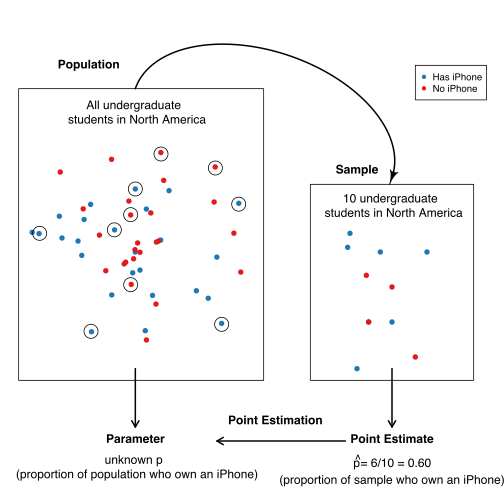
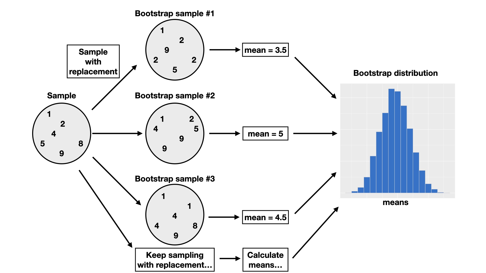

# Introduction to Statistical Inference {#inference}

```{r 11-setup, include= F}
knitr::opts_chunk$set(warning = FALSE)
library(gridExtra)
library(tidyverse)
require(grid) #  grid.bezier()

options(digits = 3) # set number of digits to display in output to match writing

max_count <- function(dist) {
  max(ggplot_build(dist)$data[[1]]$count)
}

max_x <- function(dist) {
  max(ggplot_build(dist)$data[[1]]$xmax)
}

min_x <- function(dist) {
  ggp_data <- ggplot_build(dist)
  min(ggp_data$data[[1]]$xmin)
}
```


## Overview
A typical data analysis task in practice is to draw conclusions about some unknown
aspect of a population of interest based on observed data sampled from that
population; we typically do not get data on the *entire* population.
Data analysis questions regarding how summaries, 
patterns, trends, or relationships in a data set 
extend to the wider population are called *inferential questions*. This chapter will start
with the fundamental ideas of sampling from populations and then introduce two common techniques in statistical inference: *point estimation* and
*interval estimation*. 

## Chapter learning objectives 
By the end of the chapter, students will be able to:

* Describe real-world examples of questions that can be answered with the statistical inference.
* Define common population parameters (e.g. mean, proportion, standard deviation) that are often estimated using sampled data, and estimate these from a sample.
* Define the following statistical sampling terms (population, sample, population parameter, point estimate, sampling distribution).
* Explain the difference between a population parameter and a sample point estimate.
* Use R to draw random samples from a finite population.
* Use R to create a sampling distribution from a finite population.
* Describe how sample size influences the sampling distribution.
* Define bootstrapping.
* Use R to create a bootstrap distribution to approximate a sampling distribution.
* Contrast the bootstrap and sampling distributions.

## Why do we need sampling? 
Statistical inference can help us decide how quantities we observe in
a subset of data relate to the same quantities in the broader
population. Suppose a retailer is considering selling iPhone accessories, and they want to estimate how big the market might be. Additionally, they want to strategize how they can market their products on North American college and university campuses. This retailer might use statistical inference to answer the question: 

*What proportion of all undergraduate students in North America own an iPhone?*

In the above question, we are interested in making a conclusion about *all*
undergraduate students in North America; this is our **population**.
In general, the population is the complete collection of individuals or cases we are interested in studying. 
Further, in the above question, we are interested in computing a quantity&mdash;the proportion
of iPhone owners&mdash;based on the entire population. This proportion is our **population parameter**.
In general, a population parameter is a numerical characteristic
of the entire population. To compute this number in the example above, we would need to ask 
every single undergraduate in North America whether they own an iPhone. In practice,
directly computing population parameters is often time-consuming and costly, and sometimes impossible. 

A more practical approach would be to collect measurements for a **sample**: a subset of
individuals collected from the population. We can then compute a **sample estimate**&mdash;a numerical
characteristic of the sample&mdash;that estimates the population parameter. For example, suppose we randomly selected ten undergraduate students across North America (the sample) and computed the proportion of those
students who own an iPhone (the sample estimate). In that case, we might suspect that that proportion is a reasonable estimate of the proportion of students who own an iPhone in the entire population. 

```{r 11-population-vs-sample, echo = FALSE, message = FALSE, warning = FALSE, fig.cap = "Population versus sample", fig.retina = 2}

```

</center>

Note that proportions are not the *only* kind of population parameter we might be interested in. Suppose an undergraduate student studying at the University of British Columbia in Vancouver, British Columbia, is looking for an apartment to rent. They need to create a budget, so they want to know something about studio apartment rental prices in Vancouver, BC. This student might use statistical inference to tackle the question:

*What is the average price-per-month of studio apartment rentals in Vancouver, Canada?*

The population consists of all studio apartment rentals in Vancouver, and the population parameter is the *average price-per-month*. Here we used the average as a measure of center to describe the "typical value" of studio apartment rental prices. But even within this one example, we could also be interested in many other population parameters. For instance, we know that not every studio apartment rental in Vancouver will have the same price-per-month. The student might be interested in how much monthly prices vary and want to find a measure of the rentals' spread (or variability), such as the standard deviation. The student might be interested in the fraction of studio apartment rentals that cost more than \$1000 per month. The question we want to answer will help us determine the parameter we want to estimate. If we were somehow able to observe the whole population of studio apartment rental offerings in Vancouver, we could compute each of these numbers exactly; therefore, these are all population parameters. There are many kinds of observations and population parameters that you will run into in practice, but in this chapter, we will focus on two settings:

1. Using categorical observations to estimate the proportion of a category
2. Using quantitative observations to estimate the average (or mean)

## Sampling distributions

### Sampling distributions for proportions
We will look at an example using data from [Inside Airbnb](http://insideAirbnb.com/) [@insideairbnb]. Airbnb is an online marketplace for arranging vacation rentals and places to stay. The data set, `airbnb`, contains listings for Vancouver, Canada, in September 2020. Our data includes an ID number, neighbourhood, type of room, the number of people the rental accommodates, number of bathrooms, bedrooms, beds, and the price per night. 

```{r 11-example-means1, echo = FALSE, message = FALSE, warning = FALSE}
airbnb <- read_csv("data/listings.csv") %>%
  select(id, neighbourhood = neighbourhood_cleansed, room_type, accommodates, bathrooms = bathrooms_text, bedrooms, beds, price) %>%
  mutate(price = as.numeric(str_remove(price, "[$]"))) %>%
  na.omit()
airbnb <- airbnb %>%
  mutate(id = 1:nrow(airbnb))
```


```{r}
airbnb
```
Suppose the city of Vancouver wants information about Airbnb rentals to help plan city bylaws, and they want to know how many Airbnb places are listed as entire homes and apartments (rather than as private or shared rooms). Therefore they may want to estimate the true proportion of all Airbnb listings where the "type of place" is listed as "entire home or apartment." Of course, we usually do not have access to the true population, but here let's imagine (for learning purposes) that our data set represents the population of all Airbnb rental listings in Vancouver, Canada. We can find the proportion of listings where `room_type == "Entire home/apt"`.

```{r 11-example-proportions2, echo = TRUE, message = FALSE, warning = FALSE }
library(tidyverse)
library(infer)

airbnb %>%
  summarize(
    n =  sum(room_type == "Entire home/apt"),
    proportion = sum(room_type == "Entire home/apt") / nrow(airbnb)
  )
```

```{r 11-population-parameter, echo = F}
population_proportion <- airbnb %>%
  summarize(
    n =  sum(room_type == "Entire home/apt"),
    proportion = sum(room_type == "Entire home/apt") / nrow(airbnb)
  ) %>% 
  pull()
```


From our data, we can see that the proportion of `Entire home/apt` listings in the data set is `r round(population_proportion,3)`. This value, `r round(population_proportion,3)`, is the population parameter. Remember, this parameter value is usually unknown in real data analysis problems. Therefore normally, we can't compute it.  Instead, perhaps we can approximate it with a small set of data.

Let's see what would happen if we were to randomly select 40 listings and count the number of entire home/apartment listings (*i.e.,* take a random sample of size 40 from our population). Let's use R to simulate this using our `airbnb` population. We can do this using the `rep_sample_n` function from the `infer` package. The arguments of `rep_sample_n` are (1) the data frame (or tibble) to sample from, and (2) the size of the sample to take.

```{r 11-example-proportions3, echo = TRUE, message = FALSE, warning = FALSE}
set.seed(123)
sample_1 <- rep_sample_n(tbl = airbnb, size = 40)
airbnb_sample_1 <- summarize(sample_1,
  n = sum(room_type == "Entire home/apt"),
  prop = sum(room_type == "Entire home/apt") / 40
)
airbnb_sample_1
```

Here we see that the proportion of entire home/apartment listings in this random sample is
`r round(airbnb_sample_1$prop,2)`. Wow, that's close to our true population value! But remember, we just used a random sample of 40 so this value is an *estimate* &mdash; our best guess of our population parameter using this sample. Given that it is a single
value that we are estimating, we often refer to it as a **point estimate**.
The keyword there is *random* -- if we were to take another random sample of 40 listings from the population, we wouldn't get the same answer:

```{r 11-example-proportions4, echo = TRUE, message = FALSE, warning = FALSE}
set.seed(1234)
sample_2 <- rep_sample_n(airbnb, size = 40)
airbnb_sample_2 <- summarize(sample_2,
  n = sum(room_type == "Entire home/apt"),
  prop = sum(room_type == "Entire home/apt") / 40
)
airbnb_sample_2
```

Confirmed! We get a different value for our estimate this time so that means that our point estimate might be unreliable!  Estimates vary from sample to sample 
due to **sampling variability**.  So if we were to do this again, another random sample could also give a different result.

But just how much should we expect the estimates of our random
samples to vary? To understand this, we will simulate taking many samples (rather than just two)
of size 40 from our population of listings and calculate the 
proportion of entire home/apartment listings in each sample. From this simulation, will get many sample proportions, which we can visualize on a histogram. The distribution
of the estimate for all possible samples of a given size (which we commonly refer to as $n$) from a population is
called a **sampling distribution**. The sampling distribution will help us see
how much we would expect our sample proportions from this population to vary
for samples of size 40. 

Below we again use the `rep_sample_n` to take samples
of size 40 from our population of Airbnb listings, but we set the `reps` argument
to specify the number of samples to take, here 20,000. We will use the function `tail()` to see the last few rows of our `samples` data frame.

```{r 11-example-proportions5, echo = TRUE, message = FALSE, warning = FALSE}
samples <- rep_sample_n(airbnb, size = 40, reps = 20000)
samples
tail(samples)
```

Notice the column `replicate` indicates the replicate, or sample, with which each
listing belongs. Since we took 20,000 samples of size 40, there are 20,000 replicates.
Now that we have taken 20,000 samples, to create a sampling distribution of sample proportions for samples of size 40, we need to calculate the proportion of entire home/apartment listings for each sample:
```{r 11-example-proportions6, echo = TRUE, message = FALSE, warning = FALSE}
sample_estimates <- samples %>%
  group_by(replicate) %>%
  summarise(sample_proportion = sum(room_type == "Entire home/apt") / 40)
sample_estimates
tail(sample_estimates)
```

We calculated the proportion of entire home/apartment listings for each sample to visualize the sampling distribution of sample proportions for samples of size 40. Remember, in the real world, since we don't have the population, we can't actually construct the sampling distribution, but in this example, we do have it so we can actually visualize it directly.

```{r 11-example-proportions7, echo = TRUE, message = FALSE, warning = FALSE,fig.cap = "Sampling distribution of the sample proportion for sample size 40", out.width = "60%"}
sampling_distribution <- ggplot(sample_estimates, aes(x = sample_proportion)) +
  geom_histogram(fill = "dodgerblue3", color = "lightgrey", bins = 12) +
  xlab("Sample proportions")
sampling_distribution
```

The sampling distribution in Figure \@ref(fig:11-example-proportions7) appears to be bell-shaped with one peak. It is
centered around `r round(mean(sample_estimates$sample_proportion),1)` and the
sample proportions range from about `r round(min(sample_estimates$sample_proportion), 1)` to 
about `r round(max(sample_estimates$sample_proportion), 1)`. In fact, we can calculate
the mean of the sample proportions. 

```{r 11-example-proportions8, echo = TRUE, message = FALSE, warning = FALSE}
sample_estimates %>%
  summarise(mean = mean(sample_proportion))
```

We notice that the sample proportions are centred around the population proportion value, `r round(population_proportion,3)`! In general, the mean of the distribution of $\hat{p}$ should be equal to $p$, which is good because that means the sample proportion is neither an overestimate nor an underestimate of the population proportion. Any *individual* sample may give you a 
sample proportion that is larger or smaller than the population proportion, but when we repeat the sampling process many times (as we did in this example), there is no tendency towards over or underestimating. 

<!--- > **Note:** If random samples of size $n$ are taken from a population, $\hat{p}$ will be approximately Normal with mean $p$ and standard deviation $\sqrt{\frac{p(1-p)}{n}}$ as long as the sample size $n$ is large enough such that $np$ and $n(1 - p)$ are at least 10, where $p$ is the population proportion, $\hat{p}$ is the sample proportion and $n$ is the sample size. 
--->

### Sampling distributions for means 

In the previous section, our variable of interest&mdash; `room_type` &mdash;was
*categorical*, and the population parameter was a proportion. As mentioned in the chapter introduction, there are many choices of the population parameter for each type of variable. What if we wanted to infer something about a population of *quantitative* variables instead? For instance, a traveller visiting Vancouver, BC, may wish to know about the prices of staying somewhere using Airbnb. Particularly, they might be interested in estimating the population mean price per night of Airbnb listings in Vancouver, BC. Knowing the average
could help them tell whether a particular listing is overpriced.
Let's look at the case where we are interested in the population mean of a quantitative variable.

We can visualize the population distribution of the price per night with a histogram. 
```{r, echo = F}
options(pillar.sigfig = 5)
```
```{r 11-example-means2, echo = TRUE, message = FALSE, warning = FALSE, fig.cap = "Population distribution of price per night ($) for all Airbnb listings in Vancouver, Canada", out.width = "60%"}
population_distribution <- ggplot(airbnb, aes(x = price)) +
  geom_histogram(fill = "dodgerblue3", color = "lightgrey") +
  xlab("Price per night ($)")
population_distribution
```
From Figure \@ref(fig:11-example-means2), we see that the population distribution has one peak and is skewed (i.e. not symmetric) since most of the listings
are less than \$250 per night, but a small proportion of listings cost more
than that, creating a long tail on the histogram's right side. 

Along with visualizing the population, we can calculate the population mean, the average price per night for all the Airbnb listings. 
```{r 11-example-means-popmean, echo = TRUE, message = FALSE, warning = FALSE}
population_parameters <- airbnb %>%
  summarize(pop_mean = mean(price))
population_parameters
```
The price per night of all Airbnb rentals in Vancouver, BC is \$`r round(population_parameters$pop_mean,2)`, on average. This value is our **population parameter** since we are calculating it using the population data. 

Suppose we did not have access to the population data (which is usually the case!), yet we wanted to estimate the mean price per night. We could answer this question by taking a random sample of as many Airbnb listings as our time and resources allow. Let's say we could do this for 40 listings. What would such a sample look like?

Let's take advantage of the fact that we do have access to the population data and simulate taking one random sample of 40 listings in R, again using `rep_sample_n`. 

```{r 11-example-means3, echo = TRUE, message = FALSE, warning = FALSE}
one_sample <- airbnb %>%
  rep_sample_n(40)
```

We can create a histogram to visualize the distribution of observations in the sample (Figure \@ref(fig:11-example-means-sample-hist)), and calculate the mean of our sample.

```{r 11-example-means-sample-hist, echo = TRUE, message = FALSE, warning = FALSE, fig.cap = "Distribution of price per night ($) for sample of 40 Airbnb listings", out.width = "60%"}
sample_distribution <- ggplot(one_sample, aes(price)) +
  geom_histogram(fill = "dodgerblue3", color = "lightgrey") +
  xlab("Price per night ($)")
sample_distribution
estimates <- one_sample %>%
  summarize(sample_mean = mean(price))
estimates
```

From the sample of 40, the average is \$`r round(estimates$sample_mean, 2)`.
This number is a **point estimate** for the mean of the full population.
Recall that the population mean 
was \$`r round(population_parameters$pop_mean,2)`. So our estimate was fairly close to the population parameter: the mean was 
about `r round(100*abs(estimates$sample_mean - population_parameters$pop_mean)/population_parameters$pop_mean, 1)`% off.
Note that we usually cannot compute the estimate's accuracy in practice since we do not have access to the population parameter; if we did, we wouldn't need to estimate it!

Also, recall from the previous section that the point estimate can vary; if we took another random sample from the population, our estimate's value might change. So then, did we just get lucky with our point estimate above?
How much does our estimate vary across different samples of size 40 in this example? Again, since we have access to the population,
we can take many samples and plot the **sampling distribution** of sample means for samples of size 40 to get a sense
for this variation. In this case, we'll use 20,000 samples of size 40.

```{r}
samples <- rep_sample_n(airbnb, size = 40, reps = 20000)
samples
```

Now we can calculate the sample mean for each replicate and plot the sampling distribution of sample means for samples of size 40.
```{r 11-example-means4, echo = TRUE, message = FALSE, warning = FALSE, fig.cap= "Sampling distribution of the sample means for sample size of 40",out.width = "60%"}
sample_estimates <- samples %>%
  group_by(replicate) %>%
  summarise(sample_mean = mean(price))
sample_estimates

sampling_distribution_40 <- ggplot(sample_estimates, aes(x = sample_mean)) +
  geom_histogram(fill = "dodgerblue3", color = "lightgrey") +
  xlab("Sample mean price per night ($)")
sampling_distribution_40
```


In Figure \@ref(fig:11-example-means4), the sampling distribution of the mean has one peak and is
bell-shaped. Most of the estimates are between 
about  \$`r round(quantile(sample_estimates$sample_mean)[2], -1)` and 
\$`r round(quantile(sample_estimates$sample_mean)[4], -1)`; but there are
a good fraction of cases outside this range (i.e., where the point estimate
was not close to the population parameter). So it does indeed look like we were quite lucky
when we estimated the population mean 
with only `r round(100*abs(estimates$sample_mean - population_parameters$pop_mean)/population_parameters$pop_mean, 1)`% error.

Let's visualize the population
distribution, distribution of the sample, and the sampling distribution on one 
plot to compare them in Figure \@ref(fig:11-example-means5). Comparing these three distributions, the centers of the distributions are all around the same price (around \$150). The
original population distribution has a long right tail, and the sample distribution has a similar shape to that of the population distribution. However, the sampling distribution is not shaped like the population or sample distribution. Instead, it has a bell shape, and it has a lower spread than the population or sample distributions. The sample means vary less than the individual observations because there will be some high values and some small values in any random sample, which will keep the average from being too extreme. 

<!---
```{r 11-example-means4.5}
sample_estimates %>%
  summarise(mean_of_sample_means = mean(sample_mean))
```
Notice that the mean of the sample means is \$`r round(mean(sample_estimates$sample_mean),2)`. Recall that the population mean
was \$`r round(mean(airbnb$price),2)`. 
-->

```{r 11-example-means5, echo = FALSE, message = FALSE, warning = FALSE, fig.cap = "Comparision of population distribution, sample distribution and sampling distribution", out.width = "70%"}
grid.arrange(population_distribution +
  ggtitle("Population") +
  xlim(min(airbnb$price), 600),
sample_distribution +
  ggtitle("Sample (n = 40)") +
  xlim(min(airbnb$price), 600),
sampling_distribution_40 +
  ggtitle("Sampling distribution of the mean for samples of size 40") +
  xlim(min(airbnb$price), 600),
nrow = 3
)
```

Given that there is quite a bit of variation in the sampling distribution of the sample mean&mdash;i.e., 
the point estimate that we obtain is not very reliable&mdash;is there any way to improve the estimate?
One way to improve a point estimate is to take a *larger* sample. To illustrate what effect this has, we will take many samples of size 20, 50, 100, and 500, and plot the sampling distribution of the sample mean.

```{r 11-example-means6, echo = FALSE, message = FALSE, warning = FALSE}
## Sampling n = 20, 50, 100, 500
sample_estimates_20 <- rep_sample_n(airbnb, size = 20, reps = 20000) %>%
  group_by(replicate) %>%
  summarise(sample_mean = mean(price))

sample_estimates_50 <- rep_sample_n(airbnb, size = 50, reps = 20000) %>%
  group_by(replicate) %>%
  summarise(sample_mean = mean(price))

sample_estimates_100 <- rep_sample_n(airbnb, size = 100, reps = 20000) %>%
  group_by(replicate) %>%
  summarise(sample_mean = mean(price))

sample_estimates_500 <- rep_sample_n(airbnb, size = 500, reps = 20000) %>%
  group_by(replicate) %>%
  summarise(sample_mean = mean(price))

## Sampling distribution n = 20
sampling_distribution_20 <- ggplot(sample_estimates_20, aes(x = sample_mean)) +
  geom_histogram(fill = "dodgerblue3", color = "lightgrey") +
  xlab("Sample mean price per night($)") +
  ggtitle("n = 20") 

## Sampling distribution n = 50
sampling_distribution_50 <- ggplot(sample_estimates_50, aes(x = sample_mean)) +
  geom_histogram(fill = "dodgerblue3", color = "lightgrey") +
  xlab("Sample mean price per night($)") +
  ggtitle("n = 50") +
  xlim(min_x(sampling_distribution_20), max_x(sampling_distribution_20))

## Sampling distribution n = 100
sampling_distribution_100 <- ggplot(sample_estimates_100, aes(x = sample_mean)) +
  geom_histogram(fill = "dodgerblue3", color = "lightgrey") +
  xlab("Sample mean price per night ($)") +
  ggtitle("n = 100") +
  xlim(min_x(sampling_distribution_20), max_x(sampling_distribution_20))

## Sampling distribution n = 500
sampling_distribution_500 <- ggplot(sample_estimates_500, aes(x = sample_mean)) +
  geom_histogram(fill = "dodgerblue3", color = "lightgrey") +
  xlab("Sample mean price per night ($)") +
  ggtitle("n = 500") +
  xlim(min_x(sampling_distribution_20), max_x(sampling_distribution_20))
```

```{r 11-example-means7,  echo = FALSE, message = FALSE, warning = FALSE, fig.cap = "Comparision of sampling distributions"}
annotated_sampling_dist_20 <- sampling_distribution_20 +
  geom_vline(xintercept = mean(sample_estimates$sample_mean), col = "red") +
  xlim(min_x(sampling_distribution_20), max_x(sampling_distribution_20)) +
  ggtitle("n = 20") +
  annotate("text",
    x = max_x(sampling_distribution_20), y = max_count(sampling_distribution_20), hjust = 1, vjust = 1,
    label = paste("mean = ", round(mean(sample_estimates$sample_mean), 2))
  )
#+
#    annotate("text", x =  max_x(sampling_distribution_20), y = max_count(sampling_distribution_20), hjust = 1, vjust = 3,
#               label = paste("sd = ", round(sd(sample_estimates$sample_mean), 1)))

annotated_sampling_dist_50 <- sampling_distribution_50 +
  geom_vline(xintercept = mean(sample_estimates_50$sample_mean), col = "red") +
  ## x limits set the same as n = 20 graph, y is this graph
  annotate("text",
    x = max_x(sampling_distribution_20), y = max_count(sampling_distribution_50), hjust = 1, vjust = 1,
    label = paste("mean = ", round(mean(sample_estimates_50$sample_mean), 2))
  ) #+
# annotate("text", x =  max_x(sampling_distribution_20), y = max_count(sampling_distribution_50), hjust = 1, vjust = 3,
#                 label = paste("sd = ", round(sd(sample_estimates_50$sample_mean), 1)))

annotated_sampling_dist_100 <- sampling_distribution_100 +
  geom_vline(xintercept = mean(sample_estimates_100$sample_mean), col = "red") +
  annotate("text",
    x = max_x(sampling_distribution_20), y = max_count(sampling_distribution_100), hjust = 1, vjust = 1,
    label = paste("mean = ", round(mean(sample_estimates_100$sample_mean), 2))
  ) #+
#    annotate("text", x =  max_x(sampling_distribution_20), y = max_count(sampling_distribution_100), hjust = 1, vjust = 3,
#               label = paste("sd = ", round(sd(sample_estimates_100$sample_mean), 1)))

annotated_sampling_dist_500 <- sampling_distribution_500 +
  geom_vline(xintercept = mean(sample_estimates_500$sample_mean), col = "red") +
  annotate("text",
    x = max_x(sampling_distribution_20), y = max_count(sampling_distribution_500), hjust = 1, vjust = 1,
    label = paste("mean = ", round(mean(sample_estimates_500$sample_mean), 2))
  ) #+
#    annotate("text", x =  max_x(sampling_distribution_20), y = max_count(sampling_distribution_500), hjust = 1, vjust = 3,
#               label = paste("sd = ", round(sd(sample_estimates_500$sample_mean), 1)))

grid.arrange(annotated_sampling_dist_20,
  annotated_sampling_dist_50,
  annotated_sampling_dist_100,
  annotated_sampling_dist_500,
  nrow = 2, ncol = 2
)
```

Based on the visualization in Figure \@ref(fig:11-example-means7), two points about the sample mean become clear.
First, the
mean of the sample mean (across samples) is equal to the population mean. In other words, 
the sampling distribution is centred at the population mean.
Second, increasing the size of the sample
decreases the spread (i.e., the variability) of the sampling distribution. Therefore, a larger sample size results
in a more reliable point estimate of the population parameter.


<!--- > **Note:** If random samples of size $n$ are taken from a population, the sample mean $\bar{x}$ will be approximately Normal with mean $\mu$ and standard deviation $\frac{\sigma}{\sqrt{n}}$ as long as the sample size $n$ is large enough. $\mu$ is the population mean, $\sigma$ is the population standard deviation, $\bar{x}$ is the sample mean, and $n$ is the sample size. 
> If samples are selected from a finite population as we are doing in this chapter, we should apply a finite population correction. We multiply $\frac{\sigma}{\sqrt{n}}$ by $\sqrt{\frac{N - n}{N - 1}}$ where $N$ is the population size and $n$ is the sample size. If our sample size, $n$, is small relative to the population size, this finite correction factor is less important. 
---> 

### Summary
1. A *point estimate* is a single value computed using a sample from a population (e.g. a mean or proportion)
2. The *sampling distribution* of an estimate is the distribution of the estimate for all possible samples of a fixed size from the same population.
3. The sample means and proportions calculated from samples are centred around the population mean and proportion, respectively.
4. The spread of the sampling distribution is related to the sample size. As the sample size increases, the spread of the sampling distribution decreases. 
5. The shape of the sampling distribution is usually bell-shaped with one peak and centred at the population mean or proportion.

## Bootstrapping 
### Overview 

*Why all this emphasis on sampling distributions?*


We saw in the previous section that we could compute a **point estimate** of a population
parameter using a sample of observations from the population. And since we had access to the
population, we could evaluate how accurate the estimate was, and even get a sense of how much
the estimate would vary for different samples from the population. 
But in real data analysis settings, we usually have *just one sample* from our population and do not have access to the population itself. Therefore we cannot construct the sampling distribution as we did in the previous section. As we saw, our sample estimate's value will likely not equal the population parameter value exactly. We saw from the sampling distribution just how much our estimates can vary. So reporting a single *point estimate* for the population parameter alone may not be enough. Using simulations, we can see patterns of the sample estimate's sampling distribution would look like for a sample of a given size. We can use these patterns to approximate the sampling distribution when we only have one sample, which is the realistic case. If we can "predict" what the sampling distribution would look like for a sample, we could construct a range of values we think the population parameter's value might lie. We can use our single sample and its properties that influence sampling distributions, such as the spread and sample size, to approximate the sampling distribution as best as we can. There are several methods to do this; however, in this book, we will use the bootstrap method to do this, as we will see in this section.

We will discuss **interval estimation** and construct **confidence intervals** using just a single sample from a population. A confidence interval is a range of plausible values for our population parameter. 

Here is the key idea. First, if you take a big enough sample, it *looks like* the population. Notice the histograms' shapes for samples of different sizes taken from the population in Figure \@ref(fig:11-example-bootstrapping0). We see that the sample’s distribution looks like that of the population for a large enough sample.


```{r 11-example-bootstrapping0, echo = FALSE, message = FALSE, warning = FALSE, fig.cap = "Comparision of samples of different sizes from the population"}

sample_10 <- airbnb %>%
  rep_sample_n(10)
sample_distribution_10 <- ggplot(sample_10, aes(price)) +
  geom_histogram(fill = "dodgerblue3", color = "lightgrey") +
  xlab("Price per night ($)") +
  ggtitle("n = 10")

sample_20 <- airbnb %>%
  rep_sample_n(20)
sample_distribution_20 <- ggplot(sample_20, aes(price)) +
  geom_histogram(fill = "dodgerblue3", color = "lightgrey") +
  xlab("Price per night ($)") +
  ggtitle("n = 20")
sample_50 <- airbnb %>%
  rep_sample_n(50)
sample_distribution_50 <- ggplot(sample_50, aes(price)) +
  geom_histogram(fill = "dodgerblue3", color = "lightgrey") +
  xlab("Price per night ($)") +
  ggtitle("n = 50")
sample_100 <- airbnb %>%
  rep_sample_n(100)
sample_distribution_100 <- ggplot(sample_100, aes(price)) +
  geom_histogram(fill = "dodgerblue3", color = "lightgrey") +
  xlab("Price per night ($)") +
  ggtitle("n = 100")

sample_200 <- airbnb %>%
  rep_sample_n(200)
sample_distribution_200 <- ggplot(sample_200, aes(price)) +
  geom_histogram(fill = "dodgerblue3", color = "lightgrey") +
  xlab("Price per night ($)") +
  ggtitle("n = 200")

grid.arrange(sample_distribution_10 + xlim(min(airbnb$price), 600),
  sample_distribution_20 + xlim(min(airbnb$price), 600),
  sample_distribution_50 + xlim(min(airbnb$price), 600),
  sample_distribution_100 + xlim(min(airbnb$price), 600),
  sample_distribution_200 + xlim(min(airbnb$price), 600),
  population_distribution + ggtitle("Population distribution") + xlim(min(airbnb$price), 600),
  ncol = 2
)
# widths = c(2, 3),
# layout_matrix =  rbind(c(1, 2),
#   c(1, 3),
#  c(1, 4),
#  c(1, 5)))
```

In the previous section, we took many samples of the same size *from our population* to get
a sense of the variability of a sample estimate. But if our sample is big enough that it looks like our population,
we can pretend that our sample *is* the population, and take more samples (with replacement) of the same size
from it instead! This very clever technique is called **the bootstrap**.
Note that by taking many samples from our single, observed sample, we do not obtain the true sampling distribution,
but rather an approximation that we call **the bootstrap distribution**. 

> Note that we need to sample *with* replacement when using the bootstrap. Otherwise, if we had a sample of size $n$,
> and obtained a sample from it of size $n$ *without* replacement, it would just return our original sample.

This section will explore how to create a bootstrap distribution from a single sample using R.
For a sample of size $n$, the process we will go through is as follows: 

1. Randomly select an observation from the original sample, which was drawn from the population
2. Record the observation's value 
3. Replace that observation
4. Repeat steps 1 - 3 (sampling *with* replacement) until you have $n$ observations, which form a bootstrap sample
5. Calculate the bootstrap point estimate (e.g., mean, median, proportion, slope, etc.) of the $n$ observations in your bootstrap sample
6. Repeat steps (1) - (5) many times to create a distribution of point estimates (the bootstrap distribution)
7. Calculate the plausible range of values around our observed point estimate

```{r 11-intro-bootstrap-image, echo = FALSE, message = FALSE, warning = FALSE, fig.cap = "Overview of the bootstrap process", fig.retina = 2, out.width="880"}

```
### Bootstrapping in R 
Let’s continue working with our Airbnb data. Once again, let’s say we are interested in estimating the population mean price per night of all Airbnb listings in Vancouver, Canada, using the single sample we collected of size 40. Recall our point estimate was \$`r round(estimates$sample_mean, 2)`, and the distribution of the sample is displayed in Figure \@ref(fig:11-bootstrapping1).

```{r, echo = F, message = F, warning = F}
one_sample <- one_sample %>% 
  ungroup() %>% select(-replicate)
```

```{r 11-bootstrapping1, echo = TRUE, message = FALSE, warning = FALSE, fig.cap = "Histogram of price per night ($) for one sample of size 40", out.width = "60%"}
one_sample
one_sample_dist <- ggplot(one_sample, aes(price)) +
  geom_histogram(fill = "dodgerblue3", color = "lightgrey") +
  xlab("Price per night ($)")
one_sample_dist
```

The sample distribution is skewed with a few observations out to the right. The
mean of the sample is \$`r round(estimates$sample_mean, 2)`.
Remember, in practice, we usually only have one sample from the population. So
this sample and estimate are the only data we can work with.

We now perform steps (1) - (5) listed above to generate a single bootstrap sample in R using the
sample we just took, and calculate the bootstrap estimate for that sample. We
will use the `rep_sample_n` function as we did when we were creating our
sampling distribution. Since we want to sample with replacement, we change the
argument for `replace` from its default value of `FALSE` to `TRUE`.

```{r 11-bootstrapping3, echo = TRUE, message = FALSE, warning = FALSE, fig.cap = "Bootstrap distribution", out.width = "60%"}
boot1 <- one_sample %>%
  rep_sample_n(size = 40, replace = TRUE, reps = 1)
boot1_dist <- ggplot(boot1, aes(price)) +
  geom_histogram(fill = "dodgerblue3", color = "lightgrey") +
  xlab("Price per night ($)")

boot1_dist

summarise(boot1, mean = mean(price))
```

Notice in Figure \@ref(fig:11-bootstrapping3) that our bootstrap distribution has a similar shape to the original
sample distribution. Though the shapes of the distributions are similar, they
are not identical. You'll also notice that the original sample mean and the
bootstrap sample mean differ. How might that happen? Remember that we are
sampling with replacement from the original sample, so we don't end up with the
same sample values again. We are trying to mimic drawing another sample from
the population without actually having to do that.

Let's now take 20,000 bootstrap samples from the original sample we drew from the
population (`one_sample`)  using `rep_sample_n` and calculate the means for
each of those replicates. Recall that this assumes that `one_sample` *looks like*
our original population; but since we do not have access to the population itself,
this is often the best we can do.

```{r 11-bootstrapping4, echo = TRUE, message = FALSE, warning = FALSE}
boot20000 <- one_sample %>%
  rep_sample_n(size = 40, replace = TRUE, reps = 20000)
boot20000
tail(boot20000)
```

Let's take a look at histograms of the first six replicates of our bootstrap samples.
```{r 11-bootstrapping-six-bootstrap-samples, echo = TRUE, message = FALSE, warning = FALSE, fig.cap = "Histograms of first six replicates of bootstrap samples"}
six_bootstrap_samples <- boot20000 %>%
  filter(replicate <= 6)
ggplot(six_bootstrap_samples, aes(price)) +
  geom_histogram(fill = "dodgerblue3", color = "lightgrey") +
  xlab("Price per night ($)") +
  facet_wrap(~replicate)
```

We see in Figure \@ref(fig:11-bootstrapping-six-bootstrap-samples) how the bootstrap samples differ. We can also calculate the sample mean for each of these six replicates. 
```{r 11-bootstrapping-six-bootstrap-samples-means, echo = TRUE, message = FALSE, warning = FALSE}
six_bootstrap_samples %>%
  group_by(replicate) %>%
  summarize(mean = mean(price))
```

We can see that the bootstrap sample distributions and the sample means are different. They are different because we are sampling *with replacement*. We will now calculate point estimates for our 20,000 bootstrap samples and generate a bootstrap distribution of our point estimates. The bootstrap distribution suggests how we might expect our point estimate to behave if we took another sample.

```{r 11-bootstrapping5, echo = TRUE, message = FALSE, warning = FALSE, fig.cap = "Distribution of the bootstrap sample means"}
boot20000_means <- boot20000 %>%
  group_by(replicate) %>%
  summarize(mean = mean(price))
boot20000_means
tail(boot20000_means)
boot_est_dist <- ggplot(boot20000_means, aes(x = mean)) +
  geom_histogram(fill = "dodgerblue3", color = "lightgrey") +
  xlab("Sample mean price per night ($)")
boot_est_dist
```

Let's compare our bootstrap distribution with the true sampling distribution (taking many samples from the population). 

```{r 11-bootstrapping6, echo = F, message = FALSE, warning = FALSE, fig.cap = "Comparison of distribution of the bootstrap sample means and sampling distribution", out.height="50%"}

samples <- rep_sample_n(airbnb, size = 40, reps = 20000)

sample_estimates <- samples %>%
  group_by(replicate) %>%
  summarise(sample_mean = mean(price))

sampling_dist <- ggplot(sample_estimates, aes(x = sample_mean)) +
  geom_histogram(fill = "dodgerblue3", color = "lightgrey") +
  xlab("Sample mean price per night ($)")

minimum_x <- min_x(sampling_dist)
maximum_x <- max_x(boot_est_dist)

sampling_dist <- sampling_dist + 
  annotate("text",
    x = max_x(sampling_dist), y = 2500, hjust = 1, vjust = 1,
    label = paste("mean = ", round(mean(sample_estimates$sample_mean), 2))
  ) +
  geom_vline(xintercept = mean(sample_estimates$sample_mean), col = "red") + 
  xlim(minimum_x, maximum_x) +
  ylim(0, 2500) 

annotated_boot_est_dist <- boot_est_dist +
  annotate("text",
    x = max_x(boot_est_dist), 2500, hjust = 1, vjust = 1,
    label = paste("mean = ", round(mean(boot20000_means$mean), 2))
  ) +
  geom_vline(xintercept = mean(boot20000_means$mean), col = "red")

grid.arrange(sampling_dist +
               ggtitle("Sampling distribution"),
  annotated_boot_est_dist + xlim(min_x(sampling_dist), max_x(boot_est_dist)) + ggtitle("Bootstrap distribution") + ylim(0, 2500),
  ncol = 2
)
```

There are two essential points that we can take away from Figure \@ref(fig:11-bootstrapping6). First, the shape and spread of the true sampling distribution and the bootstrap distribution are similar; the bootstrap distribution lets us get a sense of the point estimate's variability. The second important point is that the means of these two distributions are different. The sampling distribution is centred at \$`r round(mean(airbnb$price),2)`, the population mean value. However, the bootstrap distribution is centred at the original sample's mean price per night, \$`r round(mean(boot20000_means$mean), 2)`. Because we are resampling from the original sample repeatedly, we see that the bootstrap distribution is centred at the original sample's mean value (unlike the sampling distribution of the sample mean, which is centred at the population parameter value). Figure \@ref(fig:11-bootstrapping7) summarizes the bootstrapping process.

The idea here is that we can use this distribution of bootstrap sample means to approximate the sampling distribution of the sample means when we only have one sample. Since the bootstrap distribution pretty well approximates the sampling distribution spread, we can use the bootstrap spread to help us develop a plausible range for our population parameter along with our estimate!

```{r 11-bootstrapping7, echo = F, message = FALSE, warning = FALSE, fig.cap = "Summary of bootstrapping process"}
pop_dist <- population_distribution + ggtitle("Population") + xlab("Price") +
  theme(
    axis.ticks.x = element_blank(),
    axis.text.x = element_blank(),
    axis.title.y = element_blank(),
    axis.ticks.y = element_blank(),
    axis.text.y = element_blank()
  )

sam_dist <- one_sample_dist + ggtitle("Sample") + xlab("Price") +
  theme(
    axis.ticks.x = element_blank(),
    axis.text.x = element_blank(),
    axis.title.y = element_blank(),
    axis.ticks.y = element_blank(),
    axis.text.y = element_blank()
  )
set.seed(2)
boot2 <- one_sample %>%
  rep_sample_n(size = 40, replace = TRUE, reps = 1)

set.seed(3)
boot3 <- one_sample %>%
  rep_sample_n(size = 40, replace = TRUE, reps = 1)

boot1_dist <- boot1_dist + ggtitle("Samples with Replacement") +
  theme(
    axis.title.x = element_blank(),
    axis.ticks.x = element_blank(),
    axis.text.x = element_blank(),
    axis.title.y = element_blank(),
    axis.ticks.y = element_blank(),
    axis.text.y = element_blank()
  )

boot2_dist <- ggplot(boot2, aes(price)) +
  geom_histogram(fill = "dodgerblue3", color = "lightgrey") +
  theme(
    axis.title.x = element_blank(),
    axis.ticks.x = element_blank(),
    axis.text.x = element_blank(),
    axis.title.y = element_blank(),
    axis.ticks.y = element_blank(),
    axis.text.y = element_blank()
  )

boot3_dist <- ggplot(boot3, aes(price)) +
  geom_histogram(fill = "dodgerblue3", color = "lightgrey") +
  xlab("") +
  theme(
    axis.ticks.x = element_blank(),
    axis.text.x = element_blank(),
    axis.title.y = element_blank(),
    axis.ticks.y = element_blank(),
    axis.text.y = element_blank()
  )

bootstrap_dist <- boot_est_dist + ggtitle("Bootstrap \nDistribution") + xlab("Sample means") +
  theme(
    axis.ticks.x = element_blank(),
    axis.text.x = element_blank(),
    axis.title.y = element_blank(),
    axis.ticks.y = element_blank(),
    axis.text.y = element_blank()
  )

mygb <- function(x, y) {
  grid.bezier(
    x = x, y = y, gp = gpar(fill = "black"),
    arrow = arrow(type = "closed", length = unit(2, "mm"))
  )
}

grid.arrange(pop_dist,
  sam_dist,
  boot1_dist,
  boot2_dist,
  boot3_dist,
  bootstrap_dist,
  widths = c(1, 1, 1, 1, 1),
  layout_matrix = rbind(
    c(1, NA, 3, NA, 6),
    c(1, 2, 4, NA, 6),
    c(NA, NA, 5, NA, NA)
  )
)

grid.text(paste("mean =", round(mean(boot1$price)), sep = " "),
  x = unit(0.7, "npc"),
  y = unit(.8, "npc"), gp = gpar(fontsize = 12)
)
grid.text(paste("mean =", round(mean(boot2$price)), sep = " "),
  x = unit(0.7, "npc"),
  y = unit(.5, "npc"), gp = gpar(fontsize = 12)
)
grid.text(paste("mean =", round(mean(boot3$price)), sep = " "),
  x = unit(0.7, "npc"),
  y = unit(.2, "npc"), gp = gpar(fontsize = 12)
)
# arrows: pop to sample
mygb(x = c(0.15, 0.3, 0.3, 0.3), y = c(0.8, 0.8, 0.65, 0.65))

# arrows: sample to resamples
mygb(x = c(0.35, 0.35, 0.42, 0.42), y = c(0.55, 0.55, 0.8, 0.8))
mygb(x = c(0.35, 0.35, 0.42, 0.42), y = c(0.5, 0.5, 0.5, 0.5))
mygb(x = c(0.35, 0.35, 0.42, 0.42), y = c(0.45, 0.45, 0.2, 0.2))
mygb(x = c(0.35, 0.35, 0.42, 0.42), y = c(0.4, 0.4, 0.03, 0.03))

# arrows: resamples to statistics
mygb(x = c(0.57, 0.57, 0.62, 0.62), y = c(0.8, 0.8, 0.8, 0.8))
mygb(x = c(0.57, 0.57, 0.62, 0.62), y = c(0.5, 0.5, 0.5, 0.5))
mygb(x = c(0.57, 0.57, 0.62, 0.62), y = c(0.2, 0.2, 0.2, 0.2))
mygb(x = c(0.57, 0.57, 0.62, 0.62), y = c(0.02, 0.02, 0.02, 0.02))

# arrows: statistics to boot
mygb(x = c(0.77, 0.77, 0.83, 0.83), y = c(0.8, 0.8, 0.7, 0.7))
mygb(x = c(0.77, 0.77, 0.83, 0.83), y = c(0.5, 0.5, 0.6, 0.6))
mygb(x = c(0.77, 0.77, 0.83, 0.83), y = c(0.2, 0.2, 0.4, 0.4))
mygb(x = c(0.77, 0.77, 0.85, 0.85), y = c(0.02, 0.02, 0.33, 0.33))

# many resamples
grid.text("many resamples...",
  x = unit(0.487, "npc"),
  y = unit(0.02, "npc"), gp = gpar(fontsize = 10)
)

# arrow to many more means
grid.text("many means...",
  x = unit(0.7, "npc"),
  y = unit(0.02, "npc"), gp = gpar(fontsize = 10)
)
```

### Using the bootstrap to calculate a plausible range  

Now that we have constructed our bootstrap distribution, let's use it to create an approximate 95\% percentile bootstrap confidence interval. A **confidence interval** is a range of plausible values for the population parameter. We will find the range of values covering the middle 95\% of the bootstrap distribution, giving us a 95\% confidence interval. 
You may be wondering, what does "95\% confidence" mean? If we took 100 random samples and calculated 100 95\% confidence intervals, then about 95\% of the ranges would capture the population parameter's value.
Note there's nothing special about 95\%. We could have used other levels, such as 90\% or 99\%. There is a balance between our level of confidence and precision. A higher confidence level corresponds to a wider range of the interval, and a lower confidence level corresponds to a narrower range. Therefore the level we choose is based on what chance we are willing to take of being wrong based on the implications of being wrong for our application. In general, we choose confidence levels to be comfortable with our level of uncertainty but not so strict that the interval is unhelpful. For instance, if our decision impacts human life and the implications of being wrong are deadly, we may want to be very confident and choose a higher confidence level.

To calculate our 95\% percentile bootstrap confidence interval, we will do the following:

1. Arrange the observations in the bootstrap distribution in ascending order 
2. Find the value such that 2.5\% of observations fall below it (the 2.5\% percentile). Use that value as the lower bound of the interval 
3. Find the value such that 97.5\% of observations fall below it (the 97.5\% percentile). Use that value as the upper bound of the interval

To do this in R, we can use the `quantile()` function:

```{r 11-bootstrapping8, echo = T, message = FALSE, warning = FALSE}
bounds <- boot20000_means %>%
  select(mean) %>%
  pull() %>%
  quantile(c(0.025, 0.975))
bounds
```

Our interval, \$`r round(bounds[1],2) ` to \$`r round(bounds[2],2)`, captures the middle 95\% of the sample mean prices in the bootstrap distribution. We can visualize the interval on our distribution in Figure \@ref(fig:11-bootstrapping9). 

```{r 11-bootstrapping9, echo = F, message = FALSE, warning = FALSE, fig.cap = "Distribution of the bootstrap sample means with percentile lower and upper bounds", out.width = "70%"}
boot_est_dist +
  geom_vline(xintercept = bounds, col = "#E69F00", size = 2, linetype = 2) +
  annotate("text",
    x = bounds[1], max_count(boot_est_dist), hjust = 0.5, vjust = 2,
    label = paste("2.5th percentile =", round(bounds[1], 2))
  ) +
  annotate("text",
    x = bounds[2], max_count(boot_est_dist), hjust = 0.5, vjust = 2,
    label = paste("97.5th percentile =", round(bounds[2], 2))
  )
```

To finish our estimation of the population parameter, we would report the point estimate and our confidence interval's lower and upper bounds. Here the sample mean price-per-night of 40 Airbnb listings was \$`r round(mean(one_sample$price),2)`, and we are 95\% "confident" that the true population mean price-per-night for all Airbnb listings in Vancouver is between \$(`r round(bounds[1],2)`, `r round(bounds[2],2)`).

Notice that our interval does indeed contain the true
population mean value, \$`r round(mean(airbnb$price),2)`\! However, in
practice, we would not know whether our interval captured the population parameter or not because we usually only have a single sample, not the entire population. However, this is the best we can do when we only have one sample!

This chapter is only the beginning of the journey into statistical inference. We can extend the concepts learned here to do much more than report point estimates and confidence intervals, such as testing for real differences between populations, tests for associations between variables, and so much more! We have just scratched the surface of statistical inference; however, the material presented here will serve as the foundation for more advanced statistical techniques you may learn about in the future!

## Additional resources

- Chapters 7 to 10 of [Modern Dive](https://moderndive.com/) provide a great next step in learning about inference. In particular, Chapters 7 and 8 cover sampling and bootstrapping using `tidyverse` and `infer` in a slightly more in-depth manner than the present chapter. Chapters 9 and 10 take the next step beyond the scope of this chapter and begin to provide some of the initial mathematical underpinnings of inference and more advanced applications of the concept of inference in testing hypotheses and performing regression. This material offers a great starting point for getting more into the technical side of statistics.
- Chapters 4 to 7 of [OpenIntro Statistics - Fourth Edition](https://www.openintro.org/) provide a good next step after Modern Dive. Although it is still certainly an introductory text, things get a bit more mathematical here. Depending on your background, you may actually want to start going through Chapters 1 to 3 first, where you will learn some fundamental concepts in probability theory. Although it may seem like a diversion, probability theory is *the language of statistics*; if you have a solid grasp of probability, more advanced statistics will come naturally to you!
