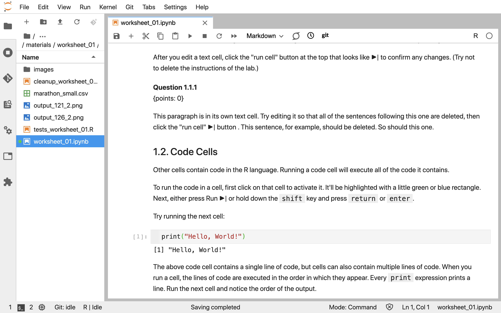

# How to get started using R {#How-to-get-started-using-R}

## Overview

To be able to effectively and efficiently write R code for your analysis you 
will need access to the R programming language on a computer. This chapter will 
show you how to use the R programming language with the two most common coding 
platforms in data science, Jupyter and RStudio. In this chapter we will point 
you to using these platforms via a web-interface for ease of getting going 
quickly. In a later chapter, we will also show you how to install and configure 
them on your local computer (i.e., laptop). These skills are essential to 
getting your analysis running, think of it like getting dressed in the morning!

## Chapter learning objectives

By the end of the chapter, students will be able to:

- use Jupyter and RStudio to run, edit and write R code
- create new code notebooks in Jupyter and RStudio
- export code notebooks to other standard filetypes (e.g., `.html`, `.pdf`) for 
sharing with non-data science audiences

## Jupyter

Jupyter is a web-based interactive development environment for creating, editing 
and executing documents called Jupyter notebooks. Jupyter notebooks are 
documents that contain a mix of computer code (and its output) and formattable 
text. Given that they combine these two analysis artefacts in a single document—code is 
not separate from the output or written report—notebooks are one of the leading 
tools to create reproducible data analyses. A reproducible data analysis is one 
where you can reliably and easily recreate the same results when analyzing the 
same data. Although this sounds like something that should always be true of any 
data analysis, in reality this is not often the case; one needs to make a 
conscious effort to perform data analysis in a reproducible manner.

The name Jupyter came from combining the names of the three programming language 
that it was initially targeted for (Julia, Python, and R), and now many other 
languages can be used with Jupyter notebooks.

A Jupyter notebook looks like this:

```{r img-jupyter, echo = FALSE, message = FALSE, warning = FALSE, fig.cap = "A screenshot of a Jupyter Notebook.", fig.retina = 2}

```

### Accessing Jupyter

One of the easiest way to get up and computing in R with Jupyter is to use a 
web-based platform called JupyterHub that already has Jupyter, R, a number of R 
packages, and collaboration tools installed, configured and ready to use. 
JupyterHub's are usually created and provisioned by organizations (for example,
an university, a company, *et cetera*) and require authentication to gain 
access. <!--- Insert link to public JupyterHub here if we can get 
access/permission (either 2i2c collaboration, or 
https://notebooks.gesis.org/hub/home) --> Jupyter can also be intalled on your
own computer (desktop or laptop) and we provide examples of how to do this in
chapter \@ref(Setting-up-your-own-computer).

### Code cells

The sections of a Jupyter notebook that contain code in the R programming 
language are referred to as code cells. Running a code cell will execute all of 
the code it contains, and the output (if any exists) will be displayed directly
underneath the code that generated it. Outputs may include printed text or 
numbers, data frames and data visualizations.

<!-- add screen shot of not run, and then run code cell here -->

#### Executing code cells

Code cells can be run independently, or as part of executing the entire notebook
using one of the "**Run all**" commands found in the **Run** or **Kernel** menus
in Jupyter. Running a
single code cell independently is a workflow typically used when editing or 
writing your own R code. Executing an entire notebook is a workflow typically 
used to ensure that your analysis runs in its entirety before sharing it with
others, and when using a notebook as part of an automated process.

To run the a code cell independently, the cell needs to first be activated. This
is done by clicking on it with the cursor. Jupyter will indicate a cell has been
activated by highlighting it with a blue rectangle to its left. After the cell
has been activated, the cell can be run by either pressing the **Run** (▶) 
button in the Jupyter notebook tab menu, or by using a keyboard shortcut of 
`Shift + Enter`.

<!-- add screen shot of highlighted/activated cell and cursor hovering over
the Run button-->

To execute all of the code cells in an entire notebook you can either select 
**Run** >> **Run All Cells**, or **Kernel** >> 
**Restart Kernel and Run All Cells...** from the Jupyter menu. Additionally, 
there is a **Restart the kernel, then re-run the whole notebook** button (▶▶) in 
the Jupyter notebook tab menu. All of these commands result in all of the code 
cells in a notebook being run, however only
the **Restart Kernel and Run All Cells...** command and the ▶▶ button will restart 
the R session before running all of the cells. Restarting the R session before 
running all of the cells means that all previous objects that were created from 
running cells before this command was run will be deleted. This command emulates
how your notebook code would run if you completely restarted Jupyter before 
executing your entire notebook.

<!-- add screen shot of **Kernel** >> **Restart Kernel and Run All Cells...**-->

> #### The Kernel
> The kernel is a program that executes the code inside your notebook and outputs
> the results. Kernels for many different programming languages have been 
> created for Jupyter, and this means that Jupyter can interpret and execute the 
> code of many different programming languages. To run R code, your notebook 
> will need an R kernel. In the top right of your window, you can see a circle 
> that indicates the status of your kernel. If the circle is empty (⚪), 
> the kernel is idle and ready to execute code. If the circle is filled in (⚫), 
> the kernel is busy running some code.
> 
> You may run into problems where your kernel is stuck for an excessive amount 
> of time, your notebook is very slow and unresponsive, or your kernel loses its
> connection. If this happens, try the following steps:
>
> - At the top of your screen, click **Kernel**, then **Interrupt Kernel**.
> - If that doesn't help, click **Kernel**, then **Restart Kernel**.... If you do this, you will have to run your code cells from the start of your notebook up until where you paused your work.
> - If that doesn't help, restart your server. First, save your work by clicking **File** at the top left of your screen, then **Save Notebook**. Next, from the **File** menu click **Hub Control Panel**. Choose **Stop My Server** to shut it down, then the **My Server** button to start it back up. Then, navigate back to the notebook you were working on.

#### Creating new code cells
 
To create a new code cell in Jupyter, click the `+` button in the Jupyter 
notebook tab menu. By default, all new cells in Jupyter start out as code cells,
so all there is to do after this is writing R code within the new cell you just 
created!

### Markdown cells

Rich formatted text cells inside a Jupyter notebook are called Markdown cells.
They get this name because the rich text formatting is specified using a simple
markup language called Markdown. You do not need to learn Markdown to write text
in the Markdown cells in Jupyter, plain text will work just fine. However, you 
might want to eventually learn a bit about the Markdown markup language because 
Markdown formatting allows you to do common things like **bold** and *italicize* 
text, create subject headers, format bullet and numbered lists, and more. 
Teaching the markdown formatting language is beyond the scope of this book. 
However, If you are keen to learn more, a good place to
start is this [cheatsheet](https://commonmark.org/help/) and this 
[tutorial](https://commonmark.org/help/tutorial/).

#### Editing Markdown cells

To edit a Markdown cell in Jupyter, you need to double click on any Markdown 
cell and the unformatted (we call this unrendered) version of the text will be
shown. You can then use your keyboard to edit the text. To view the formatted
(we call this rendered) text, click the **Run** (▶) button in the Jupyter 
notebook tab menu, or use the `Shift + Enter` keyboard shortcut.

<!-- add screen shot of not run, and then run markdown cell here -->

#### Creating new Markdown cells

To create a new Markdown cell in Jupyter, click the `+` button in the Jupyter 
notebook tab menu. By default, all new cells in Jupyter start out as code cells,
and so the cell format needs to be changed to have the cell be recognized and 
rendered as a Markdown cell. To do this click on the cell with your cursor to 
ensure it is activated, and then click on the drop-down box next to the 
**Restart the kernel, then re-run the whole notebook** button (▶▶) in the 
Jupyter notebook tab menu and changing it from "**Code**" to "**Markdown**".


### Best practices for running a notebook

As you might know (or at least imagine) by now, Jupyter notebooks are great for
interactively editing, writing and running R code - this is what they were 
designed for. As a consequence, one of the features of Jupyter notebooks is that 
they are flexible in regards to code cell execution order. This means that code 
cells can be run in any arbitrary order using the **Run** (▶) button. This 
flexibility has a downside, in that it can lead to the development of Jupyter 
notebooks whose code cannot be executed in a linear order, from top to bottom of
the notebook. This is problematic because this is the conventional way that code 
documents are run and used, and the expectation that others will 
have for your notebook when they run it. Finally, if the code is to be used in 
some automated process, it will be required to run in a linear order, from top 
to bottom of the notebook, for this to work.

Even with the best intentions of writing a Jupyter notebook whose code can be 
executed in a linear order, the flexibility of the Jupyter notebook can 
sometimes allow us to misstep and fail to rise to our intentions. The is most 
often due to relying solely on using the ▶ button to execute cells. It is 
possible to create a non-linear Jupyter notebook
because named R objects (*e.g.,* a data frame named `my_data`) are created 
when a cell is run, they can be referenced in another distinct code cell, and 
they continue to exist for the entire session the notebook is open. They will 
only cease to exist if they are deliberately deleted
with R code, or when the Jupyter notebook R session (*i.e.*, kernel) is stopped 
or restarted. This means that objects that were created in a cell, can be 
referenced in a cell above without error, as long as the user runs the cells in
that particular, non-conventional order. Additionally, a user can create objects
through running a cell, which later gets deleted. Meaning that that object only
existed for that one particular R session and would not exist again if the 
notebook session was restarted and the notebook run again.

<!-- add diagram/image of cells being run out of order, and code working if the 
cells are run in the particular weird order -->

These events may not negatively affect the user of that current R session, but 
they will negatively affect others that try to run 
that notebook, including the user that created that notebook in a future R 
session. Regularly, and intentionally choosing to execute the entire notebook in
a fresh R session via **Restart Kernel and Run All Cells...** from the Jupyter 
menu or by using the **Restart the kernel, then re-run the whole notebook** 
button (▶▶) in the Jupyter notebook tab menu will help guard against this, by 
letting a user know that some aspect of the code does not allow the notebook to 
be run linearly. Knowing this sooner than later
will allow the user to fix the issue quickly, ideally within
that session. We recommend doing this at least 2-3 times within any work session
on a Jupyter notebook.

<!--  Wondering if this best practices section should also include putting 
libraries at the top of the notebook? -->

### Saving your work


### Exporting as a different file format 


## RStudio

The easiest way to get up and computing in R with RStudio is to use a web-based
platform called R Studio Cloud that already has RStudio, R, a number of R 
packages, and collaboration tools installed, configured and ready to use.


To still include:

1. Generally how they work (markdown vs code cells)

2. How to run a notebook that is given to you

3. How to edit code and markdown cells

4. Best practices for executing notebooks

5. Saving your work

6. Sharing your notebook in as another file format (html and pdf) 


