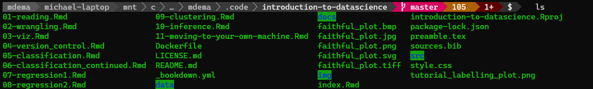
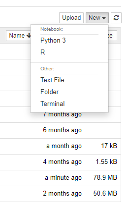

# Moving to Your Own Machine


Image source: [Wikipedia](https://en.wikipedia.org/wiki/File:Page_Under_Construction.png)

## Overview

In this chapter, you'll gain the necessary expertise to be able to continue the work you did in DSCI 100 "offline," without the use of the course's (or anyone else's, should you prefer) Syzygy servers. On top of that, we'll brush up on some terminal essentials, learn about alternative editors for working with R and Jupyter Notebooks, and finally touch on how to further your studies in data science at UBC and beyond.

## Chapter learning objectives

By the end of the chapter, students will be able to:

- access a terminal on their local machine and on JupyterHub
- use the following commands
    - `cd`
    - `ls`
    - `pwd`
- launch a local instance of Jupyter
- use alternative editors for local R development
- host their code and projects using GitHub and GitHub pages, respectively
- further their studies in data science through supplementary resources

## The Terminal

Before we begin looking at how to use R and Jupyter locally, we'll recap a few basic terminal commands to help you navigate around your local machine. This will also be useful in pulling your files from JupyterHub, so you can access them beyond the course.

While modern operating systems such as Windows and MacOS provide a graphical user interface (GUI) that enables us to view files, play music, and browse the web through simple clicks of the mouse, this wasn't always the case. Earlier operating systems were interacted with through a "command line interface" (or CLI for short). With a CLI, rather than mouse movements, textual commands allow us to move between folders, edit files, and more. Here, will need the command line to launch our local instance of Jupyter.

The command line itself is a worth an entire chapter of its own, but we only need a few commands to get back to the familiar Jupyter environment. If you want a more robust treatment of this subject, look at the additional readings and resources sections at the tail end of this chapter. 

To get started with a terminal, defer to the section on your operating system of choice below.

### Windows

Windows has a few terminal options that come built-in. While they're fine for most use-cases, a recent Microsoft project called "Windows Subsystem for Linux" (WSL) provides us a better option. 

If you're a long time Windows user, you'll likely be familiar with DOS, accessed by searching for "command prompt" or CMD. Without going into too much depth, DOS presents some headaches that we'll avoid here by taking advantage of WSL. Moreover, you may have used PowerShell before. While PowerShell "cmdlets" are closer to what we want than the commands available in DOS, WSL still reigns supreme.

To get started with WSL, refer to [this](https://docs.microsoft.com/en-us/windows/wsl/install-win10) guide. Once you've successfully installed WSL, you may proceed to the next section.

TODO: Add supplementary instructions for WSL

Make sure to also follow the optional step at the bottom to install Windows Terminal. Further instructions for Windows Terminal are available [here](https://docs.microsoft.com/en-us/windows/terminal/get-started)—it's as simple as installing an app from the Windows Store.

### MacOS

MacOS has a terminal built-in that will be than sufficient for the commands needed in this chapter. The terminal application is fittingly named "Terminal"—simply search for it using Finder as you would any other application and start an instance.

### Linux

Linux, similar to MacOS, has a terminal fine for our use-case directly built-in. To open a terminal instance, hit `CTRL` + `ALT` + `T`. 

### Navigating the terminal

Now that we have a workable terminal, let's learn how to move around our system inside a CLI. There are three commands to do this that you'll find yourself using time and time again: `pwd`, `ls`, and `cd`.

`pwd`, or "print work directory", prints your current file path. Note this prints the *absolute* file path (harkening back to what you learned in chapter 2). If you ever get lost, `pwd` will at least tell you where you are!

`ls`, short for "list", will list the current files *and* folders in your current directory. For example, here's the output of `ls` while in the source directory for this textbook:



Note anything with a highlighted, green background is another folder. (Your color scheme might be different, but the general idea is the same—your folders should look different.) How could we navigate to one of those sub-folders? That's where our next (and final) command comes in!

`cd`, an abbreviation of "change directory", allows us to switch between folders. Again your chapter 2 knowledge will come in handy here. Just as ".." brought us up a directory in relative file paths, running `cd ..` will change your current directory to the one above in the file tree. You can also run `cd <folder>` to navigate to a sub-folder of some name, or you can string them together like `cd <folder_a>/<folder_b>/<folder_c>` where `folder_a`, `folder_b`, and `folder_c` are nested folders. Finally, a common command to move around your machine a bit more quickly is `cd ~` which takes you to your "home" directory. Again, if you're ever lost, use `cd ~` to take you home!

TODO: Explain what the home directory is in more detail
TODO: find better way of displaying commands so they're not broken across lines

Now that we have a terminal installed and we know how to move around our machine within it, let's install a local instance of Jupyter.

## Using R and Jupyter Locally

### Gathering your files

Before getting started with Jupyter, let's first grab our files off of our Canvas JupyterHub instance. The following steps will do the trick:

1. Firstly, head to your JupyterHub, through Canvas
2. Open a new terminal *on the Syzygy server*—to do this, go to the right hand side of the screen, hit `New` and then select `Terminal` (see the image below for reference)
3. Enter `tar -zcvf dsci-100.tar.gz dsci-100` into the terminal; to paste this command in, right-click and select paste. `CTRL` + `V` won't work!

<p style="text-align: center;">
  
</p>

Now, you've created a zipped file of all of your work from the semester. The next task is to take your work, compressed, and move it on the either UBC's servers, or Google's. (You can also unzip it locally—more on this in a bit!)

### A Server Solution

4. Exit the terminal and return to your JupyterHub Home from before; and click the tick box beside the file `dsci-100.tar.gz`, and then click "Download." (The "Download" button only appears after you select the file. You'll find the button in the top menu.)
5. Log onto either the [UBC servers](https://ubc.syzygy.ca/) (accessed via CWL authentication) or [Cybera](https://cybera.syzygy.ca/) (accessed via Google authentication).
6. Click the white "Upload" button (beside the "New" button you used before), and select the file you just downloading, `dsci-100.tar.gz`. Click the blue "Upload" button to complete the upload.
7. Last step! Open a terminal once again *on your server of choice* and type (or preferably paste) `tar -zxvf dsci-100.tar.gz`. You've now un-compressed your files, and their available to access by returning to the homepage.

You should now have your files now available on your server of choice. No Jupyter or R installation is needed, as that software is already available on the server.

### A Local Solution

At this point, you should have your zipped files locally, but it'll take a bit more work to edit them, as we'll also need to get an installation of Jupyter and R. First things first—we should unzip the files!

4. Open a terminal instance. Refer to the earlier section on command-line interfaces if you're unsure of how to do this! (If you're on Windows, make sure you're using a Linux instance with WSL!)
5. Navigate to where you download the file `dsci-100.tar.gz`. 
6. Once there, run `tar -zxvf dsci-100.tar.gz`. Again, you won't be able to paste with `CTRL` + `V`; you can use `SHIFT` + `INSERT` or use right-click and select paste.
7. You're done! Your files are now un-compressed and available for editing.

Well... we're not totally done. We now have to install R and Jupyter. Installing this software is OS-specific, so refer to the relevant section for your machine below. If you already have Python installed, you can skip installing Anaconda by doing the following:

`pip install notebook`

Note that you'll need to install R still to get fully up and running!

### Windows

Let's start with R. Go to [this website](https://cran.r-project.org/bin/windows/base/) and download the latest version of R for Windows. (It should look something like this: "Download R 3.5.1 for Windows.") Open the file and follow the installer instructions.

Now, we need to install Jupyter. Head to [this link](https://www.anaconda.com/download/#windows) and download the Anaconda version for Windows with Python 3. After the download has finished, run the installer selecting the following options:

* On the *Advanced Installation Options* page, check both boxes (see image below for reference)
* For all other pages, use the default options

<p style="text-align: center;">
  
</p>

### MacOS

Go to [this page](https://cran.r-project.org/bin/macosx/) and download the latest version of R for Mac. (It should look something like this: "R-3.5.1.pkg".) Open the file and follow the installer instructions.

Next, head to this [URL](https://www.anaconda.com/download/#macos) and download the Anaconda version for MacOS. Follow the instructions on the page to run the installer. Anaconda is a software bundle that installs Jupyter and Python alongside a few other tools.

### Linux

TODO: Linux write-up.

### Running a notebook

Now that we have R and Jupyter installed, there's a bit of final setup we need to do. First, run the following set of commands to connect R to Jupyter with IRKernel.

- Open the terminal, and type `R` (if you're on a Mac or Linux machine) or `R.exe` (if you're on a PC) to start R.
- Type the following commands into R:

`install.packages('IRkernel',  repos = 'http://cran.us.r-project.org')`
`IRkernel::installspec(user = FALSE)`

- Next, exit R by typing `q()`. (Type `n` when prompted to not save the workspace.)
- One last time, open your terminal and type: `jupyter notebook`. You should see an output similar to the following:

```text
❯ jupyter notebook
[I 16:30:19.620 NotebookApp] Serving notebooks from local directory: C:\some\path\to\your\notebook
[I 16:30:19.621 NotebookApp] The Jupyter Notebook is running at:
[I 16:30:19.621 NotebookApp] http://localhost:8888/?token=288510c849a065abad06ca999bcb9daf4e84d2e09494fa49
[I 16:30:19.621 NotebookApp]  or http://127.0.0.1:8888/?token=288510c849a065abad06ca999bcb9daf4e84d2e09494fa49
[I 16:30:19.621 NotebookApp] Use Control-C to stop this server and shut down all kernels (twice to skip confirmation).
[C 16:30:19.785 NotebookApp]

    To access the notebook, open this file in a browser:
        file:///C:/some/path/AppData/Roaming/jupyter/runtime/nbserver-25196-open.html
    Or copy and paste one of these URLs:
        http://localhost:8888/?token=288510c849a065abad06ca999bcb9daf4e84d2e09494fa49
     or http://127.0.0.1:8888/?token=288510c849a065abad06ca999bcb9daf4e84d2e09494fa49
```

The above command should open a web browser, with Jupyter's home inside it. Try creating a new R notebook and running some simple R code (e.g., `print("hello!")`) to test that it works. To exit Jupyter, you can force-quit your terminal, or hit `CTRL` + `C` to kill the process.

You may need to change your kernel to start working. You can do this within a notebook by navigating to `Kernel` > `Change kernel` > `R`. You'll need to install the core libraries we used throughout this course (e.g., `install.packages("tidyverse")`, `install.packages("tidymodels")`), but aside from that, everything should feel the same as it did working on our servers! (Hopefully your kernel dies less frequently...)

## Hosting Your Project

With the GitHub account you set up in chapter 5, you can actually host your project code on the internet for the world to see! We'll first render your notebook at an [HTML file](https://www.w3schools.com/html/html_intro.asp), place that file in a git repository, "upload" it to GitHub, and host it by enabling GitHub pages for your project. Note that this section assumes you have git installed and that you have a basic familiarity with its use. If not, take this opportunity to refresh on the chapter 5 material!

Without further ado, let's get started!

To export the HTML file, open your Jupyter Notebook, and, in the top menu, navigate to `File` > `Download as` > `HTML (.html)`. This will save the file somewhere to your computer—take note of where! Rename the file to `index.html`.

Now, create a folder for your `index.html` file and move the file inside of it. (You can actually do this with the terminal. Try running `mkdir my-folder-name` and then `mv index.html /my-folder-name/`.) Within the terminal, while inside of your new folder (you may need to `cd`), run the following commands:

```sh
git init
git add README.md
git commit -m "initial commit"
git branch -M main
```

Our local git repository is ready to pushed to GitHub. Let's first create a GitHub repository. To do so, follow these steps:

1. Head to this [link](https://github.com/).
2. Login, if you're not signed in already.
3. Hit the "+" in the top right of the page.
4. Select "New repository".
5. Choose a new for your repository, and leave everything else as default. 
6. Note down the link at the top of the page under "Quick setup — if you’ve done this kind of thing before". It should looking something like `https://github.com/<username>/<repository>.git`

Returning to the command line, now run the following: 

```sh
git remote add origin https://github.com/<username>/<repository>.git
git push -u origin main
```

When you return to GitHub, you should see your project's HTML file there! We're almost finished, just a few more steps. In the top menu bar on GitHub, navigate to "Settings". Once there, scroll down the page until you see the section labelled "GitHub Pages."

Under "Source", click the drop-down menu and select "main". Hit save.

Now, navigate to the following URL: `<https://<username>.github.io/<repository>/`—you should see your project, rendered as an HTML page! (If not... give it a minute! Sometimes it takes a second to get started.) 

You now have your project publicly available on the web! 

## Jupyter Alternatives

While Jupyter Notebooks are fantastic for working on data science projects, there are existing alternatives that may be useful use on later projects. A select few are mentioned here.

### JupyterLab

JupyterLab is Jupyter's "next-generation" interface. It has a more flexible UI with more bells and whistles to make your coding experience easier. To learn more, click [here](https://jupyter.org/) and if you'd like to install it head [here](https://jupyter.org/install.html). (You can install it right alongside the "classic" Jupyter Notebook that you're already familiar with.)

### Visual Studio Code

Microsoft-made and widely adopted, Visual Studio Code, often shortened to VS Code, is a "rising star" in the IDE world, as it's lightweight relative to many other editors and is tremendously versatile. There is an "official" Jupyter extension for VS Code that allows you to run cells just as you would in a notebook, but still within the VS Code interface. If you're already using VS Code in other coursework or just in general, you should try using it for your `.ipynb` files! Install VS Code at this [URL](https://code.visualstudio.com/).

### RStudio

RStudio is one of the most popular R IDEs outside of Jupyter's offerings. It doesn't work with "cells" as you're used to with notebooks, but you can write R code efficiently. It was a built-in "plot viewer" which often comes in handy for larger projects. It's used in other UBC statistics courses, such as STAT 200, and is good to get familiar with it if you're pursuing further work in statistics. You can download it [here](https://rstudio.com/).

## Beyond DSCI 100

While DSCI 100 provides you with an introduction to the field of data science, what if you want to go further? If you're a UBC Vancouver Campus student, see a suite of course offerings listed below. We've also included a number of self-learning resources below the course listing.

### UBC-V

UBC-V is actively developing a data science minor. Meanwhile, there is a still a large suite of offerings you can take to further your studies in data science!

| Course | Prerequisites | Description |
|-------------------------------------------------------------------------|-----------------------------------------------------------------------------------------------------------------------------------|-----------------------------------------------------------------------------------------------------------------------------------------------------------------------------------------------------------------------------------------------------------------------------------------------------------------------------------------------------------------------------------------------------------------------------|
| STAT 201—Statistical Interference for Data Science | DSCI 100 | Classical and simulation-based techniques for estimation and hypothesis testing, including inference for means and proportions. Emphasis on case studies and real data sets, as well as reproducible and transparent workflows when writing computer scripts for analysis and reports. |
| MATH 210—Introduction to Mathematical Computing | Calculus II. Must be taken alongside one of MATH 215, MATH 255, MATH 256, or MATH 258 and one of MATH 152, MATH 221, or MATH 223. | Introduction to numerical computation, computer algebra, mathematical graphics. Primarily for second year students taking a degree in mathematics. One hour laboratory each week. |
| ECON 323—Quantitative Economic Modelling with Data Science Applications | One of ECON 101, ECON 310, Calculus I, Calculus II, and MATH 221. MATH 104 and MATH 105 recommended. | Computational tools used in modern economics. Including application of data science in economics; visualization and manipulation of economic data; solving and simulating dynamic economic models. |
| CPSC 330—Applied Machine Learning | Either (a) one of CPSC 203, CPSC 210, or CPEN 221 or (b) MATH 210 and one of CPSC 107, CPSC 110.| Application of machine learning tools, with an emphasis on solving practical problems. Data cleaning, feature extraction, supervised and unsupervised machine learning, reproducible workflows, and communicating results. Also see CPSC 340, a more rigorous, theory-focused machine learning course at UBC. More information on the difference [here](https://github.com/UBC-CS/cpsc330/blob/master/docs/330_vs_340.md). |
| BIOL 404—Ecological Methodology | BIOL 230 and one of BIOL 300, STAT 200. | Design, execution, and analysis of ecological surveys and experiments. Practical field methods for estimating population metrics and describing community structure. Computer techniques for the statistical analysis of ecological data. |

TODO: Add STAT 306, STAT 406, STAT 301, DSCI###, and other courses from Trevor's slides

Aside from this suite of courses, in general, pursuing a Combined Major in Computer Science and Statistics will provide you exposure to many of the same concepts covered in a Data Science undergraduate degree.

### MOOCs and More

Beyond UBC, you can enroll in data science related courses while on exchange, pursue a Master's in Data Science (at [UBC](https://masterdatascience.ubc.ca/) or beyond), or you could take online courses! There are plenty of fantastic resources online to help you further.

Here's a few examples curated from our course staff:

TODO: curate examples

- [Coursera](https://www.coursera.org/browse/data-science)
- [EdX](https://www.edx.org/course/subject/data-science)
- [Codecademy](https://www.codecademy.com/catalog/subject/data-science)
- [Kaggle](https://www.kaggle.com/)

Loved working on DSCI 100's course project? Kaggle provides you a given data set and selected challenge, akin to giving you the research question and requiring you to complete the needed analysis.

TODO: Kaggle plug

## In closing

TODO: Add things from Trevor's closing slides (where we started from, something nice to cap off the course)

## Additional readings

- [Command-Line Environments, *The Missing Semester of Your CS Education (MIT)*](https://missing.csail.mit.edu/2020/command-line/)
- [Command-Line Basics, *Self-Learning Resources by nwPlus*](https://resources.nwplus.io/2-beginner/command-line-basics.html)