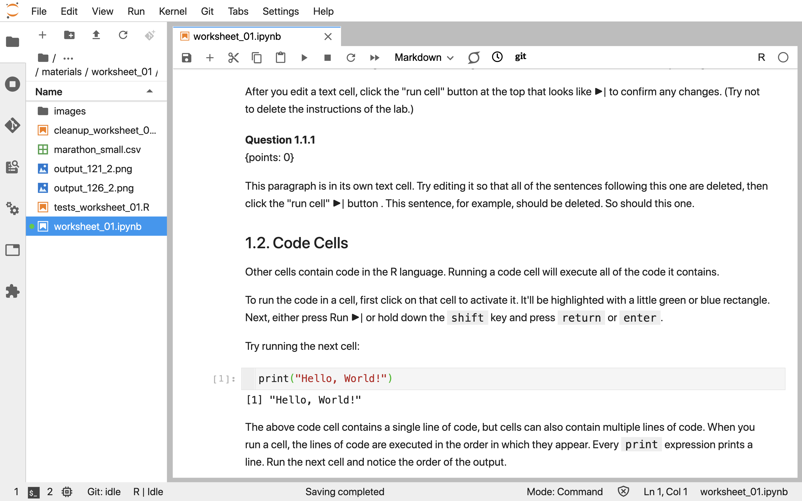
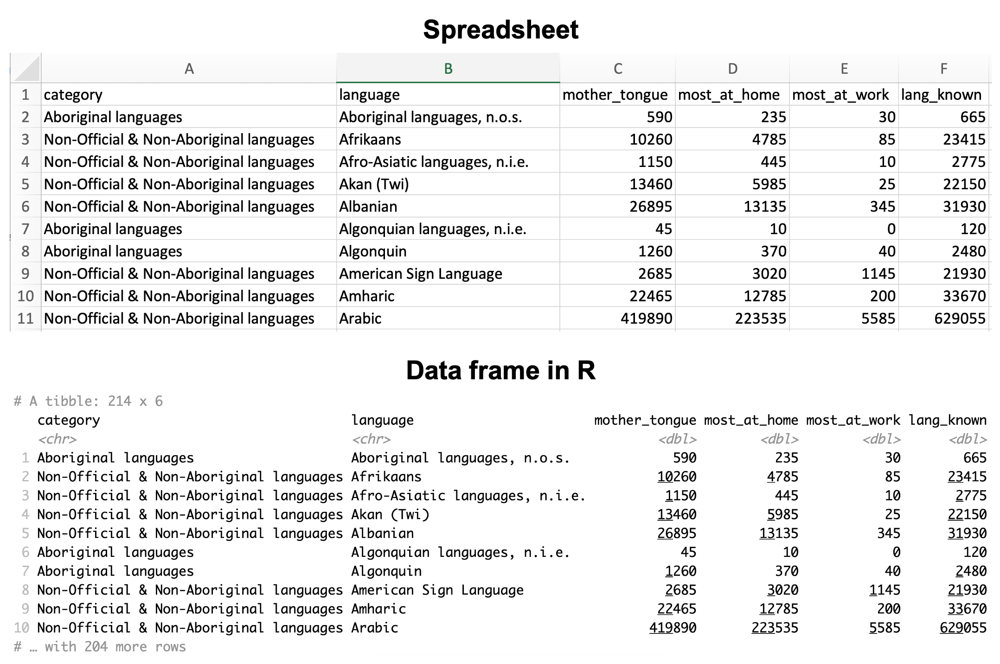
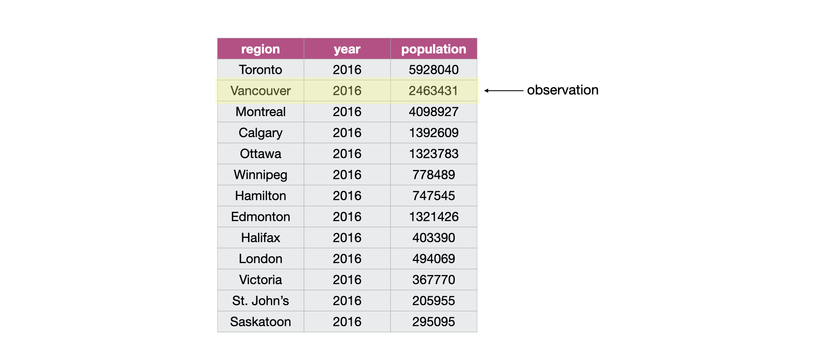
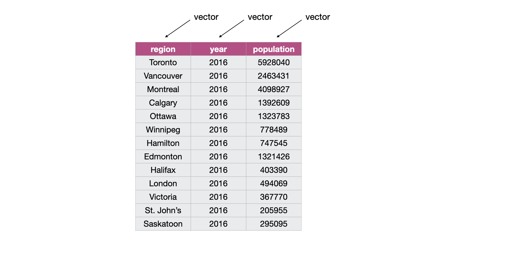
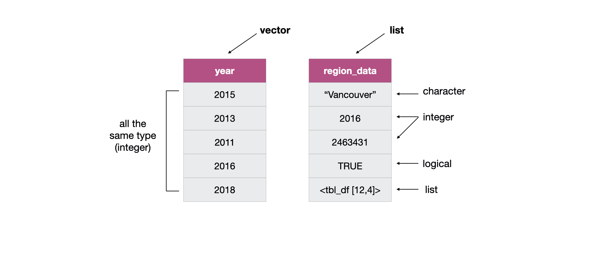

--- 
title: "Introduction to Data Science"
author: 
- Tiffany-Anne Timbers
- Trevor Campbell
- Melissa Lee
date: "`r Sys.Date()`"
site: bookdown::bookdown_site
documentclass: book
bibliography: [references.bib]
biblio-style: apalike
link-citations: yes
description: "This is an open source textbook for teaching introductory data science."
output:
  bookdown::gitbook:
    css: style.css
    config:
      toc:
        before: |
          <li><a href="./">Introduction to Data Science</a></li>
        after: |
          <li><a href="https://github.com/rstudio/bookdown" target="blank">Published with bookdown</a></li>
      edit: https://github.com/rstudio/bookdown-demo/edit/master/%s
      download: ["pdf", "epub"]
  bookdown::pdf_book:
    includes:
      in_header: preamble.tex
    latex_engine: xelatex
    citation_package: natbib
    keep_tex: yes
  bookdown::epub_book: default
  always_allow_html: true
---

```{r setup, include=FALSE}
library(forcats)

#read canlang data from GitHub and place it in the data directory
can_lang <- readr::read_csv("https://github.com/ttimbers/canlang/raw/master/inst/extdata/can_lang.csv") %>% 
  readr::write_csv("data/can_lang.csv")
```

# R, Jupyter, and the tidyverse

This is an open source textbook aimed at introducing undergraduate students to data science. It was originally written for the University of British Columbia's [DSCI 100 - Introduction to Data Science](https://ubc-dsci.github.io/dsci-100/) course. In this book, we define data science as the study and development of reproducible, auditable processes to obtain value (i.e., insight) from data. 

The book is structured so that learners spend the first four chapters learning how to use the R programming language and Jupyter notebooks to load, wrangle/clean, and visualize data, while answering descriptive and exploratory data analysis questions. The remaining chapters illustrate how to solve four common problems in data science, which are useful for answering predictive and inferential data analysis questions:

1. Predicting a class/category for a new observation/measurement (e.g., cancerous or benign tumour)
2. Predicting a value for a new observation/measurement (e.g., 10 km race time for 20 year old females with a BMI of 25).
3. Finding previously unknown/unlabelled subgroups in your data (e.g., products commonly bought together on Amazon)
4. Estimating an average or a proportion from a representative sample (group of people or units) and using that estimate to generalize to the broader population  (e.g., the proportion of undergraduate students that own an iphone)

For each of these problems, we map them to the type of data analysis question being asked and discuss what kinds of data are needed to answer such questions. More advanced (e.g., causal or mechanistic) data analysis questions are beyond the scope of this text.

**Types of data analysis questions**

| Question type | Description | Example |
|---------------|-------------|---------|
| Descriptive | A question which asks about summarized characteristics of a data set without interpretation (i.e., report a fact). | How many people live in each province or territory in Canada? |
| Exploratory | A question asks if there are patterns, trends, or relationships within a single data set. Often used to propose hypotheses for future study. | Does political party voting change with indicators of wealth in a set of data collected on 2,000 people living in Canada? |
| Inferential | A question that looks for patterns, trends, or relationships in a single data set **and** also asks for quantification of how applicable these findings are to the wider population. | Does political party voting change with indicators of wealth for all people living in Canada? |
| Predictive | A question that asks about predicting measurements or labels for individuals (people or things). The focus is on what things predict some outcome, but not what causes the outcome. | What political party will someone vote for in the next Canadian election? |
| Causal | A question that asks about whether changing one factor will lead to a change in another factor, on average, in the wider population. | Does wealth lead to voting for a certain political party in Canadian elections? |
| Mechanistic | A question that asks about the underlying mechanism of the observed patterns, trends, or relationship (i.e., how does it happen?) | How does wealth lead to voting for a certain political party in Canadian elections? |

Source: [What is the question?](https://science.sciencemag.org/content/347/6228/1314) by Jeffery T. Leek, Roger D. Peng & [The Art of Data Science](https://leanpub.com/artofdatascience) by Roger Peng & Elizabeth Matsui

## Chapter learning objectives

By the end of the chapter, students will be able to:

- use a Jupyter notebook to execute provided R code
- edit code and markdown cells in a Jupyter notebook
- create new code and markdown cells in a Jupyter notebook
- load the `tidyverse` library into R
- create new variables and objects in R using the assignment symbol
- use the help and documentation tools in R
- match the names of the following functions from the `tidyverse` library to their documentation descriptions: 
    - `read_csv` 
    - `select`
    - `filter`
    - `mutate`
    - `ggplot`
    - `aes`

## Jupyter notebooks

Jupyter notebooks are documents that contain a mix of computer code (and its output) and formattable text. Given that they are able to combine these two in a single document---code is not separate from the output or written report---notebooks are one of the leading tools to create *reproducible data analyses*. A reproducible data analysis is one where you can reliably and easily recreate the same results when analyzing the same data. Although this sounds like something that should always be true of any data analysis, in reality this is not often the case; one needs to make a conscious effort to perform data analysis in a reproducible manner.

The name Jupyter came from combining the names of the three programming language that it was initially targeted for (Julia, Python, and R), and now many other languages can be used with Jupyter notebooks. 

A notebook looks like this:



We have included a short demo video here to help you get started and to introduce you to R and Jupyter. 
However, the best way to learn how to write and run code and formattable text in a Jupyter notebook is to do it yourself! [Here is a worksheet](https://github.com/UBC-DSCI/dsci-100-assets/blob/master/2019-fall/materials/worksheet_01/worksheet_01.ipynb) that provides a step-by-step guide through the basics.

<iframe width="840" height="473" src="https://www.youtube.com/embed/2yv4pEmFgnw" frameborder="0" allow="accelerometer; autoplay; encrypted-media; gyroscope; picture-in-picture" allowfullscreen></iframe>

## Loading a spreadsheet-like dataset

Often, the first thing we need to do in data analysis is to load a dataset into R. When we bring spreadsheet-like (think Microsoft Excel tables) data, generally shaped like a rectangle, into R it is represented as what we call a *data frame* object. It is very similar to a spreadsheet where the rows are the collected observations and the columns are the variables. 



The first kind of data we will learn how to load into R (as a data frame) is the 
spreadsheet-like *comma-separated values* format (`.csv` for short).
These files have names ending in `.csv`, and can be opened open and saved from common spreadsheet programs like Microsoft Excel and Google Sheets. 
For example, a `.csv` file named `can_lang.csv` [is included with the code for this book](https://github.com/UBC-DSCI/introduction-to-datascience/blob/master/data/can_lang.csv). 
This file--- originally from [{canlang} R data package](https://ttimbers.github.io/canlang/)---has language data collected in the 2016 Canadian census [@cancensus2016]. 
If we were to open this data in a plain text editor, we would see each row on its own line, and each entry in the table separated by a comma:

```{bash, echo=FALSE, comment=NA}
head -n 10 data/can_lang.csv
```

To load this data into R, and then to do anything else with it afterwards, we will need to use something called a *function.* 
A function is a special word in R that takes in instructions (we call these *arguments*) and does something. The function we will 
use to read a `.csv` file into R is called `read_csv`.

In its most basic use-case, `read_csv` expects that the data file:

- has column names (or *headers*),
- uses a comma (`,`) to separate the columns, and
- does not have row names.

Below you'll see the code used to load the data into R using the `read_csv` function. But there is one extra step we need to do first. Since `read_csv` is not included in the base installation of R, 
to be able to use it we have to load it from somewhere else: a collection of useful functions known as a *library*. The `read_csv` function in particular
is in the `tidyverse` library (more on this later), which we load using the `library` function.

Next, we call the `read_csv` function and pass it a single argument: the name of the file, `"can_lang.csv"`. We have to put quotes around filenames and other letters and words that we 
use in our code to distinguish it from the special words that make up R programming language.  This is the only argument we need to provide for this file, because our file satifies everthing else 
the `read_csv` function expects in the default use-case (which we just discussed). Later in the course, we'll learn more about how to deal with more complicated files where the default arguments are not 
appropriate. For example, files that use spaces or tabs to separate the columns, or with no column names.

```{r load_state_property_data, warning=FALSE, message=FALSE}
library(tidyverse)
read_csv("data/can_lang.csv")
```
Above you can also see something neat that Jupyter does to help us understand our code: it colours text depending on its meaning in R. For example, 
you'll note that functions get bold green text, while letters and words surrounded by quotations like filenames get blue text.

> **In case you want to know more (optional):** 
> We use the `read_csv` function from the `tidyverse` instead of the base R function `read.csv` because it's faster and it creates a nicer variant of the base R data frame called a *tibble*. 
> This has several benefits that we'll discuss in further detail later in the course.

## Assigning value to a data frame

When we loaded the language data collected in the 2016 Canadian census in R above using `read_csv`, we did not give this data frame a name, so it was 
just printed to the screen and we cannot do anything else with it. That isn't very useful; what we would like to do is give a name to the data frame that `read_csv` outputs
so that we can use it later for analysis and visualization. 

To assign name to something in R, there are two possible ways---using either the assignment symbol (`<-`) or the equals symbol (`=`). From a style perspective, 
the assignment symbol is preferred and is what we will use in this course. When we name something in R using the assignment symbol, `<-`, we do not need to surround 
it with quotes like the filename. This is because we are formally telling R about this word and giving it a value. Only characters and words that act as values need 
to be surrounded by quotes.

Let's now use the assignment symbol to give the name `can_lang` to the language data collected in the 2016 Canadian census data frame that we get from `read_csv`.

```{r load_data_with_name, message=FALSE}
can_lang <- read_csv("data/can_lang.csv")
```

Wait a minute! Nothing happened this time! Or at least it looks like that. But actually, something did happen: the data was read in and now has the name `can_lang` associated with it. 
And we can use that name to access the data frame and do things with it. First we will type the name of the data frame to print it to the screen.


```{r print}
can_lang
```

## Creating subsets of data frames with `select` & `filter`

Now, we are going to learn how to obtain subsets of data from a data frame in R using two other `tidyverse` functions: `select` and `filter`. 
The `select` function allows you to create a subset of the columns of a data frame, while the `filter` function allows you to obtain a subset of the rows with specific values.

Before we start using `select` and `filter`, let's take a look at the language data collected in the 2016 Canadian census again to familiarize ourselves with it. 
We will do this by printing the data we loaded earlier in the chapter to the screen. 

```{r print_data_again}
can_lang
```


In this data frame there are 214 rows rows (corresponding to the 214 languages recorded on the 2016 Canadian census)
and 6 columns: 

1. `category`: Higher level language category (describing whether the language is an Official Canadian language, an Aboriginal language, or a Non-Official and Non-Aboriginal language).
2. `language`: Language queried about on the Canadian Census.
3. `mother_tongue`: Total count of Canadians from the Census who reported the language as their mother tongue. Mother tongue is generally defined as the language someone was exposed to since birth.
4. `most_at_home`: Total Count of Canadians from the Census who reported the language as spoken most often at home.
5. `most_at_work`: Total Count of Canadians from the Census who reported the language as used most often at work for the population.
6. `lang_known`: Total Count of Canadians from the Census who reported knowledge of language for the population in private households.

Now let's use `select` to extract the language column from this data frame. To do this, we need to provide the `select` function with two arguments. The first argument is the 
name of the data frame object, which in this example is `can_lang`. The second argument is the column name that we want to select, here `language`. After passing these two arguments,
the  `select` function returns a single column (the `language` column that we asked for) as a data frame.


```{r}
language_column <- select(can_lang, language)
language_column
```


### Using `select` to extract multiple columns

We can also use `select` to obtain a subset of the data frame with multiple columns. Again, the first argument is the name of the data frame. 
Then we list all the columns we want as arguments separated by commas. Here we create a subset of three columns: language, mother tongue, and language spoken most often at home.

```{r}
three_columns <- select(can_lang, language, mother_tongue, most_at_home)
three_columns
```


### Using `select` to extract a range of columns

We can also use `select` to obtain a subset of the data frame constructed from a range of columns. To do this we use the colon (`:`) operator to denote the range. 
For example, to get all the columns in the data frame from `language` to `most_at_home` we pass `language:most_at_home` as the second argument to the `select` function.

```{r}
column_range <- select(can_lang, language:most_at_home)
column_range
```

### Using `filter` to extract a single row

We can use the `filter` function to obtain the subset of rows with desired values from a data frame. Again, our first argument is the name of the data frame object, `can_lang`. 
The second argument is a logical statement to use when filtering the rows. Here, for example, we'll say that we are interested in rows where the language is Mandarin. To make 
this comparison, we use the *equivalency operator* `==` to compare the values of the `language` column with the value `"Mandarin"`. Similar to when we loaded the data file and put quotes around the filename, 
here we need to put quotes around `"Mandarin"` to tell R that this is a character value and not one of the special words that make up R programming language, nor one of the names 
we have given to data frames in the code we have already written.

With these arguments, `filter` returns a data frame that has all the columns of the input data frame but only the rows we asked for in our logical filter statement. 

```{r}
mandarin <- filter(can_lang, language == "Mandarin")
mandarin
```

### Using `filter` to extract rows with values above a threshold


If we are interested in finding information about the languages who have a higher number of people who primarily speak it at home compared to Mandarin---which is reported to have 462890 people speaking it as the primary language they speak in their home---then we can create a filter 
to obtain rows where the value of `most_at_home` is greater than 462890.
In this case, we see that `filter` returns a data frame with 2 rows; this indicates that there are two languages that are spoken more often at
home compared to Mandarin.

```{r}
spoke_often_at_home <- filter(can_lang, most_at_home > 462890)
spoke_often_at_home
```


## Exploring data with visualizations

Creating effective data visualizations is an essential piece to any data analysis. For the remainder of Chapter 1, we will learn how to use
functions from the `tidyverse` to make visualizations that let us explore relationships in data. In particular, we'll develop a visualization
of the language data collected in the 2016 Canadian census we've been working with that will help us understand two potential relationships in the data:
first, the relationship between the number of people who speak a language as their mother tongue and the number of people who speak that language as their primary spoken language at home, and second, whether there is a pattern in the strength of this relationship in the higher level language categories (Official languages, Aboriginal languages, or non-official and non-Aboriginal languages). This is an example of an exploratory data analysis 
question: we are looking for relationships and patterns within the data set we have, but are not trying to generalize what we find beyond this data set. 

### Using `ggplot` to create a scatter plot

Taking another look at our data set below, we can immediately see that the three columns (or variables) we are interested in visualizing---mother tongue, language spoken most at home, and higher level language category---are all in separate columns. In addition, there is a single row (or observation) for each language. 
The data are therefore in what we call a *tidy data* format. 
Tidy data is particularly important concept and will be a major focus in the remainder of this course: many of the functions from `tidyverse` require tidy data, 
including the `ggplot` function that we will use shortly for our visualization. We will formally introduce this concept in chapter 3.

```{r}
can_lang
```

We will begin with a scatter plot of the income and property value columns from our data frame.
To create a scatter plot of these two variables using the `ggplot` function, we do the following: 

1. call the `ggplot` function
2. provide the name of the data frame as the first argument
3. call the aesthetic function, `aes`, to specify which column will correspond to the x-axis and which will correspond to the y-axis
4. add a `+` symbol at the end of the `ggplot` call to add a layer to the plot
5. call the `geom_point` function to tell R that we want to represent the data points as dots/points to create a scatter plot.

<center>
```{r mother_tongue_vs_most_at_home, fig.width=5.75, fig.height=5, warning=FALSE}
ggplot(can_lang, aes(x = most_at_home, y = mother_tongue)) +
    geom_point()
``` 
</center>

> **In case you have used R before and are curious:** 
> There are a small number of situations in which you can have a single R expression span multiple lines. 
> Here, the `+` symbol at the end of the first line tells R that the expression isn't done yet and to
> continue reading on the next line. While not strictly necessary, this sort of pattern will appear a 
> lot when using `ggplot` as it keeps things more readable.


### Formatting ggplot objects

It is motivating and exciting that we have already been able to visualize our
data to help answer our question, but we are not done yet! There is more we can
(and should) do to improve the interpretability of the data visualization that 
we created. For example, by default, R uses the column names as the axis labels,
however, usually these column names do not have enough information about 
the variable in the column. We really should replace this default with a more
informative label. For the example above, the column name `mother_tongue` is 
used as the label for the y-axis, but most people will not know what that is. 
And even if they did, they will not know how we are measuring mother tongue, nor
which group of people the measurements were taken. An axis label that 
read "Mother tongue (number of Canadian residents)" would be much more 
informative.

Adding additional layers to our visualizations that we create in `ggplot` is one
common and easy way to improve and refine our data visualizations. New layers 
are added to `ggplot` objects using the `+` symbol. For example, we can use the 
`xlab` and `ylab` functions to add layers where we specify meaningful and 
informative labels for the x and y axes. Again, since we are specifying words 
(e.g. `"Mother tongue (number of Canadian residents)"`) as arguments to `xlab` 
and `ylab`, we surround them with double quotes. There are many more layers we 
can add to format the plot further, and we will explore these in later chapters.

```{r mother_tongue_vs_most_at_home_labs, fig.width=5.75, fig.height=5, warning=FALSE}
ggplot(can_lang, aes(x = most_at_home, y = mother_tongue)) +
    geom_point() +
    xlab("Language spoken most at home (number of Canadian residents)") +
    ylab("Mother tongue (number of Canadian residents)")    
```

Most of the data points from the 214 observations in this data set are bunched up in the lower left-handside of this visualization. This is because many many more people in Canada speak the two official languages (English and French). Thus to answer our question, we will need to adjust the scale of the x and y axes so that they are on a log scale. We can again add additional layers to the plot object using the `+` symbol to do this:

```{r mother_tongue_vs_most_at_home_scale, fig.width=5.75, fig.height=5, warning=FALSE}
ggplot(can_lang, aes(x = most_at_home, y = mother_tongue)) +
  geom_point() +
  xlab("Language spoken most at home (number of Canadian residents)") +
  ylab("Mother tongue (number of Canadian residents)") +
  scale_x_log10(labels = scales::comma) +
  scale_y_log10(labels = scales::comma)
```

From this visualization we see that for the 214 languages in this data set, as the number of people who have a language as their mother tongue increases, so does the number of people who speak that language at home. When we see 
two variables do this, we call this a *positive relationship*. Because the points are fairly close together, we can say that the relationship is strong. Because drawing a straight line through these 
points would fit the pattern we observe quite well, we say that it's linear.

Learning how to describe data visualizations is a very useful skill. We will provide descriptions for you in this course (as we did above) until we get to Chapter 4, 
which focuses on data visualization. Then, we will explicitly teach you how to do this yourself, and how to not over-state or over-interpret the results 
from a visualization.

### Changing the units

```{r changing_the_units, include = FALSE}
english_mother_tongue <- can_lang %>% 
  filter(language == "English") %>% 
  pull(mother_tongue)
census_popn <- 35151728
```

What does it mean that `r format(english_mother_tongue, scientific = FALSE, big.mark = ",")` 
people reported that their mother tongue was English in the 2016 Canadian 
census? To really understand this number, we need context. In particular, how 
many people were in Canada when this data was collected? From the 2016 Canadian 
census profile, we can see that the population was reported to be 
`r format(census_popn, scientific = FALSE, big.mark = ",")` people. The count of 
the number of people who report that English is their mother tongue is much more 
meaningful when we report it in this context. We can even go a step further and 
transform this count to a relative frequency, or proportion, so that we can 
represent this as a single meaningful number in our data visualizations. We can 
do this by dividing the number of people reporting a given language as their 
mother tongue by the number of people who live in Canada. For example, the 
proportion of people who reported that their mother tongue was English in the 
2016 Canadian census was 
`r format(round(english_mother_tongue/census_popn, 2), scientific = FALSE, big.mark = ",")`.

We can use the `mutate` function in R to do this for all of the languages in the 2016 Canadian census data set. `mutate` is useful for creating new columns in a data frame, as well as transforming existing columns. It's general syntax is: `mutate(dataframe, column_to_create/transform = value/how_to_transform)`. Below we use mutate to calculate the proportion of people reporting a given language as their mother tongue for all the languages in the `can_lang` data set:

```{r}
can_lang <- mutate(can_lang, mother_tongue = mother_tongue / 35151728)
can_lang
```

Let's also do this for the counts of the number of people who report that they speak a given language most often at home:

```{r}
can_lang <- mutate(can_lang, most_at_home = most_at_home / 35151728)
can_lang
```

Finally, let's visualize the data now that we have represented it as proportions (and change our axis labels to reflect this change in units!):

```{r mother_tongue_vs_most_at_home_scale_props, fig.width=5.75, fig.height=5, warning=FALSE}
ggplot(can_lang, aes(x = most_at_home, y = mother_tongue)) +
  geom_point() +
  xlab("Language spoken most at home (proportion of Canadian residents)") +
  ylab("Mother tongue (proportion of Canadian residents)") +
  scale_x_log10(labels = scales::comma) +
  scale_y_log10(labels = scales::comma)
```

From the visualization above, we can now clearly see that not just a lot, but that the majority of Canadians reported English as their mother tongue and as the language they speak most often at home. Changing the units to include this context increases our understanding and allows us to interpret the numbers in our data set better.

### Coloring points by group
Now we'll move onto the second part of our exploratory data analysis question: when considering the relationship between the number of people who have a language as their mother tongue and the number of people who speak that language at home, is there a pattern in the strength of this relationship in the higher-level language categories (Official languages, Aboriginal languages, or non-official and non-Aboriginal languages)? One common way to explore this is to colour the data points on the 
scatter plot we have already created by group/category. For example,
given that we have the higher level language category for each language recorded in the 2016 Canadian census, we can colour the points in our previous 
scatter plot to represent each language's higher-level language category.

To do this, we modify our scatter plot code above. Specifically, we will add an argument to the `aes` function, specifying that the points should be coloured by the `category` column:

```{r scatter_colour_by_category, fig.width=7.75, fig.height=4, warning=FALSE}
ggplot(can_lang, aes(x = most_at_home, y = mother_tongue, color = category)) +
  geom_point() +
  xlab("Language spoken most at home (number of Canadian residents)") +
  ylab("Mother tongue (number of Canadian residents)") +
  scale_x_log10(labels = scales::comma) +
  scale_y_log10(labels = scales::comma)
```

What do we see when considering the second part of our exploratory question? Do we see a difference in the pattern of the relationship between the number of people who speak a language as their mother tongue and the number of people who speak a language as their primary spoken language at home between higher-level language categories? Probably not!

For each higher-level language category there appears to be a positive relationship between the number of people who speak a language as their mother tongue and the number of people who speak a language as their primary spoken language at home. This relationship looks similar, regardless of the category. 

Does this mean that this relationship is positive for all languages in the world? Can we use this data visualization on its own to predict how many people have a given language as their mother tongue if we know how many people speak it as their primary language at home?

The answer to both these questions is "no." However, with this exploratory data analysis, we can create new hypotheses, ideas,
and questions (like the ones at the beginning of this paragraph). Answering those questions would likely involve gathering additional data and doing more complex analyses, which we will 
see more of later in this course.  

### Putting it all together

Below, we put everything from this chapter together in one code chunk. We have 
added a few more layers to make the data visualization even more effective. 
Specifically we used have improved the visualizations accessibility by choosing 
colours that are easier to distinguish and also mapped category to 
shape, we handled the problem of overlapping data points by making them slightly
transparent, and we changed the background from grey to white to improve the 
contrast. This demonstrates the power of R: in relatively few lines of code, we 
are able to create an entire data science workflow with a highly effective
data visualization.

```{r nachos_to_cheesecake, fig.width=7.75, fig.height=4, warning=FALSE, message=FALSE}
library(tidyverse)

can_lang <- read_csv("data/can_lang.csv")

can_lang <- mutate(can_lang, mother_tongue = mother_tongue / 35151728)
can_lang <- mutate(can_lang, most_at_home = most_at_home / 35151728)

ggplot(can_lang, aes(x = most_at_home, 
                     y = mother_tongue, 
                     colour = category,
                     shape = category)) + # map categories to different shapes
  geom_point(alpha = 0.6) + # set the transparency of the points
  scale_color_manual(values = c("deepskyblue2","firebrick1","black")) + # choose point colours
  xlab("Language spoken most at home (number of Canadian residents)") +
  ylab("Mother tongue (number of Canadian residents)") +
  scale_x_log10(labels = scales::comma) +
  scale_y_log10(labels = scales::comma) +
  theme_bw() # use a theme to have a white background
```

<!--chapter:end:index.Rmd-->

# Reading in data locally and from the web {#reading}

```{r 01-reading, echo = FALSE, message = FALSE, warning = FALSE}
library(magick)
library(magrittr)
library(knitr)
knitr::opts_chunk$set(message = FALSE)
```

## Overview 

In this chapter, you’ll learn to read spreadsheet-like data of various formats into R from your local device and the web. “Reading” (or “loading”) is the process of converting data (stored as plain text, a database, HTML, etc.) into an object (e.g., a data frame) that R can easily access and manipulate. Thus reading data is the gateway to any data analysis; you won’t be able to analyze data unless you’ve loaded it first. And because there are many ways to store data, there are similarly many ways to read data into R. The more time you spend upfront matching the data reading method to the type of data you have, the less time you will have to devote to re-formatting, cleaning and wrangling your data (the second step to all data analyses). It’s like making sure your shoelaces are tied well before going for a run so that you don’t trip later on!

## Chapter learning objectives
By the end of the chapter, students will be able to:

- define the following:
    - absolute file path
    - relative file path
    - url
- read data into R using a relative path and a url
- compare and contrast the following functions:
    - `read_csv` 
    - `read_tsv`
    - `read_csv2`
    - `read_delim`
    - `read_excel`
- match the following `tidyverse` `read_*` function arguments to their descriptions:
    - `file` 
    - `delim`
    - `col_names`
    - `skip`
- choose the appropriate `tidyverse` `read_*` function and function arguments to load a given plain text tabular data set into R
- use `readxl` library's `read_excel` function and arguments to load a sheet from an excel file into R
- connect to a database using the `DBI` library's `dbConnect` function
- list the tables in a database using the `DBI` library's `dbListTables` function
- create a reference to a database table that is queriable using the `tbl` from the `dbplyr` library
- retrieve data from a database query and bring it into R using the `collect` function from the `dbplyr` library
- use `write_csv` to save a data frame to a `.csv` file

- (*optional*) scrape data from the web
    - read/scrape data from an internet URL using the rvest `html_nodes` and `html_text` functions
    - compare downloading tabular data from a plain text file (e.g. `.csv`) from the web versus scraping data from a `.html` file

## Absolute and relative file paths

When you load a data set into R, you first need to tell R where those files live. The file could live on your 
computer (*local*) or somewhere on the internet (*remote*). In this section, we will discuss the case where the file lives on your computer.

The place where the file lives on your computer is called the "path". You can think of the path as directions to the file. There are two kinds of 
paths: relative paths and absolute paths. A relative path is where the file is with respect to where you currently are on the computer (e.g., where the 
Jupyter notebook file that you're working in is). On the other hand, an absolute path is where the file is in respect to the base (or root) folder of 
the computer's filesystem.

Suppose our computer's filesystem looks like the picture below, and we are working in the Jupyter notebook titled `worksheetk_02.ipynb`. If we want to 
read in the `.csv` file named `happiness_report.csv` into our Jupyter notebook using R, we could do this using either a relative or an absolute path. 
We show both choices below.

```{r 11-population-vs-sample, echo = FALSE, message = FALSE, warning = FALSE, fig.cap = "Example file system", fig.retina = 2, out.width="840"}
knitr::include_graphics("img/file-system-for-export-to-intro-datascience.svg")
```

**Reading `happiness_report.csv` using a relative path:**

```
happiness_data <- read_csv("data/happiness_report.csv")
```

**Reading `happiness_report.csv` using an absolute path:**

```
happiness_data <- read_csv("/home/jupyter/dsci-100/worksheet_02/data/happiness_report.csv")
```

So which one should you use? Generally speaking, to ensure your code can be run 
on a different computer, you should use relative paths. An added bonus is that 
it's also less typing! This is because the absolute path of a file (the names of 
folders between the computer's root `/` and the file) isn't usually the same 
across different computers. For example, suppose Fatima and Jayden are working on a 
project together on the `happiness_report.csv` data. Fatima's file is stored at 

`/home/Fatima/project/data/happiness_report.csv`, 

while Jayden's is stored at 

`/home/Jayden/project/data/happiness_report.csv`.
 
Even though Fatima and Jayden stored their files in the same place on their computers (in their home folders), the absolute paths are different due to their different usernames.
If Jayden has code that loads the `happiness_report.csv` data using an absolute path, the code won't work on Fatima's computer.
But the relative path from inside the `project` folder (`data/happiness_report.csv`) is the same on both computers; any code that uses relative paths will work on both!

<!--Why would the absolute path not work on a different computer? The reason for this is that the names and the folder structure of the path between a computer's root 
folder (named `/`) and any files and folders you are usually working with will be different depending on who owns the computer (usually there is a different user name 
on each computer) and where the files and folders happen to be located on that particular computer. -->

See this video for another explanation: 

<iframe width="840" height="473" src="https://www.youtube.com/embed/ephId3mYu9o" frameborder="0" allow="accelerometer; autoplay; encrypted-media; gyroscope; picture-in-picture" allowfullscreen></iframe>

*Source: [Udacity course "Linux Command Line Basics"](https://www.udacity.com/course/linux-command-line-basics--ud595)*

## Reading tabular data from a plain text file into R

Now we will learn more about reading tabular data from a plain text file into R, as well as how to write tabular data to a file. 
Last chapter, we learned about using the `tidyverse` `read_csv` function when reading files that match that function's expected defaults 
(column names are present, and commas are used as the delimiter/separator between columns). In this section, we will learn how to read 
files that do not satisfy the default expectations of `read_csv`. 

Before we jump into the cases where the data aren't in the expected default format for `tidyverse` and `read_csv`, let's revisit the more straightforward
case where the defaults hold, and the only argument we need to give to the function is the path to the file, `data/can_lang.csv`. The `can_lang` data set contains language data from the 2016 Canadian census. We put `data/` before the file's name when we are loading the data set because this data set is located in a sub-folder, named `data`, relative to where we are running our R code.

Here is what the file would look like in a plain text editor:

```{bash, echo=FALSE, comment=NA}
head -n 10 data/can_lang.csv
```

And here is a review of how we can use `read_csv` to load it into R. First we 
load the `tidyverse` library to gain access to useful functions for reading the 
data. 

```{r, message = TRUE}
library(tidyverse)
```

> Note: it is normal and expected that a message is printed out after 
loading the `tidyverse` and some libraries. Generally, this message let's you
know if functions from the different libraries were loaded share the same name
(which is confusing to R), and if so, which one you can access using just it's
name (and which one you need to refer the library name and the function name to
refer to it, this is called masking). Additionally, the `tidyverse` is a special
R library - it is a meta-library or meta-package that bundles together several
related and commonly used packages. Because of this it lists the libraries it 
does the job of loading. In future when we load this library in this book we 
will silence these messages to help with readability of the book.

Next we use `read_csv` to load the data into R, and in that call we specify the
relative path to the file.

```{r load_data, message = TRUE}
canlang_data <- read_csv("data/can_lang.csv")
```

> Note: it is also normal and expected that a message is printed out after using
the `read_csv` and related functions. This message functions to let you know the
data types of each of the columns that R inferred while reading the data into R.
In future when we use this and related functions to load data in this book we 
will silence these messages to help with readability of the book.

```{r view_data}
canlang_data
```

### Skipping rows when reading in data

Often times information about how data was collected, or other relevant information, is included at the top of the data file. This information is usually written in sentence and paragraph form, with no delimiter because it is not organized into columns. An example of this is shown below. This
information gives the data scientist useful context and information about the data, however, it is not well formatted or intended to be read into
a data frame cell along with the tabular data that follows later in the file.

```{bash, echo=FALSE, comment=NA}
head -n 13 data/can_lang_meta-data.csv
```

With this extra information being present at the top of the file, using `read_csv` as we did previously does not allow us to correctly load the data into R. In the case of this file we end up only reading in one column of the data set:

```{r}
canlang_data <- read_csv("data/can_lang_meta-data.csv")
```

> Note: In contrast to the normal and expected messages above, this time R 
printed out a warning for us indicating that there might be a problem with how 
our data is being read in.

```{r}
canlang_data
```

To successfully read data like this into R, the `skip` argument can be useful to tell R how many lines to skip before it should start reading in the data. In the example above, we would set this value to 3:

```{r}
canlang_data <- read_csv("data/can_lang_meta-data.csv", skip = 3)
canlang_data
```

### `read_delim` as a more flexible method to get tabular data into R

When our tabular data comes in a different format, we can use the `read_delim` function instead. For example, a different version of this same data set has no column names and uses tabs as the delimiter instead of commas. 

Here is how the file would look in a plain text editor:

```{bash, echo=FALSE, comment=NA}
head -n 10 data/can_lang.tsv
```

To get this into R using the `read_delim()` function, we specify the first argument as the path to the file (as done with `read_csv`), and then provide values to the `delim` argument (here a tab, which we represent by `"\t"`) and the `col_names` argument (here we specify that there are no column names to assign, and give it the value of `FALSE`). Both `read_csv()` and `read_delim()` have a `col_names` argument and the default is `TRUE`. 


```{r}
canlang_data <- read_delim("data/can_lang.tsv", delim = "\t", col_names = FALSE)
canlang_data
```

Data frames in R need to have column names, thus if you read data into R as a data frame without column names then R assigns column names for them. If you used the `read_*` functions to read the data into R, then R gives each column a name of X1, X2, ..., XN, where N is the number of columns in the data set.

### Reading tabular data directly from a URL
We can also use `read_csv()` or `read_delim()` (and related functions) to read in tabular data directly from a url that contains tabular data. In this case, we provide the url to `read_csv()` as the path to the file instead of a path to a local file on our computer. Similar to when we specify a path on our local computer, here we need to surround the url by quotes. All other arguments that we use are the same as when using these functions with a local file on our computer.

```{r}
canlang_data <- read_csv("https://raw.githubusercontent.com/UBC-DSCI/introduction-to-datascience/master/data/can_lang.csv")
canlang_data
```

### Previewing a data file before reading it into R

In all the examples above, we gave you previews of the data file before we read it into R. This is essential so that you can see whether or not there are column names, what the 
delimiters are, and if there are lines you need to skip. You should do this yourself when trying to read in data files. In Jupyter, you preview data as a plain text file by right-clicking
on the file's name in the Jupyter home menu and selecting "Open with" and then selecting "Editor". 

```{r open-data-w-editor-01, echo = FALSE, fig.cap = "Opening data files with an editor in Jupyter", fig.retina = 2, out.width="100%"}
image_read("img/open_data_w_editor_01.png") %>% 
  image_crop("3632x2000")
```

```{r open-data-w-editor-02, echo = FALSE, fig.cap = "A data file as viewed in an editor in Jupyter", fig.retina = 2, out.width="100%"}
image_read("img/open_data_w_editor_02.png") %>% 
  image_crop("3632x2000")
```

If you do not specify to open the data file with an editor, then Jupyter will 
render a nice table for you and you will not be able to see the column
delimiters, and therefore you will not know which function to use, nor
which arguments to use and values to specify for them. 

This is also demonstrated in the video below:

<iframe width="840" height="473" src="https://www.youtube.com/embed/6orO4YMAyeQ" frameborder="0" allow="accelerometer; autoplay; encrypted-media; gyroscope; picture-in-picture" allowfullscreen></iframe>


## Reading data from an Microsoft Excel file

There are many other ways to store tabular data sets beyond plain text files, and similarly, many ways to load those data sets into R. For example, it is very common to encounter,
and need to load into R, data stored as a Microsoft Excel spreadsheet (with the filename extension `.xlsx`). 
To be able to do this, a key thing to know is that even though `.csv` and `.xlsx` files look almost 
identical when loaded into Excel, the data themselves are stored completely differently.
While `.csv` files are plain text files, where the characters you see when you open the file in a text editor are exactly the data they represent,
this is not the case for `.xlsx` files. Take a look at what a `.xlsx` file would look like in a text editor: 


```
,?'O
    _rels/.rels???J1??>E?{7?
<?V????w8?'J???'QrJ???Tf?d??d?o?wZ'???@>?4'?|??hlIo??F
t                                                       8f??3wn
????t??u"/
          %~Ed2??<?w??
                       ?Pd(??J-?E???7?'t(?-GZ?????y???c~N?g[^_r?4
                                                                  yG?O
                                                                      ?K??G?RPX?<??,?'O[Content_Types].xml???n?0E%?J
                                                                                                                    ]TUEe??O??c[???????6q??s??d?m???\???H?^????3} ?rZY? ?:L60?^?????XTP+?|?3???"~?3T1W3???,?#p?R?!??w(??R???[S?D?kP?P!XS(?i?t?$?ei
X?a??4VT?,D?Jq
                D
                 ?????u?]??;??L?.8AhfNv}?hHF*??Jr?Q?%?g?U??CtX"8x>?.|????5j?/$???JE?c??~??4iw?????E;?+?S??w?cV+?:???2l???=?2nel???;|?V??????c'?????9?P&Bcj,?'OdocProps/app.xml??1
                                                     ?0???k????A?u?U?]??{#?:;/<?g?Cd????M+?=???Z?O??R+??u?P?X KV@??M$??a???d?_???4??5v?R????9D????t??Fk?Ú'P?=?,?'OdocProps/core.xml??MO?0
                                                             ??J?{???3j?h'??(q??U4J
                                                                                   ??=i?I'?b??[v?!??{gk?
                                                                                                         F2????v5yj??"J???,?d???J???C??l??4?-?`$?4t?K?.;?%c?J??G<?H????
                                                  X????z???6?????~q??X??????q^>??tH???*?D???M?g
??D?????????d?:g).?3.??j?P?F?'Oxl/_rels/workbook.xml.rels??Ak1??J?{7???R?^J?kk@Hf7??I?L???E]A?Þ?{a??`f?????b?6xUQ?@o?m}??o????X{???Q?????;?y?\?
                        O
?YY??4?L??S??k?252j??
??V ?C?g?C]???????
?
???E??TENyf6%
             ?Y????|??:%???}^ N?Q?N'????)??F?\??P?G??,?'O'xl/printerSettings/printerSettings1.bin?Wmn? 
                                                                                                        ??Sp>?G???q?#
                                                                                                                     ?I??5R'???q????(?L
??m??8F?5<  L`??`?A??2{dp??9R#?>7??Xu???/?X??HI?|?
                                                          ??r)???\?VA8?2dFfq???I]]o
5`????6A ?
```

This type of file representation allows Excel files to store additional things that you cannot store in a `.csv` file, such as fonts, text formatting, graphics, multiple sheets 
and more. And despite looking odd in a plain text editor, we can read Excel spreadsheets into R using the `readxl` package developed 
specifically for this purpose.

```{r}
library(readxl)
canlang_data <- read_excel("data/can_lang.xlsx")
canlang_data
```

If the `.xlsx` file has multiple sheets, you have to use the `sheet` argument to specify the sheet number or name. You can also specify cell ranges using the `range` argument. This functionality is useful when a single sheet contains multiple tables (a sad thing that happens to many Excel spreadsheets).

As with plain text files, you should always explore the data file before importing it into R. Exploring the data beforehand helps you decide which arguments you need to to load the data into R successfully. If you do not have the Excel program on your computer, you can use other programs to preview the file. Examples include Google Sheets and Libre Office. 

## Reading data from a database

Another very common form of data storage is the relational database. There are many relational database management systems, such as
[SQLite](https://www.sqlite.org/index.html), [MySQL](https://www.mysql.com/), [PostgreSQL](https://www.postgresql.org/), [Oracle](https://www.oracle.com/ca-en/index.html), and many more. These different relational database management systems each have their own advantages and limitations. Almost all employ SQL (*structured query language*) to pull data from the database. Thankfully, you don't need to know SQL
to analyze data from a database; 
several packages have been written 
that allows R to connect to relational databases and use the R programming language as the front end (what the user types in) to pull data from them. These different relational database management systems have their own advantages, limitations, and excels in particular scenarios. In this book, we will 
give examples of how to do this using R with SQLite and PostgreSQL databases.

### Connecting to a database

#### Reading data from a SQLite database

SQLite is probably the simplest relational database that one can use in combination with R. SQLite databases are self-contained and usually stored and accessed locally on one computer. Data is usually stored in a file with a `.db` extension. Similar to Excel files, these are not plain text files and cannot be read in a plain text editor. 

The first thing you need to do to read data into R from a database is to connect to the database. We do that using the `dbConnect` function from the `DBI` (database interface) package. This does not read in the data, but simply tells R where the database is and opens up a communication channel.

```{r}
library(DBI)
con_lang_data <- dbConnect(RSQLite::SQLite(), "data/can_lang.db")
```

Often relational databases have many tables, and their power comes from the useful ways they can be joined. Thus anytime you want to access data from a relational database, you need to know the table names. You can get the names of all the tables in the database using the `dbListTables` function:

```{r}
tables <- dbListTables(con_lang_data)
tables
```

We only get one table name returned from calling `dbListTables`, which tells us that there is only one table in this database. To reference a table in the database to do things like select columns and filter rows, we use the `tbl` function from the `dbplyr` package. The package `dbplyr` allows us to work with data stored in databases as if they were local data frames, which is useful because we can do a lot with big datasets without actually having to bring these vast amounts of data into your computer! 

```{r}
library(dbplyr)
lang_db <- tbl(con_lang_data, "lang")
lang_db
```

Although it looks like we just got a data frame from the database, we didn't! It's a *reference*, showing us data that is still in the SQLite database (note the first two lines of the output). 
It does this because databases are often more efficient at selecting, filtering and joining large data sets than R. And typically, the database will not even be 
stored on your computer, but rather a more powerful machine somewhere on the web. So R is lazy and waits to bring this data into memory until you explicitly tell 
it to do so using the `collect` function from the `dbplyr` library. 

Here we will filter for only rows in the Aboriginal languages category according to the 2016 Canada Census, and then use `collect` to finally bring this data into R as a data frame. 

```{r}
aboriginal_lang_db <- filter(lang_db, category == "Aboriginal languages")
aboriginal_lang_db
```

```{r}
aboriginal_lang_data <- collect(aboriginal_lang_db)
aboriginal_lang_data
```

Why bother to use the `collect` function? The data looks pretty similar in both outputs shown above. And `dbplyr` provides lots of functions similar to `filter` that 
you can use to directly feed the database reference (what `tbl` gives you) into downstream analysis functions (e.g., `ggplot2` for data visualization and `lm` for 
linear regression modeling). However, this does not 
work in *every* case; look what happens when we try to use `nrow` to count rows in a data frame:

```{r}
nrow(aboriginal_lang_db)
```
 
or `tail` to preview the last 6 rows of a data frame:

```
tail(aboriginal_lang_db)
```
```
## Error: tail() is not supported by sql sources
```
Additionally, some operations will not work to extract columns or single values from the reference given by the `tbl` function. Thus, once you have finished your data wrangling of the `tbl` database reference object, it is advisable to bring it into your local machine's memory using `collect` as a data frame. 

> Warning: Usually, databases are very big! Reading the object into your local machine may give an error or take a lot of time to run so be careful if you plan to do this! 
 
#### Reading data from a PostgreSQL database 

PostgreSQL (also called Postgres) is a very popular and open-source option for relational database software. Unlike SQLite, PostgreSQL uses 
a client–server database engine, as it was designed to be used and accessed on a network. This means that you have to provide more 
information to R when connecting to Postgres databases. The additional information that you need to include when you call the `dbConnect` 
function is listed below:

- `dbname` - the name of the database (a single PostgreSQL instance can host more than one database)
- `host` - the URL pointing to where the database is located
- `port` - the communication endpoint between R and the PostgreSQL database (this is typically 5432 for PostgreSQL)
- `user` - the username for accessing the database
- `password` - the password for accessing the database


Additionally, we must use the `RPostgres` library instead of `RSQLite` in the `dbConnect` function call.
Below we demonstrate how to connect to a version of the `can_mov_db` database, which contains information about Canadian movies (*note - this is a synthetic, or artificial, database*).

```
library(RPostgres)
can_mov_db_con <- dbConnect(RPostgres::Postgres(), dbname = "can_mov_db",
                        host = "r7k3-mds1.stat.ubc.ca", port = 5432,
                        user = "user0001", password = '################')
```

### Interacting with a database

After opening the connection, everything looks and behaves almost identically to when we were using an SQLite database in R. For example, we can again 
use `dbListTables` to find out what tables are in the `can_mov_db` database:

```
dbListTables(can_mov_db_con)
```

```
 [1] "themes"            "medium"           "titles"     "title_aliases"       "forms"            
 [6] "episodes"          "names"      "names_occupations" "occupation"       "ratings" 
```

We see that there are 10 tables in this database. Let's first look at the `"ratings"` table to find the lowest rating that exists in the `can_mov_db` database:

```
ratings_db <- tbl(can_mov_db_con, "ratings")
ratings_db
```

```
# Source:   table<ratings> [?? x 3]
# Database: postgres [user0001@r7k3-mds1.stat.ubc.ca:5432/can_mov_db]
   title              average_rating num_votes
   <chr>                    <dbl>     <int>
 1 The Grand Seduction       6.6       150
 2 Rhymes for Young Ghouls   6.3      1685
 3 Mommy                     7.5      1060
 4 Incendies                 6.1      1101
 5 Bon Cop, Bad Cop          7.0       894
 6 Goon                      5.5      1111
 7 Monsieur Lazhar           5.6       610
 8 What if                   5.3      1401
 9 The Barbarian Invations   5.8        99
10 Away from Her             6.9      2311
# … with more rows
```

To find the lowest rating that exists in the data base, we first need to extract the `average_rating` column using `select`:

```
avg_rating_db <- select(ratings_db, average_rating)
avg_rating_db
```

```
# Source:   lazy query [?? x 1]
# Database: postgres [user0001@r7k3-mds1.stat.ubc.ca:5432/can_mov_db]
   average_rating
            <dbl>
 1            6.6
 2            6.3
 3            7.5
 4            6.1
 5            7.0
 6            5.5
 7            5.6
 8            5.3
 9            5.8
10            6.9
# … with more rows
```

Next we use `min` to find the minimum rating in that column:

```
min(avg_rating_db)
```

```
Error in min(avg_rating_db) : invalid 'type' (list) of argument
```

Instead of the minimum, we get an error! This is another example of when we need to use the `collect` function to bring the data into R for further computation:

```
avg_rating_data <- collect(avg_rating_db)
min(avg_rating_data)
```

```
[1] 1
```

We see the lowest rating given to a movie is 1, indicating that it must have been a really bad movie...


**Why should we bother with databases at all?**

Opening a database stored in a `.db` file involved a lot more effort than just opening a `.csv`, `.tsv`, or any of the other plain text or Excel formats. It was a bit of a pain to use a database in that setting since we had to use `dbplyr` to translate `tidyverse`-like commands (`filter`, `select`, `head`, etc.) into SQL commands that the database understands. Not all `tidyverse` commands can currently be translated with SQLite databases. For example, we can compute a mean with an SQLite database but can't easily compute a median. So you might be wondering why should we use databases at all? 

Databases are beneficial in a large-scale setting:

- they enable storing large data sets across multiple computers with automatic redundancy and backups
- they allow multiple users to access them simultaneously and remotely without conflicts and errors
- they provide mechanisms for ensuring data integrity and validating input
- they provide security to keep data safe
For example, [there are billions of Google searches conducted daily](https://www.internetlivestats.com/google-search-statistics/). Can you imagine if Google stored all of the data from those queries in a single `.csv file`!? Chaos would ensue! 


## Writing data from R to a `.csv` file

At the middle and end of a data analysis, we often want to write a data frame that has changed (either through filtering, selecting, mutating or summarizing) to a file 
to share it with others or use it for another step in the analysis. The most straightforward way to do this is to use the `write_csv` function from the `tidyverse` library. 
The default arguments for this file are to use a comma (`,`) as the delimiter and include column names. Below we demonstrate creating a new version of the Canadian languages data set without the official languages category according to the Canadian 2016 Census, and then writing this to a `.csv` file:

```
no_official_lang_data <- filter(can_lang, category != "Official languages")
write_csv(no_official_lang_data, "data/no_official_languages.csv")
```

## Scraping data off the web using R

In the first part of this chapter, we learned how to read in data from plain text files that are usually "rectangular" in shape using the `tidyverse` `read_*` functions. Sadly, not all data comes in this simple format, but we can happily use many other tools to read in more messy/wild data formats. One common place people often want/need to read in data from is websites. Such data exists in a non-rectangular format. One quick and easy solution to get this data is to copy and paste it. However, this becomes painstakingly long and boring when there is a lot of data that needs gathering. And any time you start doing a lot of copying and pasting, you will likely introduce errors. 

The formal name for gathering non-rectangular data from the web and transforming it into a more useful format for data analysis is **web scraping**. There are two different ways to do web scraping: 1) screen scraping (similar to copying and pasting from a website, but done in a programmatic way to minimize errors and maximize efficiency) and 2) web APIs (**a**pplication **p**rogramming **i**nterface) (a website that provides a programatic way of returning the data as JSON or XML files via http requests). In this course, we will explore the first method, screen scraping using R's [`rvest` package](https://github.com/hadley/rvest).

### HTML and CSS selectors

Before we jump into scraping, let's set up some motivation and learn a little bit about what the "source code" of a website looks like. Say we are interested in knowing the average rental price (per square footage) of the most recently available one-bedroom apartments in Vancouver from https://vancouver.craigslist.org. When we visit the Vancouver Craigslist website and search for one-bedroom apartments, this is what we are shown:


From that page, it's pretty easy for our human eyes to find the apartment price and square footage. But how can we do this programmatically, so we don't have to copy and paste all these numbers? Well, we have to deal with the webpage source code, which we show a snippet of below (and link to the [entire source code here](img/website_source.txt)):

```
        <span class="result-meta">
                <span class="result-price">$800</span>

                <span class="housing">
                    1br -
                </span>

                <span class="result-hood"> (13768 108th Avenue)</span>

                <span class="result-tags">
                    <span class="maptag" data-pid="6786042973">map</span>
                </span>

                <span class="banish icon icon-trash" role="button">
                    <span class="screen-reader-text">hide this posting</span>
                </span>

            <span class="unbanish icon icon-trash red" role="button" aria-hidden="true"></span>
            <a href="#" class="restore-link">
                <span class="restore-narrow-text">restore</span>
                <span class="restore-wide-text">restore this posting</span>
            </a>

        </span>
    </p>
</li>
         <li class="result-row" data-pid="6788463837">

        <a href="https://vancouver.craigslist.org/nvn/apa/d/north-vancouver-luxury-1-bedroom/6788463837.html" class="result-image gallery" data-ids="1:00U0U_lLWbuS4jBYN,1:00T0T_9JYt6togdOB,1:00r0r_hlMkwxKqoeq,1:00n0n_2U8StpqVRYX,1:00M0M_e93iEG4BRAu,1:00a0a_PaOxz3JIfI,1:00o0o_4VznEcB0NC5,1:00V0V_1xyllKkwa9A,1:00G0G_lufKMygCGj6,1:00202_lutoxKbVTcP,1:00R0R_cQFYHDzGrOK,1:00000_hTXSBn1SrQN,1:00r0r_2toXdps0bT1,1:01616_dbAnv07FaE7,1:00g0g_1yOIckt0O1h,1:00m0m_a9fAvCYmO9L,1:00C0C_8EO8Yl1ELUi,1:00I0I_iL6IqV8n5MB,1:00b0b_c5e1FbpbWUZ,1:01717_6lFcmuJ2glV">
                <span class="result-price">$2285</span>
        </a>

    <p class="result-info">
        <span class="icon icon-star" role="button">
            <span class="screen-reader-text">favorite this post</span>
        </span>

            <time class="result-date" datetime="2019-01-06 12:06" title="Sun 06 Jan 12:06:01 PM">Jan  6</time>


        <a href="https://vancouver.craigslist.org/nvn/apa/d/north-vancouver-luxury-1-bedroom/6788463837.html" data-id="6788463837" class="result-title hdrlnk">Luxury 1 Bedroom CentreView with View - Lonsdale</a>


```

This is not easy for our human eyeballs to read! However, it is easy for us to use programmatic tools to extract the data we need by specifying which HTML tags (things inside `<` and `>` in the code above). For example, if we look in the code above and search for lines with a price, we can also look at the tags that are near that price and see if there's a common "word" we can use that is near the price but doesn't exist on other lines that have the information we are not interested in:

```
<span class="result-price">$800</span>
```

and 

```
<span class="result-price">$2285</span>
```

What we can see is there is a special "word" here, "result-price", which appears only on the lines with prices and not on the other lines (that have information we are not interested in). This special word and the context in which is is used (learned from the other words inside the HTML tag) can be combined to create something called a CSS selector. The CSS selector can then be used by R's `rvest` package to select the information we want (here price) from the website source code.

Now, many websites are quite large and complex, and so then is their website source code. And as you saw above, it is not easy to read and pick out the special words we want with our human eyeballs. So to make this easier, we will use the SelectorGadget tool. It is an open source tool that simplifies generating and finding CSS selectors. We recommend you use the Chrome web browser to use this tool, and install the [selector gadget tool from the Chrome Web Store](https://chrome.google.com/webstore/detail/selectorgadget/mhjhnkcfbdhnjickkkdbjoemdmbfginb). Here is a short video on how to install and use the SelectorGadget tool to get a CSS selector for use in web scraping:

<iframe width="840" height="473" src="https://www.youtube.com/embed/YdIWI6K64zo" frameborder="0" allow="accelerometer; autoplay; encrypted-media; gyroscope; picture-in-picture" allowfullscreen></iframe>

From installing and using the selectorgadget as shown in the video above, we get the two CSS selectors `.housing` and `.result-price` that we can use to scrape information about the square footage and the rental price, respectively. The selector gadget returns them to us as a comma separated list (here `.housing , .result-price`), which is exactly the format we need to provide to R if we are using more than one CSS selector.

### Are you allowed to scrape that website?

**BEFORE** scraping data from the web, you should always check whether or not you are **ALLOWED** to scrape it! There are two documents that are important for this: the robots.txt file and reading the website's Terms of Service document. The website's Terms of Service document is probably the more important of the two, and so you should look there first. What happens when we look at Craigslist's Terms of Service document? Well we read this:

*"You agree not to copy/collect CL content via robots, spiders, scripts, scrapers, crawlers, or any automated or manual equivalent (e.g., by hand)."*

source: https://www.craigslist.org/about/terms.of.use


> Want to learn more about the legalities of web scraping and crawling? Read this interesting blog post titled ["Web Scraping and Crawling Are Perfectly Legal, Right?" by Benoit Bernard](https://benbernardblog.com/web-scraping-and-crawling-are-perfectly-legal-right/) (this is optional, not required reading).

So what to do now? Well, we shouldn't scrape Craigslist! Let's instead scrape some data on the population of Canadian cities from Wikipedia (who's [Terms of Service document](https://foundation.wikimedia.org/wiki/Terms_of_Use/en) does not explicilty say do not scrape). In this video below we demonstrate using the selectorgadget tool to get CSS Selectors from [Wikipedia's Canada](https://en.wikipedia.org/wiki/Canada) page to scrape a table that contains city names and their populations from the 2016 Canadian Census: 

<iframe width="840" height="473" src="https://www.youtube.com/embed/O9HKbdhqYzk" frameborder="0" allow="accelerometer; autoplay; encrypted-media; gyroscope; picture-in-picture" allowfullscreen></iframe>


### Using `rvest`

Now that we have our CSS selectors we can use `rvest` R package to scrape our desired data from the website. First we start by loading the `rvest` package:

```{r 01-load-rvest}
library(rvest)
```

Next, we tell R what page we want to scrape by providing the webpage's URL in quotations to the function `read_html`:

```{r 01-specify-page}
page <- read_html("https://en.wikipedia.org/wiki/Canada")
```


Then we send the page object to the `html_nodes` function. We also provide that function with the CSS selectors we obtained from the selectorgadget tool. These should be surrounded by quotations. The `html_nodes` function select nodes from the HTML document using CSS selectors. Nodes are the HTML tag pairs as well as the content between the tags. For our CSS selector `td:nth-child(5)` and example node that would be selected would be: `<td style="text-align:left;background:#f0f0f0;"><a href="/wiki/London,_Ontario" title="London, Ontario">London</a></td>`

```{r 01-select-nodes}
population_nodes <- html_nodes(page, "td:nth-child(5) , td:nth-child(7) , .infobox:nth-child(122) td:nth-child(1) , .infobox td:nth-child(3)")
head(population_nodes)
```

Next we extract the meaningful data from the HTML nodes using the `html_text` function. For our example, this functions only required argument is the an html_nodes object, which we named `rent_nodes`. In the case of this example node: `<td style="text-align:left;background:#f0f0f0;"><a href="/wiki/London,_Ontario" title="London, Ontario">London</a></td>`, the `html_text` function would return `London`.

```{r 01-get-text}
population_text <- html_text(population_nodes)
head(population_text)
```

Are we done? Not quite... If you look at the data closely you see that the data is not in an optimal format for data analysis. Both the city names and population are encoded as characters in a single vector instead of being in a data frame with one character column for city and one numeric column for population (think of how you would organize the data in a spreadsheet). Additionally, the populations contain commas (not useful for programmatically dealing with numbers), and some even contain a line break character at the end (`\n`). Next chapter we will learn more about data wrangling using R so that we can easily clean up this data with a few lines of code.

## Additional readings/resources
- [Data import chapter](https://r4ds.had.co.nz/data-import.html) from [R for Data Science](https://r4ds.had.co.nz/) by Garrett Grolemund & Hadley Wickham

<!--chapter:end:01-reading.Rmd-->

# Cleaning and wrangling data {#wrangling}

## Overview 

This chapter will be centered around tools for cleaning and wrangling data that move data from its raw format into a format that is suitable for data analysis. They 
will be presented in the context of a real world data science application, providing more practice working through a whole case study.

## Chapter learning objectives
By the end of the chapter, students will be able to:

* define the term "tidy data"
* discuss the advantages and disadvantages from storing data in a tidy data format
* recall and use the following tidyverse functions and operators for their intended data wrangling tasks:
    - `select`
    - `filter`
    - `%>%`
    - `map`
    - `mutate`
    - `summarize`
    - `group_by`
    - `gather`
    - `separate`
    - `%in%`

## Vectors and Data frames

At this point, we know how to load data into R from various file formats. Once loaded into R, all the tools we have learned about for reading data into R represent 
the data as a data frame. So now we will spend some time learning more about data frames in R, such that we have a better understanding 
of how we can use and manipulate these objects.

### What is a data frame?

Let's first start by defining exactly what a data frame is. From a data perspective, it is a rectangle where the rows are the observations:



and the columns are the variables:


From a computer programming perspective, in R, a data frame is a special subtype of a list object whose elements (columns) are *vectors*. 
For example, the data frame below has 3 elements that are vectors whose names are `state`, `year` and `population`.



### What is a vector?

In R, vectors are objects that can contain 1 or more elements. The vector elements are ordered, and they must all be of the same type. Common 
example types of vectors are character (e.g., letter or words), numeric (whole numbers and fractions) and logical (e.g., `TRUE` or `FALSE`). In 
the vector shown below, the elements are of numeric type:


### How are vectors different from a list?

Lists are also objects in R that have multiple elements. Vectors and lists differ by the requirement of element type consistency. All elements 
within a single vector must be of the same type (e.g., all elements are numbers), whereas elements within a single list can be of different 
types (e.g., characters, numbers, logicals and even other lists can be elements in the same list).



### What does this have to do with data frames?

As mentioned earlier, a data frame is really a special type of list where the elements can only be vectors. Representing data with such an 
object enables us to easily work with our data in a rectangular/spreadsheet like manner, and to have columns/vectors of 
different characteristics associated/linked in one object. This is similar to a table in a spreadsheet or a database.


## Tidy Data

There are many ways spreadsheet-like dataset can be organized. In this chapter we are going to focus on the *tidy data* 
format of organization, and how to make your raw (and likely messy) data tidy. This is because a variety of tools we would like to 
be able to use in R are designed to work most effectively (and efficiently) with tidy data. 

### What is tidy data?

Tidy data satisfy the following three criteria:

- each row is a single observation,
- each column is a single variable, and
- each value is a single cell (i.e., its row and column position in the data frame is not shared with another value)


*image source: [R for Data Science](https://r4ds.had.co.nz/) by Garrett Grolemund & Hadley Wickham*

> **Definitions to know:**
>
> observation -  all of the quantities or a qualities we collect from a given entity/object 
>
> variable - any characteristic, number, or quantity that can be measured or collected 
>
> value - a single collected quantity or a quality from a given entity/object

### Why is tidy data important in R?

First, one of the most popular plotting toolsets in R, the `ggplot2` library, expects the data to be in a tidy format. Second, most statistical analysis functions expect data in tidy format. Given that both of these tasks are central in virtually any data analysis 
project, it is well worth spending the time to get your data into a tidy format up front. Luckily there are many well designed `tidyverse` data cleaning/wrangling tools to help you easily tidy your data. Let's explore them now!

### Going from wide to long (or tidy!) using `gather`

One common thing that often has to be done to get data into a tidy format is to combine columns that are really part the same variable but currently stored in separate columns. To do this we can use the function `gather`. `gather` acts to combine columns, and thus makes the data frame narrower.

Data is often stored in a wider, not tidy, format because this format is often more intuitive for human readability and understanding, and humans create data sets. An example of this is shown below:

```{r 02-tidyverse, warning=FALSE, message=FALSE}
library(tidyverse)
hist_vote_wide <- read_csv("data/us_vote.csv") 
hist_vote_wide <- select(hist_vote_wide, election_year, winner, runnerup)
hist_vote_wide <- tail(hist_vote_wide, 10)
hist_vote_wide
```

What is wrong with our untidy format above? From a data analysis perspective, this format is not ideal because in this format the outcome of the variable "result" (winner or runner up) is stored as column names and not easily accessible for the data analysis functions we will want to apply to our data set. Additionally, the values of the "candidate" variable are spread across two columns and will require some sort of binding or joining to get them into one single column to allow us to do our desired visualization and statistical tasks later on.

To accomplish this data tranformation we will use the `tidyverse` function `gather`. To use gather we need to specify:

1. the dataset

2. the key: the name of a new column that will be created, whose values will come from the *names of the columns* that we want to combine (the `result` argument)

3. the value: the name of a new column that will be created, whose values will come from the *values of the columns* we want to combine (the `value` argument)

4. the names of the columns that we want to combine  (we list these after specifying the key and value, and separate the column names with commas)

For the above example, we use gather to combine the winner and runnerup columns into a single column called candidate, and create a column called 
result that contains the outcome of the election for each candidate:

```{r}
hist_vote_tidy <- gather(hist_vote_wide, 
                         key = result, 
                         value = candidate, 
                         winner, runnerup)
hist_vote_tidy
```

> **Splitting code across lines**: In the code above, the call to the `gather` function is split across several lines.*
> *This is allowed and encouraged when programming in R when your code line gets too long*
> *to read clearly. When doing this, it is important to end the line with a comma `,` so that R*
> *knows the function should continue to the next line.*

The data above is now tidy because all 3 criteria for tidy data have now been met:

1. All the variables (`candidate` and `result`) are now their own columns in the data frame. 
2. Each observation, i.e., each candidate's name, result, and candidacy year, are in a single row.
3. Each value is a single cell, i.e., its row, column position in the data frame is not shared with another value.

### Using separate to deal with multiple delimiters

As discussed above, data are also not considered tidy when multiple values are stored in the same cell. In addition to the 
previous untidiness we addressed in the earlier version of this data set, the one we show below is even messier: 
the winner and runnerup columns contain both the candidate's name as well as their political party. To make this 
messy data tidy we'll have to fix both of these issues.

```{r, warning=FALSE, message=FALSE}
hist_vote_party <- read_csv("data/historical_vote_messy.csv")
hist_vote_party
```

First we'll use `gather` to create the result and candidate columns, as we did previously:

```{r}
hist_vote_party_gathered <- gather(hist_vote_party, 
                          key = result, 
                          value = candidate, 
                          winner, runnerup)
hist_vote_party_gathered
```

Then we'll use `separate` to split the candidate column into two columns, one that 
contains only the candidate's name ("candidate"), and one that contains a short identifier for which 
political party the candidate belonged to ("party"):

```{r}
hist_vote_party_tidy <- separate(hist_vote_party_gathered,
                                 col = candidate, 
                                 into = c("candidate", "party"), 
                                 sep = "/") 
hist_vote_party_tidy
```

Is this data now tidy? Well, if we recall the 3 criteria for tidy data:

- each row is a single observation,
- each column is a single variable, and
- each value is a single cell.

We can see that this data now satifies all 3 criteria, making it easier to analyze.
For example, we could visualize the number of winning candidates for each party over this time span:

```{r 02-candidate-count, fig.height=4, fig.width=4}
ggplot(hist_vote_party_tidy, aes(x = result, fill = party)) +
  geom_bar() +
  scale_fill_manual(values=c("blue", "red")) +
  xlab("US Presidential election result") +
  ylab("Number of US Presidential candidates") +
  ggtitle("US Presidential candidates (1980 - 2016)") 

```

From this visualization, we can see that between 1980 - 2016 (inclusive) the Republican party has 
won more US Presidential elections than the Democratic party.

### Notes on defining tidy data

Is there only one shape for tidy data for a given data set? Not necessarily, it depends on the statistical question you are asking and what the variables are for that question. For tidy data, each variable should be its own column. So just as its important to match your statistical question with the appropriate data analysis tool (classification, clustering, hypothesis testing, etc). It's important to match your statistical question with the appropriate variables and ensure they are each represented as individual columns to make the data tidy.

## Combining functions using the pipe operator, `%>%`:

In R, we often have to call multiple functions in a sequence to process a data frame. The basic ways of doing this
can become quickly unreadable if there are many steps. For example, suppose we need to perform three operations on
a data frame `data`:

1) add a new column `new_col` that is double another `old_col`
2) filter for rows where another column, `other_col`, is more than 5, and
3) select only the new column `new_col` for those rows.


One way of doing is to just write multiple lines of code, storing temporary objects as you go:

```
output_1 <- mutate(data, new_col = old_col*2)
output_2 <- filter(output_1, other_col > 5)
output <- select(output_2, new_col)
```

This is difficult to understand for multiple reasons. The reader may be tricked into thinking the named `output_1` and `output_2`
objects are important for some reason, while they are just temporary intermediate computations. Further, the reader has to look
through and find where `output_1` and `output_2` are used in each subsequent line.

Another option for doing this would be to *compose* the functions:

```
output <- select(filter(mutate(data, new_col = old_col*2), other_col > 5), new_col)
```

Code like this can also be difficult to understand. Functions compose (reading from left to right) in the *opposite order* in which
they are computed by R (above, `mutate` happens first, then `filter`, then `select`). It is also just a really long line of code
to read in one go. 

The *pipe operator* `%>%` solves this problem, resulting in cleaner and easier-to-follow code. The below accomplishes the same thing as the previous two code blocks:

```
output <- data %>% 
            mutate(new_col = old_col*2) %>%
            filter(other_col > 5) %>%
            select(new_col)
```

You can think of the pipe as a physical pipe. It takes the output from the function on the left-hand side of the pipe, and
passes it as the first argument to the function on the right-hand side of the pipe. Note here that we have again split the 
code across multiple lines for readability; R is fine with this, since it knows that a line ending in a pipe `%>%` is continued
on the next line.

Next, let's learn about the details of using the pipe, and look at some examples of how to use it in data analysis.

### Using `%>%` to combine `filter` and `select`

Recall the US state-level property, income, population, and voting data that we explored in chapter 1: 
```{r, warning=FALSE, message=FALSE}
us_data <- read_csv("data/state_property_vote.csv")
us_data
```

Suppose we want to create a subset of the data with only the values for median income and median property value for the state of 
California. To do this, we can use the functions `filter` and `select`. First we use `filter` to create a data frame called `ca_prop_data` that 
contains only values for the state of California. We then use `select` on this data frame to keep only the median income and 
median property value variables:

```{r}
ca_prop_data <- filter(us_data, state == "California")
ca_inc_prop <- select(ca_prop_data, med_income, med_prop_val)
ca_inc_prop
```

Although this is valid code, there is a more readable approach we could take by using the pipe, `%>%`. With the pipe, 
we do not need to create an intermediate object to store the output from `filter`. Instead we can directly send the 
output of `filter` to the input of `select`:

```{r}
ca_inc_prop <- filter(us_data, state == "California") %>% 
                    select(med_income, med_prop_val)
ca_inc_prop
```

But wait - why does our `select` function call look different in these two examples? When you use the pipe, 
the output of the function on the left is automatically provided as the first argument for the function 
on the right, and thus you do not specify that argument in that function call. In the code above, the first
argument of `select` is the data frame we are `select`-ing from, which is provided by the output of `filter`. 

As you can see, both of these approaches give us the same output but the second approach is more clear and readable.

### Using `%>%` with more than two functions

The `%>%` can be used with any function in R. Additionally, we can pipe together more than two functions. For
example, we can pipe together three functions to order the states by commute time for states whose population 
is less than 1 million people:

```{r}
small_state_commutes <- filter(us_data, pop < 1000000) %>% 
  select(state, avg_commute) %>% 
  arrange(avg_commute)
small_state_commutes
```

> **Note:**: `arrange` is a function that takes the name of a data frame and one or more column(s), and returns a 
> data frame where the rows are ordered by those columns in ascending order. Here we used only one column for sorting 
> (`avg_commute`), but more than one can also be used. To do this, list additional columns separated by commas. 
> The order they are listed in indicates the order in which they will be used for sorting. This is much like how an English
> dictionary sorts words: first by the first letter, then by the second letter, and so on.
>
> **Another Note:** You might also have noticed that we split the function calls across lines after the pipe, similar as to 
> when we did this earlier in the chapter for long function calls. Again this is allowed and recommeded, especially when the 
> piped function calls would create a long line of code. Doing this makes your code more readable. When you do this it is important 
> to end each line with the pipe operator `%>%` to tell R that your code is continuing onto the next line. 

## Iterating over data with `group_by` + `summarize`

### Calculating summary statistics:

As a part of many data analyses, we need to calculate a summary value for the data (a summary statistic). A useful `dplyr` function for doing this is 
`summarize`. Examples of summary statistics we might want to calculate are the number of observations, the average/mean value 
for a column, the minimum value for a column, etc. Below we show how to use the summarize function to calculate the minimum, maximum 
and mean commute time for all US states:

```{r}
us_commute_time_summary <- summarize(us_data, 
                                  min_mean_commute = min(avg_commute),
                                  max_mean_commute = max(avg_commute),
                                  mean_mean_commute = mean(avg_commute))
us_commute_time_summary
```

### Calculating group summary statistics:

A common pairing with `summarize` is `group_by`. Pairing these functions together can let you summarize values for subgroups within a data set. For 
example, here we can use `group_by` to group the states based on which party they voted for in the US election, and then calculate 
the minimum, maximum and mean commute time for each of the groups.

The `group_by` function takes at least two arguments. The first is the data frame that will be grouped, and the second and onwards are columns 
to use in the grouping. Here we use only one column for grouping (`party`), but more than one can also be used. To do this, list additional 
columns separated by commas. 

```{r}
us_commute_time_summary_by_party <- group_by(us_data, party) %>% 
  summarize(min_mean_commute = min(avg_commute),
            max_mean_commute = max(avg_commute),
            mean_mean_commute = mean(avg_commute))
us_commute_time_summary_by_party
```

## Additional reading on the `dplyr` functions

We haven't explicitly said this yet, but the `tidyverse` is actually a *meta R package*: it installs a collection of R packages that all follow 
the tidy data philosophy we discussed above. One of the tidyverse packages is `dplyr` - a data wrangling workhorse. You have already met 6 of 
the dplyr function (`select`, `filter`, `mutate`, `arrange`, `summarize`, and `group_by`). To learn more about those six and meet a few more 
useful functions, read the post [at this link](http://stat545.com/block010_dplyr-end-single-table.html#where-were-we).


## Using `purrr`'s `map*` functions to iterate

Where should you turn when you discover the next step in your data wrangling/cleaning process requires you to apply a function to 
each column in a data frame? For example, if you wanted to know the maximum value of each column in a data frame? Well you could use `summarize` 
as discussed above, but this becomes inconvenient when you have many columns, as `summarize` requires you to type out a column name and a data 
tranformation for each summary statistic that you want to calculate.

In cases like this, where you want to apply the same data transformation to all columns, it is more efficient to use `purrr`'s `map` function to 
apply it to each column. For example, let's find the maximum value of each column of the `mtcars` data frame (a built-in 
data set that comes with R) by using `map` with the `max` function. First, let's peak at the data to familiarize ourselves with it:

```{r 02-preview-data}
head(mtcars)
```

Next, we use `map` to apply the `max` function to each column. `map` takes two arguments, an object (a vector, data frame or list) that you want 
to apply the function to, and the function that you would like to apply. Here our arguments will be `mtcars` and `max`:

```{r 02-map}
max_of_columns <- map(mtcars, max)
max_of_columns
```

> **Note:** `purrr` is part of the tidyverse, and so like the `dplyr` and `ggplot` functions, once we call `library(tidyverse)` we 
> do not need to separately load the `purrr` package.

Our output looks a bit weird...we passed in a data frame, but our output doesn't look like a data frame. As it so happens, it is *not* a 
data frame, but rather a plain vanilla list:

```{r 02-type-out-of-map}
typeof(max_of_columns)
```

So what do we do? Should we convert this to a data frame? We could, but a simpler alternative is to just use a different `map_*` function from 
the `purrr` package. There are quite a few to choose from, they all work similarly and their name refects the type of output you want from 
the mapping operation:

| `map` function | Output |
|----------|--------|
| `map()` | list |
| `map_lgl()` | logical vector |
| `map_int()` | integer vector |
| `map_dbl()` | double vector |
| `map_chr()` | character vector |
| `map_df()` | data frame |

Let's get the column maximum's again, but this time use the `map_df` function to return the output as a data frame:

```{r 02-map-df-example}
max_of_columns <- map_df(mtcars, max)
max_of_columns
```

Which `map_*` function you choose depends on what you want to do with the output; you don't always have to pick `map_df`!

What if you need to add other arguments to the functions you want to map? For example, what if there were NA values in our columns that we wanted to know the maximum of? Well then we also need to add the argument `na.rm  = TRUE` to the `max` function so that we get a more useful value than NA returned (remember that is what happens with many of the built-in R statistical functions when NA's are present...). What we need to do in that case is do what is called "creating an anonymous function" within the `map_df` function. We do that in the place where we previously specified our max function. Here we will put the two calls to `map_df` right after each other so you can see the difference:

```
# no additional arguments to the max function 
map_df(mtcars, max)
```
versus
```
# adding the na.rm  = TRUE argument to the max function
map_df(mtcars, function(df) max(df, na.rm  = TRUE))
```

You can see that's quite a bit of extra typing... So the creators of `purrr` have made a shortcut for this because it is so commonly done. In the shortcut we replace `function(VARIABLE)` with a `~` and replace the `VARIABLE` in the function call with a `.`, see the example below:

```
# adding the na.rm  = TRUE argument to the max function using the shortcut 
map_df(mtcars, ~ max(., na.rm  = TRUE))
```

### A bit more about the `map_*` functions

The `map_*` functions are generally quite useful for solving problems involving iteration/repetition. Additionally, their use is not limited to columns 
of a data frame; `map_*` functions can be used to apply functions to elements of a vector or list, and even to lists of data frames, or nested data frames.

## Additional readings/resources
Grolemund & Wickham's [R for Data Science](https://r4ds.had.co.nz/) has a number of useful sections that provide additional information:

- [Data transformation](https://r4ds.had.co.nz/transform.html)
- [Tidy data](https://r4ds.had.co.nz/tidy-data.html)
- [The `map_*` functions](https://r4ds.had.co.nz/iteration.html#the-map-functions)

<!--chapter:end:02-wrangling.Rmd-->

# Effective data visualization {#viz}

## Overview 
This chapter will introduce concepts and tools relating to data visualization beyond what we have seen and practiced so far.
We will focus on guiding principles for effective data visualization and explaining visualizations independent of any particular tool or programming language.
In the process, we will cover some specifics of creating visualizations (scatter plots, bar charts, line graphs, and histograms) for data using R. There 
are external references that contain a wealth of additional information on the topic of data visualization:

- Professor Claus Wilke's [Fundamentals of Data Visualization](https://serialmentor.com/dataviz/) has more details on general principles of effective visualizations
- Grolemund & Wickham's [R for Data Science](https://r4ds.had.co.nz/) chapter on [creating visualizations using `ggplot2`](https://r4ds.had.co.nz/data-visualisation.html) has 
  a deeper introduction into the syntax and grammar of plotting with `ggplot2` specifically
- the [ggplot2 reference](https://ggplot2.tidyverse.org/reference/) has a useful list of useful `ggplot2` functions


## Chapter learning objectives

- Describe when to use the following kinds of visualizations:
    - scatter plots
    - line plots
    - bar plots 
    - histogram plots
- Given a data set and a question, select from the above plot types to create a visualization that best answers the question
- Given a visualization and a question, evaluate the effectiveness of the visualization and suggest improvements to better answer the question
- Identify rules of thumb for creating effective visualizations 
- Define the three key aspects of ggplot objects:
    - aesthetic mappings
    - geometric objects
    - scales
- Use the `ggplot2` library in R to create and refine the above visualizations using:
    - geometric objects: `geom_point`, `geom_line`, `geom_histogram`, `geom_bar`, `geom_vline`, `geom_hline`
    - scales: `scale_x_continuous`, `scale_y_continuous`
    - aesthetic mappings: `x`, `y`, `fill`, `colour`, `shape`
    - labelling: `xlab`, `ylab`, `labs`
    - font control and legend positioning: `theme`
    - flipping axes: `coord_flip`
    - subplots: `facet_grid`
- Describe the difference in raster and vector output formats
- Use `ggsave` to save visualizations in `.png` and `.svg` format

## Choosing the visualization
#### *Ask a question, and answer it*

The purpose of a visualization is to answer a question about a data set of interest. So naturally, the first thing to do **before** creating 
a visualization is to formulate the question about the data that you are trying to answer. 
A good visualization will answer your question in a clear way without distraction; a *great* visualization will suggest even what the question
was itself without additional explanation. Imagine your visualization as part of a poster presentation for your project; even if you aren't standing
at the poster explaining things, an effective visualization will be able to convey your message to the audience.

Recall [the different types of data analysis question](index.html#chapter-learning-objectives) from the very first chapter of this book. With the visualizations
we will cover in this chapter, we will be able to answer *only descriptive and exploratory* questions. Be careful not to try to answer any *predictive, inferential, causal or mechanistic*
questions, as we have not learned the tools necessary to do that properly just yet.  

As with most coding tasks, it is totally fine (and quite common) to make mistakes and iterate a few times before you find 
the right visualization for your data and question. There are [many different kinds of plotting graphic](https://serialmentor.com/dataviz/directory-of-visualizations.html) available 
to use. For the kinds we will introduce in this course, the general rules of thumb are:

- **line plots** visualize trends with respect to an independent, ordered quantity (e.g. time)
- **histograms** visualize the distribution of one quantitative variable (i.e., all its possible values and how often they occur) 
- **scatter plots** visualize the distribution / relationship of two quantitative variables
- **bar plots** visualize comparisons of amounts

All types of visualization have their (mis)uses, but there are three kinds that are usually hard to understand or are easily replaced with an oft-better alternative.
In particular you should avoid **pie charts**; it is usually better to use bars, as it is easier to compare bar heights than pie slice sizes.
You should also not use **3-D visualizations**, as they are typically hard to understand when converted to a static 2-D image format. Finally,
do not use tables to make numerical comparisons; humans are much better at quickly processing visual information than text and math. Bar plots are 
again typically a better alternative.


## Refining the visualization
#### *Convey the message, minimize noise*

Just being able to make a visualization in R with `ggplot2` (or any other tool for that matter) doesn't mean that it is effective at communicating 
your message to others. Once you have selected a broad type of visualization to use, you will have to refine it to suit your particular need.
Some rules of thumb for doing this are listed below. They generally fall into two classes: you want to *make your
visualization convey your message*, and you want to *reduce visual noise* as much as possible. Humans have limited cognitive ability
to process information; both of these types of refinement aim to reduce the mental load on your audience when viewing your visualization,
making it easier for them to quickly understand and remember your message.

**Convey the message**

- Make sure the visualization answers the question you have asked in the simplest and most plain way possible.
- Use legends and labels so that your visualization is understandable without reading the surrounding text.
- Ensure the text, symbols, lines, etc. on your visualization are big enough to be easily read.
- Make sure the data are clearly visible; don’t hide the shape/distribution of the data behind other objects (e.g. a bar).
- Make sure to use colourschemes that are understandable by those with colourblindness (a surprisingly large fraction of the 
  overall population). For example, [colorbrewer.org](https://colorbrewer.org)
  and the `RColorBrewer` R library provide the ability to pick such colourschemes, and you can check your visualizations after
  you have created them by uploading to online tools such as the [colour blindness simulator](https://www.color-blindness.com/coblis-color-blindness-simulator/).
- Redundancy can be helpful; sometimes conveying the same message in multiple ways reinforces it for the audience.

**Minimize noise**

- Use colours sparingly. Too many different colours can be distracting, create false patterns, and detract from the message. 
- Be wary of overplotting. If your plot has too many dots or lines and it starts to look like a mess, then you need to do something different.
- Only make the plot area (where the dots, lines, bars are) as big as needed. Simple plots can be made small.
- Don't adjust the axes to zoom in on small differences. If the difference is small, show that it's small!


## Creating visualizations with `ggplot2` 
#### *Build the visualization iteratively*

This section will cover examples of how to choose and refine a visualization given a data set and a question that you want to answer, 
and then how to create the visualization in R using `ggplot2`. To use the `ggplot2` library, we need to load the `tidyverse` metapackage.

```{r 03-tidyverse,, warning=FALSE, message=FALSE}
library(tidyverse)
```
```{r 03-warn-off, echo = FALSE, results = 'hide', message = FALSE, warning = FALSE}
options(warn=-1)
```


### The Mauna Loa CO2 data set 
 The [Mauna Loa CO2 data set](https://www.esrl.noaa.gov/gmd/ccgg/trends/data.html), curated by [Dr. Pieter Tans, NOAA/GML](https://www.esrl.noaa.gov/gmd/staff/Pieter.Tans/) and [Dr. Ralph Keeling, Scripps Institution of Oceanography](https://scrippsco2.ucsd.edu/)
records the atmospheric concentration of carbon dioxide (CO2, in parts per million) at the Mauna Loa research station in Hawaii from 1959 onwards. **Question:** Does the concentration of atmospheric CO2 change over time, and are there any interesting patterns to note?
```{r 03-data-co2, warning=FALSE, message=FALSE}
# mauna loa carbon dioxide data 
co2_df <- read_csv("data/mauna_loa.csv") %>%
		filter(ppm > 0, date_decimal < 2000)
head(co2_df)
```

Since we are investigating a relationship between two variables (CO2 concentration and date), a scatter plot is a good place to start. Scatter plots 
show the data as individual points with `x` (horizonal axis) and `y` (vertical axis) coordinates. Here, we will use the decimal
 date as the `x` coordinate 
and CO2 concentration as the `y` coordinate. When using the `ggplot2` library, we create the plot object with the `ggplot` function; there are 
a few basic aspects of a plot that we need to specify:

- the *data*: the name of the dataframe object that we would like to visualize 
    - here, we specify the `co2_df` dataframe
- the *aesthetic mapping*: tells `ggplot` how the columns in the dataframe map to properties of the visualization
    - to create an aesthetic mapping, we use the `aes` function
    - here, we set the plot `x` axis to the `date_decimal` variable, and the plot `y` axis to the `ppm` variable
- the *geometric object*: specifies how the mapped data should be displayed
    - to create a geometric object, we use a `geom_*` function (see the [ggplot reference](https://ggplot2.tidyverse.org/reference/) for a list of geometric objects)
    - here, we use the `geom_point` function to visualize our data as a scatterplot

There are many other possible arguments we could pass to the aesthetic mapping and geometric object to change how the plot looks. For 
the purposes of quickly testing things out to see what they look like, though, we can just go with the default settings:

```{r 03-data-co2-scatter, warning=FALSE, message=FALSE}
co2_scatter <- ggplot(co2_df, aes(x = date_decimal, y = ppm)) + 
		geom_point() 
co2_scatter
```

Certainly the visualization shows a clear upward trend in the atmospheric concentration of CO2 over time.
This plot answers the first part of our question in the affirmative, but that appears to be the only conclusion one can make from the scatter visualization. 
However, since time is an ordered quantity, we can try using a line plot instead using the `geom_line` function. Line plots require
that the data are ordered by their `x` coordinate, and connect the sequence of `x` and `y` coordinates with line segments. Let's again try this with just 
the default arguments: 

```{r 03-data-co2-line, warning=FALSE, message=FALSE}
co2_line <- ggplot(co2_df, aes(x = date_decimal, y = ppm)) + 
		geom_line() 
co2_line
```

Aha! There *is* another interesting phenomenon in the data: in addition to increasing over time, the concentration seems to oscillate as well. 
Given the visualization as it is now, it is still hard to tell how fast the oscillation is, but nevertheless, the line seems to
be a better choice for answering the question than the scatter plot was. The comparison between these two visualizations illustrates a common issue with 
scatter plots: often the points are shown too close together or even on top of one another, muddling information that would otherwise be clear (*overplotting*).

Now that we have settled on the rough details of the visualization, it is time to refine things. This plot is fairly straightforward, and there is not much
visual noise to remove. But there are a few things we must do to improve clarity, such as adding informative axis labels and making the font a more readable size.
In order to add axis labels we use the `xlab` and `ylab` functions. To change the font size we use the `theme` function with the `text` argument:

```{r 03-data-co2-line-2, warning=FALSE, message=FALSE}
co2_line <- ggplot(co2_df, aes(x = date_decimal, y = ppm)) + 
                   geom_line() +
                   xlab('Year') +
                   ylab('Atmospheric CO2 (ppm)') + 
                   theme(text = element_text(size = 18))
co2_line
```

Finally, let's see if we can better understand the oscillation by changing the visualization a little bit. Note that it is 
totally fine to use a small number of visualizations to answer different aspects of the question you are trying to answer. We will accomplish
this by using *scales*, another important feature of `ggplot2` that allow us to easily transform the different variables and set limits.
We scale the horizontal axis by using the `scale_x_continuous` function, and the vertical axis with the `scale_y_continuous` function.
We can transform the axis by passing the `trans` argument, and set limits by passing the `limits` argument. In particular, here we 
will use the `scale_x_continuous` function with the `limits` argument to zoom in on just five years of data (say, 1990-1995):

```{r 03-data-co2-line-3, warning=FALSE, message=FALSE}
co2_line <- ggplot(co2_df, aes(x = date_decimal, y = ppm)) + 
                   geom_line() +
                   xlab('Year') +
                   ylab('Atmospheric CO2 (ppm)') + 
                   scale_x_continuous(limits = c(1990, 1995)) +
                   theme(text = element_text(size = 18))
co2_line
```

Interesting! It seems that each year, the atmospheric CO2 increases until it reaches its peak somewhere around April, decreases until around late September, 
and finally increases again until the end of the year. In Hawaii, there are two seasons: summer from May through October, and winter from November through April.
Therefore, the oscillating pattern in CO2 matches up fairly closely with the two seasons.


### The island landmass data set
This data set contains a list of Earth's land masses as well as their area (in thousands of square miles). **Question:** Are the continents (North / South America, Africa, Europe, Asia, Australia, Antarctica) Earth's 7 largest landmasses? If so, what are the next few largest landmasses after those?
```{r 03-data-islands, warning=FALSE, message=FALSE}
# islands data 
islands_df <- read_csv("data/islands.csv")
head(islands_df)
```
Here, we have a list of Earth's landmasses, and are trying to compare their sizes. The right type of visualization to answer this
question is a bar plot, specified by the `geom_bar` function in `ggplot2`. However, by default, `geom_bar` sets the heights
of bars to the number of times a value appears in a dataframe (its *count*); here we want to plot exactly the values in the dataframe, i.e.,
the landmass sizes. So we have to pass the `stat = "identity"` argument to `geom_bar`:

```{r 03-data-islands-bar, warning=FALSE, message=FALSE}
islands_bar <- ggplot(islands_df, aes(x = landmass, y = size)) + 
			geom_bar(stat = "identity")
islands_bar
```

Alright, not bad! This is definitely the right kind of visualization, as we can clearly see and compare sizes of landmasses. The major 
issues are that the sizes of the smaller landmasses are hard to distinguish, and that the names of the landmasses 
are obscuring each other as they have been squished into too little space. But remember that the question we asked was only about the largest
landmasses; let's make the plot a little bit clearer by keeping only the largest 12 landmasses. We do this using the `top_n` function.
Then to help us make sure the labels have enough space, we'll use horizontal bars instead of vertical ones. We do this using the 
`coord_flip` function, which swaps the `x` and `y` coordinate axes:

```{r 03-data-islands-bar-2, warning=FALSE, message=FALSE}
islands_top12 <- top_n(islands_df, 12, size)
islands_bar <- ggplot(islands_top12, aes(x = landmass, y = size)) + 
		geom_bar(stat = "identity") + 
		coord_flip()
islands_bar
```

This is definitely clearer now, and allows us to answer our question ("are the top 7 largest landmasses continents?") in
the affirmative. But the question could be made clearer from the plot by organizing the bars not by alphabetical order
but by size, and to colour them based on whether or not they are a continent. In order to do this, we 
use `mutate` to add a column to the data regarding whether or not the landmass is a continent:

```{r 03-data-islands-bar-3, warning=FALSE, message=FALSE}
islands_top12 <- top_n(islands_df, 12, size)
continents <- c('Africa', 'Antarctica', 'Asia', 'Australia', 'Europe', 'North America', 'South America')
islands_ct <- mutate(islands_top12, is_continent = ifelse(landmass %in% continents, 'Continent', 'Other'))
head(islands_ct)
```

In order to colour the bars, we add the `fill` argument to the aesthetic mapping. Then we use the `reorder` 
function in the aesthetic mapping to organize the landmasses by their `size` variable.
Finally, we use the `labs` and `theme` functions to add labels, change the font size, and position the legend:

```{r 03-data-islands-bar-4, warning=FALSE, message=FALSE}
islands_bar <- ggplot(islands_ct, aes(x = reorder(landmass, size), y = size, fill = is_continent)) + 
                   geom_bar(stat="identity") +
                   labs(x = 'Landmass', y = 'Size (1000 square mi)', fill = 'Type') +
                   coord_flip() +
                   theme(text = element_text(size = 18), legend.position = c(0.75, 0.45))
islands_bar
```

This is now a very effective visualization for answering our original questions. Landmasses are organized by their size,
and continents are coloured differently than other landmasses, making it quite clear that continents are the largest 7 landmasses.


### The Old Faithful eruption / waiting time data set
This data set contains measurements of the waiting time between eruptions and the subsequent eruption duration (in minutes). **Question:** Is there a 
relationship between the waiting time before an eruption to the duration of the eruption? 

```{r 03-data-faithful, warning=FALSE, message=FALSE}
# old faithful eruption time / wait time data
head(faithful)
```

Here again we are investigating the relationship between two quantitative variables (waiting time and eruption time). But if you look at the output of the `head` function, you'll notice that neither of the columns are ordered. So in this case, let's start again with a scatter plot:

```{r 03-data-faithful-scatter, warning=FALSE, message=FALSE}
faithful_scatter <- ggplot(faithful, aes(x = waiting, y = eruptions)) + 
			geom_point()  
faithful_scatter
```

We can see that the data tend to fall into two groups: one with a short waiting and eruption times, and one with long waiting and eruption 
times. Note that in this case, there is no overplotting: the points are generally nicely visually separated, and the pattern they form is clear.
In order to refine the visualization, we need only to add axis labels and make the font more readable:

```{r 03-data-faithful-scatter-2, warning=FALSE, message=FALSE}
faithful_scatter <- ggplot(faithful, aes(x = waiting, y = eruptions)) + 
                         geom_point() +
                         labs(x = 'Waiting Time (mins)', y = 'Eruption Duration (mins)') +
                         theme(text = element_text(size = 18))
faithful_scatter
```

### The Michelson speed of light data set
This data set contains measurements of the speed of light (in kilometres per second with 299,000 subtracted) from the year 1879 
for 5 experiments, each with 20 consecutive runs. **Question:** Given what we know now about the speed of 
light (299,792.458 kilometres per second), how accurate were each of the experiments?
```{r 03-data-morley, warning=FALSE, message=FALSE}
# michelson morley experimental data
head(morley)
```

In this experimental data, Michelson was trying to measure just a single quantitative number (the speed of light). The data set
contains many measurements of this single quantity. To tell how accurate the experiments were, we need to visualize the 
distribution of the measurements (i.e., all their possible values and how often each occurs). We can do this using a *histogram*. A histogram helps us visualize how a 
particular variable is distributed in a data set by separating the data into bins, and then using vertical bars 
to show how many data points fell in each bin. To create a histogram in `ggplot2` we will use the `geom_histogram` geometric
object, setting the `x` axis to the `Speed` measurement variable; and as we did before, let's use the default arguments just to see how things look:

```{r 03-data-morley-hist, warning=FALSE, message=FALSE}
morley_hist <- ggplot(morley, aes(x = Speed)) + 
		geom_histogram() 
morley_hist
```

This is a great start. However, we cannot tell how accurate the measurements are using this visualization unless we can see what the true value is.
In order to visualize the true speed of light, we will add a vertical line with the `geom_vline` function, setting the `xintercept` argument
to the true value. There is a similar function, `geom_hline`, that is used for plotting horizontal lines. Note that *vertical lines*
are used to denote quantities on the *horizontal axis*, while *horizontal lines* are used to denote quantities on the *vertical axis*. 

```{r 03-data-morley-hist-2, warning=FALSE, message=FALSE}
morley_hist <- ggplot(morley, aes(x = Speed)) + 
                 geom_histogram() +
                 geom_vline(xintercept = 792.458, linetype = "dashed", size = 1.0)
morley_hist
```

We also still cannot tell which experiments (denoted in the `Expt` column) led to which measurements; perhaps some experiments were more accurate than
others. To fully answer our question, we need to separate the measurements from each other visually. We can
try to do this using a *coloured* histogram, where counts from different experiments are stacked on top of each
other in different colours. We create a histogram coloured by the `Expt` variable by adding
it to the `fill` aesthetic mapping. We make sure the different colours can 
be seen (despite them all sitting on top of each other) by setting the `alpha` argument in `geom_histogram`
to `0.5` to make the bars slightly translucent:

```{r 03-data-morley-hist-3, warning=FALSE, message=FALSE}
morley_hist <- ggplot(morley, aes(x = Speed, fill = factor(Expt))) + 
                 geom_histogram(position = "identity", alpha = 0.5) +
                 geom_vline(xintercept = 792.458, linetype = "dashed", size = 1.0)
morley_hist
```

Unfortunately, the attempt to separate out the experiment number visually has created a bit of a mess. All of the colours
are blending together, and although it is possible to derive *some* insight from this (e.g., experiments 1 and 3 had some 
of the most incorrect measurements), it isn't the clearest way to convey our message and answer the question. Let's try a different strategy of 
creating multiple separate histograms on top of one another. 

In order to create a plot in `ggplot2` that has multiple subplots arranged in a grid, we use the `facet_grid` function.
The argument to `facet_grid` specifies the variable(s) used to split the plot into subplots. It has the syntax `vertical_variable ~ horizontal_variable`,
where `veritcal_variable` is used to split the plot vertically, `horizontal_variable` is used to split horizontally, and `.` is used if there should be no split
along that axis. In our case
we only want to split vertically along the `Expt` variable, so we use `Expt ~ .` as the argument to `facet_grid`.

```{r 03-data-morley-hist-4, warning=FALSE, message=FALSE}
morley_hist <- ggplot(morley, aes(x = Speed, fill = factor(Expt))) + 
                 geom_histogram(position = "identity") +
                 facet_grid(Expt ~ .) +
                 geom_vline(xintercept = 792.458, linetype = "dashed", size = 1.0)
morley_hist
```

The visualization now makes it quite clear how accurate the different experiments were with respect to one another. 
There are two finishing touches to make this visualization even clearer. First and foremost, we need to add informative axis labels
using the `labs` function, and increase the font size to make it readable using the `theme` function. Second, and perhaps more subtly, even though it 
is easy to compare the experiments on this plot to one another, it is hard to get a sense 
for just how accurate all the experiments were overall. For example, how accurate is the value 800 on the plot, relative to the true speed of light?
To answer this question we'll use the `mutate` function to transform our data into a relative measure of accuracy rather than absolute measurements:
```{r 03-data-morley-hist-5, warning=FALSE, message=FALSE}
morley_rel <- mutate(morley, relative_accuracy = 100*( (299000 + Speed) - 299792.458 ) / (299792.458))
morley_hist <- ggplot(morley_rel, aes(x = relative_accuracy, fill = factor(Expt))) + 
                 geom_histogram(position = "identity") +
                 facet_grid(Expt ~ .) +
                 geom_vline(xintercept = 0, linetype = "dashed", size = 1.0) + 
                 labs(x = 'Relative Accuracy (%)', y = '# Measurements', fill = 'Experiment ID') + 
                 theme(text = element_text(size = 18))
morley_hist
```

Wow, impressive! These measurements of the speed of light from 1879 had errors around *0.05%* of the true speed. This shows
you that even though experiments 2 and 5 were perhaps the most accurate, all of the experiments did quite an 
admirable job given the technology available at the time period.


## Explaining the visualization
#### *Tell a story*

Typically, your visualization will not be shown completely on its own, but rather it will be part of a larger presentation.
Further, visualizations can provide supporting information for any part of a presentation, from opening to conclusion.
For example, you could use an exploratory visualization in the opening of the presentation to motivate your choice
of a more detailed data analysis / model, a visualization of the results of your analysis to show what your analysis has uncovered,
or even one at the end of a presentation to help suggest directions for future work. 

Regardless of where it appears, a good way to discuss your visualization is as a story:

1) Establish the setting and scope, and motivate why you did what you did. 
2) Pose the question that your visualization answers. Justify why the question is important to answer.
3) Answer the question using your visualization. Make sure you describe *all* aspects of the visualization (including describing the axes). But you 
   can emphasize different aspects based on what is important to answering your question:
    - **trends (lines):** Does a line describe the trend well? If so, the trend is *linear*, and if not, the trend is *nonlinear*. Is the trend increasing, decreasing, or neither?
                        Is there a periodic oscillation (wiggle) in the trend? Is the trend noisy (does the line "jump around" a lot) or smooth?
    - **distributions (scatters, histograms):** How spread out are the data? Where are they centered, roughly? Are there any obvious "clusters" or "subgroups", which would be visible as multiple bumps in the histogram?  
    - **distributions of two variables (scatters):** is there a clear / strong relationship between the variables (points fall in a distinct pattern), a weak one (points fall in a pattern but there is some noise), or no discernible
      relationship (the data are too noisy to make any conclusion)?
    - **amounts (bars):** How large are the bars relative to one another? Are there patterns in different groups of bars? 
4) Summarize your findings, and use them to motivate whatever you will discuss next.

Below are two examples of how might one take these four steps in describing the example visualizations that appeared earlier in this chapter.
Each of the steps is denoted by its numeral in parentheses, e.g. (3).

**Mauna Loa Atmospheric CO2 Measurements:** (1) Many current forms of energy generation and conversion---from automotive engines to natural gas power plants---rely on burning
fossil fuels and produce greenhouse gases, typically primarily carbon dioxide (CO2), as a byproduct. Too much of these gases in the Earth's atmosphere will cause it to trap
more heat from the sun, leading to global warming. (2) In order to assess how quickly the atmospheric concentration of CO2 is increasing over time, we (3) used a data set from
the Mauna Loa observatory from Hawaii, consisting of CO2 measurements from 1959 to the present. We plotted the measured concentration of CO2 (on the vertical axis) over time
(on the horizontal axis). From this plot you can see a clear, increasing, and generally linear trend over time. There is also a periodic oscillation that occurs once per year and
aligns with Hawaii's seasons, with an amplitude that is small relative to the growth in the overall trend. This shows that atmospheric CO2 is clearly increasing over 
time, and (4) it is perhaps worth investigating more into the causes.

**Michelson Light Speed Experiments:** (1) Our modern understanding of the physics of light has advanced significantly from the 
late 1800s when experiments of Michelson and Morley first demonstrated that it had a finite speed. We now know based on modern experiments that it 
moves at roughly 299792.458 kilometres per second. (2) But how accurately were we first able to measure this fundamental physical constant, and did certain
experiments produce more accurate results than others?
(3) To better understand this we plotted data from 5 experiments by Michelson in 1879, each with 20 trials, as histograms stacked on top of one another.
The horizontal axis shows the accuracy of the measurements relative to the true speed of light as we know it today, expressed as a percentage.
From this visualization you can see that most results had relative errors of at most 0.05%. You can also see that experiments 1 and 3 had
measurements that were the farthest from the true value, and experiment 5 tended to provide the most consistently accurate result. (4) It would be
worth further investigation into the differences between these experiments to see why they produced different results.


## Saving the visualization
#### *Choose the right output format for your needs*

Just as there are many ways to store data sets, there are many ways to store visualizations and images.
Which one you choose can depend on a number of factors, such as file size/type limitations 
(e.g., if you are submitting your visualization as part of a conference paper or to a poster printing shop)
and where it will be displayed (e.g., online, in a paper, on a poster, on a billboard, in talk slides).
Generally speaking, images come in two flavours: *bitmap* (or *raster*) formats and *vector* (or *scalable graphics*) formats.


**Bitmap / Raster** images are represented as a 2-D grid of square pixels, each with their own colour. Raster images are often *compressed* before storing so they take up less space. A compressed format is *lossy* if the image cannot be perfectly recreated when loading and displaying, with the hope that the change is not noticeable. *Lossless* formats, on the other hand, allow a perfect display of the original image.

- *Common file types:* 
    - [JPEG](https://en.wikipedia.org/wiki/JPEG) (`.jpg`, `.jpeg`): lossy, usually used for photographs 
    - [PNG](https://en.wikipedia.org/wiki/Portable_Network_Graphics) (`.png`): lossless, usually used for plots / line drawings
    - [BMP](https://en.wikipedia.org/wiki/BMP_file_format) (`.bmp`): lossless, raw image data, no compression (rarely used)
    - [TIFF](https://en.wikipedia.org/wiki/TIFF) (`.tif`, `.tiff`): typically lossless, no compression, used mostly in graphic arts, publishing
- *Open-source software:* [GIMP](https://www.gimp.org/)

**Vector / Scalable Graphics** images are represented as a collection of mathematical objects (lines, surfaces, shapes, curves). When the computer displays the image, it redraws all of the elements using their mathematical formulas.

- *Common file types:* 
    - [SVG](https://en.wikipedia.org/wiki/Scalable_Vector_Graphics) (`.svg`): general-purpose use 
    - [EPS](https://en.wikipedia.org/wiki/Encapsulated_PostScript) (`.eps`), general-purpose use (rarely used)
- *Open-source software:* [Inkscape](https://inkscape.org/)

Raster and vector images have opposing advantages and disadvantages. A raster image of a fixed width / height takes the same amount of space and time to load regardless of 
what the image shows (caveat: the compression algorithms may shrink the image more or run faster for certain images). A vector image takes space and time to load 
corresponding to how complex the image is, since the computer has to draw all the elements each time it is displayed. For example, if you have a scatter plot with 1 million
points stored as an SVG file, it may take your computer some time to open the image. On the other hand, you can zoom into / scale up 
vector graphics as much as you like without the image looking bad, while raster images eventually start to look "pixellated." 

> **PDF files:** 
> The portable document format [PDF](https://en.wikipedia.org/wiki/PDF) (`.pdf`) is commonly used to
> store *both* raster and vector graphics formats. If you try to open a PDF and it's taking a long time
> to load, it may be because there is a complicated vector graphics image that your computer is rendering. 


Let's investigate how different image file formats behave with a scatter plot of the
[Old Faithful data set](https://www.stat.cmu.edu/~larry/all-of-statistics/=data/faithful.dat), which happens to be available in base R under the name `faithful`:

```{r 03-plot-line, collapse=TRUE, warning=FALSE, message=FALSE}
library(svglite) #we need this to save SVG files
faithful_plot <- ggplot(data = faithful, aes(x = waiting, y = eruptions))+
  geom_point()

faithful_plot

ggsave('faithful_plot.png', faithful_plot)
ggsave('faithful_plot.jpg', faithful_plot)
ggsave('faithful_plot.bmp', faithful_plot)
ggsave('faithful_plot.tiff', faithful_plot)
ggsave('faithful_plot.svg', faithful_plot)

print(paste("PNG filesize: ", file.info('faithful_plot.png')['size'] / 1000000, "MB"))
print(paste("JPG filesize: ", file.info('faithful_plot.jpg')['size'] / 1000000, "MB"))
print(paste("BMP filesize: ", file.info('faithful_plot.bmp')['size'] / 1000000, "MB"))
print(paste("TIFF filesize: ", file.info('faithful_plot.tiff')['size'] / 1000000, "MB"))
print(paste("SVG filesize: ", file.info('faithful_plot.svg')['size'] / 1000000, "MB"))
```
Wow, that's quite a difference! Notice that for such a simple plot with few graphical elements (points), the vector graphics format (SVG) is over 100 
times smaller than the uncompressed raster images (BMP, TIFF). Also note that the JPG format is twice as large as the PNG format, since the JPG
compression algorithm is designed for natural images (not plots). Below, we also show what the images look like when we zoom in to a rectangle with only 3 data points.
You can see why vector graphics formats are so useful: because they're just based on mathematical formulas, vector graphics can be scaled up to arbitrary sizes.
This makes them great for presentation media of all sizes, from papers to posters to billboards.

<figure>
<center>


<figcaption> Zoomed in `faithful`, raster (PNG, left) and vector (SVG, right) formats.</figcaption>
</center>
</figure>


<!--chapter:end:03-viz.Rmd-->

# Version control with GitHub {#GitHub}


image source: https://en.wikipedia.org/wiki/File:Page_Under_Construction.png

## Overview 
We will be using version control with GitHub and Git to share our code on group projects. Here is a list of videos you might want to watch to familiarize yourself further with these tools, as well as a cheatsheet of Git and terminal commands.

## Videos to learn about version control with GitHub and Git

### Creating a GitHub repository
<iframe width="840" height="473" src="https://www.youtube.com/embed/HWR4IFV3n9s" frameborder="0" allow="accelerometer; autoplay; encrypted-media; gyroscope; picture-in-picture" allowfullscreen></iframe>

### Exploring a GitHub repository
<iframe width="840" height="473" src="https://www.youtube.com/embed/R8OAwrcMlRw" frameborder="0" allow="accelerometer; autoplay; encrypted-media; gyroscope; picture-in-picture" allowfullscreen></iframe>

### Directly editing files on GitHub
<iframe width="840" height="473" src="https://www.youtube.com/embed/uE2DxUfZjtE" frameborder="0" allow="accelerometer; autoplay; encrypted-media; gyroscope; picture-in-picture" allowfullscreen></iframe>

### Logging changes and pushing them to GitHub
<iframe width="840" height="473" src="https://www.youtube.com/embed/SIe-BBcfHcU" frameborder="0" allow="accelerometer; autoplay; encrypted-media; gyroscope; picture-in-picture" allowfullscreen></iframe>


## Git command cheatsheet

Because we are writing code on a server, we need to use Git in the terminal to get files from GitHub, and to send back changes to the files that we make on the server. Below is a cheat sheet of the commands you will need and what they are for:

### Getting a repository from GitHub onto the server for the first time
*This is done only once for a repository when you want to copy it to a new computer.*
```
git clone https://github.com/USERNAME/GITHUB_REPOSITORY_NAME.git
```

### Logging changes
After editing and saving your files (e.g., a Jupyter notebook):
```
git add FILENAME
git commit -m "some message about the changes you made"
```

### Sending your changes back to GitHub
After logging your changes (as shown above):
```
git push
```

### Getting changes
To get the changes your collaborator just sent to GitHub onto your server:
```
git pull
```

## Terminal cheatsheet

We need to run the above Git commands from inside the repository/folder that we cloned from GitHub. To navigate there in the terminal, you will need to use the following commands:

### See where you are:
```
pwd
```

### See what is inside the directory where you are:
```
ls
```

### Move to a different directory
```
cd DIRECTORY_PATH
```


<!--chapter:end:04-version_control.Rmd-->

```{r 05-setup, include=FALSE}
knitr::opts_chunk$set(message = FALSE, warning = FALSE)
```

# Classification I: training & predicting {#classification}

## Overview 
Up until this point, we have focused solely on descriptive and exploratory
questions about data. This chapter and the next together serve as our first
foray into answering *predictive* questions about data. In particular, we will
focus on the problem of *classification*, i.e., using one or more quantitative
variables to predict the value of a third, categorical variable. This chapter
will cover the basics of classification, how to preprocess data to make it
suitable for use in a classifier, and how to use our observed data to make
predictions. The next will focus on how to evaluate how accurate the
predictions from our classifier are, as well as how to improve our classifier
(where possible) to maximize its accuracy.

## Chapter learning objectives 
- Recognize situations where a classifier would be appropriate for making predictions
- Describe what a training data set is and how it is used in classification
- Interpret the output of a classifier
- Compute, by hand, the straight-line (Euclidean) distance between points on a graph when there are two explanatory variables/predictors
- Explain the K-nearest neighbour classification algorithm
- Perform K-nearest neighbour classification in R using `tidymodels`  
- Explain why one should center, scale, and balance data in predictive modelling
- Preprocess data to center, scale, and balance a dataset using a `recipe` 
- Combine preprocessing and model training using a Tidymodels `workflow`


## The classification problem
In many situations, we want to make predictions based on the current situation
as well as past experiences. For instance, a doctor may want to diagnose a
patient as either diseased or healthy based on their symptoms and the doctor's
past experience with patients; an email provider might want to tag a given
email as "spam" or "not spam" depending on past email text data; or an online
store may want to predict whether an order is fraudulent or not. 

These tasks are all examples of **classification**, i.e., predicting a
categorical class (sometimes called a *label*) for an observation given its
other quantitative variables (sometimes called *features*). Generally, a
classifier assigns an observation (e.g. a new patient) to a class (e.g.
diseased or healthy) on the basis of how similar it is to other observations
for which we know the class (e.g. previous patients with known diseases and
symptoms). These observations with known classes that we use as a basis for
prediction are called a **training set**. We call them a "training set" because
we use these observations to train, or teach, our classifier so that we can use
it to make predictions on new data that we have not seen previously.

There are many possible classification algorithms that we could use to predict
a categorical class/label for an observation. In addition, there are many
variations on the basic classification problem, e.g.,  binary classification
where only two classes are involved (e.g. disease or healthy patient), or
multiclass classification, which involves assigning an object to one of several
classes (e.g., private, public, or not for-profit organization). Here we will
focus on the simple, widely used **K-nearest neighbours** algorithm for the
binary classification problem. Other examples you may encounter in future
courses include decision trees, support vector machines (SVMs), logistic
regression, and neural networks.

## Exploring a labelled data set

In this chapter and the next, we will study a data set of 
[digitized breast cancer image features](http://archive.ics.uci.edu/ml/datasets/Breast+Cancer+Wisconsin+%28Diagnostic%29),
created by Dr. William H. Wolberg, W. Nick Street, and Olvi L. Mangasarian at
the University of Wisconsin, Madison. Each row in the data set represents an
image of a tumour sample, including the diagnosis (benign or malignant) and
several other measurements (e.g., nucleus texture, perimeter, area, etc.).
Diagnosis for each image was conducted by physicians. 

As with all data analyses, we first need to formulate a precise question that
we want to answer. Here, the question is *predictive*: can we use the tumour
image measurements available to us to predict whether a future tumour image
(with unknown diagnosis) shows a benign or malignant tumour? Answering this
question is important because traditional, non-data-driven methods for tumour
diagnosis are quite subjective and dependent upon how skilled and experienced
the diagnosing physician is. Furthermore, benign tumours are not normally
dangerous; the cells stay in the same place and the tumour stops growing before
it gets very large. By contrast, in malignant tumours, the cells invade the
surrounding tissue and spread into nearby organs where they can cause serious
damage ([learn more about cancer here](https://www.worldwidecancerresearch.org/who-we-are/cancer-basics/)).
Thus, it is important to quickly and accurately diagnose the tumour type to
guide patient treatment.

**Loading the data**

Our first step is to load, wrangle, and explore the data using visualizations
in order to better understand the data we are working with.  We start by
loading the necessary libraries for our analysis. Below you'll see (in addition
to the usual `tidyverse`) a new library: `forcats`. 
The `forcats` library enables us to easily
manipulate factors in R; factors are a special categorical type of variable in
R that are often used for class label data. 


```{r 05-load-libraries}
library(tidyverse)
library(forcats)
```

In this case, the file containing the breast cancer data set is a simple `.csv`
file with headers. We'll use the `read_csv` function with no additional
arguments, and then the `head` function to inspect its contents:

```{r 05-read-data}
cancer <- read_csv("data/wdbc.csv")
head(cancer)
```

**Variable descriptions**

Breast tumours can be diagnosed by performing a *biopsy*, a process where
tissue is removed from the body and examined for the presence of disease.
Traditionally these procedures were quite invasive; modern methods such as fine
needle asipiration, used to collect the present data set, extract only a small
amount of tissue and are less invasive. Based on a digital image of each breast
tissue sample collected for this data set, 10 different variables were measured
for each cell nucleus in the image (3-12 below), and then the mean 
 for each variable across the nuclei was recorded. As part of the
data preparation, these values have been *scaled*; we will discuss what this
means and why we do it later in this chapter. Each image additionally was given
a unique ID and a diagnosis for malignance by a physician.  Therefore, the
total set of variables per image in this data set are:


1. ID number 
2. Class: the diagnosis of **M**alignant or **B**enign
3. Radius: the mean of distances from center to points on the perimeter
4. Texture: the standard deviation of gray-scale values
5. Perimeter: the length of the surrounding contour 
6. Area: the area inside the contour
7. Smoothness: the local variation in radius lengths
8. Compactness: the ratio of squared perimeter and area
9. Concavity: severity of concave portions of the contour 
10. Concave Points: the number of concave portions of the contour
11. Symmetry 
12. Fractal Dimension 

](img/malignant_cancer.png  "A magnified image of a malignant breast fine needle aspiration.")

Below we use `glimpse` to preview the data frame. This function is similar to `head`, but can be easier to read when we have a lot of columns:

```{r 05-glimpse}
glimpse(cancer)
```

We can see from the summary of the data above that `Class` is of type character
(denoted by `<chr>`). Since we are going to be working with `Class` as a
categorical statistical variable, we will convert it to factor using the
function `as_factor`.

```{r 05-class, echo = TRUE}
cancer <- cancer %>% 
  mutate(Class = as_factor(Class)) 
glimpse(cancer)
```

Factors have what are called "levels", which you can think of as categories. We
can ask for the levels from the `Class` column by using the `levels` function.
This function should return the name of each category in that column. Given
that we only have 2 different values in our `Class` column (B and M), we
only expect to get two names back.  Note that the `levels` function requires
a *vector* argument, while the `select` function outputs a *data frame*; 
so we use the `pull` function, which converts a single
column of a data frame into a vector.

```{r 05-levels, echo = TRUE}
cancer %>% 
  select(Class) %>% 
  pull() %>% # turns a data frame into a vector
  levels()
```

**Exploring the data**

Before we start doing any modelling, let's explore our data set. Below we use
the `group_by` + `summarize` code pattern we used before to see that we have
357 (63\%) benign and 212 (37\%) malignant tumour observations.

```{r 05-tally}
num_obs <- nrow(cancer)
cancer %>% 
  group_by(Class) %>% 
  summarize(n = n(),
            percentage = n() / num_obs * 100)
```

Next, let's draw a scatter plot to visualize the relationship between the
perimeter and concavity variables. Rather than use `ggplot's` default palette,
we define our own here (`cbPalette`) and pass it as the `values` argument to
the `scale_color_manual` function. We also make the category labels ("B" and
"M") more readable by changing them to "Benign" and "Malignant" using the
`labels` argument.

```{r 05-scatter, fig.height = 4, fig.width = 5}
# colour palette
cbPalette <- c("#E69F00", "#56B4E9", "#009E73", "#F0E442", "#0072B2", "#D55E00", "#CC79A7", "#999999") 

perim_concav <- cancer %>%  
  ggplot(aes(x = Perimeter, y = Concavity, color = Class)) + 
    geom_point(alpha = 0.5) +
    labs(color = "Diagnosis") + 
    scale_color_manual(labels = c("Malignant", "Benign"), values = cbPalette)
perim_concav
```

In this visualization, we can see that malignant observations typically fall in
the the upper right-hand corner of the plot area. By contrast, benign
observations typically fall in lower left-hand corner of the plot. Suppose we
obtain a new observation not in the current data set that has all the variables
measured *except* the label (i.e., an image without the physician's diagnosis
for the tumour class). We could compute the perimeter and concavity values,
resulting in values of, say, 1 and 1. Could we use this information to classify
that observation as benign or malignant? What about a new observation with
perimeter value of -1 and concavity value of -0.5? What about 0 and 1? It seems
like the *prediction of an unobserved label* might be possible, based on our
visualization.  In order to actually do this computationally in practice, we
will need a classification algorithm; here we will use the K-nearest neighbour
classification algorithm.

## Classification with K-nearest neighbours

```{r 05-knn-0, echo = FALSE}
## Find the distance between new point and all others in data set
euclidDist <- function(point1, point2) {
    #Returns the Euclidean distance between point1 and point2.
    #Each argument is an array containing the coordinates of a point."""
    (sqrt(sum((point1 - point2)^2)))}
distance_from_point <- function(row) {
           euclidDist(new_point, row) }
all_distances <- function(training, new_point){
    #Returns an array of distances
    #between each point in the training set
   # and the new point (which is a row of attributes)
    distance_from_point <- function(row) {
           euclidDist(new_point, row)
}
      apply(training, MARGIN = 1, distance_from_point)
}
table_with_distances <- function(training, new_point){
    #Augments the training table 
    # with a column of distances from new_point
    data.frame(training, Distance = all_distances(training, new_point))
}
new_point <- c(2, 4)
attrs <- c("Perimeter", "Concavity")
my_distances <- table_with_distances(cancer[,attrs], new_point)
neighbours <- cancer[order(my_distances$Distance),]
```
To predict the label of a new observation, i.e., classify it as either benign
or malignant, the K-nearest neighbour classifier generally finds the $K$
"nearest" or "most similar" observations in our training set, and then uses
their diagnoses to make a prediction for the new observation's diagnosis. To
illustrate this concept, we will walk through an example.  Suppose we have a
new observation, with perimeter of `r new_point[1]` and concavity of `r new_point[2]` 
(labelled in red on the scatterplot), whose diagnosis "Class" is
unknown.

<center>
```{r 05-knn-1, echo = FALSE, fig.height = 4, fig.width = 5}
perim_concav + 
  geom_point(aes(x=new_point[1], y=new_point[2]), color=cbPalette[6], size = 2.5) 
```
</center>

We see that the nearest point to this new observation is **malignant** and
located at the coordinates (`r round(neighbours[1, c(attrs[1], attrs[2])],
1)`). The idea here is that if a point is close to another in the scatterplot,
then the perimeter and concavity values are similar, and so we may expect that
they would have the same diagnosis. 

<center>
```{r 05-knn-2, echo = FALSE, fig.height = 4, fig.width = 5}
perim_concav + geom_point(aes(x=new_point[1], y=new_point[2]), 
               color=cbPalette[6], 
               size = 2.5) +
  geom_segment(aes(x = new_point[1], 
                   y = new_point[2], 
                   xend = pull(neighbours[1, attrs[1]]), 
                   yend = pull(neighbours[1, attrs[2]])), color = "black")
```
</center>

```{r 05-knn-3, echo = FALSE}
new_point <- c(0.2, 3.3)
attrs <- c("Perimeter", "Concavity")
my_distances <- table_with_distances(cancer[,attrs], new_point)
neighbours <- cancer[order(my_distances$Distance),]
```

Suppose we have another new observation with perimeter `r new_point[1]` and
concavity of `r new_point[2]`. Looking at the scatterplot below, how would you
classify this red observation? The nearest neighbour to this new point is a
**benign** observation at (`r round(neighbours[1, c(attrs[1], attrs[2])], 1)`).
Does this seem like the right prediction to make? Probably not, if you consider
the other nearby points...

<center>
```{r 05-knn-4, echo = FALSE, fig.height = 4, fig.width = 5}
perim_concav + geom_point(aes(x=new_point[1], y=new_point[2]), 
               color=cbPalette[6], 
               size = 2.5) +  
  geom_segment(aes(x = new_point[1], 
                   y = new_point[2], 
                   xend = pull(neighbours[1, attrs[1]]), 
                   yend = pull(neighbours[1, attrs[2]])), color = "black")
```
</center>

So instead of just using the one nearest neighbour, we can consider several
neighbouring points, say $K = 3$, that are closest to the new red observation
to predict its diagnosis class. Among those 3 closest points, we use the
*majority class* as our prediction for the new observation. In this case, we
see that the diagnoses of 2 of the 3 nearest neighbours to our new observation
are malignant. Therefore we take majority vote and classify our new red
observation as malignant. 
<!-- For our red observation at (`r new_point`), the nearest points are: (`r round(neighbours[1, c(attrs[1], attrs[2])], 1)`), (`r round(neighbours[2,  c(attrs[1], attrs[2])],1)`), and (`r round(neighbours[3, c(attrs[1], attrs[2])],1)`). -->

<center>
```{r 05-knn-5, echo =  FALSE, fig.height = 4, fig.width = 5}
perim_concav + geom_point(aes(x=new_point[1], y=new_point[2]), 
               color=cbPalette[6], 
               size = 2.5) +
  geom_segment(aes(x = new_point[1], y = new_point[2],
                   xend = pull(neighbours[1, attrs[1]]),
                   yend = pull(neighbours[1, attrs[2]])), color = "black") +
    geom_segment(aes(x = new_point[1], y = new_point[2],
                   xend = pull(neighbours[2, attrs[1]]),
                   yend = pull(neighbours[2, attrs[2]])), color = "black")+
      geom_segment(aes(x = new_point[1], y = new_point[2],
                   xend = pull(neighbours[3, attrs[1]]),
                   yend = pull(neighbours[3, attrs[2]])), color = "black")
```
</center>


```{r 05-knn-6, echo = FALSE}
#neighbours %>% 
#  select(ID, attrs, Class) %>% 
#  slice(1:3)
```

Here we chose the $K=3$ nearest observations, but there is nothing special
about $K=3$. We could have used $K=4, 5$ or more (though we may want to choose
an odd number to avoid ties). We will discuss more about choosing $K$ in the
next chapter. 

**Distance between points** 

How do we decide which points are the $K$ "nearest" to our new observation? We
can compute the distance between any pair of points using the following
formula: 

$$\mathrm{Distance} = \sqrt{(x_a -x_b)^2 + (y_a - y_b)^2}$$
```{r 05-multiknn-0, echo = FALSE}
new_point <- c(0,3.5)
```

> This formula -- sometimes called the *Euclidean distance* -- is simply the straight line distance between two points on the x-y plane with coordinates $(x_a, y_a)$ and $(x_b, y_b)$.

Suppose we want to classify a new observation with perimeter of `r new_point[1]` and 
concavity of `r new_point[2]`. Let's calculate the distances
between our new point and each of the observations in the training set to find
the $K=5$ observations in the training data that are nearest to our new point. 

<center>
```{r 05-multiknn-1, echo = FALSE, fig.height = 4, fig.width = 5}
perim_concav <- cancer %>%    
  ggplot(aes(x=Perimeter, y=Concavity, color = Class)) + 
    geom_point(alpha = 0.5) +
    scale_x_continuous(name = "Perimeter", breaks=seq(-2,4,1)) +
    scale_y_continuous(name = "Concavity", breaks=seq(-2,4,1)) +
    labs(color = "Diagnosis") + 
    scale_color_manual(labels = c("Malignant", "Benign"), values = cbPalette) +
    geom_point(aes(x=new_point[1], y=new_point[2]), color=cbPalette[6], size = 2.5) 
perim_concav
```
</center>


```{r 05-multiknn-2}
new_obs_Perimeter <- 0
new_obs_Concavity <- 3.5
cancer %>% select(ID, Perimeter, Concavity, Class) %>% 
  mutate(dist_from_new = sqrt((Perimeter - new_obs_Perimeter)^2  + (Concavity - new_obs_Concavity)^2)) %>% 
  arrange(dist_from_new) %>% 
  head(n = 5)
```

From this, we see that 3 of the 5 nearest neighbours to our new observation are
malignant so classify our new observation as malignant. We circle those 5 in
the plot below:

<center>
```{r 05-multiknn-3, echo = FALSE}
perim_concav + annotate("path", 
                        x=new_point[1] + 1.4 * cos(seq(0,2 * pi, 
                                                       length.out = 100)),
                        y=new_point[2] + 1.4 * sin(seq(0,2 * pi, 
                                                       length.out = 100)))
```
</center>

```{r 05-multiknn-4, echo = FALSE}
my_distances <- table_with_distances(cancer[,attrs], new_point)
neighbours <- my_distances[order(my_distances$Distance),]
k <- 5
tab <- data.frame(neighbours[1:k,], cancer[order(my_distances$Distance),][1:k,c("ID","Class")])
```

It can be difficult sometimes to read code as math, so here we mathematically
show the calculation of distance for each of the 5 closest points.

|Perimeter | Concavity | Distance          | Class          |
 |----------------- | -----------------    | ---------------| ----------------- |
| `r round(tab[1,1],2) `              	| `r round(tab[1,2],2) `             |$\sqrt{0  - 0.241)^2 + (3.5 - 2.65)^2}=$ `r round(neighbours[1, "Distance"],2)` |	`r tab[1, "Class"]`  | 
|`r round(tab[2,1],2) `              |`r round(tab[2,2],2) `               |$\sqrt{(0 - 0.750)^2 + (3.5 - 2.87)^2} =$ `r round(neighbours[2, "Distance"],2)`	|`r tab[2, "Class"]`  |
|`r round(tab[3,1],2) `              |`r round(tab[3,2],2) `        | $\sqrt{(0 - 0.623)^2 + (3.5 - 2.54)^2} =$ `r round(neighbours[3, "Distance"],2)` | `r tab[3, "Class"]`|
|`r round(tab[4,1],2) `              |`r round(tab[4,2],2) `        | $\sqrt{(0 - 0.417)^2 + (3.5 - 2.31)^2} =$ `r round(neighbours[4, "Distance"],2)` | `r tab[4, "Class"]`|
|`r round(tab[5,1],2) `              |`r round(tab[5,2],2) `        | $\sqrt{(0 - (-1.16))^2 + (3.5 - 4.04)^2} =$ `r round(neighbours[5, "Distance"],2)` | `r tab[5, "Class"]`|
-----------------     ----------------- ----------------- 


**More than two explanatory variables**

Although the above description is directed toward two explanatory variables /
predictors, exactly the same K-nearest neighbour algorithm applies when you
have a higher number of explanatory variables (i.e., a higher-dimensional
predictor space).  Each explanatory variable/predictor can give us new
information to help create our classifier.  The only difference is the formula
for the distance between points. In particular, let's say we have $m$ predictor
variables for two observations $u$ and $v$, i.e., 
$u = (u_{1}, u_{2}, \dots, u_{m})$ and
$v = (v_{1}, v_{2}, \dots, v_{m})$.
Before, we added up the squared difference between each of our (two) variables,
and then took the square root; now we will do the same, except for *all* of our
$m$ variables.  In other words, the distance formula becomes

$$Distance = \sqrt{(u_{1} -v_{1})^2 + (u_{2} - v_{2})^2 + \dots + (u_{m} - v_{m})^2}$$


```{r 05-more, echo = FALSE}
library(plotly)
cancer %>% 
plot_ly(x = ~ Perimeter, 
          y = ~ Concavity, 
          z= ~ Symmetry, 
          color = ~Class, 
          opacity = 0.4,
          size = 150,
          colors = c(cbPalette[1], cbPalette[2])) %>% 
    add_markers()  %>%
  layout(scene = list(xaxis = list(title = 'Perimeter'),
                     yaxis = list(title = 'Concavity'),
                    zaxis = list(title = 'Symmetry')))
```

*Click and drag the plot above to rotate it, and scroll to zoom. Note that in
general we recommend against using 3D visualizations; here we show the data in
3D only to illustrate what "higher dimensions" look like for learning
purposes.*

**Summary**

In order to classify a new observation using a K-nearest neighbour classifier, we have to:

1. Compute the distance between the new observation and each observation in the training set
2. Sort the data table in ascending order according to the distances
3. Choose the top $K$ rows of the sorted table
4. Classify the new observation based on a majority vote of the neighbour classes


## K-nearest neighbours with `tidymodels`

Coding the K-nearest neighbour algorithm in R ourselves would get complicated
if we might have to predict the label/class for multiple new observations, or
when there are multiple classes and more than two variables. Thankfully, in R,
the K-nearest neighbour algorithm is implemented in the `parsnip` package 
included in the 
[`tidymodels` package collection](https://www.tidymodels.org/), along with 
many [other models](https://www.tidymodels.org/find/parsnip/)
 that you will encounter in this and future classes. The `tidymodels` collection
provides tools to help make and use models, such as classifiers.  Using the packages
in this collection will help keep our code simple, readable and accurate; the 
less we have to code ourselves, the fewer mistakes we are likely to make. We 
start off by loading `tidymodels`:

```{r 05-tidymodels}
library(tidymodels)
```

Let's again suppose we have a new observation with perimeter 0 and concavity
3.5, but its diagnosis is unknown (as in our example above). Suppose we 
want to use the perimeter and concavity explanatory variables/predictors to
predict the diagnosis class of this observation. Let's pick out our 2 desired
predictor variables and class label and store it as a new dataset named `cancer_train`:

```{r 05-tidymodels-2}
cancer_train <- cancer %>%
  select(Class, Perimeter, Concavity)
head(cancer_train)
```

Next, we create a *model specification* for K-nearest neighbours classification
by calling the `nearest_neighbor` function, specifying that we want to use $K = 5$ neighbours
(we will discuss how to choose $K$ in the next chapter) and the straight-line 
distance (`weight_func = "rectangular"`). The `weight_func` argument controls
how neighbours vote when classifying a new observation; by setting it to `"rectangular"`,
each of the $K$ nearest neighbours gets exactly 1 vote as described above. Other choices, 
which weight each neighbour's  vote differently,  can be found on 
[the tidymodels website](https://parsnip.tidymodels.org/reference/nearest_neighbor.html).
We specify the particular computational
engine (in this case, the `kknn` engine) for training the model with the `set_engine` function.
Finally we specify that this is a classification problem with the `set_mode` function.

```{r 05-tidymodels-3}
knn_spec <- nearest_neighbor(weight_func = "rectangular", neighbors = 5) %>%
       set_engine("kknn") %>%
       set_mode("classification")
knn_spec
```

In order to fit the model on the breast cancer data, we need to pass the model specification
and the dataset to the `fit` function. We also need to specify what variables to use as predictors
and what variable to use as the target. Below, the `Class ~ .` argument specifies 
that `Class` is the target variable (the one we want to predict),
and `.` (everything *except* `Class`) is to be used as the predictor.

```{r 05-tidymodels-4}
knn_fit <- knn_spec %>%
        fit(Class ~ ., data = cancer_train)
knn_fit
```
Here you can see the final trained model summary. It confirms that the computational engine used
to train the model  was `kknn::train.kknn`. It also shows the fraction of errors made by
the nearest neighbour model, but we will ignore this for now and discuss it in more detail
in the next chapter.
Finally it shows (somewhat confusingly) that the "best" weight function 
was "rectangular" and "best" setting of $K$ was 5; but since we specified these earlier,
R is just repeating those settings to us here. In the next chapter, we will actually
let R tune the model for us. 

Finally, we make the prediction on the new observation by calling the `predict` function,
passing the fit object we just created. As above when we ran the K-nearest neighbours
classification algorithm manually, the `knn_fit` object classifies the new observation as 
malignant ("M"). Note that the `predict` function outputs a data frame with a single 
variable named `.pred_class`.

```{r 05-predict}
new_obs <- tibble(Perimeter = 0, Concavity = 3.5)
predict(knn_fit, new_obs)
```

## Data preprocessing with `tidymodels`

### Centering and scaling

When using K-nearest neighbour classification, the *scale* of each variable
(i.e., its size and range of values) matters. Since the classifier predicts
classes by identifying observations that are nearest to it, any variables that
have a large scale will have a much larger effect than variables with a small
scale. But just because a variable has a large scale *doesn't mean* that it is
more important for making accurate predictions. For example, suppose you have a
data set with two attributes, salary (in dollars) and years of education, and
you want to predict the corresponding type of job. When we compute the
neighbour distances, a difference of \$1000 is huge compared to a difference of
10 years of education. But for our conceptual understanding and answering of
the problem, it's the opposite; 10 years of education is huge compared to a
difference of \$1000 in yearly salary!

In many other predictive models, the *center* of each variable (e.g., its mean)
matters as well. For example, if we had a data set with a temperature variable
measured in degrees Kelvin, and the same data set with temperature measured in
degrees Celcius, the two variables would differ by a constant shift of 273
(even though they contain exactly the same information). Likewise in our
hypothetical job classification example, we would likely see that the center of
the salary variable is in the tens of thousands, while the center of the years
of education variable is in the single digits. Although this doesn't affect the
K-nearest neighbour classification algorithm, this large shift can change the
outcome of using many other predictive models. 

**Standardization:** when all variables in a data set have a mean (center) of 0
and a standard deviation (scale) of 1, we say that the data have been
*standardized*.

To illustrate the effect that standardization can have on the K-nearest
neighbour algorithm, we will read in the original, unscaled Wisconsin breast
cancer data set; we have been using a standardized version of the data set up
until now. To keep things simple, we will just use the `Area`, `Smoothness`, and `Class`
variables:

```{r 05-scaling-1, message = FALSE}
unscaled_cancer <- read_csv("data/unscaled_wdbc.csv") %>% 
             mutate(Class = as_factor(Class)) %>%
            select(Class, Area, Smoothness)
head(unscaled_cancer)
```

Looking at the unscaled / uncentered data above, you can see that the difference
between the values for area measurements are much larger than those for
smoothness, and the mean appears to be much larger too. Will this affect
predictions? In order to find out, we will create a scatter plot of these two
predictors (coloured by diagnosis) for both the unstandardized data we just
loaded, and the standardized version of that same data. 

In the `tidymodels` framework, all data preprocessing happens using a [`recipe`](https://tidymodels.github.io/recipes/reference/index.html).
Here we will initialize a recipe for the `unscaled_cancer` data above, specifying
that the `Class` variable is the target, and all other variables are predictors:
```{r 05-scaling-2}
uc_recipe <- recipe(Class ~ ., data = unscaled_cancer)
print(uc_recipe)
```
So far, there is not much in the recipe; just a statement about the number of targets
and predictors. Let's add scaling (`step_scale`) and centering (`step_center`) steps for 
all of the predictors so that they each have a mean of 0 and standard deviation of 1.
The `prep` function finalizes the recipe by using the data (here, `unscaled_cancer`) 
to compute anything necessary to run the recipe (in this case, the column means and standard
deviations):
```{r 05-scaling-3}
uc_recipe <- uc_recipe %>%
       step_scale(all_predictors()) %>%
       step_center(all_predictors()) %>%
       prep()
uc_recipe
```
You can now see that the recipe includes a scaling and centering step for all predictor variables.
Note that when you add a step to a recipe, you must specify what columns to apply the step to.
Here we used the `all_predictors()` function to specify that each step should be applied to 
all predictor variables. However, there are a number of different arguments one could use here,
as well as naming particular columns with the same syntax as the `select` function. 
For example:

- `all_nominal()` and `all_numeric()`: specify all categorical or all numeric variables
- `all_predictors()` and `all_outcomes()`: specify all predictor or all target variables
- `Area, Smoothness`: specify both the `Area` and `Smoothness` variable
- `-Class`: specify everything except the `Class` variable

You can find [a full set of all the steps and variable selection functions](https://tidymodels.github.io/recipes/reference/index.html)
on the recipes home page.
We finally use the `bake` function to apply the recipe.
```{r 05-scaling-4}
scaled_cancer <- bake(uc_recipe, unscaled_cancer)
head(scaled_cancer)
```

Now let's generate the two scatter plots, one for `unscaled_cancer` and one for
`scaled_cancer`, and show them side-by-side. Each has the same new observation
annotated with its $K=3$ nearest neighbours:

<center>
```{r 05-scaling-plt, echo = FALSE, fig.height = 4, fig.width = 10}

attrs <- c("Area", "Smoothness")

#create a new obs and get its NNs
new_obs <- tibble(Area = 400, Smoothness = 0.135, Class = "unknown")
my_distances <- table_with_distances(unscaled_cancer[,attrs], new_obs[,attrs])
neighbours <- unscaled_cancer[order(my_distances$Distance),]

#add the new obs to the df
unscaled_cancer <- bind_rows(unscaled_cancer, new_obs)

#plot the scatter
unscaled <- ggplot(unscaled_cancer, aes(x = Area, y = Smoothness, color = Class)) +
    geom_point(alpha = 0.6) +
    labs(color = "Diagnosis") + 
    scale_color_manual(labels = c("Benign", "Malignant"), values = c("#56B4E9", "#E69F00", "red")) +
    labs(color = "Diagnosis") + 
    ggtitle("Nonstandardized Data") +
    geom_segment(aes(x = unlist(new_obs[1]), y = unlist(new_obs[2]),
                   xend = unlist(neighbours[1, attrs[1]]),
                   yend = unlist(neighbours[1, attrs[2]])), color = "black") +
    geom_segment(aes(x = unlist(new_obs[1]), y = unlist(new_obs[2]),
                   xend = unlist(neighbours[2, attrs[1]]),
                   yend = unlist(neighbours[2, attrs[2]])), color = "black") +
    geom_segment(aes(x = unlist(new_obs[1]), y = unlist(new_obs[2]),
                   xend = unlist(neighbours[3, attrs[1]]),
                   yend = unlist(neighbours[3, attrs[2]])), color = "black")

#create new scaled obs and get NNs
new_obs_scaled <- tibble(Area = -0.72, Smoothness = 2.8, Class = "unknown")
my_distances_scaled <- table_with_distances(scaled_cancer[,attrs], new_obs_scaled[,attrs])
neighbours_scaled <- scaled_cancer[order(my_distances_scaled$Distance),]

#add to the df
scaled_cancer <- bind_rows(scaled_cancer, new_obs_scaled)

#plot the scatter
scaled <- ggplot(scaled_cancer, aes(x = Area, y = Smoothness, color = Class)) +
    geom_point(alpha = 0.6) +
    labs(color = "Diagnosis") + 
    scale_color_manual(labels = c("Benign", "Malignant"), values = c("#56B4E9", "#E69F00", "red")) +
    labs(color = "Diagnosis") + 
    ggtitle("Standardized Data") +
    #coord_equal(ratio = 1) +
    geom_segment(aes(x = unlist(new_obs_scaled[1]), y = unlist(new_obs_scaled[2]),
                   xend = unlist(neighbours_scaled[1, attrs[1]]),
                   yend = unlist(neighbours_scaled[1, attrs[2]])), color = "black") +
    geom_segment(aes(x = unlist(new_obs_scaled[1]), y = unlist(new_obs_scaled[2]),
                   xend = unlist(neighbours_scaled[2, attrs[1]]),
                   yend = unlist(neighbours_scaled[2, attrs[2]])), color = "black")+
    geom_segment(aes(x = unlist(new_obs_scaled[1]), y = unlist(new_obs_scaled[2]),
                   xend = unlist(neighbours_scaled[3, attrs[1]]),
                   yend = unlist(neighbours_scaled[3, attrs[2]])), color = "black")
      
gridExtra::grid.arrange(unscaled, scaled, ncol = 2)
```
</center>

In the plot for the nonstandardized original data, you can see some odd choices
for the three nearest neighbours. In particular, the "neighbours" are visually
well within the cloud of benign observations, and the neighbours are all nearly
vertically aligned with the new observation (which is why it looks like there
is only one black line on this plot).  Here the computation of nearest
neighbours is dominated by the much larger-scale area variable. On the right,
the plot for standardized data shows a much more intuitively reasonable
selection of nearest neighbours. Thus, standardizing the data can change things
in an important way when we are using predictive algorithms.  As a rule of
thumb, standardizing your data should be a part of the preprocessing you do
before any predictive modelling / analysis.


### Balancing

Another potential issue in a data set for a classifier is *class imbalance*,
i.e., when one label is much more common than another. Since classifiers like
the K-nearest neighbour algorithm use the labels of nearby points to predict
the label of a new point, if there are many more data points with one label
overall, the algorithm is more likely to pick that label in general (even if
the "pattern" of data suggests otherwise). Class imbalance is actually quite a
common and important problem: from rare disease diagnosis to malicious email
detection, there are many cases in which the "important" class to identify
(presence of disease, malicious email) is much rarer than the "unimportant"
class (no disease, normal email).

To better illustrate the problem, let's revisit the breast cancer data; except
now we will remove many of the observations of malignant tumours, simulating
what the data would look like if the cancer was rare. We will do this by
picking only 3 observations randomly from the malignant group, and keeping all
of the benign observations.

```{r 05-unbalanced, fig.height = 4, fig.width = 5}
set.seed(3)
rare_cancer <- bind_rows(filter(cancer, Class == "B"),
                         cancer %>% filter(Class == "M") %>% sample_n(3)) %>%
                  select(Class, Perimeter, Concavity)
		
rare_plot <- rare_cancer %>%  
  ggplot(aes(x = Perimeter, y = Concavity, color = Class)) + 
    geom_point(alpha = 0.5) +
    labs(color = "Diagnosis") + 
    scale_color_manual(labels = c("Malignant", "Benign"), values = cbPalette)
rare_plot
```

> Note: You will see in the code above that we use the `set.seed` function. This is because we are using `sample_n` to artificially pick
> only 3 of the malignant tumour observations, which uses random sampling to choose which rows will be in the training set. In order to
> make the code reproducible, we use `set.seed` to specify where the random number generator starts for this 
> process, which then guarantees the same result, i.e., the same choice of 3 observations, each time the code is run. In general, when your
> code involves random numbers, if you want *the same result* each time, you should use `set.seed`; if you want a *different result* each time,
> you should not.

Suppose we now decided to use $K = 7$ in K-nearest neighbour classification.
With only 3 observations of malignant tumours, the classifier 
will *always predict that the tumour is benign, no matter what its concavity and perimeter
are!* This is because in a majority vote of 7 observations, at most 3 will be
malignant (we only have 3 total malignant observations), so at least 4 must be
benign, and the benign vote will always win. For example, look what happens for
a new tumour observation that is quite close to two that were tagged as
malignant:

<center>
```{r 05-upsample, echo=FALSE, fig.height = 4, fig.width = 5}
new_point <- c(3, 2)
attrs <- c("Perimeter", "Concavity")
my_distances <- table_with_distances(rare_cancer[,attrs], new_point)
my_distances <- bind_cols(my_distances, select(rare_cancer, Class))
neighbours <- rare_cancer[order(my_distances$Distance),]

for (i in 1:7) {  
    clr = cbPalette[2]
    if (neighbours$Class[i] == "M"){
        clr = cbPalette[1]
    }
    rare_plot <- rare_plot + 
                 geom_segment(x = new_point[1], 
                   y = new_point[2], 
                   xend = pull(neighbours[i, attrs[1]]), 
                   yend = pull(neighbours[i, attrs[2]]), color = clr) 
}
rare_plot + geom_point(aes(x=new_point[1], y=new_point[2]), 
               color=cbPalette[6], 
               size = 2.5)
```
</center>

And if we set the background colour of each area of the plot to the decision the K-nearest neighbour 
classifier would make, we can see that the decision is always "benign," corresponding to the blue colour:

<center>
```{r 05-upsample-2, echo = FALSE, fig.height = 4, fig.width = 5}

knn_spec <- nearest_neighbor(weight_func = "rectangular", neighbors = 7) %>%
       set_engine("kknn") %>%
       set_mode("classification")

knn_fit <- knn_spec %>%
        fit(Class ~ ., data = rare_cancer)

#create a prediction pt grid
per_grid <- seq(min(rare_cancer$Perimeter), max(rare_cancer$Perimeter), length.out = 100)
con_grid <- seq(min(rare_cancer$Concavity), max(rare_cancer$Concavity), length.out = 100)
pcgrid <- as_tibble(expand.grid(Perimeter=per_grid, Concavity=con_grid))
knnPredGrid <- predict(knn_fit, pcgrid)
prediction_table <- bind_cols(knnPredGrid, pcgrid) %>% rename(Class = .pred_class)

#create the basic plt
rare_plot <- 
  ggplot() + 
    geom_point(data = rare_cancer, mapping = aes(x = Perimeter, y = Concavity, color = Class), alpha=0.75) +
    geom_point(data = prediction_table, mapping = aes(x = Perimeter, y = Concavity, color = Class), alpha=0.02, size=5.)+
    labs(color = "Diagnosis") + 
    scale_color_manual(labels = c("Malignant", "Benign"), values = cbPalette)

rare_plot
```
</center>

Despite the simplicity of the problem, solving it in a statistically sound manner is actually
fairly nuanced, and a careful treatment would require a lot more detail and mathematics than we will cover in this textbook.
For the present purposes, it will suffice to rebalance the data by *oversampling* the rare class.
In other words, we will replicate rare observations multiple times in our data set to give them more
voting power in the K-nearest neighbour algorithm. In order to do this, we will add an oversampling
step to the earlier `uc_recipe` recipe with the `step_upsample` function.
We show below how to do this, and also
use the `group_by + summarize` pattern we've seen before to see that our classes are now balanced:

```{r 05-upsample-cancer}
ups_recipe <- recipe(Class ~ ., data = rare_cancer) %>%
       step_upsample(Class, over_ratio = 1, skip = FALSE) %>%
       prep()
ups_recipe
```

```{r 05-upsample-cancer-2}
upsampled_cancer <- bake(ups_recipe, rare_cancer)

upsampled_cancer %>% 
	group_by(Class) %>%
	summarize(n = n())
```
Now suppose we train our K-nearest neighbour classifier with $K=7$ on this *balanced* data. Setting the background colour 
of each area of our scatter plot to the decision the K-nearest neighbour 
classifier would make, we can see that the decision is more reasonable; when the points are close
to those labelled malignant, the classifier predicts a malignant tumour, and vice versa when they are closer to the benign tumour observations:
<center>
```{r 05-upsample-plot, echo = FALSE, fig.height = 4, fig.width = 5}

knn_spec <- nearest_neighbor(weight_func = "rectangular", neighbors = 7) %>%
       set_engine("kknn") %>%
       set_mode("classification")

knn_fit <- knn_spec %>%
        fit(Class ~ ., data = upsampled_cancer)

#create a prediction pt grid
knnPredGrid <- predict(knn_fit, pcgrid)
prediction_table <- bind_cols(knnPredGrid, pcgrid) %>% rename(Class = .pred_class)

#create the basic plt
upsampled_plot <- 
  ggplot() + 
    geom_point(data = prediction_table, mapping = aes(x = Perimeter, y = Concavity, color = Class), alpha=0.02, size=5.)+
    geom_point(data = rare_cancer, mapping = aes(x = Perimeter, y = Concavity, color = Class), alpha=0.75) +
    labs(color = "Diagnosis") + 
    scale_color_manual(labels = c("Malignant","Benign"), values = cbPalette)

upsampled_plot
```
</center>


## Putting it together in a `workflow`

The `tidymodels` package collection also provides the `workflow`, a simple way to chain
together multiple data analysis steps without a lot of otherwise necessary code for intermediate steps.
To illustrate the whole pipeline, let's start from scratch with the `unscaled_wdbc.csv` data.
First we will load the data, create a model, and specify a recipe for how the data should be preprocessed:
```{r 05-workflow}

# load the unscaled cancer data and make sure the target Class variable is a factor
unscaled_cancer <- read_csv("data/unscaled_wdbc.csv") %>%
                      mutate(Class = as_factor(Class))

# create the KNN model
knn_spec <- nearest_neighbor(weight_func = "rectangular", neighbors = 7) %>%
       set_engine("kknn") %>%
       set_mode("classification")

# create the centering / scaling recipe
uc_recipe <- recipe(Class ~ Area + Smoothness, data = unscaled_cancer) %>%
       step_scale(all_predictors()) %>%
       step_center(all_predictors()) 
```
Note that each of these steps is exactly the same as earlier, except for one major difference:
we did not use the `select` function to extract the relevant variables from the data frame,
and instead simply specified the relevant variables to use via the 
formula `Class ~ Area + Smoothness` (instead of `Class ~ .`) in the recipe.
You will also notice that we did not call `prep()` on the recipe; this is unnecssary when it is
placed in a workflow.

We will now place these steps in a `workflow` using the `add_recipe` and `add_model` functions,
and finally we will use the `fit` function to run the whole workflow on the `unscaled_cancer` data.
Note another difference from earlier here: we do not include a formula in the `fit` function. This
is again because we included the formula in the recipe, so there is no need to respecify it:

```{r 05-workflow-add}
knn_fit <- workflow() %>%
           add_recipe(uc_recipe) %>%
           add_model(knn_spec) %>% 
	fit(data = unscaled_cancer)
knn_fit
```
As before, the fit object lists the function that trains the model as well as the "best" settings
for the number of neighbours and weight function (for now, these are just the values we chose
 manually when we created `knn_spec` above). But now the fit object also includes information about
the overall workflow, including the centering and scaling preprocessing steps.

Let's visualize the predictions that this trained K-nearest neighbour model will make on new observations.
Below you will see how to make the coloured prediction map plots from earlier in this chapter.
The basic idea is to create a grid of synthetic new observations using the `expand.grid` function, 
predict the label of each, and visualize the predictions with a coloured scatter having a very high transparency 
(low `alpha` value) and large point radius. We include the code here as a learning challenge; see
if you can figure out what each line is doing!

```{r 05-workflow-fit-plot} 
# create the grid of area/smoothness vals, and arrange in a data frame
are_grid <- seq(min(unscaled_cancer$Area), max(unscaled_cancer$Area), length.out = 100)
smo_grid <- seq(min(unscaled_cancer$Smoothness), max(unscaled_cancer$Smoothness), length.out = 100)
asgrid <- as_tibble(expand.grid(Area=are_grid, Smoothness=smo_grid))

# use the fit workflow to make predictions at the grid points
knnPredGrid <- predict(knn_fit, asgrid)

# bind the predictions as a new column with the grid points
prediction_table <- bind_cols(knnPredGrid, asgrid) %>% rename(Class = .pred_class)

# plot:
# 1. the coloured scatter of the original data
# 2. the faded coloured scatter for the grid points 
wkflw_plot <-
  ggplot() +
    geom_point(data = unscaled_cancer, mapping = aes(x = Area, y = Smoothness, color = Class), alpha=0.75) +
    geom_point(data = prediction_table, mapping = aes(x = Area, y = Smoothness, color = Class), alpha=0.02, size=5.)+
    labs(color = "Diagnosis") +
    scale_color_manual(labels = c("Malignant", "Benign"), values = cbPalette)
```

<center>
```{r 05-workflow-plot-show, echo = FALSE, fig.height = 4, fig.width = 5}
wkflw_plot
```
</center>


<!--chapter:end:05-classification.Rmd-->

```{r 06-setup, include=FALSE}
knitr::opts_chunk$set(message = FALSE)
```

# Classification II: evaluation & tuning {#classification_continued}

## Overview 
This chapter continues the introduction to predictive modelling through
classification. While the previous chapter covered training and data
preprocessing, this chapter focuses on how to split data, how to evaluate
prediction accuracy, and how to choose model parameters to maximize
performance.

## Chapter learning objectives 
By the end of the chapter, students will be able to:

- Describe what training, validation, and test data sets are and how they are used in classification
- Split data into training, validation, and test data sets
- Evaluate classification accuracy in R using a validation data set and appropriate metrics
- Execute cross-validation in R to choose the number of neighbours in a K-nearest neighbour classifier
- Describe advantages and disadvantages of the K-nearest neighbour classification algorithm

## Evaluating accuracy

Sometimes our classifier might make the wrong prediction. A classifier does not
need to be right 100\% of the time to be useful, though we don't want the
classifier to make too many wrong predictions. How do we measure how "good" our
classifier is? Let's revisit the 
[breast cancer images example](http://archive.ics.uci.edu/ml/datasets/Breast+Cancer+Wisconsin+%28Diagnostic%29)
and think about how our classifier will be used in practice. A biopsy will be
performed on a *new* patient's tumour, the resulting image will be analyzed,
and the classifier will be asked to decide whether the tumour is benign or
malignant. The key word here is *new*: our classifier is "good" if it provides
accurate predictions on data *not seen during training*. But then how can we
evaluate our classifier without having to visit the hospital to collect more
tumour images? 

The trick is to split up the data set into a **training set** and **test set**,
and only show the classifier the **training set** when building the classifier.
Then to evaluate the accuracy of the classifier, we can use it to predict the
labels (which we know) in the **test set**. If our predictions match the true
labels for the observations in the **test set** very well, then we have some
confidence that our classifier might also do a good job of predicting the class
labels for new observations that we do not have the class labels for.

> Note: if there were a golden rule of machine learning, it might be this: *you cannot use the test data to build the model!* 
> If you do, the model gets to "see" the test data in advance, making it look more accurate than it really is. Imagine
> how bad it would be to overestimate your classifier's accuracy when predicting whether a patient's tumour is malignant or benign!

<center></center>

How exactly can we assess how well our predictions match the true labels for
the observations in the test set? One way we can do this is to calculate the
**prediction accuracy**. This is the fraction of examples for which the
classifier made the correct prediction. To calculate this we divide the number
of correct predictions by the number of predictions made. Other measures for
how well our classifier performed include *precision* and *recall*; these will
not be discussed here, but you will encounter them in other more advanced
courses on this topic. This process is illustrated below:

<center></center>

In R, we can use the `tidymodels` library collection not only to perform K-nearest neighbour
classification, but also to assess how well our classification worked. Let's
start by loading the necessary libraries, reading in the breast cancer data
from the previous chapter, and making a quick scatter plot visualization of
tumour cell concavity versus smoothness coloured by diagnosis.

```{r 06-precode, fig.height = 4, fig.width = 5}
# load libraries
library(tidyverse)
library(tidymodels)

#load data
cancer <- read_csv("data/unscaled_wdbc.csv") %>% 
  mutate(Class = as_factor(Class)) # convert the character Class variable to the factor datatype

# colour palette
cbPalette <- c("#E69F00", "#56B4E9", "#009E73", "#F0E442", "#0072B2", "#D55E00", "#CC79A7", "#999999") 

# create scatter plot of tumour cell concavity versus smoothness, 
# labelling the points be diagnosis class
perim_concav <- cancer %>%  
  ggplot(aes(x = Smoothness, y = Concavity, color = Class)) + 
    geom_point(alpha = 0.5) +
    labs(color = "Diagnosis") + 
    scale_color_manual(labels = c("Malignant", "Benign"), values = cbPalette)

perim_concav
```

**1. Create the train / test split**

Once we have decided on a predictive question to answer and done some
preliminary exploration, the very next thing to do is to split the data into
the training and test sets. Typically, the training set is between 50 - 100% of
the data, while the test set is the remaining 0 - 50%; the intuition is that
you want to trade off between training an accurate model (by using a larger
training data set) and getting an accurate evaluation of its performance (by
using a larger test data set).  Here, we will use 75% of the data for training,
and 25% for testing.  To do this we will use the `initial_split` function, 
specifying that `prop = 0.75` and the target variable is `Class`:
```{r 06-initial-split}
set.seed(1)
cancer_split <- initial_split(cancer, prop = 0.75, strata = Class)
cancer_train <- training(cancer_split)
cancer_test <- testing(cancer_split)
```

> Note: You will see in the code above that we use the `set.seed` function again, as discussed in the previous chapter. In this case it is because
> `initial_split` uses random sampling to choose which rows will be in the training set. Since we want our code to be reproducible
> and generate the same train/test split each time it is run, we use `set.seed`. 

```{r 06-glimpse-training-and-test-sets}
glimpse(cancer_train)
glimpse(cancer_test)
```

We can see from `glimpse` in the code above that the training set contains 427
observations, while the test set contains 142 observations. This corresponds to
a train / test split of 75% / 25%, as desired.

**2. Pre-process the data**

As we mentioned last chapter, K-NN is sensitive to the scale of the predictors,
and so we should perform some preprocessing to standardize them. An
additional consideration we need to take when doing this is that we should
create the standardization preprocessor using **only the training data**. This ensures that
our test data does not influence any aspect of our model training. Once we have
created the standardization preprocessor, we can then apply it separately to both the
training and test data sets.

Fortunately, the `recipe` framework from `tidymodels` makes it simple to handle
this properly. Below we construct and prepare the recipe using only the training
data (due to `data = cancer_train` in the first line).

```{r 06-pre-process}
cancer_recipe <- recipe(Class ~ Smoothness + Concavity,  data = cancer_train) %>%
       step_scale(all_predictors()) %>%
       step_center(all_predictors())
```

**3. Train the classifier**

Now that we have split our original data set into training and test sets, we
can create our K-nearest neighbour classifier with only the training set using
the technique we learned in the previous chapter. For now, we will just choose
the number $K$ of neighbours to be 3, and use concavity and smoothness as the
predictors.

```{r 06-create-K-nearest neighbour-classifier}
set.seed(1)
knn_spec <- nearest_neighbor(weight_func = "rectangular", neighbors = 3) %>%
       set_engine("kknn") %>%
       set_mode("classification")

knn_fit <- workflow() %>%
             add_recipe(cancer_recipe) %>%
             add_model(knn_spec) %>%
        fit(data = cancer_train)

knn_fit
```

> Note: Here again you see the `set.seed` function. In the K-nearest neighbour algorithm, 
> there is a tie for the majority neighbour class, the winner is randomly selected. Although there is no chance
> of a tie when $K$ is odd (here $K=3$), it is possible that the code may be changed in the future to have an even value of $K$. 
> Thus, to prevent potential issues with reproducibility, we have set the seed. Note that in your own code,
> you only have to set the seed once at the beginning of your analysis. 

**4. Predict the labels in the test set**

Now that we have a K-nearest neighbour classifier object, we can use it to
predict the class labels for our test set.  We use the `bind_cols` to add the
column of predictions to the original test data, creating the
`cancer_test_predictions` data frame.  The `Class` variable contains the true
diagnoses, while the `.pred_class` contains the predicted diagnoses from the
model.

```{r 06-predict-test}
cancer_test_predictions <- predict(knn_fit, cancer_test) %>%
                            bind_cols(cancer_test)
head(cancer_test_predictions)
```

**5. Compute the accuracy**

Finally we can assess our classifier's accuracy. To do this we use the `metrics` function
from `tidymodels` to get the statistics about the quality of our model, specifying
the `truth` and `estimate` arguments:

```{r 06-accuracy}
cancer_test_predictions %>%
	metrics(truth = Class, estimate = .pred_class)
```

This shows that the accuracy of the classifier on the test data was 88%.
We can also look at the *confusion matrix* for the classifier, which shows
the table of predicted labels and correct labels, using the `conf_mat` function:

```{r 06-confusionmat}
cancer_test_predictions %>%
	conf_mat(truth = Class, estimate = .pred_class)
```

This says that the classifier labelled 43+82 = 125 observations correctly,
 10 observations as benign when they were truly malignant,
and 7 observations as malignant when they were truly benign. 

## Tuning the classifier

The vast majority of predictive models in statistics and machine learning have
*parameters* that you have to pick. For example, in the K-nearest neighbour
classification algorithm we have been using in the past two chapters, we have
had to pick the number of neighbours $K$ for the class vote. Is it possible to
make this selection, i.e., *tune* the model, in a principled way?  Ideally what
we want is to somehow maximize the performance of our classifier on data *it
hasn't seen yet*. So we will play the same trick we did before when evaluating
our classifier: we'll split our **overall training data set** further into two
subsets, called the **training set** and **validation set**. We will use the
newly-named **training set** for building the classifier, and the **validation
set** for evaluating it! Then we will try different values of the parameter $K$
and pick the one that yields the highest accuracy.

> **Remember:** *don't touch the test set during the tuning process. Tuning is a part of model training!*

### Cross-validation

There is an important detail to mention about the process of tuning: we can, if
we want to, split our overall training data up in multiple different ways,
train and evaluate a classifier for each split, and then choose the parameter
based on __*all*__ of the different results. If we just split our overall training
data *once*, our best parameter choice will depend strongly on whatever data
was lucky enough to end up in the validation set. Perhaps using multiple
different train / validation splits, we'll get a better estimate of accuracy,
which will lead to a better choice of the number of neighbours $K$ for the
overall set of training data. 

> **Note:** you might be wondering why we can't we use the multiple splits to test our final classifier after tuning is done. This is simply
> because at the end of the day, we will produce a single classifier using our overall training data. If we do multiple train / test splits, we will
> end up with multiple classifiers, each with their own accuracy evaluated on different test data.

Let's investigate this idea in R! In particular, we will use different seed
values in the `set.seed` function to generate five different train / validation
splits of our overall training data, train five different K-nearest neighbour
models, and evaluate their accuracy. 

```{r 06-five-splits}
accuracies <- c()
for (i in 1:5){
    set.seed(i) # makes the random selection of rows reproducible

    # create the 25/75 split of the training data into training and validation
    cancer_split <- initial_split(cancer_train, prop = 0.75, strata = Class)
    cancer_subtrain <- training(cancer_split)
    cancer_validation <- testing(cancer_split)

    # recreate the standardization recipe from before (since it must be based on the training data)
    cancer_recipe <- recipe(Class ~ Smoothness + Concavity,  data = cancer_subtrain) %>%
       step_scale(all_predictors()) %>%
       step_center(all_predictors())

    # fit the knn model (we can reuse the old knn_spec model from before)
    knn_fit <- workflow() %>%
             add_recipe(cancer_recipe) %>%
             add_model(knn_spec) %>%
             fit(data = cancer_subtrain)

    # get predictions on the validation data
    validation_predicted <- predict(knn_fit, cancer_validation) %>%
                              bind_cols(cancer_validation)
    
    #compute the accuracy
    acc <- validation_predicted %>% 
              metrics(truth = Class, estimate = .pred_class) %>%
              filter(.metric == "accuracy") %>%
              select(.estimate) %>%
              pull()
    accuracies <- append(accuracies, acc)
}
accuracies
```

With five different shuffles of the data, we get five different values for
accuracy. None of these is necessarily "more correct" than any other; they're
just five estimates of the true, underlying accuracy of our classifier built
using our overall training data. We can combine the estimates by taking their
average (here `r mean(accuracies)`) to try to get a single assessment of our
classifier's accuracy; this has the effect of reducing the influence of any one
(un)lucky validation set on the estimate.

In practice, we don't use random splits, but rather use a more structured
splitting procedure so that each observation in the data set is used in a
validation set only a single time. The name for this strategy is called
**cross-validation**.  In **cross-validation**, we split our **overall training
data** into $C$ evenly-sized chunks, and then iteratively use $1$ chunk as the
**validation set** and combine the remaining $C-1$ chunks 
as the **training set**:


In the picture above, $C=5$ different chunks of the data set are used,
resulting in 5 different choices for the **validation set**; we call this
*5-fold* cross-validation. To do 5-fold cross-validation in R with `tidymodels`, we
use another function: `vfold_cv`. This function splits our training data into
`v` folds automatically:
```{r 06-vfold}
cancer_vfold <- vfold_cv(cancer_train, v = 5, strata = Class)
cancer_vfold
```
Then, when we create our data analysis workflow, we use the `fit_resamples` function
instead of the `fit` function for training. This runs cross-validation on each
train/validation split. 

> **Note:** we set the seed when we call `train` not only because of the potential for ties, but also because we are doing 
> cross-validation. Cross-validation uses a random process to select how to partition the training data.

```{r 06-vfold-workflow}
set.seed(1)

# recreate the standardization recipe from before (since it must be based on the training data)
cancer_recipe <- recipe(Class ~ Smoothness + Concavity,  data = cancer_train) %>%
   step_scale(all_predictors()) %>%
   step_center(all_predictors())

# fit the knn model (we can reuse the old knn_spec model from before)
knn_fit <- workflow() %>%
         add_recipe(cancer_recipe) %>%
         add_model(knn_spec) %>%
         fit_resamples(resamples = cancer_vfold)

knn_fit
```

The `collect_metrics` function is used to aggregate the mean and *standard error*
of the classifier's validation accuracy across the folds. The standard error is 
a measure of how uncertain we are in the mean value. A detailed treatment of this
is beyond the scope of this chapter; but roughly, if your estimated mean (that
the `collect_metrics` function gives you) is 0.88 and standard
error is 0.02, you can expect the *true* average accuracy of the 
classifier to be somewhere roughly between 0.86 and 0.90 (although it may
fall outside this range).

```{r 06-vfold-metrics}
knn_fit %>% collect_metrics()
```

We can choose any number of folds, and typically the more we use the better our
accuracy estimate will be (lower standard error). However, we are limited 
by computational power: the
more folds we choose, the  more computation it takes, and hence the more time
it takes to run the analysis. So when you do cross-validation, you need to
consider the size of the data, and the speed of the algorithm (e.g., K-nearest
neighbour) and the speed of your computer. In practice, this is a trial and
error process, but typically $C$ is chosen to be either 5 or 10. Here we show
how the standard error decreases when we use 10-fold cross validation rather
than 5-fold:

```{r 06-10-fold}
cancer_vfold <- vfold_cv(cancer_train, v = 10, strata = Class)

workflow() %>%
    add_recipe(cancer_recipe) %>%
    add_model(knn_spec) %>%
    fit_resamples(resamples = cancer_vfold) %>%
    collect_metrics()
```

### Parameter value selection

Using 5- and 10-fold cross-validation, we have estimated that the prediction
accuracy of our classifier is somewhere around 88%. Whether 88% is good or not
depends entirely on the downstream application of the data analysis. In the
present situation, we are trying to predict a tumour diagnosis, with expensive,
damaging chemo/radiation therapy or patient death as potential consequences of
misprediction. Hence, we'd like to do better than 88% for this application.  

In order to improve our classifier, we have one choice of parameter: the number of
neighbours, $K$. Since cross-validation helps us evaluate the accuracy of our
classifier, we can use cross-validation to calculate an accuracy for each value
of $K$ in a reasonable range, and then pick the value of $K$ that gives us the
best accuracy. The `tidymodels` package collection provides a very simple
syntax for tuning models: each parameter in the model to be tuned should be specified
as `tune()` in the model specification rather than given a particular value.
```{r 06-range-cross-val}
knn_spec <- nearest_neighbor(weight_func = "rectangular", neighbors = tune()) %>%
       set_engine("kknn") %>%
       set_mode("classification")
```
Then instead of using `fit` or `fit_resamples`, we will use the `tune_grid` function
to fit the model for each value in a range of parameter values. Here the `grid = 10`
argument specifies that the tuning should try 10 values of the number of neighbours
$K$ when tuning. We set the seed prior to tuning to ensure results are reproducible:
```{r 06-range-cross-val-2}
set.seed(1)
knn_results <- workflow() %>%
                 add_recipe(cancer_recipe) %>%
                 add_model(knn_spec) %>%
                 tune_grid(resamples = cancer_vfold, grid = 10) %>%
                 collect_metrics()
knn_results
```
We can select the best value of the number of neighbours (i.e., the one that results
in the highest classifier accuracy estimate) by plotting the accuracy versus $K$:
```{r 06-find-k, fig.height = 4, fig.width = 5}
accuracies <- knn_results %>%
                 filter(.metric == 'accuracy')

accuracy_vs_k <- ggplot(accuracies, aes(x = neighbors, y = mean)) +
  geom_point() +
  geom_line() +
  labs(x = 'Neighbors', y = 'Accuracy Estimate')
accuracy_vs_k
```

This visualization suggests that $K = 7$ provides the highest accuracy.
But as you can see, there is no exact or perfect answer here; 
 any selection between $K = 3$ and $13$ would be reasonably justified, as all
of these differ in classifier accuracy by less than 1%. Remember: the
values you see on this plot are *estimates* of the true accuracy of our
classifier. Although the $K=7$ value is higher than the others on this plot,
that doesn't mean the classifier is actually more accurate with this parameter
value! Generally, when selecting $K$ (and other parameters for other predictive
models), we are looking for a value where:

- we get roughly optimal accuracy, so that our model will likely be accurate
- changing the value to a nearby one (e.g. from $K=7$ to 6 or 8) doesn't decrease accuracy too much, so that our choice is reliable in the presence of uncertainty
- the cost of training the model is not prohibitive (e.g., in our situation, if $K$ is too large, predicting becomes expensive!)

### Under/overfitting

To build a bit more intuition, what happens if we keep increasing the number of neighbours $K$? In fact, the accuracy 
actually starts to decrease! Rather than setting `grid = 10` and letting `tidymodels` decide what values of $K$ to try,
let's specify the values explicitly by creating a data frame with a `neighbors` variable. 
Take a look as the plot below as we vary $K$ from 1 to almost the number of observations in the data set:

```{r 06-lots-of-ks, fig.height = 4, fig.width = 5}
set.seed(1)
k_lots = tibble(neighbors = seq(from = 1, to = 385, by = 10))
knn_results <- workflow() %>%
                 add_recipe(cancer_recipe) %>%
                 add_model(knn_spec) %>%
                 tune_grid(resamples = cancer_vfold, grid = k_lots) %>%
                 collect_metrics()

accuracies <- knn_results %>%
                 filter(.metric == 'accuracy')

accuracy_vs_k_lots <- ggplot(accuracies, aes(x = neighbors, y = mean)) +
  geom_point() +
  geom_line() + 
  labs(x = 'Neighbors', y = 'Accuracy Estimate')
accuracy_vs_k_lots
```

**Underfitting:** What is actually happening to our classifier that causes
this? As we increase the number of neighbours, more and more of the training
observations (and those that are farther and farther away from the point) get a
"say" in what the class of a new observation is. This causes a sort of
"averaging effect" to take place, making the boundary between where our
classifier would predict a tumour to be malignant versus benign to smooth out
and become *simpler.* If you take this to the extreme, setting $K$ to the total
training data set size, then the classifier will always predict the same label
regardless of what the new observation looks like. In general, if the model
*isn't influenced enough* by the training data, it is said to **underfit** the
data.

**Overfitting:** In contrast, when we decrease the number of neighbours, each
individual data point has a stronger and stronger vote regarding nearby points.
Since the data themselves are noisy, this causes a more "jagged" boundary
corresponding to a *less simple* model.  If you take this case to the extreme,
setting $K = 1$, then the classifier is essentially just matching each new
observation to its closest neighbour in the training data set. This is just as
problematic as the large $K$ case, because the classifier becomes unreliable on
new data: if we had a different training set, the predictions would be
completely different.  In general, if the model *is influenced too much* by the
training data, it is said to **overfit** the data.

You can see this effect in the plots below as we vary the number of neighbours $K$ in (1, 7, 20, 200):

<center>
```{r 06-decision-grid-K, echo = FALSE, fig.height = 7, fig.width = 10}
library(gridExtra)
ks <- c(1, 7, 20, 200)
plots <- list()

for (i in 1:length(ks)){
        
       knn_spec <- nearest_neighbor(weight_func = "rectangular", neighbors = ks[[i]]) %>%
       set_engine("kknn") %>%
       set_mode("classification")

       knn_fit <- workflow() %>%
                 add_recipe(cancer_recipe) %>%
                 add_model(knn_spec) %>%
                 fit(data = cancer_train)
       
       #create a prediction pt grid
       smo_grid <- seq(min(cancer_train$Smoothness), max(cancer_train$Smoothness), length.out = 100)
       con_grid <- seq(min(cancer_train$Concavity), max(cancer_train$Concavity), length.out = 100)
       scgrid <- as_tibble(expand.grid(Smoothness=smo_grid, Concavity=con_grid))
       knnPredGrid <- predict(knn_fit, scgrid)
       prediction_table <- bind_cols(knnPredGrid, scgrid) %>% rename(Class = .pred_class)
       
       #plot 
       plots[[i]] <- 
         ggplot() + 
           geom_point(data = cancer_train, mapping = aes(x = Smoothness, y = Concavity, color = Class), alpha=0.75) +
           geom_point(data = prediction_table, mapping = aes(x = Smoothness, y = Concavity, color = Class), alpha=0.02, size=5.)+
           labs(color = "Diagnosis") + 
           ggtitle(paste('K = ', ks[[i]])) +
           scale_color_manual(labels = c("Malignant", "Benign"), values = cbPalette)
      
}
grid.arrange(grobs = plots)
```
</center>

## Splitting data

**Shuffling:** When we split the data into train, test, and validation sets, we
make the assumption that there is no order to our originally collected data
set. However, if we think that there might be some order to the original data
set, then we can randomly shuffle the data before splitting it. The `tidymodels`
function `initial_split` and `vfold_cv` functions do this for us. 

**Stratification:** If the data are imbalanced, we also need to be extra
careful about splitting the data to ensure that enough of each class ends up in
each of the train, validation, and test partitions. The `strata` argument
in the `initial_split` and `vfold_cv` functions handles this for us too. 

## Summary

Classification algorithms use one or more quantitative variables to predict the
value of a third, categorical variable. The K-nearest neighbour algorithm in
particular does this by first finding the K points in the training data nearest
to the new observation, and then returning the majority class vote from those
training observations. We can evaluate a classifier by splitting the data
randomly into a training and test data set, using the training set to build the
classifier, and using the test set to estimate its accuracy. To tune the
classifier (e.g., select the K in K-nearest neighbours), we maximize accuracy
estimates from cross-validation.

<center>
<figure class="image">

<figcaption> 
A typical 10-fold cross-validation data set split. <br>Source: https://towardsdatascience.com/train-test-split-and-cross-validation-in-python-80b61beca4b6
</figcaption>
</figure>
</center>

The overall workflow for performing K-nearest neighbour classification using `tidymodels` is as follows:

1. Use the `initial_split` function to split the data into a training and test set. Set the `strata` argument to the target variable. Put the test set aside for now.
2. Use the `vfold_cv` function to split up the training data for cross validation.
3. Create a `recipe` that specifies the target and predictor variables, as well as preprocessing steps for all variables. Pass the training data as the `data` argument of the recipe.
4. Create a `nearest_neighbors` model specification, with `neighbors = tune()`.
5. Add the recipe and model specification to a `workflow()`, and use the `tune_grid` function on the train/validation splits to estimate the classifier accuracy for a range of $K$ values.
6. Pick a value of $K$ that yields a high accuracy estimate that doesn't change much if you change $K$ to a nearby value.
7. Make a new model specification for the best parameter value, and retrain the classifier using the `fit` function.
8. Evaluate the estimated accuracy of the classifier on the test set using the `predict` function.

**Strengths:**

1. Simple and easy to understand
2. No assumptions about what the data must look like 
3. Works easily for binary (two-class) and multi-class (> 2 classes) classification problems

**Weaknesses:**

1. As data gets bigger and bigger, K-nearest neighbour gets slower and slower, quite quickly
2. Does not perform well with a large number of predictors
3. Does not perform well when classes are imbalanced (when many more observations are in one of the classes compared to the others)

<!--chapter:end:06-classification_continued.Rmd-->

# Regression I: K-nearest neighbours {#regression1}

## Overview 
This chapter will provide an introduction to regression through K-nearest
neighbours (K-NN) in a predictive context, focusing primarily on the case where
there is a single predictor and single response variable of interest. The
chapter concludes with an example of K-nearest neighbours regression with
multiple predictors.

## Chapter learning objectives 
By the end of the chapter, students will be able to:

* Recognize situations where a simple regression analysis would be appropriate for making predictions.
* Explain the K-nearest neighbour (K-NN) regression algorithm and describe how it differs from K-NN classification.
* Interpret the output of a K-NN regression.
* In a dataset with two or more variables, perform K-nearest neighbour regression in R using a `tidymodels` workflow
* Execute cross-validation in R to choose the number of neighbours.
* Evaluate K-NN regression prediction accuracy in R using a test data set and an appropriate metric (*e.g.*, root means square prediction error).
* In the context of K-NN regression, compare and contrast goodness of fit and prediction properties (namely RMSE vs RMSPE).
* Describe advantages and disadvantages of the K-nearest neighbour regression approach.

## Regression 
Regression, like classification, is a predictive problem setting where we want
to use past information to predict future observations.  But in the case of
regression, the goal is to predict numerical values instead of class labels.
For example, we could try to use the number of hours a person spends on
exercise each week to predict whether they would qualify for the annual Boston
marathon (*classification*) or to predict their race time itself
(*regression*).  As another example, we could try to use the size of a house to
predict whether it sold for more than \$500,000 (*classification*) or to
predict its sale price itself (*regression*). We will use K-nearest neighbours
to explore this question in the rest of this chapter, using a real estate data
set from Sacremento, California.

## Sacremento real estate example

Let's start by loading the libraries we need and doing some preliminary
exploratory analysis. The Sacramento real estate data set we will study in this chapter
was [originally reported in the Sacramento Bee](https://support.spatialkey.com/spatialkey-sample-csv-data/),
but we have provided it with this repository as a stable source for the data.

```{r 07-load, message = FALSE}
library(tidyverse)
library(tidymodels)
library(gridExtra)

sacramento <- read_csv('data/sacramento.csv')
head(sacramento)
```

The purpose of this exercise is to understand whether we can we use house size
to predict house sale price in the Sacramento, CA area. The columns in this
data that we are interested in are `sqft` (house size, in livable square feet)
and `price` (house price, in US dollars (USD).  The first step is to visualize
the data as a scatter plot where we place the predictor/explanatory variable
(house size) on the x-axis, and we place the target/response variable that we
want to predict (price) on the y-axis:

```{r 07-edaRegr, message = FALSE, fig.height = 4, fig.width = 5}
eda <- ggplot(sacramento, aes(x = sqft, y = price)) +
  geom_point(alpha = 0.4) +
  xlab("House size (square footage)") +
  ylab("Price (USD)") +
  scale_y_continuous(labels = dollar_format()) 
eda
```

Based on the visualization above, we can see that in Sacramento, CA, as the
size of a house increases, so does its sale price. Thus, we can reason that we
may be able to use the size of a not-yet-sold house (for which we don't know
the sale price) to predict its final sale price.

## K-nearest neighbours regression

Much like in the case of classification, we can use a K-nearest
neighbours-based approach in regression to make predictions. Let's take a small
sample of the data above and walk through how K-nearest neighbours (knn) works
in a regression context before we dive in to creating our model and assessing
how well it predicts house price. This subsample is taken to allow us to
illustrate the mechanics of K-NN regression with a few data points; later in
this chapter we will use all the data.

To take a small random sample of size 30, we'll use the function `sample_n`.
This function takes two arguments:

1. `tbl` (a data frame-like object to sample from)
2. `size` (the number of observations/rows to be randomly selected/sampled)

```{r 07-sacramento}
set.seed(1234)
small_sacramento <- sample_n(sacramento, size = 30)
```

Next let's say we come across a  2,000 square-foot house in Sacramento we are
interested in purchasing, with an advertised list price of \$350,000. Should we
offer to pay the asking price for this house, or is it overpriced and we should
offer less? Absent any other information, we can get a sense for a good answer
to this question by using the data we have to predict the sale price given the
sale prices we have already observed. But in the plot below, we have no
observations of a house of size *exactly* 2000 square feet. How can we predict
the price? 

```{r 07-small-eda-regr, fig.height = 4, fig.width = 5}
small_plot <- ggplot(small_sacramento, aes(x = sqft, y = price)) +
  geom_point() +
  xlab("House size (square footage)") +
  ylab("Price (USD)") +
  scale_y_continuous(labels=dollar_format()) +
  geom_vline(xintercept = 2000, linetype = "dotted") 
small_plot
```

We will employ the same intuition from the classification chapter, and use the
neighbouring points to the new point of interest to suggest/predict what its
price should be. For the example above, we find and label the 5 nearest
neighbours to our observation of a house that is 2000 square feet:

```{r 07-find-k3}
nearest_neighbours <- small_sacramento %>% 
  mutate(diff = abs(2000 - sqft)) %>% 
  arrange(diff) %>% 
  head(5)
nearest_neighbours
```

```{r 07-knn3-example, echo = FALSE, fig.height = 4, fig.width = 5}
nearest_neighbours <- mutate(nearest_neighbours, twothou = rep(2000, 5))
nn_plot <- small_plot +
             geom_segment(data = nearest_neighbours, 
                          aes(x = twothou, xend = sqft, y = price, yend = price), color = "orange")
nn_plot
```

Now that we have the 5 nearest neighbours (in terms of house size) to our new
2,000 square-foot house of interest, we can use their values to predict a
selling price for the new home.  Specifically, we can take the mean (or
average) of these 5 values as our predicted value.

```{r 07-predicted-knn}
prediction <- nearest_neighbours %>% 
  summarise(predicted = mean(price))
prediction
```

```{r 07-predictedViz-knn, echo = FALSE, fig.height = 4, fig.width = 5}
nn_plot +
  geom_point(aes(x = 2000, y = prediction[[1]]), color = "red", size = 2.5) 
```

Our predicted price is \$`r format(round(prediction[[1]]), scientific = FALSE)`
(shown as a red point above), which is much less than \$350,000; perhaps we
might want to offer less than the list price at which the house is advertised.
But this is only the very beginning of the story. We still have all the same
unanswered questions here with K-NN regression that we had with K-NN
classification: which $K$ do we choose, and is our model any good at making
predictions? In the next few sections, we will address these questions in the
context of K-NN regression.

## Training, evaluating, and tuning the model

As usual, we must start by putting some test data away in a lock box that we
will come back to only after we choose our final model. Let's take care of that
now. Note that for the remainder of the chapter we'll be working with the
entire Sacramento data set, as opposed to the smaller sample of 30 points above.

```{r 07-test-train-split}
set.seed(1234)
sacramento_split <- initial_split(sacramento, prop = 0.6, strata = price)
sacramento_train <- training(sacramento_split)
sacramento_test <- testing(sacramento_split)
```

Next, we'll use cross-validation to choose $K$. In K-NN classification, we used
accuracy to see how well our predictions matched the true labels. Here in the
context of K-NN regression we will use root mean square prediction error
(RMSPE) instead. The mathematical formula for calculating RMSPE is: 

$$\text{RMSPE} = \sqrt{\frac{1}{n}\sum\limits_{i=1}^{n}(y_i - \hat{y}_i)^2}$$

Where:

- $n$ is the number of observations
- $y_i$ is the observed value for the $i^\text{th}$ observation
- $\hat{y}_i$ is the forcasted/predicted value for the $i^\text{th}$ observation

A key feature of the formula for RMPSE is the squared difference between the observed
target/response variable value, $y$, and the prediction target/response
variable value, $\hat{y}_i$, for each observation (from 1 to $i$).
If the predictions are very close to the true values, then
RMSPE will be small. If, on the other-hand, the predictions are very
different to the true values, then RMSPE will be quite large. When we
use cross validation, we will choose the $K$ that gives
us the smallest RMSPE.

> **RMSPE versus RMSE**
When using many code packages (`tidymodels` included), the evaluation output 
we will get to assess the prediction quality of
our K-NN regression models is labelled "RMSE", or "root mean squared
error". Why is this so, and why not just RMSPE? 
In statistics, we try to be very precise with our
language to indicate whether we are calculating the prediction error on the
training data (*in-sample* prediction) versus on the testing data 
(*out-of-sample* prediction). When predicting and evaluating prediction quality on the training data, we 
 say RMSE. By contrast, when predicting and evaluating prediction quality
on the testing or validation data, we say RMSPE. 
The equation for calculating RMSE and RMSPE is exactly the same; all that changes is whether the $y$s are
training or testing data. But many people just use RMSE for both, 
and rely on context to denote which data the root mean squared error is being calculated on.

Now that we know how we can assess how well our model predicts a numerical
value, let's use R to perform cross-validation and to choose the optimal $K$.
First, we will create a model specification for K-nearest neighbours regression,
as well as a recipe for preprocessing our data. Note that we use `set_mode("regression")`
now in the model specification to denote a regression problem, as opposed to the classification
problems from the previous chapters. Note also that we include standardization
in our preprocessing to build good habits, but since we only have one 
predictor it is technically not necessary; there is no risk of comparing two predictors
of different scales.

```{r 07-choose-k-knn}
sacr_recipe <- recipe(price ~ sqft, data = sacramento_train) %>%
                  step_scale(all_predictors()) %>%
                  step_center(all_predictors())

sacr_spec <- nearest_neighbor(weight_func = "rectangular", neighbors = tune()) %>%
                  set_engine("kknn") %>%
                  set_mode("regression")

sacr_vfold <- vfold_cv(sacramento_train, v = 5, strata = price)

sacr_wkflw <- workflow() %>%
                 add_recipe(sacr_recipe) %>%
                 add_model(sacr_spec)
sacr_wkflw
```
The major difference you can see in the above workflow compared to previous
chapters is that we are running regression rather than classification. The fact
that we use `set_mode("regression")` essentially
tells `tidymodels` that we need to use different metrics (RMSPE, not accuracy)
for tuning and evaluation. You can see this in the following code, which tunes
the model and returns the RMSPE for each number of neighbours. 

```{r 07-choose-k-knn-results}

gridvals <- tibble(neighbors = seq(1,200))

sacr_results <- sacr_wkflw %>%
                   tune_grid(resamples = sacr_vfold, grid = gridvals) %>%
                   collect_metrics() 

# show all the results
sacr_results
```
We take the *minimum* RMSPE to find the best setting for the number of neighbours:
```{r 07-choose-k-knn-results-2}
# show only the row of minimum RMSPE
sacr_min <- sacr_results %>%
               filter(.metric == 'rmse') %>%
               filter(mean == min(mean))
sacr_min
```
Here we can see that the smallest RMSPE occurs when $K =$ `r sacr_min %>% pull(neighbors)`.

## Underfitting and overfitting
Similar to the setting of classification, by setting the number of neighbours
to be too small or too large, we cause the RMSPE to increase:

```{r 07-choose-k-knn-plot, echo = FALSE, fig.height = 4, fig.width = 5} 
sacr_results <- sacr_results %>%
                   filter(.metric == 'rmse')

sacr_tunek_plot <- ggplot(sacr_results, aes(x = neighbors, y = mean)) +
  geom_point() +
  geom_line() +
  labs(x = 'Neighbours', y = 'RMSPE')

sacr_tunek_plot
```

What is happening here? To visualize the effect of different settings of $K$ on the
regression model, we will plot the predicted values for house price from
our K-NN regression models for 6 different values for $K$.  For each model, we
predict a price for every possible home size across the range of home sizes we
observed in the data set (here 500 to 4250 square feet) and we plot the
predicted prices as a blue line:

```{r 07-howK, echo = FALSE, fig.height = 12, fig.width = 10}
kmin <- sacr_min %>% pull(neighbors)
gridvals <-  c(1, 3, kmin, 41, 250, 450)

plots <- list()

for (i in 1:6) {

      sacr_spec <- nearest_neighbor(weight_func = "rectangular", neighbors = gridvals[[i]]) %>%
                  set_engine("kknn") %>%
                  set_mode("regression")

      sacr_wkflw <- workflow() %>%
                 add_recipe(sacr_recipe) %>%
                 add_model(sacr_spec)

      sacr_preds <- sacr_wkflw %>%
         fit(data = sacramento_train) %>%
         predict(sacramento_train) %>%
         bind_cols(sacramento_train)
    
      plots[[i]] <- ggplot(sacr_preds, aes(x = sqft, y = price)) +
                  geom_point(alpha = 0.4) +
                  xlab("House size (square footage)") +
                  ylab("Price (USD)") +
                  scale_y_continuous(labels = dollar_format())  +
                  geom_line(data = sacr_preds, aes(x = sqft, y = .pred), color = "blue") +
                  ggtitle(paste0("K = ", gridvals[[i]]))
}
grid.arrange(grobs = plots, ncol=2)
```

Based on the plots above, we see that when $K$ = 1, the blue line runs perfectly
through almost all of our training observations. This happens because our
predicted values for a given region depend on just a single observation. A
model like this has high variance and low bias (intuitively, it provides unreliable
predictions). It has high variance because
the flexible blue line follows the training observations very closely, and if
we were to change any one of the training observation data points we would
change the flexible blue line quite a lot. This means that the blue line
matches the data we happen to have in this training data set, however, if we
were to collect another training data set from the Sacramento real estate
market it likely wouldn't match those observations as well. Another term 
that we use to collectively describe this phenomenon is *overfitting*.

What about the plot where $K$ is quite large, say $K$ = 450, for example? When
$K$ = 450 for this data set, the blue line is extremely smooth, and almost
flat. This happens because our predicted values for a given x value (here home
size), depend on many many (450) neighbouring observations. A model
like this has low variance and high bias (intuitively, it provides very reliable,
but generally very inaccurate predictions). It has low variance because the
smooth, inflexible blue line does not follow the training observations very
closely, and if we were to change any one of the training observation data
points it really wouldn't affect the shape of the smooth blue line at all. This
means that although the blue line matches does not match the data we happen to
have in this particular training data set perfectly, if we were to collect
another training data set from the Sacramento real estate market it likely
would match those observations equally as well as it matches those in this
training data set.  Another term that
we use to collectively describe this kind of model is *underfitting*. 

Ideally, what we want is neither of the two situations discussed above. Instead,
we would like a model with low variance (so that it will transfer/generalize
well to other data sets, and isn't too dependent on the
observations that happen to be in the training set) **and** low bias
(where the model does not completely ignore our training data). If we explore 
the other values for $K$, in particular $K$ = `r sacr_min %>% pull(neighbors)`
(as suggested by cross-validation),
we can see it has a lower bias than our model with a very high $K$ (e.g., 450),
and thus the model/predicted values better match the actual observed values
than the high $K$ model. Additionally, it has lower variance than our model
with a very low $K$ (e.g., 1) and thus it should better transer/generalize to
other data sets compared to the low $K$ model. All of this is similar to how
the choice of $K$ affects K-NN classification (discussed in the previous
chapter). 

## Evaluating on the test set

To assess how well our model might do at predicting on unseen data, we will
assess its RMSPE on the test data. To do this, we will first
re-train our K-NN regression model on the entire training data set, 
using $K =$ `r sacr_min %>% pull(neighbors)` neighbours. Then we will
use `predict` to make predictions on the test data, and use the `metrics`
function again to compute the summary of regression quality. Because
we specify that we are performing regression in `set_mode`, the `metrics`
function knows to output a quality summary related to regression, and not, say, classification.

```{r 07-predict}
set.seed(1234)
kmin <- sacr_min %>% pull(neighbors)
sacr_spec <- nearest_neighbor(weight_func = "rectangular", neighbors = kmin) %>%
            set_engine("kknn") %>%
            set_mode("regression")

sacr_fit <- workflow() %>%
           add_recipe(sacr_recipe) %>%
           add_model(sacr_spec) %>%
           fit(data = sacramento_train)

sacr_summary <- sacr_fit %>% 
           predict(sacramento_test) %>%
           bind_cols(sacramento_test) %>%
           metrics(truth = price, estimate = .pred) 

sacr_summary
```
Our final model's test error as assessed by RMSPE 
is `r format(round(sacr_summary %>% filter(.metric == 'rmse') %>% pull(.estimate)), scientific=FALSE)`. 
But what does this RMSPE score mean? When we calculated test set prediction accuracy in K-NN
classification, the highest possible value was 1 and the lowest possible value was 0. 
If we got a value close to 1, our model was "good;" and otherwise,
the model was "not good." What about RMSPE? Unfortunately there is no default scale 
for RMSPE. Instead,  it is measured in
the units of the target/response variable, and so it is a bit hard to
interpret. For now, let's consider this approach to thinking about RMSPE from
our testing data set: as long as its not significantly worse than the cross-validation
RMSPE of our best model, then we can say that we're not doing too much worse on
the test data than we did on the training data. So the model appears to be
generalizing well to a new data set it has never seen before. In future courses
on statistical/machine learning, you will learn more about how to interpret RMSPE
from testing data and other ways to assess models.

Finally, what does our model look like when we predict across all possible
house sizes we might encounter in the Sacramento area? We plotted it above
where we explored how $k$ affects K-NN regression, but we show it again now,
along with the code that generated it:

```{r 07-predict-all, fig.height = 4, fig.width = 5}
set.seed(1234)
sacr_preds <- sacr_fit %>%
                predict(sacramento_train) %>%
                bind_cols(sacramento_train)

plot_final <- ggplot(sacr_preds, aes(x = sqft, y = price)) +
            geom_point(alpha = 0.4) +
            xlab("House size (square footage)") +
            ylab("Price (USD)") +
            scale_y_continuous(labels = dollar_format())  +
            geom_line(data = sacr_preds, aes(x = sqft, y = .pred), color = "blue") +
            ggtitle(paste0("K = ", kmin))

plot_final
```

## Strengths and limitations of K-NN regression

As with K-NN classification (or any prediction algorithm for that manner), K-NN regression has both strengths and weaknesses. Some are listed here:

**Strengths of K-NN regression**

1. Simple and easy to understand
2. No assumptions about what the data must look like 
3. Works well with non-linear relationships (i.e., if the relationship is not a straight line)

**Limitations of K-NN regression**

1. As data gets bigger and bigger, K-NN gets slower and slower, quite quickly 2. Does not perform well with a large number of predictors unless the size of the training set is exponentially larger 
3. Does not predict well beyond the range of values input in your training data

## Multivariate K-NN regression

As in K-NN classification, in K-NN regression we can have multiple predictors.
When we have multiple predictors in K-NN regression, we have the same concern
regarding the scale of the predictors. This is because once again, 
 predictions are made by identifying the $K$
observations that are nearest to the new point we want to predict, and any
variables that are on a large scale will have a much larger effect than
variables on a small scale. Since the `recipe` we built above scales and centers
all predictor variables, this is handled for us.

We will now demonstrate a multivariate K-NN regression analysis of the 
Sacramento real estate data using `tidymodels`. This time we will use
house size (measured in square feet) as well as number of bedrooms as our
predictors, and continue to use house sale price as our outcome/target variable
that we are trying to predict.

It is always a good practice to do exploratory data analysis, such as
visualizing the data, before we start modeling the data. Thus the first thing
we will do is use ggpairs (from the `GGally` package) to plot all the variables
we are interested in using in our analyses:

```{r 07-ggpairs, fig.height = 5, fig.width = 6}
library(GGally)
plot_pairs <- sacramento %>% 
  select(price, sqft, beds) %>% 
  ggpairs()
plot_pairs
```

From this we can see that generally, as both house size and number of bedrooms increase, so does price. Does adding the number of bedrooms to our model improve our ability to predict house price? To answer that question, we will have to come up with the test error for a K-NN regression model using house size and number of bedrooms, and then we can compare it to the test error for the model we previously came up with that only used house size to see if it is smaller (decreased test error indicates increased prediction quality). Let's do that now!

First we'll build a new model specification and recipe for the analysis. Note that
we use the formula `price ~ sqft + beds` to denote that we have two predictors,
and set `neighbors = tune()` to tell `tidymodels` to tune the number of neighbours for us.
```{r 07-mult-setup}
sacr_recipe <- recipe(price ~ sqft + beds, data = sacramento_train) %>%
                  step_scale(all_predictors()) %>%
                  step_center(all_predictors())

sacr_spec <- nearest_neighbor(weight_func = "rectangular", neighbors = tune()) %>%
                  set_engine("kknn") %>%
                  set_mode("regression")
```
Next, we'll use 5-fold cross-validation to choose the number of neighbours via the minimum RMSPE:
```{r 07-mult-cv}
gridvals <- tibble(neighbors = seq(1,200))
sacr_k <- workflow() %>%
                 add_recipe(sacr_recipe) %>%
                 add_model(sacr_spec) %>%
                 tune_grid(sacr_vfold, grid = gridvals) %>%
                 collect_metrics() %>%
                 filter(.metric == 'rmse') %>%
                 filter(mean == min(mean)) %>%
                 pull(neighbors)
sacr_k
```
Here we see that the smallest RMSPE occurs when $K =$ `r sacr_k`.

Now that we have chosen $K$, we need to re-train the model on the entire
training data set, and after that we can use that model to predict
on the test data to get our test error. 
```{r 07-re-train}
sacr_spec <- nearest_neighbor(weight_func = "rectangular", neighbors = sacr_k) %>%
                  set_engine("kknn") %>%
                  set_mode("regression")

knn_mult_fit <- workflow() %>%
                add_recipe(sacr_recipe) %>%
                add_model(sacr_spec) %>%
                fit(data = sacramento_train)

knn_mult_preds <- knn_mult_fit %>%
                predict(sacramento_test) %>%
                bind_cols(sacramento_test)

knn_mult_mets <- metrics(knn_mult_preds, truth = price, estimate = .pred) 
knn_mult_mets
```
This time when we performed K-NN regression on the same data set, but also
included number of bedrooms as a predictor we obtained a RMSPE test error 
of `r format(round(knn_mult_mets %>% filter(.metric == 'rmse') %>% pull(.estimate)), scientific=FALSE)`.
This compares to a RMSPE test error 
of  `r format(round(sacr_summary %>% filter(.metric == 'rmse') %>% pull(.estimate)), scientific=FALSE)`
when we used only house size as the
single predictor. Thus in this case, we did not improve the model 
by a large amount by adding this additional predictor.

We can also visualize the model's predictions overlaid on top of the data. This time the predictions
will be a surface in 3-D space, instead of a line in 2-D space, as we have 2
predictors instead of 1. 
```{r 07-knn-mult-viz, echo = FALSE, message = FALSE, warning = FALSE}
library(plotly)

xvals <- seq(from = min(sacramento_train$sqft), to = max(sacramento_train$sqft), length = 50)
yvals <- seq(from = min(sacramento_train$beds), to = max(sacramento_train$beds), length = 50)

zvals <- knn_mult_fit %>%
                predict(crossing(xvals, yvals) %>% mutate(sqft = xvals, beds = yvals)) %>%
                pull(.pred)

zvalsm <- matrix(zvals, nrow=length(xvals))

plot_ly() %>% 
  add_markers(data = sacramento_train,
        x = ~sqft, 
        y = ~beds,
        z = ~price, 
        marker = list(size = 5, opacity = 0.4, color = "red")) %>% 
   layout(scene = list(xaxis = list(title = 'House size (square feet)'), 
                     zaxis = list(title = 'Price (USD)'),
                     yaxis = list(title = 'Number of bedrooms'))) %>%
  add_surface(x = ~xvals, 
              y = ~yvals,
              z = ~zvalsm,
              colorbar=list(title='Price (USD)')) 
```

We can see that the predictions in this case, where we have 2 predictors, form
a surface instead of a line. Because the newly added predictor, number of
bedrooms, is correlated with price (USD) (meaning as price changes, so does
number of bedrooms) and not totally determined by house size (our other predictor),
we get additional and useful information for making our
predictions. For example, in this model we would predict that the cost of a
house with a size of 2,500 square feet generally increases slightly as the number
of bedrooms increases. Without having the additional predictor of number of
bedrooms, we would predict the same price for these two houses.

<!--chapter:end:07-regression1.Rmd-->

# Regression II: linear regression {#regression2}

## Overview 
This chapter provides an introduction to linear regression models
 in a predictive context, focusing primarily on the case where
there is a single predictor and single response variable of interest,
as well as comparison to K-nearest neighbours methods. The
chapter concludes with a discussion of linear regression with
multiple predictors.

## Chapter learning objectives 
By the end of the chapter, students will be able to:

* Perform linear regression in R using `tidymodels` and evaluate it on a test dataset.
* Compare and contrast predictions obtained from K-nearest neighbour regression to those obtained using simple ordinary least squares regression from the same dataset.
* In R, overlay regression lines from `geom_smooth` on a single plot. 

## Simple linear regression
K-NN is not the only type of regression; another 
quite useful, and arguably the most common, type of regression is 
called simple linear regression. Simple
linear regression is similar to K-NN regression in that the target/response
variable is quantitative. However, one way it varies quite
differently is how the training data is used to predict a value for a new
observation. Instead of looking at the $K$-nearest neighbours and averaging
over their values for a prediction, in simple linear regression all the
training data points are used to create a straight line of best fit, and then
the line is used to "look up" the predicted value. 

> Note: for simple linear
regression there is only one response variable and only one predictor. Later in
this chapter we introduce the more general linear regression case where more
than one predictor can be used.

For example, let's revisit the smaller version of the Sacramento housing data
set. Recall that we have come across a new 2,000-square foot house we are interested
in purchasing with an advertised list price of
\$350,000. Should we offer the list price, or is that over/undervalued?

To answer this question using simple linear regression, we use the data we have
to draw the straight line of best fit through our existing data points:

```{r 08-lin-reg1, message = FALSE, warning = FALSE, echo = FALSE, fig.height = 4, fig.width = 5}
library(tidyverse)
library(gridExtra)
library(caret)

data(Sacramento)
set.seed(1234)
small_sacramento <- sample_n(Sacramento, size = 30)

small_plot <- ggplot(small_sacramento, aes(x = sqft, y = price)) +
  geom_point() +
  xlab("House size (square footage)") +
  ylab("Price (USD)") +
  scale_y_continuous(labels=dollar_format()) +
  geom_smooth(method = "lm", se = FALSE) 
small_plot
```

The equation for the straight line is: 

$$\text{house price} = \beta_0 + \beta_1 \cdot (\text{house size}),$$
where

- $\beta_0$ is the vertical intercept of the line (the value where the line cuts the vertical axis)
- $\beta_1$ is the slope of the line

Therefore using the data to find the line of best fit is equivalent to finding coefficients 
$\beta_0$ and $\beta_1$ that *parametrize* (correspond to) the line of best fit.
Once we have the coefficients, we can use the equation above to evaluate the predicted price given the value we
have for the predictor/explanatory variable&mdash;here 2,000 square feet. 

```{r 08-lin-reg2, message = FALSE, warning = FALSE, echo = FALSE, fig.height = 4, fig.width = 5}
small_model <- lm(price ~ sqft, data = small_sacramento)
prediction <- predict(small_model, data.frame(sqft = 2000))

small_plot + 
  geom_vline(xintercept = 2000, linetype = "dotted") +
  geom_point(aes(x = 2000, y = prediction[[1]], color = "red", size = 2.5)) +
  theme(legend.position="none")

print(prediction[[1]])
```

By using simple linear regression on this small data set to predict the sale price
for a 2,000 square foot house, we get a predicted value of 
\$`r format(round(prediction[[1]]), scientific = FALSE)`. But wait a minute...how
exactly does simple linear regression choose the line of best fit? Many
different lines could be drawn through the data points. We show some examples
below:

```{r 08-several-lines, echo = FALSE, message = FALSE, warning = FALSE, fig.height = 4, fig.width = 5}

small_plot + 
  geom_abline(intercept = -64542.23, slope = 190, color = "green") +
  geom_abline(intercept = -6900, slope = 175, color = "purple") +
  geom_abline(intercept = -64542.23, slope = 160, color = "red") 
```

Simple linear regression chooses the straight line of best fit by choosing
the line that minimzes the **average** vertical distance between itself and
each of the observed data points. From the lines shown above, that is the blue
line. What exactly do we mean by the vertical distance between the predicted
values (which fall along the line of best fit) and the observed data points?
We illustrate these distances in the plot below with a red line:

```{r 08-verticalDistToMin,  echo = FALSE, message = FALSE, warning = FALSE, fig.height = 4, fig.width = 5}
small_sacramento <- small_sacramento %>% 
  mutate(predicted = predict(small_model))
small_plot +
  geom_segment(data = small_sacramento, aes(xend = sqft, yend = predicted), colour = "red") 


```

To assess the predictive accuracy of a simple linear regression model,
we use RMSPE&mdash;the same measure of predictive performance we used with K-NN regression.

## Linear regression in R

We can perform simple linear regression in R using `tidymodels` in a
very similar manner to how we performed K-NN regression. 
To do this, instead of creating a `nearest_neighbor` model specification with
the `kknn` engine, we use a `linear_reg` model specification
with the `lm` engine. Another difference is that we do not need to choose $K$ in the
context of linear regression, and so we do not need to perform cross validation.
Below we illustrate how we can use the usual `tidymodels` workflow to predict house sale
price given house size using a simple linear regression approach using the full
Sacramento real estate data set.

> An additional difference that you will notice below is that we do not standardize
> (i.e., scale and center) our predictors. In K-nearest neighbours models, recall that 
> the model fit changes depending on whether we standardize first or not. In linear regression,
> standardization does not affect the fit (it *does* affect the coefficients in the equation, though!).
> So you can standardize if you want&mdash;it won't hurt anything&mdash;but if you leave the
> predictors in their original form, the best fit coefficients are usually easier to interpret afterward.

As usual, we start by putting some test data away in a lock box that we
can come back to after we choose our final model. Let's take care of that now.

```{r 08-test-train-split}
set.seed(1234)
sacramento_split <- initial_split(sacramento, prop = 0.6, strata = price)
sacramento_train <- training(sacramento_split)
sacramento_test <- testing(sacramento_split)
```

Now that we have our training data, we will create the model specification
and recipe, and fit our simple linear regression model:
```{r 08-fitLM, fig.height = 4, fig.width = 5}
lm_spec <- linear_reg() %>%
            set_engine("lm") %>%
            set_mode("regression")

lm_recipe <- recipe(price ~ sqft, data = sacramento_train) 

lm_fit <- workflow() %>%
            add_recipe(lm_recipe) %>%
            add_model(lm_spec) %>%
            fit(data = sacramento_train)
lm_fit
```
Our coefficients are 
(intercept) $\beta_0=$ `r format(round(pull(tidy(pull_workflow_fit(lm_fit)), estimate)[1]), scientific=FALSE)`
and (slope) $\beta_1=$ `r format(round(pull(tidy(pull_workflow_fit(lm_fit)), estimate)[2]), scientific=FALSE)`.
This means that the equation of the line of best fit is
$$\text{house price} = `r format(round(pull(tidy(pull_workflow_fit(lm_fit)), estimate)[1]), scientific=FALSE)` + `r format(round(pull(tidy(pull_workflow_fit(lm_fit)), estimate)[2]), scientific=FALSE)`\cdot (\text{house size}),$$
and that the model predicts that houses 
start at \$`r format(round(pull(tidy(pull_workflow_fit(lm_fit)), estimate)[1]), scientific=FALSE)` for 0 square feet, and that
every extra square foot increases the cost of the house by \$`r format(round(pull(tidy(pull_workflow_fit(lm_fit)), estimate)[2]), scientific=FALSE)`. Finally, we predict on the test data set to assess how well our model does:

```{r 08-assessFinal}
lm_test_results <- lm_fit %>%
                predict(sacramento_test) %>%
                bind_cols(sacramento_test) %>%
                metrics(truth = price, estimate = .pred)
lm_test_results
```

Our final model's test error as assessed by RMSPE
is `r format(round(lm_test_results %>% filter(.metric == 'rmse') %>% pull(.estimate)), scientific=FALSE)`. 
Remember that this is in units of the target/response variable, and here that
is US Dollars (USD). Does this mean our model is "good" at predicting house
sale price based off of the predictor of home size? Again answering this is
tricky to answer and requires to use domain knowledge and think about the
application you are using the prediction for. 

To visualize the simple linear regression model, we can plot the predicted house
price across all possible house sizes we might encounter superimposed on a scatter
plot of the original housing price data. There is a plotting function in 
the `tidyverse`, `geom_smooth`, that
allows us to do this easily by adding a layer on our plot with the simple
linear regression predicted line of best fit. The default for this adds a
plausible range to this line that we are not interested in at this point, so to
avoid plotting it, we provide the argument `se = FALSE` in our call to
`geom_smooth`.

```{r 08-lm-predict-all, fig.height = 4, fig.width = 5, warning = FALSE, message = FALSE}

lm_plot_final <- ggplot(sacramento_train, aes(x = sqft, y = price)) +
    geom_point(alpha = 0.4) +
    xlab("House size (square footage)") +
    ylab("Price (USD)") +
    scale_y_continuous(labels = dollar_format())  +
    geom_smooth(method = "lm", se = FALSE) 
lm_plot_final
```

We can extract the coefficients from our model by accessing the
fit object that is output by the `fit` function; we first have to extract
it from the workflow using the `pull_workflow_fit` function, and then apply
the `tidy` function to convert the result into a data frame:

```{r 08-lm-get-coeffs}
coeffs <- tidy(pull_workflow_fit(lm_fit))
coeffs
```

## Comparing simple linear and K-NN regression

Now that we have a general understanding of both simple linear and K-NN
regression, we can start to compare and contrast these methods as well as the
predictions made by them. To start, let's look at the visualization of the
simple linear regression model predictions for the Sacramento real estate data
(predicting price from house size) and the "best" K-NN regression model
obtained from the same problem:

```{r 08-compareRegression, echo = FALSE, warning = FALSE, message = FALSE, fig.height = 4, fig.width = 10}
set.seed(1234)
sacr_spec <- nearest_neighbor(weight_func = "rectangular", neighbors = 30) %>%
            set_engine("kknn") %>%
            set_mode("regression")

sacr_wkflw <- workflow() %>%
           add_recipe(sacr_recipe) %>%
           add_model(sacr_spec)

sacr_fit <- sacr_wkflw %>%
   fit(data = sacramento_train)

sacr_preds <- sacr_fit %>%
   predict(sacramento_train) %>%
   bind_cols(sacramento_train)

sacr_rmse <- sacr_preds %>%
              metrics(truth = price, estimate = .pred) %>%
              filter(.metric == 'rmse') %>%
              pull(.estimate) %>%
              round(2)

sacr_rmspe <- sacr_fit %>%
                predict(sacramento_test) %>%
                bind_cols(sacramento_test) %>%
                metrics(truth = price, estimate = .pred) %>%
                filter(.metric == 'rmse') %>% 
		pull(.estimate) %>% round()


knn_plot_final <- ggplot(sacr_preds, aes(x = sqft, y = price)) +
            geom_point(alpha = 0.4) +
            xlab("House size (square footage)") +
            ylab("Price (USD)") +
            scale_y_continuous(labels = dollar_format())  +
            geom_line(data = sacr_preds, aes(x = sqft, y = .pred), color = "blue") +
            ggtitle("K-NN regression") +
            annotate("text", x = 3500, y = 100000, label = paste("RMSPE =", sacr_rmspe))

lm_rmspe <- lm_test_results %>% 
		filter(.metric == 'rmse') %>% 
		pull(.estimate) %>%
                round()

lm_plot_final <- lm_plot_final +
  annotate("text", x = 3500, y = 100000, label = paste("RMSPE =", lm_rmspe)) +
  ggtitle("linear regression")

grid.arrange(lm_plot_final, knn_plot_final, ncol = 2)
```

What differences do we observe from the visualization above? One obvious
difference is the shape of the blue lines. In simple linear regression we are
restricted to a straight line, whereas in K-NN regression our line is much more
flexible and can be quite wiggly. But there is a major interpretability advantage in limiting the
model to a straight line. A 
straight line can be defined by two numbers, the
vertical intercept and the slope. The intercept tells us what the prediction is when
all of the predictors are equal to 0; and the slope tells us what unit increase in the target/response
variable we predict given a unit increase in the predictor/explanatory
variable. K-NN regression, as simple as it is to implement and understand, has no such
interpretability from its wiggly line. 

There can however also be a disadvantage to using a simple linear regression
model in some cases, particularly when the relationship between the target and
the predictor is not linear, but instead some other shape (e.g. curved or oscillating). In 
these cases the prediction model from a simple linear regression
will underfit (have high bias), meaning that model/predicted values does not
match the actual observed values very well. Such a model would probably have a
quite high RMSE when assessing model goodness of fit on the training data and
a quite high RMPSE when assessing model prediction quality on a test data
set. On such a data set, K-NN regression may fare better. Additionally, there
are other types of regression you can learn about in future courses that may do
even better at predicting with such data.

How do these two models compare on the Sacramento house prices data set? On 
the visualizations above we also printed the RMPSE as calculated from 
predicting on the test data set that was not used to train/fit the models. The RMPSE for the simple linear
regression model is slightly lower than the RMPSE for the K-NN regression model.
Considering that the simple linear regression model is also more interpretable,
if we were comparing these in practice we would likely choose to use the simple
linear regression model.

Finally, note that the K-NN regression model becomes "flat"
at the left and right boundaries of the data, while the linear model
predicts a constant slope. Predicting outside the range of the observed
data is known as *extrapolation*; K-NN and linear models behave quite differently
when extrapolating. Depending on the application, the flat
or constant slope trend may make more sense. For example, if our housing
data were slightly different, the linear model may have actually predicted 
a *negative* price for a small houses (if the intercept $\beta_0$ was negative),
which obviously does not match reality. On the other hand, the trend of increasing
house size corresponding to increasing house price probably continues for large houses, 
so the "flat" extrapolation of K-NN likely does not match reality. 

## Multivariate linear regression

As in K-NN classification and K-NN regression, we can move beyond the simple
case of one response variable and only one predictor and perform multivariate
linear regression where we can have multiple predictors. In this case we fit a
plane to the data, as opposed to a straight line.

To do this, we follow a very similar approach to what we did for
K-NN regression; but recall that we do not need to use cross-validation to choose any parameters,
nor do we need to standardize (i.e., center and scale) the data for linear regression. 
We demonstrate how to do this below using the Sacramento real estate data with both house size
(measured in square feet) as well as number of bedrooms as our predictors, and
continue to use house sale price as our outcome/target variable that we are
trying to predict. We will start by changing the formula in the recipe to 
include both the `sqft` and `beds` variables as predictors:

```{r 08-lm-mult-test-train-split}
lm_recipe <- recipe(price ~ sqft + beds, data = sacramento_train) 
```

Now we can build our workflow and fit the model:
```{r 08-fitlm}
lm_fit <- workflow() %>%
            add_recipe(lm_recipe) %>%
            add_model(lm_spec) %>%
            fit(data = sacramento_train)
lm_fit
```

And finally, we predict on the test data set to assess how well our model does:

```{r 08-assessFinal-multi}
lm_mult_test_results <- lm_fit %>%
                predict(sacramento_test) %>%
                bind_cols(sacramento_test) %>%
                metrics(truth = price, estimate = .pred)
lm_mult_test_results
```

In the case of two predictors, our linear regression creates a *plane* of best fit, shown below:

```{r 08-3DlinReg, echo = FALSE, message = FALSE, warning = FALSE}
library(plotly)
xvals <- seq(from = min(sacramento_train$sqft), to = max(sacramento_train$sqft), length = 50)
yvals <- seq(from = min(sacramento_train$beds), to = max(sacramento_train$beds), length = 50)

zvals <- lm_fit %>%
                predict(crossing(xvals, yvals) %>% mutate(sqft = xvals, beds = yvals)) %>%
                pull(.pred)

zvalsm <- matrix(zvals, nrow=length(xvals))

plot_ly() %>% 
  add_markers(data = sacramento_train,
        x = ~sqft, 
        y = ~beds,
        z = ~price, 
        marker = list(size = 5, opacity = 0.4, color = "red")) %>% 
   layout(scene = list(xaxis = list(title = 'House size (square feet)'), 
                     zaxis = list(title = 'Price (USD)'),
                     yaxis = list(title = 'Number of bedrooms'))) %>%
  add_surface(x = ~xvals, 
              y = ~yvals,
              z = ~zvalsm,
              colorbar=list(title='Price (USD)')) 
```
We see that the predictions from linear regression with two predictors form a
flat plane. This is the hallmark of linear regression, and differs from the 
wiggly, flexible surface we get from other methods such as K-NN regression. 
 As discussed this can be advantageous in one aspect, which is that for each
predictor, we can get slopes/intercept from linear regression, and thus describe the
plane mathematically. We can extract those slope values from our model object
as shown below:
```{r 08-lm-multi-get-coeffs}
coeffs <- tidy(pull_workflow_fit(lm_fit))
coeffs
```
And then use those slopes to write a mathematical equation to describe the prediction plane:

$$\text{house price} = \beta_0 + \beta_1\cdot(\text{house size}) + \beta_2\cdot(\text{number of bedrooms}),$$
where:

- $\beta_0$ is the vertical intercept of the hyperplane (the value where it cuts the vertical axis)
- $\beta_1$ is the slope for the first predictor (house size)
- $\beta_2$ is the slope for the second predictor (number of bedrooms)

Finally, we can fill in the values for $\beta_0$, $\beta_1$ and $\beta_2$ from the model output above
to create the equation of the plane of best fit to the data: 
```{r 08-lm-multi-get-coeffs-hidden, echo = FALSE}
icept <- format(round(coeffs %>% filter(term == '(Intercept)') %>% pull(estimate)), scientific = FALSE)
sqftc <- format(round(coeffs %>% filter(term == 'sqft') %>% pull(estimate)), scientific = FALSE)
bedsc <- format(round(coeffs %>% filter(term == 'beds') %>% pull(estimate)), scientific = FALSE)
```

$$\text{house price} = `r icept` + `r sqftc`\cdot (\text{house size})  `r bedsc` \cdot (\text{number of bedrooms})$$

This model is more interpretable than the multivariate K-NN
regression model; we can write a mathematical equation that explains how
each predictor is affecting the predictions. But as always, we should look at
the test error and ask whether linear regression is doing a better job of
predicting compared to K-NN regression in this multivariate regression case. To
do that we can use this linear regression model to predict on the test data to
get our test error.

```{r 08-get-RMSPE}
lm_mult_test_results
```

We get that the RMSPE for the multivariate linear regression model 
of `r format(lm_mult_test_results %>% filter(.metric == 'rmse') %>% pull(.estimate), scientific = FALSE)`. This prediction error
is less than the prediction error for the multivariate K-NN regression model,
indicating that we should likely choose linear regression for predictions of
house price on this data set. But we should also ask if this more complex
model is doing a better job of predicting compared to our simple linear
regression model with only a single predictor (house size). Revisiting last
section, we see that our RMSPE for our simple linear regression model with
only a single predictor was 
`r format(lm_test_results %>% filter(.metric == 'rmse') %>% pull(.estimate), scientific = FALSE)`, 
which is slightly more than that of our more complex model. Our model with two predictors
provided a slightly better fit on test data than our model with just one. 

But should we always end up choosing a model with more predictors than fewer? 
 The answer is no; you never know what model will be the best until you go through the
process of comparing their performance on held-out test data. Exploratory 
data analysis can give you some hints, but until you look
at the prediction errors to compare the models you don't really know.
Additionally, here we compare test errors purely for the purposes of teaching.
In practice, when  you want to compare several regression models with
differing numbers of predictor variables, you should use
cross-validation on the training set only; in this case choosing the model is part
of tuning, so you cannot use the test data. There are several well known and more advanced
methods to do this that are beyond the scope of this course, and they include
backward or forward selection, and L1 or L2 regularization (also known as Lasso
and ridge regression, respectively).

## The other side of regression

So far in this textbook we have used regression only in the context of
prediction. However, regression is also a powerful method to understand and/or
describe the relationship between a quantitative response variable and
one or more explanatory variables. Extending the case we have been working with
in this chapter (where we are interested in house price as the outcome/response
variable), we might also be interested in describing the
individual effects of house size and the number of bedrooms on house price,
quantifying how big each of these effects are, and assessing how accurately we
can estimate each of these effects. This side of regression is the topic of
many follow-on statistics courses and beyond the scope of this course.

## Additional readings/resources
- Pages 59-71 of [Introduction to Statistical Learning](http://www-bcf.usc.edu/~gareth/ISL/ISLR%20Seventh%20Printing.pdf) with Applications in R by Gareth James, Daniela Witten, Trevor Hastie and Robert Tibshirani
- Pages 104 - 109 of [An Introduction to Statistical Learning with Applications in R](https://www-bcf.usc.edu/~gareth/ISL/ISLR%20Seventh%20Printing.pdf) by Gareth James, Daniela Witten, Trevor Hastie and Robert Tibshirani
- [The `caret` Package](https://topepo.github.io/caret/index.html)
- Chapters 6 - 11 of [Modern Dive](https://moderndive.com/) Statistical Inference via Data Science by Chester Ismay and Albert Y. Kim

<!--chapter:end:08-regression2.Rmd-->

# Clustering {#clustering}

## Overview 
As part of exploratory data analysis, it is often helpful to see if there are
meaningful subgroups (or *clusters*) in the data; this grouping can be used to
for many purposes, such as generating new questions or improving predictive analyses. 
This chapter provides an introduction to clustering using the *K-means* algorithm,
including techniques to choose the number of clusters as well as other practical
considerations (such as scaling).

## Chapter learning objectives 
By the end of the chapter, students will be able to:

* Describe a case where clustering is appropriate, and what insight it might extract from the data.
* Explain the K-means clustering algorithm.
* Interpret the output of a K-means analysis.
* Perform kmeans clustering in R using `kmeans`.
* Visualize the output of K-means clustering in R using pair-wise scatter plots.
* Identify when it is necessary to scale variables before clustering and do this using R.
* Use the elbow method to choose the number of clusters for K-means.
* Describe advantages, limitations and assumptions of the K-means clustering algorithm.

## Clustering
Clustering is a data analysis task involving separating a data set into
subgroups of related data. For example, we might use clustering to separate a
dataset of documents into groups that correspond to topics, a dataset of human
genetic information into groups that correspond to ancestral subpopulations, or
a dataset of online customers into groups that correspond to purchasing
behaviours.  Once the data are separated we can, for example, use the subgroups
to generate new questions about the data and follow up with a predictive
modelling exercise. In this course, clustering will be used only for exploratory
analysis, i.e., uncovering patterns in the data that we have.

Note that clustering is a fundamentally different kind of task than
classification or regression. Most notably, both classification and regression
are *supervised tasks* where there is a *predictive target* (a class label or
value), and we have examples of past data with labels/values that help us
predict those of future data. By contrast, clustering is an *unsupervised
task*, as we are trying to understand and examine the structure of data without
any labels to help us. This approach has both advantages and disadvantages.
Clustering requires no additional annotation or input on the data; for example,
it would be nearly impossible to annotate all the articles on Wikipedia with
human-made topic labels, but we can still cluster the articles without this
information to automatically find groupings corresponding to topics. 

However, because there is no predictive target, it is not as easy to evaluate
the "quality" of a clustering.  With classification, we are able to use a test
data set to assess prediction performance. In clustering, there is not a single
good choice for evaluation. In this book, we will use visualization to ascertain
the quality of a clustering, and leave rigorous evaluation for more advanced
courses.  

> There are also so-called *semisupervised* tasks, where only some of the data
> come with labels / annotations, but the vast majority don't. The goal
> is to try to uncover underlying structure in the data that allows one to
> guess the missing labels. This sort of task is very useful, for example, when one 
> has an unlabelled data set that is too large to manually label, but one is willing to
> provide a few informative example labels as a "seed" to guess the labels for all the data.


**An illustrative example** 

Suppose we have customer data with two variables measuring
customer loyalty and satisfaction, and we want to learn whether there are distinct "types"
of customer. Understanding this might help us come up with better products or
promotions to improve our business in a data-driven way.

```{r 10-toy-example-data, echo = FALSE, message = FALSE, warning = FALSE}
library(tidyverse)
data <- read_csv('data/marketing.csv') %>%
	 mutate(cluster=as_factor(cluster))
marketing_data <- data[,1:2]
```

```{r 10-clustering}
head(marketing_data)
```

```{r 10-toy-example-plot, echo = FALSE, warning = FALSE, fig.height = 4, fig.width = 4.35, fig.cap = "Modified from http://www.segmentationstudyguide.com/using-cluster-analysis-for-market-segmentation/"}
base <- ggplot(data, aes(y = loyalty, x = csat)) +
  geom_point() +
  xlab("Customer satisfaction") +
  ylab("Loyalty") +
  xlim(c(0, 10)) +
  ylim(c(0, 10))

base
```

Based on this visualization, we might suspect there are a few subtypes of customer,
selected from combinations of high/low satisfaction and high/low loyalty. How
do we find this grouping automatically, and how do we pick the number of subtypes
to look for? The
way to rigorously separate the data into groups is to use a clustering algorithm.
In this chapter, we will focus on the *K-means* algorithm, a widely-used
and often very effective clustering method, combined with the *elbow method* for
selecting the number of clusters. This procedure will separate the data into 
the following groups denoted by colour:

```{r 10-toy-example-clustering, echo = FALSE, warning = FALSE, fig.height = 4, fig.width = 5}
ggplot(data, aes(y = loyalty, x = csat, color = cluster)) +
  geom_point() +
  xlab("Customer satisfaction") +
  ylab("Loyalty") +
  xlim(c(0, 10)) +
  ylim(c(0, 10))
```

What are the labels for these groups? Unfortunately, we don't have any. K-means,
like almost all clustering algorithms, just outputs meaningless "cluster labels"
that are typically whole numbers: 1, 2, 3, etc. But in a simple case like this,
where we can easily visualize the clusters on a scatter plot, we can give
human-made labels to the groups using their positions on
the plot:

- low loyalty and low satisfaction (<font color="#00BA38">green cluster</font>),
- high loyalty and low satisfaction (<font color="#F8766D">pink cluster</font>), 
- and high loyalty and high satisfaction (<font color="#619CFF">blue cluster</font>).

Once we have made these determinations, we can use them to inform our future business decisions,
or to ask further questions about our data. For example, here we might notice based on our clustering
that there aren't any customers with high satisfaction but low loyalty, and generate new analyses
or business strategies based on this information. 

## K-means 

### Measuring cluster quality

```{r 10-toy-example-clus1, echo = FALSE, message = FALSE, warning = FALSE}
library(tidyverse)
#clus1 <- tibble(loyalty = c(7, 7.5, 8, 7, 8),
#               csat = c(1, 1, 2, 2, 3),
#               )
clus1 <- head(marketing_data, 5)
#clus1_center <- clus1 %>% summarize(csat = mean(csat), loyalty = mean(loyalty))
```

The K-means algorithm is a procedure that groups data into K clusters.
It starts with an initial clustering of the data, and then iteratively
improves it by making adjustments to the assignment of data
to clusters until it cannot improve any further. But how do we measure
the "quality" of a clustering, and what does it mean to improve it? 
In K-means clustering, we measure the quality of a cluster by its
*within-cluster sum-of-squared-distances* (WSSD). Computing this involves two steps.
First, we find the cluster centers by computing the mean of each variable 
over data points in the cluster. For example, suppose we have a 
cluster containing 3 observations, and we are using two variables, $x$ and $y$, to cluster the data.
Then we would compute the $x$ and $y$ variables, $\mu_x$ and $\mu_y$, of the cluster center via

$$\mu_x = \frac{1}{3}(x_1+x_2+x_3) \quad \mu_y = \frac{1}{3}(y_1+y_2+y_3).$$

In the first cluster from the customer satisfaction/loyalty example, there 
are 5 data points. These are shown with their cluster center 
(`csat = 1.8` and `loyalty = 7.5`) highlighted below.

```{r 10-toy-example-clus1-center, echo = FALSE, warning = FALSE, fig.height = 4, fig.width = 4.35, fig.cap = "Cluster 1 from the toy example, with center highlighted."}
base <- ggplot(clus1) +
  geom_point(aes(y = loyalty, x = csat)) +
  labs(x = "Customer satisfaction", y = "Loyalty") +
  xlim(c(0, 4)) +
  ylim(c(6, 9)) +
  geom_point(aes(y = mean(loyalty), x = mean(csat), colour="red", size=2.5)) +
  theme(legend.position = "none")
base
```

The second step in computing the WSSD is to add up the squared distance between each point in the cluster and the cluster center.
We use the straight-line / Euclidean distance formula that we learned about in the classification chapter.
In the 3-observation cluster example above, we would compute the WSSD $S^2$ via

$$S^2 = \left((x_1 - \mu_x)^2 + (y_1 - \mu_y)^2\right) + \left((x_2 - \mu_x)^2 + (y_2 - \mu_y)^2\right) +\left((x_3 - \mu_x)^2 + (y_3 - \mu_y)^2\right).$$

These distances are denoted by lines for the first cluster of the customer satisfaction/loyalty data example below. 

```{r 10-toy-example-clus1-dists, echo = FALSE, warning = FALSE, fig.height = 4, fig.width = 4.35, fig.cap = "Cluster 1 from the toy example, with distances to the center highlighted."}
base <- ggplot(clus1) +
  geom_point(aes(y = loyalty, x = csat)) +
  labs(x = "Customer satisfaction", y = "Loyalty") +
  xlim(c(0, 4)) +
  ylim(c(6, 9)) +
  theme(legend.position = "none")

mn <- clus1 %>% summarize(csat = mean(csat), loyalty=mean(loyalty))
for (i in 1:5) {
  base <- base + geom_segment(x = unlist(mn[1, "csat"]), y = unlist(mn[1, "loyalty"]),
                           xend = unlist(clus1[i, "csat"]), yend = unlist(clus1[i, "loyalty"]))
}
base <- base + geom_point(aes(y = mean(loyalty), x = mean(csat), colour="red", size=2.5)) 
base
```

The larger the value of $S^2$, the more spread-out the cluster is, since large $S^2$ means that points are far away from the cluster center.
Note, however, that "large" is relative to *both* the scale of the variables for clustering *and* the number of points in the cluster; a 
cluster where points are very close to the center might still have a large $S^2$ if there are many data points in the cluster. 

### The clustering algorithm

The K-means algorithm is quite simple. We begin by picking K, and uniformly randomly assigning data to the K clusters. 
Then K-means consists of two major steps that attempt to minimize the
sum of WSSDs over all the clusters, i.e. the *total WSSD*:

1. **Center update:** Compute the center of each cluster.
2. **Label update:** Reassign each data point to the cluster with the nearest center.

These two steps are repeated until the cluster assignments no longer change.
For example, in the customer data example from earlier, our initialization might look like this:
<center>
```{r 10-toy-kmeans-init, echo = FALSE, warning = FALSE, fig.height = 4, fig.width = 4.35, fig.cap = "Random initialization of labels."}
library(gridExtra)
set.seed(16)
marketing_data["label"] = factor(sample(1:3, nrow(marketing_data), replace=T))

plt_lbl <- ggplot(marketing_data, aes(y = loyalty, x = csat, colour=label)) +
    geom_point(size=2) +
    xlab("Customer satisfaction") +
    ylab("Loyalty") +
    xlim(c(0, 10)) +
    ylim(c(0, 10)) + 
    theme(legend.position = "none")
print(plt_lbl)
```
</center>

And the first three iterations of K-means would look like (each row corresponds to an iteration,
where the left column depicts the center update, 
and the right column depicts the reassignment of data to clusters): 
<center>
**Center Update**  &emsp; &emsp; &emsp; &emsp; &emsp; &emsp; &emsp; &emsp; &emsp; &emsp; &emsp; &emsp; &emsp; &emsp;**Label Update**
```{r 10-toy-kmeans-iter, echo = FALSE, warning = FALSE, fig.height = 4, fig.width = 8}
for (i in 1:3){
    #compute centers
    centers <- marketing_data %>% group_by(label) %>% summarize_all(funs(mean))
    nclus = nrow(centers)
    #replot with centers
    plt_ctr <- ggplot(marketing_data, aes(y = loyalty, x = csat, colour=label)) +
        geom_point(size=2) +
        xlab("Customer satisfaction") +
        ylab("Loyalty") +
        xlim(c(0, 10)) +
        ylim(c(0, 10)) + 
        theme(legend.position = "none") +
        geom_point(data = centers, aes(y = loyalty, x = csat, fill = label), size=5, shape = 21, stroke = 2, colour = "black") 
    
    #reassign labels
    dists <- rbind(centers, marketing_data) %>% 
           select("csat", "loyalty") %>%
           dist() %>%
           as.matrix()
    dists <- as_tibble(dists[-(1:nclus),1:nclus])
    marketing_data <- marketing_data %>% mutate(label = apply(dists, 1, function(x) names(x)[which.min(x)]))
    
    plt_lbl <- ggplot(marketing_data, aes(y = loyalty, x = csat, colour=label)) +
        geom_point(size = 2) +
        xlab("Customer satisfaction") +
        ylab("Loyalty") +
        xlim(c(0, 10)) +
        ylim(c(0, 10)) + 
        theme(legend.position = "none") +
        geom_point(data = centers, aes(y = loyalty, x = csat, fill = label), size=5, shape = 21, stroke = 2, colour = "black") 
    
    #to generate the animated version, get rid of grid.arrange and use the below two lines
    #set the figure width to 4.35 too
    #print(plt_ctr)
    #print(plt_lbl)
    grid.arrange(plt_ctr, plt_lbl, nrow = 1)
}
```
</center>

Note that at this point we can terminate the algorithm, since none of the assignments changed
in the third iteration; both the centers and labels will remain the same from this point onward.

> Is K-means *guaranteed* to stop at some point, or could it iterate forever? As it turns out,
> the answer is thankfully that K-means is guaranteed to stop after *some* number of iterations. For the interested reader, the
> logic for this has three steps: (1) both the label update and the center update decrease total WSSD in each iteration,
> (2) the total WSSD is always greater than or equal to 0, and (3) there are only a finite number of possible
> ways to assign the data to clusters. So at some point, the total WSSD must stop decreasing, which means none of the assignments
> are changing and the algorithm terminates.

### Random restarts

K-means, unlike the classification and regression models we studied in previous chapters, can get "stuck" in a bad solution.
For example, if we were unlucky and initialized K-means with the following labels:
<center>
```{r 10-toy-kmeans-bad-init, echo = FALSE, warning = FALSE, fig.height = 4, fig.width = 4.35, fig.cap = "Random initialization of labels."}
set.seed(7)
marketing_data["label"] = factor(sample(1:3, nrow(marketing_data), replace=T))

plt_lbl <- ggplot(marketing_data, aes(y = loyalty, x = csat, colour=label)) +
    geom_point(size = 2) +
    xlab("Customer satisfaction") +
    ylab("Loyalty") +
    xlim(c(0, 10)) +
    ylim(c(0, 10)) + 
    theme(legend.position = "none")
print(plt_lbl)
```
</center>

Then the iterations of K-means would look like:
<center>
**Center Update**  &emsp; &emsp; &emsp; &emsp; &emsp; &emsp; &emsp; &emsp; &emsp; &emsp; &emsp; &emsp; &emsp; &emsp;**Label Update**
```{r 10-toy-kmeans-bad-iter, echo = FALSE, warning = FALSE, fig.height = 4, fig.width = 8}
for (i in 1:5){
    #compute centers
    centers <- marketing_data %>% group_by(label) %>% summarize_all(funs(mean))
    nclus = nrow(centers)
    #replot with centers
    plt_ctr <- ggplot(marketing_data, aes(y = loyalty, x = csat, colour=label)) +
        geom_point(size = 2) +
        xlab("Customer satisfaction") +
        ylab("Loyalty") +
        xlim(c(0, 10)) +
        ylim(c(0, 10)) + 
        theme(legend.position = "none") +
        geom_point(data = centers, aes(y = loyalty, x = csat, fill = label), size=5, shape = 21, stroke = 2, colour = "black") 
    
    #reassign labels
    dists <- rbind(centers, marketing_data) %>% 
           select("csat", "loyalty") %>%
           dist() %>%
           as.matrix()
    dists <- as_tibble(dists[-(1:nclus),1:nclus])
    marketing_data <- marketing_data %>% mutate(label = apply(dists, 1, function(x) names(x)[which.min(x)]))
    
    plt_lbl <- ggplot(marketing_data, aes(y = loyalty, x = csat, colour=label)) +
        geom_point(size = 2) +
        xlab("Customer satisfaction") +
        ylab("Loyalty") +
        xlim(c(0, 10)) +
        ylim(c(0, 10)) + 
        theme(legend.position = "none") +
        geom_point(data = centers, aes(y = loyalty, x = csat, fill = label), size=5, shape = 21, stroke = 2, colour = "black") 
    
    #print(plt_ctr)
    #print(plt_lbl)
    grid.arrange(plt_ctr, plt_lbl, nrow = 1)
}
```
</center>

This looks like a relatively bad clustering of the data, but K-means cannot improve it.
To solve this problem when clustering data using K-means, we should randomly re-initialize the labels a few times, run K-means for each initialization,
and pick the clustering that has the lowest final total WSSD.

### Choosing K

In order to cluster data using K-means, we also have to pick the number of clusters, K.
But unlike in classification, we have no data labels and cannot perform
cross-validation with some measure of model prediction error.
Further, if K is chosen too small, then multiple clusters get grouped together;
if K is too large, then clusters get subdivided. In both cases, we will potentially miss
interesting structure in the data. For example, take a look below at the K-means
clustering of our customer satisfaction and loyalty data for a number of clusters
ranging from 1 to 9.

```{r 10-toy-kmeans-vary-k, echo = FALSE, warning = FALSE, fig.height = 10, fig.width = 12, fig.cap = "Clustering of the customer data for # clusters ranging from 1 to 9."}
library(broom)
set.seed(3)
kclusts <- tibble(k = 1:9) %>%
  mutate(
    kclust = map(k, ~kmeans(marketing_data[-3], .x)),
    tidied = map(kclust, tidy),
    glanced = map(kclust, glance),
    augmented = map(kclust, augment, marketing_data[-3])
  )

clusters <- kclusts %>%
  unnest(tidied)

assignments <- kclusts %>% 
  unnest(augmented)

clusterings <- kclusts %>%
  unnest(glanced, .drop = TRUE)

assignments$k <- factor(assignments$k)
levels(assignments$k) <- c("1 Cluster", "2 Clusters", "3 Clusters", "4 Clusters", "5 Clusters", "6 Clusters", "7 Clusters", "8 Clusters", "9 Clusters") 

clusters$k <- factor(clusters$k)
levels(clusters$k) <- c("1 Cluster", "2 Clusters", "3 Clusters", "4 Clusters", "5 Clusters", "6 Clusters", "7 Clusters", "8 Clusters", "9 Clusters") 


p1 <- ggplot(assignments, aes(csat, loyalty)) +
  geom_point(aes(color = .cluster, size = 3)) + 
  facet_wrap(~ k) +
  labs(x = 'Customer satisfaction', y = 'Loyalty', colour = 'Cluster') +
  theme(text = element_text(size=20), legend.position = "none") +
  geom_point(data = clusters %>% mutate(csat = x2, loyalty = x1), aes(fill = cluster), colour = "black", size = 5, shape = 21, stroke = 2)

p1
```

If we set K less than 3, then the clustering merges separate groups of data; this causes a large causing a large
total WSSD, since the cluster center (denoted by an "x") is not close to any of the data in the cluster. On 
the other hand, if we set K greater than 3, the clustering subdivides subgroups of data; this does indeed still 
decrease the total WSSD, but by only a *diminishing amount*. If we plot the total WSSD versus the number of 
clusters, we see that the decrease in total WSSD levels off (or forms an "elbow shape") when we reach roughly 
the right number of clusters.
<center>
```{r 10-toy-kmeans-elbow, echo = FALSE, warning = FALSE, fig.height = 6, fig.width = 10, fig.cap = "Total WSSD for # clusters ranging from 1 to 9."}
p2 <- ggplot(clusterings, aes(x = k, y = tot.withinss)) +
        geom_point(size = 2) +
        geom_line() +
        annotate("text", x = 3.5, y = 50, label="Elbow", size=10, colour = "blue") +
        labs(x = "# Clusters", y = "Total WSSD") +
        theme(text = element_text(size=20)) + 
        scale_x_continuous(breaks = 1:9)
p2
```
</center>

## K-means in R

To peform K-means clustering in R, we use the `kmeans` function. It takes at
least two arguments, the data frame containing the data you wish to cluster,
and K, the number of clusters (here we choose K = 3). Note that since the K-means
algorithm uses a random initialization of assignments, we need to set the random
seed to make the clustering reproducible.

```{r 10-kmeans}
set.seed(1234)
marketing_clust <- kmeans(marketing_data, centers = 3)
marketing_clust
```

As you can see above, the clustering object returned has a lot of information
about our analysis that we need to explore. Let's take a look at it now. To do
this, we will call in help from the `broom` package so that we get the model
output back in a tidy data format. Let's first start by getting the cluster
identification for each point and plotting that on the scatter plot. To do that
we use the augment function. Augment takes in the model and the original data
frame, and returns a data frame with the data and the cluster assignments for
each point:

```{r 10-plot-clusters-1}

clustered_data <- augment(marketing_clust, marketing_data)
head(clustered_data)
```

Now that we have this data frame, we can easily plot the data (i.e., cluster assignments of each point):

```{r 10-plot-clusters-2, fig.height = 4, fig.width = 4.35}

cluster_plot <- ggplot(clustered_data, aes(x = csat, y = loyalty, colour = .cluster), size=2) +
  geom_point() +
  labs(x = 'Customer satisfaction', y = 'Loyalty', colour = 'Cluster')
cluster_plot
```

As mentioned above, we need to choose a K to perform K-means clustering by finding
where the "elbow" occurs in the plot of total WSSD versus number of clusters. 
We can get at the total WSSD (`tot.withinss`) from our
clustering using `broom`'s `glance` function (it gives model-level statistics).
For example:

```{r 10-glance}
glance(marketing_clust)
```

To calculate the total WSSD for a variety of Ks, we will
create a data frame with a column named `k` with rows containing the numbers of clusters
we want to run K-means with (here, 1 to 9). Then we use `map` to apply the `kmeans` function to each
K. We also use `map` to then apply `glance` to each of the clusterings.
This results in a complex data frame with
3 columns, one for K, one for the models, and one for the model statistics
(output of `glance`, which is a data frame):

```{r 10-choose-k, fig.height = 4, fig.width = 4.35}
marketing_clust_ks <- tibble(k = 1:9) %>%
  mutate(marketing_clusts = map(k, ~kmeans(marketing_data, .x)),
         glanced = map(marketing_clusts, glance)) 
head(marketing_clust_ks)
```

We now extract the total WSSD from the `glanced` column. Given that each item in
this column is a data frame, we will need to use the `unnest` function to
unpack the data frames. 

```{r 10-get-total-within-sumsqs}
clustering_statistics <- marketing_clust_ks %>%
  unnest(glanced)

head(clustering_statistics)
```

Now that we have `tot.withinss` and `k` as columns in a data frame, we can make a line plot 
and search for the "elbow" to find which value of K to use. 


```{r 10-plot-choose-k, fig.height = 4, fig.width = 4.35}
elbow_plot <- ggplot(clustering_statistics, aes(x = k, y = tot.withinss)) +
  geom_point() +
  geom_line() +
  xlab("K") +
  ylab("Total within-cluster sum of squares")+
  scale_x_continuous(breaks = 1:9)
elbow_plot
```

It looks like 3 clusters is the right choice for this data.
But why is there a "bump" in the total WSSD plot here? Shouldn't total WSSD always
decrease as we add more clusters? Technically yes, but remember:  K-means can 
get "stuck" in a bad solution. Unfortunately, for K = 6 we had an unlucky initialization
and found a bad clustering! We can help prevent finding a bad clustering by trying a 
few different random initializations via the `nstart` argument (here we use 10 restarts). 
```{r 10-choose-k-nstart, fig.height = 4, fig.width = 4.35}
marketing_clust_ks <- tibble(k = 1:9) %>%
  mutate(marketing_clusts = map(k, ~kmeans(marketing_data, nstart = 10, .x)),
         glanced = map(marketing_clusts, glance)) 

clustering_statistics <- marketing_clust_ks %>%
  unnest(glanced)

elbow_plot <- ggplot(clustering_statistics, aes(x = k, y = tot.withinss)) +
  geom_point() +
  geom_line() +
  xlab("K") +
  ylab("Total within-cluster sum of squares")+
  scale_x_continuous(breaks = 1:9)
elbow_plot
```


## Additional readings:

<!--Watch the video linked to below for an explanation of the K-means clustering algorithm:
- https://www.coursera.org/lecture/machine-learning-data-analysis/what-is-a-k-means-cluster-analysis-p94tY

*note - when the advertisement pops up to register for this course, you can
just click to ignore it (i.e., no need to sign up to watch the entire video)*

-->

For more about clustering and K-means, refer to pages 385-390 and 404-405 
of [Introduction to Statistical Learning with Applications in R](http://www-bcf.usc.edu/~gareth/ISL/ISLR%20Seventh%20Printing.pdf) by Gareth James, Daniela Witten, Trevor Hastie and Robert Tibshirani, as well
as the companion video linked to below:

<iframe width="840" height="473" src="https://www.youtube.com/embed/aIybuNt9ps4" frameborder="0" allow="accelerometer; autoplay; encrypted-media; gyroscope; picture-in-picture" allowfullscreen></iframe>

<!--chapter:end:09-clustering.Rmd-->

# Introduction to Statistical Inference {#inference}

```{r 11-setup, include= F}
library(tidyverse) 
require(grid) #  grid.bezier()

max_count <- function(dist) {
  max(ggplot_build(dist)$data[[1]]$count)
}

max_x <- function(dist){ 
  max(ggplot_build(dist)$data[[1]]$xmax)
}

min_x <- function(dist) {
  ggp_data <- ggplot_build(dist)
  min(ggp_data$data[[1]]$xmin)
}
```


## Overview
A typical data analysis task in practice is to draw conclusions about some unknown
aspect of a population of interest based on observed data sampled from that
population; we typically do not get data on the *entire* population.
Data analysis questions regarding how summaries, 
patterns, trends, or relationships in a data set 
extend to the wider population are called *inferential questions*. This chapter will start
with the fundamental ideas of sampling from populations and then introduce two common techniques in statistical inference: *point estimation* and
*interval estimation*. 

## Chapter learning objectives 
By the end of the chapter, students will be able to:

* Describe real-world examples of questions that can be answered with the statistical inference.
* Define common population parameters (e.g. mean, proportion, standard deviation) that are often estimated using sampled data, and estimate these from a sample.
* Define the following statistical sampling terms (population, sample, population parameter, point estimate, sampling distribution).
* Explain the difference between a population parameter and sample point estimate.
* Use R to draw random samples from a finite population.
* Use R to create a sampling distribution from a finite population.
* Describe how sample size influences the sampling distribution.
* Define bootstrapping.
* Use R to create a bootstrap distribution to approximate a sampling distribution.
* Contrast the bootstrap and sampling distributions.

## Why do we need sampling? 
Statistical inference can help us decide how quantities we observe in
a subset of data relate to the same quantities in the broader
population. Suppose a retailer is considering selling iPhone accessories, and they want to estimate how big the market might be. Additionally, they want to strategize how they can market their products on North American college and university campuses. This retailer might use statistical inference to answer the question: 

*What proportion of all undergraduate students in North America own an iPhone?*

In the above question, we are interested in making a conclusion about *all*
undergraduate students in North America; this is our **population**.
In general, the population is the complete collection of individuals or cases we are interested in studying. 
Further, in the above question, we are interested in computing a quantity&mdash;the proportion
of iPhone owners&mdash;based on the entire population. This is our **population parameter**.
In general, a population parameter is a numerical characteristic
of the entire population. To compute this number in the example above, we would need to ask 
every single undergraduate in North America whether or not they own an iPhone. In practice,
directly computing population parameters is often time-consuming and costly, and sometimes impossible. 

A more practical approach would be to collect measurements for a **sample**: a subset of
individuals collected from the population. We can then compute a **sample estimate**&mdash;a numerical
characteristic of the sample&mdash;that estimates the population parameter. For example, suppose we randomly selected 100 undergraduate students across North America (the sample) and computed the proportion of those
students who own an iPhone (the sample estimate). In that case, we might suspect that that proportion is a reasonable estimate of the proportion of students who own an iPhone in the entire population. 

```{r 11-population-vs-sample, echo = FALSE, message = FALSE, warning = FALSE, fig.cap = "Population versus sample", fig.retina = 2}
knitr::include_graphics("img/population_vs_sample.svg")
```

</center>

Note that proportions are not the *only* kind of population parameter we might be interested in. Suppose an undergraduate student studying at the University of British Columbia in Vancouver, British Columbia, is looking for an apartment to rent. They need to create a budget, so they want to know something about studio apartment rental prices in Vancouver, BC. This student might use statistical inference to tackle the question:

*What is the average price-per-month of studio apartment rentals in Vancouver, Canada?*

The population consists of all studio apartment rentals in Vancouver, and the population parameter is the *average price-per-month*. Here we used the average as a measure of center to describe the "typical value" of studio apartment rental prices. But even within this one example, we could also be interested in many other population parameters. For instance, we know that not every studio apartment rental in Vancouver will have the same price-per-month. The student might be interested in how much monthly prices vary and want to find a measure of the rentals' spread (or variability), such as the standard deviation. We might be interested in the fraction of studio apartment rentals that cost more than \$1000 per month. And the list of population parameters we might want to calculate goes on. The question we want to answer will help us determine the parameter we want to estimate. If we were somehow able to observe the whole population of studio apartment rental offerings in Vancouver, we could compute each of these numbers exactly; therefore, these are all population parameters. There are many kinds of observations and population parameters that you will run into in practice, but in this chapter, we will focus on two settings:

1. Using categorical observations to estimate the proportion of each category
2. Using quantitative observations to estimate the average (or mean)

## Sampling distributions

### Sampling distributions for proportions

Let's start with an illustrative (and tasty!) example. Timbits are 
bite-sized doughnuts sold at Tim Hortons, a popular Canadian-based fast-food restaurant
chain founded in Hamilton, Ontario, Canada. 

```{r 11-timbits-picture, echo = FALSE, message = FALSE, warning = FALSE, fig.cap = "Timbits. Source: wikimedia.org", fig.retina = 2, out.width = "50%"}
knitr::include_graphics("https://upload.wikimedia.org/wikipedia/commons/thumb/7/75/Timbits2.jpg/1600px-Timbits2.jpg")
```


Suppose we wanted to estimate the true proportion of chocolate doughnuts at Tim
Hortons restaurants. Now, of course, we (the authors!) do not have access to the true population.
So for this chapter, we created a fictitious box of 10,000 Timbits with two flavours&mdash;old-fashioned 
and chocolate&mdash;as our population, and use this to illustrate
inferential concepts. Below we have a `tibble()` called `virtual_box` with a Timbit ID and flavour as our columns. We have also loaded our necessary packages: `tidyverse` and the `infer` package, which we will need to perform sampling later in the chapter.  

```{r 11-example-proportions, echo = FALSE, message = FALSE, warning = FALSE}
library(gridExtra)
set.seed(1234)
virtual_box <- tibble(timbit_id = seq(1, 10000, by = 1),
                     flavour = factor(rbinom(10000, 1, 0.63),
                     labels = c("old fashioned", "chocolate")))

```

```{r 11-example-proportions1}
library(tidyverse) 
library(infer)
virtual_box
```

From our simulated box, we can see that the proportion of chocolate Timbits is
0.63. This value, 0.63, is the *population parameter*. Note that this parameter value is usually unknown in real data analysis problems.

```{r 11-example-proportions2, echo = TRUE, message = FALSE, warning = FALSE}
virtual_box %>% 
    group_by(flavour) %>% 
    summarize(n = n(),
             proportion = n() / 10000)
```

What would happen if we were to buy a box of 40 randomly-selected Timbits and count the number of chocolate Timbits (*i.e.,* take a random sample of size 40 from our Timbits population)? Let's use R to simulate this using our `virtual_box` population. We can do this using the `rep_sample_n` function from the `infer` package. The arguments
of `rep_sample_n` are (1) the data frame (or tibble) to sample from, and (2) the size of the sample to take.

```{r 11-example-proportions3, echo = TRUE, message = FALSE, warning = FALSE}
set.seed(1)
samples_1 <- rep_sample_n(tbl = virtual_box, size = 40)
choc_sample_1 <- summarize(samples_1, 
                           n = sum(flavour == "chocolate"),
                           prop = sum(flavour == "chocolate") / 40)
choc_sample_1
```
Here we see that the proportion of chocolate Timbits in this random sample is
`r round(choc_sample_1$prop,2)`. This value is our estimate &mdash; our best guess of our population parameter using this sample. Given that it is a single
value that we are estimating, we often refer to it as a **point estimate**.

Now imagine we took another random sample of 40 Timbits from the population. Do you
think we would get the same proportion? Let's try sampling from the population
again and see what happens. 

```{r 11-example-proportions4, echo = TRUE, message = FALSE, warning = FALSE}
set.seed(2)
samples_2 <- rep_sample_n(virtual_box, size = 40)
choc_sample_2 <- summarize(samples_2, n = sum(flavour == "chocolate"),
                                        prop = sum(flavour == "chocolate") / 40)
choc_sample_2
```

Notice that we get a different value for our estimate this time. The
proportion of chocolate Timbits in this sample is `r round(choc_sample_2$prop, 2)`. 
If we were to do this again, another random sample could also give a
different result. Estimates vary from sample to sample 
due to **sampling variability**. 

But just how much should we expect the estimates of our random
samples to vary? In order to understand this, we will simulate taking more samples
of size 40 from our population of Timbits, and calculate the 
proportion of chocolate Timbits in each sample. We can then
visualize the distribution of sample proportions we calculate. The distribution
of the estimate for all possible samples of a given size (which we commonly refer to as $n$) from a population is
called a **sampling distribution**. The sampling distribution will help us see
how much we would expect our sample proportions from this population to vary
for samples of size 40. Below we again use the `rep_sample_n` to take samples
of size 40 from our population of Timbits, but we set the `reps` argument
to specify the number of samples to take, here 15,000. We will use the function `head()` to see the first few rows and `tail()` to see the last few rows of our `samples` data frame.

```{r 11-example-proportions5, echo = TRUE, message = FALSE, warning = FALSE}
samples <- rep_sample_n(virtual_box, size = 40, reps = 15000)
head(samples)
tail(samples)
```

Notice the column `replicate` is indicating the replicate, or sample, with which each
Timbit belongs. Since we took 15,000 samples of size 40, there are 15,000 replicates.
Now that we have taken 15,000 samples, to create a sampling distribution of sample proportions for samples of size 40, we need to calculate the proportion of chocolate Timbits for each sample, $\hat{p}_\text{chocolate}$:
```{r 11-example-proportions6, echo = TRUE, message = FALSE, warning = FALSE}
sample_estimates <- samples %>% 
    group_by(replicate) %>% 
    summarise(sample_proportion = sum(flavour == "chocolate") / 40)
head(sample_estimates)
tail(sample_estimates)
```
Now that we have calculated the proportion of chocolate Timbits for each sample, $\hat{p}_\text{chocolate}$, we can visualize the sampling distribution of sample proportions for samples of size 40:
```{r 11-example-proportions7, echo = TRUE, message = FALSE, warning = FALSE,fig.cap = "Sampling distribution of the sample proportion for sample size 40", out.width = "60%"}
sampling_distribution <-  ggplot(sample_estimates, aes(x = sample_proportion)) +
    geom_histogram(fill="dodgerblue3", color="lightgrey", bins = 12) +
    xlab("Sample proportions") 
sampling_distribution
```

The sampling distribution appears to be bell-shaped with one peak. It is
centered around `r round(mean(sample_estimates$sample_proportion),1)` and the
sample proportions range from about `r round(min(sample_estimates$sample_proportion), 1)` to 
about `r round(max(sample_estimates$sample_proportion), 1)`. In fact, we can calculate
the mean of the sample proportions. 

```{r 11-example-proportions8, echo = TRUE, message = FALSE, warning = FALSE}
sample_estimates %>% 
  summarise(mean = mean(sample_proportion))
```
We notice that the sample proportions are centred around the population proportion value, `r round(mean(sample_estimates$sample_proportion), 2)`! In general, the mean of the distribution of $\hat{p}$ should be equal to $p$, which is good because that means the sample proportion is neither an overestimate nor an underestimate of the population proportion.

So what can we learn from this sampling distribution? This distribution tells us what we might expect from proportions from samples of size $40$ when our population proportion is 0.63. In practice, we usually don't know the proportion of our population, but if we can use what we know about the sampling distribution, we can use it to make inferences about our population when we only have a single sample. 

<!--- > **Note:** If random samples of size $n$ are taken from a population, $\hat{p}$ will be approximately Normal with mean $p$ and standard deviation $\sqrt{\frac{p(1-p)}{n}}$ as long as the sample size $n$ is large enough such that $np$ and $n(1 - p)$ are at least 10, where $p$ is the population proportion, $\hat{p}$ is the sample proportion and $n$ is the sample size. 
--->

### Sampling distributions for means 

In the previous section, our variable of interest&mdash;Timbit flavour&mdash;was
*categorical*, and the population parameter of interest was the proportion of chocolate
Timbits. As mentioned in the introduction to this chapter, there are many choices of population parameter for each type of observed variable. What if we wanted to infer something about a population of *quantitative* variables instead? For instance, a traveller visiting Vancouver, BC may wish to know about the prices of staying somewhere using Airbnb, an online marketplace for arranging places to stay. Particularly, they might be interested in estimating the population mean price per night of Airbnb listings in Vancouver, BC. This section will study the case where we are interested in the population mean of a quantitative variable.

We will look at an example using data from [Inside Airbnb](http://insideAirbnb.com/). The data set contains Airbnb listings for Vancouver, Canada, in September 2020. Let's imagine (for learning purposes) that our data set represents the population of all Airbnb rental listings in Vancouver, and we are interested in the population mean price per night.
Our data contains an ID number, neighbourhood,
type of room, the number of people the rental accommodates, number of bathrooms, bedrooms, beds, and the price per night.

```{r 11-example-means1, echo = FALSE, message = FALSE, warning = FALSE}
airbnb <- read_csv("data/listings.csv") %>% 
  select(id, neighbourhood = neighbourhood_cleansed, room_type, accommodates, bathrooms = bathrooms_text, bedrooms, beds,  price) %>% 
  mutate(price = as.numeric(str_remove(price, "[$]"))) %>% 
  na.omit()
airbnb <- airbnb %>% 
  mutate(id = 1:nrow(airbnb))
head(airbnb)
```

We can visualize the population distribution of the price per night with a histogram. 
```{r 11-example-means2, echo = TRUE, message = FALSE, warning = FALSE, fig.cap = "Population distribution of price per night ($) for all Airbnb listings in Vancouver, Canada", out.width = "60%"}
population_distribution <-  ggplot(airbnb, aes(x = price)) +
    geom_histogram(fill="dodgerblue3", color="lightgrey") +
    xlab("Price per night ($)") 
population_distribution
```
We see that the distribution has one peak and is skewed&mdash;most of the listings
are less than \$250 per night, but a small proportion of listings cost more
than that, creating a long tail on the histogram's right side. 

We can also calculate the population mean, the average price per night for all the Airbnb listings. 
```{r 11-example-means-popmean, echo = TRUE, message = FALSE, warning = FALSE}
population_parameters <- airbnb %>% 
    summarize(pop_mean = mean(price))
population_parameters
```
The price per night of all Airbnb rentals in Vancouver, BC is \$`r round(population_parameters$pop_mean,2)`, on average. This value is our population parameter since we are calculating it using the population data. 

Suppose that we did not have access to the population data, yet we still wanted to estimate the mean price per night. We could answer this question by taking a random sample of as many Airbnb listings as we had time to, let's say we could do this for 40 listings. What would such a sample look like?

Let's take advantage of the fact that we do have access to the population data and simulate taking one random sample of 40 listings in R, again using `rep_sample_n`. After doing this we create a histogram to visualize the
distribution of observations in the sample,
and calculate the mean of our sample. This number is a **point estimate** for the mean of the full population.

```{r 11-example-means3, echo = TRUE, message = FALSE, warning = FALSE, fig.cap = "Distribution of price per night ($) for sample of 40 Airbnb listings", out.width = "60%"}
sample_1 <- airbnb %>% 
    rep_sample_n(40)
head(sample_1)
sample_distribution <- ggplot(sample_1, aes(price)) + 
    geom_histogram(fill="dodgerblue3", color="lightgrey") +
    xlab("Price per night ($)") 
sample_distribution
estimates <- sample_1 %>% 
    summarize(sample_mean = mean(price))
estimates
```
Recall that the population mean 
was \$`r round(population_parameters$pop_mean,2)`. We see that our point
estimate for the mean is \$`r round(estimates$sample_mean, 2)`. So our estimate was actually quite close to the population parameter: the mean was 
about `r round(100*abs(estimates$sample_mean - population_parameters$pop_mean)/population_parameters$pop_mean, 1)`% off.
Note that in practice, we usually cannot compute the accuracy of the estimate, since we do not have access to the population
parameter; if we did, we wouldn't need to estimate it!

Also recall from the previous section that the point estimate can vary; if 
we took another random sample from the population, then the value of our estimate may change.
So then did we just get lucky with our point estimate above?
How much does our estimate vary across different samples of size 40 in this example? Again, since we have access to the population,
we can take many samples and plot the **sampling distribution** of sample means for samples of size 40 to get a sense
for this variation. In this case, we'll use 15,000 samples of size 40.

```{r 11-example-means4, echo = TRUE, message = FALSE, warning = FALSE, fig.cap= "Sampling distribution of the sample means for sample size of 40",out.width = "60%"}
samples <- rep_sample_n(airbnb, size = 40, reps = 15000)
head(samples)

sample_estimates <- samples %>% 
    group_by(replicate) %>% 
    summarise(sample_mean = mean(price))
head(sample_estimates)

sampling_distribution_40 <-  ggplot(sample_estimates, aes(x = sample_mean)) +
    geom_histogram(fill="dodgerblue3", color="lightgrey") + 
    xlab("Sample mean price per night ($)") 
sampling_distribution_40
```

Here we see that the sampling distribution of the mean has one peak and is
bell-shaped. Most of the estimates are between 
about  \$`r round(quantile(sample_estimates$sample_mean)[2], -1)` and 
\$`r round(quantile(sample_estimates$sample_mean)[4], -1)`; but there are
a good fraction of cases outside this range (i.e., where the point estimate
was not close to the population parameter). So it does indeed look like we were quite lucky
when we estimated the population mean 
with only `r round(100*abs(estimates$sample_mean - population_parameters$pop_mean)/population_parameters$pop_mean, 1)`% error.
Let's visualize the population
distribution, distribution of the sample, and the sampling distribution on one 
plot to compare them.
<!---
```{r 11-example-means4.5}
sample_estimates %>% 
  summarise(mean_of_sample_means = mean(sample_mean))
```
Notice that the mean of the sample means is \$`r round(mean(sample_estimates$sample_mean),2)`. Recall that the population mean
was \$`r round(mean(airbnb$price),2)`. 
-->

```{r 11-example-means5, echo = FALSE, message = FALSE, warning = FALSE, fig.cap = "Comparision of population distribution, sample distribution and sampling distribution", out.width = "70%"}
grid.arrange(population_distribution + 
               ggtitle("Population") + 
               xlim(min(airbnb$price), 600),
             sample_distribution + 
               ggtitle("Sample (n = 40)") + 
               xlim(min(airbnb$price), 600), 
             sampling_distribution_40 + 
               ggtitle("Sampling distribution of the mean for samples of size 40") + 
               xlim(min(airbnb$price), 600), nrow = 3)
```

Given that there is quite a bit of variation in the sampling distribution of the sample mean&mdash;i.e., 
the point estimate that we obtain is not very reliable&mdash;is there any way to improve the estimate?
One way to improve a point estimate is to take a *larger* sample. To illustrate what effect this has,
we will take many samples of size 20, 50, 100, and 500, and plot the sampling distribution of the sample mean
below. 

```{r 11-example-means6, echo = FALSE, message = FALSE, warning = FALSE}
## Sampling n = 20, 50, 100, 500 
sample_estimates_20 <- rep_sample_n(airbnb, size = 20, reps = 15000) %>% 
    group_by(replicate) %>% 
    summarise(sample_mean = mean(price))

sample_estimates_50 <- rep_sample_n(airbnb, size = 50, reps = 15000) %>% 
    group_by(replicate) %>% 
    summarise(sample_mean = mean(price))

sample_estimates_100 <- rep_sample_n(airbnb, size = 100, reps = 15000) %>% 
    group_by(replicate) %>% 
    summarise(sample_mean = mean(price))

sample_estimates_500 <- rep_sample_n(airbnb, size = 500, reps = 15000) %>% 
    group_by(replicate) %>% 
    summarise(sample_mean = mean(price))

## Sampling distribution n = 20 
sampling_distribution_20 <-  ggplot(sample_estimates_20, aes(x = sample_mean)) +
    geom_histogram(fill="dodgerblue3", color="lightgrey") +
    xlab("Sample mean price per night($)") +
    ggtitle("n = 20") 

## Sampling distribution n = 50 
sampling_distribution_50 <-  ggplot(sample_estimates_50, aes(x = sample_mean)) +
    geom_histogram(fill="dodgerblue3", color="lightgrey") +
    xlab("Sample mean price per night($)") +
    ggtitle("n = 50") + xlim(min_x(sampling_distribution_20), max_x(sampling_distribution_20))

## Sampling distribution n = 100 
sampling_distribution_100 <-  ggplot(sample_estimates_100, aes(x = sample_mean)) +
    geom_histogram(fill="dodgerblue3", color="lightgrey") +
    xlab("Sample mean price per night ($)") +
    ggtitle("n = 100") + xlim(min_x(sampling_distribution_20), max_x(sampling_distribution_20))

## Sampling distribution n = 500 
sampling_distribution_500 <-  ggplot(sample_estimates_500, aes(x = sample_mean)) +
    geom_histogram(fill="dodgerblue3", color="lightgrey") +
    xlab("Sample mean price per night ($)") +
    ggtitle("n = 500") + xlim(min_x(sampling_distribution_20), max_x(sampling_distribution_20))

```

```{r 11-example-means7,  echo = FALSE, message = FALSE, warning = FALSE, fig.cap = "Comparision of sampling distributions"}
annotated_sampling_dist_20 <- sampling_distribution_20 + 
    geom_vline(xintercept = mean(sample_estimates$sample_mean), col = "red") +
    xlim(min_x(sampling_distribution_20), max_x(sampling_distribution_20)) + 
    ggtitle("n = 20") + 
    annotate("text", x = max_x(sampling_distribution_20), y= max_count(sampling_distribution_20), hjust = 1, vjust = 1,
             label = paste("mean = ", round(mean(sample_estimates$sample_mean), 1)))
#+
#    annotate("text", x =  max_x(sampling_distribution_20), y = max_count(sampling_distribution_20), hjust = 1, vjust = 3,
#               label = paste("sd = ", round(sd(sample_estimates$sample_mean), 1)))

annotated_sampling_dist_50 <- sampling_distribution_50 + 
    geom_vline(xintercept = mean(sample_estimates_50$sample_mean), col = "red") +
    ## x limits set the same as n = 20 graph, y is this graph 
    annotate("text", x = max_x(sampling_distribution_20), y= max_count(sampling_distribution_50), hjust = 1, vjust = 1,
             label = paste("mean = ", round(mean(sample_estimates_50$sample_mean), 1))) #+
   # annotate("text", x =  max_x(sampling_distribution_20), y = max_count(sampling_distribution_50), hjust = 1, vjust = 3,
#                 label = paste("sd = ", round(sd(sample_estimates_50$sample_mean), 1)))

annotated_sampling_dist_100 <- sampling_distribution_100 + 
    geom_vline(xintercept = mean(sample_estimates_100$sample_mean), col = "red") +
    annotate("text", x =  max_x(sampling_distribution_20), y = max_count(sampling_distribution_100), hjust = 1, vjust = 1,
             label = paste("mean = ", round(mean(sample_estimates_100$sample_mean), 1)))#+
#    annotate("text", x =  max_x(sampling_distribution_20), y = max_count(sampling_distribution_100), hjust = 1, vjust = 3,
#               label = paste("sd = ", round(sd(sample_estimates_100$sample_mean), 1)))

annotated_sampling_dist_500 <- sampling_distribution_500 + 
    geom_vline(xintercept = mean(sample_estimates_500$sample_mean), col = "red") +
    annotate("text", x =  max_x(sampling_distribution_20), y = max_count(sampling_distribution_500), hjust = 1, vjust = 1,
             label = paste("mean = ", round(mean(sample_estimates_500$sample_mean), 1)))#+
#    annotate("text", x =  max_x(sampling_distribution_20), y = max_count(sampling_distribution_500), hjust = 1, vjust = 3,
#               label = paste("sd = ", round(sd(sample_estimates_500$sample_mean), 1)))

grid.arrange(annotated_sampling_dist_20, 
             annotated_sampling_dist_50, 
             annotated_sampling_dist_100,  
             annotated_sampling_dist_500,  
             nrow = 2, ncol = 2) 
```

Based on the visualization, two points about the sample mean become clear.
First, the
mean of the sample mean (across samples) is equal to the population mean.
Second, increasing the size of the sample
decreases the spread (i.e., the variability) in the sample mean
point estimate of the population mean. Therefore, a larger sample size results
in a more reliable point estimate of the population parameter.


<!--- > **Note:** If random samples of size $n$ are taken from a population, the sample mean $\bar{x}$ will be approximately Normal with mean $\mu$ and standard deviation $\frac{\sigma}{\sqrt{n}}$ as long as the sample size $n$ is large enough. $\mu$ is the population mean, $\sigma$ is the population standard deviation, $\bar{x}$ is the sample mean, and $n$ is the sample size. 
> If samples are selected from a finite population as we are doing in this chapter, we should apply a finite population correction. We multiply $\frac{\sigma}{\sqrt{n}}$ by $\sqrt{\frac{N - n}{N - 1}}$ where $N$ is the population size and $n$ is the sample size. If our sample size, $n$, is small relative to the population size, this finite correction factor is less important. 
---> 

### Summary
1. A *point estimate* is a single value computed using a sample from a population (e.g. a mean or proportion)
2. The *sampling distribution* of an estimate is the distribution of the estimate for all possible samples of a fixed size from the same population.
3. The sample means and proportions calculated from samples are centered around the population mean and proportion, respectively.
4. The spread of the sampling distribution is related to the sample size. As the sample size increases, the spread of the sampling distribution decreases. 
5. The shape of the sampling distribution is usually bell-shaped with one peak and centred at the population mean or proportion.

*Why all this emphasis on sampling distributions?*

Usually, we don't have access to the population data, so we cannot construct the sampling distribution as we did in this section. As we saw, our sample estimate's value will likely not equal the population parameter value exactly. We saw from the sampling distribution just how much our estimates can vary. So reporting a single *point estimate* for the population parameter alone may not be enough. Using simulations, we can see patterns of the sample estimate's sampling distribution would look like for a sample of a given size. We can use these patterns to approximate the sampling distribution when we only have one sample, which is the realistic case. If we can "predict" what the sampling distribution would look like for a sample, we could construct a range of values we think the population parameter's value might lie. We can use our single sample and its properties that influence sampling distributions, such as the spread and sample size, to approximate the sampling distribution as best as we can. There are several methods to do this; however, in this book, we will use the bootstrap method to do this, as we will see in the next section.

## Bootstrapping 
### Overview 

We saw in the previous section that we could compute a **point estimate** of a population
parameter using a sample of observations from the population. And since we had access to the
population, we could evaluate how accurate the estimate was, and even get a sense for how much
the estimate would vary for different samples from the population. 
But in real data analysis settings, we usually have *just one sample* from our population,
and do not have access to the population itself. So how do we get a sense for how
variable our point estimate is when we only have one sample to work with?
In this section, we will discuss **interval estimation** and construct **confidence intervals** using just a single sample from a population. A confidence interval is a range of plausible values for our population parameter. 

Here is the key idea. First, if you take a big enough sample, it *looks like* the population. Notice the histograms' shapes for samples of different sizes taken from the population in the picture below. We see that for a large enough sample, the sample's distribution looks like that of the population.


```{r 11-example-bootstrapping0, echo = FALSE, message = FALSE, warning = FALSE, fig.cap = "Comparision of samples of different sizes from the population"}

sample_10 <- airbnb %>% 
    rep_sample_n(10)
sample_distribution_10 <- ggplot(sample_10, aes(price)) + 
    geom_histogram(fill="dodgerblue3", color="lightgrey") +
    xlab("Price per night ($)") + ggtitle("n = 10")

sample_20 <- airbnb %>% 
    rep_sample_n(20)
sample_distribution_20 <- ggplot(sample_20, aes(price)) + 
    geom_histogram(fill="dodgerblue3", color="lightgrey") +
    xlab("Price per night ($)") + ggtitle("n = 20")
sample_50 <- airbnb %>% 
    rep_sample_n(50)
sample_distribution_50 <- ggplot(sample_50, aes(price)) + 
    geom_histogram(fill="dodgerblue3", color="lightgrey") +
    xlab("Price per night ($)") + ggtitle("n = 50")
sample_100 <- airbnb %>% 
    rep_sample_n(100)
sample_distribution_100 <- ggplot(sample_100, aes(price)) + 
    geom_histogram(fill="dodgerblue3", color="lightgrey") +
    xlab("Price per night ($)") + ggtitle("n = 100")

sample_200 <- airbnb %>% 
    rep_sample_n(200)
sample_distribution_200 <- ggplot(sample_200, aes(price)) + 
    geom_histogram(fill="dodgerblue3", color="lightgrey") +
    xlab("Price per night ($)") + ggtitle("n = 200")

grid.arrange(sample_distribution_10 + xlim(min(airbnb$price), 600), 
             sample_distribution_20+ xlim(min(airbnb$price), 600),
             sample_distribution_50+ xlim(min(airbnb$price), 600), 
             sample_distribution_100+ xlim(min(airbnb$price), 600),
             sample_distribution_200+ xlim(min(airbnb$price), 600),
             population_distribution + ggtitle("Population distribution") + xlim(min(airbnb$price), 600),
             ncol = 2)
             #widths = c(2, 3),
            # layout_matrix =  rbind(c(1, 2),
                                 #   c(1, 3),
                                  #  c(1, 4),
                                  #  c(1, 5)))
```

In the previous section, we took many samples of the same size *from our population* to get
a sense for the variability of a sample estimate. But if our sample is big enough that it looks like our population,
we can pretend that our sample *is* the population, and take more samples (with replacement) of the same size
from it instead! This very clever technique is called **the bootstrap**.
Note that by taking many samples from our single, observed sample, we do not obtain the true sampling distribution,
but rather an approximation that we call **the bootstrap distribution**. 

> Note that we need to sample *with* replacement when using the bootstrap. Otherwise, if we had a sample of size $n$,
> and obtained a sample from it of size $n$ *without* replacement, it would just return our original sample.

This section will explore how to create a bootstrap distribution from a single sample using R.
For a sample of size $n$, the process we will go through is as follows: 

1. Randomly select an observation from the original sample, which was drawn from the population
2. Record the observation's value 
3. Replace that observation
4. Repeat steps 1 - 3 (sampling *with* replacement) until you have $n$ observations, which form a bootstrap sample
5. Calculate the bootstrap point estimate (e.g., mean, median, proportion, slope, etc.) of the $n$ observations in your bootstrap sample
6. Repeat steps (1) - (5) many times to create a distribution of point estimates (the bootstrap distribution)
7. Calculate the plausible range of values around our observed point estimate

```{r 11-intro-bootstrap-image, echo = FALSE, message = FALSE, warning = FALSE, fig.cap = "Overview of the bootstrap process", fig.retina = 2, out.width="60%"}
knitr::include_graphics("img/intro-bootstrap.svg")
```
### Bootstrapping in R 
Let's continue working with our Airbnb data. Once again,  let's say we are interested in estimating the population mean price per night of all Airbnb listings in
Vancouver, Canada using a single sample we collected of size 40. 

To simulate doing this in R, we will use `rep_sample_n` to take a random sample from from our population. In real life we wouldn't do this step in R, we would instead simply load the data into R, that we, or our collaborators collected.

After we have our sample, we will visualize it's distribution and calculate our point estimate, the sample mean.

```{r 11-bootstrapping1, echo = TRUE, message = FALSE, warning = FALSE, fig.cap = "Histogram of price per night ($) for one sample of size 40", out.width = "60%"}
one_sample <- airbnb %>% 
    rep_sample_n(40) %>% 
    ungroup() %>% # ungroup the data frame 
    select(price) # drop the replicate column 
head(one_sample)
one_sample_dist <- ggplot(one_sample, aes(price)) + 
    geom_histogram(fill="dodgerblue3", color="lightgrey") +
    xlab("Price per night ($)") 
one_sample_dist
```

```{r 11-bootstrapping2, echo = TRUE, message = FALSE, warning = FALSE}
one_sample_estimates <- one_sample %>% 
    summarise(sample_mean = mean(price))
one_sample_estimates
```

The sample distribution is skewed with a few observations out to the right. The
mean of the sample is \$`r round(one_sample_estimates$sample_mean,2)`.
Remember, in practice, we usually only have one sample from the population. So
this sample and estimate are the only data we can work with.

We now perform steps (1) - (5) listed above to generate a single bootstrap sample in R using the
sample we just took, and calculate the bootstrap estimate for that sample. We
will use the `rep_sample_n` function as we did when we were creating our
sampling distribution. Since we want to sample with replacement, we change the
argument for `replace` from its default value of `FALSE` to `TRUE`.

```{r 11-bootstrapping3, echo = TRUE, message = FALSE, warning = FALSE, fig.cap = "Bootstrap distribution", out.width = "60%"}
boot1 <- one_sample %>%
    rep_sample_n(size = 40, replace = TRUE, reps = 1)
head(boot1)
boot1_dist <- ggplot(boot1, aes(price)) + 
    geom_histogram(fill="dodgerblue3", color="lightgrey") +
    xlab("Price per night ($)") 

boot1_dist

summarise(boot1, mean = mean(price))
```

Notice that our bootstrap distribution has a similar shape to the original
sample distribution. Though the shapes of the distributions are similar, they
are not identical. You'll also notice that the original sample mean and the
bootstrap sample mean differ. How might that happen? Remember that we are
sampling with replacement from the original sample, so we don't end up with the
same sample values again. We are trying to mimic drawing another sample from
the population without actually having to do that.

Let's now take 15,000 bootstrap samples from the original sample we drew from the
population (`one_sample`)  using `rep_sample_n` and calculate the means for
each of those replicates. Recall that this assumes that `one_sample` *looks like*
our original population; but since we do not have access to the population itself,
this is often the best we can do.

```{r 11-bootstrapping4, echo = TRUE, message = FALSE, warning = FALSE}
boot15000 <- one_sample %>%
    rep_sample_n(size = 40, replace = TRUE, reps = 15000)
head(boot15000)
tail(boot15000)
```

Let's take a look at histograms of the first six replicates of our bootstrap samples.
```{r 11-bootstrapping-six-bootstrap-samples, echo = TRUE, message = FALSE, warning = FALSE}
six_bootstrap_samples <- boot15000 %>% 
  filter(replicate <= 6)
ggplot(six_bootstrap_samples, aes(price)) +
  geom_histogram(fill="dodgerblue3", color="lightgrey") + 
  xlab("Price per night ($)") +
  facet_wrap(~replicate) 
```

We see in the graph above how the bootstrap samples differ. We can also calculate the sample mean for each of these six replicates. 
```{r 11-bootstrapping-six-bootstrap-samples-means, echo = TRUE, message = FALSE, warning = FALSE}
six_bootstrap_samples %>% 
  group_by(replicate) %>% 
  summarize(mean = mean(price))
```

We can see that the bootstrap sample distributions and the sample means are different. This is because we are sampling with replacement. We will now calculate point estimates for our 15,000 bootstrap samples and generate a bootstrap distribution of our point estimates. The bootstrap distribution suggests how we might expect our point estimate to behave if we took another sample.

```{r 11-bootstrapping5, echo = TRUE, message = FALSE, warning = FALSE, fig.cap = "Distribution of the bootstrap sample means"}
boot15000_means <- boot15000 %>% 
  group_by(replicate) %>% 
  summarize(mean = mean(price))
head(boot15000_means)
tail(boot15000_means)
boot_est_dist <-  ggplot(boot15000_means, aes(x = mean)) +
    geom_histogram(fill="dodgerblue3", color="lightgrey") +
    xlab("Sample mean price per night ($)") 
```

Let's compare our bootstrap distribution with the true sampling distribution (taking many samples from the population). 

```{r 11-bootstrapping6, echo = F, message = FALSE, warning = FALSE, fig.cap = "Comparison of distribution of the bootstrap sample means and sampling distribution", out.height="50%"}

samples <- rep_sample_n(airbnb, size = 40, reps = 15000)

sample_estimates <- samples %>% 
    group_by(replicate) %>% 
    summarise(sample_mean = mean(price))

sampling_dist <-  ggplot(sample_estimates, aes(x = sample_mean)) +
    geom_histogram(fill="dodgerblue3", color="lightgrey") +
    xlab("Sample mean price per night ($)")

sampling_dist <- sampling_dist +
  annotate("text", x = max_x(sampling_dist), max_count(sampling_dist), hjust = 1, vjust =1,
           label = paste("mean = ", round(mean(sample_estimates$sample_mean), 1))) + 
  geom_vline(xintercept = mean(sample_estimates$sample_mean), col = "red")

annotated_boot_est_dist <- boot_est_dist + 
  annotate("text", x = max_x(boot_est_dist), max_count(boot_est_dist), hjust = 1, vjust =1,
           label = paste("mean = ", round(mean(boot15000_means$mean), 1))) + 
  geom_vline(xintercept = mean(boot15000_means$mean), col = "red")

grid.arrange(sampling_dist + xlim(min_x(sampling_dist), max_x(sampling_dist)) + ggtitle("Sampling distribution"), 
             annotated_boot_est_dist + xlim(min_x(sampling_dist), max_x(boot_est_dist)) + ggtitle("Bootstrap distribution"),
             ncol = 2)
```

There are two essential points that we can take away from these plots. First, the shape and spread of the true sampling distribution and the bootstrap distribution are similar; the bootstrap distribution lets us get a sense of the point estimate's variability. The second important point is that the means of these two distributions are different. The sampling distribution is centred at \$`r round(mean(airbnb$price),2)`, the population mean value. However, the bootstrap distribution is centred at the original sample's mean price per night, \$`r round(mean(boot15000_means$mean), 2)`. Because we are resampling from the original sample repeatedly, we see that the bootstrap distribution is centred at the original sample's mean value (unlike the sampling distribution of the sample mean, which is centred at the population parameter value). 

The idea here is that we can use this distribution of bootstrap sample means to approximate the sampling distribution of the sample means when we only have one sample. Since the bootstrap distribution pretty well approximates the sampling distribution spread, we can use the bootstrap spread to help us develop a plausible range for our population parameter along with our estimate!

```{r 11-bootstrapping7, echo = F, message = FALSE, warning = FALSE, fig.cap = "Summary of bootstrapping process"}
pop_dist <- population_distribution + ggtitle("Population") + xlab("Price") +
  theme(axis.ticks.x = element_blank(),
        axis.text.x = element_blank(), 
        axis.title.y =element_blank(), 
        axis.ticks.y = element_blank(),
        axis.text.y = element_blank())

sam_dist <- one_sample_dist + ggtitle("Sample")+ xlab("Price") +
  theme(axis.ticks.x = element_blank(),
        axis.text.x = element_blank(), 
        axis.title.y =element_blank(), 
        axis.ticks.y = element_blank(),
        axis.text.y = element_blank())
set.seed(2)
boot2 <- one_sample %>%
    rep_sample_n(size = 40, replace = TRUE, reps = 1)

set.seed(3)
boot3 <- one_sample %>%
    rep_sample_n(size = 40, replace = TRUE, reps = 1)

boot1_dist <- boot1_dist + ggtitle("Samples with Replacement") + 
  theme(axis.title.x = element_blank(), 
        axis.ticks.x = element_blank(),
        axis.text.x = element_blank(), 
        axis.title.y =element_blank(), 
        axis.ticks.y = element_blank(),
        axis.text.y = element_blank())
        
boot2_dist <- ggplot(boot2, aes(price)) + 
    geom_histogram(fill="dodgerblue3", color="lightgrey") + 
  theme(axis.title.x = element_blank(),
        axis.ticks.x = element_blank(),
        axis.text.x = element_blank(), 
        axis.title.y =element_blank(), 
        axis.ticks.y = element_blank(),
        axis.text.y = element_blank())

boot3_dist <- ggplot(boot3, aes(price)) + 
    geom_histogram(fill="dodgerblue3", color="lightgrey") + xlab("") +
  theme(axis.ticks.x = element_blank(),
        axis.text.x = element_blank(), 
        axis.title.y =element_blank(), 
        axis.ticks.y = element_blank(),
        axis.text.y = element_blank()) 

bootstrap_dist <- boot_est_dist+ ggtitle("Bootstrap \nDistribution") + xlab("Sample means") + 
    theme(axis.ticks.x = element_blank(),
        axis.text.x = element_blank(), 
        axis.title.y =element_blank(), 
        axis.ticks.y = element_blank(),
        axis.text.y = element_blank()) 

mygb = function(x,y) {
  grid.bezier(x=x, y=y, gp=gpar(fill="black"), 
              arrow=arrow(type="closed", length=unit(2,"mm")))}

grid.arrange(pop_dist, 
             sam_dist, 
             boot1_dist, 
             boot2_dist, 
             boot3_dist,
             bootstrap_dist,
  widths = c(1, 1, 1, 1, 1),
  layout_matrix = rbind(c(1, NA, 3, NA, 6),
                        c(1, 2, 4, NA, 6),
                        c(NA, NA, 5, NA, NA)
))

grid.text(paste("mean =", round(mean(boot1$price)), sep = " "), x = unit(0.7, "npc"), 
          y = unit(.8, "npc"),gp = gpar(fontsize=12))
grid.text(paste("mean =", round(mean(boot2$price)), sep = " "), x = unit(0.7, "npc"), 
          y = unit(.5, "npc"),gp = gpar(fontsize=12))
grid.text(paste("mean =", round(mean(boot3$price)), sep = " "), x = unit(0.7, "npc"), 
          y = unit(.2, "npc"),gp = gpar(fontsize=12))
# arrows: pop to sample 
mygb(x=c(0.15,0.3,0.3,0.3), y=c(0.8,0.8,0.65,0.65))

# arrows: sample to resamples
mygb(x=c(0.35,0.35,0.42,0.42), y=c(0.55,0.55,0.8,0.8))
mygb(x=c(0.35,0.35,0.42,0.42), y=c(0.5,0.5,0.5,0.5))
mygb(x=c(0.35,0.35,0.42,0.42), y=c(0.45,0.45,0.2,0.2))
mygb(x=c(0.35,0.35,0.42,0.42), y=c(0.4,0.4,0.03,0.03))

# arrows: resamples to statistics
mygb(x=c(0.57,0.57,0.62,0.62), y=c(0.8,0.8,0.8,0.8))
mygb(x=c(0.57,0.57,0.62,0.62), y=c(0.5,0.5,0.5,0.5))
mygb(x=c(0.57,0.57,0.62,0.62), y=c(0.2,0.2,0.2,0.2))
mygb(x=c(0.57,0.57,0.62,0.62), y=c(0.02,0.02,0.02,0.02))

# arrows: statistics to boot
mygb(x=c(0.77,0.77,0.83,0.83), y=c(0.8,0.8,0.7,0.7))
mygb(x=c(0.77,0.77,0.83,0.83), y=c(0.5,0.5,0.6,0.6))
mygb(x=c(0.77,0.77,0.83,0.83), y=c(0.2,0.2,0.4,0.4))
mygb(x=c(0.77,0.77,0.85,0.85), y=c(0.02,0.02,0.33,0.33))

# many resamples 
grid.text("many resamples...", x = unit(0.487, "npc"), 
            y = unit(0.02, "npc"), gp = gpar(fontsize=10))
  
# arrow to many more means 
grid.text("many means...", x = unit(0.7, "npc"), 
            y = unit(0.02, "npc"),gp = gpar(fontsize=10))
 # grid.text(".", x = unit(0.45, "npc"), 
 #           y = unit(0.06, "npc"),gp = gpar(fontsize=15))
 # grid.text(".", x = unit(0.45, "npc"), 
 #           y = unit(0.025, "npc"),gp = gpar(fontsize=15))
 # 
 # grid.text(".", x = unit(0.7, "npc"), 
 #           y = unit(0.14, "npc"),gp = gpar(fontsize=15))
 # grid.text(".", x = unit(0.7, "npc"), 
 #           y = unit(0.16, "npc"),gp = gpar(fontsize=15))
 # grid.text(".", x = unit(0.7, "npc"), 
 #           y = unit(0.18, "npc"),gp = gpar(fontsize=15))

```

### Using the bootstrap to calculate a plausible range  

Now that we have constructed our bootstrap distribution let's use it to create an approximate bootstrap confidence interval, a range of plausible values for the population mean. We will build a 95\% percentile bootstrap confidence interval and find the range of values that cover the middle 95\% of the bootstrap distribution. A 95\% confidence interval means that if we were to repeat the sampling process and calculate 95\% confidence intervals each time and repeat this process many times, then 95\% of the intervals would capture the population parameter's value. Note that there's nothing particularly special about 95\%, we could have used other confidence levels, such as 90\% or 99\%. There is a balance between our level of confidence and precision. A higher confidence level corresponds to a wider range of the interval, and a lower confidence level corresponds to a narrower range. Therefore the level we choose is based on what chance we are willing to take of being wrong based on the implications of being wrong for our application. In general, we choose confidence levels to be comfortable with our level of uncertainty, but not so strict that the interval is unhelpful. For instance, if our decision impacts human life and the implications of being wrong are deadly, we may want to be very confident and choose a higher confidence level.

To calculate our 95\% percentile bootstrap confidence interval, we will do the following:

1. Arrange the observations in the bootstrap distribution in ascending order 
2. Find the value such that 2.5\% of observations fall below it (the 2.5\% percentile). Use that value as the lower bound of the interval 
3. Find the value such that 97.5\% of observations fall below it (the 97.5\% percentile). Use that value as the upper bound of the interval

To do this in R, we can use the `quantile()` function:

```{r 11-bootstrapping8, echo = T, message = FALSE, warning = FALSE}
bounds <- boot15000_means %>% 
    select(mean) %>% 
    pull() %>% 
    quantile(c(0.025, 0.975))
bounds
```

Our interval, \$`r round(bounds[1],2) ` to \$`r round(bounds[2],2)`, captures the middle 95\% of the sample mean prices in the bootstrap distribution. We can visualize the interval on our distribution in the picture below. 

```{r 11-bootstrapping9, echo = F, message = FALSE, warning = FALSE, fig.cap = "Distribution of the bootstrap sample means with percentile lower and upper bounds", out.width = "70%"}
boot_est_dist + 
  geom_vline(xintercept = bounds, col = "#E69F00", size = 2, linetype = 2) + 
  annotate("text", x = bounds[1], max_count(boot_est_dist), hjust = 0.5, vjust =2,
           label = paste("2.5th percentile =", round(bounds[1], 2))) + 
    annotate("text", x = bounds[2], max_count(boot_est_dist), hjust = 0.5, vjust =2,
           label = paste("97.5th percentile =", round(bounds[2], 2)))
```

To finish our estimation of the population parameter, we would report the point estimate and our confidence interval's lower and upper bounds. Here the sample mean price-per-night of 40 Airbnb listings was \$`r round(mean(sample_1$price),2)`, and we are 95\% "confident" that the true population mean price-per-night for all Airbnb listings in Vancouver is between \$(`r round(bounds[1],2)`, `r round(bounds[2],2)`).

Notice that our interval does indeed contain the true
population mean value, \$`r round(mean(airbnb$price),2)`\! However, in
practice, we would not know whether our interval captured the population parameter or not because we usually only have a single sample, not the entire population. However, this is the best we can do when we only have one sample!

This chapter is only the beginning of the journey into statistical inference. We can extend the concepts learned here to do much more than report point estimates and confidence intervals, such as hypothesis testing for differences between populations, tests for associations between variables, and so much more! We have just scratched the surface of statistical inference; however, the material presented here will serve as the foundation for more advanced statistical techniques you may learn about in the future!

## Additional readings

For more about statistical inference and bootstrapping, refer to 

- Chapters 7 - 8 of [Modern Dive: Statistical 
Inference via Data Science](https://moderndive.com/) by Chester Ismay and Albert Y. Kim 
- Chapters 4 - 7 of [OpenIntro Statistics - Fourth Edition](https://www.openintro.org/) by David M. Diez, Christopher D. Barr and Mine Cetinkaya-Rundel

<!--chapter:end:10-inference.Rmd-->

