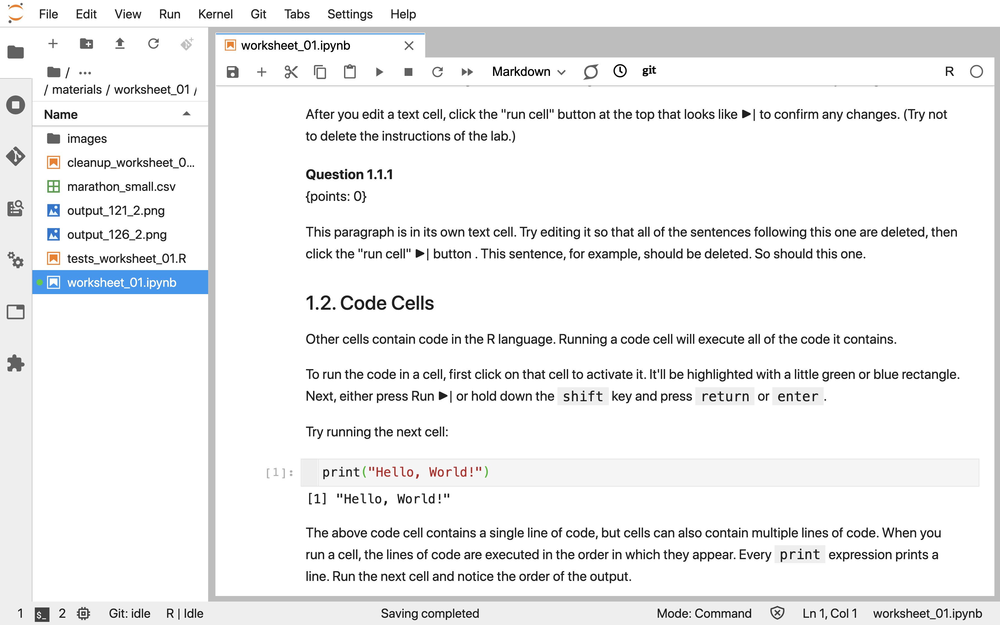

--- 
title: "Introduction to Data Science"
author: 
- Tiffany-Anne Timbers
- Melissa Lee
- Samuel Hinshaw
date: "`r Sys.Date()`"
site: bookdown::bookdown_site
output: bookdown::gitbook
documentclass: book
bibliography: [book.bib, packages.bib]
biblio-style: apalike
link-citations: yes
github-repo: rstudio/bookdown-demo
description: "This is an open source textbook for teaching Introductory Data Science."
---

# Introduction to Data Science

This is an open source textbook aimed at introducing undergraduate students to Data Science. It was originally written for the University of British Columbia's DSCI 100 - Introduction to Data Science course. 

This course uses Jupyter and the R programming language to illustrate how to solve 3 common problems in Data Science:

1. Predicting a class/category for a new observation/measurement (e.g., cancerous or benign tumour)
2. Finding previously unknown/unlabelled subgroups in your data (e.g., products commonly bought together on Amazon)
3. Predicting a value for a new observation/measurement (e.g., 10 km race time for 30-35 year old males with a BMI > 25).

This book/course is structured so that learners spend the first four chapters learning how to use R to load, wrangle/clean and plot data. The remaining 4 chapters cover solutions to the three solutions provided above. 

## Chapter learning objectives

By the end of the chapter, students will be able to:

* use a Jupyter notebook to execute provided R code
* edit code and markdown cells in a Jupyter notebook
* create new code and markdown cells in a Jupyter notebook
* load the `tidyverse` library into R
* create new variables and objects in R using the assignment symbol
* use the help and documentation tools in R
* match the names of the following functions from the `tidyverse` library to their documentation descriptions: 
    - `read_csv` 
    - `select`
    - `mutate`
    - `filter`
    - `ggplot`
    - `aes`
* chain together two functions using the pipe operator, `%>%`

## Jupyter notebooks

Jupyter Notebooks are documents that contain a mix of computer code (and its output) and formattable text. Given that they can mix these two things in a single document (code is not separate from the output or written report), they are one of the leading tools to create reproducible data analysis. The name Jupyter came from combining the names of the three programming language that it was initially targeted for (Julia, Python, and R), and now many other languages can be used with Jupyter notebooks. 

A notebook looks like this:



The best way to learn how to write and run code and formattable text in a Jupyter notebook is to do it. So we have created this worksheet as a step-by-step guide through it: https://github.com/UBC-DSCI/dsci-100/blob/master/materials/worksheet_01/worksheet_01.ipynb


## Loading libraries in R

Often, we want to use code written by others that does not come along as a built-in part of the base R language. If others have made their code easily shareable by "packaging" it up as an R package and submitting it to [CRAN](https://cran.r-project.org/) (a place that hosts, shares and distributes R packages) then we can load it using the `library` function. Specifically, we would write: `library(PACKAGE_NAME)`. Below, we demonstrate how to load the `caret` package (that you will use later in this course for solving the data sceince problems listed above).

```{r load libraries}
library(caret)
```

## Create new variables and objects in R using the assignment symbol

To assign value to an object in R, there are two possible ways - using either the assignment symbol `<-` or the equals symbol `=` (as is done in Python and many other languages). From a style perspective, the assignment symbol is prefered and is what we will use in this course.

Here we use the assignment symbol to create an object named year and assign it the value of 1999:

```{r assignment symbol}
year <- 1999
```

It might seem a bit annoying to type out `<` and `-` instead of just `=` but there is a keyboard shortcut that can be used: 	Alt+- (Windows & Linux) or	Option+- (Mac).

Now that we have an object named `year`, R remembers it and we can do things with it, such as add another number to it, and then print out the value:

```{r doing things with variables}
year <- year + 20
print(year)
```

