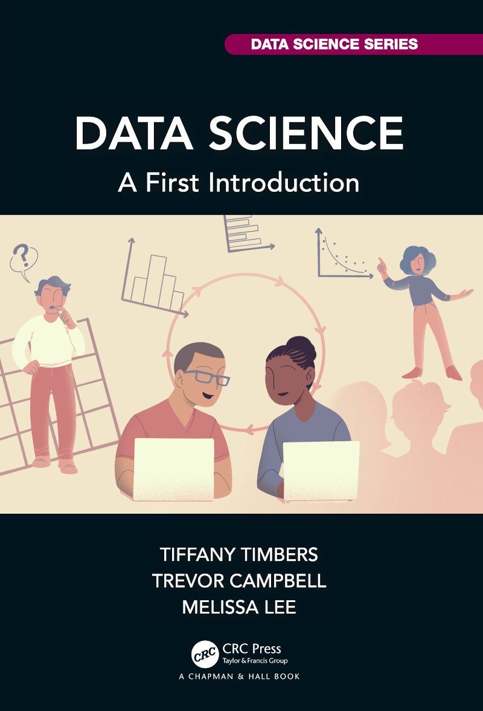

--- 
title: |
     
    Data Science
subtitle: "A First Introduction"
knit: "bookdown::render_book"
author: "Tiffany Timbers, Trevor Campbell, and Melissa Lee"
date: "`r Sys.Date()`"
site: bookdown::bookdown_site
bibliography: [source/references.bib]
link-citations: yes
documentclass: krantz
classoption:
  - krantz2
header-includes: 
- \usepackage{float}
biblio-style: plainnat
colorlinks: yes
lot: yes
lof: yes
fontsize: 12pt
description: "This is a textbook for teaching a first introduction to data science."
always_allow_html: true
graphics: yes
url: https://datasciencebook.ca
github-repo: UBC-DSCI/introduction-to-datascience
---

# Welcome! {-}

This is the [website](https://datasciencebook.ca/) for *Data Science: A First Introduction*. 
You can read the web version of the book on this site. Click a section in the table of contents
on the left side of the page to navigate to it. If you are on a mobile device,
you may need to open the table of contents first by clicking the menu button on 
the top left of the page.
You can purchase a PDF or print copy of the book 
on the [CRC Press website](https://www.routledge.com/Data-Science-A-First-Introduction/Timbers-Campbell-Lee/p/book/9780367524685) or on [Amazon](https://www.amazon.com/Data-Science-First-Introduction-Chapman/dp/0367532174/ref=sr_[…]qid=1644637450&sprefix=data+science+timber%2Caps%2C166&sr=8-1).

```{r bookcover, echo = FALSE, fig.retina = 2, out.width = "45%"}

```


This work by [Tiffany Timbers](https://www.tiffanytimbers.com/), [Trevor Campbell](https://trevorcampbell.me/), 
and [Melissa Lee](https://www.stat.ubc.ca/users/melissa-lee) is licensed under 
a [Creative Commons Attribution-NonCommercial-ShareAlike 4.0 International License](http://creativecommons.org/licenses/by-nc-sa/4.0/).


