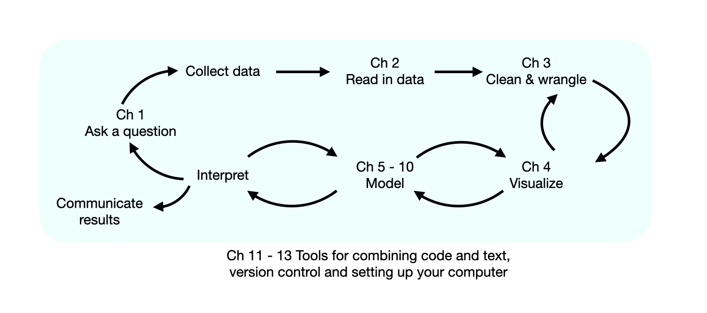

--- 
title: "Data Science: A First Introduction"
author: 
- Tiffany-Anne Timbers
- Trevor Campbell
- Melissa Lee
date: "`r Sys.Date()`"
site: bookdown::bookdown_site
documentclass: book
bibliography: [references.bib]
biblio-style: apalike
link-citations: yes
description: "This is a textbook for teaching a first introduction to data science."
output:
  bookdown::gitbook:
    css: style.css
    config:
      toc:
        before: |
          <li><a href="./">Data Science: A First Introduction</a></li>
        after: |
          <li><a href="https://github.com/rstudio/bookdown" target="blank">Published with bookdown</a></li>
      edit: https://github.com/rstudio/bookdown-demo/edit/master/%s
      download: ["pdf", "epub"]
  bookdown::pdf_book:
    includes:
      in_header: preamble.tex
    latex_engine: xelatex
    citation_package: natbib
    keep_tex: yes
  bookdown::epub_book: default
  always_allow_html: true
---

```{r setup, include=FALSE}
library(forcats)

# read canlang data from GitHub and place it in the data directory
can_lang <- readr::read_csv("https://github.com/ttimbers/canlang/raw/master/inst/extdata/can_lang.csv") %>%
  readr::write_csv("data/can_lang.csv")
```

# R and the tidyverse
## Overview

This textbook aims to be an approachable introduction to the world of data science. 
In this book, we define *data science* as the process of generating
insight from data through reproducible and auditable processes. 
At a high level, in this book, readers will learn how to 

(1) use reproducible tools to do data analysis and 
(2) identify and solve common problems in data science. 

The book is structured, so learners spend the first four chapters learning how 
to use the R programming language [@Rlanguage] to load, wrangle, clean, and visualize data
while answering descriptive and exploratory data analysis questions. The next
six chapters illustrate how to answer
predictive, exploratory and inferential data analysis questions with common methods
in data science, including classification, regression, clustering and estimation.
In the final chapters (\@ref(getting-started-with-jupyter) - \@ref(setting-up-your-own-computer)), 
we discuss how to use Jupyter to edit and write R code, how to use version control for collaboration, and how to install and configure the software needed for data science on your own computer. Readers 
may want to refer to these chapters earlier as they start exploring the examples 
and exercises in this book. Figure \@ref(fig:img-chapter-overview) summarizes a data science pipeline and what you will learn in each chapter of this book.

```{r img-chapter-overview, echo = FALSE, message = FALSE, warning = FALSE, fig.cap = "Where are we going?", out.width="1050", fig.retina = 2}

```

The four common data science methods that are useful for answering predictive, exploratory and inferential data analysis questions covered in this book are:

1. **Classification: predicting a class/category for a new observation.** This could answer a question such as whether a tumour is cancerous or benign given some tumour cell measurements?

2. **Regression: predicting a quantitative value for a new observation.** This could answer a question such as what will be the 10 km race time for a 20-year-old woman with a BMI of 25 who trains four times a week?

3. **Clustering: finding previously unknown/unlabelled subgroups in a dataset**. This could answer a question such as what products commonly bought together on Amazon?

4. **Estimation: make a good guess of an average or a proportion for the wider population from a representative sample (group of people or units), and quantify how good that guess is.** This could answer a question such as what is the proportion of undergraduate students that own an iPhone?

We map each of these methods to the broader type of data analysis question they are useful for answering, as well as discuss what kinds of data are needed to answer such questions [@leek2015question; @peng2015art]. More advanced (*e.g.,* causal or mechanistic) data analysis questions are beyond the scope of this text.


Table: (\#tab:questions-table) Types of data analysis questions

| Question type | Description | Example |
|---------------|-------------|---------|
| Descriptive | A question that asks about summarized characteristics of a data set without interpretation (i.e., report a fact). | How many people live in each province and territory in Canada? |
| Exploratory | A question asks if there are patterns, trends, or relationships within a single data set. Often used to propose hypotheses for future study. | Does political party voting change with indicators of wealth in a set of data collected on 2,000 people living in Canada? |
| Inferential | A question that looks for patterns, trends, or relationships in a single data set **and** also asks for quantification of how applicable these findings are to the wider population. | Does political party voting change with indicators of wealth for all people living in Canada? |
| Predictive | A question that asks about predicting measurements or labels for individuals (people or things). The focus is on what things predict some outcome, but not what causes the outcome. | What political party will someone vote for in the next Canadian election? |
| Causal | A question that asks about whether changing one factor will lead to a change in another factor, on average, in the wider population. | Does wealth lead to voting for a certain political party in Canadian elections? |
| Mechanistic | A question that asks about the underlying mechanism of the observed patterns, trends, or relationships (i.e., how does it happen?) | How does wealth lead to voting for a certain political party in Canadian elections? |

Source: [What is the question?](https://science.sciencemag.org/content/347/6228/1314) by Jeffery T. Leek, Roger D. Peng & [The Art of Data Science](https://leanpub.com/artofdatascience) by Roger Peng & Elizabeth Matsui

## Chapter Learning Objectives

By the end of the chapter, students will be able to:

- load the `tidyverse` package into R
- create new variables and objects in R using the assignment symbol
- use the help and documentation tools in R
- match the names of the following functions from the `tidyverse` package to their documentation descriptions: 
    - `read_csv` 
    - `select`
    - `filter`
    - `arrange`
    - `slice`
    - `ggplot`
    - `aes`

## Ask a question 
Where to begin? As outlined in Figure \@ref(fig:img-chapter-overview), we will start
with a question we want to answer. Generally, we need some context to frame our question. 

Before the arrival of colonists, Indigenous peoples lived in Canada with their
own cultures and many different languages. Many Aboriginal languages are unique
to Canada and not spoken anywhere else in the world [@statcan2018mothertongue].
Sadly, colonization has led to the loss of many Aboriginal languages. For instance,
generations of children were not allowed to speak their mother tongue
(the first language an individual learns in childhood) in Canadian residential 
schools. Colonizers also renamed places they had "discovered" [@wilson2018]. 
Acts such as these have significantly harmed the continuity of Aboriginal languages in Canada, and some languages are considered "endangered" as few people report speaking them. 

> To learn more about Indigenous languages in Canada, check out [Canadian Geographic's article on Mapping Indigenous languages in Canada](https://www.canadiangeographic.ca/article/mapping-indigenous-languages-canada) [@walker2017].

According to the 2016 census, more than 70 Aboriginal languages were reported as being spoken. Suppose we want to ask the question:

*What ten Aboriginal languages were most often reported in 2016 as mother tongues in Canada, and how many people speak each of them?* 

This question is an example of a *descriptive question* since we are summarizing 
the characteristics of a data set without further interpretation. 
 Now that we have asked our question, the next step is collecting or identifying the data set with which we will be working. In this chapter, we will be working with a data set originally from [{canlang} R data package](https://ttimbers.github.io/canlang/) [@timbers2020canlang], which has language data collected in the 2016 Canadian census [@cancensus2016]. 

In this data frame there are 214 rows (corresponding to the 214 languages recorded on the 2016 Canadian census) and 6 columns: 

1. `category`: Higher level language category (describing whether the language is an Official Canadian language, an Aboriginal language, or a Non-Official and Non-Aboriginal language).
2. `language`: Language queried about on the Canadian Census.
3. `mother_tongue`: Total count of Canadians from the Census who reported the language as their mother tongue. Mother tongue is generally defined as the language someone was exposed to since birth.
4. `most_at_home`: Total count of Canadians from the Census who reported the language as spoken most often at home.
5. `most_at_work`: Total count of Canadians from the Census who reported the language as used most often at work for the population.
6. `lang_known`: Total count of Canadians from the Census who reported knowledge of language for the population in private households.


> **A note about the *data* in data science!** 
> Data science cannot be done without a deep understanding of the data and problem domain. In this book, we have simplified the data sets used in our examples to concentrate on concepts. In real life, we cannot and should not do data science without a domain expert. Alternatively, it is common to practice data science in your domain of expertise! Remember that when we work with data, it is essential to think about *how* the data were collected, which affects the conclusions we can draw. If your data are biased, then your results will be biased!

Now that we have asked our question and identified the data we are using, we need to use R to load the data, do some wrangling and visualize the data to answer this question!

## Loading a spreadsheet-like data set

Almost always, the first step in data analysis is to load a data set into R. When we bring rectangular-shaped, spreadsheet-like data (think Microsoft Excel tables) into R, it is represented as a *data frame* object. In figure \@ref(fig:img-spreadsheet-vs-dataframe), we can see an R data frame is very similar to a spreadsheet where the rows are the collected observations, and the columns are the variables. 


```{r img-spreadsheet-vs-dataframe, echo = FALSE, message = FALSE, warning = FALSE, fig.cap = "A spreadsheet versus a data frame in R", out.width="850", fig.retina = 2}
knitr::include_graphics("img/spreadsheet_vs_dataframe.PNG")
```

The first kind of data file that we will learn how to load into R (as a data frame) is the 
spreadsheet-like *comma-separated values* format (`.csv` for short).
These files have names ending in `.csv`, and can be opened and saved using common spreadsheet programs like Microsoft Excel and Google Sheets. 
For example, the `.csv` file named `can_lang.csv` [is included with the code for this book](https://github.com/UBC-DSCI/introduction-to-datascience/blob/master/data/can_lang.csv). 
If we were to open this data in a plain text editor, we would see each row on its own line, and each entry in the table separated by a comma:

```{bash, echo=FALSE, comment=NA}
head -n 10 data/can_lang.csv
```

To load this data into R, so that we can do things with it (*e.g,* perform analyses or create data visualizations), we will need to use a *function.* 
A function is a special word in R that takes instructions (we call these *arguments*) and does something. The function we will 
use to read a `.csv` file into R is called `read_csv`.

In its most basic use-case, `read_csv` expects that the data file:

- has column names (or *headers*),
- uses a comma (`,`) to separate the columns, and
- does not have row names.


Below you'll see the code used to load the data into R using the `read_csv` 
function. However, given that `read_csv` is not included in the base 
installation of R, we will have to load it from somewhere else before we can use
it. The place we will load it from is an R package. An R package is a collection
of functions that once loaded, can be used in addition to the built-in R package
functions. The `read_csv` function, in particular, can be made accessible 
through loading the `tidyverse` package [@wickham2019tidverse] (more on this later), using the 
`library` function.

After loading the `tidyverse` package, we can call the `read_csv` function and 
pass it a single argument: the name of the file, `"can_lang.csv"`. We have to put quotes around file names and other letters and words that we use in our code to distinguish it from the special words that make up the R programming language.  The file's name is the only argument we need to provide because our file satisfies everything else the `read_csv` function expects in the default use-case (which we just discussed). Later in the course, we'll learn more about dealing with more complicated files where the default arguments are not appropriate, for example, files that use spaces or tabs to separate the columns instead of commas.

```{r load_can_lang_data, warning=FALSE, message=FALSE}
library(tidyverse)
read_csv("data/can_lang.csv")
```


> **In case you want to know more (optional):** 
> We use the `read_csv` function from the `tidyverse` instead of the base R function `read.csv` because it's faster, and it creates a nicer variant of the base R data frame called a *tibble*. 
> This has several benefits that we'll discuss in further detail later in the course.

## Naming things in R

When we loaded the language data collected in the 2016 Canadian census 
above using `read_csv`, we did not give this data frame a name. 
Therefore the data was just printed on the screen, 
and we cannot do anything else with it. That isn't very useful. 
What would be more useful would be to give a name 
to the data frame that `read_csv` outputs, 
so that we could refer to it later for analysis and visualization.

There are two possible ways to assign a name to something in R ---
using either the assignment symbol (`<-`) or the equals symbol (`=`). 

```{r naming-things}
first_name <- "Naming using the assignment symbol"
second_name = "Naming using the equals symbol"
```
From a style perspective, the assignment symbol is preferred 
and is what we will use in this course. 
When we name something in R using the assignment symbol, `<-`, 
we do not need to surround the name we are giving (on `<-`'s left-hand side) 
with quotes, like the file name, 
because we are formally telling R about this new word and giving it a value. 
Only characters and words that act as values (on `<-`'s right-hand side) 
need to be surrounded by quotes.

Object names can consist of letters, numbers, periods `.` and underscores `_`. 
Though there are certain conventions for naming objects in R. When naming an object we
suggest using only lower case letters, numbers and underscores `_` to separate the words in a name. 
R is case sensitive, which means that `Letter` and `letter` would be two different 
objects in R. 
You should also try to give your objects meaningful names.
For instance, you *can* name a data frame `x`. 
However, using more meaningful terms, such as `language_data`, will help you remember what each name in your code represents. 
We recommend following the Tidyverse naming conventions outlined in the [Tidyverse Style Guide](https://principles.tidyverse.org/names-attribute.html#universal-names) [@tidyversestyleguide]. 

Let's now use the assignment symbol to give the name `can_lang` 
to the 2016 Canadian census language data frame that we get from `read_csv`. 

```{r load_data_with_name, message=FALSE}
can_lang <- read_csv("data/can_lang.csv")
```

Wait a minute, nothing happened this time! Or at least it looks like that? 
But actually, something did happen! The data was read in 
and now has the name `can_lang` associated with it. 
And we can use that name to access the data frame and do things with it. 
We can type the name of the data frame to print the first few rows 
on the screen.


```{r print}
can_lang
```


## Creating subsets of data frames with `filter` & `select`

Now, we are going to learn how to obtain subsets of data from a data frame in R using two other `tidyverse` functions: `select` and `filter`. The `select` function allows you to create a subset of the columns of a data frame, while the `filter` function allows you to obtain a subset of the rows with specific values.

Let's take a look at the language data collected in the 2016 Canadian census again to familiarize ourselves with it. We will do this by printing the data we loaded earlier in the chapter to the screen. 
```{r print_data_again}
can_lang
```

### Using `filter` to extract rows
Looking at our `can_lang` data, we see the column `category` contains 
different high-level categories of languages, which include "Aboriginal languages",
"Non-Official & Non-Aboriginal languages" and "Official languages". 
To answer our question (what ten Aboriginal languages were most often reported in 2016 as mother tongues in Canada, and how many people speak each of them?) we 
want to filter our data set so we restrict our attention to only the languages in the "Aboriginal languages" category. 

We can use the `filter` function to obtain
the subset of rows with desired values from a data frame. Our first 
argument is the name of the data frame object, `can_lang`. The second argument
is a logical statement to use when filtering the rows. We are interested 
in looking at the languages in the "Aboriginal languages" higher-level category 
in this data set. To filter only those rows, we use the *equivalency operator* `==` to compare the values of the `category` column with the value `"Aboriginal languages"`. 
Similar to when we loaded the data file and put quotes around the filename, 
here we need to put quotes around `"Aboriginal languages"`. Using quotes tells R
that this is a character value and not one of the special words that make up R
programming language, nor one of the names 
we have given to data frames in the code we have already written.

With these arguments, `filter` returns a data frame that has all the columns of the input data frame but only the rows we asked for in our logical filter statement. 

```{r}
aboriginal_lang <- filter(can_lang, category == "Aboriginal languages")
aboriginal_lang
```
It's good practice to check the output we get makes sense after we perform a function in R. We can see the original `can_lang` data set contained 214 rows with categories other than just "Aboriginal languages". The data frame `aboriginal_lang` contains 67 rows and looks like it only contains languages in the "Aboriginal languages" in the `category` column, which is what we want!

### Using `select` to extract columns

Now let's use `select` to extract the `language` and `mother_tongue` columns from this data frame. To extract tese columns, we need to provide the `select` function with three arguments. The first argument is the 
name of the data frame object, which in this example is `aboriginal_lang`. The second and third arguments are the column names that we want to select, here `language` and `mother_tongue`. After passing these three arguments,
the  `select` function returns two columns (the `language` and `mother_tongue` columns that we asked for) as a data frame.


```{r}
selected_lang <- select(aboriginal_lang, language, mother_tongue)
selected_lang
```
> Note: we didn't actually *need* to `select` the columns in our data frame before moving on to the next step! However, `select` allows us to display only the columns in the data frame we want and can make it easier for us to view the data especially if we have a large data frame with lots of columns. 

### Using `arrange` to order and `slice` to select rows by index number

The  `arrange` function allows us to order the rows of a data frame by the values of a selected column. We need to pass the data frame, and the variable to order by in the first two arguments of this function. Since we want to choose the ten Aboriginal languages most often reported as a mother tongue language, we will use the `arrange` function to order the rows in our `selected_lang` data frame by the `mother_tongue` column. We want to order the rows in descending order (from largest to smallest) so we include `desc` before the column name `mother_tongue` to sort in descending order. 

```{r}
arranged_lang <- arrange(selected_lang, by = desc(mother_tongue))
arranged_lang
```

Next we will use the `slice` function, which selects rows according to their row number. Since we want to choose ten languages, we will indicate we want the rows 1 to 10 using the argument `1:10`.
```{r}
ten_lang <- slice(arranged_lang, 1:10)
ten_lang
```

We have now answered our initial question by generating this frequency table! Are we done? Technically, this table answers our question. However, we can go one step further and create a visualization to answer our question as well. Visualizations are a great tool for summarizing information to help you effectively communicate with your audience. While tables are great for displaying information, a visualization can sometimes provide more insight. For example, if we were really interested in *comparing* the values between the different languages (e.g. how many more people reported "Cree, n.o.s." versus "Inuktitut" versus "Ojibway" etc.), then a visualization is a more effective way to communicate your results than a frequency table. 


## Exploring data with visualizations
Creating effective data visualizations is an essential piece to any data analysis. We will develop a visualization of the language data collected in the 2016 Canadian census we’ve been working with to help us understand the ten Aboriginal languages that were most often reported in 2016 as mother tongues in Canada and the number of people that speak each of them.

### Using `ggplot` to create a bar plot

In our data set, we can see that our variables--- language (`language`) and mother tongue (`mother_tongue`) ---are in separate columns. In addition, there is a single row (or observation) for each language. The data are, therefore, in what we call a *tidy data* format. Tidy data is a fundamental concept and will be a significant focus in the remainder of this course: many of the functions from `tidyverse` require tidy data, including the `ggplot` function that we will use shortly for our visualization. We will formally introduce this concept in chapter 3.


We will make a bar plot to visualize our data. A bar plot is a chart where the heights of the bars represent certain values, like counts or proportions. We will make a bar plot using the `most_at_home` and `language` columns from our `ten_lang` data frame.
To create a bar plot of these two variables using the `ggplot` function, we would the following: 

```{r img-ggplot, echo = FALSE, message = FALSE, warning = FALSE, fig.cap = "Creating a bar plot with the ggplot function", out.width="1100", fig.retina = 2}
knitr::include_graphics("img/ggplot_function.jpeg")
```

In Figure \@ref(fig:barplot-mother-tongue), we create a bar plot using the `ggplot` function following the instructions described in figure \@ref(fig:img-ggplot):

```{r barplot-mother-tongue, fig.width=5.75, fig.height=4, warning=FALSE, fig.cap = "Bar plot of the ten Aboriginal languages most often reported by Canadians as their mother tongue"}
ggplot(ten_lang, aes(x = language, y = mother_tongue)) +
  geom_bar(stat = "identity")
```

> **In case you have used R before and are curious:** 
> There are a small number of situations in which you can have a single R expression span multiple lines. 
> Here, the `+` symbol at the end of the first line tells R that the expression isn't done yet and to
> continue reading on the following line. While not strictly necessary, this sort of pattern will appear a 
> lot when using `ggplot` as it keeps things more readable.


### Formatting ggplot objects

It is exciting that we can already visualize our data to help answer our question, but we are not done yet! We can (and should) do more to improve the interpretability of the data visualization that we created. For example, by default, R uses the column names as the axis labels. However, usually, these column names do not have enough information about the variable in the column. We really should replace this default with a more informative label. For the example above, R uses the column name `mother_tongue` as the label for the y-axis, but most people will not know what that is. And even if they did, they will not know how we measure this variable, nor which group of people the measurements were taken. An axis label that reads "Mother tongue (Number of Canadians residents)" would be much more informative.

Adding additional layers to our visualizations that we create in `ggplot` is one common and easy way to improve and refine our data visualizations. New layers are added to `ggplot` objects using the `+` symbol. For example, we can use the `xlab` and `ylab` functions to add layers where we specify meaningful and informative labels for the x and y axes. Again, since we are specifying words (e.g. `"Mother tongue (Number of Canadians residents)"`) as arguments to `xlab` and `ylab`, we surround them with double-quotes. We can add many more layers to format the plot further, and we will explore these in later chapters.

```{r barplot-mother-tongue-labs, fig.width=5.75, fig.height=4, warning=FALSE, fig.cap = "Bar plot of the ten Aboriginal languages most often reported by Canadians as their mother tongue with x and y labels"}
ggplot(ten_lang, aes(x = language, y = mother_tongue)) +
  geom_bar(stat = "identity") +
  xlab("Language") +
  ylab("Mother tongue (Number of Canadians residents)")
```

In figure \@ref(fig:barplot-mother-tongue-labs), the x labels overlap, making it challenging to read the different languages. One solution is to rotate the plot, so the bars are horizontal, and thus the labels will be more readable. We can again add additional layers to the plot object using the `+` symbol to add the `coord_flip` function, which swaps the x and y coordinate axes:

```{r barplot-mother-tongue-flipped, fig.width=5.75, fig.height=4, warning=FALSE, fig.cap = "Horizontal bar plot of the ten Aboriginal languages most often reported by Canadians as their mother tongue"}
ggplot(ten_lang, aes(x = language, y = mother_tongue)) +
  geom_bar(stat = "identity") +
  xlab("Language") +
  ylab("Mother tongue (Number of Canadians residents)") +
  coord_flip()
```


From figure \@ref(fig:barplot-mother-tongue-flipped), we have answered our initial question. However, our visualization could be made more transparent by organizing the bars according to the number of Canadian residents reporting each language rather than in alphabetical order. We can reorder the bars using the `reorder` function, which orders a variable (here `language`) based on the values of the second variable (`mother_tongue`):

```{r barplot-mother-tongue-reorder, fig.width=5.75, fig.height=4, warning=FALSE, fig.cap = "Bar plot of the ten Aboriginal languages most often reported by Canadians as their mother tongue with bars reordered"}
ggplot(ten_lang, aes(x = reorder(language, mother_tongue), y = mother_tongue)) +
  geom_bar(stat = "identity") +
  xlab("Language") +
  ylab("Mother tongue (Number of Canadians residents)") +
  coord_flip()
```

From figure \@ref(fig:barplot-mother-tongue-reorder), we have answered our question since we can see what the ten most often reported Aboriginal languages were according to the 2016 Candian census and how many people speak them. For instance, we can see that the Aboriginal language most often reported was Cree n.o.s. with over 60,000 Canadian residents reporting it as their mother tongue.

> "n.o.s." means "not otherwise specified", so Cree n.o.s. refers to individuals who reported Cree as their mother tongue. In this data set, the Cree languages include the following categories: Cree n.o.s., Swampy Cree, Plains Cree, Woods Cree, and a 'Cree not included elsewhere' category (which includes Moose Cree, Northern East Cree and Southern East Cree)  [@language2018]. 

Learning how to describe data visualizations is a very useful skill. We will provide descriptions for you in this course (as we did above) until we get to Chapter 4, which focuses on data visualization. Then, we will explicitly teach you how to do this yourself and not over-state or over-interpret the results from a visualization.

### Putting it all together

In the code chunk below, we put everything from this chapter together. We have added a few more layers to make the data visualization even more effective. Specifically, we changed the colour of the bars and changed the background from grey to white to improve the contrast. Note that we actually skipped the `select` step that we did above just to show you that we didn't actually need to `select` the columns to create the visualization! 

> Notice that we provided *comments* beside some of the code below using the hashtag symbol `#`. You can use comments to explain lines of code for others or yourself in the future! If R sees a `#` sign, it will ignore all the code that comes after it on that line. It's good practice to get in the habit of commenting your code to improve your code's readability.

```{r nachos-to-cheesecake, fig.width=7.75, fig.height=4, warning=FALSE, message=FALSE, fig.cap = "Putting it all together: Bar plot of the ten Aboriginal languages most often reported by Canadians as their mother tongue"}
library(tidyverse)

can_lang <- read_csv("data/can_lang.csv")

aboriginal_lang <- filter(can_lang, category == "Aboriginal languages")
arranged_lang <- arrange(aboriginal_lang, by = desc(mother_tongue))
ten_lang <- slice(arranged_lang, 1:10)

ggplot(ten_lang, aes(
  x = reorder(language, mother_tongue),
  y = mother_tongue
)) +
  geom_bar(stat = "identity", fill = "steelblue") +
  xlab("Language") +
  ylab("Mother tongue (Number of Canadians residents)") +
  coord_flip() +
  theme_bw() # use a theme to have a white background
```

This exercise demonstrates the power of R. In relatively few lines of code, we performed an entire data science workflow with a highly effective data visualization! We asked a question, read the data into R, wrangled the data (using `filter`, `arrange` and `slice`) and created a data visualization to help answer our question.  In this chapter, you got a quick taste of the data science workflow, but we will learn each of these steps in more detail in the coming chapters! 
