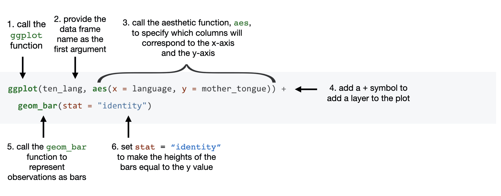
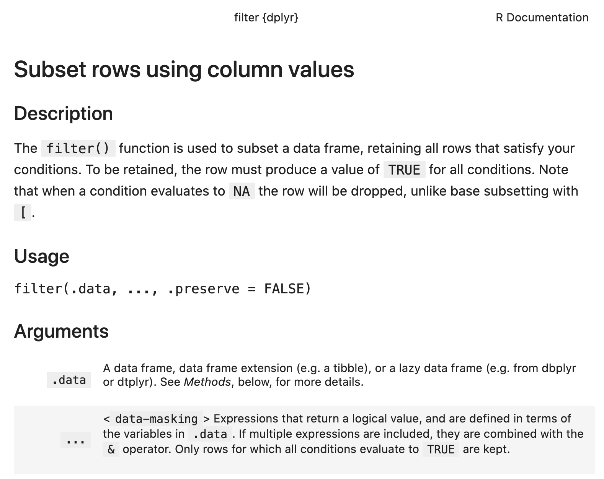

# R and the tidyverse {#intro}
## Overview

This chapter provides an introduction to data science and the R programming language.
The goal here is to get your hands dirty right from the start: we will walk through an entire data analysis,
and along the way introduce different types of data analysis questions, some fundamental programming 
concepts in R, and the basics of loading, cleaning, and visualizing data. In the following chapters, we will
dig into each of these steps in much more detail; but for now, let's jump in to see how much we can do 
with data science!

## Chapter learning objectives

By the end of the chapter, readers will be able to:

- identify the different types of data analysis question and categorize a question into the correct type
- load the `tidyverse` package into R
- read tabular data with `read_csv`
- use `?` to access help and documentation tools in R
- create new variables and objects in R using the assignment symbol
- create and organize subsets of tabular data using `filter`, `select`, `arrange`, and `slice`
- visualize data with a `ggplot` bar plot

## Canadian languages data set

In this chapter, we will walk through a full analysis of a data set relating to
languages spoken at home by Canadians. Many Indigenous peoples exist in Canada 
with their own cultures and languages; these languages are often unique to Canada and not spoken
anywhere else in the world [@statcan2018mothertongue]. Sadly, colonization has
led to the loss of many of these languages. For instance, generations of
children were not allowed to speak their mother tongue (the first language an
individual learns in childhood) in Canadian residential schools. Colonizers
also renamed places they had "discovered" [@wilson2018].  Acts such as these
have significantly harmed the continuity of Indigenous languages in Canada, and
some languages are considered "endangered" as few people report speaking them. 
To learn more, please see Canadian Geographic's article on 
[Mapping Indigenous languages in Canada](https://www.canadiangeographic.ca/article/mapping-indigenous-languages-canada)
[@walker2017], [They Came for the Children: Canada, Aboriginal peoples, and Residential Schools](http://publications.gc.ca/site/archivee-archived.html?url=http://publications.gc.ca/collections/collection_2012/cvrc-trcc/IR4-4-2012-eng.pdf) [@children2012] 
and the Truth and Reconciliation Commission of 
Canada's [Calls to Action](http://trc.ca/assets/pdf/Calls_to_Action_English2.pdf) [@calls2015].

The data set we will study in this chapter is taken from 
[the {canlang} R data package](https://ttimbers.github.io/canlang/) [@timbers2020canlang], which has
population language data collected during the 2016 Canadian census [@cancensus2016]. 
In this data there are 214 languages recorded, each having 6 different properties:

1. `category`: Higher-level language category, describing whether the language is an Official Canadian language, an Aboriginal (i.e., Indigenous) language, or a Non-Official and Non-Aboriginal language.
2. `language`: The name of the language.
3. `mother_tongue`: Number of Canadians who reported the language as their mother tongue. Mother tongue is generally defined as the language someone was exposed to since birth.
4. `most_at_home`: Number of Canadians who reported the language as being spoken most often at home.
5. `most_at_work`: Number of Canadians who reported the language as being used most often at work.
6. `lang_known`: Number of Canadians who reported knowledge of the language.

According to the census, more than 60 Indigenous languages were reported
as being spoken in Canada. Suppose we want to know which are the most critically endangered;
then we might ask the following question, which we wish to answer using our data: 

*Which ten Indigenous languages were least often reported in 2016 as mother
tongues in Canada, and how many people speak each of them?* 

> **A note about the *data* in data science!** 
> Data science cannot be done without a deep understanding of the data and
> problem domain. In this book, we have simplified the data sets used in our
> examples to concentrate on methods and fundamental concepts. But in real
> life, you cannot and should not do data science without a domain expert.
> Alternatively, it is common to practice data science in your own domain of
> expertise! Remember that when you work with data, it is essential to think
> about *how* the data were collected, which affects the conclusions you can
> draw. If your data are biased, then your results will be biased!

## Asking a question 

Every good data analysis begins with a *question*—like the
above—that you aim to answer using data. As it turns out, there
are actually a number of different *types* of question regarding data:
descriptive, exploratory, inferential, predictive, causal, and mechanistic,
all of which are defined in Table \@ref(tab:questions-table).
Carefully formulating a question as early as possible in your analysis—and 
correctly identifying which type of question it is—will guide your overall approach to 
the analysis as well as the selection of appropriate tools.

Table: (\#tab:questions-table) Types of data analysis question. From [What is the question?](https://science.sciencemag.org/content/347/6228/1314) [@leek2015question] and [The Art of Data Science](https://leanpub.com/artofdatascience) [@peng2015art].

| Question type | Description | Example |
|---------------|-------------|---------|
| Descriptive | A question that asks about summarized characteristics of a data set without interpretation (i.e., report a fact). | How many people live in each province and territory in Canada? |
| Exploratory | A question asks if there are patterns, trends, or relationships within a single data set. Often used to propose hypotheses for future study. | Does political party voting change with indicators of wealth in a set of data collected on 2,000 people living in Canada? |
| Predictive | A question that asks about predicting measurements or labels for individuals (people or things). The focus is on what things predict some outcome, but not what causes the outcome. | What political party will someone vote for in the next Canadian election? |
| Inferential | A question that looks for patterns, trends, or relationships in a single data set **and** also asks for quantification of how applicable these findings are to the wider population. | Does political party voting change with indicators of wealth for all people living in Canada? |
| Causal | A question that asks about whether changing one factor will lead to a change in another factor, on average, in the wider population. | Does wealth lead to voting for a certain political party in Canadian elections? |
| Mechanistic | A question that asks about the underlying mechanism of the observed patterns, trends, or relationships (i.e., how does it happen?) | How does wealth lead to voting for a certain political party in Canadian elections? |

In this book, you will learn techniques to answer the 
first four types of question: descriptive, exploratory, predictive, and inferential; 
causal and mechanistic questions are beyond the scope of this book.
In particular, you will learn how to apply the following analysis tools:

1. **Summarization:** computing and reporting aggregated
values pertaining to a data set. 
Summarization is most often used to answer descriptive questions,
and can occasionally help with answering exploratory questions.
For example, you might use summarization to answer the following question: 
*what is the average race time for runners in this data set?*
Tools for summarization are covered in detail in Chapters \@ref(reading)
and \@ref(wrangling), but appear regularly throughout the text.
2. **Visualization:** plotting data graphically. 
Visualization is typically used to answer descriptive and exploratory questions,
but plays a critical supporting role in answering all of the types of question in Table \@ref(tab:questions-table).
For example, you might use visualization to answer the following question:
*is there any relationship between race time and age for runners in this data set?* 
This is covered in detail in Chapter \@ref(viz), but again appears regularly throughout the book.
3. **Classification:** predicting a class or category for a new observation.
Classification is used to answer predictive questions.
For example, you might use classification to answer the following question:
*given measurements of a tumour's average cell area and perimeter, is the tumour benign or malignant?*
Classification is covered in Chapters \@ref(classification) and \@ref(classification2).
4. **Regression:** predicting a quantitative value for a new observation. 
Regression is also used to answer predictive questions.
For example, you might use regression to answer the following question:
*what will be the race time for a 20-year-old runner who weighs 50kg?*
Regression is covered in Chapters \@ref(regression1) and \@ref(regression2).
5. **Clustering:** finding previously unknown/unlabelled subgroups in a
dataset. Clustering is often used to answer exploratory questions.
For example, you might use clustering to answer the following question:
*what products are commonly bought together on Amazon?*
Clustering is covered in Chapter \@ref(clustering).
6. **Estimation:** taking measurements for small number of items from a large group 
 and making a good guess for the average or proportion for the large group. Estimation 
is used to answer inferential questions.
For example, you might use estimation to answer the following question:
*Given a survey of cellphone ownership of 100 Canadians, what proportion
of the entire Canadian population own Android phones?* 
Estimation is covered in Chapter \@ref(inference).

Referring to Table \@ref(tab:questions-table), our question about 
rare languages is an example of a *descriptive question*: we are
summarizing the characteristics of a data set without further interpretation.
And referring to the list above, it looks like we should use visualization
and perhaps some summarization to answer the question. So in the remainder
of this chapter, we will work towards making a visualization that shows 
us the ten rarest Indigenous languages in Canada and their associated counts,
according to the 2016 census. 

## Loading a tabular data set
A data set is, at its core essence, a structured collection of numbers and characters.
Aside from that, there are really no strict rules; data sets can come in 
many different forms! Perhaps the most common form of data set that you will
find in the wild, however, is *tabular data*. Think spreadsheets in Microsoft Excel: tabular data are
rectangular-shaped and spreadsheet-like, as shown in Figure
\@ref(fig:img-spreadsheet-vs-dataframe). In this book, we will focus primarily on tabular data.

Since we are using R for data analysis in this book, the first step for us is to
load the data into R. When we load tabular data into
R, it is represented as a *data frame* object. Figure
\@ref(fig:img-spreadsheet-vs-dataframe) shows that an R data frame is very similar
to a spreadsheet. We refer to the rows as **observations**; these are the things that we
collect the data on, e.g., voters, cities, etc. We refer to the columns as
**variables**; these are the characteristics of those observations, e.g., voters' political
affiliations, cities' populations, etc. 


```{r img-spreadsheet-vs-dataframe, echo = FALSE, message = FALSE, warning = FALSE, fig.cap = "A spreadsheet versus a data frame in R", out.width="850", fig.retina = 2}
knitr::include_graphics("img/spreadsheet_vs_dataframe.PNG")
```

The first kind of data file that we will learn how to load into R as a data
frame is the *comma-separated values* format (`.csv` for short).  These files
have names ending in `.csv`, and can be opened and saved using common
spreadsheet programs like Microsoft Excel and Google Sheets.  For example, the
`.csv` file named `can_lang.csv` 
[is included with the code for this book](https://raw.githubusercontent.com/UBC-DSCI/introduction-to-datascience/master/data/can_lang.csv).
If we were to open this data in a plain text editor (a program like Notepad that just shows
text with no formatting), we would see each row on its own line, and each entry in the table separated by a comma:

```{bash, echo=FALSE, comment=NA}
head -n 10 data/can_lang.csv
```

To load this data into R so that we can do things with it (e.g, perform
analyses or create data visualizations), we will need to use a *function.* A
function is a special word in R that takes instructions (we call these
*arguments*) and does something. The function we will use to load a `.csv` file
into R is called `read_csv`. In its most basic 
use-case, `read_csv` expects that the data file:

- has column names (or *headers*),
- uses a comma (`,`) to separate the columns, and
- does not have row names.


Below you'll see the code used to load the data into R using the `read_csv`
function. Note that the `read_csv` function is not included in the base
installation of R, meaning that it is not one of the primary functions ready to
use when you install R. Therefore, you need to load it from somewhere else
before you can use it. The place from which we will load it is called an R *package*. 
An R package is a collection of functions that can be used in addition to the
built-in R package functions once loaded. The `read_csv` function, in
particular, can be made accessible by loading the `tidyverse` package [@wickham2019tidverse]
using the `library` function. The `tidyverse` package contains many
functions that we will use throughout this book to load, clean, wrangle, 
and visualize data. 

```{r load_tidyverse, message = TRUE, warning = TRUE}
library(tidyverse)
```
> **In case you want to know more (optional):** Notice that we got some extra
> output from R saying `Attaching packages` and `Conflicts` below our code
> line. These are examples of *messages* in R, which give the user more
> information that might be handy to know. The `Attaching packages` message is
> natural when loading `tidyverse`, since `tidyverse` actually automatically
> causes other packages to be imported too, such as `dplyr`.  In the future
> when we load `tidyverse` in this book we will silence these messages to help
> with readability of the book.  The `Conflicts` message is also totally normal
> in this circumstance.  This message tells you if functions from different
> packages share the same name, which is confusing to R.  For example, in this
> case, the `dplyr` package and the `stats` package both provide a function
> called `filter`. The message above (`dplyr::filter() masks stats::filter()`)
> is R telling you that it is going to default to the `dplyr` package version
> of this function. So if you use the `filter` function, you will be using the
> `dplyr` version. In order to use the `stats` version, you need to use its
> full name `stats::filter`.  Messages are not errors, so generally you don't
> need to take action when you see a message; but you should always read the message
> and critically think about what it means and whether you need to do anything
> about it.

After loading the `tidyverse` package, we can call the `read_csv` function and
pass it a single argument: the name of the file, `"can_lang.csv"`. We have to
put quotes around file names and other letters and words that we use in our
code to distinguish it from the special words (like functions!) that make up the R programming
language.  The file's name is the only argument we need to provide because our
file satisfies everything else that the `read_csv` function expects in the default
use-case.

```{r load_can_lang_data, warning=F, message=F}
read_csv("data/can_lang.csv")
```

> **In case you want to know more (optional):** There is another function
> that also loads csv files named `read.csv`. We will *always* use 
> `read_csv` in this book, as it is designed to play nicely with all of the 
> other `tidyverse` functions, which we will use extensively in this book. Be
> careful not to accidentally use `read.csv`, as it can cause some tricky
> errors to occur in your code that are hard to track down!

## Naming things in R

When we loaded the language data collected in the 2016 Canadian census 
above using `read_csv`, we did not give this data frame a name. 
Therefore the data was just printed on the screen, 
and we cannot do anything else with it. That isn't very useful. 
What would be more useful would be to give a name 
to the data frame that `read_csv` outputs, 
so that we could refer to it later for analysis and visualization.

There are two possible ways to assign a name to something in R ---
using either the assignment symbol (`<-`) or the equals symbol (`=`). 

```{r naming-things}
first_name <- "Naming using the assignment symbol"
second_name = "Naming using the equals symbol"
```
From a style perspective, the assignment symbol is preferred 
and is what we will use in this book. 
When we name something in R using the assignment symbol, `<-`, 
we do not need to surround the name we are giving (on `<-`'s left-hand side) 
with quotes, like the file name, 
because we are formally telling R about this new word and giving it a value. 
Only characters and words that act as values (on `<-`'s right-hand side) 
need to be surrounded by quotes.

Object names can consist of letters, numbers, periods `.` and underscores `_`.
Other symbols won't work since they have their own meanings in R. For example,
`+` is an addition symbol used to add numbers. If we try to assign a name with
the `+` symbol to an object R will complain and we will get an error!

```{r, eval = F}
name+ <- 1
```
```
Error: unexpected assignment in "name+ <-"
```

There are certain conventions for naming objects in R. When naming an object we
suggest using only lower case letters, numbers and underscores `_` to separate
the words in a name.  R is case sensitive, which means that `Letter` and
`letter` would be two different objects in R.  You should also try to give your
objects meaningful names.  For instance, you *can* name a data frame `x`.
However, using more meaningful terms, such as `language_data`, will help you
remember what each name in your code represents.  We recommend following the
Tidyverse naming conventions outlined in the [Tidyverse Style
Guide](https://principles.tidyverse.org/names-attribute.html#universal-names)
[@tidyversestyleguide].  Let's now use the assignment symbol to give the name
`can_lang` to the 2016 Canadian census language data frame that we get from
`read_csv`. 

```{r load_data_with_name, message=FALSE}
can_lang <- read_csv("data/can_lang.csv")
```

Wait a minute, nothing happened this time! Or at least it looks like that? 
But actually, something did happen! The data was loaded in 
and now has the name `can_lang` associated with it. 
And we can use that name to access the data frame and do things with it. 
We can type the name of the data frame to print the first few rows 
on the screen.


```{r print}
can_lang
```


## Creating subsets of data frames with `filter` & `select`

Now that we've loaded our data into R, we can start wrangling the data to
answer our question, *what ten Aboriginal languages were most often reported in
2016 as mother tongues in Canada, and how many people speak each of them?* To
answer this question, we can construct a table with the ten Aboriginal
languages that have highest counts in the `mother_tongue` column. 

The `select` and `filter` functions from the `tidyverse` package will help us
here. The `select` function allows you to create a subset of the columns of a
data frame, while the `filter` function allows you to obtain a subset of the
rows with specific values. Therefore, we can `filter` rows for only the
Aboriginal languages in the data set and then use `select` to obtain only the
columns we want to include in our table.

Let's take a look at the language data collected in the 2016 Canadian census
again to familiarize ourselves with it. We will do this by printing the data we
loaded earlier in the chapter to the screen. 
```{r print_data_again}
can_lang
```

### Using `filter` to extract rows
Looking at our `can_lang` data, we see the column `category` contains different
high-level categories of languages, which include "Aboriginal languages",
"Non-Official & Non-Aboriginal languages" and "Official languages".  To answer
our question (what ten Aboriginal languages were most often reported in 2016 as
mother tongues in Canada, and how many people speak each of them?) we want to
filter our data set so we restrict our attention to only the languages in the
"Aboriginal languages" category. 

We can use the `filter` function to obtain the subset of rows with desired
values from a data frame. Our first argument is the name of the data frame
object, `can_lang`. The second argument is a logical statement to use when
filtering the rows. We are interested in looking at the languages in the
"Aboriginal languages" higher-level category in this data set and to filter
only those rows, we use the *equivalency operator* `==` to compare the values
of the `category` column with the value `"Aboriginal languages"`.  Similar to
when we loaded the data file and put quotes around the filename, here we need
to put quotes around `"Aboriginal languages"`. Using quotes tells R that this
is a character value and not one of the special words that make up R
programming language, nor one of the names we have given to data frames in the
code we have already written.


> What's a logical statement? A logical statement is a sentence that is `TRUE`
> or `FALSE`. For example, `1 > 2` is  logical statement. If you type this
> statement into R, you are asking R "Is the number 1 greater than 2?" and you
> will get `FALSE` as your answer. 

With these arguments, `filter` returns a data frame that has all the columns of
the input data frame but only the rows we asked for in our logical filter
statement. 

```{r}
aboriginal_lang <- filter(can_lang, category == "Aboriginal languages")
aboriginal_lang
```
It's good practice to check the output we get makes sense after we perform a
function in R. We can see the original `can_lang` data set contained 214 rows
with categories other than just "Aboriginal languages". The data frame
`aboriginal_lang` contains 67 rows and looks like it only contains languages in
the "Aboriginal languages" in the `category` column, which is what we want!

### Using `select` to extract columns

Now let's use `select` to extract the `language` and `mother_tongue` columns
from this data frame. To extract these columns, we need to provide the `select`
function with three arguments. The first argument is the name of the data frame
object, which in this example is `aboriginal_lang`. The second and third
arguments are the column names that we want to select, here `language` and
`mother_tongue`. After passing these three arguments, the  `select` function
returns two columns (the `language` and `mother_tongue` columns that we asked
for) as a data frame.


```{r}
selected_lang <- select(aboriginal_lang, language, mother_tongue)
selected_lang
```
> Note: we didn't actually *need* to `select` the columns in our data frame
> before moving on to the next step! However, `select` allows us to display
> only the columns in the data frame we want and can make it easier for us to
> view the data especially if we have a large data frame with lots of columns. 

### Using `arrange` to order and `slice` to select rows by index number

We have used `filter` and `select` to obtain a table with only the Aboriginal
languages in the data set and their associated counts. However, we want to know
the **ten** languages that are spoken most often. As a next step, we could
order the `mother_tongue` column from greatest to least and then select only
the top ten rows. This is where the `arrange` and `slice` functions come to the
rescue! 

The  `arrange` function allows us to order the rows of a data frame by the
values of a selected column. We need to pass the data frame, and the variable
to order by in the first two arguments of this function. Since we want to
choose the ten Aboriginal languages most often reported as a mother tongue
language, we will use the `arrange` function to order the rows in our
`selected_lang` data frame by the `mother_tongue` column. We want to order the
rows in descending order (from largest to smallest) so we include `desc` before
the column name `mother_tongue` to sort in descending order. 

```{r}
arranged_lang <- arrange(selected_lang, by = desc(mother_tongue))
arranged_lang
```

Next we will use the `slice` function, which selects rows according to their
row number. Since we want to choose ten languages, we will indicate we want the
rows 1 to 10 using the argument `1:10`.
```{r}
ten_lang <- slice(arranged_lang, 1:10)
ten_lang
```

We have now answered our initial question by generating this frequency table!
Are we done? Technically, this table answers our question. However, we can go
one step further and create a visualization to answer our question as well.
Visualizations are a great tool for summarizing information to help you
effectively communicate with your audience. While tables are great for
displaying information, a visualization can sometimes provide more insight. For
example, if we were really interested in *comparing* the values between the
different languages (e.g. how many more people reported "Cree, n.o.s." versus
"Inuktitut" versus "Ojibway" etc.), then a visualization is a more effective
way to communicate your results than a frequency table. 


## Exploring data with visualizations
Creating effective data visualizations is an essential piece to any data
analysis. We will develop a visualization of the language data collected in the
2016 Canadian census we’ve been working with to help us understand the ten
Aboriginal languages that were most often reported in 2016 as mother tongues in
Canada and the number of people that speak each of them.

### Using `ggplot` to create a bar plot

In our data set, we can see that `language` and `mother_tongue` are in separate
columns. In addition, there is a single row (or observation) for each language.
The data are, therefore, in what we call a *tidy data* format. Tidy data is a
fundamental concept and will be a significant focus in the remainder of this
book: many of the functions from `tidyverse` require tidy data, including the
`ggplot` function that we will use shortly for our visualization. We will
formally introduce this concept in Chapter \@ref(wrangling).


We will make a bar plot to visualize our data. A bar plot is a chart where the
heights of the bars represent certain values, like counts or proportions. We
will make a bar plot using the `most_at_home` and `language` columns from our
`ten_lang` data frame. To create a bar plot of these two variables using the 
`ggplot` function, we would do the following: 

```{r img-ggplot, echo = FALSE, message = FALSE, warning = FALSE, fig.cap = "Creating a bar plot with the ggplot function", out.width="1100", fig.retina = 2}

```

In Figure \@ref(fig:barplot-mother-tongue), we create a bar plot using the
`ggplot` function following the instructions described in figure
\@ref(fig:img-ggplot):

```{r barplot-mother-tongue, fig.width=5.75, fig.height=4, warning=FALSE, fig.cap = "Bar plot of the ten Aboriginal languages most often reported by Canadians as their mother tongue"}
ggplot(ten_lang, aes(x = language, y = mother_tongue)) +
  geom_bar(stat = "identity")
```

> **In case you have used R before and are curious:** There are a small number
> of situations in which you can have a single R expression span multiple
> lines.  Here, the `+` symbol at the end of the first line tells R that the
> expression isn't done yet and to continue reading on the following line.
> While not strictly necessary, this sort of pattern will appear a lot when
> using `ggplot` as it keeps things more readable.


### Formatting ggplot objects

It is exciting that we can already visualize our data to help answer our
question, but we are not done yet! We can (and should) do more to improve the
interpretability of the data visualization that we created. For example, by
default, R uses the column names as the axis labels. However, usually, these
column names do not have enough information about the variable in the column.
We really should replace this default with a more informative label. For the
example above, R uses the column name `mother_tongue` as the label for the
y-axis, but most people will not know what that is. And even if they did, they
will not know how we measure this variable, nor which group of people the
measurements were taken. An axis label that reads "Mother tongue (Number of
Canadians residents)" would be much more informative.

Adding additional layers to our visualizations that we create in `ggplot` is
one common and easy way to improve and refine our data visualizations. New
layers are added to `ggplot` objects using the `+` symbol. For example, we can
use the `xlab` and `ylab` functions to add layers where we specify meaningful
and informative labels for the x and y axes. Again, since we are specifying
words (e.g. `"Mother tongue (Number of Canadians residents)"`) as arguments to
`xlab` and `ylab`, we surround them with double-quotes. We can add many more
layers to format the plot further, and we will explore these in Chapter
\@ref(viz).

```{r barplot-mother-tongue-labs, fig.width=5.75, fig.height=4, warning=FALSE, fig.cap = "Bar plot of the ten Aboriginal languages most often reported by Canadians as their mother tongue with x and y labels"}
ggplot(ten_lang, aes(x = language, y = mother_tongue)) +
  geom_bar(stat = "identity") +
  xlab("Language") +
  ylab("Mother tongue (Number of Canadians residents)")
```

In figure \@ref(fig:barplot-mother-tongue-labs), the x labels overlap, making
it challenging to read the different languages. One solution is to rotate the
plot, so the bars are horizontal, and thus the labels will be more readable. We
will swap the x and y coordinate axes:

```{r barplot-mother-tongue-flipped, fig.width=5.75, fig.height=4, warning=FALSE, fig.cap = "Horizontal bar plot of the ten Aboriginal languages most often reported by Canadians as their mother tongue"}
ggplot(ten_lang, aes(x = mother_tongue, y = language)) +
  geom_bar(stat = "identity") +
  xlab("Mother tongue (Number of Canadians residents)") +
  ylab("Language") 
```


From figure \@ref(fig:barplot-mother-tongue-flipped), we have answered our
initial question. However, our visualization could be made more transparent by
organizing the bars according to the number of Canadian residents reporting
each language rather than in alphabetical order. We can reorder the bars using
the `reorder` function, which orders a variable (here `language`) based on the
values of the second variable (`mother_tongue`):

```{r barplot-mother-tongue-reorder, fig.width=5.75, fig.height=4, warning=FALSE, fig.cap = "Bar plot of the ten Aboriginal languages most often reported by Canadians as their mother tongue with bars reordered"}
ggplot(ten_lang, aes(x = mother_tongue, y = reorder(language, mother_tongue))) +
  geom_bar(stat = "identity") +
  xlab("Mother tongue (Number of Canadians residents)") +
    ylab("Language") 
```

From figure \@ref(fig:barplot-mother-tongue-reorder), we have answered our
question since we can see what the ten most often reported Aboriginal languages
were according to the 2016 Candian census and how many people speak them. For
instance, we can see that the Aboriginal language most often reported was Cree
n.o.s. with over 60,000 Canadian residents reporting it as their mother tongue.

> "n.o.s." means "not otherwise specified", so Cree n.o.s. refers to
> individuals who reported Cree as their mother tongue. In this data set, the
> Cree languages include the following categories: Cree n.o.s., Swampy Cree,
> Plains Cree, Woods Cree, and a 'Cree not included elsewhere' category (which
> includes Moose Cree, Northern East Cree and Southern East Cree)
> [@language2018]. 

Learning how to describe data visualizations is a very useful skill. We will
provide descriptions for you in this book (as we did above) until we get to
Chapter \@ref(viz), which focuses on data visualization. Then, we will explicitly teach
you how to do this yourself and not over-state or over-interpret the results
from a visualization.

### Putting it all together

In the code chunk below, we put everything from this chapter together. We have
added a few more layers to make the data visualization even more effective.
Specifically, we changed the colour of the bars and changed the background from
grey to white to improve the contrast. Note that we actually skipped the
`select` step that we did above just to show you that we didn't actually need
to `select` the columns to create the visualization! 

> Notice that we provided *comments* beside some of the code below using the
> hashtag symbol `#`. You can use comments to explain lines of code for others
> or yourself in the future! If R sees a `#` sign, it will ignore all the code
> that comes after it on that line. It's good practice to get in the habit of
> commenting your code to improve your code's readability.

```{r nachos-to-cheesecake, fig.width=7.75, fig.height=4, warning=FALSE, message=FALSE, fig.cap = "Putting it all together: Bar plot of the ten Aboriginal languages most often reported by Canadians as their mother tongue"}
library(tidyverse)

can_lang <- read_csv("data/can_lang.csv")

aboriginal_lang <- filter(can_lang, category == "Aboriginal languages")
arranged_lang <- arrange(aboriginal_lang, by = desc(mother_tongue))
ten_lang <- slice(arranged_lang, 1:10)

ggplot(ten_lang, aes(
  x = mother_tongue,
  y = reorder(language, mother_tongue)
)) +
  geom_bar(stat = "identity", fill = "steelblue") +
  xlab("Mother tongue (Number of Canadians residents)") +
  ylab("Language") +
  theme_bw() # use a theme to have a white background
```

This exercise demonstrates the power of R. In relatively few lines of code, we
performed an entire data science workflow with a highly effective data
visualization! We asked a question, loaded the data into R, wrangled the data
(using `filter`, `arrange` and `slice`) and created a data visualization to
help answer our question.  In this chapter, you got a quick taste of the data
science workflow, but we will learn each of these steps in more detail in the
coming chapters! 

## Accessing documentation

There are many R functions in the `tidyverse` package (and beyond!), and 
nobody can be expected to remember what every one of them does
nor all of the arguments we have to give them. Fortunately R provides 
the `?` symbol, which provides an easy way to pull up the documentation for 
most functions quickly. To use the `?` symbol to access documentation, you 
just put the name of the function you are curious about after the `?` symbol.
For example, if you had forgotten what the `filter` function
did or exactly what arguments to pass in, you could run the following
code: 
```
?filter
```
Figure \@ref(fig:01-help) shows the documentation that will pop up,
including a high-level description of the function, its arguments, 
a description of each, and more. Note that you may find some of the
text in the documentation a bit too technical right now 
(for example, what is `dbplyr`, and what is grouped data?).
Fear not: as you work through this book, many of these terms will be introduced
to you, and slowly but surely you will become more adept at understanding and navigating 
documentation like that shown in Figure \@ref(fig:01-help). But do keep in mind that the documentation
is not written to *teach* you about a function; it is just there as a reference to *remind*
you about the different arguments and usage of functions that you have already learned about elsewhere.
```{r 01-help, echo = FALSE, message = FALSE, warning = FALSE, fig.cap = "The documentation for the `filter` function, including a high-level description, a list of arguments and their meanings, and more.", fig.retina = 2}

```
