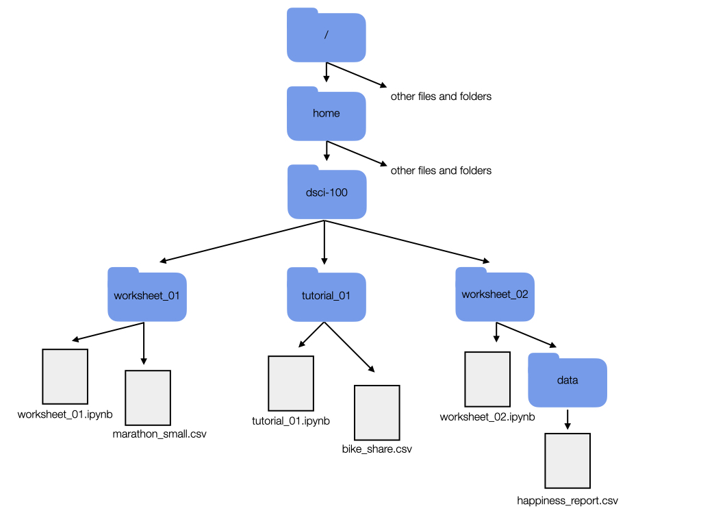
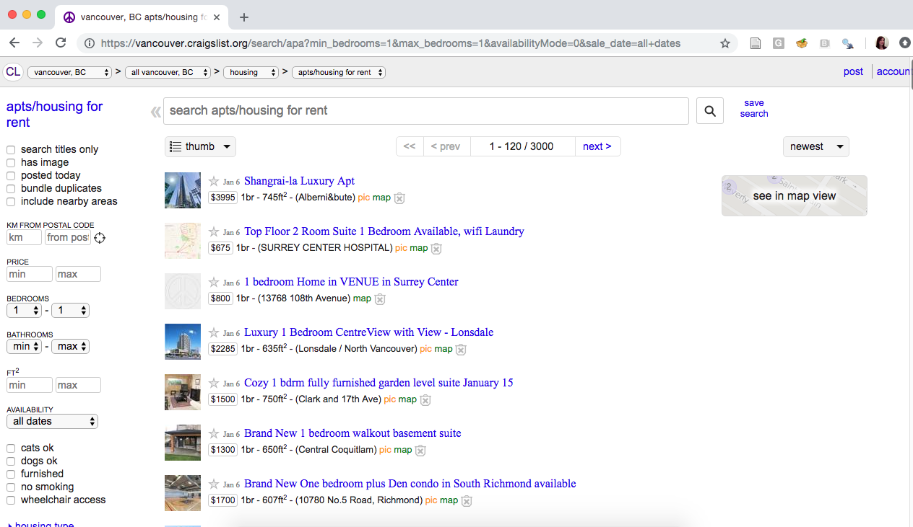
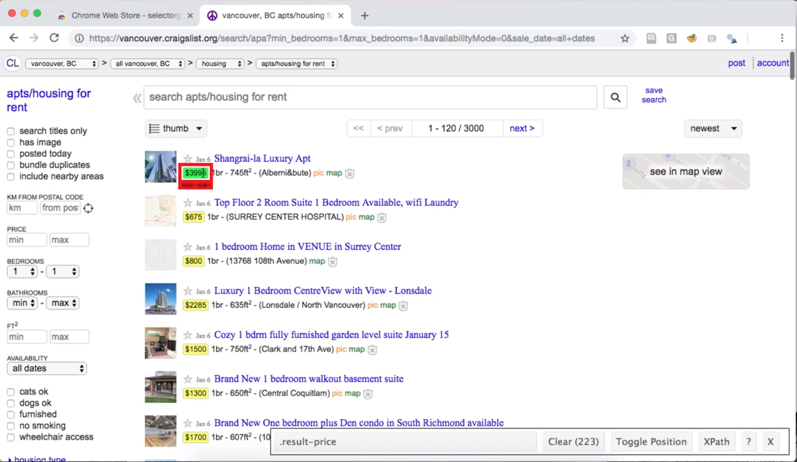
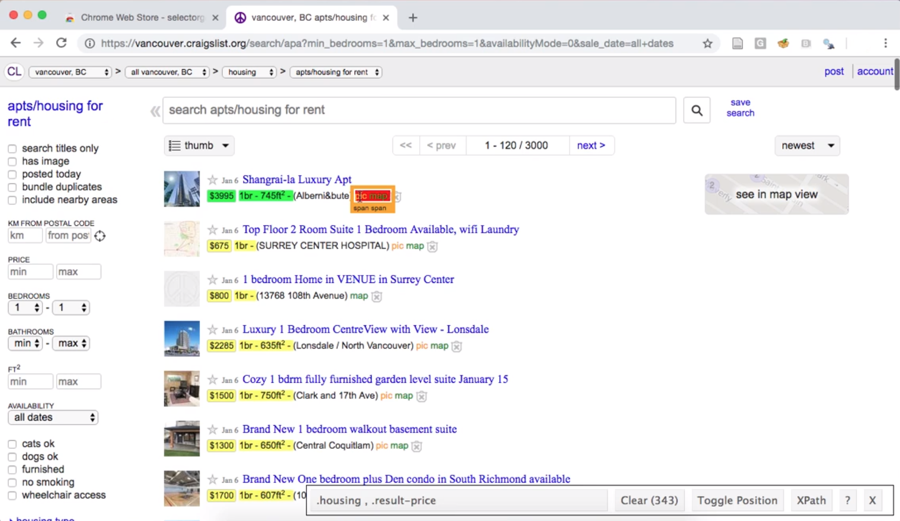
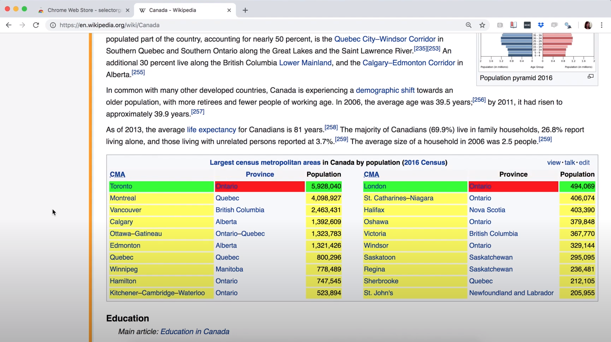
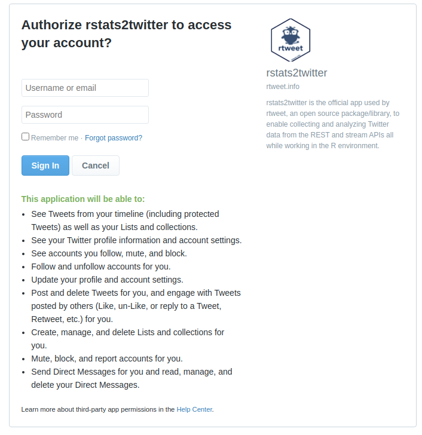

# Reading in data locally and from the web {#reading}

```{r reading-setup, echo = FALSE, message = FALSE, warning = FALSE}
library(magick)
library(magrittr)
library(knitr)
knitr::opts_chunk$set(message = FALSE,
                      fig.align = "center")
```

## Overview 

In this chapter, you’ll learn to read tabular data of various formats into R
from your local device (e.g., your laptop) and the web. “Reading” (or “loading”)
\index{loading|see{reading}}\index{reading!definition} is the process of
converting data (stored as plain text, a database, HTML, etc.) into an object
(e.g., a data frame) that R can easily access and manipulate. Thus reading data
is the gateway to any data analysis; you won’t be able to analyze data unless
you’ve loaded it first. And because there are many ways to store data, there
are similarly many ways to read data into R. The more time you spend upfront
matching the data reading method to the type of data you have, the less time
you will have to devote to re-formatting, cleaning and wrangling your data (the
second step to all data analyses). It’s like making sure your shoelaces are
tied well before going for a run so that you don’t trip later on!

## Chapter learning objectives
By the end of the chapter, readers will be able to do the following:

- Define the following:
    - absolute file path
    - relative file path
    - **U**niform **R**esource **L**ocator (URL)
- Read data into R using a relative path and a URL.
- Compare and contrast the following functions:
    - `read_csv` 
    - `read_tsv`
    - `read_csv2`
    - `read_delim`
    - `read_excel`
- Match the following `tidyverse` `read_*` function arguments to their descriptions:
    - `file` 
    - `delim`
    - `col_names`
    - `skip`
- Choose the appropriate `tidyverse` `read_*` function and function arguments to load a given plain text tabular data set into R.
- Use `readxl` package's `read_excel` function and arguments to load a sheet from an excel file into R.
- Connect to a database using the `DBI` package's `dbConnect` function.
- List the tables in a database using the `DBI` package's `dbListTables` function.
- Create a reference to a database table that is queriable using the `tbl` from the `dbplyr` package.
- Retrieve data from a database query and bring it into R using the `collect` function from the `dbplyr` package.
- Use `write_csv` to save a data frame to a `.csv` file.
- (*Optional*) Obtain data using **a**pplication **p**rogramming **i**nterfaces (APIs) and web scraping.
    - Read HTML source code from a URL using the `rvest` package.
    - Read data from the Twitter API using the `rtweet` package.
    - Compare downloading tabular data from a plain text file (e.g., `.csv`), accessing data from an API, and scraping the HTML source code from a website.

## Absolute and relative file paths

This chapter will discuss the different functions we can use to import data
into R, but before we can talk about *how* we read the data into R with these
functions, we first need to talk about *where* the data lives. When you load a
data set into R, you first need to tell R where those files live. The file
could live on your  computer (*local*) 
\index{location|see{path}} \index{path!local, remote, relative, absolute} 
or somewhere on the internet (*remote*). 

The place where the file lives on your computer is called the "path". You can
think of the path as directions to the file. There are two kinds of paths:
*relative* paths and *absolute* paths. A relative path is where the file is
with respect to where you currently are on the computer (e.g., where the file
you're working in is). On the other hand, an absolute path is where the file is
in respect to the computer's filesystem base (or root) folder.

Suppose our computer's filesystem looks like the picture in Figure
\@ref(fig:file-system-for-export-to-intro-datascience), and we are working in a
file titled `worksheet_02.ipynb`. If we want to 
read the `.csv` file named `happiness_report.csv` into R, we could do this
using either a relative or an absolute path.  We show both choices
below.\index{Happiness Report}

```{r file-system-for-export-to-intro-datascience, echo = FALSE, message = FALSE, warning = FALSE, fig.cap = "Example file system.", fig.retina = 2, out.width="100%"}

```

**Reading `happiness_report.csv` using a relative path:**

```{r eval = FALSE}
happy_data <- read_csv("data/happiness_report.csv")
```

**Reading `happiness_report.csv` using an absolute path:**

```{r eval = FALSE}
happy_data <- read_csv("/home/dsci-100/worksheet_02/data/happiness_report.csv")
```

So which one should you use? Generally speaking, to ensure your code can be run 
on a different computer, you should use relative paths. An added bonus is that 
it's also less typing! Generally, you should use relative paths because the file's 
absolute path (the names of 
folders between the computer's root `/` and the file) isn't usually the same 
across different computers. For example, suppose Fatima and Jayden are working on a 
project together on the `happiness_report.csv` data. Fatima's file is stored at 

`/home/Fatima/project/data/happiness_report.csv`, 

while Jayden's is stored at 

`/home/Jayden/project/data/happiness_report.csv`.
 
Even though Fatima and Jayden stored their files in the same place on their
computers (in their home folders), the absolute paths are different due to
their different usernames.  If Jayden has code that loads the
`happiness_report.csv` data using an absolute path, the code won't work on
Fatima's computer.  But the relative path from inside the `project` folder
(`data/happiness_report.csv`) is the same on both computers; any code that uses
relative paths will work on both!

In the additional resources section, we include a link to a short video on the
difference between absolute and relative paths. You can also check out the
`here` package, which provides methods for finding and constructing file paths
in R.  

Your file could be stored locally, as we discussed, or it could also be
somewhere on the internet (remotely). A *Uniform Resource Locator (URL)* (web
address) \index{URL} indicates the location of a resource on the internet and
helps us retrieve that resource. Next, we will discuss how to get either
locally or remotely stored data into R. 

## Reading tabular data from a plain text file into R

### `read_csv` to read in comma-separated files {#readcsv}

Now that we have learned about *where* data could be, we will learn about *how*
to import data into R using various functions. Specifically, we will learn how 
to *read* tabular data from a plain text file (a document containing only text)
*into* R and *write* tabular data to a file *out of* R. The function we use to do this
depends on the file's format. For example, in the last chapter, we learned about using
the `tidyverse` `read_csv` function when reading .csv (**c**omma-**s**eparated **v**alues)
files. \index{csv} In that case, the separator or *delimiter* \index{reading!delimiter} that divided our columns was a
comma (`,`). We only learned the case where the data matched the expected defaults 
of the `read_csv` function \index{read function!read\_csv}
(column names are present, and commas are used as the delimiter between columns). 
In this section, we will learn how to read 
files that do not satisfy the default expectations of `read_csv`.

Before we jump into the cases where the data aren't in the expected default format 
for `tidyverse` and `read_csv`, let's revisit the more straightforward
case where the defaults hold, and the only argument we need to give to the function
is the path to the file, `data/can_lang.csv`. The `can_lang` data set contains 
language data from the 2016 Canadian census. \index{Canadian languages!canlang data} 
We put `data/` before the file's
name when we are loading the data set because this data set is located in a
sub-folder, named `data`, relative to where we are running our R code.

Here is what the file would look like in a plain text editor (a program that removes
all formatting, like bolding or different fonts):

```code
category,language,mother_tongue,most_at_home,most_at_work,lang_known
Aboriginal languages,"Aboriginal languages, n.o.s.",590,235,30,665
Non-Official & Non-Aboriginal languages,Afrikaans,10260,4785,85,23415
Non-Official & Non-Aboriginal languages,"Afro-Asiatic languages, n.i.e.",1150,44
Non-Official & Non-Aboriginal languages,Akan (Twi),13460,5985,25,22150
Non-Official & Non-Aboriginal languages,Albanian,26895,13135,345,31930
Aboriginal languages,"Algonquian languages, n.i.e.",45,10,0,120
Aboriginal languages,Algonquin,1260,370,40,2480
Non-Official & Non-Aboriginal languages,American Sign Language,2685,3020,1145,21
Non-Official & Non-Aboriginal languages,Amharic,22465,12785,200,33670
```

And here is a review of how we can use `read_csv` to load it into R. First we 
load the `tidyverse` \index{tidyverse} package to gain access to useful
functions for reading the data. 

```{r, message = FALSE}
library(tidyverse)
```

Next we use `read_csv` to load the data into R, and in that call we specify the
relative path to the file.

```{r load-data, message = TRUE}
canlang_data <- read_csv("data/can_lang.csv")
```

> **Note:** It is also normal and expected that \index{warning} a message is
> printed out after using
> the `read_csv` and related functions. This message lets you know the data types
> of each of the columns that R inferred while reading the data into R.  In the
> future when we use this and related functions to load data in this book, we will
> silence these messages to help with the readability of the book.

```{r view-data}
canlang_data
```

### Skipping rows when reading in data

Oftentimes, information about how data was collected, or other relevant
information, is included at the top of the data file. This information is
usually written in sentence and paragraph form, with no delimiter because it is
not organized into columns. An example of this is shown below. This information
gives the data scientist useful context and information about the data,
however, it is not well formatted or intended to be read into a data frame cell
along with the tabular data that follows later in the file.

```code
Data source: https://ttimbers.github.io/canlang/
Data originally published in: Statistics Canada Census of Population 2016.
Reproduced and distributed on an as-is basis with their permission.
category,language,mother_tongue,most_at_home,most_at_work,lang_known
Aboriginal languages,"Aboriginal languages, n.o.s.",590,235,30,665
Non-Official & Non-Aboriginal languages,Afrikaans,10260,4785,85,23415
Non-Official & Non-Aboriginal languages,"Afro-Asiatic languages, n.i.e.",1150,44
Non-Official & Non-Aboriginal languages,Akan (Twi),13460,5985,25,22150
Non-Official & Non-Aboriginal languages,Albanian,26895,13135,345,31930
Aboriginal languages,"Algonquian languages, n.i.e.",45,10,0,120
Aboriginal languages,Algonquin,1260,370,40,2480
Non-Official & Non-Aboriginal languages,American Sign Language,2685,3020,1145,21
Non-Official & Non-Aboriginal languages,Amharic,22465,12785,200,33670
```

With this extra information being present at the top of the file, using
`read_csv` as we did previously does not allow us to correctly load the data
into R. In the case of this file we end up only reading in one column of the
data set:

```{r}
canlang_data <- read_csv("data/can_lang_meta-data.csv")
```

> **Note:** In contrast to the normal and expected messages above, this time R 
> printed out a warning for us indicating that there might be a problem with how
> our data is being read in. \index{warning}

```{r}
canlang_data
```

To successfully read data like this into R, the `skip` 
argument \index{read function!skip argument} can be useful to tell R 
how many lines to skip before
it should start reading in the data. In the example above, we would set this
value to 3.

```{r}
canlang_data <- read_csv("data/can_lang_meta-data.csv", 
                         skip = 3)
canlang_data
```

How did we know to skip three lines? We looked at the data! The first three lines
of the data had information we didn't need to import: 

```code
Data source: https://ttimbers.github.io/canlang/
Data originally published in: Statistics Canada Census of Population 2016.
Reproduced and distributed on an as-is basis with their permission.
```

The column names began at line 4, so we skipped the first three lines. 

### `read_tsv` to read in tab-separated files

Another common way data is stored is with tabs as the delimiter. Notice the
data file, `can_lang_tab.tsv`, has tabs in between the columns instead of
commas. 

```code
category    language    mother_tongue   most_at_home    most_at_work    lang_kno
Aboriginal languages    Aboriginal languages, n.o.s.    590 235 30  665
Non-Official & Non-Aboriginal languages Afrikaans   10260   4785    85  23415
Non-Official & Non-Aboriginal languages Afro-Asiatic languages, n.i.e.  1150    
Non-Official & Non-Aboriginal languages Akan (Twi)  13460   5985    25  22150
Non-Official & Non-Aboriginal languages Albanian    26895   13135   345 31930
Aboriginal languages    Algonquian languages, n.i.e.    45  10  0   120
Aboriginal languages    Algonquin   1260    370 40  2480
Non-Official & Non-Aboriginal languages American Sign Language  2685    3020    
Non-Official & Non-Aboriginal languages Amharic 22465   12785   200 33670
```

To read in this type of data, we can use the `read_tsv` 
\index{tab-separated values|see{tsv}}\index{tsv}\index{read function!read\_tsv}
to read in .tsv (**t**ab **s**eparated **v**alues) files. 

```{r 01-read-tab}
canlang_data <- read_tsv("data/can_lang_tab.tsv")
canlang_data
```

Let's compare the data frame here to the resulting data frame in Section
\@ref(readcsv) after using `read_csv`. Notice anything? They look the same! The
same number of columns/rows and column names! So we needed to use different
tools for the job depending on the file format and our resulting table
(`canlang_data`) in both cases was the same! 

### `read_delim` as a more flexible method to get tabular data into R

`read_csv` and `read_tsv` are actually just special cases of the more general
`read_delim` \index{read function!read\_delim} function. We can use
`read_delim` to import both comma and tab-separated files (and more), we just
have to specify the delimiter. The `can_lang.tsv` is a different version of
this same data set with no column names and uses tabs as the delimiter
\index{reading!delimiter} instead of commas. 

Here is how the file would look in a plain text editor:

```code
Aboriginal languages    Aboriginal languages, n.o.s.    590 235 30  665
Non-Official & Non-Aboriginal languages Afrikaans   10260   4785    85  23415
Non-Official & Non-Aboriginal languages Afro-Asiatic languages, n.i.e.  1150    
Non-Official & Non-Aboriginal languages Akan (Twi)  13460   5985    25  22150
Non-Official & Non-Aboriginal languages Albanian    26895   13135   345 31930
Aboriginal languages    Algonquian languages, n.i.e.    45  10  0   120
Aboriginal languages    Algonquin   1260    370 40  2480
Non-Official & Non-Aboriginal languages American Sign Language  2685    3020    
Non-Official & Non-Aboriginal languages Amharic 22465   12785   200 33670
Non-Official & Non-Aboriginal languages Arabic  419890  223535  5585    629055
```

To get this into R using the `read_delim` function, we specify the first
argument as the path to the file (as done with `read_csv`), and then provide
values to the `delim` \index{read function!delim argument} argument (here a
tab, which we represent by `"\t"`) and the `col_names` argument (here we
specify that there are no column names to assign, and give it the value of
`FALSE`). `read_csv`, `read_tsv` and `read_delim` have a `col_names` argument
\index{read function!col\_names argument} and the default is `TRUE`. 

> **Note:** `\t` is an example of an *escape character*, \index{escape character}
> typically used to represent non-printing characters (like the tab) or
> characters with special meanings (such as quotation marks). 

```{r}
canlang_data <- read_delim("data/can_lang.tsv", 
                           delim = "\t", 
                           col_names = FALSE)
canlang_data
```


Data frames in R need to have column names.  Thus if you read in data that
don't have column names, R will assign names automatically. In the example
above, R assigns each column a name of `X1, X2, X3, X4, X5, X6`.

It is best to rename your columns to help differentiate between them 
(e.g., `X1, X2`, etc., are not very descriptive names and will make it more confusing as
you code). To rename your columns, you can use the `rename` function
\index{rename} from [the `dplyr` R package](https://dplyr.tidyverse.org/) [@dplyr]
 \index{dplyr} (one of the packages
loaded with `tidyverse`, so we don't need to load it separately). The first
argument is the data set, and in the subsequent arguments you 
write `new_name = old_name` for the selected variables to 
rename. We rename the `X1, X2, ..., X6`
columns in the `canlang_data` data frame to more descriptive names below. 

```{r 01-rename-columns}
canlang_data <- rename(canlang_data,
       category = X1, 
       language = X2, 
       mother_tongue = X3,
       most_at_home = X4, 
       most_at_work = X5, 
       lang_known = X6)
canlang_data
```

### Reading tabular data directly from a URL
We can also use `read_csv`, `read_tsv` or `read_delim` (and related functions)
to read in data directly from a **U**niform **R**esource **L**ocator (URL) that
contains tabular data. \index{URL!reading from} Here, we provide the URL to
`read_*` as the path to the file instead of a path to a local file on our
computer. We need to surround the URL with quotes similar to when we specify a
path on our local computer. All other arguments that we use are the same as
when using these functions with a local file on our computer.

```{r}
url <- "https://raw.githubusercontent.com/UBC-DSCI/data/main/can_lang.csv"
canlang_data <- read_csv(url)

canlang_data
```

### Previewing a data file before reading it into R

In all the examples above, we gave you previews of the data file before we read
it into R. Previewing data is essential to see whether or not there are column
names, what the delimiters are, and if there are lines you need to skip. You
should do this yourself when trying to read in data files. You can preview
files in a plain text editor by right-clicking on the file, selecting "Open
With," and choosing a plain text editor (e.g., Notepad). 

## Reading tabular data from a Microsoft Excel file

There are many other ways to store tabular data sets beyond plain text files,
and similarly, many ways to load those data sets into R. For example, it is
very common to encounter, and need to load into R, data stored as a Microsoft
Excel \index{Excel spreadsheet}\index{Microsoft Excel|see{Excel
spreadsheet}}\index{xlsx|see{Excel spreadsheet}} spreadsheet (with the file name
extension `.xlsx`).  To be able to do this, a key thing to know is that even
though `.csv` and `.xlsx` files look almost identical when loaded into Excel,
the data themselves are stored completely differently.  While `.csv` files are
plain text files, where the characters you see when you open the file in a text
editor are exactly the data they represent, this is not the case for `.xlsx`
files. Take a look at a snippet of what a `.xlsx` file would look like in a text editor: 


```
,?'O
    _rels/.rels???J1??>E?{7?
<?V????w8?'J???'QrJ???Tf?d??d?o?wZ'???@>?4'?|??hlIo??F
t                                                       8f??3wn
????t??u"/
          %~Ed2??<?w??
                       ?Pd(??J-?E???7?'t(?-GZ?????y???c~N?g[^_r?4
                                                                  yG?O
                                                                      ?K??G?
                                                                      
                                                                                                                    
     ]TUEe??O??c[???????6q??s??d?m???\???H?^????3} ?rZY? ?:L60?^?????XTP+?|?
X?a??4VT?,D?Jq
```

This type of file representation allows Excel files to store additional things
that you cannot store in a `.csv` file, such as fonts, text formatting,
graphics, multiple sheets and more. And despite looking odd in a plain text
editor, we can read Excel spreadsheets into R using the `readxl` package
developed specifically for this 
purpose. \index{readxl}\index{read function!read\_excel}

```{r}
library(readxl)

canlang_data <- read_excel("data/can_lang.xlsx")
canlang_data
```

If the `.xlsx` file has multiple sheets, you have to use the `sheet` argument
to specify the sheet number or name. You can also specify cell ranges using the
`range` argument. This functionality is useful when a single sheet contains
multiple tables (a sad thing that happens to many Excel spreadsheets since this
makes reading in data more difficult). 

As with plain text files, you should always explore the data file before
importing it into R. Exploring the data beforehand helps you decide which
arguments you need to load the data into R successfully. If you do not have
the Excel program on your computer, you can use other programs to preview the
file. Examples include Google Sheets and Libre Office. 

In Table \@ref(tab:read-table) we summarize the `read_*` functions we covered
in this chapter. We also include the `read_csv2` function for data separated by
semicolons `;`, which you may run into with data sets where the decimal is
represented by a comma instead of a period (as with some data sets from
European countries).

Table: (\#tab:read-table) Summary of `read_*` functions

Data File Type | R Function | R Package
-- | -- | --
Comma (`,`) separated files | `read_csv` | `readr`
Tab (`\t`) separated files  | `read_tsv` | `readr`
Semicolon (`;`) separated files |  `read_csv2` | `readr`
Various formats (`.csv`, `.tsv`)   | `read_delim` | `readr`
Excel files (`.xlsx`) | `read_excel` | `readxl`

> **Note:** `readr` is a part of the `tidyverse` package so we did not need to load
> this package separately since we loaded `tidyverse`.

## Reading data from a database

Another very common form of data storage is the relational database. Databases
\index{database} are great when you have large data sets or multiple users
working on a project. There are many relational database management systems,
such as SQLite, MySQL, PostgreSQL, Oracle,
 and many more. These
different relational database management systems each have their own advantages
and limitations. Almost all employ SQL (*structured query language*) to obtain
data from the database. But you don't need to know SQL to analyze data from
a database; several packages have been written that allow you to connect to
relational databases and use the R programming language 
to obtain data. In this book, we will give examples of how to do this
using R with SQLite and PostgreSQL databases.

### Reading data from a SQLite database

SQLite \index{database!SQLite} is probably the simplest relational database system
that one can use in combination with R. SQLite databases are self-contained and
usually stored and accessed locally on one computer. Data is usually stored in
a file with a `.db` extension. Similar to Excel files, these are not plain text
files and cannot be read in a plain text editor. 

The first thing you need to do to read data into R from a database is to
connect to the database. We do that using the `dbConnect` function from the
`DBI` (database interface) package. \index{database!connect} This does not read
in the data, but simply tells R where the database is and opens up a
communication channel that R can use to send SQL commands to the database.

```{r}
library(DBI)

conn_lang_data <- dbConnect(RSQLite::SQLite(), "data/can_lang.db")
```

Often relational databases have many tables; thus, in order to retrieve
data from a database, you need to know the name of the table 
in which the data is stored. You can get the names of
all the tables in the database using the `dbListTables` \index{database!tables}
function:

```{r}
tables <- dbListTables(conn_lang_data)
tables
```

The `dbListTables` function returned only one name, which tells us
that there is only one table in this database. To reference a table in the
database (so that we can perform operations like selecting columns and filtering rows), we 
use the `tbl` function \index{database!tbl} from the `dbplyr` package. The object returned
by the `tbl` function \index{dbplyr|see{database}}\index{database!dbplyr} allows us to work with data
stored in databases as if they were just regular data frames; but secretly, behind
the scenes, `dbplyr` is turning your function calls (e.g., `select` and `filter`)
into SQL queries!

```{r}
library(dbplyr)

lang_db <- tbl(conn_lang_data, "lang")
lang_db 
```

Although it looks like we just got a data frame from the database, we didn't!
It's a *reference*; the data is still stored only in the SQLite database. The
`dbplyr` package works this way because databases are often more efficient at selecting, filtering
and joining large data sets than R. And typically the database will not even
be stored on your computer, but rather a more powerful machine somewhere on the
web. So R is lazy and waits to bring this data into memory until you explicitly
tell it to using the `collect` \index{database!collect} function. 
Figure \@ref(fig:01-ref-vs-tibble) highlights the difference
between a `tibble` object in R and the output we just created. Notice in the table
on the right, the first two lines of the output indicate the source is SQL. The
last line doesn't show how many rows there are (R is trying to avoid performing
expensive query operations), whereas the output for the `tibble` object does. 

```{r 01-ref-vs-tibble, echo = FALSE, message = FALSE, warning = FALSE, fig.align = "center", fig.cap = "Comparison of a reference to data in a database and a tibble in R.", fig.retina = 2, out.width="80%"}
image_read("img/ref_vs_tibble/ref_vs_tibble.001.jpeg") |>
  image_crop("3632x1600")
```

We can look at the SQL commands that are sent to the database when we write 
`tbl(conn_lang_data, "lang")` in R with the `show_query` function from the
`dbplyr` package. \index{database!show\_query}

```{r}
show_query(tbl(conn_lang_data, "lang"))
```

The output above shows the SQL code that is sent to the database. When we
write `tbl(conn_lang_data, "lang")` in R, in the background, the function is
translating the R code into SQL, sending that SQL to the database, and then translating the
response for us. So `dbplyr` does all the hard work of translating from R to SQL and back for us; 
we can just stick with R! 

With our `lang_db` table reference for the 2016 Canadian Census data in hand, we 
can mostly continue onward as if it were a regular data frame. For example, 
we can use the `filter` function
to obtain only certain rows. Below we filter the data to include only Aboriginal languages.

```{r}
aboriginal_lang_db <- filter(lang_db, category == "Aboriginal languages")
aboriginal_lang_db 
```

Above you can again see the hints that this data is not actually stored in R yet:
the source is a `lazy query [?? x 6]` and the output says `... with more rows` at the end
(both indicating that R does not know how many rows there are in total!),
and a database type `sqlite 3.36.0` is listed.
In order to actually retrieve this data in R as a data frame,
we use the `collect` function. \index{filter}
Below you will see that after running `collect`, R knows that the retrieved
data has 67 rows, and there is no database listed any more.

```{r}
aboriginal_lang_data <- collect(aboriginal_lang_db)
aboriginal_lang_data
```

Aside from knowing the number of rows, the data looks pretty similar in both
outputs shown above. And `dbplyr` provides many more functions (not just `filter`) 
that you can use to directly feed the database reference (`lang_db`) into 
downstream analysis functions (e.g., `ggplot2` for data visualization). 
But `dbplyr` does not provide *every* function that we need for analysis;
we do eventually need to call `collect`.
For example, look what happens when we try to use `nrow` to count rows
in a data frame: \index{nrow}

```{r}
nrow(aboriginal_lang_db)
```
 
or `tail` to preview the last six rows of a data frame:
\index{tail}

```{r, eval = FALSE}
tail(aboriginal_lang_db)
```
```
## Error: tail() is not supported by sql sources
```
Additionally, some operations will not work to extract columns or single values
from the reference given by the `tbl` function. Thus, once you have finished
your data wrangling of the `tbl` database reference object, it is advisable to
bring it into R as a data frame using `collect`.
But be very careful using `collect`: databases are often *very* big,
and reading an entire table into R might take a long time to run or even possibly
crash your machine. So make sure you use `filter` and `select` on the database table
to reduce the data to a reasonable size before using `collect` to read it into R!
 
### Reading data from a PostgreSQL database 

PostgreSQL (also called Postgres) \index{database!PostgreSQL} is a very popular
and open-source option for relational database software. 
Unlike SQLite,
PostgreSQL uses a client–server database engine, as it was designed to be used
and accessed on a network. This means that you have to provide more information
to R when connecting to Postgres databases. The additional information that you
need to include when you call the `dbConnect` function is listed below:

- `dbname`: the name of the database (a single PostgreSQL instance can host more than one database)
- `host`: the URL pointing to where the database is located
- `port`: the communication endpoint between R and the PostgreSQL database (usually `5432`)
- `user`: the username for accessing the database
- `password`: the password for accessing the database

Additionally, we must use the `RPostgres` package instead of `RSQLite` in the
`dbConnect` function call.  Below we demonstrate how to connect to a version of
the `can_mov_db` database, which contains information about Canadian movies.
Note that the `host` (`fakeserver.stat.ubc.ca`), `user` (`user0001`), and 
`password` (`abc123`) below are *not real*; you will not actually 
be able to connect to a database using this information.

```{r, eval = FALSE}
library(RPostgres)
conn_mov_data <- dbConnect(RPostgres::Postgres(), dbname = "can_mov_db",
                        host = "fakeserver.stat.ubc.ca", port = 5432,
                        user = "user0001", password = "abc123")
```

After opening the connection, everything looks and behaves almost identically
to when we were using an SQLite database in R. For example, we can again use
`dbListTables` to find out what tables are in the `can_mov_db` database:

```{r, eval = FALSE}
dbListTables(conn_mov_data)
```

```
 [1] "themes"            "medium"           "titles"     "title_aliases"       "forms"            
 [6] "episodes"          "names"      "names_occupations" "occupation"       "ratings" 
```

We see that there are 10 tables in this database. Let's first look at the
`"ratings"` table to find the lowest rating that exists in the `can_mov_db`
database:

```{r, eval = FALSE}
ratings_db <- tbl(conn_mov_data, "ratings")
ratings_db
```

```
# Source:   table<ratings> [?? x 3]
# Database: postgres [user0001@fakeserver.stat.ubc.ca:5432/can_mov_db]
   title              average_rating num_votes
   <chr>                    <dbl>     <int>
 1 The Grand Seduction       6.6       150
 2 Rhymes for Young Ghouls   6.3      1685
 3 Mommy                     7.5      1060
 4 Incendies                 6.1      1101
 5 Bon Cop, Bad Cop          7.0       894
 6 Goon                      5.5      1111
 7 Monsieur Lazhar           5.6       610
 8 What if                   5.3      1401
 9 The Barbarian Invations   5.8        99
10 Away from Her             6.9      2311
# … with more rows
```

To find the lowest rating that exists in the data base, we first need to
extract the `average_rating` column using `select`:
\index{select}

```{r, eval = FALSE}
avg_rating_db <- select(ratings_db, average_rating)
avg_rating_db
```

```
# Source:   lazy query [?? x 1]
# Database: postgres [user0001@fakeserver.stat.ubc.ca:5432/can_mov_db]
   average_rating
            <dbl>
 1            6.6
 2            6.3
 3            7.5
 4            6.1
 5            7.0
 6            5.5
 7            5.6
 8            5.3
 9            5.8
10            6.9
# … with more rows
```

Next we use `min` to find the minimum rating in that column:
\index{min}

```{r, eval = FALSE}
min(avg_rating_db)
```

```
Error in min(avg_rating_db) : invalid 'type' (list) of argument
```

Instead of the minimum, we get an error! This is another example of when we
need to use the `collect` function to bring the data into R for further
computation:

```{r, eval = FALSE}
avg_rating_data <- collect(avg_rating_db)
min(avg_rating_data)
```

```
[1] 1
```

We see the lowest rating given to a movie is 1, indicating that it must have
been a really bad movie...

### Why should we bother with databases at all?

Opening a database \index{database!reasons to use} stored in a `.db` file
involved a lot more effort than just opening a `.csv`, `.tsv`, or any of the
other plain text or Excel formats. It was a bit of a pain to use a database in
that setting since we had to use `dbplyr` to translate `tidyverse`-like
commands (`filter`, `select`, `head`, etc.) into SQL commands that the database
understands. Not all `tidyverse` commands can currently be translated with
SQLite databases. For example, we can compute a mean with an SQLite database
but can't easily compute a median. So you might be wondering: why should we use
databases at all? 

Databases are beneficial in a large-scale setting:

- They enable storing large data sets across multiple computers with backups.
- They provide mechanisms for ensuring data integrity and validating input.
- They provide security and data access control.
- They allow multiple users to access data simultaneously 
  and remotely without conflicts and errors.
  For example, there are billions of Google searches conducted daily in 2021 [@googlesearches]. 
  Can you imagine if Google stored all of the data 
  from those searches in a single `.csv` file!? Chaos would ensue! 

## Writing data from R to a `.csv` file

At the middle and end of a data analysis, we often want to write a data frame
that has changed (either through filtering, selecting, mutating or summarizing)
to a file to share it with others or use it for another step in the analysis.
The most straightforward way to do this is to use the `write_csv` function
\index{write function!write\_csv} from the `tidyverse` package.  The default
arguments for this file are to use a comma (`,`) as the delimiter and include
column names. Below we demonstrate creating a new version of the Canadian
languages data set without the official languages category according to the
Canadian 2016 Census, and then writing this to a `.csv` file:

```{r, eval = FALSE}
no_official_lang_data <- filter(can_lang, category != "Official languages")
write_csv(no_official_lang_data, "data/no_official_languages.csv")
```

## Obtaining data from the web 

> **Note:** This section is not required reading for the remainder of the textbook. It
> is included for those readers interested in learning a little bit more about
> how to obtain different types of data from the web.

Data doesn't just magically appear on your computer; you need to get it from
somewhere. Earlier in the chapter we showed you how to access data stored in a
plain text, spreadsheet-like format (e.g., comma- or tab-separated) from a web
URL using one of the `read_*` functions from the `tidyverse`. But as time goes
on, it is increasingly uncommon to find data (especially large amounts of data)
in this format available for download from a URL. Instead, websites now often
offer something known as an **a**pplication **p**rogramming **i**nterface
(API), \index{application programming interface|see{API}}\index{API} which
provides a programmatic way to ask for subsets of a data set. This allows the
website owner to control *who* has access to the data, *what portion* of the
data they have access to, and *how much* data they can access.  Typically, the
website owner will give you a *token* (a secret string of characters somewhat
like a password) that you have to provide when accessing the API.

Another interesting thought: websites themselves *are* data! When you type a
URL into your browser window, your browser asks the *web server* (another
computer on the internet whose job it is to respond to requests for the
website) to give it the website's data, and then your browser translates that
data into something you can see. If the website shows you some information that
you're interested in, you could *create* a data set for yourself by copying and
pasting that information into a file. This process of taking information
directly from what a website displays is called \index{web scraping} 
*web scraping* (or sometimes *screen scraping*). Now, of course, copying and pasting
information manually is a painstaking and error-prone process, especially when
there is a lot of information to gather. So instead of asking your browser to
translate the information that the web server provides into something you can
see, you can collect that data programmatically&mdash;in the form of
**h**yper**t**ext **m**arkup **l**anguage 
(HTML) \index{hypertext markup language|see{HTML}}\index{cascading style sheet|see{CSS}}\index{CSS}\index{HTML} 
and **c**ascading **s**tyle **s**heet (CSS) code&mdash;and process it 
to extract useful information. HTML provides the
basic structure of a site and tells the webpage how to display the content
(e.g., titles, paragraphs, bullet lists etc.), whereas CSS helps style the
content and tells the webpage how the HTML elements should 
be presented (e.g., colors, layouts, fonts etc.). 

This subsection will show you the basics of both web scraping
with the [`rvest` R package](https://rvest.tidyverse.org/) [@rvest]
and accessing the Twitter API
using the [`rtweet` R package](https://github.com/ropensci/rtweet) [@rtweet].

### Web scraping

#### HTML and CSS selectors {-}

When you enter a URL into your browser, your browser connects to the
web server at that URL and asks for the *source code* for the website.
This is the data that the browser translates 
\index{web scraping}\index{HTML!selector}\index{CSS!selector}
into something you can see; so if we
are going to create our own data by scraping a website, we have to first understand
what that data looks like! For example, let's say we are interested
in knowing the average rental price (per square foot) of the most recently
available one-bedroom apartments in Vancouver 
on [Craiglist](https://vancouver.craigslist.org). When we visit the Vancouver Craigslist
website \index{Craigslist} and search for one-bedroom apartments, 
we should see something similar to Figure \@ref(fig:craigslist-human).

```{r craigslist-human, echo = FALSE, message = FALSE, warning = FALSE, fig.cap = "Craigslist webpage of advertisements for one-bedroom apartments.", fig.retina = 2, out.width="100%"}

```

Based on what our browser shows us, it's pretty easy to find the size and price
for each apartment listed. But we would like to be able to obtain that information
using R, without any manual human effort or copying and pasting. We do this by
examining the *source code* that the web server actually sent our browser to
display for us. We show a snippet of it below; the 
entire source 
is [included with the code for this book](https://github.com/UBC-DSCI/introduction-to-datascience/blob/master/img/website_source.txt):

```html
        <span class="result-meta">
                <span class="result-price">$800</span>

                <span class="housing">
                    1br -
                </span>

                <span class="result-hood"> (13768 108th Avenue)</span>

                <span class="result-tags">
                    <span class="maptag" data-pid="6786042973">map</span>
                </span>

                <span class="banish icon icon-trash" role="button">
                    <span class="screen-reader-text">hide this posting</span>
                </span>

            <span class="unbanish icon icon-trash red" role="button" aria-hidden
            <a href="#" class="restore-link">
                <span class="restore-narrow-text">restore</span>
                <span class="restore-wide-text">restore this posting</span>
            </a>

        </span>
    </p>
</li>
         <li class="result-row" data-pid="6788463837">
                  
        <a href="https://vancouver.craigslist.org/nvn/apa/d/north-vancouver-luxu
                <span class="result-price">$2285</span>
        </a>
```

Oof...you can tell that the source code for a web page is not really designed
for humans to understand easily. However, if you look through it closely, you
will find that the information we're interested in is hidden among the muck.
For example, near the top of the snippet
above you can see a line that looks like

```html
<span class="result-price">$800</span>
```
That is definitely storing the price of a particular apartment. With some more
investigation, you should be able to find things like the date and time of the
listing, the address of the listing, and more. So this source code most likely
contains all the information we are interested in!

Let's dig into that line \index{HTML!tag} above a bit more. You can see that
that bit of code has an *opening tag* (words between `<` and `>`, like
`<span>`) and a *closing tag* (the same with a slash, like `</span>`). HTML
source code generally stores its data between opening and closing tags like
these. Tags are keywords that tell the web browser how to display or format
the content. Above you can see that the information we want (`$800`) is stored
between an opening and closing tag (`<span>` and `</span>`). In the opening
tag, you can also see a very useful "class" (a special word that is sometimes
included with opening tags): `class="result-price"`. Since we want R to
programmatically sort through all of the source code for the website to find
apartment prices, maybe we can look for all the tags with the `"result-price"`
class, and grab the information between the opening and closing tag. Indeed,
take a look at another line of the source snippet above:

```html
<span class="result-price">$2285</span>
```

It's yet another price for an apartment listing, and the tags surrounding it
have the `"result-price"` class. Wonderful! Now that we know what pattern we
are looking for&mdash;a dollar amount between opening and closing tags that have the
`"result-price"` class&mdash;we should be able to use code to pull out all of the 
matching patterns from the source code to obtain our data. This sort of "pattern"
is known as a *CSS selector* (where CSS stands for **c**ascading **s**tyle **s**heet).

The above was a simple example of "finding the pattern to look for"; many 
websites are quite a bit larger and more complex, and so is their website
source code. Fortunately, there are tools available to make this process
easier. For example, 
[SelectorGadget](https://selectorgadget.com/) is 
an open-source tool that simplifies identifying the generating 
and finding of CSS selectors. 
At the end of the chapter in the additional resources section, we include a link to
a short video on how to install and use the SelectorGadget tool to 
obtain CSS selectors for use in web scraping. 
After installing and enabling the tool, you can click the 
website element for which you want an appropriate selector. For 
example, if we click the price of an apartment listing, we
find that SelectorGadget shows us the selector `.result-price`
in its toolbar, and highlights all the other apartment
prices that would be obtained using that selector (Figure \@ref(fig:sg1)).

```{r sg1, echo = FALSE, message = FALSE, warning = FALSE, fig.cap = "Using the SelectorGadget on a Craigslist webpage to obtain the CCS selector useful for obtaining apartment prices.", fig.retina = 2, out.width="100%"}

```

If we then click the size of an apartment listing, SelectorGadget shows us
the `span` selector, and highlights much of the page; this indicates that the
`span` selector is not specific enough to just capture apartment sizes (Figure \@ref(fig:sg3)). 

```{r sg3, echo = FALSE, message = FALSE, warning = FALSE, fig.cap = "Using the SelectorGadget on a Craigslist webpage to obtain a CCS selector useful for obtaining apartment sizes.", fig.retina = 2, out.width="100%"}
knitr::include_graphics("img/sg3.png")
```

To narrow the selector, we can click one of the highlighted elements that
we *do not* want. For example, we can deselect the "pic/map" links, 
resulting in only the data we want highlighted using the `.housing` selector (Figure \@ref(fig:sg2)).

```{r sg2, echo = FALSE, message = FALSE, warning = FALSE, fig.cap = "Using the SelectorGadget on a Craigslist webpage to refine the CCS selector to one that is most useful for obtaining apartment sizes.", fig.retina = 2, out.width="100%"}

```

So to scrape information about the square footage and rental price
of apartment listings, we need to use
the two CSS selectors `.housing` and `.result-price`, respectively.
The selector gadget returns them to us as a comma-separated list (here
`.housing , .result-price`), which is exactly the format we need to provide to
R if we are using more than one CSS selector.

**Stop! Are you allowed to scrape that website?**

*Before* scraping \index{web scraping!permission} data from the web, you should always check whether or not
you are *allowed* to scrape it! There are two documents that are important
for this: the `robots.txt` file and the Terms of Service
document. If we take a look at [Craigslist's Terms of Service document](https://www.craigslist.org/about/terms.of.use),
we find the following text: *"You agree not to copy/collect CL content 
via robots, spiders, scripts, scrapers, crawlers, or any automated or manual equivalent (e.g., by hand)."*
So unfortunately, without explicit permission, we are not allowed to scrape the website.

What to do now? Well, we *could* ask the owner of Craigslist for permission to scrape.
However, we are not likely to get a response, and even if we did they would not likely give us permission.
The more realistic answer is that we simply cannot scrape Craigslist. If we still want
to find data about rental prices in Vancouver, we must go elsewhere.
To continue learning how to scrape data from the web, let's instead
scrape data on the population of Canadian cities from Wikipedia. \index{Wikipedia}
We have checked the [Terms of Service document](https://foundation.wikimedia.org/wiki/Terms_of_Use/en),
and it does not mention that web scraping is disallowed. 
We will use the SelectorGadget tool to pick elements that we are interested in
(city names and population counts) and deselect others to indicate that we are not 
interested in them (province names), as shown in Figure \@ref(fig:sg4).

```{r sg4, echo = FALSE, message = FALSE, warning = FALSE, fig.cap = "Using the SelectorGadget on a Wikipedia webpage.", fig.retina = 2, out.width="100%"}

```

We include a link to a short video tutorial on this process at the end of the chapter
in the additional resources section. SelectorGadget provides in its toolbar
the following list of CSS selectors to use:

```
td:nth-child(5), 
td:nth-child(7), 
.infobox:nth-child(122) td:nth-child(1), 
.infobox td:nth-child(3)
```

Now that we have the CSS selectors that describe the properties of the elements
that we want to target (e.g., has a tag name `price`), we can use them to find
certain elements in web pages and extract data. 

**Using `rvest`**

Now that we have our CSS selectors we can use the `rvest` R package \index{rvest} to scrape our
desired data from the website. We start by loading the `rvest` package:

```{r 01-load-rvest}
library(rvest)
```

Next, we tell R what page we want to scrape by providing the webpage's URL in quotations to the function `read_html`:

```{r 01-specify-page}
page <- read_html("https://en.wikipedia.org/wiki/Canada")
```

The `read_html` function \index{read function!read\_html} directly downloads the source code for the page at 
the URL you specify, just like your browser would if you navigated to that site. But 
instead of  displaying the website to you, the `read_html` function just returns 
the HTML source code itself, which we have
stored in the `page` variable. Next, we send the page object to the `html_nodes`
function, along with the CSS selectors we obtained from
the SelectorGadget tool. Make sure to surround the selectors with quotation marks; the function, `html_nodes`, expects that
argument is a string. The `html_nodes` function then selects *nodes* from the HTML document that 
match the CSS selectors you specified.  A *node* is an HTML tag pair (e.g.,
`<td>` and `</td>` which defines the cell of a table) combined with the content
stored between the tags. For our CSS selector `td:nth-child(5)`, an example
node that would be selected would be:

```html
<td style="text-align:left;background:#f0f0f0;">
<a href="/wiki/London,_Ontario" title="London, Ontario">London</a>
</td>
```

We store the result of the `html_nodes` function in the `population_nodes` variable.
Note that below we use the `paste` function with a comma separator (`sep=","`)
to build the list of selectors. The `paste` function converts 
elements to characters and combines the values into a list. We use this function to 
build the list of selectors to maintain code readability; this avoids
having one very long line of code with the string
`"td:nth-child(5),td:nth-child(7),.infobox:nth-child(122) td:nth-child(1),.infobox td:nth-child(3)"`
as the second argument of `html_nodes`:

```{r 01-select-nodes}
selectors <- paste("td:nth-child(5)",
             "td:nth-child(7)",
             ".infobox:nth-child(122) td:nth-child(1)",
             ".infobox td:nth-child(3)", sep=",")

population_nodes <- html_nodes(page, selectors)
head(population_nodes)
```

Next we extract the meaningful data&mdash;in other words, we get rid of the HTML code syntax and tags&mdash;from 
the nodes using the `html_text`
function. In the case of the example
node above, `html_text` function returns `"London"`.

```{r 01-get-text}
population_text <- html_text(population_nodes)
head(population_text)
```

Fantastic! We seem to have extracted the data of interest from the 
raw HTML source code. But we are not quite done; the data
is not yet in an optimal format for data analysis. Both the city names and
population are encoded as characters in a single vector, instead of being in a
data frame with one character column for city and one numeric column for
population (like a spreadsheet).
Additionally, the populations contain commas (not useful for programmatically
dealing with numbers), and some even contain a line break character at the end
(`\n`). In Chapter \@ref(wrangling), we will learn more about how to *wrangle* data
such as this into a more useful format for data analysis using R.

### Using an API

Rather than posting a data file at a URL for you to download, many websites these days
provide an API \index{API} that must be accessed through a programming language like R. The benefit of this
is that data owners have much more control over the data they provide to users. However, unlike
web scraping, there is no consistent way to access an API across websites. Every website typically
has its own API designed especially for its own use case. Therefore we will just provide one example
of accessing data through an API in this book, with the hope that it gives you enough of a basic
idea that you can learn how to use another API if needed.

In particular, in this book we will show you the basics of how to use
the `rtweet` package in R\index{API!rtweet}\index{rtweet}\index{Twitter} to access
data from the Twitter API. One nice feature of this particular 
API is that you don't need  a special *token* \index{API!token} to access it; you simply need to 
make an account with them. Your access to the data will then be authenticated and controlled through
your account username and password. If you have a Twitter 
account already (or are willing to make one), you can follow
along with the examples that we show here. To get started, load the `rtweet` package:

```r
library(rtweet)
```

This package provides an extensive set of functions to search 
Twitter for tweets, users, their followers, and more. 
Let's construct a small data set of the last 400 tweets and 
retweets from the \@tidyverse account. A few of the most recent tweets
are shown in Figure \@ref(fig:01-tidyverse-twitter).

```{r 01-tidyverse-twitter, echo = FALSE, message = FALSE, warning = FALSE, fig.cap = "The tidyverse account Twitter feed.", fig.retina = 2, out.width="100%"}

```

**Stop! Think about your API usage carefully!**

When you access an API, you are initiating a transfer of data from a web server
to your computer. Web servers are expensive to run and do not have infinite resources.
If you try to ask for *too much data* at once, you can use up a huge amount of the server's bandwidth. 
If you try to ask for data *too frequently*&mdash;e.g., if you 
make many requests to the server in quick succession&mdash;you can also bog the server down and make
it unable to talk to anyone else. Most servers have mechanisms to revoke your access if you are not
careful, but you should try to prevent issues from happening in the first place by being extra careful
with how you write and run your code. You should also keep in mind that when a website owner
grants you API access, they also usually specify a limit (or *quota*) of how much data you can ask for.
Be careful not to overrun your quota! In this example, we should take a look at
 [the Twitter website](https://developer.twitter.com/en/docs/twitter-api/rate-limits) to see what limits
we should abide by when using the API. 

**Using `rtweet`**

After checking the Twitter website, it seems like asking for 400 tweets one time is acceptable.
So we can use the `get_timelines` function to ask for the last 400 tweets from the \@tidyverse account.

```r
tidyverse_tweets <- get_timelines('tidyverse', n=400)
```

When you call the `get_timelines` for the first time (or any other `rtweet` function that accesses the API), 
you will see a browser pop-up that looks something like Figure \@ref(fig:01-tidyverse-authorize).

(ref:01-tidyverse-authorize) The `rtweet` authorization prompt.

```{r 01-tidyverse-authorize, echo = FALSE, message = FALSE, warning = FALSE, fig.cap = "(ref:01-tidyverse-authorize)", fig.retina = 2, out.width="100%"}

```

This is the `rtweet` package asking you to provide your own Twitter account's login information.
When `rtweet` talks to the Twitter API, it uses your account information to authenticate requests;
Twitter then can keep track of how much data you're asking for, and how frequently you're asking.
If you want to follow along with this example using your own Twitter account, you should read
over the list of permissions you are granting `rtweet` *very carefully* and make sure you are comfortable
with it. Note that `rtweet` can be used to manage most aspects of your account (make posts, follow others, etc.),
which is why `rtweet` asks for such extensive permissions.
If you decide to allow `rtweet` to talk to the Twitter API using your account information, then 
input your username and password and hit "Sign In." Twitter will probably send you an email to say
that there was an unusual login attempt on your account, and in that case you will have to take
the one-time code they send you and provide that to the `rtweet` login page too. 

> **Note:** Every API has its own way to authenticate users when they try to access data. Many APIs require you to
> sign up to receive a *token*, which is a secret password that you input into the R package (like `rtweet`) 
> that you are using to access the API. 

With the authentication setup out of the way, let's run the `get_timelines` function again to actually access
the API and take a look at what was returned:

```r
tidyverse_tweets <- get_timelines('tidyverse', n=400)
tidyverse_tweets
```

```{r 01-reading-hidden-load-tweets, echo = FALSE, message = FALSE, warning = FALSE}
tidyverse_tweets <- read_csv("data/tweets.csv")
tidyverse_tweets
```

The data has quite a few variables! (Notice that the output above shows that we
have a data table with 293 rows and 71 columns). Let's reduce this down to a
few variables of interest: `created_at`,  `retweet_screen_name`, `is_retweet`,
and `text`.

```{r 01-select-tweets, message = FALSE, warning = FALSE}
tidyverse_tweets <- select(tidyverse_tweets, 
                           created_at, 
                           retweet_screen_name,
                           is_retweet, 
                           text)

tidyverse_tweets
```

If you look back up at the image of the \@tidyverse Twitter page, you will
recognize the text of the most recent few tweets in the above data frame.  In
other words, we have successfully created a small data set using the Twitter
API&mdash;neat! This data is also quite different from what we obtained from web scraping;
it is already well-organized into a `tidyverse` data frame (although not *every* API
will provide data in such a nice format).
 From this point onward, the `tidyverse_tweets` data frame is stored on your
machine, and you can play with it to your heart's content. For example, you can use
`write_csv` to save it to a file and `read_csv` to read it into R again later; 
and after reading the next few chapters you will have the skills to
compute the percentage of retweets versus tweets, find the most oft-retweeted
account, make visualizations of the data, and much more! If you decide that you want 
to ask the Twitter API for more data 
(see [the `rtweet` page](https://github.com/ropensci/rtweet)
for more examples of what is possible), just be mindful as usual about how much
data you are requesting and how frequently you are making requests. 

## Exercises

Practice exercises for the material covered in this chapter 
can be found in the accompanying [worksheet](https://github.com/UBC-DSCI/data-science-a-first-intro-worksheets/blob/main/worksheet_reading/worksheet_reading.ipynb).
The worksheet tries to provide automated feedback 
and help guide you through the problems. 
To make sure this functionality works as intended, 
please follow the instructions for computer setup needed to run the worksheets 
found in Chapter \@ref(move-to-your-own-machine).

## Additional resources
- The [`readr` documentation](https://readr.tidyverse.org/) 
  provides the documentation for many of the reading functions we cover in this chapter.
  It is where you should look if you want to learn more about the functions in this
  chapter, the full set of arguments you can use, and other related functions.
  The site also provides a very nice cheat sheet that summarizes many of the data
  wrangling functions from this chapter.
- Sometimes you might run into data in such poor shape that none of the reading
  functions we cover in this chapter work. In that case, you can consult the
  [data import chapter](https://r4ds.had.co.nz/data-import.html) from *R for Data
  Science* [@wickham2016r], which goes into a lot more detail about how R parses
  text from files into data frames.
- The [`here` R package](https://here.r-lib.org/) [@here]
  provides a way for you to construct or find your files' paths. 
- The [`readxl` documentation](https://readxl.tidyverse.org/) provides more
  details on reading data from Excel, such as reading in data with multiple
  sheets, or specifying the cells to read in. 
- The [`rio` R package](https://github.com/leeper/rio) [@rio] provides an alternative
  set of tools for reading and writing data in R. It aims to be a "Swiss army
  knife" for data reading/writing/converting, and supports a wide variety of data
  types (including data formats generated by other statistical software like SPSS
  and SAS).
- A [video](https://www.youtube.com/embed/ephId3mYu9o) from the Udacity
  course *Linux Command Line Basics* provides a good explanation of absolute versus relative paths.
- If you read the subsection on obtaining data from the web via scraping and
  APIs, we provide two companion tutorial video links for how to use the
  SelectorGadget tool to obtain desired CSS selectors for:
    - [extracting the data for apartment listings on Craigslist](https://dmi3kno.github.io/polite/), and
    - [extracting Canadian city names and 2016 populations from Wikipedia](https://www.youtube.com/embed/O9HKbdhqYzk).
- The [`polite` R package](https://dmi3kno.github.io/polite/) [@polite] provides
  a set of tools for responsibly scraping data from websites. 
