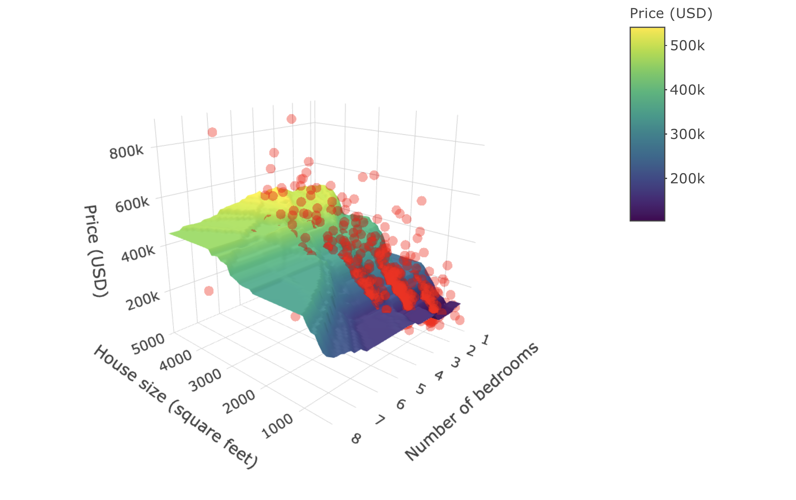

# Regression I: K-nearest neighbors {#regression1}

```{r regression1-setup, echo = FALSE, message = FALSE, warning = FALSE}
library(knitr)
library(plotly)

knitr::opts_chunk$set(fig.align = "center")
```

## Overview 

This chapter continues our foray into answering predictive questions.
Here we will focus on predicting *numerical* variables 
and will use *regression* to perform this task.
This is unlike the past two chapters, which focused on predicting categorical
variables via classification. However, regression does have many similarities
to classification: for example, just as in the case of classification,
we will split our data into training, validation, and test sets, we will 
use `tidymodels` workflows, we will use a K-nearest neighbors (KNN) 
approach to make predictions, and we will use cross-validation to choose K.
Because of how similar these procedures are, make sure to read Chapters
\@ref(classification) and \@ref(classification2) before reading 
this one---we will move a little bit faster here with the
concepts that have already been covered.
This chapter will primarily focus on the case where there is a single predictor, 
but the end of the chapter shows how to perform
regression with more than one predictor variable, i.e., *multivariable regression*.
It is important to note that regression 
can also be used to answer inferential and causal questions, 
however that is beyond the scope of this book.

## Chapter learning objectives 
By the end of the chapter, readers will be able to:

* Recognize situations where a simple regression analysis would be appropriate for making predictions.
* Explain the K-nearest neighbor (KNN) regression algorithm and describe how it differs from KNN classification.
* Interpret the output of a KNN regression.
* In a dataset with two or more variables, perform K-nearest neighbor regression in R using a `tidymodels` workflow
* Execute cross-validation in R to choose the number of neighbors.
* Evaluate KNN regression prediction accuracy in R using a test data set and the root mean squared prediction error (RMSPE).
* In the context of KNN regression, compare and contrast goodness of fit and prediction properties (namely RMSE vs RMSPE).
* Describe the advantages and disadvantages of K-nearest neighbors regression.

## The regression problem

Regression, like classification, is a predictive \index{predictive question} problem setting where we want
to use past information to predict future observations. But in the case of
regression, the goal is to predict *numerical* values instead of *categorical* values. 
The variable that you want to predict is often called the *response variable*. \index{response variable}
For example, we could try to use the number of hours a person spends on
exercise each week to predict their race time in the annual Boston marathon. As 
another example, we could try to use the size of a house to
predict its sale price. Both of these response variables---race time and sale price---are 
numerical, and so predicting them given past data is considered a regression problem.

Just like in the \index{classification!comparison to regression} 
classification setting, there are many possible methods that we can use 
to predict numerical response variables. In this chapter we will
focus on the **K-nearest neighbors** algorithm, and in the next chapter
we will study **linear regression**.
In your future studies, you might encounter regression trees, splines,
and general local regression methods; see the additional resources
section at the end of the next chapter for where to begin learning more about
these other methods. 

Many of the concepts from classification map over to the setting of regression. For example, 
a regression model predicts a new observation's response variable based on the response variables
for similar observations in the data set of past observations. When building a regression model,
we first split the data into training and test sets, in order to ensure that we assess the performance
of our method on observations not seen during training. And finally, we can use cross-validation to evaluate different
choices of model parameters (e.g., K in a K-nearest neighbors model). The major difference
is that we are now predicting numerical variables instead of categorical variables.

> You can usually tell whether a \index{categorical variable}\index{numerical variable}
> variable is numerical or categorical---and therefore whether you
> need to perform regression or classification---by taking two response variables X and Y from your
> data, and asking the question, "is response variable X *more* than response variable Y?"
> If the variable is categorical, the question will make no sense ("is blue more than red?",
> or "is benign more than malignant?"). If the variable is numerical, it will make sense
> ("is 1.5 hours more than 2.25 hours?", or "is \$500,000 more than \$400,000?").
> Be careful when applying this heuristic, though: sometimes categorical variables will be encoded as
> numbers in your data (e.g., "1" represents "benign", and "0" represents "malignant"). In these cases
> you have to ask the question about the *meaning* of the labels ("benign" and "malignant"), not their values ("1" and "0"). 

## Exploring a data set

In this chapter and the next, we will study the Sacramento \index{Sacramento real estate} real estate data
set. This data set contains 932 real estate transactions in Sacramento,
California [originally reported in the Sacramento Bee newspaper](https://support.spatialkey.com/spatialkey-sample-csv-data/).
We first need to formulate a precise question that
we want to answer. In this example, our question is again predictive:
\index{question!regression} can we use the size of a house in the Sacramento, CA area to predict
its sale price? A rigorous, quantitative answer to this question might help
a realtor advise a client as to whether the price of a particular listing 
is fair, or perhaps how to set the price of a new listing.
We begin the analysis by loading and examining the data, and setting the seed value.

\index{seed!set.seed}

```{r 07-load, message = FALSE}
library(tidyverse)
library(tidymodels)
library(gridExtra)

set.seed(5)

sacramento <- read_csv("data/sacramento.csv")
sacramento
```

The scientific question guides our initial exploration: the columns in the
data that we are interested in are `sqft` (house size, in livable square feet)
and `price` (house sale price, in US dollars (USD)).  The first step is to visualize
the data as a scatter plot where we place the predictor variable
(house size) on the x-axis, and we place the target/response variable that we
want to predict (sale price) on the y-axis.
\index{ggplot!geom\_point}
\index{visualization!scatter}

```{r 07-edaRegr, message = FALSE, fig.height = 4, fig.width = 5, fig.cap = "Scatter plot of price (USD) versus house size (square feet)."}
eda <- ggplot(sacramento, aes(x = sqft, y = price)) +
  geom_point(alpha = 0.4) +
  xlab("House size (square feet)") +
  ylab("Price (USD)") +
  scale_y_continuous(labels = dollar_format())

eda
```
 
The plot is shown in Figure \@ref(fig:07-edaRegr).
We can see that in Sacramento, CA, as the
size of a house increases, so does its sale price. Thus, we can reason that we
may be able to use the size of a not-yet-sold house (for which we don't know
the sale price) to predict its final sale price. Note that we do not suggest here
that a larger house size *causes* a higher sale price; just that house price
tends to increase with house size, and that we may be able to use the latter to 
predict the former.

## K-nearest neighbors regression

Much like in the case of classification, 
we can use a K-nearest neighbors-based \index{K-nearest neighbors!regression} 
approach in regression to make predictions. 
Let's take a small sample of the data in Figure \@ref(fig:07-edaRegr) 
and walk through how K-nearest neighbors (KNN) works
in a regression context before we dive in to creating our model and assessing
how well it predicts house sale price. This subsample is taken to allow us to
illustrate the mechanics of KNN regression with a few data points; later in
this chapter we will use all the data.

To take a small random sample of size 30, we'll use the function
`slice_sample`, and input the data frame to sample from and the number of rows
to randomly select. \index{slice\_sample}

```{r 07-sacramento-seed, echo = FALSE, message = FALSE, warning = FALSE}
# hidden seed
set.seed(10)
```

```{r 07-sacramento}
small_sacramento <- slice_sample(sacramento, n = 30)
```

Next let's say we come across a  2,000 square-foot house in Sacramento we are
interested in purchasing, with an advertised list price of \$350,000. Should we
offer to pay the asking price for this house, or is it overpriced and we should
offer less? Absent any other information, we can get a sense for a good answer
to this question by using the data we have to predict the sale price given the
sale prices we have already observed. But in Figure \@ref(fig:07-small-eda-regr),
you can see that we have no
observations of a house of size *exactly* 2,000 square feet. How can we predict
the sale price? 

```{r 07-small-eda-regr, fig.height = 4, fig.width = 5, fig.cap = "Scatter plot of price (USD) versus house size (square feet) with vertical line indicating 2,000 square feet on x-axis."}
small_plot <- ggplot(small_sacramento, aes(x = sqft, y = price)) +
  geom_point() +
  xlab("House size (square feet)") +
  ylab("Price (USD)") +
  scale_y_continuous(labels = dollar_format()) +
  geom_vline(xintercept = 2000, linetype = "dotted")

small_plot
```

We will employ the same intuition from the classification chapter, and use the
neighboring points to the new point of interest to suggest/predict what its
sale price might be. 
For the example shown in Figure \@ref(fig:07-small-eda-regr), 
we find and label the 5 nearest neighbors to our observation 
of a house that is 2,000 square feet.
\index{mutate}\index{slice}\index{arrange}\index{abs}

```{r 07-find-k3}
nearest_neighbors <- small_sacramento |>
  mutate(diff = abs(2000 - sqft)) |>
  arrange(diff) |>
  slice(1:5) #subset the first 5 rows

nearest_neighbors
```

```{r 07-knn3-example, echo = FALSE, fig.height = 4, fig.width = 5, fig.cap = "Scatter plot of price (USD) versus house size (square feet) with lines to 5 nearest neighbors."}
nearest_neighbors <- mutate(nearest_neighbors, twothou = rep(2000, 5))

nn_plot <- small_plot +
  geom_segment(
    data = nearest_neighbors,
    aes(x = twothou, xend = sqft, y = price, yend = price), color = "orange"
  )

nn_plot
```

Figure \@ref(fig:07-knn3-example) illustrates the difference between the house sizes
of the 5 nearest neighbors (in terms of house size) to our new
2,000 square-foot house of interest. Now that we have obtained these nearest neighbors, 
we can use their values to predict the
sale price for the new home.  Specifically, we can take the mean (or
average) of these 5 values as our predicted value, as illustrated by
the red point in Figure \@ref(fig:07-predictedViz-knn).

```{r 07-predicted-knn}
prediction <- nearest_neighbors |>
  summarise(predicted = mean(price))

prediction
```

```{r 07-predictedViz-knn, echo = FALSE, fig.height = 4, fig.width = 5, fig.cap = "Scatter plot of price (USD) versus house size (square feet) with predicted price for a 2,000 square-foot house based on 5 nearest neighbors represented as a red dot."}
nn_plot +
  geom_point(aes(x = 2000, y = prediction[[1]]), color = "red", size = 2.5)
```

Our predicted price is \$`r format(round(prediction[[1]]), big.mark=",", nsmall=0, scientific = FALSE)`
(shown as a red point in Figure \@ref(fig:07-predictedViz-knn)), which is much less than \$350,000; perhaps we
might want to offer less than the list price at which the house is advertised.
But this is only the very beginning of the story. We still have all the same
unanswered questions here with KNN regression that we had with KNN
classification: which $K$ do we choose, and is our model any good at making
predictions? In the next few sections, we will address these questions in the
context of KNN regression.

One strength of the KNN regression algorithm 
that we would like to draw attention to at this point
is its ability to work well with non-linear relationships
(i.e., if the relationship is not a straight line).
This stems from the use of nearest neighbors to predict values.
The algorithm really has very few assumptions 
about what the data must look like for it to work.

## Training, evaluating, and tuning the model

As usual, 
we must start by putting some test data away in a lock box 
that we will come back to only after we choose our final model. 
Let's take care of that now. 
Note that for the remainder of the chapter 
we'll be working with the entire Sacramento data set, 
as opposed to the smaller sample of 30 points 
that we used earlier in the chapter (Figure \@ref(fig:07-small-eda-regr)).
\index{training data}
\index{test data}

```{r 07-test-train-split}
sacramento_split <- initial_split(sacramento, prop = 0.75, strata = price)
sacramento_train <- training(sacramento_split)
sacramento_test <- testing(sacramento_split)
```

Next, we'll use cross-validation \index{cross-validation} to choose $K$. In KNN classification, we used
accuracy to see how well our predictions matched the true labels. We cannot use
the same metric in the regression setting, since our predictions will almost never
*exactly* match the true response variable values. Therefore in the
context of KNN regression we will use root mean square prediction error \index{root mean square prediction error|see{RMSPE}}\index{RMSPE}
(RMSPE) instead. The mathematical formula for calculating RMSPE is: 

$$\text{RMSPE} = \sqrt{\frac{1}{n}\sum\limits_{i=1}^{n}(y_i - \hat{y}_i)^2}$$

where:

- $n$ is the number of observations
- $y_i$ is the observed value for the $i^\text{th}$ observation
- $\hat{y}_i$ is the forecasted/predicted value for the $i^\text{th}$ observation

In other words, we compute the *squared* difference between the predicted and true response 
value for each observation in our test (or validation) set, compute the average, and then finally
take the square root. The reason we use the *squared* difference (and not just the difference)
is that the differences can be positive or negative, i.e., we can overshoot or undershoot the true
response value. Figure \@ref(fig:07-verticalerrors) illustrates both positive and negative differences
between predicted and true response values.
So if we want to measure error&mdash;a notion of distance between our predicted and true response values&mdash;we 
want to make sure that we are only adding up positive values, with larger positive values representing larger
mistakes.
If the predictions are very close to the true values, then
RMSPE will be small. If, on the other-hand, the predictions are very
different from the true values, then RMSPE will be quite large. When we
use cross validation, we will choose the $K$ that gives
us the smallest RMSPE.

```{r 07-verticalerrors, echo = FALSE, message = FALSE, warning = FALSE, fig.cap = "Scatter plot of price (USD) versus house size (square feet) with example predictions (blue line) and the error in those predictions compared with true response values for three selected observations (vertical red lines).", fig.height = 4, fig.width = 5}
# save the seed
seedval <- .Random.seed

# (synthetic) new prediction points
pts <- tibble(sqft = c(1250, 1850, 2250), price = c(250000, 200000, 500000))
finegrid <- tibble(sqft = seq(from = 900, to = 3900, by = 10))

# fit the model
sacr_recipe_hid <- recipe(price ~ sqft, data = small_sacramento) |>
  step_scale(all_predictors()) |>
  step_center(all_predictors())

sacr_spec_hid <- nearest_neighbor(weight_func = "rectangular", 
                                  neighbors = 4) |>
  set_engine("kknn") |>
  set_mode("regression")

sacr_fit_hid <- workflow() |>
  add_recipe(sacr_recipe_hid) |>
  add_model(sacr_spec_hid) |>
  fit(data = small_sacramento)

sacr_full_preds_hid <- sacr_fit_hid |> 
                           predict(finegrid) |>
                           bind_cols(finegrid)

sacr_new_preds_hid <- sacr_fit_hid |> 
                           predict(pts) |>
                           bind_cols(pts)

# plot the vertical prediction errors
errors_plot <- ggplot(small_sacramento, aes(x = sqft, y = price)) +
  geom_point() +
  xlab("House size (square feet)") +
  ylab("Price (USD)") +
  scale_y_continuous(labels = dollar_format()) +
  geom_line(data = sacr_full_preds_hid, 
            aes(x = sqft, y = .pred), 
            color = "blue") + 
  geom_segment(
    data = sacr_new_preds_hid,
    aes(x = sqft, xend = sqft, y = price, yend = .pred), 
    color = "red") + 
  geom_point(data = sacr_new_preds_hid, 
             aes(x = sqft, y = price), 
             color = "black")

# restore the seed
.Random.seed <- seedval

errors_plot
```

> **RMSPE versus RMSE**
When using many code packages (`tidymodels` included), the evaluation output 
we will get to assess the prediction quality of
our KNN regression models is labeled "RMSE", or "root mean squared
error". Why is this so, and why not just RMSPE? \index{RMSPE!comparison with RMSE}
In statistics, we try to be very precise with our
language to indicate whether we are calculating the prediction error on the
training data (*in-sample* prediction) versus on the testing data 
(*out-of-sample* prediction). When predicting and evaluating prediction quality on the training data, we 
 say RMSE. By contrast, when predicting and evaluating prediction quality
on the testing or validation data, we say RMSPE. 
The equation for calculating RMSE and RMSPE is exactly the same; all that changes is whether the $y$s are
training or testing data. But many people just use RMSE for both, 
and rely on context to denote which data the root mean squared error is being calculated on.

Now that we know how we can assess how well our model predicts a numerical
value, let's use R to perform cross-validation and to choose the optimal $K$.
First, we will create a recipe for preprocessing our data.
Note that we include standardization
in our preprocessing to build good habits, but since we only have one 
predictor it is technically not necessary; there is no risk of comparing two predictors
of different scales.
Next we create a model specification for K-nearest neighbors regression. Note 
that we use `set_mode("regression")`
now in the model specification to denote a regression problem, as opposed to the classification
problems from the previous chapters. 
The use of `set_mode("regression")` essentially
 tells `tidymodels` that we need to use different metrics (RMSPE, not accuracy)
for tuning and evaluation.
Then we create a 5-fold cross validation object, and put the recipe and model specification together
in a workflow.
\index{tidymodels}\index{recipe}\index{workflow}

```{r 07-choose-k-knn}
sacr_recipe <- recipe(price ~ sqft, data = sacramento_train) |>
  step_scale(all_predictors()) |>
  step_center(all_predictors())

sacr_spec <- nearest_neighbor(weight_func = "rectangular", 
                              neighbors = tune()) |>
  set_engine("kknn") |>
  set_mode("regression")

sacr_vfold <- vfold_cv(sacramento_train, v = 5, strata = price)

sacr_wkflw <- workflow() |>
  add_recipe(sacr_recipe) |>
  add_model(sacr_spec)

sacr_wkflw
```

Next we run cross validation for a grid of numbers of neighbors ranging from 1 to 200. 
The following code tunes
the model and returns the RMSPE for each number of neighbors. In the output of the `sacr_results`
results data frame, we see that the `neighbors` variable contains the value of $K$,
the mean (`mean`) contains the value of the RMSPE estimated via cross-validation,
and the standard error (`std_err`) contains a value corresponding to a measure of how uncertain we are in the mean value. A detailed treatment of this
is beyond the scope of this chapter; but roughly, if your estimated mean is 100,000 and standard
error is 1,000, you can expect the *true* RMSPE to be somewhere roughly between 99,000 and 101,000 (although it may
fall outside this range). You may ignore the other columns in the metrics data frame,
as they do not provide any additional insight.
\index{cross validation!collect\_metrics}

```{r 07-choose-k-knn-results}
gridvals <- tibble(neighbors = seq(from = 1, to = 200, by = 3))

sacr_results <- sacr_wkflw |>
  tune_grid(resamples = sacr_vfold, grid = gridvals) |>
  collect_metrics() |>
  filter(.metric == "rmse")

# show the results
sacr_results
```

```{r 07-choose-k-knn-plot, echo = FALSE, fig.height = 4, fig.width = 5, fig.cap = "Effect of the number of neighbors on the RMSPE."} 
sacr_tunek_plot <- ggplot(sacr_results, aes(x = neighbors, y = mean)) +
  geom_point() +
  geom_line() +
  labs(x = "Neighbors", y = "RMSPE")

sacr_tunek_plot
```

Figure \@ref(fig:07-choose-k-knn-plot) visualizes how the RMSPE varies with the number of neighbors $K$.
We take the *minimum* RMSPE to find the best setting for the number of neighbors:

```{r 07-choose-k-knn-results-2}
# show only the row of minimum RMSPE
sacr_min <- sacr_results |>
  filter(mean == min(mean))

sacr_min
```

The smallest RMSPE occurs when $K =$ `r sacr_min |> pull(neighbors)`.

```{r 07-get-kmin, echo = FALSE, message = FALSE, warning = FALSE}
kmin <- sacr_min |> pull(neighbors)
```

## Underfitting and overfitting
Similar to the setting of classification, by setting the number of neighbors
to be too small or too large, we cause the RMSPE to increase, as shown in
Figure \@ref(fig:07-choose-k-knn-plot). What is happening here? 

Figure \@ref(fig:07-howK) visualizes the effect of different settings of $K$ on the
regression model. Each plot shows the predicted values for house sale price from
our KNN regression model for 6 different values for $K$: 1, 3, `r kmin`, 41, 250, and 932 (i.e., the entire dataset).
For each model, we predict prices for the range of possible home sizes we
observed in the data set (here 500 to 5,000 square feet) and we plot the
predicted prices as a blue line.

```{r 07-howK, echo = FALSE, warning = FALSE, fig.height = 12, fig.width = 10,fig.cap = "Predicted values for house price (represented as a blue line) from KNN regression models for six different values for $K$."}
gridvals <- c(1, 3, kmin, 41, 250, 932)

plots <- list()

for (i in 1:6) {
  if (i < 6){
      sacr_spec <- nearest_neighbor(weight_func = "rectangular", 
                                    neighbors = gridvals[[i]]) |>
        set_engine("kknn") |>
        set_mode("regression")

      sacr_wkflw <- workflow() |>
        add_recipe(sacr_recipe) |>
        add_model(sacr_spec)

      sacr_preds <- sacr_wkflw |>
        fit(data = sacramento_train) |>
        predict(sacramento_train) |>
        bind_cols(sacramento_train)

      plots[[i]] <- ggplot(sacr_preds, aes(x = sqft, y = price)) +
        geom_point(alpha = 0.4) +
        xlab("House size (square feet)") +
        ylab("Price (USD)") +
        scale_y_continuous(labels = dollar_format()) +
        geom_line(data = sacr_preds, aes(x = sqft, y = .pred), color = "blue") +
        ggtitle(paste0("K = ", gridvals[[i]]))
  } else {
      plots[[i]] <- ggplot(sacr_preds, aes(x = sqft, y = price)) +
        geom_point(alpha = 0.4) +
        xlab("House size (square feet)") +
        ylab("Price (USD)") +
        scale_y_continuous(labels = dollar_format()) +
        geom_hline(data = sacr_preds, 
                   mapping = aes(x = sqft), 
                   yintercept = mean(sacr_preds$price), 
                   color = "blue") +
        ggtitle(paste0("K = ", gridvals[[i]]))
  }
}

grid.arrange(grobs = plots, ncol = 2)
```

Figure \@ref(fig:07-howK) shows that when $K$ = 1, the blue line runs perfectly
through (almost) all of our training observations. 
This happens because our
predicted values for a given region (typically) depend on just a single observation. 
In general, when $K$ is too small, the line follows the training data quite
closely, even if it does not match it perfectly.
If we used a different training data set of house prices and sizes
from the Sacramento real estate market, we would end up with completely different
predictions. In other words, the model is *influenced too much* by the data.
Because the model follows the training data so closely, it will not make accurate
predictions on new observations which, generally, will not have the same fluctuations
as the original training data.
Recall from the classification
chapters that this behavior&mdash;where the model is influenced too much
by the noisy data&mdash;is called *overfitting*; we use this same term 
in the context of regression. \index{overfitting!regression}

What about the plots in Figure \@ref(fig:07-howK) where $K$ is quite large, 
say, $K$ = 250 or 932? 
In this case the blue line becomes extremely smooth, and actually becomes flat
once $K$ is equal to the number of datapoints in the entire data set. 
This happens because our predicted values for a given x value (here home
size), depend on many neighboring observations; in the case where $K$ is equal 
to the size of the dataset, the prediction is just the mean of the house prices
in the dataset (completely ignoring the house size). 
In contrast to the $K=1$ example, 
the smooth, inflexible blue line does not follow the training observations very closely.
In other words, the model is *not influenced enough* by the training data.
Recall from the classification
chapters that this behavior is called *underfitting*; we again use this same
term in the context of regression.  \index{underfitting!regression}

Ideally, what we want is neither of the two situations discussed above. Instead,
we would like a model that (1) follows the overall "trend" in the training data, so the model
actually uses the training data to learn something useful, and (2) does not follow
the noisy fluctuations, so that we can be confident that our model will transfer/generalize
well to other new data. If we explore 
the other values for $K$, in particular $K$ = `r sacr_min |> pull(neighbors)`
(as suggested by cross-validation),
we can see it achieves this goal: it follows the increasing trend of house price
versus house size, but is not influenced too much by the idiosyncratic variations
in price. All of this is similar to how
the choice of $K$ affects K-nearest neighbors classification, as discussed in the previous
chapter. 

## Evaluating on the test set

To assess how well our model might do at predicting on unseen data, we will
assess its RMSPE on the test data. To do this, we will first
re-train our KNN regression model on the entire training data set, 
using $K =$ `r sacr_min |> pull(neighbors)` neighbors. Then we will
use `predict` to make predictions on the test data, and use the `metrics`
function again to compute the summary of regression quality. Because
we specify that we are performing regression in `set_mode`, the `metrics`
function knows to output a quality summary related to regression, and not, say, classification.

```{r 07-predict}
kmin <- sacr_min |> pull(neighbors)

sacr_spec <- nearest_neighbor(weight_func = "rectangular", neighbors = kmin) |>
  set_engine("kknn") |>
  set_mode("regression")

sacr_fit <- workflow() |>
  add_recipe(sacr_recipe) |>
  add_model(sacr_spec) |>
  fit(data = sacramento_train)

sacr_summary <- sacr_fit |>
  predict(sacramento_test) |>
  bind_cols(sacramento_test) |>
  metrics(truth = price, estimate = .pred) |>
  filter(.metric == 'rmse')

sacr_summary
```

Our final model's test error as assessed by RMSPE 
is $`r format(round(sacr_summary |> pull(.estimate)), big.mark=",", nsmall=0, scientific=FALSE)`. 
Note that RMSPE is measured in the same units as the response variable.
In other words, on new observations, we expect the error in our prediction to be 
*roughly* $`r format(round(sacr_summary |> pull(.estimate)), big.mark=",", nsmall=0, scientific=FALSE)`. 
From one perspective, this is good news: this is about the same as the cross-validation
RMSPE estimate of our tuned model 
(which was $`r format(round(sacr_min |> pull(mean)), big.mark=",", nsmall=0, scientific=FALSE)`), 
so we can say that the model appears to generalize well
to new data that it has never seen before.
However, much like in the case of KNN classification, whether this value for RMSPE is *good*&mdash;i.e.,
whether an error of around $`r format(round(sacr_summary |> pull(.estimate)), big.mark=",", nsmall=0, scientific=FALSE)`
is acceptable&mdash;depends entirely on the application. 
In this application, this error
is not prohibitively large, but it is not negligible either; 
$`r format(round(sacr_summary |> pull(.estimate)), big.mark=",", nsmall=0, scientific=FALSE)`
might represent a substantial fraction of a home buyer's budget, and
could make or break whether or not they could afford put an offer on a house. 

Finally, Figure \@ref(fig:07-predict-all) shows the predictions that our final model makes across
the range of house sizes we might encounter in the Sacramento area&mdash;from 500 to 5000 square feet. 
You have already seen a few plots like this in this chapter, but here we also provide the code that generated it
as a learning challenge.

```{r 07-predict-all, warning = FALSE, fig.height = 4, fig.width = 5, fig.cap = "Predicted values of house price (blue line) for the final KNN regression model."}
sacr_preds <- tibble(sqft = seq(from = 500, to = 5000, by = 10))

sacr_preds <- sacr_fit |>
  predict(sacr_preds) |>
  bind_cols(sacr_preds)

plot_final <- ggplot(sacramento_train, aes(x = sqft, y = price)) +
  geom_point(alpha = 0.4) +
  geom_line(data = sacr_preds, 
            mapping = aes(x = sqft, y = .pred), 
            color = "blue") +
  xlab("House size (square feet)") +
  ylab("Price (USD)") +
  scale_y_continuous(labels = dollar_format()) +
  ggtitle(paste0("K = ", kmin))

plot_final
```

## Multivariable KNN regression

As in KNN classification, we can use multiple predictors in KNN regression.
In this setting, we have the same concerns regarding the scale of the predictors. Once again, 
 predictions are made by identifying the $K$
observations that are nearest to the new point we want to predict; any
variables that are on a large scale will have a much larger effect than
variables on a small scale. But since the `recipe` we built above scales and centers
all predictor variables, this is handled for us.

Note that we also have the same concern regarding the selection of predictors
in KNN regression as in KNN classification: having more predictors is **not** always
better, and the choice of which predictors to use has a potentially large influence
on the quality of predictions. Fortunately, we can use the predictor selection 
algorithm from the classification chapter in KNN regression as well.
As the algorithm is the same, we will not cover it again in this chapter.

We will now demonstrate a multivariable KNN regression \index{K-nearest neighbors!multivariable regression}  analysis of the 
Sacramento real estate \index{Sacramento real estate} data using `tidymodels`. This time we will use
house size (measured in square feet) as well as number of bedrooms as our
predictors, and continue to use house sale price as our outcome/target variable
that we are trying to predict.
It is always a good practice to do exploratory data analysis, such as
visualizing the data, before we start modeling the data. Figure \@ref(fig:07-bedscatter)
shows that the number of bedrooms might provide useful information
to help predict the sale price of a house.

```{r 07-bedscatter, fig.height = 5, fig.width = 6, fig.cap = "Scatter plot of the sale price of houses versus the number of bedrooms."}
plot_beds <- sacramento |>
             ggplot(aes(x = beds, y = price)) +
             geom_point(alpha = 0.4) +
             labs(x = 'Number of Bedrooms', y = 'Price (USD)')
plot_beds
```

Figure \@ref(fig:07-bedscatter) shows that as the number of bedrooms increases,
the house sale price tends to increase as well, but that the relationship
is quite weak. Does adding the number of bedrooms
to our model improve our ability to predict price? To answer that
question, we will have to create a new KNN regression
model using house size and number of bedrooms, and then we can compare it to
the model we previously came up with that only used house
size. Let's do that now!

First we'll build a new model specification and recipe for the analysis. Note that
we use the formula `price ~ sqft + beds` to denote that we have two predictors,
and set `neighbors = tune()` to tell `tidymodels` to tune the number of neighbors for us.

```{r 07-mult-setup}
sacr_recipe <- recipe(price ~ sqft + beds, data = sacramento_train) |>
  step_scale(all_predictors()) |>
  step_center(all_predictors())

sacr_spec <- nearest_neighbor(weight_func = "rectangular", 
                              neighbors = tune()) |>
  set_engine("kknn") |>
  set_mode("regression")
```

Next, we'll use 5-fold cross-validation to choose the number of neighbors via the minimum RMSPE:

```{r 07-mult-cv}
gridvals <- tibble(neighbors = seq(1, 200))

sacr_multi <- workflow() |>
  add_recipe(sacr_recipe) |>
  add_model(sacr_spec) |>
  tune_grid(sacr_vfold, grid = gridvals) |>
  collect_metrics() |>
  filter(.metric == "rmse") |>
  filter(mean == min(mean))

sacr_k <- sacr_multi |>
              pull(neighbors)

sacr_multi
```

Here we see that the smallest estimated RMSPE from cross-validation occurs when $K =$ `r sacr_k`.
If we want to compare this multivariable KNN regression model to the model with only a single
predictor *as part of the model tuning process* (e.g., if we are running forward selection as described
in the chapter on evaluating and tuning classification models),
then we must compare the accuracy estimated using only the training data via cross-validation.
Looking back, the estimated cross-validation accuracy for the single-predictor 
model was `r format(round(sacr_min$mean), big.mark=",", nsmall=0, scientific = FALSE)`.
The estimated cross validation accuracy for the multivariable model is
`r format(round(sacr_multi$mean), big.mark=",", nsmall=0, scientific = FALSE)`.
Thus in this case, we did not improve the model 
by a large amount by adding this additional predictor.

Regardless, let's continue the analysis to see how we can make predictions with a multivariable KNN regression model
and evaluate its performance on test data. We first need to re-train the model on the entire
training data set with $K =$ `r sacr_k`, and then use that model to make predictions
on the test data.

```{r 07-re-train}
sacr_spec <- nearest_neighbor(weight_func = "rectangular", 
                              neighbors = sacr_k) |>
  set_engine("kknn") |>
  set_mode("regression")

knn_mult_fit <- workflow() |>
  add_recipe(sacr_recipe) |>
  add_model(sacr_spec) |>
  fit(data = sacramento_train)

knn_mult_preds <- knn_mult_fit |>
  predict(sacramento_test) |>
  bind_cols(sacramento_test)

knn_mult_mets <- metrics(knn_mult_preds, truth = price, estimate = .pred) |>
                     filter(.metric == 'rmse')
knn_mult_mets
```

This time when we performed KNN regression on the same data set, but also
included number of bedrooms as a predictor, we obtained a RMSPE test error 
of `r format(round(knn_mult_mets |> pull(.estimate)), big.mark=",", nsmall=0, scientific=FALSE)`.
Figure \@ref(fig:07-knn-mult-viz) visualizes the model's predictions overlaid on top of the data. This 
time the predictions are a surface in 3-D space, instead of a line in 2-D space, as we have 2
predictors instead of 1.  

```{r 07-knn-mult-viz, echo = FALSE, message = FALSE, warning = FALSE, fig.cap = "KNN regression model’s predictions represented as a surface in 3-D space overlaid on top of the data using three predictors (price, house size, and the number of bedrooms).", out.width="80%"}
xvals <- seq(from = min(sacramento_train$sqft), 
             to = max(sacramento_train$sqft), 
             length = 50)
yvals <- seq(from = min(sacramento_train$beds), 
             to = max(sacramento_train$beds), 
             length = 50)

zvals <- knn_mult_fit |>
  predict(crossing(xvals, yvals) |> 
            mutate(sqft = xvals, beds = yvals)) |>
  pull(.pred)

zvalsm <- matrix(zvals, nrow = length(xvals))

plot_3d <- plot_ly() |>
  add_markers(
    data = sacramento_train,
    x = ~sqft,
    y = ~beds,
    z = ~price,
    marker = list(size = 5, opacity = 0.4, color = "red")
  ) |>
  layout(scene = list(
    xaxis = list(title = "House size (square feet)"),
    zaxis = list(title = "Price (USD)"),
    yaxis = list(title = "Number of bedrooms")
  )) |>
  add_surface(
    x = ~xvals,
    y = ~yvals,
    z = ~zvalsm,
    colorbar = list(title = "Price (USD)")
  )

if(!is_latex_output()){  
  plot_3d
} else {
  
}
```

We can see that the predictions in this case, where we have 2 predictors, form
a surface instead of a line. Because the newly added predictor (number of bedrooms) is 
related to price (as price changes, so does number of bedrooms)
and is not totally determined by house size (our other predictor),
we get additional and useful information for making our
predictions. For example, in this model we would predict that the cost of a
house with a size of 2,500 square feet generally increases slightly as the number
of bedrooms increases. Without having the additional predictor of number of
bedrooms, we would predict the same price for these two houses.

## Strengths and limitations of KNN regression

As with KNN classification (or any prediction algorithm for that matter), KNN 
regression has both strengths and weaknesses. Some are listed here:

**Strengths:** K-nearest neighbors regression

1. is a simple, intuitive algorithm
2. requires few assumptions about what the data must look like 
3. works well with non-linear relationships (i.e., if the relationship is not a straight line)

**Weaknesses:** K-nearest neighbors regression

1. becomes very slow as the training data gets larger
2. may not perform well with a large number of predictors
3. may not predict well beyond the range of values input in your training data
