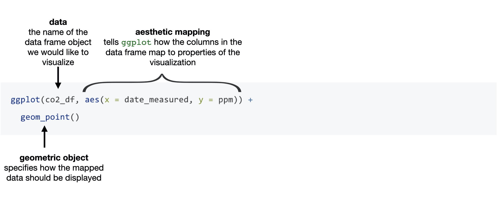

# Effective data visualization {#viz}

## Overview 
This chapter will introduce concepts and tools relating to data visualization
beyond what we have seen and practiced so far.  We will focus on guiding
principles for effective data visualization and explaining visualizations
independent of any particular tool or programming language.  In the process, we
will cover some specifics of creating visualizations (scatter plots, bar
charts, line graphs, and histograms) for data using R. 

## Chapter learning objectives

By the end of the chapter, readers will be able to:

- Describe when to use the following kinds of visualizations to answer specific questions using a data set:
    - scatter plots
    - line plots
    - bar plots 
    - histogram plots
- Given a data set and a question, select from the above plot types and use R to create a visualization that best answers the question
- Given a visualization and a question, evaluate the effectiveness of the visualization and suggest improvements to better answer the question
- Referring to the visualization, communicate the conclusions in non-technical terms
- Identify rules of thumb for creating effective visualizations 
- Define the three key aspects of ggplot objects:
    - aesthetic mappings
    - geometric objects
    - scales
- Use the `ggplot2` package in R to create and refine the above visualizations using:
    - geometric objects: `geom_point`, `geom_line`, `geom_histogram`, `geom_bar`, `geom_vline`, `geom_hline`
    - scales: `scale_x_continuous`, `scale_y_continuous`
    - aesthetic mappings: `x`, `y`, `fill`, `colour`, `shape`
    - labelling: `xlab`, `ylab`, `labs`
    - font control and legend positioning: `theme`
    - subplots: `facet_grid`
- Describe the difference in raster and vector output formats
- Use `ggsave` to save visualizations in `.png` and `.svg` format

## Choosing the visualization
#### *Ask a question, and answer it* {-}

The purpose of a visualization is to answer a question \index{question!visualization} about a data set of interest. So naturally, the first thing to do **before** creating a visualization is to formulate the question about the data you are trying to answer. 
A good visualization will clearly answer your question without distraction; a *great* visualization will suggest even what the question
was itself without additional explanation. Imagine your visualization as part of a poster presentation for a project; even if you aren't standing
at the poster explaining things, an effective visualization will convey your message to the audience.

Recall [the different data analysis questions](index.html#chapter-learning-objectives) from the first chapter. With the visualizations
we will cover in this chapter, we will be able to answer *only descriptive and exploratory* questions. Be careful not to try to answer any *predictive, inferential, causal or mechanistic*
questions, as we have not learned the tools necessary to do that properly just yet.  

As with most coding tasks, it is totally fine (and quite common) to make mistakes and iterate a few times before you find the right visualization for your data and question. There are [many different kinds of plotting graphics](https://serialmentor.com/dataviz/directory-of-visualizations.html) available to use. For the kinds we will introduce in this book, the general rules of thumb are:
\index{visualization!line}
\index{visualization!histogram}
\index{visualization!scatter}
\index{visualization!bar}

- **line plots** visualize trends with respect to an independent, ordered quantity (e.g. time)
- **histograms** visualize the distribution of one quantitative variable (i.e., all its possible values and how often they occur) 
- **scatter plots** visualize the distribution / relationship of two quantitative variables
- **bar plots** visualize comparisons of amounts

All types of visualization have their (mis)uses, but three kinds are usually hard to understand or are easily replaced with an oft-better alternative.
In particular, you should avoid **pie charts**; it is generally better to use bars, as it is easier to compare bar heights than pie slice sizes.
You should also not use **3-D visualizations**, as they are typically hard to understand when converted to a static 2-D image format. Finally,
do not use tables to make numerical comparisons; humans are much better at quickly processing visual information than text and math. Bar plots are again typically a better alternative.


## Refining the visualization
#### *Convey the message, minimize noise* {-}

Just being able to make a visualization in R with `ggplot2` (or any other tool for that matter) doesn't mean that it effectively communicates your message to others. Once you have selected a broad type of visualization to use, you will have to refine it to suit your particular need.
Some rules of thumb for doing this are listed below. They generally fall into two classes: you want to *make your
visualization convey your message*, and you want to *reduce visual noise* as much as possible. Humans have limited cognitive ability
to process information; both of these types of refinement aim to reduce the mental load on your audience when viewing your visualization,
making it easier for them to understand and remember your message quickly.

**Convey the message**

- Make sure the visualization answers the question you have asked most simply and plainly as possible.
- Use legends and labels so that your visualization is understandable without reading the surrounding text.
- Ensure the text, symbols, lines, etc., on your visualization are big enough to be easily read.
- Ensure the data are clearly visible; don't hide the shape/distribution of the data behind other objects (e.g. a bar).
- Make sure to use colour schemes that are understandable by those with colourblindness (a surprisingly large fraction of the overall population). For example, [colorbrewer.org](https://colorbrewer2.org) and the `RColorBrewer` R package provide the ability to pick such colour schemes, and you can check your visualizations after you have created them by uploading to online tools such as the [colour blindness simulator](https://www.color-blindness.com/coblis-color-blindness-simulator/).
- Redundancy can be helpful; sometimes conveying the same message in multiple ways reinforces it for the audience.

**Minimize noise**

- Use colours sparingly. Too many different colours can be distracting, create false patterns, and detract from the message. 
- Be wary of overplotting. If your plot has too many dots or lines and starts to look like a mess, you need to do something different.
- Only make the plot area (where the dots, lines, bars are) as big as needed. Simple plots can be made small.
- Don't adjust the axes to zoom in on small differences. If the difference is small, show that it's small!


## Creating visualizations with `ggplot2` 
#### *Build the visualization iteratively* {-}

This section will cover examples of how to choose and refine a visualization given a data set and a question that you want to answer, 
and then how to create the visualization in R \index{ggplot} using `ggplot2`.  To use the `ggplot2` package, we need to load the `tidyverse` metapackage.


```{r 03-tidyverse,, warning=FALSE, message=FALSE}
library(tidyverse)
```

```{r 03-warn-off, echo = FALSE, results = 'hide', message = FALSE, warning = FALSE}
options(warn = -1)
```


### The Mauna Loa CO2 data set 
 The [Mauna Loa CO2 data set](https://www.esrl.noaa.gov/gmd/ccgg/trends/data.html), curated by [Dr. Pieter Tans, NOAA/GML](https://www.esrl.noaa.gov/gmd/staff/Pieter.Tans/) and [Dr. Ralph Keeling, Scripps Institution of Oceanography](https://scrippsco2.ucsd.edu/)
records the atmospheric concentration of carbon dioxide (CO2, in parts per million) at the Mauna Loa research station in \index{Mauna Loa CO2} Hawaii from 1959 onwards [@maunadata].

**Question:** \index{question!visualization} Does the concentration of atmospheric CO2 change over time, and are there any interesting patterns to note?
```{r 03-data-co2, warning=FALSE, message=FALSE}
# mauna loa carbon dioxide data
co2_df <- read_csv("data/mauna_loa.csv") |>
  filter(ppm > 0, date_decimal < 2000)
co2_df
```

Since we are investigating a relationship between two variables (CO2 concentration and date), a scatter plot is a good place to start. Scatter plots 
show the data as individual points with `x` (horizontal axis) and `y` (vertical axis) coordinates. Here, we will use the decimal
 date as the `x` coordinate 
and CO2 concentration as the `y` coordinate. When using the `ggplot2` package, we create the plot object with the `ggplot` function; there are 
a few basic aspects of a plot that we need to specify:
\index{ggplot!aesthetic mapping}
\index{ggplot!geometric object}

- the *data*: the name of the data frame object that we would like to visualize 
    - here, we specify the `co2_df` data frame
- the *aesthetic mapping*: tells `ggplot` how the columns in the data frame map to properties of the visualization
    - to create an aesthetic mapping, we use the `aes` function
    - here, we set the plot `x` axis to the `date_decimal` variable, and the plot `y` axis to the `ppm` variable
- the *geometric object*: specifies how the mapped data should be displayed
    - to create a geometric object, we use a `geom_*` function (see the [ggplot reference](https://ggplot2.tidyverse.org/reference/) for a list of geometric objects)
    - here, we use the `geom_point` function to visualize our data as a scatterplot

 We can see in Figure \@ref(fig:03-ggplot-function-scatter) how each of these aspects map to our code for creating a basic scatter plot for our `co2_df` data. 
```{r 03-ggplot-function-scatter, echo=FALSE, fig.cap = "Creating a scatterplot with the ggplot function", message =F}

```
We could pass many other possible arguments to the aesthetic mapping and geometric object to change how the plot looks. For 
the purposes of quickly testing things out to see what they look like, though, we can just go with the default settings:
\index{ggplot!aes}
\index{ggplot!geom\_point}

```{r 03-data-co2-scatter, warning=FALSE, message=FALSE, fig.cap = "Scatter plot of atmospheric concentration of CO2 over time"}
co2_scatter <- ggplot(co2_df, aes(x = date_decimal, y = ppm)) +
  geom_point()
co2_scatter
```

Certainly, the visualization in Figure \@ref(fig:03-data-co2-scatter) shows a clear upward trend in the atmospheric concentration of CO2 over time.
This plot answers the first part of our question in the affirmative, but that appears to be the only conclusion one can make from the scatter visualization. 
However, since time is an ordered quantity, we can try using a line plot instead using the `geom_line` function. Line plots require
that their `x` coordinate orders the data, and connect the sequence of `x` and `y` coordinates with line segments. Let's again try this with just 
the default arguments: 
\index{ggplot!geom\_line}

```{r 03-data-co2-line, warning=FALSE, message=FALSE, fig.cap = "Line plot of atmospheric concentration of CO2 over time"}
co2_line <- ggplot(co2_df, aes(x = date_decimal, y = ppm)) +
  geom_line()
co2_line
```

Aha! Figure \@ref(fig:03-data-co2-line) shows us there *is* another interesting phenomenon in the data: in addition to increasing over time, the concentration seems to oscillate as well. 
Given the visualization as it is now, it is still hard to tell how fast the oscillation is, but nevertheless, the line seems to
be a better choice for answering the question than the scatter plot was. The comparison between these two visualizations illustrates a common issue with 
scatter plots: often, the points are shown too close together or even on top of one another, muddling information that would otherwise be clear (*overplotting*).

Now that we have settled on the rough details of the visualization, it is time to refine things. This plot is fairly straightforward, and there is not much
visual noise to remove. But there are a few things we must do to improve clarity, such as adding informative axis labels and making the font a more readable size.
To add axis labels, we use the `xlab` and `ylab` functions. To change the font size, we use the `theme` function with the `text` argument:
\index{ggplot!xlab,ylab}
\index{ggplot!theme}

```{r 03-data-co2-line-2, warning=FALSE, message=FALSE, fig.cap = "Line plot of atmospheric concentration of CO2 over time with clearer axes and labels"}
co2_line <- ggplot(co2_df, aes(x = date_decimal, y = ppm)) +
  geom_line() +
  xlab("Year") +
  ylab("Atmospheric CO2 (ppm)") +
  theme(text = element_text(size = 18))
co2_line
```

Finally, let's see if we can better understand the oscillation by changing the visualization slightly. Note that it is totally fine to use a small number of visualizations to answer different aspects of the question you are trying to answer. We will accomplish
this by using *scales*, \index{ggplot!scales} another important feature of `ggplot2` that easily transforms the different variables and set limits.
We scale the horizontal axis using the `scale_x_continuous` function, and the vertical axis with the `scale_y_continuous` function.
We can transform the axis by passing the `trans` argument, and set limits by passing the `limits` argument. In particular, here, we 
will use the `scale_x_continuous` function with the `limits` argument to zoom in on just five years of data (say, 1990-1995):

```{r 03-data-co2-line-3, warning=FALSE, message=FALSE, fig.cap = "Line plot of atmospheric concentration of CO2 from 1990 to 1995 only"}
co2_line <- ggplot(co2_df, aes(x = date_decimal, y = ppm)) +
  geom_line() +
  xlab("Year") +
  ylab("Atmospheric CO2 (ppm)") +
  scale_x_continuous(limits = c(1990, 1995)) +
  theme(text = element_text(size = 18))
co2_line
```

Interesting! It seems that each year, the atmospheric CO2 increases until it reaches its peak somewhere around April, decreases until around late September, 
and finally increases again until the end of the year. In Hawaii, there are two seasons: summer from May through October, and winter from November through April.
Therefore, the oscillating pattern in CO2 matches up fairly closely with the two seasons.


### The island landmass data set
The `islands.csv` data set \index{Island landmasses} contains a list of Earth's landmasses as well as their area (in thousands of square miles) [@islandsdata]. 

**Question:** \index{question!visualization} Are the continents (North / South America, Africa, Europe, Asia, Australia, Antarctica) Earth's seven largest landmasses? If so, what are the next few largest landmasses after those?
```{r 03-data-islands, warning=FALSE, message=FALSE}
# islands data
islands_df <- read_csv("data/islands.csv")
islands_df
```
Here, we have a list of Earth's landmasses, and are trying to compare their sizes. The right type of visualization to answer this
question is a bar plot, specified by the `geom_bar` function in `ggplot2`. However, by default, `geom_bar` sets the heights
of bars to the number of times a value appears in a data frame (its *count*); here, we want to plot exactly the values in the data frame, i.e.,
the landmass sizes. So we have to pass the `stat = "identity"` argument to `geom_bar`:
\index{ggplot!geom\_bar}

```{r 03-data-islands-bar, warning=FALSE, message=FALSE,  fig.cap = "Bar plot of all Earth's landmasses' size with squished labels"}
islands_bar <- ggplot(islands_df, aes(x = landmass, y = size)) +
  geom_bar(stat = "identity")
islands_bar
```

Alright, not bad! The plot in Figure \@ref(fig:03-data-islands-bar) is definitely the right kind of visualization, as we can clearly see and compare sizes of landmasses. The major issues are that the smaller landmasses' sizes are hard to distinguish, and the names of the landmasses are obscuring each other as they have been squished into too little space. But remember that the question we asked was only about the largest landmasses; let's make the plot a little bit clearer by keeping only the largest 12 landmasses. We do this using the `slice_max` function.
Then to help us make sure the labels have enough space, we'll use horizontal bars instead of vertical ones. We do this by swapping the `x` and `y` variables:
\index{slice\_max}

```{r 03-data-islands-bar-2, warning=FALSE, message=FALSE, fig.cap = "Bar plot of size for Earth's largest 12 landmasses"}
islands_top12 <- slice_max(islands_df, order_by = size, n = 12)
islands_bar <- ggplot(islands_top12, aes(x = size, y = landmass)) +
  geom_bar(stat = "identity") 
islands_bar
```

The plot in Figure \@ref(fig:03-data-islands-bar-2) is definitely clearer now, and allows us to answer our question ("are the top 7 largest landmasses continents?") in
the affirmative. But the question could be made clearer from the plot by organizing the bars not by alphabetical order
but by size, and to colour them based on whether they are a continent. To do this, we 
use `mutate` to add a column to the data regarding whether or not the landmass is a continent:
\index{c function}
\index{mutate}

```{r 03-data-islands-bar-3, warning=FALSE, message=FALSE}
islands_top12 <- slice_max(islands_df, order_by = size, n = 12)
continents <- c("Africa", "Antarctica", "Asia", "Australia", "Europe", "North America", "South America")
islands_ct <- mutate(islands_top12, is_continent = ifelse(landmass %in% continents, "Continent", "Other"))
islands_ct
```

In order to colour the bars, we add the `fill` argument to the aesthetic mapping. Then we use the `reorder` 
function in the aesthetic mapping to organize the landmasses by their `size` variable.
Finally, we \index{ggplot!reorder}\index{ggplot!labs} use the `labs` and `theme` functions to add labels, change the font size, and position the legend:

```{r 03-data-islands-bar-4, warning=FALSE, message=FALSE, fig.cap = "Bar plot of size for Earth's largest 12 landmasses coloured by whether its a continent with clearer axes and labels"}
islands_bar <- ggplot(islands_ct, aes(x = size, y = reorder(landmass, size), fill = is_continent)) +
  geom_bar(stat = "identity") +
  labs(x = "Size (1000 square mi)", y = "Landmass",  fill = "Type") +
  theme(text = element_text(size = 18), legend.position = c(0.75, 0.45))
islands_bar
```

The plot in Figure \@ref(fig:03-data-islands-bar-4) is now a very effective visualization for answering our original questions. Landmasses are organized by their size,
and continents are coloured differently than other landmasses, making it quite clear that continents are the largest seven landmasses.


### The Old Faithful eruption/waiting time data set
The `faithful` data set \index{Old Faithful} contains measurements of the waiting time between eruptions and the subsequent eruption duration (in minutes). The `faithful` data set is available in base R under the name `faithful` so it does not need to be loaded.

**Question:** \index{question!visualization} Is there a relationship between the waiting time before an eruption to the duration of the eruption? 

```{r 03-data-faithful-tibble, echo = F, warning=FALSE, message=FALSE}
# old faithful eruption time / wait time data convert to tibble
faithful <- as.tibble(faithful)
```

```{r 03-data-faithful, warning=FALSE, message=FALSE}
# old faithful eruption time / wait time data
faithful
```

Here again, we investigate the relationship between two quantitative variables (waiting time and eruption time). But if you look at the output of the data frame, you'll notice that neither of the columns are ordered. So, in this case, let's start again with a scatter plot:

```{r 03-data-faithful-scatter, warning=FALSE, message=FALSE, fig.cap = "Scatter plot of waiting time and eruption time"}
faithful_scatter <- ggplot(faithful, aes(x = waiting, y = eruptions)) +
  geom_point()
faithful_scatter
```

We can see in Figure \@ref(fig:03-data-faithful-scatter) the data tend to fall into two groups: one with short waiting and eruption times, and one with long waiting and eruption 
times. Note that in this case, there is no overplotting: the points are generally nicely visually separated, and the pattern they form is clear.
In order to refine the visualization, we need only to add axis labels and make the font more readable:

```{r 03-data-faithful-scatter-2, warning=FALSE, message=FALSE, fig.cap = "Scatter plot of waiting time and eruption time with clearer axes and labels"}
faithful_scatter <- ggplot(faithful, aes(x = waiting, y = eruptions)) +
  geom_point() +
  labs(x = "Waiting Time (mins)", y = "Eruption Duration (mins)") +
  theme(text = element_text(size = 18))
faithful_scatter
```


### The Canadian languages data set

We will return to the `can_lang` data set [@timbers2020canlang], \index{Canadian languages} which contains counts of languages from the 2016 Canadian census.

**Question:** \index{question!visualization} Is there a relationship between the number of people who speak a language as their mother tongue and the number of people who speak that language as their primary spoken language at home? And is there a pattern in the strength of this relationship in the higher-level language categories (Official languages, Aboriginal languages, or non-official and non-Aboriginal languages)?

```{r 03-canlang-example, message = F, warning = F}
can_lang <- read_csv("data/can_lang.csv")
can_lang
```

We will begin with a scatter plot of the `mother_tongue` and `most_at_home` columns from our data frame.
\index{ggplot!geom\_point}

```{r 03-mother-tongue-vs-most-at-home, fig.width=5.75, fig.height=5, warning=FALSE, fig.cap = "Scatter plot of number of Canadians reporting a language as their mother tongue vs the primary language at home"}
ggplot(can_lang, aes(x = most_at_home, y = mother_tongue)) +
  geom_point()
``` 
To improve the interpretability of the data visualization in Figure \@ref(fig:03-mother-tongue-vs-most-at-home) we should replace the default axis names with a more informative labels. We can use `\n` to create a line break in the axis names so the words after `\n` are printed on a new line. This will make the axes labels on the plots more readable.
\index{escape character}

```{r 03-mother-tongue-vs-most-at-home-labs, fig.width=5.75, fig.height=5, warning=FALSE, fig.cap = "Scatter plot of number of Canadians reporting a language as their mother tongue vs the primary language at home with x and y labels"}
ggplot(can_lang, aes(x = most_at_home, y = mother_tongue)) +
  geom_point() +
  xlab("Language spoken most at home \n (number of Canadian residents)") +
  ylab("Mother tongue \n (number of Canadian residents)")
```

Most of the data points from the 214 observations in this data set are bunched up in the lower left-handside of the visualization in Figure \@ref(fig:03-mother-tongue-vs-most-at-home-labs). The data is clumped because many more people in Canada speak the two languages represented by the points in the upper right corner. By filtering the data, we can confirm these two points correspond to the two official languages (English and French):
\index{filter}
```{r english-mother-tongue}
can_lang |>
  filter(language == "English" | language == "French")
```


To answer our question, we will need to adjust the scale of the x and y axes so that they are on a log scale. Doing this can help make patterns in the data more interpretable.

```{r 03-mother-tongue-vs-most-at-home-scale, fig.width=5.75, fig.height=5, warning=FALSE, fig.cap = "Scatter plot of number of Canadians reporting a language as their mother tongue vs the primary language at home with log adjusted x and y axes"}
ggplot(can_lang, aes(x = most_at_home, y = mother_tongue)) +
  geom_point() +
  xlab("Language spoken most at home \n (number of Canadian residents)") +
  ylab("Mother tongue \n (number of Canadian residents)") +
  scale_x_log10(labels = scales::comma) +
  scale_y_log10(labels = scales::comma)
```
> Here we are adjusting the scale of the x and y axes on a $log$ scale with base 10. 
> Notice that $log_{10}(10) = 1$, $log_{10}(100) = 2$, and $log_{10}(1000) = 3$. 
On the logarithmic scale, \index{ggplot!logarithmic scaling} the values 
10, 100 and 1000 are all the same distance apart so we see that applying this function
is moving big values closer together and moving small values farther apart.
> Therefore by adjusting the scale in this way we are highlighting the differences between small values, which allows us to better see the relationship in Figure \@ref(fig:03-mother-tongue-vs-most-at-home-scale).
> Log transformations are not the only way you can transform the data! Notice if you write `log(0)` in R you get `-Inf` so if you have lots of zeros in your data you will want to do something else, which is beyond the scope of the book. 

From the visualization in Figure \@ref(fig:03-mother-tongue-vs-most-at-home-scale), we see that for the 214 languages in this data set, as the number of people who have a language as their mother tongue increases, so does the number of people who speak that language at home. When we see two variables do this, we call this a *positive relationship*. Because the points are fairly close together, we can say that the relationship is strong. Because drawing a straight line through these  points would fit the pattern we observe quite well, we say that it's linear.

```{r 03-changing_the_units, include = FALSE}
english_mother_tongue <- can_lang |>
  filter(language == "English") |>
  pull(mother_tongue)
census_popn <- 35151728
```

Similar to our example in chapter 1, we can convert the counts to percentages to make them more understandable. Changing the units allows us to better interpret the numbers in our data set. We can do this by dividing the number of people reporting a given language as their mother tongue or primary language at home by the number of people who live in Canada and multiplying by 100\%. For example, the percentage of people who reported that their mother tongue was English in the 
2016 Canadian census was `r  format(english_mother_tongue, scientific = FALSE, big.mark = ",") ` / `r  format(census_popn, scientific = FALSE, big.mark = ",")` $\times$ `r 100` \% =
`r format(round(english_mother_tongue/census_popn*100, 2), scientific = FALSE, big.mark = ",")`\%.

Below we use `mutate` to calculate the percentage of people reporting a given language as their mother tongue and primary language at home for all the languages in the `can_lang` data set. Since the new columns are appended to the end of the data table, we selected the new columns after the transformation so you can clearly see the mutated output from the table.
\index{mutate}\index{select}

```{r}
can_lang <- can_lang |>
  mutate(
    mother_tongue_percent = (mother_tongue / 35151728)*100,
    most_at_home_percent = (most_at_home / 35151728)*100
  )
can_lang |> 
  select(mother_tongue_percent, most_at_home_percent)
```

Finally, let's visualize the data now that we have represented it as percentages (and change our axis labels to reflect this change in units!):

```{r 03-mother-tongue-vs-most-at-home-scale-props, fig.width=5.75, fig.height=5, warning=FALSE, fig.cap = "Scatter plot of percentage of Canadians reporting a language as their mother tongue vs the primary language at home"}
ggplot(can_lang, aes(x = most_at_home_percent, y = mother_tongue_percent)) +
  geom_point() +
  xlab("Language spoken most at home \n (percentage of Canadian residents)") +
  ylab("Mother tongue \n (percentage of Canadian residents)") +
  scale_x_log10(labels = scales::comma) +
  scale_y_log10(labels = scales::comma)
```

Now we'll move onto the second part of our exploratory data analysis question: when considering the relationship between the number of people who have a language as their mother tongue and the number of people who speak that language at home, is there a pattern in the strength of this relationship in the higher-level language categories (Official languages, Aboriginal languages, or non-official and non-Aboriginal languages)? One common way to explore this is to colour the data points on the scatter plot we have already created by group. For example, given that we have the higher-level language category for each language recorded in the 2016 Canadian census, we can colour the points in our previous 
scatter plot to represent each language's higher-level language category.

Here we want to distinguish the values according to the `category` group with which they belong.  
We can add an argument to the `aes` function, specifying that the `category` column should colour the points. Adding this argument will colour the points according to their group and add a legend at the side of the plot. 

```{r 03-scatter-colour-by-category, fig.width=7.75, fig.height=4, warning=FALSE,  fig.cap = "Scatter plot of percentage of Canadians reporting a language as their mother tongue vs the primary language at home coloured by language category"}
ggplot(can_lang, aes(x = most_at_home_percent, y = mother_tongue_percent, color = category)) +
  geom_point() +
  xlab("Language spoken most at home \n (percentage of Canadian residents)") +
  ylab("Mother tongue \n (percentage of Canadian residents)") +
  scale_x_log10(labels = scales::comma) +
  scale_y_log10(labels = scales::comma)
```

In Figure \@ref(fig:03-scatter-colour-by-category), the points are coloured with the default `ggplot2` colour palette. But what if you want to use different colours? In R, one package that provides alternative colour palettes \index{color palette} is `RColorBrewer` [@RColorBrewer]. You can visualize the list of colour palettes that `RColorBrewer` has to offer with the `display.brewer.all()` function. You can also print a list of colour blind friendly palettes by adding `colorblindFriendly = T` to the function.

```{r}
library(RColorBrewer)
display.brewer.all(colorblindFriendly = T)
```

From the output above, we can choose the colour palette we want to use in our plot. 
To change the colour palette, we add the `scale_colour_brewer()` layer indicating the palette we want to use. 
```{r scatter-colour-by-category-palette, fig.width=7.75, fig.height=4, warning=FALSE,  fig.cap = "Scatter plot of percentage of Canadians reporting a language as their mother tongue vs the primary language at home coloured by language category with colour blind friendly colours"}
ggplot(can_lang, aes(x = most_at_home_percent, y = mother_tongue_percent, color = category)) +
  geom_point() +
  xlab("Language spoken most at home \n (percentage of Canadian residents)") +
  ylab("Mother tongue \n (percentage of Canadian residents)") +
  scale_x_log10(labels = scales::comma) +
  scale_y_log10(labels = scales::comma) + 
  scale_color_brewer(palette = "RdYlBu")
```

You can use this [color blindness simulator](https://www.color-blindness.com/coblis-color-blindness-simulator/) \index{color palette!color blindness simulator} to check if your visualizations are colour blind friendly.

From the visualization in Figure \@ref(fig:scatter-colour-by-category-palette), we can now clearly see that not just a lot, but that the majority of Canadians reported one of the official languages as their mother tongue and as the language they speak most often at home. 

What do we see when considering the second part of our exploratory question? Do we see a difference in the pattern of the relationship between the number of people who speak a language as their mother tongue and the number of people who speak a language as their primary spoken language at home between higher-level language categories? Probably not!

For each higher-level language category, there appears to be a positive relationship between the number of people who speak a language as their mother tongue and the number of people who speak a language as their primary spoken language at home. This relationship looks similar, regardless of the category. 

Does this mean that this relationship is positive for all languages in the world? Can we use this data visualization on its own to predict how many people have a given language as their mother tongue if we know how many people speak it as their primary language at home? The answer to both these questions is "no." However, with exploratory data analysis, we can create new hypotheses, ideas, and questions (like the ones at the beginning of this paragraph). Answering those questions would likely involve gathering additional data and doing more complex analyses, which we will see more of later in this book.   

Now, we can go one step further and distinguish English and French languages with different colours in our visualization. To separate these languages, we will filter the rows where the language is either English or French and mutate the `category` column to equal the corresponding language. 
\index{filter}\index{mutate}

```{r 03-separate-English-French}
english_and_french <- can_lang |>
  filter(language == "English" | language == "French") |>
  mutate(category = language)
english_and_french
```

Next we will bind \index{bind\_rows} the mutated data set `english_and_french` that we just created with the remaining rows in the `can_lang` data set:
```{r 03-bind-english-french}
can_lang <- bind_rows(
  english_and_french,
  can_lang |>
    filter(language != "English" & language != "French")
)
```


We have added a few more layers to make the data visualization in Figure \@ref(fig:03-nachos-to-cheesecake) even more effective. Specifically, we used have improved the visualizations accessibility by choosing colours that are easier to distinguish, mapped category to shape, and handled the problem of overlapping data points by making them slightly transparent. \index{ggplot!transparency}\index{alpha|see{ggplot}}
```{r 03-nachos-to-cheesecake, fig.width=7.75, fig.height=4, warning=FALSE, message=FALSE, fig.cap = "Scatter plot of percentage of Canadians reporting a language as their mother tongue vs the primary language at home coloured by language category"}
ggplot(can_lang, aes(
  x = most_at_home_percent,
  y = mother_tongue_percent,
  colour = category,
  shape = category
)) + # map categories to different shapes
  geom_point(alpha = 0.6) + # set the transparency of the points
  xlab("Language spoken most at home \n (percentage of Canadian residents)") +
  ylab("Mother tongue \n (percentage of Canadian residents)") +
  scale_x_log10(labels = scales::comma) +
  scale_y_log10(labels = scales::comma) + 
  scale_color_brewer(palette = "RdYlBu")
```

### The Michelson speed of light data set
The `morley` data set \index{Michelson speed of light} contains measurements of the speed of light (in kilometres per second with 299,000 subtracted) from the year 1879 
for five experiments, each with 20 consecutive runs [@lightdata]. This data set is available in base R under the name `morley` so it does not need to be loaded.

**Question:** \index{question!visualization} Given what we know now about the speed of 
light (299,792.458 kilometres per second), how accurate were each of the experiments?
```{r 03-data-morley-tibble, echo = F, warning=FALSE, message=FALSE}
# michelson morley experimental data
morley <- as.tibble(morley)
```

```{r 03-data-morley, warning=FALSE, message=FALSE}
# michelson morley experimental data
morley
```

In this experimental data, Michelson was trying to measure just a single quantitative number (the speed of light). The data set
contains many measurements of this single quantity. To tell how accurate the experiments were, we need to visualize the 
distribution of the measurements (i.e., all their possible values and how often each occurs). We can do this using a *histogram*. A histogram \index{ggplot!histogram} helps us visualize how a 
particular variable is distributed in a data set by separating the data into bins, and then using vertical bars 
to show how many data points fell in each bin. To create a histogram in `ggplot2` we will use the `geom_histogram` geometric
object, setting the `x` axis to the `Speed` measurement variable; and as we did before, let's use the default arguments just to see how things look:

```{r 03-data-morley-hist, warning=FALSE, message=FALSE, fig.cap = "Histogram of Michelson's speed of light data"}
morley_hist <- ggplot(morley, aes(x = Speed)) +
  geom_histogram()
morley_hist
```

Figure \@ref(fig:03-data-morley-hist) is a great start. However, we cannot tell how accurate the measurements are using this visualization unless we can see what the true value is.
In order to visualize the true speed of light, we will add a vertical line with the `geom_vline` function, \index{ggplot!geom\_vline} setting the `xintercept` argument
to the true value. There is a similar function, `geom_hline`, that is used for plotting horizontal lines. Note that *vertical lines*
are used to denote quantities on the *horizontal axis*, while *horizontal lines* are used to denote quantities on the *vertical axis*. 

```{r 03-data-morley-hist-2, warning=FALSE, message=FALSE,fig.cap = "Histogram of Michelson's speed of light data with vertical line indicating true speed of light"}
morley_hist <- ggplot(morley, aes(x = Speed)) +
  geom_histogram() +
  geom_vline(xintercept = 792.458, linetype = "dashed", size = 1.0)
morley_hist
```

In Figure \@ref(fig:03-data-morley-hist-2), we also still cannot tell which experiments (denoted in the `Expt` column) led to which measurements; perhaps some experiments were more accurate than
others. To fully answer our question, we need to separate the measurements from each other visually. We can
try to do this using a *coloured* histogram, where counts from different experiments are stacked on top of each
other in different colours. We can create a histogram coloured by the `Expt` variable by adding it to the `fill` aesthetic mapping. We make sure the different colours can be seen (despite them all sitting on top of each other) by setting the `alpha` argument in `geom_histogram`
to `0.5` to make the bars slightly translucent:

```{r 03-data-morley-hist-3, warning=FALSE, message=FALSE, fig.cap = "Histogram of Michelson's speed of light data coloured by experiment"}
morley_hist <- ggplot(morley, aes(x = Speed, fill = Expt)) +
  geom_histogram(position = "identity", alpha = 0.5) +
  geom_vline(xintercept = 792.458, linetype = "dashed", size = 1.0)
morley_hist
```

Wait a second; the histogram is still all the same colour! What is going on here? If we look at the printed `morley` data, the column `Expt` is an integer (we see the label `<int>` underneath the `Expt` column name). But we want to treat it as a categorical variable.  To fix this issue we can write `factor(Expt)` in the `fill` aesthetic mapping. Recall that factors are a special categorical type of variable in R that are often used for class label data. By writing `factor(Expt)` we are ensuring that R will treat this variable as a factor and the colour will be mapped discretely.
\index{factor!usage in ggplot}

```{r 03-data-morley-hist-with-factor, warning=FALSE, message=FALSE, fig.cap = "Histogram of Michelson's speed of light data coloured by experiment as factor"}
morley_hist <- ggplot(morley, aes(x = Speed, fill = factor(Expt))) +
  geom_histogram(position = "identity", alpha = 0.5) +
  geom_vline(xintercept = 792.458, linetype = "dashed", size = 1.0)
morley_hist
```

> Factors impact plots in two ways:
(1) ensuring a colour is mapped as discretely where appropriate (like in this example) and (2) the ordering of levels in a plot. `ggplot` takes into account the order of the factor levels as opposed to the order that is displayed in your data frame. Learning how to reorder your factor levels will help you with reordering the labels of a factor on a plot.  
 
Unfortunately, the attempt to separate out the experiment number visually has created a bit of a mess. All of the colours in Figure \@ref(fig:03-data-morley-hist-3)
are blending together, and although it is possible to derive *some* insight from this (e.g., experiments 1 and 3 had some 
of the most incorrect measurements), it isn't the clearest way to convey our message and answer the question. Let's try a different strategy of 
creating multiple separate histograms on top of one another. 

In order to create a plot in `ggplot2` 
that has multiple subplots arranged in a grid, 
we use the `facet_grid` function.
The argument to `facet_grid` specifies the variable(s) used to split the plot 
into subplots, and how to split them (i.e., into rows or columns).
If the plot is to be split horizontally, into rows, 
then the `rows` argument is used.
If the plot is to be split vertically, into columns, 
then the `columns` argument is used.
Both the `rows` and `columns` argument take the column names to split the data 
on when creating the subplots. 
One key thing is that the column names must be surrounded by the `vars` function.
This function allows the column names to be correctly evaluated 
in the context of the data frame.
\index{ggplot!facet\_grid}

```{r 03-data-morley-hist-4, warning=FALSE, message=FALSE, fig.cap = "Histogram of Michelson's speed of light data split vertically by experiment"}
morley_hist <- ggplot(morley, aes(x = Speed, fill = factor(Expt))) +
  geom_histogram(position = "identity") +
  facet_grid(rows = vars(Expt)) +
  geom_vline(xintercept = 792.458, linetype = "dashed", size = 1.0)
morley_hist
```

The visualization in Figure \@ref(fig:03-data-morley-hist-4) now makes it quite clear how accurate the different experiments were with respect to one another. 
There are two finishing touches to make this visualization even clearer. First and foremost, we need to add informative axis labels
using the `labs` function, and increase the font size to make it readable using the `theme` function. Second, and perhaps more subtly, even though it 
is easy to compare the experiments on this plot to one another, it is hard to get a sense 
for just how accurate all the experiments were overall. For example, how accurate is the value 800 on the plot, relative to the true speed of light?
To answer this question, we'll use the `mutate` function to transform our data into a relative measure of accuracy rather than absolute measurements:
\index{ggplot!labs}\index{ggplot!theme}

```{r 03-data-morley-hist-5, warning=FALSE, message=FALSE, fig.cap = "Histogram of relative accuracy split vertically by experiment with clearer axes and labels"}
morley_rel <- mutate(morley, relative_accuracy = 100 * ((299000 + Speed) - 299792.458) / (299792.458))
morley_hist <- ggplot(morley_rel, aes(x = relative_accuracy, fill = factor(Expt))) +
  geom_histogram(position = "identity") +
  facet_grid(Expt ~ .) +
  geom_vline(xintercept = 0, linetype = "dashed", size = 1.0) +
  labs(x = "Relative Accuracy (%)", y = "# Measurements", fill = "Experiment ID") +
  theme(text = element_text(size = 18))
morley_hist
```

Wow, impressive! These measurements of the speed of light from 1879 had errors around *0.05%* of the true speed. Figure \@ref(fig:03-data-morley-hist-5) shows you that even though experiments 2 and 5 were perhaps the most accurate, all of the experiments did quite an 
admirable job given the technology available at the time.


## Explaining the visualization
#### *Tell a story* {-}

Typically, your visualization will not be shown entirely on its own, but rather it will be part of a larger presentation.
Further, visualizations can provide supporting information for any aspect of a presentation, from opening to conclusion.
For example, you could use an exploratory visualization in the opening of the presentation to motivate your choice
of a more detailed data analysis / model, a visualization of the results of your analysis to show what your analysis has uncovered,
or even one at the end of a presentation to help suggest directions for future work. 

Regardless of where it appears, a good way to discuss your visualization is as a story \index{visualization!explanation}:

1) Establish the setting and scope, and motivate why you did what you did. 
2) Pose the question that your visualization answers. Justify why the question is important to answer.
3) Answer the question using your visualization. Make sure you describe *all* aspects of the visualization (including describing the axes). But you 
   can emphasize different aspects based on what is important to answer your question:
    - **trends (lines):** Does a line describe the trend well? If so, the trend is *linear*, and if not, the trend is *nonlinear*. Is the trend increasing, decreasing, or neither?
                        Is there a periodic oscillation (wiggle) in the trend? Is the trend noisy (does the line "jump around" a lot) or smooth?
    - **distributions (scatters, histograms):** How spread out are the data? Where are they centered, roughly? Are there any obvious "clusters" or "subgroups", which would be visible as multiple bumps in the histogram?  
    - **distributions of two variables (scatters):** is there a clear / strong relationship between the variables (points fall in a distinct pattern), a weak one (points fall in a pattern but there is some noise), or no discernible
      relationship (the data are too noisy to make any conclusion)?
    - **amounts (bars):** How large are the bars relative to one another? Are there patterns in different groups of bars? 
4) Summarize your findings, and use them to motivate whatever you will discuss next.

Below are two examples of how one might take these four steps in describing the example visualizations that appeared earlier in this chapter.
Each of the steps is denoted by its numeral in parentheses, e.g. (3).

**Mauna Loa Atmospheric CO2 Measurements:** (1) \index{Mauna Loa CO2} Many current forms of energy generation and conversion---from automotive engines to natural gas power plants---rely on burning
fossil fuels and produce greenhouse gases, typically primarily carbon dioxide (CO2), as a byproduct. Too much of these gases in the Earth's atmosphere will cause it to trap
more heat from the sun, leading to global warming. (2) In order to assess how quickly the atmospheric concentration of CO2 is increasing over time, we (3) used a data set from
the Mauna Loa observatory from Hawaii, consisting of CO2 measurements from 1959 to the present. We plotted the measured concentration of CO2 (on the vertical axis) over time
(on the horizontal axis). From this plot, you can see a clear, increasing, and generally linear trend over time. There is also a periodic oscillation that occurs once per year and
aligns with Hawaii's seasons, with an amplitude that is small relative to the growth in the overall trend. This shows that atmospheric CO2 is clearly increasing over 
time, and (4) it is perhaps worth investigating more into the causes.

**Michelson Light Speed Experiments:** (1) \index{Michelson speed of light} Our modern understanding of the physics of light has advanced significantly from the 
late 1800s when Michelson and Morley's experiments first demonstrated that it had a finite speed. We now know based on modern experiments that it 
moves at roughly 299792.458 kilometres per second. (2) But how accurately were we first able to measure this fundamental physical constant, and did certain
experiments produce more accurate results than others?
(3) To better understand this we plotted data from 5 experiments by Michelson in 1879, each with 20 trials, as histograms stacked on top of one another.
The horizontal axis shows the accuracy of the measurements relative to the true speed of light as we know it today, expressed as a percentage.
From this visualization, you can see that most results had relative errors of at most 0.05%. You can also see that experiments 1 and 3 had
measurements that were the farthest from the true value, and experiment 5 tended to provide the most consistently accurate result. (4) It would be
worth further investigating the differences between these experiments to see why they produced different results.


## Saving the visualization
#### *Choose the right output format for your needs* {-}

Just as there are many ways to store data sets, there are many ways to store visualizations and images.
Which one you choose can depend on several factors, such as file size/type limitations 
(e.g., if you are submitting your visualization as part of a conference paper or to a poster printing shop)
and where it will be displayed (e.g., online, in a paper, on a poster, on a billboard, in talk slides).
Generally speaking, images come in two flavours: *bitmap* (or *raster*) \index{bitmap|see{raster graphics}}\index{raster graphics} formats and *vector* (or *scalable graphics*) \index{vector graphics} formats.


**Bitmap / Raster** images are represented as a 2-D grid of square pixels, each with its own colour. Raster images are often *compressed* before storing so they take up less space. A compressed format is *lossy* if the image cannot be perfectly recreated when loading and displaying, with the hope that the change is not noticeable. *Lossless* formats, on the other hand, allow a perfect display of the original image.
\index{raster graphics!file types}

- *Common file types:* 
    - [JPEG](https://en.wikipedia.org/wiki/JPEG) (`.jpg`, `.jpeg`): lossy, usually used for photographs 
    - [PNG](https://en.wikipedia.org/wiki/Portable_Network_Graphics) (`.png`): lossless, usually used for plots / line drawings
    - [BMP](https://en.wikipedia.org/wiki/BMP_file_format) (`.bmp`): lossless, raw image data, no compression (rarely used)
    - [TIFF](https://en.wikipedia.org/wiki/TIFF) (`.tif`, `.tiff`): typically lossless, no compression, used mostly in graphic arts, publishing
- *Open-source software:* [GIMP](https://www.gimp.org/)

**Vector / Scalable Graphics** images are represented as a collection of mathematical objects (lines, surfaces, shapes, curves). When the computer displays the image, it redraws all of the elements using their mathematical formulas.
\index{vector graphics!file types}

- *Common file types:* 
    - [SVG](https://en.wikipedia.org/wiki/Scalable_Vector_Graphics) (`.svg`): general-purpose use 
    - [EPS](https://en.wikipedia.org/wiki/Encapsulated_PostScript) (`.eps`), general-purpose use (rarely used)
- *Open-source software:* [Inkscape](https://inkscape.org/)

Raster and vector images have opposing advantages and disadvantages. A raster image of a fixed width / height takes the same amount of space and time to load regardless of 
what the image shows (caveat: the compression algorithms may shrink the image more or run faster for certain images). A vector image takes space and time to load 
corresponding to how complex the image is, since the computer has to draw all the elements each time it is displayed. For example, if you have a scatter plot with 1 million
points stored as an SVG file, it may take your computer some time to open the image. On the other hand, you can zoom into / scale up 
vector graphics as much as you like without the image looking bad, while raster images eventually start to look "pixellated." 

> **PDF files:** 
> The portable document format [PDF](https://en.wikipedia.org/wiki/PDF) (`.pdf`) is commonly used to
> store *both* raster and vector graphics formats. If you try to open a PDF and it's taking a long time
> to load, it may be because there is a complicated vector graphics image that your computer is rendering. 
\index{PDF}
\index{portable document format|see{PDF}}


Let's investigate how different image file formats behave with a scatter plot of the
[Old Faithful data set](https://www.stat.cmu.edu/~larry/all-of-statistics/=data/faithful.dat) [@faithfuldata]:

```{r 03-plot-line, collapse=TRUE, warning=FALSE, message=FALSE, fig.cap = "Scatter plot of waiting time and eruption time"}
library(svglite) # we need this to save SVG files
faithful_plot <- ggplot(data = faithful, aes(x = waiting, y = eruptions)) +
  geom_point()

faithful_plot

ggsave("img/faithful_plot.png", faithful_plot)
ggsave("img/faithful_plot.jpg", faithful_plot)
ggsave("img/faithful_plot.bmp", faithful_plot)
ggsave("img/faithful_plot.tiff", faithful_plot)
ggsave("img/faithful_plot.svg", faithful_plot)

print(paste("PNG filesize: ", file.info("img/faithful_plot.png")["size"] / 1000000, "MB"))
print(paste("JPG filesize: ", file.info("img/faithful_plot.jpg")["size"] / 1000000, "MB"))
print(paste("BMP filesize: ", file.info("img/faithful_plot.bmp")["size"] / 1000000, "MB"))
print(paste("TIFF filesize: ", file.info("img/faithful_plot.tiff")["size"] / 1000000, "MB"))
print(paste("SVG filesize: ", file.info("img/faithful_plot.svg")["size"] / 1000000, "MB"))
```
Wow, that's quite a difference! Notice that for such a simple plot with few
graphical elements (points), the vector graphics format (SVG) is over 100 times
smaller than the uncompressed raster images (BMP, TIFF). Also, note that the
JPG format is twice as large as the PNG format since the JPG compression
algorithm is designed for natural images (not plots). Below, we also show what
the images look like when we zoom in to a rectangle with only 3 data points.
You can see why vector graphics formats are so useful: because they're just
based on mathematical formulas, vector graphics can be scaled up to arbitrary
sizes.  This makes them great for presentation media of all sizes, from papers
to posters to billboards.


```{r 03-raster-image, echo=FALSE, fig.cap = "Zoomed in `faithful`, raster (PNG, left) and vector (SVG, right) formats", fig.show="hold", out.width="230pt", out.height="200pt", fig.align= "center", message =F}
knitr::include_graphics("img/faithful_zoom.png")
knitr::include_graphics("img/faithful_zoom.svg")
```

## Additional resources
- The [`ggplot2` page on the tidyverse website](https://ggplot2.tidyverse.org) is where you should look if you want to learn more about the functions in this chapter, the full set of arguments you can use, and other related functions. The site also provides a very nice cheat sheet that summarizes many of the data wrangling functions from this chapter.
- The [Fundamentals of Data Visualization](https://serialmentor.com/dataviz/) has a wealth of information on designing effective visualizations. It is not specific to any particular programming language or library. If you want to improve your visualization skills, this is the next place to look.
- [R for Data Science](https://r4ds.had.co.nz/) has a chapter on [creating visualizations using `ggplot2`](https://r4ds.had.co.nz/data-visualisation.html). This reference is specific to R and `ggplot2`, but provides a much more detailed introduction to the full set of tools that `ggplot2` provides. This chapter is where you should look if you want to learn how to make more intricate visualizations in `ggplot2` than what is included in this chapter.
