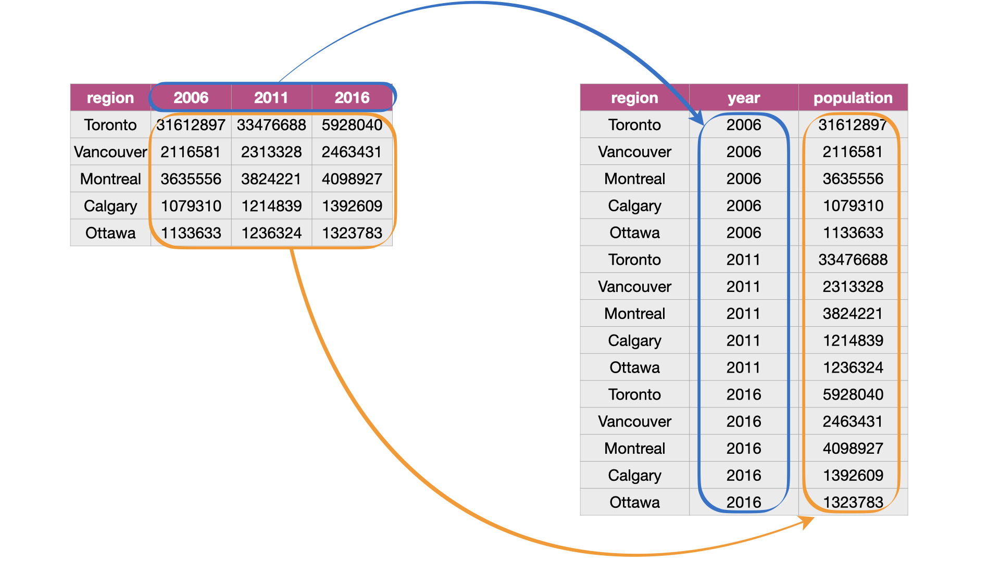
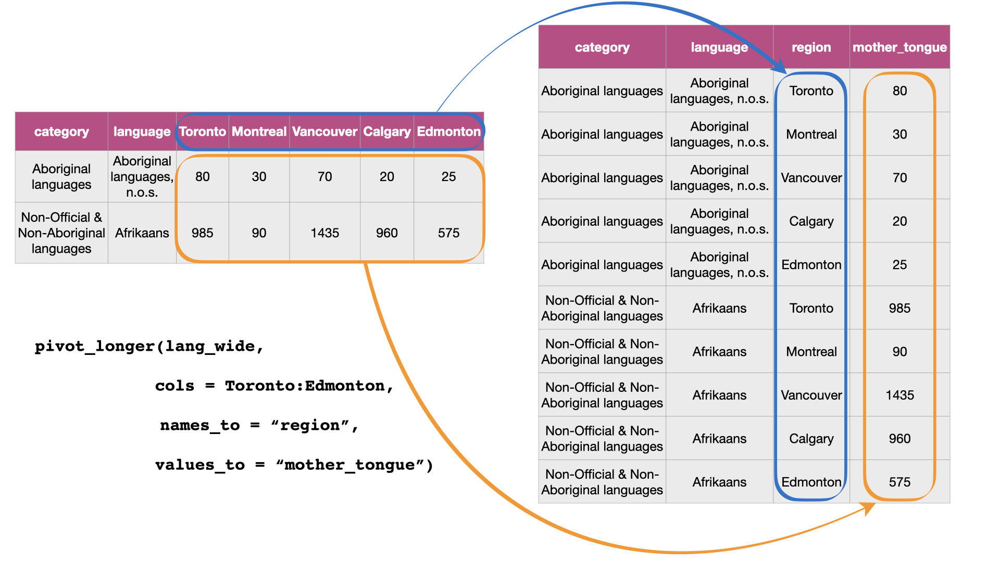
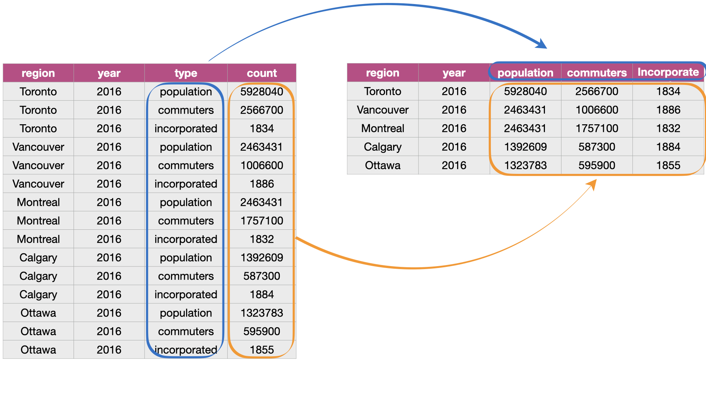

# Cleaning and wrangling data {#wrangling}

``` {r wrangling-setup, include=FALSE}
library(magick)
library(tidyverse)
library(canlang)
library(cowplot)

# set as default because for some reason it breaks the pdf in this chapter
knitr::opts_chunk$set(fig.align = "default")
```

## Overview

This chapter is centered around defining tidy data&mdash;a data format that is
suitable for analysis&mdash;and the tools needed to transform raw data into this
format. This will be presented in the context of a real-world data science
application, providing more practice working through a whole case study.

## Chapter learning objectives

By the end of the chapter, readers will be able to:

  - define the term "tidy data"
  - discuss the advantages of storing data in a tidy data format
  - define what vectors, lists, and data frames are in R, and describe how they relate to
    each other
  - describe the common types of data in R and their uses
  - recall and use the following functions for their
    intended data wrangling tasks:
      - `across`
      - `c`
      - `filter`
      - `group_by`
      - `select`
      - `map`
      - `mutate`
      - `pull`
      - `pivot_longer`
      - `pivot_wider`
      - `rowwise`
      - `separate`
      - `summarize`
  - recall and use the following operators for their
    intended data wrangling tasks:
      - `==` 
      - `%in%`
      - `!`
      - `&` 
      - `|`
      - `|>` and `%>%`

## Data frames, vectors, and lists

In Chapters \@ref(intro) and \@ref(reading), *data frames* were the focus:
we learned how to import data into R as a data frame, and perform basic operations on data frames in R.
In the remainder of this book, this pattern continues. The vast majority of tools we use will require 
that data are represented as a data frame in R. Therefore, in this section,
we will dig more deeply into what data frames are and how they are represented in R.
This knowledge will be helpful in effectively utilizing these objects in our data analyses.

### What is a data frame?

A data frame \index{data frame!definition} is a table-like structure for storing data in R.  Data frames are
important to learn about because most data that you will encounter in practice
can be naturally stored as a table.  In order to define data frames precisely,
we need to introduce a few technical terms:

- **variable:** a \index{variable} characteristic, number, or quantity that can be measured.
- **observation:** all \index{observation} of the measurements for a given entity.
- **value:** a \index{value} single measurement of a single variable for a given entity.

Given these definitions, a **data frame** is a tabular data structure in R
that is designed to store observations, variables, and their values.
Most commonly, each column in a data frame corresponds to a variable,
and each row corresponds to an observation. For example, Figure
\@ref(fig:02-obs) displays a data set of city populations. Here, the variables
are "region, year, population;" each of these are properties that can be
collected or measured.  The first observation is "Toronto, 2016, 2235145;"
these are the values that the three variables take for the first entity in the
data set. There are 13 entities in the data set in total, corresponding to the
13 rows in Figure \@ref(fig:02-obs).

``` {r 02-obs, echo = FALSE, message = FALSE, warning = FALSE, fig.cap = "A data frame storing data regarding the population of various regions in Canada. In this example data frame, the row that corresponds to the observation for the city of Vancouver is colored yellow, and the column that corresponds to the population variable is colored blue.", fig.retina = 2, out.width = "100%"}
image_read("img/data_frame_slides_cdn/data_frame_slides_cdn.004.jpeg") %>%
  image_crop("3632x700")
```

Internally, R stores the columns of a data frame as either
*lists* or *vectors*.  For example, the data frame in Figure
\@ref(fig:02-vectors) has three vectors whose names are `region`, `year` and
`population`.  We will explain what lists and vectors are in the next two
sections.

``` {r 02-vectors, echo = FALSE, message = FALSE, warning = FALSE, fig.cap = "Data frame with three vectors.", fig.retina = 2, out.width = "100%"}
image_read("img/data_frame_slides_cdn/data_frame_slides_cdn.005.jpeg") %>%
  image_crop("3632x700")
```

### What is a vector?

In R, **vectors** \index{vector}\index{atomic vector|see{vector}} are objects that can contain one or more elements. The vector
elements are ordered, and they must all be of the same **data type**;
R has several different basic data types, as shown in Table \@ref(tab:datatype-table).
Figure \@ref(fig:02-vector) provides an example of a vector where all of the elements are
of character type.
You can create vectors in R using the `c` function  \index{c function} (`c` stands for "concatenate").  For 
example, to create the vector `region` as shown in Figure
\@ref(fig:02-vector), you would write:

``` {r}
year <- c("Toronto", "Montreal", "Vancouver", "Calgary", "Ottawa")
year
```

> **Note:** Technically, these objects are called "atomic vectors." In this book
> we have chosen to call them "vectors," which is how they are most commonly
> referred to in the R community. To be totally precise, "vector" is an umbrella term that
> encompasses both atomic vector and list objects in R. But this creates a 
> confusing situation where the term "vector" could 
> mean "atomic vector" *or* "the umbrella term for atomic vector and list," 
> depending on context. Very confusing indeed! So to keep things simple, in 
> this book we *always* use the term "vector" to refer to "atomic vector." 
> We encourage readers who are enthusiastic to learn more to read the
> Vectors chapter of Advanced R [@wickham2019advanced].

``` {r 02-vector, echo = FALSE, message = FALSE, warning = FALSE, fig.cap = "Example of a vector whose type is character.", fig.retina = 2, out.width = "100%"}
image_read("img/data_frame_slides_cdn/data_frame_slides_cdn.007.jpeg") %>%
  image_crop("3632x590")
```

Table: (#tab:datatype-table) Basic data types in R

| Data type  | Abbreviation |   Description           |    Example     |
| ---------- | ------------ |------------------------ |----------------|
| character | chr | letters or numbers surrounded by quotes | "1" , "Hello world!" |
| double | dbl | numbers with decimals values | 1.2333 |
| integer | int | numbers that do not contain decimals | 1L, 20L (where "L" tells R to store as an integer) |
| logical | lgl | either true or false | `TRUE`, `FALSE` |
| factor | fct | used to represent data with a limited number of values (usually categories) | a `color` variable with levels `red`, `green` and `orange` |

\index{data types}
\index{character}\index{chr|see{character}}
\index{integer}\index{int|see{integer}}
\index{double}\index{dbl|see{double}}
\index{logical}\index{lgl|see{logical}}
\index{factor}\index{fct|see{factor}}
It is important in R to make sure you represent your data with the correct type. 
Many of the `tidyverse` functions we use in this book treat 
the various data types differently. You should use integers and double types
(which both fall under the "numeric" umbrella type) to represent numbers and perform
arithmetic. Doubles are more common than integers in R, though; for instance, a double data type is the
default when you create a vector of numbers using `c()`, and when you read in
whole numbers via `read_csv`. Characters are used to represent data that should
be thought of as "text", such as words, names, paths, URLs, and more. Factors help us
encode variables that represent *categories*; a factor variable takes one of a discrete
set of values known as *levels* (one for each category). The levels can be ordered or unordered.  Even though
factors can sometimes *look* like characters, they are not used to represent
text, words, names, and paths in the way that characters are; in fact, R
internally stores factors using integers! There are other basic data types in R, such as *raw*
and *complex*, but we do not use these in this textbook.

### What is a list?

Lists \index{list} are also objects in R that have multiple, ordered elements.
Vectors and lists differ by the requirement of element type
consistency. All elements within a single vector must be of the same type (e.g.,
all elements are characters), whereas elements within a single list can be of
different types (e.g., characters, integers, logicals, and even other lists). 

``` {r 02-vec-vs-list, echo = FALSE, message = FALSE, warning = FALSE, fig.cap = "A vector versus a list.", fig.retina = 2, out.width = "100%"}
image_read("img/data_frame_slides_cdn/data_frame_slides_cdn.008.jpeg") %>%
  image_crop("3632x590")
```

### What does this have to do with data frames?

A data frame \index{data frame!definition} is really a special kind of list that follows two rules:

1. Each element itself must either be a vector or a list. 
2. Each element (vector or list) must have the same length.

Not all columns in a data frame need to be of the same type. 
Figure \@ref(fig:02-dataframe) shows a data frame where
the columns are vectors of different types.
But remember: because the columns in this example are *vectors*, 
the elements must be the same data type *within each column.* 
On the other hand, if our data frame had *list* columns, there would be no such requirement.
It is generally much more common to use *vector* columns, though, 
as the values for a single variable are usually all of the same type.

``` {r 02-dataframe, echo = FALSE, message = FALSE, warning = FALSE, fig.cap = "Data frame and vector types.", fig.retina = 2, out.width = "100%"}
image_read("img/data_frame_slides_cdn/data_frame_slides_cdn.009.jpeg") %>%
  image_crop("3632x700")
```

The functions from the `tidyverse` package that we use often give us a
special class of data frame called a *tibble*. Tibbles have some additional \index{tibble}
features and benefits over the built-in data frame object. These include the
ability to add useful attributes (such as grouping, which we will discuss later)
and more predictable type preservation when subsetting. 
Because a tibble is just a data frame with some added features, 
we will collectively refer to both built-in R data frames and
tibbles as data frames in this book.

>  **Note:** You can use the function `class` \index{class} on a data object to assess whether a data
> frame is a built-in R data frame or a tibble. If the data object is a data
> frame, `class` will return `"data.frame"`. If the data object is a
> tibble it will return `"tbl_df" "tbl" "data.frame"`. You can easily convert
> built-in R data frames to tibbles using the `tidyverse` `as_tibble` function.
> For example we can check the class of the Canadian languages data set,
> `can_lang`, we worked with in the previous chapters and we see it is a tibble.

``` {r 02-load-can-land, warning=F, message=F}
class(can_lang)
```

Vectors, data frames and lists are basic types of *data structure* in R, which
are core to most data analyses. We summarize them in Table
\@ref(tab:datastructure-table). There are several other data structures in the R programming 
language (*e.g.,* matrices), but these are beyond the scope of this book.

Table: (#tab:datastructure-table) Basic data structures in R

| Data Structure | Description |
| ---            |------------ |
| vector | An ordered collection of one, or more, values of the *same data type*. |
| list | An ordered collection of one, or more, values of *possibly different data types*. |
| data frame | A list of either vectors or lists of the *same length*, with column names. We typically use a data frame to represent a data set. | 

## Tidy data

There are many ways a tabular data set can be organized. This chapter will focus
on introducing the **tidy data** \index{tidy data!definition} format of organization and how to make your raw
(and likely messy) data tidy. A tidy data frame satisfies 
the following three criteria [@wickham2014tidy]:

  - each row is a single observation,
  - each column is a single variable, and
  - each value is a single cell (i.e., its entry in the data
    frame is not shared with another value).

Figure \@ref(fig:02-tidy-image) demonstrates a tidy data set that satisfies these 
three criteria. 

``` {r 02-tidy-image, echo = FALSE, message = FALSE, warning = FALSE, fig.cap = "Tidy data satisfies three criteria.", fig.retina = 2, out.width = "100%"}
image_read("img/tidy_data.jpeg") %>%
  image_crop("3632x530")
```

There are many good reasons for making sure your data are tidy as a first step in your analysis.
The most important is that it is a single, consistent format that nearly every function
in the `tidyverse` recognizes. No matter what the variables and observations 
in your data represent, as long as the data frame \index{tidy data!arguments for}
is tidy, you can manipulate it, plot it, and analyze it using the same tools.
If your data is *not* tidy, you will have to write special bespoke code
in your analysis that will not only be error-prone, but hard for others to understand.
Beyond making your analysis more accessible to others and less error-prone, tidy data
is also typically easy for humans to interpret. Given these benefits,
it is well worth spending the time to get your data into a tidy format
upfront. Fortunately, there are many well-designed `tidyverse` data
cleaning/wrangling tools to help you easily tidy your data. Let's explore them
below!

> **Note:** Is there only one shape for tidy data for a given data set? Not
> necessarily! It depends on the statistical question you are asking and what
> the variables are for that question. For tidy data, each variable should be
> its own column. So, just as it's essential to match your statistical question
> with the appropriate data analysis tool, it's important to match your
> statistical question with the appropriate variables and ensure they are
> represented as individual columns to make the data tidy.

### Tidying up: going from wide to long using `pivot_longer`

One task that is commonly performed to get data into a tidy format \index{pivot\_longer}
is to combine values that are stored in separate columns, 
but are really part of the same variable, into one.
Data is often stored this way 
because this format is sometimes more intuitive for human readability 
and understanding, and humans create data sets.
In Figure \@ref(fig:02-wide-to-long), 
the table on the left is in an untidy, "wide" format because the year values 
(2006, 2011, 2016) are stored as column names. 
And as a consequence, 
the values for population for the various cities 
over these years are also split across several columns. 

For humans, this table is easy to read, which is why you will often find data
stored in this wide format.  However, this format is difficult to work with
when performing data visualization or statistical analysis using R.  For
example, if we wanted to find the latest year it would be challenging because
the year values are stored as column names instead of as values in a single
column.  So before we could apply a function to find the latest year (for
example, by using `max`), we would have to first extract the column names
to get them as a vector and then apply a function to extract the latest year.
The problem only gets worse if you would like to find the value for the
population for a given region for the latest year.  Both of these tasks are
greatly simplified once the data is tidied.

Another problem with data in this format is that we don't know what the
numbers under each year actually represent. Do those numbers represent
population size? Land area? It's not clear. 
To solve both of these problems, 
we can reshape this data set to a tidy data format 
by creating a column called "year" and a column called
"population." This transformation&mdash;which makes the data
"longer"&mdash;is shown as the right table in
Figure \@ref(fig:02-wide-to-long).

``` {r 02-wide-to-long, echo = FALSE, message = FALSE, warning = FALSE, fig.cap = "Pivoting data from a wide to long data format.",  fig.retina = 2, out.width = "100%"}

```

We can achieve this effect in R using the `pivot_longer` function.
The `pivot_longer` function combines columns, 
and is usually used during tidying data 
when we need to make the data frame longer and narrower. 
To learn how to use `pivot_longer`, we will work through an example with the
`region_lang_top5_cities_wide.csv` data set. This data set contains the
counts of how many Canadians cited each language as their mother tongue for five 
major Canadian cities (Toronto, Montréal, Vancouver, Calgary and Edmonton) from
the 2016 Canadian census.  \index{Canadian languages}
To get started, 
we will load the `tidyverse` package and use `read_csv` to load the (untidy) data.

``` {r 02-tidyverse, warning=FALSE, message=FALSE}
library(tidyverse)
lang_wide <- read_csv("data/region_lang_top5_cities_wide.csv")
lang_wide
```

What is wrong with our untidy format above? 
The table on the left in Figure \@ref(fig:img-pivot-longer-with-table) 
represents the data in the "wide" (messy) format.
From a data analysis perspective, this format is not ideal because the values of 
the variable *region* (Toronto, Montréal, Vancouver, Calgary and Edmonton) 
are stored as column names. Thus they
are not easily accessible to the data analysis functions we will apply
to our data set. Additionally, the *mother tongue* variable values are
spread across multiple columns, which will prevent us from doing any desired
visualization or statistical tasks until we combine them into one column. For
instance, suppose we want to know the languages with the highest number of 
Canadians reporting it as their mother tongue among all five regions. This
question would be tough to answer with the data in its current format. 
We *could* find the answer with the data in this format, 
though it would be much easier to answer if we tidy our
data first. If mother tongue were instead stored as one column, 
as shown in the tidy data on the right in 
Figure \@ref(fig:img-pivot-longer-with-table),
we could simply use one line of code (`max(mother_tongue)`) 
to get the maximum value. 

(ref:img-pivot-longer-with-table) Going from wide to long with the `pivot_longer` function.

```{r img-pivot-longer-with-table, echo = FALSE, message = FALSE, warning = FALSE, fig.cap = "(ref:img-pivot-longer-with-table)", fig.retina = 2, out.width="100%"}

```

Figure \@ref(fig:img-pivot-longer) details what arguments we need to specify to
use the `tidyverse` function, `pivot_longer`, to accomplish this data transformation.

(ref:img-pivot-longer) Syntax for the `pivot_longer` function.

``` {r img-pivot-longer, echo = FALSE, message = FALSE, warning = FALSE, fig.cap = "(ref:img-pivot-longer)", fig.retina = 2, out.width="100%"}
image_read("img/pivot_longer.jpeg") |>
  image_crop("1625x1900")
```

We use `pivot_longer` to combine the Toronto, Montréal,
Vancouver, Calgary, and Edmonton columns into a single column called `region`,
and create a column called `mother_tongue` that contains the count of how many
Canadians report each language as their mother tongue for each metropolitan
area. We use a colon `:` between Toronto and Edmonton to tell R to select all
the columns between Toronto and Edmonton:  \index{column range}\index{aaacolonsymb@\texttt{:}|see{column range}}

``` {r}
lang_mother_tidy <- pivot_longer(lang_wide,
  cols = Toronto:Edmonton,
  names_to = "region",
  values_to = "mother_tongue"
)

lang_mother_tidy
```


> **Note**: In the code above, the call to the
> `pivot_longer` function is split across several lines. This is allowed in
> certain cases; for example, when calling a function as above, as long as the 
> line ends with a comma `,` R knows to keep reading on the next line.
> Splitting long lines like this across multiple lines is encouraged 
> as it helps significantly with code readability. Generally speaking, you should
> limit each line of code to about 80 characters.

The data above is now tidy because all three criteria for tidy data have now
been met:

1.  All the variables (`category`, `language`, `region` and `mother_tongue`) are
    now their own columns in the data frame.
2.  Each observation, i.e., each `category`, `language`, `region`, and count of
    Canadians where that language is the mother tongue, are in a single row.
3.  Each value is a single cell, i.e., its row, column position in the data
    frame is not shared with another value.

### Tidying up: going from long to wide using `pivot_wider` {#pivot-wider}

Suppose we have observations spread across multiple rows rather than in a single \index{pivot\_wider}
row. For example, in Figure \@ref(fig:long-to-wide), the table on the left is in an
untidy, long format because the `count` column contains three variables
(population, commuter, and incorporated count) and information about each observation 
(here, population, commuter, and incorporated counts for a region) is split across three rows. 
Remember: one of the criteria for tidy data 
is that each observation must be in a single row.

Using data in this format&mdash;where two or more variables are mixed together
in a single column&mdash;makes it harder to apply many usual `tidyverse` functions.
For example, finding the maximum number of commuters 
would require an additional step of filtering for the commuter values
before the maximum can be computed.
In comparison, if the data were tidy, 
all we would have to do is compute the maximum value for the commuter column.
To reshape this untidy data set to a tidy (and in this case, wider) format,
we need to create a column called "population", "commuters", and "incorporated."
This is illustrated in the right table of Figure \@ref(fig:long-to-wide).

``` {r long-to-wide, echo = FALSE, message = FALSE, warning = FALSE, fig.cap = "Going from long to wide data.", fig.retina = 2, out.width = "100%"}

```

To tidy this type of data in R, we can use the `pivot_wider` function.
The `pivot_wider` function generally increases the number of columns (widens) 
and decreases the number of rows in a data set. 
To learn how to use `pivot_wider`, 
we will work through an example 
with the `region_lang_top5_cities_long.csv` data set. 
This data set contains the number of Canadians reporting 
the primary language at home and work for five
major cities (Toronto, Montréal, Vancouver, Calgary and Edmonton).

``` {r 02-reading-long, warning=FALSE, message=FALSE, R.options = list(width = 90)}
lang_long <- read_csv("data/region_lang_top5_cities_long.csv")
lang_long
```

What makes the data set shown above untidy? 
In this example, each observation is a language in a region. 
However, each observation is split across multiple rows: 
one where the count for `most_at_home` is recorded, 
and the other where the count for `most_at_work` is recorded. 
Suppose our analysis goal with this data set was to 
visualize the relationship between the number of
Canadians reporting their primary language at home and work. 
Doing that would be difficult with this data in its current form,
since these two variables are stored in the same column.
Figure \@ref(fig:img-pivot-wider-table) shows how this data
will be tidied using the `pivot_wider` function.

(ref:img-pivot-wider-table) Going from long to wide with the `pivot_wider` function.

``` {r img-pivot-wider-table, echo = FALSE, message = FALSE, warning = FALSE, fig.cap = "(ref:img-pivot-wider-table)", fig.retina = 2, out.width="100%"}
knitr::include_graphics("img/pivot_functions/pivot_functions.004.jpeg")
```

Figure \@ref(fig:img-pivot-wider) details what we need to specify 
to use the `pivot_wider` function.

(ref:img-pivot-wider) Syntax for the `pivot_wider` function.

``` {r img-pivot-wider, echo = FALSE, message = FALSE, warning = FALSE, fig.cap = "(ref:img-pivot-wider)", fig.retina = 2, out.width="100%"}
image_read("img/pivot_wider.jpeg") |>
  image_crop("1625x850")
```

We will apply the function as detailed in Figure \@ref(fig:img-pivot-wider).

``` {r , warning=FALSE, message=FALSE}
lang_home_tidy <- pivot_wider(lang_long,
  names_from = type,
  values_from = count
)
lang_home_tidy
```


The data above is now tidy! We can go through the three criteria again to check
that this data is a tidy data set.

1.  All the statistical variables are their own columns in the data frame (i.e.,
    `most_at_home`, and `most_at_work`) have been separated into their own
    columns in the data frame.
2.  Each observation, (i.e., each language in a region) is in a single row.
3.  Each value is a single cell (i.e., its row, column position in the data
    frame is not shared with another value).

You might notice that we have the same number of columns in our tidy data set as
we did in our messy one. Therefore `pivot_wider` didn't really "widen" our data,
as the name suggests. This is just because the original `type` column only had
two categories in it. If it had more than two, `pivot_wider` would have created
more columns, and we would see the data set "widen."

### Tidying up: using `separate` to deal with multiple delimiters  {#separate}

Data are also not considered tidy when multiple values are stored in the same \index{separate}
cell. The data set we show below is even messier than the ones we dealt with
above: the `Toronto`, `Montréal`, `Vancouver`, `Calgary` and `Edmonton` columns
contain the number of Canadians reporting their primary language at home and
work in one column separated by the delimiter (`/`). The column names are the \index{delimiter}
values of a variable, *and* each value does not have its own cell! To turn this
messy data into tidy data, we'll have to fix these issues.

``` {r, warning=FALSE, message=FALSE}
lang_messy <- read_csv("data/region_lang_top5_cities_messy.csv")
lang_messy
```

First we’ll use `pivot_longer` to create two columns, `region` and `value`,
similar to what we did previously. 
The new `region` columns will contain the region names,
and the new column `value` will be a temporary holding place for the 
data that we need to further separate, i.e., the 
number of Canadians reporting their primary language at home and work.

``` {r}
lang_messy_longer <- pivot_longer(lang_messy,
  cols = Toronto:Edmonton,
  names_to = "region",
  values_to = "value"
)

lang_messy_longer
```

Next we'll use `separate` to split the `value` column into two columns. 
One column will contain only the counts of Canadians 
that speak each language most at home, 
and the other will contain the counts of Canadians 
that speak each language most at work for each region. 
Figure \@ref(fig:img-separate) 
outlines what we need to specify to use `separate`.

(ref:img-separate) Syntax for the `separate` function.

``` {r img-separate, echo = FALSE, message = FALSE, warning = FALSE, fig.cap = "(ref:img-separate)", fig.retina = 2, out.width = "100%"}
image_read("img/separate_function.jpeg") |>
  image_crop("1625x1900")
```

``` {r}
tidy_lang <- separate(lang_messy_longer,
  col = value,
  into = c("most_at_home", "most_at_work"),
  sep = "/"
)

tidy_lang
```


Is this data set now tidy? If we recall the three criteria for tidy data:

  - each row is a single observation,
  - each column is a single variable, and
  - each value is a single cell.

We can see that this data now satisfies all three criteria, making it easier to
analyze. But we aren't done yet! Notice in the table above that the word
`<chr>` appears beneath each of the column names. The word under the column name
indicates the data type of each column. Here all of our variables are
"character" data types. Recall, character data types are letter(s) or digits(s)
surrounded by quotes. In the previous example in section \@ref(pivot-wider), the
`most_at_home` and `most_at_work` variables were `<dbl>` (double)&mdash;you can
verify this by looking at the tables in the previous sections&mdash;which is a type
of numeric data. This change is due to the delimiter (`/`) when we read in this
messy data set. R read these columns in as character types, and by default,
`separate` will return columns as character data types.

It makes sense for `region`, `category`, and `language` to be stored as a
character (or perhaps factor) type. However, suppose we want to apply any functions that treat the
`most_at_home` and `most_at_work` columns as a number (e.g., finding rows 
above a numeric threshold of a column). 
In that case, 
it won't be possible to do if the variable is stored as a `character`. 
Fortunately, the `separate` function provides a natural way to fix problems
like this: we can set `convert = TRUE` to convert the `most_at_home` 
and `most_at_work` columns to the correct data type.

``` {r}
tidy_lang <- separate(lang_messy_longer,
  col = value,
  into = c("most_at_home", "most_at_work"),
  sep = "/", 
  convert = TRUE
)

tidy_lang
```

Now we see `<int>` appears under the `most_at_home` and `most_at_work` columns,
indicating they are integer data types (i.e., numbers)!

## Using `select` to extract a range of columns

Now that our `tidy_lang` data is indeed *tidy*, we can start manipulating it \index{select!helpers}
using the powerful suite of functions from the `tidyverse`. 
For the first example, recall the `select` function from Chapter \@ref(intro), 
which lets us create a subset of columns from a data frame. 
Suppose we wanted to select only the columns `language`, `region`,
`most_at_home` and `most_at_work` from the `tidy_lang` data set. Using what we
learned in Chapter \@ref(intro), we would pass the `tidy_lang` data frame as
well as all of these column names into the `select` function:

``` {r}
selected_columns <- select(tidy_lang, 
                           language, 
                           region, 
                           most_at_home, 
                           most_at_work)
selected_columns
```

Here we wrote out the names of each of the columns. However, this method is
time-consuming, especially if you have a lot of columns! Another approach is to
use a "select helper". Select helpers are operators that make it easier for
us to select columns. For instance, we can use a select helper to choose a
range of columns rather than typing each column name out. To do this, we use the
colon (`:`) operator to denote the range. For example, to get all the columns in \index{column range}
the `tidy_lang` data frame from `language` to `most_at_work` we pass
`language:most_at_work` as the second argument to the `select` function.

``` {r}
column_range <- select(tidy_lang, language:most_at_work)
column_range
```

Notice that we get the same output as we did above, 
but with less (and clearer!) code. This type of operator 
is especially handy for large data sets.

Suppose instead we wanted to extract columns that followed a particular pattern
rather than just selecting a range. For example, let's say we wanted only to select the
columns `most_at_home` and `most_at_work`. There are other helpers that allow
us to select variables based on their names. In particular, we can use the `select` helper \index{select!starts\_with}
`starts_with` to choose only the columns that start with the word "most":

``` {r 02-select-helpers}
select(tidy_lang, starts_with("most"))
```

We could also have chosen the columns containing an underscore `_` by adding
`contains("_")` as the second argument in the `select` function, since we notice
the columns we want contain underscores and the others don't. \index{select!contains}

``` {r 02-select-helper-contains}
select(tidy_lang, contains("_"))
```

There are many different `select` helpers that select
variables based on certain criteria. 
The additional resources section at the end of this chapter 
provides a comprehensive resource on `select` helpers.

## Using `filter` to extract rows

Next, we revisit the `filter` function from Chapter \@ref(intro), 
which lets us create a subset of rows from a data frame. 
Recall the two main arguments to the `filter` function:
the first is the name of the data frame object, and \index{filter!logical statements}
the second is a *logical statement* to use when filtering the rows.
`filter` works by returning the rows  where the logical statement evaluates to `TRUE`.
This section will highlight more advanced usage of the `filter` function.
In particular, this section provides an in-depth treatment of the variety of logical statements
one can use in the `filter` function to select subsets of rows.

### Extracting rows that have a certain value with `==`
Suppose we are only interested in the subset of rows in `tidy_lang` corresponding to the
official languages of Canada (English and French).
We can `filter` for these rows by using the *equivalency operator* (`==`) 
to compare the values of the `category` column 
with the value `"Official languages"`. 
With these arguments, `filter` returns a data frame with all the columns 
of the input data frame 
but only the rows we asked for in our logical filter statement, i.e., 
those where the `category` column holds the value `"Official languages"`.
We name this data frame `official_langs`.

``` {r}
official_langs <- filter(tidy_lang, category == "Official languages")
official_langs
```

### Extracting rows that do not have a certain value with `!=`

What if we want all the other language categories in the data set *except* for
those in the `"Official languages"` category? We can accomplish this with the `!=` 
operator, which means "not equal to". So if we want to find all the rows
where the `category` does *not* equal `"Official languages"` we write the code
below.

``` {r}
filter(tidy_lang, category != "Official languages")
```

### Extracting rows satisfying multiple conditions using `,` or `&` {#filter-and}

Suppose now we want to look at only the rows 
for the French language in Montréal. 
To do this, we need to filter the data set 
to find rows that satisfy multiple conditions simultaneously. 
We can do this with the comma symbol (`,`), which in the case of `filter` 
is interpreted by R as "and". 
We write the code as shown below to filter the `official_langs` data frame 
to subset the rows where `region == "Montréal"` 
*and* the `language == "French"`.

``` {r}
filter(official_langs, region == "Montréal", language == "French")
```

We can also use the ampersand (`&`) logical operator, which gives 
us cases where *both* one condition *and* another condition
are satisfied. You can use either comma (`,`) or ampersand (`&`) in the `filter`
function interchangeably.

``` {r}
filter(official_langs, region == "Montréal" & language == "French")
```


### Extracting rows satisfying at least one condition using `|`

Suppose we were interested in the rows for only the Albertan cities 
in our `official_langs` data set (Edmonton and Calgary). 
We can't use `,` as we did above because `region`
cannot be both Edmonton *and* Calgary simultaneously. 
Instead, we can use the vertical pipe (`|`) logical operator, 
which gives us the cases where one condition *or* 
another condition *or* both are satisfied. 
In the code below, we ask R to return the rows
where the `region` columns are equal to "Calgary" *or* "Edmonton".

``` {r}
filter(official_langs, region == "Calgary" | region == "Edmonton")
```

### Extracting rows with values in a vector using `%in%`

Next, suppose we want to see the populations of our five cities. 
Let's read in the `region_data.csv` file 
that comes from the 2016 Canadian census, 
as it contains statistics for number of households, land area, population 
and number of dwellings for different regions.

```{r, include = FALSE}
write_csv(canlang::region_data, "data/region_data.csv")
```

``` {r message = FALSE}
region_data <- read_csv("data/region_data.csv")
region_data
```

To get the population of the five cities 
we can filter the data set using the `%in%` operator. 
The `%in%` operator is used to see if an element belongs to a vector. 
Here we are filtering for rows where the value in the `region` column
matches any of the five cities we are intersted in: Toronto, Montréal,
Vancouver, Calgary, and Edmonton.

``` {r}
city_names <- c("Toronto", "Montréal", "Vancouver", "Calgary", "Edmonton")
five_cities <- filter(region_data, 
                      region %in% city_names)
five_cities
```

> **Note:** What's the difference between `==` and `%in%`? Suppose we have two
> vectors, `vectorA` and `vectorB`. If you type `vectorA == vectorB` into R it
> will compare the vectors element by element. R checks if the first element of
> `vectorA` equals the first element of `vectorB`, the second element of
> `vectorA` equals the second element of `vectorB`, and so on. On the other hand,
> `vectorA %in% vectorB` compares the first element of `vectorA` to all the
> elements in `vectorB`. Then the second element of `vectorA` is compared
> to all the elements in `vectorB`, and so on. Notice the difference between `==` and
> `%in%` in the example below.
> 
>``` {r}
>c("Vancouver", "Toronto") == c("Toronto", "Vancouver")
>c("Vancouver", "Toronto") %in% c("Toronto", "Vancouver")
>```

### Extracting rows above or below a threshold using `>` and `<`

``` {r changing_the_units, include = FALSE}
census_popn <- 35151728
most_french <- 2669195
```

We saw in section \@ref(filter-and) that 
`r format(most_french, scientific = FALSE, big.mark = ",")` people reported 
speaking French in Montréal as their primary language at home. 
If we are interested in finding the official languages in regions 
with higher numbers of people who speak it as their primary language at home 
compared to French in Montréal then we can use `filter` to obtain rows 
where the value of `most_at_home` is greater than 
`r format(most_french, scientific = FALSE, big.mark = ",")`.

``` {r}
filter(official_langs, most_at_home > 2669195)
```

`filter` returns a data frame with only one row indicating that when 
considering the official languages, 
only English in Toronto is reported by more people 
as their primary language at home 
than French in Montréal according to the 2016 Canadian census.

## Using `mutate` to modify or add columns

### Using `mutate` to modify columns
In Section \@ref(separate), 
when we first read in the `"region_lang_top5_cities_messy.csv"` data 
all of the variables were "character" data types. \index{mutate}
During the tidying process, 
we used the `convert` argument from the `separate` function 
to convert the `most_at_home` and `most_at_work` columns 
to the desired integer (i.e., numeric class) data types. 
But suppose we didn't use the `convert` argument,
and needed to modify the column type some other way.
Below we create such a situation 
so that we can demonstrate how to use `mutate`
to change the column types of a data frame. 
`mutate` is a useful function to modify or create new data frame columns.

``` {r warning=FALSE, message=FALSE}
lang_messy <- read_csv("data/region_lang_top5_cities_messy.csv")
lang_messy_longer <- pivot_longer(lang_messy,
               cols = Toronto:Edmonton,
               names_to = "region",
               values_to = "value")
tidy_lang_chr <- separate(lang_messy_longer, col = value,
           into = c("most_at_home", "most_at_work"),
           sep = "/") 
official_langs_chr <- filter(tidy_lang_chr, category == "Official languages")

official_langs_chr 
```

To use `mutate`, again we first specify the data set in the first argument, 
and in the following arguments, 
we specify the name of the column we want to modify or create 
(here `most_at_home` and `most_at_work`), an `=` sign,
and then the function we want to apply (here `as.numeric`).
In the function we want to apply, 
we refer directly to the column name upon which we want it to act 
(here `most_at_home` and `most_at_work`).
In our example, we are naming the columns the same
names as columns that already exist in the data frame 
("most\_at\_home", "most\_at\_work") 
and this will cause `mutate` to *overwrite* those columns 
(also referred to as modifying those columns *in-place*).
If we were to give the columns a new name, 
then `mutate` would create new columns with the names we specified.
`mutate`'s general syntax is detailed in Figure \@ref(fig:img-mutate).

(ref:img-mutate) Syntax for the `mutate` function.

``` {r img-mutate, echo = FALSE, message = FALSE, warning = FALSE, fig.cap = "(ref:img-mutate)",  fig.retina = 2, out.width = "100%"}
image_read("img/mutate_function.jpeg") |>
  image_crop("1625x1900")
```

Below we use `mutate` to convert the columns `most_at_home` and `most_at_work`
to numeric data types in the `official_langs` data set as described in Figure
\@ref(fig:img-mutate):

``` {r}
official_langs_numeric <- mutate(official_langs_chr,
  most_at_home = as.numeric(most_at_home),
  most_at_work = as.numeric(most_at_work)
)

official_langs_numeric
```

Now we see `<dbl>` appears under the `most_at_home` and `most_at_work` columns,
indicating they are double data types (which is a numeric data type)!

### Using `mutate` to create new columns

``` {r , include = FALSE}
census_popn <- 35151728
number_most_home <- filter(official_langs, 
                           language == "English" & region == "Toronto") |>
pull(most_at_home)

toronto_popn <- region_data |> filter(region == "Toronto") |>
pull(population)
```

We can see in the table that
`r format(number_most_home, scientific = FALSE, big.mark = ",")` people reported
speaking English in Toronto as their primary language at home, according to
the 2016 Canadian census. What does this number mean to us? To understand this
number, we need context. In particular, how many people were in Toronto when
this data was collected? From the 2016 Canadian census profile, the population
of Toronto was reported to be
`r format(toronto_popn, scientific = FALSE, big.mark = ",")` people. 
The number of people who report that English as their primary language at home 
is much more meaningful when we report it in this context. 
We can even go a step further and transform this count to a relative frequency 
or proportion.
We can do this by dividing the number of people reporting a given language 
as their primary language at home by the number of people who live in Toronto. 
For example, 
the proportion of people who reported that their primary language at home 
was English in the 2016 Canadian census was
`r format(round(number_most_home/toronto_popn, 2), scientific = FALSE, big.mark = ",")`
in Toronto.

Let's use `mutate` to create a new column in our data frame 
that holds the proportion of people who speak English 
for our five cities of focus in this chapter. 
To accomplish this, we will need to do two tasks 
beforehand:

1. create a vector containing the population values for our cities
2. filter the `official_langs` data frame 
so that we only keep the rows where the language is English

To create a vector containing the population values for our cities
(Toronto, Montréal, Vancouver, Calgary, Edmonton),
we will use the `c` function (recall that `c` stands for "concatenate"):

```{r}
city_pops <- c(5928040, 4098927, 2463431, 1392609, 1321426)
city_pops
```

And next, we will filter the `official_langs` data frame 
so that we only keep the rows where the language is English.
We will name the new data frame we get from this `english_langs`:

```{r}
english_langs <- filter(official_langs, language == "English")
english_langs
```

Finally, we can use `mutate` to create a new column, 
named `most_at_home_proportion`, that will have value that corresponds to 
the proportion of people reporting English as their primary
language at home.
We will compute this by dividing the column by our vector of city populations. 

```{r, include = TRUE}
english_langs <- mutate(english_langs, 
                         most_at_home_proportion = most_at_home / city_pops)

english_langs
```

In the computation above, we had to ensure that we ordered the `city_pops` vector in the
same order as the cities were listed in the `english_langs` data frame.
This is because R will perform the division computation we did by dividing 
each element of the `most_at_home` column by each element of the 
`city_pops` vector, matching them up by position.
Failing to do this would have resulted in the incorrect math to be performed.

> **Note:** In more advanced data wrangling, 
> one might solve this problem in a less error-prone way though using 
> a technique called "joins." 
> We link to resources that discuss this in the additional
> resources at the end of this chapter.


<!--
#### Creating a visualization with tidy data {-}

Now that we have cleaned and wrangled our data, we can make visualizations or do 
statistical analyses to answer questions about our data! Let's suppose we want to
answer the question "what proportion of people in each city speak English 
as their primary language at home in these five cities?" Since our data is
cleaned already, in a few short lines of code, we can use `ggplot` to create a
data visualization to answer this question! Here we create a bar plot to represent the proportions for
each region and color the proportions by language.

> Don't worry too much about the code to make this plot for now. We will cover 
> visualizations in detail in Chapter \@ref(viz).

```{r 02-plot, out.width = "100%", fig.cap = "Bar plot of proportions of Canadians reporting English as the most often spoken language at home."}
ggplot(english_langs,
  aes(
    x = region, 
    y = most_at_home_proportion
  )
 ) +
  geom_bar(stat = "identity") +
  xlab("Region") +
  ylab("Proportion of Canadians that speak English most often at home")
```

From this visualization, we can see that in Calgary, Edmonton, Toronto, and
Vancouver, English was reported as the most common primary language used at
home.  However, in Montréal, this does not seem to be the case!
-->

## Combining functions using the pipe operator, `|>`

In R, we often have to call multiple functions in a sequence to process a data
frame. The basic ways of doing this can become quickly unreadable if there are
many steps. For example, suppose we need to perform three operations on a data
frame called `data`:  \index{pipe}\index{aaapipesymb@\vert{}>|see{pipe}}

1)  add a new column `new_col` that is double another `old_col`
2)  filter for rows where another column, `other_col`, is more than 5, and
3)  select only the new column `new_col` for those rows.

One way of performing these three steps is to just write 
multiple lines of code, storing temporary objects as you go:

``` {r eval = FALSE}
output_1 <- mutate(data, new_col = old_col * 2)
output_2 <- filter(output_1, other_col > 5)
output <- select(output_2, new_col)
```

This is difficult to understand for multiple reasons. The reader may be tricked
into thinking the named `output_1` and `output_2` objects are important for some
reason, while they are just temporary intermediate computations. Further, the
reader has to look through and find where `output_1` and `output_2` are used in
each subsequent line.

Another option for doing this would be to *compose* the functions:

``` {r eval = F}
output <- select(filter(mutate(data, new_col = old_col * 2), 
                        other_col > 5), 
                 new_col)
```

Code like this can also be difficult to understand. Functions compose (reading
from left to right) in the *opposite order* in which they are computed by R
(above, `mutate` happens first, then `filter`, then `select`). It is also just a
really long line of code to read in one go.

The *pipe operator* (`|>`) solves this problem, resulting in cleaner and
easier-to-follow code. `|>` is built into R so you don't need to load any
packages to use it. 
You can think of the pipe as a physical pipe. It takes the output from the
function on the left-hand side of the pipe, and passes it as the first argument
to the function on the right-hand side of the pipe. 
The code below accomplishes the same thing as the previous
two code blocks:

``` {r eval = FALSE}
output <- data |>
  mutate(new_col = old_col * 2) |>
  filter(other_col > 5) |>
  select(new_col)
```

> **Note:** You might also have noticed that we split the function calls across
> lines after the pipe, similar to when we did this earlier in the chapter
> for long function calls. Again this is allowed and recommended, especially when
> the piped function calls create a long line of code. Doing this makes
> your code more readable. When you do this, it is important to end each line
> with the pipe operator `|>` to tell R that your code is continuing onto the
> next line.

> **Note:** In this textbook, we will be using the base R pipe operator syntax, `|>`.
> This base R `|>` pipe operator was inspired by a previous version of the pipe
> operator, `%>%`. The `%>%` pipe operator is not built into R 
> and is from the `magrittr` R package. 
> The `tidyverse` metapackage imports the `%>%` pipe operator via `dplyr` 
> (which in turn imports the `magrittr` R package).
> There are some other differences between `%>%` and `|>` related to 
> more advanced R uses, such as sharing and distributing code as R packages, 
> however these are beyond the scope of this textbook. 
> We have this note in the book to make the reader aware that `%>%` exists
> as it still commonly used in data analysis code and in many data science 
> books and other resources.
> In most cases these two pipes are interchangeable and either can be used.

\index{pipe}\index{aaapipesymbb@\%>\%|see{pipe}}

### Using `|>` to combine `filter` and `select`

Let's work with our tidy `tidy_lang` data set from Section \@ref(separate), 
which contains the number of Canadians reporting their primary language at home 
and work for five major cities 
(Toronto, Montréal, Vancouver, Calgary, and Edmonton):

``` {r, warning=FALSE, message=FALSE}
tidy_lang
```

Suppose we want to create a subset of the data with only the languages and
counts of each language spoken most at home for the city of Vancouver. To do
this, we can use the functions `filter` and `select`. First, we use `filter` to
create a data frame called `van_data` that contains only values for Vancouver.

``` {r}
van_data <- filter(tidy_lang, region == "Vancouver")
van_data
```

We then use `select` on this data frame to keep only the variables we want:

``` {r}
van_data_selected <- select(van_data, language, most_at_home)
van_data_selected
```

Although this is valid code, there is a more readable approach we could take by
using the pipe, `|>`. With the pipe, we do not need to create an intermediate
object to store the output from `filter`. Instead we can directly send the
output of `filter` to the input of `select`:

``` {r}
van_data_selected <- tidy_lang |>
        filter(region == "Vancouver") |> 
        select(language, most_at_home)

van_data_selected
```

But wait...Why do our `select` and `filter` function calls 
look different in these two examples? 
Remember: when you use the pipe, 
the output of the first function is automatically provided 
as the first argument for the function that comes after it. 
Therefore you do not specify the first argument in that function call. 
In the code above,
the first line is just the `tidy_lang` data frame with a pipe.
The pipe passes the left hand side (`tidy_lang`) to the first argument of the function on the right (`filter`),
so in the `filter` function you only see the second argument (and beyond).
Then again after `filter` there is a pipe, which passes the result of the `filter` step
to the first argument of the `select` function.
As you can see, both of these approaches&mdash;with and without pipes&mdash;give us the same output, but the second
approach is more clear and readable.

### Using `|>` with more than two functions

The pipe operator (|>) can be used with any function in R. 
Additionally, we can pipe together more than two functions. 
For example, we can pipe together three functions to: 

- `filter` rows to include only those where the counts of the language most spoken at home are greater than 10,000, 
- `select` only the columns corresponding to `region`, `language` and `most_at_home`, and
- `arrange` the data frame rows in order by counts of the language most spoken at home 
from smallest to largest.

As we saw in Chapter \@ref(intro), 
we can use the `tidyverse` `arrange` function \index{arrange}
to order the rows in the data frame by the values of one or more columns. 
Here we pass the column name `most_at_home` to arrange 
to order the data frame rows by the values in that column, in ascending order.

``` {r}
large_region_lang <- filter(tidy_lang, most_at_home > 10000) |>
  select(region, language, most_at_home) |>
  arrange(most_at_home)

large_region_lang
```

You will notice above that we passed `tidy_lang` as the first argument of the `filter` function.
We can also pipe the data frame into the same sequence of functions rather than
using it as the first argument of the first function. These two choices are equivalent,
and we get the same result.

``` {r}
large_region_lang <- tidy_lang |> 
  filter(most_at_home > 10000) |>
  select(region, language, most_at_home) |>
  arrange(most_at_home)

large_region_lang
```

Now that we've shown you the pipe operator as an alternative to storing
temporary objects and composing code, does this mean you should *never* store 
temporary objects or compose code? Not necessarily! 
There are times when you will still want to do these things. 
For example, you might store a temporary object before feeding it into a plot function 
so you can iteratively change the plot without having to
redo all of your data transformations. 
Additionally, piping many functions can be overwhelming and difficult to debug;
you may want to store a temporary object midway through to inspect your result
before moving on with further steps.

## Aggregating data with `summarize` and `map`

### Calculating summary statistics on whole columns

As a part of many data analyses, we need to calculate a summary value for the
data (a *summary statistic*). \index{summarize}
Examples of summary statistics we might want to calculate 
are the number of observations, the average/mean value for a column, 
the minimum value, etc. 
Oftentimes, 
this summary statistic is calculated from the values in a data frame column, 
or columns, as shown in Figure \@ref(fig:summarize).

(ref:summarize) `summarize` is useful for calculating summary statistics on one or more column(s). In its simplest use case, it creates a new data frame with a single row containing the summary statistic(s) for each column being summarized. The darker, top row of each table represents the column headers.

```{r summarize, echo = FALSE, message = FALSE, warning = FALSE, fig.cap = "(ref:summarize)", fig.retina = 2, out.width = "100%"}
image_read("img/summarize/summarize.001.jpeg") |> 
  image_crop("2000x475+0+300")
```

A useful `dplyr` function for calculating summary statistics is `summarize`, 
where the first argument is the data frame and subsequent arguments
are the summaries we want to perform. 
Here we show how to use the `summarize` function to calculate the minimum 
and maximum number of Canadians 
reporting a particular language as their primary language at home.
First a reminder of what `region_lang` looks like:

``` {r}
region_lang
```

We apply `summarize` to calculate the minimum 
and maximum number of Canadians 
reporting a particular language as their primary language at home, 
for any region:

``` {r}
summarize(region_lang,
          min_most_at_home = min(most_at_home),
          max_most_at_home = max(most_at_home))
```

```{r, include = FALSE}
lang_summary <- summarize(region_lang,
          min_most_at_home = min(most_at_home),
          max_most_at_home = max(most_at_home))
```

From this we see that there are some languages in the data set the no one speaks
as their primary language at home. We also see that the most commonly spoken
primary language at home is spoken by
`r format(lang_summary$max_most_at_home[1], scientific = FALSE, big.mark = ",")`
people.

#### Calculating summary statistics when there are `NA`s {-}

In data frames in R, the value `NA` is often used to denote missing data. 
Many of the base R statistical summary functions 
(e.g., `max`, `min`, `mean`, `sum`, etc) will return `NA` 
when applied to columns containing `NA` values. \index{missing data}\index{NA|see{missing data}}
Usually that is not what we want to happen; 
instead, we would usually like R to ignore the missing entries
and calculate the summary statistic using all of the other non-`NA` values
in the column.
Fortunately many of these functions provide an argument `na.rm` that lets
us tell the function what to do when it encounters `NA` values.
In particular, if we specify `na.rm = TRUE`, the function will ignore
missing values and return a summary of all the non-missing entries.
We show an example of this combined with `summarize` below.

First we create a new version of the `region_lang` data frame,
named `region_lang_na`, that has a seemingly innocuous `NA` 
in the first row of the `most_at_home column`:

```{r, echo = FALSE, message = FALSE, warning = FALSE}
region_lang_na <- region_lang
region_lang_na[["most_at_home"]][1] <- NA
```

```{r}
region_lang_na
```

Now if we apply our summarize function as above, 
we see that no longer get the minimum and maximum returned, 
but just an `NA` instead!

```{r}
summarize(region_lang_na,
          min_most_at_home = min(most_at_home),
          max_most_at_home = max(most_at_home))
```

We can fix this by adding the `na.rm = TRUE` as explained above:

```{r}
summarize(region_lang_na,
          min_most_at_home = min(most_at_home, na.rm = TRUE),
          max_most_at_home = max(most_at_home, na.rm = TRUE))
```

### Calculating summary statistics for groups of rows

A common pairing with `summarize` is `group_by`. Pairing these functions \index{group\_by}
together can let you summarize values for subgroups within a data set,
as illustrated in Figure \@ref(fig:summarize-groupby). 
For example, we can use `group_by` to group the regions of the `tidy_lang` data frame and then calculate the minimum and maximum number of Canadians 
reporting the language as the primary language at home 
for each of the regions in the data set.

(ref:summarize-groupby) `summarize` and `group_by` is useful for calculating summary statistics on one or more column(s) for each group. It creates a new data frame&mdash;with one row for each group&mdash;containing the summary statistic(s) for each column being summarized. It also creates a column listing the value of the grouping variable. The darker, top row of each table represents the column headers. The grey, blue and green colored rows correspond to the rows that belong to each of the three groups being represented in this cartoon example.

```{r summarize-groupby, echo = FALSE, message = FALSE, warning = FALSE, fig.cap = "(ref:summarize-groupby)", fig.retina = 2, out.width = "100%"}
image_read("img/summarize/summarize.002.jpeg") |> 
  image_crop("2000x475+0+300")
```

The `group_by` function takes at least two arguments. The first is the data
frame that will be grouped, and the second and onwards are columns to use in the
grouping. Here we use only one column for grouping (`region`), but more than one
can also be used. To do this, list additional columns separated by commas.

``` {r}
group_by(region_lang, region) |>
  summarize(
    min_most_at_home = min(most_at_home),
    max_most_at_home = max(most_at_home)
    )
```

Notice that `group_by` on its own doesn't change the way the data looks. 
In the output below the grouped data set looks the same, 
and it doesn't *appear* to be grouped by `region`. 
Instead, `group_by` simply changes how other functions work with the data, 
as we saw with `summarize` above.  

```{r}
group_by(region_lang, region)
```

### Calculating summary statistics on many columns

Sometimes we need to summarize statistics across many columns.
An example of this is illustrated in Figure \@ref(fig:summarize-across).
In such a case, using `summarize` alone means that we have to 
type out the name of each column we want to summarize.
In this section we will meet two strategies for performing this task. 
First we will see how we can do this using `summarize` + `across`.
Then we will also explore how we can use a more general iteration function, 
`map`, to also accomplish this.


(ref:summarize-across) `summarize` + `across` or `map` is useful for efficiently calculating summary statistics on many columns at once. The darker, top row of each table represents the column headers.

```{r summarize-across, echo = FALSE, message = FALSE, warning = FALSE, fig.cap = "(ref:summarize-across)", fig.retina = 2, out.width = "100%"}
image_read("img/summarize/summarize.003.jpeg") |> 
  image_crop("2000x475+0+300")
```

#### `summarize` and `across` for calculating summary statistics on many columns {-}

To summarize statistics across many columns, we can use the 
`summarize` function we have just recently learned about.
However, in such a case, using `summarize` alone means that we have to 
type out the name of each column we want to summarize. 
To do this more efficiently, we can pair `summarize` with `across` \index{across}
and use a colon `:` to specify a range of columns we would like  \index{column range}
to perform the statistical summaries on.
Here we demonstrate finding the maximum value 
of each of the numeric
columns of the `region_lang` data set.

``` {r 02-across-data}
region_lang |>
  summarize(across(mother_tongue:lang_known, max))
``` 

> **Note:** Similarly to when we use base R statistical summary functions 
> (e.g., `max`, `min`, `mean`, `sum`, etc) with `summarize` alone, 
> the use of the `summarize` + `across` functions paired 
> with base R statistical summary functions
> also return `NA`s when we apply them to columns that 
> contain `NA`s in the data frame.  \index{missing data}
> 
> To avoid this, again we need to add the argument `na.rm = TRUE`,
> but in this case we need to use it a little bit differently.
> In this case, we need to add a `,` and then `na.rm = TRUE`,
> after specifying the function we want `summarize` + `across` to apply, 
> as illustrated below:
> 
> ``` {r}
> region_lang_na |>
>   summarize(across(mother_tongue:lang_known, max, na.rm = TRUE))
> ```

#### `map` for calculating summary statistics on many columns {-}

An alternative to `summarize` and `across` 
for applying a function to many columns is the `map` family of functions. \index{map}
Let's again find the maximum value of each column of the
`region_lang` data frame, but using `map` with the `max` function this time.
`map` takes two arguments: 
an object (a vector, data frame or list) that you want to apply the function to, 
and the function that you would like to apply to each column.  
Note that `map` does not have an argument 
to specify *which* columns to apply the function to.
Therefore, we will do this before calling `map` using the `select` function.

``` {r 02-map}
region_lang |>
  select(mother_tongue:lang_known) |>
  map(max)
```

> **Note:** The `map` function comes from the `purrr` package. But since
> `purrr` is part of the tidyverse, once we call `library(tidyverse)` we 
> do not need to load the `purrr` package separately.

Our output looks a bit weird... we passed in a data frame, but our output
doesn't look like a data frame. As it so happens, it is *not* a data frame, but
rather a plain list:

``` {r 02-type-out-of-map}
region_lang |>
  select(mother_tongue:lang_known) |>
  map(max) |>
  typeof()
```

So what do we do? Should we convert this to a data frame? We could, but a
simpler alternative is to just use a different `map` function. There 
are quite a few to choose from, they all work similarly, but
their name reflects the type of output you want from the mapping operation.
Table \@ref(tab:map-table) lists the commonly-used `map` functions as well
as their output type. \index{map!map\_\* functions}

Table: (#tab:map-table) The `map` functions in R.

| `map` function | Output |
| --- | --- |
| `map` | list |
| `map_lgl` | logical vector |
| `map_int` | integer vector |
| `map_dbl` | double vector |
| `map_chr` | character vector |
| `map_dfc` | data frame, combining column-wise |
| `map_dfr` | data frame, combining row-wise |

Let's get the columns' maximums again, but this time use the `map_dfr` function
to return the output as a data frame:

``` {r 02-map-df-example}
region_lang |>
  select(mother_tongue:lang_known) |>
  map_dfr(max)
```

> **Note:** Similarly to when we use base R statistical summary functions 
> (e.g., `max`, `min`, `mean`, `sum`, etc.) with `summarize`, 
> `map` functions paired with base R statistical summary functions
> also return `NA` values when we apply them to columns that 
> contain `NA` values. \index{missing data}
> 
> To avoid this, again we need to add the argument `na.rm = TRUE`.
> When we use this with `map` we do this by adding a `,` 
> and then `na.rm = TRUE` after specifying the function, as illustrated below:
> 
> ``` {r}
> region_lang_na |>
>   select(mother_tongue:lang_known) |>
>   map_dfr(max, na.rm = TRUE)
> ```

The `map` functions are generally quite useful for solving many problems 
involving repeatedly applying functions in R. 
Additionally, their use is not limited to columns of a data frame;
`map` family functions can be used to apply functions to elements of a vector,
or a list, and even to lists of (nested!) data frames.
To learn more about the `map` functions, see the additional resources
section at the end of this chapter.

## Apply functions across many columns with `mutate` and `across`

Sometimes we need to apply a function to many columns in a data frame. 
For example, we would need to do this when converting units of measurements across many columns. 
We illustrate such a data transformation in Figure \@ref(fig:mutate-across).

(ref:mutate-across) `mutate` and `across` is useful for applying functions across many columns. The darker, top row of each table represents the column headers.

```{r mutate-across, echo = FALSE, message = FALSE, warning = FALSE, fig.cap = "(ref:mutate-across)",  fig.retina = 2, out.width = "100%"}
image_read("img/summarize/summarize.005.jpeg") |> 
  image_crop("2000x475+0+300")
```

For example, 
imagine that we wanted to convert all the numeric columns 
in the `region_lang` data frame from double type to integer type 
using the `as.integer` function.
When we revisit the `region_lang` data frame, 
we can see that this would be the columns from `mother_tongue` to `lang_known`.

```{r}
region_lang
```

To accomplish such a task, we can use `mutate` paired with `across`. \index{across}
This works in a similar way for column selection, 
as we saw when we used `summarize` + `across` earlier.
As we did above, 
we again use `across` to specify the columns using `select` syntax
as well as the function we want to apply on the specified columns.
However, a key difference here is that we are using `mutate`, 
which means that we get back a data frame with the same number of rows.

```{r}
region_lang |> 
  mutate(across(mother_tongue:lang_known, as.integer))
```

We see that we get back a data frame
with the same number of columns and rows.
The only thing that changes is the transformation we applied 
to the specified columns (here `mother_tongue` to `lang_known`).

## Apply functions across columns within one row with `rowwise` and `mutate`

What if you want to apply a function across columns but within one row? 
We illustrate such a data transformation in Figure \@ref(fig:rowwise).

(ref:rowwise) `rowwise` and `mutate` is useful for applying functions across columns within one row. The darker, top row of each table represents the column headers.

```{r rowwise, echo = FALSE, message = FALSE, warning = FALSE, fig.cap = "(ref:rowwise)",  fig.retina = 2, out.width = "100%"}
image_read("img/summarize/summarize.004.jpeg") |> 
  image_crop("2000x475+0+300")
```

For instance, suppose we want to know the maximum value between `mother_tongue`,
`most_at_home`, `most_at_work` 
and `lang_known` for each language and region
in the `region_lang` data set.
In other words, we want to apply the `max` function *row-wise.*
We will use the (aptly named) `rowwise` function in combination with `mutate` 
to accomplish this task. 

Before we apply `rowwise`, we will `select` only the count columns \index{rowwise}
so we can see all the columns in the data frame's output easily in the book. 
So for this demonstration, the data set we are operating on looks like this:

```{r}
region_lang |> 
  select(mother_tongue:lang_known)
```

Now we apply `rowwise` before `mutate`, to tell R that we would like
our mutate function to be applied across, and within, a row,
as opposed to being applied on a column 
(which is the default behaviour of `mutate`):

```{r}
region_lang |> 
  select(mother_tongue:lang_known) |>
  rowwise() |> 
  mutate(maximum = max(c(mother_tongue, 
                         most_at_home, 
                         most_at_work, 
                         lang_known)))
```

We see that we get an additional column added to our data frame, 
named `maximum`, which is the maximum value between `mother_tongue`,
`most_at_home`, `most_at_work` and `lang_known` for each language
and region. 

Similar to `group_by`, 
`rowwise` doesn't appear to do anything when it is called by itself. 
However, we can apply `rowwise` in combination 
with other functions to change how these other functions operate on the data.
Notice if we used `mutate` without `rowwise`, 
we would have computed the maximum value across *all* rows 
rather than the maximum value for *each* row. 
Below we show what would have happened had we not used
`rowwise`. In particular, the same maximum value is reported 
in every single row; this code does not provide the desired result.

```{r}
region_lang |> 
  select(mother_tongue:lang_known) |>
  mutate(maximum = max(c(mother_tongue, 
                         most_at_home, 
                         most_at_home, 
                         lang_known)))
```

## Summary

Cleaning and wrangling data can be a very time-consuming process. However, 
it is a critical step in any data analysis. We have explored many different
functions for cleaning and wrangling data into a tidy format. 
Table \@ref(tab:summary-functions-table) summarizes some of the key wrangling 
functions we learned in this chapter. In the following chapters, you will 
learn how you can take this tidy data and do so much more with it to answer your 
burning data science questions!

Table: (#tab:summary-functions-table) Summary of wrangling functions 

| Function | Description |
| ---      | ----------- | 
| `across` | allows you to apply function(s) to multiple columns  | 
| `filter` | subsets rows of a data frame | 
| `group_by` |  allows you to apply function(s) to groups of rows |
| `mutate` | adds or modifies columns in a data frame |
| `map` | general iteration function |
| `pivot_longer` | generally makes the data frame longer and narrower |
| `pivot_wider` | generally makes a data frame wider and decreases the number of rows | 
| `rowwise` | applies functions across columns within one row | 
| `separate` | splits up a character column into multiple columns  | 
| `select` | subsets columns of a data frame |
| `summarize` | calculates summaries of inputs | 

## Exercises

Practice exercises for the material covered in this chapter 
can be found in the accompanying [worksheet](https://github.com/UBC-DSCI/data-science-a-first-intro-worksheets/blob/main/worksheet_03/worksheet_03.ipynb).
The worksheet tries to provide automated feedback 
and help guide you through the problems. 
To make sure this functionality works as intended, 
please follow the instructions for computer setup needed to run the worksheets 
found in Chapter \@ref(move-to-your-own-machine).

## Additional resources 

  - As we mentioned earlier, `tidyverse` is actually an *R
    meta package*: it installs and loads a collection of R packages that all
    follow the tidy data philosophy we discussed above. One of the `tidyverse`
    packages is `dplyr`&mdash;a data wrangling workhorse. You have already met many
    of `dplyr`'s functions 
    (`select`, `filter`, `mutate`, `arrange`, `summarize`, and `group_by`). 
    To learn more about these functions and meet a few more useful
    functions, we recommend you check out [this
    chapter](http://stat545.com/block010_dplyr-end-single-table.html#where-were-we)
    of the Data wrangling, exploration, and analysis with R book.
  - The [`dplyr` page on the tidyverse website](https://dplyr.tidyverse.org/) is
    another resource to learn more about the functions in this
    chapter, the full set of arguments you can use, and other related functions.
    The site also provides a very nice cheat sheet that summarizes many of the
    data wrangling functions from this chapter.
  - Check out the [tidyselect
    page](https://tidyselect.r-lib.org/reference/select_helpers.html) for a
    comprehensive list of `select` helpers.
  - [R for Data Science](https://r4ds.had.co.nz/) has a few chapters related to
    data wrangling that go into more depth than this book. For example, the
    [tidy data](https://r4ds.had.co.nz/tidy-data.html) chapter covers tidy data,
    `pivot_longer`/`pivot_wider` and `separate`, but also covers missing values
    and additional wrangling functions (like `unite`). The [data
    transformation](https://r4ds.had.co.nz/transform.html) chapter covers
    `select`, `filter`, `arrange`, `mutate`, and `summarize`. And the [`map`
    functions](https://r4ds.had.co.nz/iteration.html#the-map-functions) chapter
    provides more about the `map` functions.
  - You will occasionally encounter a case where you need to iterate over items
    in a data frame, but none of the above functions are flexible enough to do
    what you want. In that case, you may consider using [a for
    loop](https://r4ds.had.co.nz/iteration.html#iteration).
  - There are many `select` helpers that can be used to efficiently subset 
    columns in a data frame when paired with the `select` function, 
    or other functions that also use the tidy select syntax for column selection 
    (e.g., `pivot-longer`). 
    The [documentation for `select` helpers](https://tidyselect.r-lib.org/reference/select_helpers.html) 
    is a useful reference to find the helper you need for your particular problem.
