# Cleaning and wrangling data {#wrangling}

## Overview

This chapter is centred around defining tidy data, a data format that is
suitable for analysis, and the tools needed to transform raw data into this
format. This will be presented in the context of a real-world data science
application, providing more practice working through a whole case study.

## Chapter learning objectives

By the end of the chapter, readers will be able to:

  - define the term "tidy data"
  - discuss the advantages and disadvantages of storing data in a tidy data
    format
  - define what vector and data frames are in R, and describe how they relate to
    each other
  - describe the types of data that can be stored in integer, double, character,
    logical, and factor vectors in R
  - recall and use the following functions for their
    intended data wrangling tasks:
      - `across`
      - `c`
      - `filter`
      - `group_by`
      - `select`
      - `map`
      - `mutate`
      - `pull`
      - `pivot_longer`
      - `pivot_wider`
      - `rowwise`
      - `separate`
      - `summarize`
  - recall and use the following operators for their
    intended data wrangling tasks:
      - `==` 
      - `%in%`
      - `!`
      - `&` 
      - `|`
      - `|>` and `%>%`

## Data frames and vectors

We now know how to load data into R from various file formats. Given that most
of the tools we have used to import data represent the data as a *data frame* in R, we
will spend some time learning more about data frames to deepen our understanding
of them. This will be useful prerequisite knowledge to use
and manipulate these objects in our data analysis.

### What is a data frame?

A **data frame** is a table-like structure 
and is a very common object for storing data in R. 
We have already seen and worked with data frames in Chapter \@ref(reading), 
and here we will get to know them in more detail.

To help prepare us to do that, 
we need to introduce a few commonly used terms in statistics:

  - **observation** - all of the quantities and/or qualities we collect from a
    given entity/object. An example of an entity/object is a particular person.
  - **variable** - any characteristic, number, or quantity that can be measured
    or collected (*e.g.,* adult height)
  - **value** - a single collected quantity or a quality from a given
    entity/object (*e.g.,* the adult height of a particular person)

From a data perspective, a data frame is a rectangle where the rows are the
observations and the columns are the variables:

``` {r 02-setup, include=FALSE}
library(tidyverse)
library(canlang)
library(cowplot)
```

``` {r 02-obs, echo = FALSE, message = FALSE, warning = FALSE, fig.cap = "In a data frame, the rows correspond to observations and the columns correspond to statistical variables. In this example data frame, the row that corresponds to the observation for the city of Vancouver is colored yellow, and the column that corresponds to the population variable is colored blue.", fig.retina = 2, out.width = "650"}
knitr::include_graphics("img/obs_and_var/obs_and_var.001.jpeg")
```

From a computer programming perspective, in R, a data frame is a special type of
object whose columns are *vectors*. For example, the data
frame in Figure \@ref(fig:02-vectors) has three vectors whose names are `region`,
`year` and `population`. We will explain what vectors are in the next section.

``` {r 02-vectors, echo = FALSE, message = FALSE, warning = FALSE, fig.cap = "Data frame with three vectors", fig.retina = 2, out.width = "700"}
knitr::include_graphics("img/vectors.jpeg")
```

### What is a vector?

In R, **vectors** are objects that can contain one or more elements. The vector
elements are ordered, and they must all be of the same *data type*. R has
several different basic data types, as shown in table \@ref(tab:datatype-table).
In the vector shown in Figure \@ref(fig:02-vector), the elements are
of all the same type (double):

``` {r 02-vector, echo = FALSE, message = FALSE, warning = FALSE, fig.cap = "Example of a vector whose type is character.", fig.retina = 2, out.width = "700"}
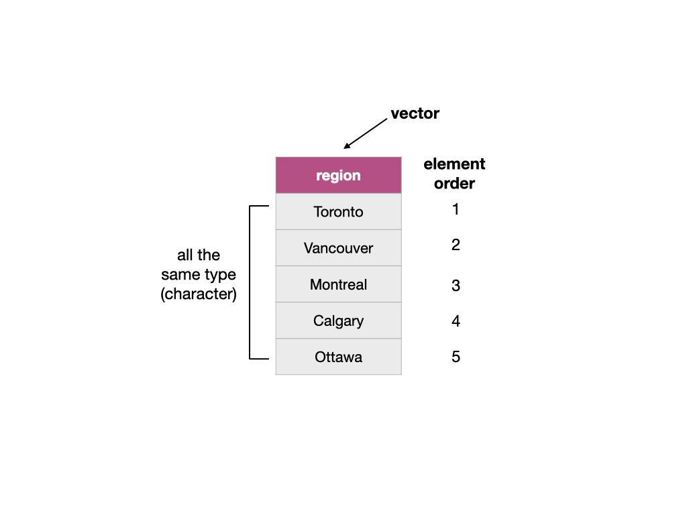
```

You can create vectors in R using the concatenate `c()` function. To create the
vector `region` as shown in Figure \@ref(fig:02-vector) we write:

``` {r}
year <- c("Toronto", "Montreal", "Vancouver", "Calgary", "Ottawa")
year
```

Table: (#tab:datatype-table) Basic data types in R

| Data type | Description | Example |
| ---       | ----------  |---------|
| character | Letters or numbers surrounded by quotes | "1" , "Hello world!" |
| double | Numbers with decimals values | 1.2333 |
| integer | Numbers that do not contain decimals | 1L, 20L (where "L" tells R to store as an integer) |
| logical | A value of true and false | `TRUE`, `FALSE` |
| factor | Used to represent data with a limited number of values | a `color` variable with levels `red`, `green` and `orange` |

> Integer and double data types both fall under the class "Numeric".
> Most of the time when working with numbers in R they will be double types. For
> instance, a double data type is the default when you create a vector of
> numbers using `c()`, and when you read in whole numbers via `read_csv`. There
> are other basic data types in R, such as *raw* and *complex*, which we won't
> cover in this textbook. We will go into more details about factors in Chapter
> \@ref(viz).

### What is a list?

Lists are also objects in R that have multiple, ordered elements, 
you can think of them as super-vectors. 
Vectors and lists differ by the requirement of element type
consistency. All elements within a single vector must be of the same type (e.g.,
all elements are characters), whereas elements within a single list can be of
different types (e.g., characters, integers, logicals, and even other lists). 
Lists are sometimes called recursive vectors 
because lists can contain other lists. 

``` {r 02-vec-vs-list, echo = FALSE, message = FALSE, warning = FALSE, fig.cap = "A vector versus a list", fig.retina = 2, out.width = "650"}
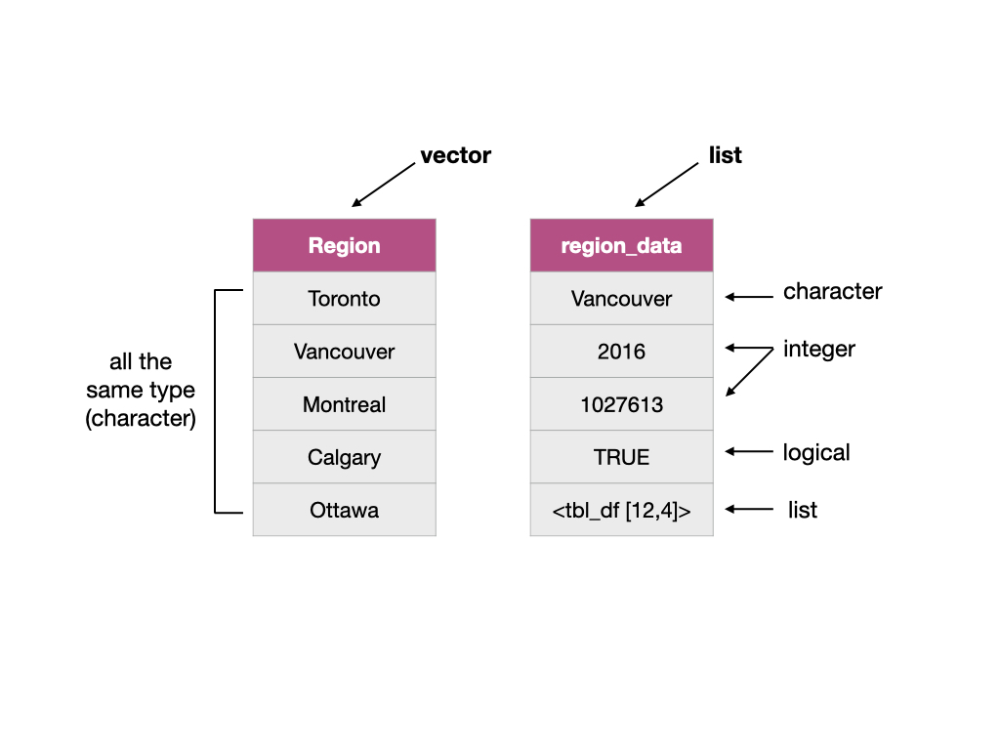
```

> Note that there are actually two types of vectors in R: *atomic vectors* and
> *lists*. Though when people say “vector”, they are *usually* referring to
> atomic vectors. Confusing, we know! You can think of **atom**ic vectors as
> the “atoms” of R since they are built from R’s most fundamental data types.


### What does this have to do with data frames?

As mentioned earlier, a data frame is a special type of object in R whose columns are vectors. 
In particular, a data frame is really a special subtype of list where the elements 
can only be vectors, and the vectors must be of the same length. 
Although the columns of a data frame can only be vectors, 
and vector elements must be of the same data type, not all columns in a data frame 
need to be of the same type. Figure \@ref(fig:02-dataframe) shows a data frame where
the columns are vectors of different types, but the elements are the same data type
within each column. Representing data with data frames enables us to work with our 
data in a tabular manner easily. It also allows us to have columns (containing
qualities or values) for different variables linked in a row for one observation,
and these columns can't be sorted independently. For example, suppose you had a
data frame where the rows were students and the columns were students' grades.
If you sorted students by their name alphabetically, you would want the grades 
associated with each student to get sorted along with each name rather than sorting
the columns independently. 

``` {r 02-dataframe, echo = FALSE, message = FALSE, warning = FALSE, fig.cap = "Data frame and vector types", fig.retina = 2, out.width = "650"}
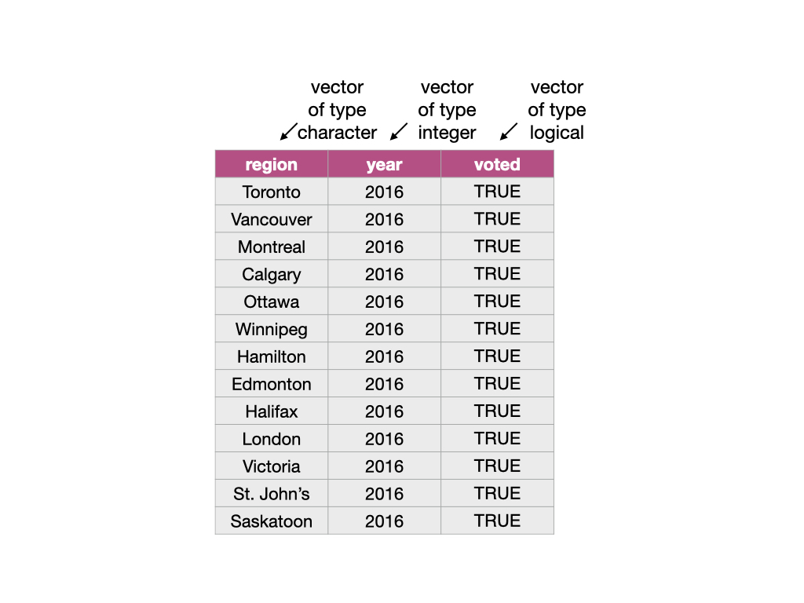
```

The functions from the `tidyverse` package that we are using often give us a
special class of data frame called a *tibble*. Tibbles have some additional
features and benefits over the built-in data frame object. These include the
ability to add useful attributes (such as grouping, which we will discuss later)
and more predictable type preservation when subsetting. 
Because a tibble is just a data frame with some added features, 
we will collectively refer to both built-in R data frames and
tibbles as data frames in this book.

> You can use the function `class` on a data object to assess whether a data
> frame is a built-in R data frame or a tibble. If the data object is a data
> frame, `class` will return `"data.frame"`. If the data object is a
> tibble it will return `"tbl_df" "tbl" "data.frame"`. You can easily convert
> built-in R data frames to tibbles using the `tidyverse` `as_tibble` function.
> For example we can check the class of the Canadian languages data set,
> `can_lang`, we worked with in the previous chapters and we see it is a tibble.

``` {r 02-load-can-land, warning=F, message=F}
class(can_lang)
```


Vectors, data frames and lists are basic types of *data structures* in R, which
are core to most data analyses. We summarize them in Table
\@ref(tab:datastructure-table).

Table: (#tab:datastructure-table) Basic data structures in R

| Data Structure | Description |
| ---            |------------ |
| vector | An ordered collection of one, or more, values of the *same data type* (e.g. all values are of type character). *Note: in R, a vector of length one is used to represent a single value.* |
| data frame | A list of *vectors* of the *same length*, which has column names. We typically use a data frame to represent a data set. | 
| list | An ordered collection of one, or more, values. The elements in the list can be of different data types and can have names (but they are not required too). |

> There are several other data structures in the R programming language (*e.g.,*
> matrices), however, they are beyond the scope of this book.

## Tidy data

There are many ways a tabular data set can be organized. This chapter will focus
on introducing the *tidy data* format of organization and how to make your raw
(and likely messy) data tidy.


### What is tidy data?

Tidy data satisfy the following three criteria [@wickham2014tidy]:

  - each row is a single observation,
  - each column is a single variable, and
  - each value is a single cell (i.e., its row and column position in the data
    frame is not shared with another value).

In Figure \@ref(fig:02-tidy-image), we have a tidy data set that satisfies these 
three criteria. 

``` {r 02-tidy-image, echo = FALSE, message = FALSE, warning = FALSE, fig.cap = "Tidy data", fig.retina = 2, out.width = "1150"}
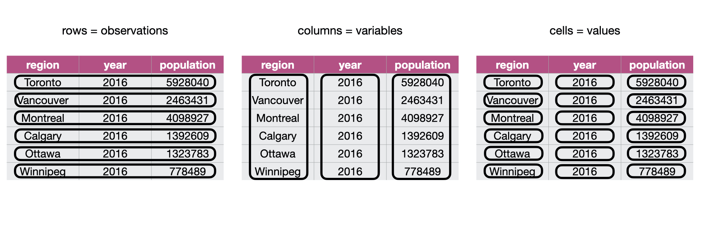
```

### Why is tidy data important in R?

First, tidy data is a straightforward way to work with data and thus, one of R's
most popular plotting toolsets, the `ggplot2` package (which is one of the
packages that the `tidyverse` package loads), expects the data to be in a tidy
format. Second, most statistical analysis functions also expect data in a tidy
format. Given that both of these tasks are central in almost all data analysis
projects, it is well worth spending the time to get your data into a tidy format
upfront. Luckily there are many well-designed `tidyverse` data
cleaning/wrangling tools to help you easily tidy your data. Let's explore them
below!

### Going from wide to long using `pivot_longer`

One task that is commonly performed to get data into a tidy format 
is to combine values that are stored in separate columns, 
but are really part of the same variable, into one.
Data is often stored this way because this format is sometimes more intuitive for
human readability and understanding, and humans create data sets.
In Figure \@ref(fig:02-wide-to-long), 
the table on the left is in an untidy, "wide" format because the year values 
(2006, 2011, 2016) are stored as column names. 
And as a consequence, 
the values for population for the various cities 
over these years are also split across several columns. 
For humans, this table is easy to read, which is why you will often
find data stored in this wide format. 
However, this format is difficult to work with 
when performing data visualization 
or statistical analysis using R.

For example, if we wanted to
find the latest year it would be challenging because the 
year values are stored as column names instead of as values in a single column.
So before we could apply a function to find the latest year 
(for example, by using `max`), 
we would have to first first extract the column names to get them as a vector
and then apply a function to extract the latest year.
The problem only gets worse if you would like to find the value for the 
population for a given region for the latest year.
Both of these tasks are greatly simplified once the data is tidied.

Another problem with data in this format is that we don't know what the
numbers under each year actually represent. Do those numbers represent
population size? Land area? It's not clear. 
To solve both of these problems, 
we can reshape this data set to a tidy data format 
by creating a column called "year" and a column called
"population," which is the table on the right of Figure \@ref(fig:02-wide-to-long).
Note that this transformation makes the data "longer".

``` {r 02-wide-to-long, echo = FALSE, message = FALSE, warning = FALSE, fig.cap = "Going from wide to long data", fig.retina = 2, out.width = "1150"}
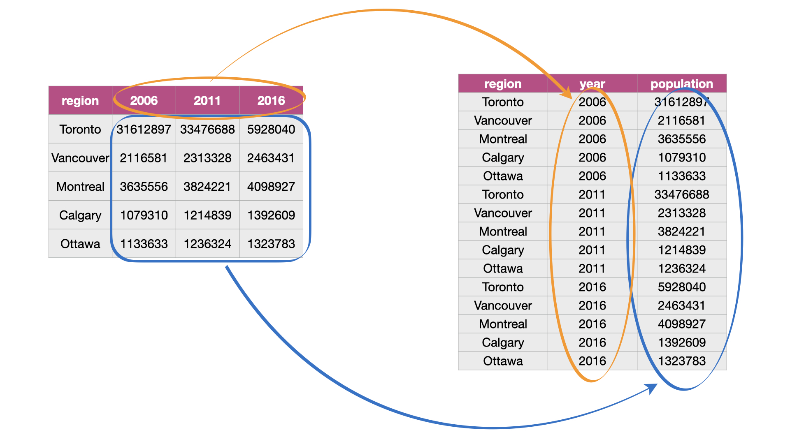
```

The function `pivot_longer` combines columns, 
and is usually used during tidying data 
when we need to make the data frame longer and narrower. 
To learn how to use `pivot_longer`, we will work through an example with the
`region_lang_top5_cities_wide.csv` data set. This data set contains contains the
counts of how many Canadians cited each language as their mother tongue for five
major Canadian cities (Toronto, Montréal, Vancouver, Calgary and Edmonton) from
the 2016 Canadian census. 
To get started, 
we will load the `tidyverse` package so we can access our data reading 
and wrangling functions in R.

Our data set is stored in an untidy format, as shown below:

``` {r 02-tidyverse, warning=FALSE, message=FALSE}
library(tidyverse)
lang_wide <- read_csv("data/region_lang_top5_cities_wide.csv")
lang_wide
```


What is wrong with our untidy format above? The table on the left in Figure
\@ref(fig:img-pivot-longer-with-table) represents the data in the "wide" (messy) format.
From a data analysis perspective, this format is not ideal because the values of 
the variable *region* (Toronto, Montréal, Vancouver, Calgary and Edmonton) 
are stored as column names. Thus they
are not easily accessible to the data analysis functions we will apply
to our data set. Additionally, the *mother tongue* variable values are
spread across multiple columns, which will prevent us from doing any desired
visualization or statistical tasks until we combine them into one column. For
instance, suppose we want to know the languages with the highest number of 
Canadians reporting it as their mother tongue among all five regions. This
question would be tough to answer with the data in its current format. We *could* 
find the answer with the data in this format, though it would be much easier to answer if we tidy our
data first. If mother tongue were instead stored as one column, as shown in the tidy
data on the right in Figure \@ref(fig:img-pivot-longer-with-table),
we could simply use one line of code (`max(mother_tongue)`) to get the maximum value. 

``` {r img-pivot-longer-with-table, echo = FALSE, message = FALSE, warning = FALSE, fig.cap = "Going from wide to long with the pivot_longer function", out.width="1100", fig.retina = 2}
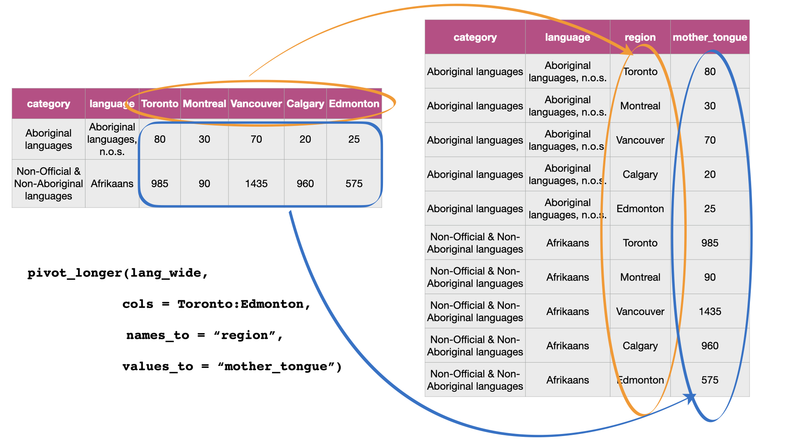
```

Figure \@ref(fig:img-pivot-longer) details what arguments we need to specify to
use the `tidyverse` function, `pivot_longer`, to accomplish this data transformation.

``` {r img-pivot-longer, echo = FALSE, message = FALSE, warning = FALSE, fig.cap = "Syntax for the pivot_longer function", out.width="1100", fig.retina = 2}
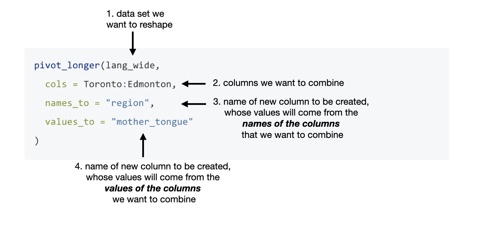
```

We use `pivot_longer` to combine the Toronto, Montréal,
Vancouver, Calgary and Edmonton columns into a single column called `region`,
and create a column called `mother_tongue` that contains the count of how many
Canadians report each language as their mother tongue for each metropolitan
area. We use a colon `:` between Toronto, and Edmonton to tell R to select all
the columns in between Toronto and Edmonton:

``` {r}
lang_mother_tidy <- pivot_longer(lang_wide,
  cols = Toronto:Edmonton,
  names_to = "region",
  values_to = "mother_tongue"
)
lang_mother_tidy
```


> **Splitting code across lines**: *In the code above, the call to the
> `pivot_longer` function is split across several lines.* *This is allowed and
> encouraged when programming in R when your code line gets too long* *to read
> clearly. About 80 characters per line is recommended and when doing this, it
> is important to end the line with a comma `,` so that R* *knows the function
> should continue to the next line.*

The data above is now tidy because all three criteria for tidy data have now
been met:

1.  All the variables (`category`, `language`, `region` and `mother_tongue`) are
    now their own columns in the data frame.
2.  Each observation, i.e., each `category`, `language`, `region`, and count of
    Canadians where that language is the mother tongue, are in a single row.
3.  Each value is a single cell, i.e., its row, column position in the data
    frame is not shared with another value.

### Going from long to wide using `pivot_wider` {#pivot-wider}

Suppose we have observations spread across multiple rows rather than in a single
row. For example, in Figure \@ref(fig:long-to-wide), the table on the left is an
untidy, long format because the `count` column contains two variables
(population and commuter count) and information about each observation 
(here population and commuter counts for a region) is split across two rows. 
Remember, that one of the criteria for tidy data 
is that each observation must be in a single row.

Using data in this format means it's harder to apply functions when the values
for two or more variables are mixed together in a column.
For example, finding the maximum number of commuters 
is possible to do with the untidy table,
however it requires an additional step of filtering for the commuter values
before the maximum value can be computed.
In comparison, if the data were tidy, 
all we would have to do is compute the maximum value for the commuter column.
To reshape this untidy data set to a tidy (and in this case wider) format,
we need to create a column called "population" 
and a column called "commuters".
This is illustrated in the table on the right (Figure \@ref(fig:long-to-wide)).

``` {r long-to-wide, echo = FALSE, message = FALSE, warning = FALSE, fig.cap = "Going from long to wide data", fig.retina = 2, out.width = "1150"}
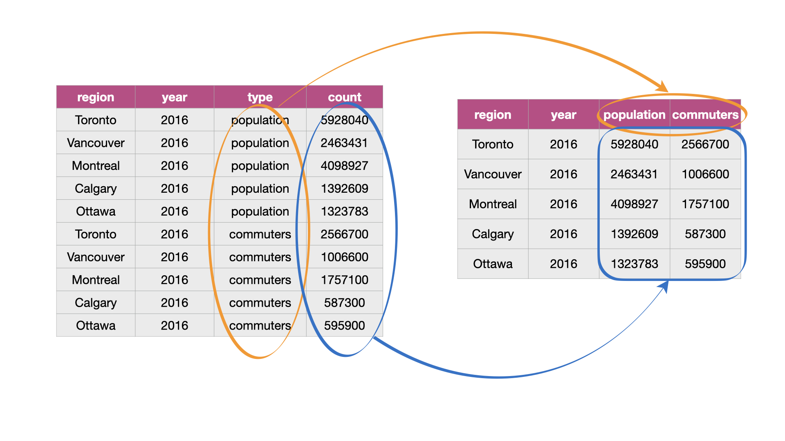
```

To tidy this type of data in R, we can use the function `pivot_wider`,
which generally increases the number of columns (widens) 
and decreases the number of rows in a data set. 
To learn how to use `pivot_wider`, we will work through an example with the `region_lang_top5_cities_long.csv` data set. 
This data set contains the number of Canadians reporting 
the primary language at home and work for five
major cities (Toronto, Montréal, Vancouver, Calgary and Edmonton).

``` {r 02-reading-long, warning=FALSE, message=FALSE, R.options = list(width = 90)}
lang_long <- read_csv("data/region_lang_top5_cities_long.csv")
lang_long
```

What makes the data set shown above untidy? 
In this example, each observation is a language in a region. 
However, in the messy data set above, 
each observation is split across multiple rows. 
One where the count for `most_at_home` is recorded 
and the other where the count for `most_at_work` is recorded. 
Suppose our analysis goal with this data set was to 
visualize the relationship between the number of
Canadians reporting their primary language at home and work. 
Doing that would be difficult with this data as it currently is
since these two variables are stored in the same column.
We can see how we would like to transform the data to make it tidy
with `pivot_wider` in Figure \@ref(fig:img-pivot-wider-table).

``` {r img-pivot-wider-table, echo = FALSE, message = FALSE, warning = FALSE, fig.cap = "Going from long to wide with pivot_wider", out.width="1100", fig.retina = 2}
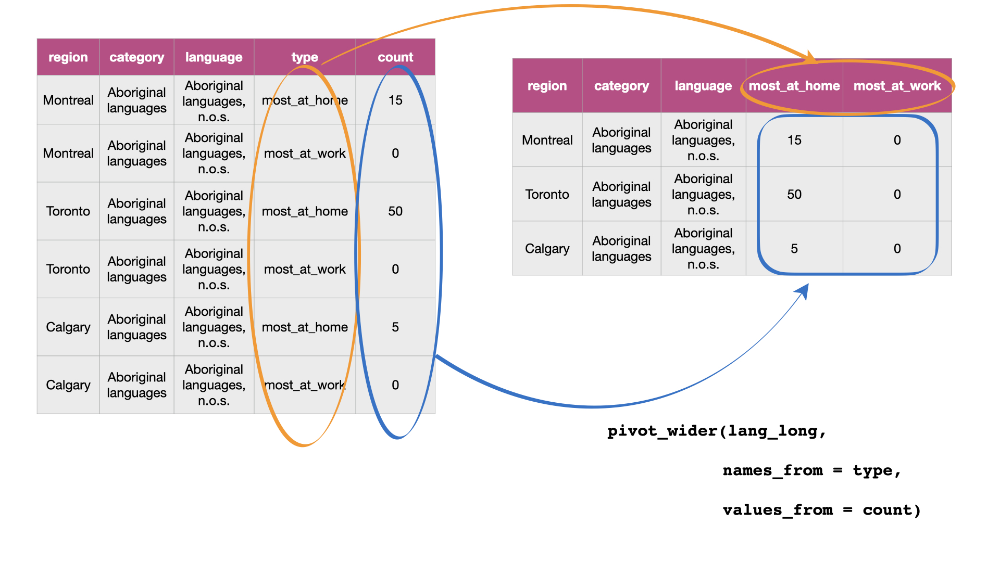
```

Figure \@ref(fig:img-pivot-wider) details what we need to specify 
to use the `pivot_wider` function.

``` {r img-pivot-wider, echo = FALSE, message = FALSE, warning = FALSE, fig.cap = "Syntax for the pivot_wider function", out.width="1100", fig.retina = 2}
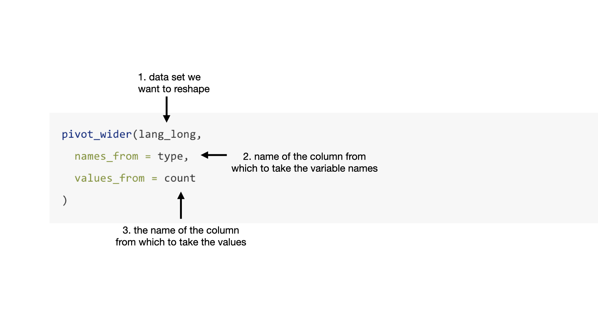
```

We will apply the function as detailed in Figure \@ref(fig:img-pivot-wider).

``` {r , warning=FALSE, message=FALSE}
lang_home_tidy <- pivot_wider(lang_long,
  names_from = type,
  values_from = count
)
lang_home_tidy
```


The data above is now tidy! We can go through the three criteria again to check
that this data is a tidy data set.

1.  All the statistical variables are their own columns in the data frame (i.e.,
    `most_at_home`, and `most_at_work`) have been separated into their own
    columns in the data frame.
2.  Each observation, (i.e., each language in a region) is in a single row.
3.  Each value is a single cell (i.e., its row, column position in the data
    frame is not shared with another value).

You might notice that we have the same number of columns in our tidy data set as
we did in our messy one. Therefore `pivot_wider` didn't really "widen" our data
as the name suggests. However, if we had more than two categories in the
original `type` column, then we would see the data set "widen."

### Using `separate` to deal with multiple delimiters  {#separate}

Data are also not considered tidy when multiple values are stored in the same
cell. The data set we show below is even messier than the ones we dealt with
above: the `Toronto`, `Montréal`, `Vancouver`, `Calgary` and `Edmonton` columns
contain the number of Canadians reporting their primary language at home and
work in one column separated by the delimiter (`/`). The column names are the
values of a variable, *and* each value does not have its own cell! To turn this
messy data into tidy data, we'll have to fix these issues.

``` {r, warning=FALSE, message=FALSE}
lang_messy <- read_csv("data/region_lang_top5_cities_messy.csv")
lang_messy
```

First we’ll use `pivot_longer` to create two columns, `region` and `value`,
similar to what we did previously. 
The new `region` columns will contain the region names,
and the new column `value` will be a temporary holding place for the 
data that we need to further separate - 
the number of Canadians reporting their primary language at home and work.

``` {r}
lang_messy_longer <- pivot_longer(lang_messy,
  cols = Toronto:Edmonton,
  names_to = "region",
  values_to = "value"
)
lang_messy_longer
```

Next we'll use `separate` to split the `value` column into two columns, 
one that contains only the counts of Canadians 
that speak each language most at home, 
and one that contains the counts of Canadians 
that speak each language most at work for each region. 
Figure \@ref(fig:img-separate) 
outlines what we need to specify to use `separate`.

``` {r img-separate, echo = FALSE, message = FALSE, warning = FALSE, fig.cap = "Syntax for the separate function", out.width="1100", fig.retina = 2}
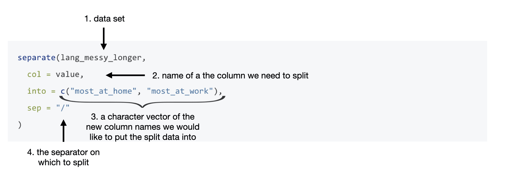
```

``` {r}
tidy_lang <- separate(lang_messy_longer,
  col = value,
  into = c("most_at_home", "most_at_work"),
  sep = "/"
)
tidy_lang
```


Is this data set now tidy? If we recall the three criteria for tidy data:

  - each row is a single observation,
  - each column is a single variable, and
  - each value is a single cell.

We can see that this data now satisfies all three criteria, making it easier to
analyze. However, we aren't done yet! Notice in the table above that the word
`<chr>` appears beneath each of the column names. The word under the column name
indicates the data type of each column. Here all of our variables are
"character" data types. Recall, character data types are letter(s) or digits(s)
surrounded by quotes. In the previous example in section \@ref(pivot-wider), the
`most_at_home` and `most_at_work` variables were `<dbl>` (double) (you can
verify this by looking at the tables in the previous sections), which is a type
of numeric data. This change is due to the delimiter (`/`) when we read in this
messy data set. R read these columns in as character types, and by default,
`separate` will return columns as character data types.

It makes sense for `region`, `category`, and `language` to be stored as a
character type. However, suppose we want to apply any functions that treat the
`most_at_home` and `most_at_work` columns as a number (e.g. finding rows 
above a numeric threshold of a column). In that case, it won't be possible to do if the
variable is stored as a `character`. We can set `convert = TRUE` to convert the
`most_at_home` and `most_at_work` columns to the correct data type.


``` {r}
tidy_lang <- separate(lang_messy_longer,
  col = value,
  into = c("most_at_home", "most_at_work"),
  sep = "/", 
  convert = TRUE
)
tidy_lang
```

Now we see `<int>` appears under our columns, `most_at_home` and `most_at_work`,
indicating they are integer data types (which is one of the sub-types of
numeric)!


### Notes on defining tidy data

Is there only one shape for tidy data for a given data set? Not necessarily! It
depends on the statistical question you are asking and what the variables are
for that question. For tidy data, each variable should be its own column. So,
just as it's essential to match your statistical question with the appropriate
data analysis tool (classification, clustering, hypothesis testing, etc.) it's
important to match your statistical question with the appropriate variables and
ensure they are represented as individual columns to make the data tidy.

## Using `select` to extract a range of columns

Chapter \@ref(intro) discussed two `tidyverse` functions: `select` and `filter` to select
columns and filter rows from a data frame. We will now learn more ways we can
use these functions. Recall, the `select` function creates a subset of the
*columns* of a data frame, while the `filter` subsets *rows* with specific
values.

### Using `select` helpers to extract columns

Suppose we wanted to select only the columns `language`, `region`,
`most_at_home` and `most_at_work` from the `tidy_lang` data set. We can
use the `select` function to choose the columns that we want and assign it to a
data frame:

``` {r}
selected_columns <- select(tidy_lang, language, region, most_at_home, most_at_work)
selected_columns
```

Here we wrote out the names of each of the columns. However, this method is
time-consuming, especially if you have a lot of columns! Another approach is to
use a "select helper". Select helpers are operators that make it easier for
us to select columns. For instance, we can use a select helper to choose a
range of columns rather than typing each column name out. To do this, we use the
colon (`:`) operator to denote the range. For example, to get all the columns in
the `tidy_lang` data frame from `language` to `most_at_work` we pass
`language:most_at_work` as the second argument to the `select` function.

``` {r}
column_range <- select(tidy_lang, language:most_at_work)
column_range
```

Notice that we get the same output as we did above, but with less typing, and thus,
we are less error-prone! This type of operator is handy, especially for large
data sets.

Suppose instead we wanted to extract columns that followed a particular pattern
rather than just selecting a range. Let's say we wanted only to select the
columns `most_at_home` and `most_at_work`. There are helpers, which allow
us to select variables based on their names. Here we can use the `select` helper
`starts_with` to choose only the columns that start with the word "most":

``` {r 02-select-helpers}
select(tidy_lang, starts_with("most"))
```

We could also have chosen the columns containing an underscore `_` by adding
`contains("_")` as the second argument in the `select` function since we notice
the columns we want contain underscores and the others don't.

``` {r 02-select-helper-contains}
select(tidy_lang, contains("_"))
```

There are many different `select` helpers, which are very handy for selecting
variables based on certain criteria. Check out the Additional
Resources section at the end of the chapter for a comprehensive resource on `select` helpers.

## Using `filter` to extract rows

### Using `filter` to extract rows with `==`

Recall we can use the `filter` function to obtain the subset of rows with
desired values from a data frame. Again, our first argument is the name of the
data frame object.
Here we will continue to work with the `tidy_lang` data frame 
to demonstrate more details on how filter works.
The second argument to `filter` 
is a logical statement to use when filtering the rows. 
`filter` works by returning the rows 
where the logical statement evaluates to `TRUE`.
Suppose we are only interested in subsetting the rows for the
official languages of Canada (English and French) from this data set. 
We can do this by using the *equivalency operator* (`==`) 
to compare the values of the `category` column 
with the value `"Official languages"`. 
With these arguments, `filter` returns a data frame with all the columns 
of the input data frame 
but only the rows we asked for in our logical filter statement - 
those where the `category` column holds the value `""Official languages"`.
We name this data frame `official_langs` and will primarily focus on this 
data frame for the remainder of this chapter (except for the next example).

``` {r}
official_langs <- filter(tidy_lang, category == "Official languages")
official_langs
```

### Using `filter` to extract rows with `!=`

What if we want all the other language categories in the data set *except* for
those in the "Official languages" category? We can accomplish this with the `!=` 
operator, which means "not equal to". So if we want to find all the rows
where the `category` does *not* equal "Official languages" we write the code
below.

``` {r}
filter(tidy_lang, category != "Official languages")
```

### Using `filter` to extract rows that satisfy mutliple conditions using `,` {#filter-and}

Let's suppose we want to look at only the rows 
for the French language in Montréal. 
To do this, we need to filter the data set 
to find rows that satisfy multiple conditions simultaneously. 
We can do this with `,`, which in the case of `filter`, 
is interpreted by R as "and". 
We write the code as shown below to filter the `official_langs` data frame 
to subset the rows where `region == "Montréal"` *and* the `language == "French"`.

``` {r}
filter(official_langs, region == "Montréal", language == "French")
```

### Using `filter` to extract rows with `|`

Suppose we were interested in the rows for only the Albertan cities 
in our `official_langs` data set (Edmonton and Calgary). 
We can't use `,` as we did above because `region`
cannot be both Edmonton *and* Calgary simultaneously. 
Instead, we can use the `|` logical operator, 
which gives us the cases where one condition *or* 
another condition *or* both are satisfied. 
In the code below, we ask R to return the rows
where the `region` columns are equal to "Calgary" *or* "Edmonton".

``` {r}
filter(official_langs, region == "Calgary" | region == "Edmonton")
```

### Using `filter` to extract rows with `%in%`

Suppose next, we want to see the populations of our five cities. 
Let's read in the `region_data.csv` file 
that comes from the 2016 Canadian census, 
as it contains statistics for number of households, land area, population 
and number of dwellings for different regions.

```{r, include = FALSE}
write_csv(canlang::region_data, "data/region_data.csv")
```

``` {r message = FALSE}
region_data <- read_csv("data/region_data.csv")
region_data
```

To get the population of our five cities 
we can filter the data set using the `%in%` operator. 
The `%in%` operator is used to see if an element belongs to a vector. 
Here we are filtering for rows where the value in the `region` column
matches any of the five cities we are intersted in: Toronto, Montréal,
Vancouver, Calgary, and Edmonton.

``` {r}
city_names <- c("Toronto", "Montréal", "Vancouver", "Calgary", "Edmonton")
five_cities <- filter(region_data, 
                      region %in% city_names)
five_cities
```

> **What's the difference between `==` and `%in%`?** Let's suppose we have two
> vectors, `vectorA` and `vectorB`. If you type `vectorA == vectorB` into R it
> will compare the vectors element by element. R checks if the first element of
> `vectorA` equals the first element of `vectorB`, the second element of
> `vectorA` equals the second element of `vectorB` etc. On the other hand,
> `vectorA %in% vectorB` compares the first element of `vectorA` to all the
> elements in `vectorB`. Then the second element of `vectorA` is then compared
> to all the elements in `vectorB` etc. Notice the difference between `==` and
> `%in%` in the example below.
> 
>``` {r}
>c("Vancouver", "Toronto") == c("Toronto", "Vancouver")
>c("Vancouver", "Toronto") %in% c("Toronto", "Vancouver")
>```

### Using `filter` to extract rows with values above or below a threshold

``` {r changing_the_units, include = FALSE}
census_popn <- 35151728
most_french <- 2669195
```

We saw in section \@ref(filter-and) that 
`r format(most_french, scientific = FALSE, big.mark = ",")` people reported 
speaking French in Montréal as their primary language at home. 
If we are interested in finding the official languages in regions 
with higher numbers of people who speak it as their primary language at home 
compared to French in Montréal then we can use `filter` to obtain rows 
where the value of `most_at_home` is greater than 
`r format(most_french, scientific = FALSE, big.mark = ",")`.

``` {r}
filter(official_langs, most_at_home > 2669195)
```

`filter` returns a data frame with only one row indicating that when 
considering the official languages, 
only English in Toronto is reported by more people 
as their primary language at home 
than French in Montréal according to the 2016 Canadian census.

## Using `mutate` to modify or add columns

In section \@ref(separate), 
when we first read in the `"region_lang_top5_cities_messy.csv"` data 
all of the variables were "character" data types. 
During the tidying process, 
we used the `convert` argument from the `separate` function 
to convert the `most_at_home` and `most_at_work` columns 
to the desired integer (i.e., numeric class) data types. 
However, suppose we didn't use the `convert` argument 
and needed to modify the column type some other way?
Below we create such a situation 
so that we can demonstrate how we can use `mutate`
to change the column types of a dataframe. 
`mutate` is a useful function to modify or create new dataframe columns.

``` {r warning=FALSE, message=FALSE}
lang_messy <- read_csv("data/region_lang_top5_cities_messy.csv")
lang_messy_longer <- pivot_longer(lang_messy,
               cols = Toronto:Edmonton,
               names_to = "region",
               values_to = "value")
tidy_lang_chr <- separate(lang_messy_longer, col = value,
           into = c("most_at_home", "most_at_work"),
           sep = "/") 
official_langs_chr <- filter(tidy_lang_chr, category == "Official languages")

official_langs_chr 
```

To use `mutate`, again we first specify the data set in the first argument, 
and in the following arguments, 
we specify the name of the column we want to modify or create 
(here `most_at_home` and `most_at_work`), an `=` sign,
and then the function we want to apply (here `as.numeric`).
In the function we want to apply, 
we refer directly to the column name upon which we want it to act 
(here `most_at_home` and `most_at_work`).
In our example, we are naming the columns the same
names as columns that already exist in the data frame 
("most\_at\_home", "most\_at\_work") 
and this will cause `mutate` to modify those columns in-place.
If we were to give the columns a new name, 
then `mutate` would create new columns with the names we specified.
`mutate`'s general syntax is detailed in Figure \@ref(fig:img-mutate).

``` {r img-mutate, echo = FALSE, message = FALSE, warning = FALSE, fig.cap = "Syntax for the mutate function", out.width="1100", fig.retina = 2}
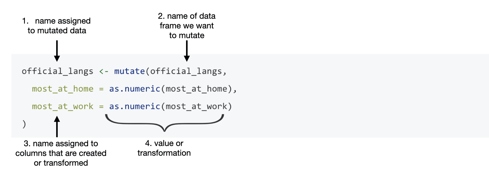
```

Below we use `mutate` to convert the columns `most_at_home` and `most_at_work`
to numeric data types in the `official_langs` data set as described in figure
\@ref(fig:img-mutate):

``` {r}
official_langs_numeric <- mutate(official_langs_chr,
  most_at_home = as.numeric(most_at_home),
  most_at_work = as.numeric(most_at_work)
)
official_langs_numeric
```

Now we see `<dbl>` appears under our columns, `most_at_home` and `most_at_work`,
indicating they are double data types (which is a type of numeric data type)!
Now we could apply numeric functions to them to do useful things. 

### Using `mutate` to create new columns

``` {r , include = FALSE}
census_popn <- 35151728
number_most_home <- filter(official_langs, language == "English" & region == "Toronto") |>
pull(most_at_home)

toronto_popn <- region_data |> filter(region == "Toronto") |>
pull(population)
```

We can see in the table that
`r format(number_most_home, scientific = FALSE, big.mark = ",")` people reported
speaking English in Toronto as their primary language at home, according to
the 2016 Canadian census. What does this number mean to us? To understand this
number, we need context. In particular, how many people were in Toronto when
this data was collected? From the 2016 Canadian census profile, the population
of Toronto was reported to be
`r format(toronto_popn, scientific = FALSE, big.mark = ",")` people. The number
of people who report that English was their primary language at home is much more
meaningful when we report it in this context. We can even go a step further and
transform this count to a relative frequency or proportion. We can do this by
dividing the number of people reporting a given language as their primary
language at home by the number of people who live in Toronto. For example, the
proportion of people who reported that their primary language at home was
English in the 2016 Canadian census was
`r format(round(number_most_home/toronto_popn, 2), scientific = FALSE, big.mark = ",")`
in Toronto.

Let's now use `mutate` to create a new column in our dataframe 
that holds the proportion of people who speak English 
for our five cities of focus in this chapter. 
To accomplish this, we will need to do 2 tasks 
before we can use mutate to create the new column for us:

1. create a vector containing the population values for our cities
2. filter the `official_langs` data frame 
so that we only keep the rows where the language is English

To create a vector containing the population values for our cities
(Toronto, Montréal, Vancouver, Calgary, Edmonton),
we will use the `c` function:

```{r}
city_populations <- c(5928040, 4098927, 2463431, 1392609, 1321426)
city_populations
```

And next, we will filter the `official_langs` data frame 
so that we only keep the rows where the language is English.
We will name the new dataframe we get from this `english_langs`:

```{r}
english_langs <- filter(official_langs, language == "English")
english_langs
```

Finally, we can use `mutate` to create a new column, 
named `most_at_home_proportion`, that will have value that corresponds to 
the proportion of people reporting English as their primary
language at home.
We will compute this by dividing the column by our vector of city populations. 

```{r, include = TRUE}
english_langs <- mutate(english_langs, 
                         most_at_home_proportion = most_at_home / city_populations )

english_langs
```

> Note: one important thing about the computation that we did above was
that we had to ensure that we ordered the `city_populations` vector in the
same order as the cities were listed in the `english_langs` dataframe.
This is because R will perform the division computation we did by dividing 
each element of the `most_at_home` column by each element of the 
`city_populations` vector - matching them up by position.
Failing to do this would have resulted in the incorrect math to be performed.
In more advanced data wrangling, 
one might solve this problem in a less error-prone way though using 
a technique called joins. 
We link to resources that discuss this in the Additional
Resources section at the end of the chapter.

## Creating a visualization with tidy data

Now that we have cleaned and wrangled our data, we can make visualizations or do 
statistical analyses to answer questions about our data! Let's suppose we want to
answer the question: what proportion of people in each city speak English 
as their primary language at home in these five cities? Since our data is
cleaned already, in a few short lines of code, we can use `ggplot` to create a
data visualization to answer this question! Here we create a bar chart to represent the proportions for
each region and color the proportions by language.

```{r 02-plot, fig.width = 7, fig.height = 2.5}
ggplot(
  english_langs,
  aes(
    x = most_at_home_proportion,
    y = region,
    fill = language
  )
) +
  geom_bar(stat = "identity") +
  xlab("English reported as the primary language spoken most often at home (proportion)") +
  ylab("Region")
```

> Don't worry too much about the code to make this plot, we will talk more in
> detail about visualizations in Chapter \@ref(viz).

From this visualization, we can see that in Calgary, Edmonton, Toronto and
Vancouver, English was reported as the most common primary language used at home.
However, in Montréal, this does not seem to be the case!

## Combining functions using the pipe operator, `|>`

In R, we often have to call multiple functions in a sequence to process a data
frame. The basic ways of doing this can become quickly unreadable if there are
many steps. For example, suppose we need to perform three operations on a data
frame `data`:

1)  add a new column `new_col` that is double another `old_col`
2)  filter for rows where another column, `other_col`, is more than 5, and
3)  select only the new column `new_col` for those rows.

One way of doing is to just write multiple lines of code, storing temporary
objects as you go:

``` {r eval = FALSE}
output_1 <- mutate(data, new_col = old_col * 2)
output_2 <- filter(output_1, other_col > 5)
output <- select(output_2, new_col)
```

This is difficult to understand for multiple reasons. The reader may be tricked
into thinking the named `output_1` and `output_2` objects are important for some
reason, while they are just temporary intermediate computations. Further, the
reader has to look through and find where `output_1` and `output_2` are used in
each subsequent line.

Another option for doing this would be to *compose* the functions:

``` {r eval = F}
output <- select(filter(mutate(data, new_col = old_col * 2), other_col > 5), new_col)
```

Code like this can also be difficult to understand. Functions compose (reading
from left to right) in the *opposite order* in which they are computed by R
(above, `mutate` happens first, then `filter`, then `select`). It is also just a
really long line of code to read in one go.

The *pipe operator* (`|>`) solves this problem, resulting in cleaner and
easier-to-follow code. `|>` is built into R so you don't need to load any
packages to use it. The code below accomplishes the same thing as the previous
two code blocks:

``` {r eval = FALSE}
output <- data |>
  mutate(new_col = old_col * 2) |>
  filter(other_col > 5) |>
  select(new_col)
```

You can think of the pipe as a physical pipe. It takes the output from the
function on the left-hand side of the pipe, and passes it as the first argument
to the function on the right-hand side of the pipe. Note here that we have again
split the code across multiple lines for readability; R is fine with this, since
it knows that a line ending in a pipe `|>` is continued on the next line.
Similarly, you see that after the first pipe, the remaining lines are indented
until the end of the pipeline. This is not required for the R code to work, but
again is used to aid in improving code readability.

Next, let's learn about the details of using the pipe, and look at some examples
of how to use it in data analysis.

> Note: In this textbook, we will be using the base R pipe operator syntax, `|>`.
> This base R `|>` pipe operator was inspired by a previous version of the pipe
> operator, `%>%`. The `%>%` pipe operator is not built into R 
> and is from the `magrittr` R package.
> The `tidyverse` metapackage imports the `%>%` pipe operator via `dplyr` 
> (which in turn imports the `magrittr` R package).
> In more advanced R use related to sharing and distributing code as R packages,
> there are some other drawbacks to using `%>%` compared to `|>`, 
> however these are beyond the scope of this textbook. 
> We have this note in the book to make the reader aware that `%>%` exists
> as it still commonly used in data analysis code and in many data science 
> books and other resources.
> In most cases these two pipes are interchangeable and either can be used.

### Using `|>` to combine `filter` and `select`

Let's work with our tidy `tidy_lang` data set from section \@ref(separate), which contains
the number of Canadians reporting their primary language at home and work for
five major cities (Toronto, Montréal, Vancouver, Calgary and Edmonton):

``` {r, warning=FALSE, message=FALSE}
tidy_lang
```

Suppose we want to create a subset of the data with only the languages and
counts of each language spoken most at home for the city of Vancouver. To do
this, we can use the functions `filter` and `select`. First, we use `filter` to
create a data frame called `van_data` that contains only values for Vancouver.

``` {r}
van_data <- filter(tidy_lang, region == "Vancouver")
van_data
```

We then use `select` on this data frame to keep only the variables we want:

``` {r}
van_data_selected <- select(van_data, language, most_at_home)
van_data_selected
```

Although this is valid code, there is a more readable approach we could take by
using the pipe, `|>`. With the pipe, we do not need to create an intermediate
object to store the output from `filter`. Instead we can directly send the
output of `filter` to the input of `select`:

``` {r}
van_data_selected <- filter(tidy_lang, region == "Vancouver") |> 
  select(language, most_at_home)
van_data_selected
```

But wait - why does our `select` function call look different in these two
examples? When you use the pipe, the output of the first function is
automatically provided as the first argument for the function that comes after it, and
thus you do not specify that argument in that function call. In the code above,
the first argument of `select` is the data frame we are `select`-ing from, which
is provided by the output of `filter`.

As you can see, both of these approaches give us the same output, but the second
approach is more clear and readable.

### Using `|>` with more than two functions

The pipe operator (|>) can be used with any function in R. Additionally, we can pipe together
more than two functions. For example, we can pipe together three functions to: 

- `filter` rows to include only those where the counts of the language most spoken at home are greater than 10,000, 
- `select` only the columns corresponding to `region`, `language` and `most_at_home`, and
- `arrange` the dataframe rows in order by counts of the language most spoken at home 
from smallest to largest.

> **Note:** As we saw in Chapter \@ref(intro), we can use the `tidyverse` `arrange` function 
> to order the rows in the dataframe by the values of one or more columns. 
> Here we pass the column name `most_at_home` to arrange to order the dataframe rows 
> by the values in that column, in ascending order.

``` {r}
large_region_lang <- filter(tidy_lang, most_at_home > 10000) |>
  select(region, language, most_at_home) |>
  arrange(most_at_home)
large_region_lang
```

> **Note:** You might also have noticed that we split the function calls across
> lines after the pipe, similar to when we did this earlier in the chapter
> for long function calls. Again this is allowed and recommended, especially when
> the piped function calls create a long line of code. Doing this makes
> your code more readable. When you do this, it is important to end each line
> with the pipe operator `|>` to tell R that your code is continuing onto the
> next line.

We can also pipe the *data frame* into the same sequence of functions rather than
using it as the first argument of the first function and we get the same result:

``` {r}
large_region_lang <- tidy_lang |> 
  filter(most_at_home > 10000) |>
  select(region, language, most_at_home) |>
  arrange(most_at_home)
large_region_lang
```

Now that we've shown you the pipe operator as an alternative to storing
temporary objects and composing code, does this mean you should *never* store 
temporary objects or compose code? Not necessarily! There are times when you will 
still want to do these things. For example, you might store temporary objects 
because you want to save prepared data before feeding it into a plot function 
so you can iteratively change the plot without having to
redo all of your data transformations each time you create a new plot.
Additionally, piping many functions can be overwhelming and difficult to debug, 
so you may also want to store a temporary object midway through 
and pipe that into more functions after that.

## Aggregating data with `summarize`

### Calculating summary statistics on a column:

As a part of many data analyses, we need to calculate a summary value for the
data (a *summary statistic*). 
Examples of summary statistics we might want to calculate 
are the number of observations, the average/mean value for a column, 
the minimum value, etc. 
Often times, 
this summary statistic is calculated from the values in a data frame column, 
or columns, as shown in Figure \@ref(fig:summarize)).

```{r summarize}
# Add figure here
```

A useful `dplyr` function for calculating summary statistics is `summarize`, 
where the first argument is the data frame and the proceeding arguments
are the summaries we want to perform. 
Below we show how to use the `summarize` function to calculate the minimum 
and maximum number of Canadians 
reporting a particular language as their primary language at home.

First a reminder of what `region_lang` looks like:

``` {r}
region_lang
```

And then we apply `summarize` to calculate the minimum 
and maximum number of Canadians 
reporting a particular language as their primary language at home, 
for any region:

``` {r}
summarize(region_lang,
          min_most_at_home = min(most_at_home),
          max_most_at_home = max(most_at_home))
```

```{r, include = FALSE}
lang_summary <- summarize(region_lang,
          min_most_at_home = min(most_at_home),
          max_most_at_home = max(most_at_home))
```

From this we see that there are some languages in the data set the no one speaks
as their primary language at home, as well as that the most commonly spoken
primary language at home is spoken by
`r format(lang_summary$max_most_at_home[1], scientific = FALSE, big.mark = ",")`
people.

#### Calculating summary statistics when there are NA's

When we use base R statistical summary functions 
(e.g., `max`, `mix`, `mean`, `sum`, etc) with `summarize`, 
R will return to us `NA` when we apply functions to columns that 
contain `NA`'ss in the data frame. 
Usually that is not what we want to happen, 
instead we'd usually like R to ignore the NA's 
and calculate the summary statistic using all of the other values, 
that are not `NA`'s, in the column.

How can we do that? 
In this case of pairing base R statistical summary functions with `summarize`, 
we can avoid getting R to return NA's by adding the argument `na.rm = TRUE` 
to the base R statistical summary function we are applying. 
We show an example of this below.

First we create a seemingly innocuous NA 
in the first row of the `region_lang` data frame, 
in the most_at_home column:

```{r}
region_lang_na <- region_lang
region_lang_na[["most_at_home"]][1] <- NA
region_lang_na
```

And then if we apply our summarize function as above, 
we see that no longer get the minimum and maximum returned, 
but just an `NA` instead!

```{r}
summarize(region_lang_na,
          min_most_at_home = min(most_at_home),
          max_most_at_home = max(most_at_home))
```

We can fix this by adding the `na.rm = TRUE` as explained above:

```{r}
summarize(region_lang_na,
          min_most_at_home = min(most_at_home, na.rm = TRUE),
          max_most_at_home = max(most_at_home, na.rm = TRUE))
```

### Calculating summary statistics on a column from groups of rows:

A common pairing with `summarize` is `group_by`. Pairing these functions
together can let you summarize values for subgroups within a data set,
as illustrated in Figure \@ref(fig:summarize-groupby). 

```{r summarize-groupby}
# Add figure here
```

For example, 
here, we can use `group_by` to group the regions of the `tidy_lang` dataframe
and then calculate the minimum and maximum number of Canadians 
reporting the language as the primary language at home 
for each of the regions in the data set.

The `group_by` function takes at least two arguments. The first is the data
frame that will be grouped, and the second and onwards are columns to use in the
grouping. Here we use only one column for grouping (`region`), but more than one
can also be used. To do this, list additional columns separated by commas.

``` {r}
group_by(region_lang, region) |>
  summarize(
    min_most_at_home = min(most_at_home),
    max_most_at_home = max(most_at_home)
    )
```

Notice that `group_by` on its own doesn't change the way the data looks. 
In the output below the grouped data set looks the same, 
and it doesn't *appear* to be grouped by `region`. 
Instead, `group_by` simply changes how other functions work with the data, 
as we saw with `summarize` above.  

```{r}
group_by(region_lang, region)
```

### Calculating summary statistics on many columns

Sometimes we need to summarize statistics across many columns. 
In such a case, using `summarize` alone means that we have to 
type out the name of each column we want to summarize. 
To do this more efficiently, we can pair `summarize` with `across`
and use the same syntax we use with the `select` function to 
specify which columns we would like to perform the statistical summarries on, 
as well as which function to use to calculate these.
Here we demonstrate finding the maximum value of each of the numeric
columns of the `region_lang` data set.

``` {r 02-across-data}
region_lang |>
  summarize(across(mother_tongue:lang_known, max))
``` 

An alternative to `summarize` and `across` 
for applying a function to many columns is the `map` family of functions.
Let's again find the maximum value of each column of the
`region_lang` data frame, but using `map` with the `max` function this time.

As `map` does not have an argument that lets us use `select` syntax 
to specify which columns to apply the `max` function to, 
we will do this before calling `map`.
`map` takes two arguments, 
an object (a vector, data frame or list) that you want to apply the function to, 
and the function that you would like to apply.  
Here our arguments will be a data frame 
(that we passed to `map` from `select`, via the pipe operator) and `max`:

``` {r 02-map}
region_lang |>
  select(mother_tongue:lang_known) |>
  map(max)
```

> **Note:** `purrr` is part of the tidyverse, and so like the `dplyr` and
> `ggplot` functions, once we call `library(tidyverse)` we do not need to load
> the `purrr` package separately.

Our output looks a bit weird... we passed in a data frame, but our output
doesn't look like a data frame. As it so happens, it is *not* a data frame, but
rather a plain list:

``` {r 02-type-out-of-map}
region_lang |>
  select(mother_tongue:lang_known) |>
  map(max) |>
  typeof()
```

So what do we do? Should we convert this to a data frame? We could, but a
simpler alternative is to just use a different `map` function from the `purrr`
package. There are quite a few to choose from, they all work similarly, and
their name reflects the type of output you want from the mapping operation:

| `map` function | Output |
| --- | --- |
| `map()` | list |
| `map_lgl()` | logical vector |
| `map_int()` | integer vector |
| `map_dbl()` | double vector |
| `map_chr()` | character vector |
| `map_dfc()` | data frame, combining column-wise |
| `map_dfc()` | data frame, combining row-wise |

Let's get the columns' maximums again, but this time use the `map_dfc` function
to return the output as a data frame:

``` {r 02-map-df-example}
region_lang |>
  select(mother_tongue:lang_known) |>
  map_dfc(max)
```

Which `map` function you choose depends on what you want to do with the
output; you don't always have to pick `map_dfc`!

Similarly to when we use base R statistical summary functions 
(e.g., `max`, `mix`, `mean`, `sum`, etc) with `summarize`, 
`map` functions paired with base R statistical summary functions
also return NA's when we apply them to columns that 
contain NAs in the data frame.

To avoid this, again we need to add the argument `na.rm = TRUE`.
When we use this with `map` we do this by adding a `,` and then `na.rm = TRUE`,
after specifying the function we want map to apply, as illustrated below:

``` {r}
region_lang |>
  select(mother_tongue:lang_known) |>
  map_dfc(max, na.rm = TRUE)
```

The `map` family functions are generally quite useful for solving many problems 
involving repeatedly applying functions in R. 
Additionally, their use is not limited to columns of a data frame;
`map` family functions can be used to apply functions to elements of a vector,
or a list, and even to lists of data frames, or nested data frames.
To learn more about them see the resource linked to in the Additional Resources
section at the end of this chapter.

## Apply functions across columns within one row with `rowwise`

What if you want to apply a function across columns but within one row? 
We illustrate such a data transformation in Figure \@ref(fig:rowwise).

```{r rowwise}
# fig goes here
```

For instance, suppose we want to know the maximum value between `mother_tongue`,
`most_at_home`, `most_at_work` 
and `lang_known` for each language, in each region,
in the `region_lang` data set?
In other words, we want to apply the `max` function row-wise. 
We will use the aptly named function `rowwise` in combination with `mutate` 
to accomplish this task. 

Before we apply `rowwise` we will `select` only the count columns 
so we can see all the columns in the dataframe's output easily in the book. 
So for this demonstration, the data set we are operating on looks like this:

```{r}
region_lang |> 
  select(mother_tongue:lang_known)
```

Now we apply `rowwise` before `mutate`, to tell R that we would like
our mutate function to be applied across, and within, a row,
as opposed to being applied on a column 
(which is the default behaviour of `mutate`):

```{r}
region_lang |> 
  select(mother_tongue:lang_known) |>
  rowwise() |> 
  mutate(maximum = max(c(mother_tongue, 
                         most_at_home, 
                         most_at_work, 
                         lang_known)))
```

Now we see that we get an additional column added to our data frame, 
named `maximum`, which is the the maximum value between `mother_tongue`,
`most_at_home`, `most_at_work` and `lang_known` for each language, 
in each region in the `region_lang` data set.

Similar to `group_by`, 
`rowwise` doesn't do anything when it is called by itself, 
however, we can apply `rowwise` in combination 
with other functions to change how these other functions operate on the data.  
Notice if we used `mutate` without `rowwise`, 
we would have computed the maximum value across *all* rows 
rather than the maximum value for *each* row. 
Therefore in the output below the same maximum value is reported 
in every single row since it is 
the maximum value among *all* the rows, so this code is not doing what we want. 

```{r}
region_lang |> 
  select(mother_tongue:lang_known) |>
  mutate(maximum = max(c(mother_tongue, 
                         most_at_home, 
                         most_at_home, 
                         lang_known)))
```

## Summary

Cleaning and wrangling data can be a very time-consuming process, however, 
it is a critical step in any data analysis. We have explored many different
functions for cleaning and wrangling data into a tidy format. 
Table \@ref(tab:summary-functions-table) summarizes some of the key wrangling 
functions we learned in this chapter. In the following chapters, you will 
learn how you can take this tidy data and do so much more with it to answer your 
burning data science questions!

Table: (#tab:summary-functions-table) Summary of wrangling functions 

| Function | Description |
| ---      | ----------- | 
| `across` | allows you to apply function(s) to multiple columns  | 
| `filter` | subsets rows of a data frame | 
| `group_by` |  allows you to apply function(s) to groups of rows |
| `mutate` | adds or modifies columns in a data frame |
| `map` | generally iteration function |
| `pivot_longer` | generally makes the data frame longer and narrower |
| `rowwise` | applies functions across columns within one row | 
| `pivot_wider` | generally makes a data frame wider and decreases the number of rows | 
| `separate` | splits up a character column into multiple columns  | 
| `select` | subsets columns of a data frame |
| `summarize` | calculates summaries of inputs | 

## Additional resources

  - As we mentioned earlier, `tidyverse` is actually a *R
    meta package*: it installs and loads a collection of R packages that all
    follow the tidy data philosophy we discussed above. One of the `tidyverse`
    packages is `dplyr` - a data wrangling workhorse. You have already met many
    of `dplyr`'s functions (`select`, `filter`, `mutate`, `arrange`, `summarize`,
    and `group_by`). To learn more about these functions and meet a few more useful
    functions, we recommend you checkout [this
    chapter](http://stat545.com/block010_dplyr-end-single-table.html#where-were-we)
    of the Data wrangling, exploration, and analysis with R book.
  - The [`dplyr` page on the tidyverse website](https://dplyr.tidyverse.org/) is
    another resource to learn more about the functions in this
    chapter, the full set of arguments you can use, and other related functions.
    The site also provides a very nice cheat sheet that summarizes many of the
    data wrangling functions from this chapter.
  - Check out the [tidyselect
    page](https://tidyselect.r-lib.org/reference/select_helpers.html) for a
    comprehensive list of `select` helpers.
  - [R for Data Science](https://r4ds.had.co.nz/) has a few chapters related to
    data wrangling that go into more depth than this book. For example, the
    [tidy data](https://r4ds.had.co.nz/tidy-data.html) chapter covers tidy data,
    `pivot_longer`/`pivot_wider` and `separate`, but also covers missing values
    and additional wrangling functions (like `unite`). The [data
    transformation](https://r4ds.had.co.nz/transform.html) chapter covers
    `select`, `filter`, `arrange`, `mutate`, and `summarize`. And the [`map_*`
    functions](https://r4ds.had.co.nz/iteration.html#the-map-functions) chapter
    provides more about the `map_*` functions.
  - You will occasionally encounter a case where you need to iterate over items
    in a data frame, but none of the above functions are flexible enough to do
    what you want. In that case, you may consider using [a for
    loop](https://r4ds.had.co.nz/iteration.html#iteration).
  - There are many `select` helpers that can be used to efficiently subset 
    columns in a data frame when paired with the `select` function, 
    or other functions that also use the tidy select syntax for column selection 
    (e.g., `pivot-longer`). 
    The [documentation for `select` helpers](https://tidyselect.r-lib.org/reference/select_helpers.html) 
    is a useful reference to find the helper you need for your particular problem.
